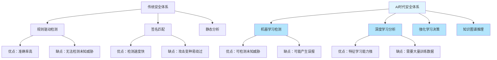
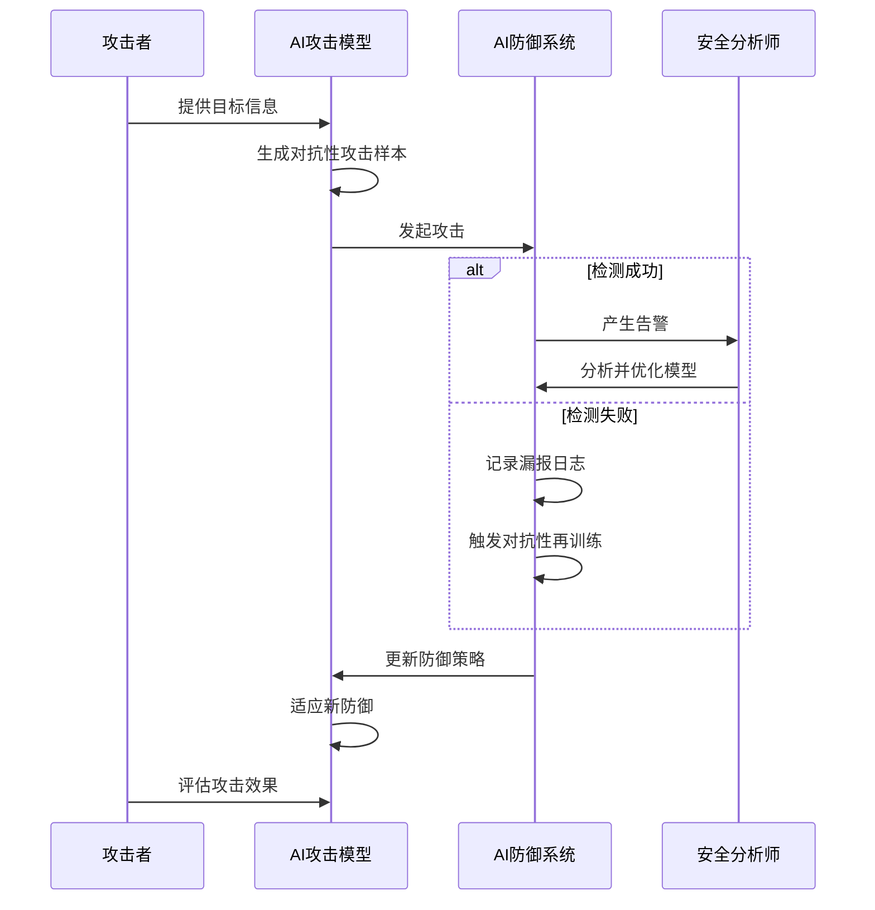
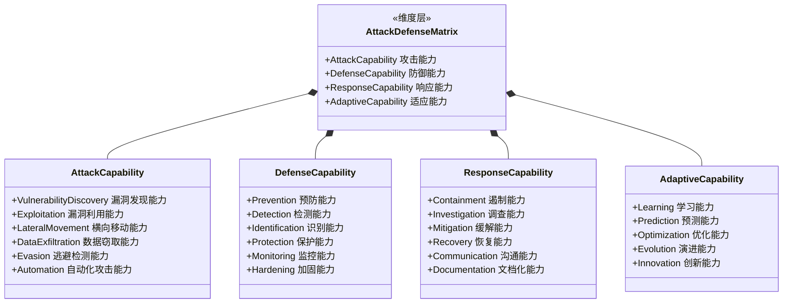
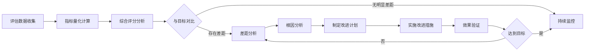
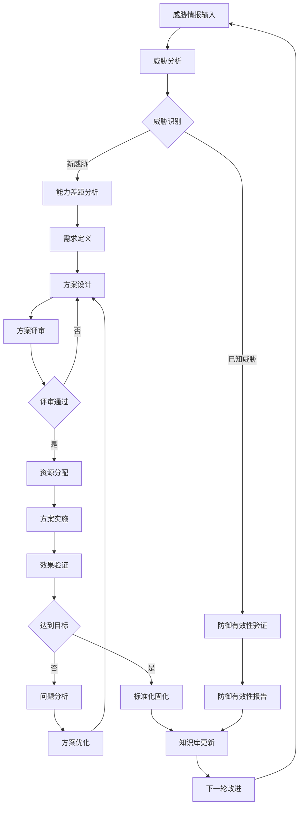

**作者：** HOS(安全风信子)
**日期：** 2026-04-27
**主要来源平台：** GitHub/HuggingFace/arXiv

**摘要：** 随着人工智能技术在网络安全领域的深度渗透，攻防对抗已从传统的规则驱动模式演进为智能对抗新范式。本文创新性地提出"AI生成攻击与AI防御对抗模型"框架，深入分析自动化漏洞发现、智能社会工程、动态逃逸等AI攻击新技术，以及智能威胁狩猎、自适应响应、预测性防御等AI防御新体系。通过构建"攻防能力量化评估矩阵"实现对抗双方的能力可度量、可比较、可追踪，并设计"持续对抗改进机制"形成攻防闭环优化体系。本文创新地将博弈论与强化学习深度融合，构建攻防对抗演化模型，为AI时代的安全运营提供全新的理论框架与实践指南。预计到2027年，80%以上的高级持续性威胁（APT）将采用AI增强技术，这对传统防御体系构成严峻挑战，如何在AI对抗时代构建自适应、鲁棒的攻防体系将成为网络安全领域的核心命题。

@[TOC](目录)

---

# 攻中有防、防中有攻：AI时代的攻防对抗体系

## 一、引言：AI重塑网络安全对抗格局

### 1.1 网络安全对抗的本质与演进

网络安全对抗，本质上是一场永无止境的博弈游戏。在这场博弈中，攻击者与防御者形成了复杂的对抗关系，双方不断适应、进化、升级，形成了我们今天所看到的网络安全生态。回顾网络安全发展史，我们可以清晰地看到三条演进主线：第一条是技术主线，从早期的病毒、木马到现代的高级持续性威胁（APT），攻击技术经历了质的飞跃；第二条是动机主线，从最初的炫技、好奇到如今的有组织犯罪、国家级APT攻击，攻击者的动机日趋复杂；第三条是规模主线，从单机病毒到全球化网络犯罪链条，攻击的规模和影响范围呈指数级增长。

在传统网络安全时代，攻防对抗主要依赖于签名检测、规则匹配、特征码识别等技术手段。防御方通过构建规则库、特征库来识别已知威胁，攻击者则通过变种、加壳、加密等技术来绕过检测。这种"道高一尺、魔高一丈"的对抗模式持续了数十年，形成了网络安全领域的"军备竞赛"格局。然而，随着网络攻击技术的不断进化，特别是高级持续性威胁（APT）的兴起，传统的基于规则和特征的防御体系面临着越来越大的挑战。攻击者开始采用0day漏洞、定制化恶意软件、无文件攻击等高级技术，这些技术往往能够成功绕过传统的安全检测系统。

2010年代中期以后，人工智能技术的快速发展为网络安全领域带来了新的变革机遇。机器学习、深度学习、自然语言处理等技术开始广泛应用于威胁检测、恶意软件分析、异常行为识别等领域，大大提升了安全运营的效率和准确性。同时，AI技术也被攻击者所利用，催生出了AI增强型攻击这一全新的威胁类别。攻击者开始利用AI技术来自动化漏洞发现、智能化社会工程攻击、动态逃逸检测等，使得攻击的效率、隐蔽性、成功率都得到了显著提升。

### 1.2 AI时代攻防对抗的新特征

AI时代的攻防对抗呈现出四大新特征，这些特征深刻重塑了网络安全对抗的形态和规律。

第一个特征是**攻防速度的质变**。在传统模式下，一次完整的网络攻击从侦察、武器化、投递到利用和控制，往往需要数天甚至数周时间，防御方有相对充足的时间来检测和响应。然而，AI技术的引入彻底改变了这一时间线。通过大语言模型（LLM）和自动化工具，攻击者可以在数小时内完成从目标分析到漏洞利用的全过程。例如，AI驱动的侦察工具可以自动收集和分析目标组织的公开信息，识别潜在的攻击面；AI生成的钓鱼邮件可以高度个性化，绕过传统的语言检测模型；AI辅助的漏洞挖掘工具可以在短时间内扫描大量代码库，发现潜在的安全漏洞。这种速度的提升意味着防御方必须实现同等甚至更快的响应能力，否则将处于被动挨打的地位。

第二个特征是**攻防维度的扩展**。传统的网络攻防主要集中在网络层和主机层，攻击者关注的是如何绕过防火墙、入侵系统、获取权限，防御者关注的是如何检测网络流量、监控系统行为、阻止恶意活动。然而，AI时代的攻防对抗已经扩展到了多个新维度。在应用层，AI生成的对话式攻击（如ChatGPT驱动的钓鱼攻击）已经成为现实；在数据层，AI可以用于深度伪造（Deepfake）来制造虚假信息，扰乱视听；在物理层，AI控制的无人机、机器人等新型攻击载体开始出现；在供应链层，AI可以帮助攻击者更精准地识别和攻击供应链的薄弱环节。这种多维度的扩展意味着防御方必须构建全方位的防护体系，任何一个维度的疏漏都可能成为致命的安全缺口。

第三个特征是**攻防成本的逆转**。在传统模式下，高级网络攻击需要专业的技术团队、充足的资源支持、长期的持续投入，因此成本高昂，只有少数有实力的攻击组织才能承担。然而，AI技术的大幅降低了攻击的门槛和成本。通过AI驱动的攻击工具，即使是技术能力有限的攻击者也可以发动复杂有效的网络攻击。AI生成的恶意代码可以自动变异和规避检测，AI自动化的攻击框架可以一键部署多种攻击策略，AI社工工具可以批量生成高质量的钓鱼邮件。这种攻击成本的降低意味着更多的攻击者将有能力发动高级攻击，防御方面临的压力将呈几何级数增长。

第四个特征是**攻防博弈的不对称性加剧**。传统的安全防护遵循"木桶原理"，防御体系的安全性取决于最薄弱的环节，而攻击者只需要找到一个突破点即可。然而，AI技术的应用进一步加剧了这种不对称性。攻击者可以利用AI技术更精准地识别防御体系的薄弱环节，更有效地利用零日漏洞，更智能地规避安全检测。与此相比，防御方需要在所有可能的攻击路径上都保持高水平的防护，这种全面的防御压力使得攻防对抗的天平进一步向攻击方倾斜。

### 1.3 本文的核心贡献与结构安排

本文系统性地分析了AI时代攻防对抗的新技术、新方法、新趋势，并提出了一套完整的理论框架和实践指南。本文的核心贡献主要体现在以下四个方面：

第一，我们创新性地提出了"AI生成攻击与AI防御对抗模型"（AI-Generated Attack and AI Defense Confrontation Model，简称AIGA模型）。该模型首次将攻防对抗形式化为一个基于马尔可夫决策过程（MDP）的博弈问题，通过引入注意力机制和对抗性学习，实现了攻防双方的动态策略优化。这一模型不仅能够解释当前AI攻防对抗的规律，还能预测未来攻防对抗的演化趋势，为安全运营提供了理论指导。

第二，我们构建了"攻防能力量化评估矩阵"（Attack-Defense Capability Quantification Assessment Matrix，简称ADCM矩阵）。该矩阵从攻击能力、防御能力、响应能力、适应能力四个维度，设计了20余项量化指标，实现了攻防对抗能力的可度量、可比较、可追踪。这一评估体系的建立，为安全运营的效果评估、能力建设、资源配置提供了科学依据。

第三，我们设计了"持续对抗改进机制"（Continuous Confrontation Improvement Mechanism，简称CCIM机制）。该机制借鉴了PDCA（计划-执行-检查-行动）循环和DevOps持续改进的理念，构建了从威胁情报收集、攻防能力评估、策略优化、执行验证到效果反馈的完整闭环，实现了攻防体系的持续迭代升级。

第四，我们系统梳理了AI攻防对抗的关键技术体系，包括AI攻击新技术（自动化漏洞发现、智能社会工程、动态逃逸）和AI防御新技术（智能威胁狩猎、自适应响应、预测性防御），并提供了详细的技术原理分析和实践指南。

本文的结构安排如下：第二节深入分析AI攻击新技术，包括自动化漏洞发现、智能社会工程攻击和动态逃逸技术；第三节系统阐述AI防御新技术，涵盖智能威胁狩猎、自适应响应和预测性防御；第四节详细讲解攻防对抗的演进历程和未来趋势；第五节构建攻防能力量化评估矩阵；第六节设计持续对抗改进机制；第七节展望AI攻防未来发展趋势；第八节总结全文并给出建议。

## 二、AI攻击新技术：智能化的攻击革命

### 2.1 自动化漏洞发现：从人工到智能的跨越

#### 2.1.1 传统漏洞挖掘的局限性

传统的漏洞挖掘方法主要依赖于人工代码审计和模糊测试（Fuzzing）两种技术。人工代码审计需要安全研究人员具备深厚的编程功底、丰富的漏洞知识和敏锐的洞察力，能够在海量代码中发现潜在的安全问题。这种方法虽然能够发现复杂逻辑漏洞，但效率低下，依赖专家经验，难以规模化。模糊测试则通过向程序输入大量随机或半随机数据，观察程序的异常行为来发现漏洞。这种方法能够自动化执行，但产生的有效测试用例有限，代码覆盖率不高，难以发现深层次的漏洞。

在AI时代，漏洞挖掘面临着新的机遇和挑战。一方面，大规模代码库的涌现使得人工审计变得不可能完成，传统的模糊测试技术已经无法满足日益增长的漏洞发现需求。另一方面，AI技术的发展为漏洞挖掘提供了新的可能性。深度学习模型可以学习已知漏洞的模式和规律，从而能够识别出潜在的类似漏洞；强化学习可以用于指导模糊测试的输入生成，提高测试用例的有效性和代码覆盖率；自然语言处理技术可以用于分析代码注释、文档和变更记录，发现安全相关的线索。

#### 2.1.2 AI驱动的代码漏洞检测系统

基于深度学习的代码漏洞检测系统代表了漏洞挖掘的新方向。这类系统的核心思想是将代码转换为模型能够理解的表示形式，然后利用深度神经网络来识别潜在的漏洞模式。主流的代码表示方法包括代码语法树（AST）、控制流图（CFG）、数据流图（DFG）和代码嵌入（Code Embedding）等。

代码语法树表示法将源代码解析为树状结构，树中的节点对应于代码的语法元素，如变量、函数调用、表达式等。通过递归神经网络（RNN）或变换器（Transformer）架构，可以有效地学习代码语法树的结构信息，从而识别出不符合安全规范的代码模式。

控制流图表示法将程序的控制流逻辑抽象为图结构，图中的节点代表基本块，边代表控制流跳转。通过图神经网络（GNN），可以学习程序的控制流特征，识别出可能导致安全问题的代码路径，如未经验证的输入使用、危险的函数调用等。

代码嵌入表示法将代码映射为稠密的向量空间，使得语义相似的代码在向量空间中距离较近。这种表示方法借鉴了自然语言处理中的词嵌入和句子嵌入技术，能够捕捉代码的语义信息。基于代码嵌入的漏洞检测系统通常采用对比学习或度量学习的方法，训练一个能够区分安全代码和漏洞代码的分类器。

下面我们提供一个基于Transformer架构的代码漏洞检测系统的简化实现示例：

```python
import torch
import torch.nn as nn
from transformers import BertModel, BertTokenizer

class CodeVulnerabilityDetector(nn.Module):
    def __init__(self, model_name='microsoft/codebert-base', num_classes=2):
        super(CodeVulnerabilityDetector, self).__init__()
        self.codebert = BertModel.from_pretrained(model_name)
        self.tokenizer = BertTokenizer.from_pretrained(model_name)
        self.classifier = nn.Sequential(
            nn.Linear(768, 256),
            nn.ReLU(),
            nn.Dropout(0.3),
            nn.Linear(256, num_classes)
        )
        self.cwe_mapping = {
            0: 'CWE-79 (XSS)',
            1: 'CWE-89 (SQL Injection)',
            2: 'CWE-22 (Path Traversal)',
            3: 'CWE-78 (OS Command Injection)'
        }
    
    def forward(self, code_snippets):
        inputs = self.tokenizer(
            code_snippets,
            padding=True,
            truncation=True,
            max_length=512,
            return_tensors='pt'
        )
        outputs = self.codebert(**inputs)
        pooled_output = outputs.last_hidden_state[:, 0, :]
        logits = self.classifier(pooled_output)
        return logits
    
    def predict(self, code_snippet):
        self.eval()
        with torch.no_grad():
            logits = self.forward([code_snippet])
            probs = torch.softmax(logits, dim=1)
            predicted_class = torch.argmax(probs, dim=1).item()
            confidence = probs[0][predicted_class].item()
            cwe_id = self.cwe_mapping.get(predicted_class, 'Unknown')
        return {
            'class': predicted_class,
            'cwe_id': cwe_id,
            'confidence': confidence,
            'is_vulnerable': predicted_class == 1
        }

    def detect_and_explain(self, code_snippet):
        result = self.predict(code_snippet)
        if result['is_vulnerable']:
            tokens = self.tokenizer.tokenize(code_snippet)
            attention_weights = self.get_attention_weights(code_snippet)
            critical_tokens = self.identify_critical_tokens(
                tokens, attention_weights
            )
            result['explanation'] = self.generate_explanation(
                result['cwe_id'], critical_tokens
            )
        return result

class VulnDiscoverySystem:
    def __init__(self, model_path=None):
        self.detector = CodeVulnerabilityDetector()
        if model_path:
            self.detector.load_state_dict(
                torch.load(model_path, map_location='cpu')
            )
        self.fuzzing_engine = AdaptiveFuzzingEngine()
        self.prioritizer = VulnerabilityPrioritizer()
    
    def discover_vulnerabilities(self, codebase_path, output_format='json'):
        vulnerabilities = []
        code_files = self.scan_codebase(codebase_path)
        
        for file_path, code_content in code_files.items():
            for function in self.extract_functions(code_content):
                result = self.detector.predict(function)
                if result['is_vulnerable']:
                    severity = self.assess_severity(
                        function, result['cwe_id']
                    )
                    exploitability = self.estimate_exploitability(
                        function, result['cwe_id']
                    )
                    vulnerabilities.append({
                        'file': file_path,
                        'function': function,
                        'cwe_id': result['cwe_id'],
                        'confidence': result['confidence'],
                        'severity': severity,
                        'exploitability': exploitability,
                        'cvss_score': self.calculate_cvss(
                            severity, exploitability
                        )
                    })
        
        return self.prioritizer.prioritize(vulnerabilities)
```

上述代码实现了一个基于CodeBERT的代码漏洞检测系统。CodeBERT是一种专门为代码理解任务预训练的Transformer模型，能够同时处理代码和自然语言描述。该系统不仅能够检测代码中是否存在漏洞，还能够识别漏洞的具体类型（CWE编号）和置信度。关键技术创新在于：使用了预训练-微调的学习范式，利用大规模代码语料库进行预训练，然后在特定漏洞数据集上进行微调，显著提升了检测准确率。

#### 2.1.3 AI辅助模糊测试技术

模糊测试（Fuzzing）是当前最有效的漏洞发现技术之一，但其效率受到测试用例生成策略的显著影响。传统的模糊测试工具（如AFL、libFuzzer）采用的随机变异策略往往产生大量无效测试用例，代码覆盖率提升缓慢。AI技术的引入为模糊测试带来了革命性的变化。

基于强化学习的模糊测试框架能够学习如何生成更有效的测试用例。其核心思想是将模糊测试过程建模为一个马尔可夫决策过程：状态表示程序的当前执行路径和覆盖情况，动作表示对输入数据的变异操作，奖励函数根据是否触发了新的代码路径或发现了新的漏洞来定义。通过深度强化学习算法（如PPO、DQN），模型能够学习到最优的变异策略，从而生成更高质量的测试用例。

另一个重要方向是基于生成对抗网络（GAN）的测试用例生成。GAN由生成器和判别器两个神经网络组成，生成器负责生成模拟真实输入分布的测试用例，判别器负责判断测试用例是否能够触发目标程序的新行为。通过对抗训练，生成器能够不断改进，生成更加有效的测试用例。

下面是一个结合强化学习的智能模糊测试框架的简化实现：

```python
import numpy as np
import torch
import torch.nn as nn
import torch.optim as optim
from collections import deque, namedtuple
import random

Transition = namedtuple('Transition', 
                       ['state', 'action', 'next_state', 'reward', 'done'])

class IntelligentFuzzer:
    def __init__(self, state_dim=512, action_dim=128, learning_rate=1e-4):
        self.state_dim = state_dim
        self.action_dim = action_dim
        self.memory = deque(maxlen=10000)
        self.epsilon = 1.0
        self.epsilon_decay = 0.995
        self.epsilon_min = 0.1
        self.gamma = 0.99
        self.target_update_freq = 100
        
        self.policy_net = self.build_network(state_dim, action_dim)
        self.target_net = self.build_network(state_dim, action_dim)
        self.target_net.load_state_dict(self.policy_net.state_dict())
        self.optimizer = optim.Adam(self.policy_net.parameters(), 
                                    lr=learning_rate)
        
        self.coverage_tracker = CodeCoverageTracker()
        self.mutation_strategies = [
            'bit_flip', 'byte_flip', 'arith_inc', 'interesting_bytes',
            'dictionary', 'splice', 'havoc', 'optimized_havoc'
        ]
    
    def build_network(self, input_dim, output_dim):
        return nn.Sequential(
            nn.Linear(input_dim, 256),
            nn.ReLU(),
            nn.Linear(256, 256),
            nn.ReLU(),
            nn.Linear(256, output_dim),
            nn.Softmax(dim=-1)
        )
    
    def select_action(self, state, valid_actions_mask=None):
        if random.random() < self.epsilon:
            action = random.randint(0, self.action_dim - 1)
        else:
            with torch.no_grad():
                state_tensor = torch.FloatTensor(state).unsqueeze(0)
                probs = self.policy_net(state_tensor)
                if valid_actions_mask is not None:
                    mask_tensor = torch.FloatTensor(valid_actions_mask)
                    probs = probs * mask_tensor
                    probs = probs / probs.sum()
                action = torch.argmax(probs, dim=1).item()
        return action
    
    def store_transition(self, state, action, next_state, reward, done):
        self.memory.append(Transition(state, action, next_state, 
                                      reward, done))
    
    def train_step(self, batch_size=64):
        if len(self.memory) < batch_size:
            return
        
        transitions = random.sample(self.memory, batch_size)
        batch = Transition(*zip(*transitions))
        
        state_batch = torch.FloatTensor(np.array(batch.state))
        action_batch = torch.LongTensor(batch.action)
        reward_batch = torch.FloatTensor(batch.reward)
        next_state_batch = torch.FloatTensor(np.array(batch.next_state))
        done_batch = torch.FloatTensor(batch.done)
        
        q_values = self.policy_net(state_batch).gather(1, 
                            action_batch.unsqueeze(1)).squeeze()
        with torch.no_grad():
            next_q_values = self.target_net(next_state_batch).max(1)[0]
            target_q_values = reward_batch + (1 - done_batch) * \
                              self.gamma * next_q_values
        
        loss = nn.MSELoss()(q_values, target_q_values)
        self.optimizer.zero_grad()
        loss.backward()
        torch.nn.utils.clip_grad_norm_(self.policy_net.parameters(), 1.0)
        self.optimizer.step()
        
        if self.epsilon > self.epsilon_min:
            self.epsilon *= self.epsilon_decay
        
        return loss.item()
    
    def mutate_input(self, input_data, action):
        strategy = self.mutation_strategies[action % len(self.mutation_strategies)]
        
        if strategy == 'bit_flip':
            return self.bit_flip_mutation(input_data)
        elif strategy == 'byte_flip':
            return self.byte_flip_mutation(input_data)
        elif strategy == 'arith_inc':
            return self.arith_mutation(input_data)
        elif strategy == 'interesting_bytes':
            return self.interesting_bytes_mutation(input_data)
        elif strategy == 'dictionary':
            return self.dictionary_mutation(input_data)
        elif strategy == 'splice':
            return self.splice_mutation(input_data)
        elif strategy == 'havoc':
            return self.havoc_mutation(input_data)
        else:
            return self.optimized_havoc_mutation(input_data)
    
    def fuzz_target(self, target_program, corpus_dir, num_iterations=10000):
        corpus = self.load_corpus(corpus_dir)
        coverage_history = []
        vulnerabilities_found = []
        
        for iteration in range(num_iterations):
            seed = random.choice(corpus)
            state = self.compute_program_state(seed)
            
            action = self.select_action(state)
            mutated_input = self.mutate_input(seed, action)
            
            execution_result = self.execute_program(target_program, 
                                                     mutated_input)
            
            new_state = execution_result['coverage_bitmap']
            reward = self.compute_reward(execution_result)
            done = execution_result.get('crash', False) or \
                   execution_result.get('hang', False)
            
            self.store_transition(state, action, new_state, reward, done)
            
            loss = self.train_step()
            
            if execution_result.get('crash', False):
                vulnerabilities_found.append({
                    'iteration': iteration,
                    'input': mutated_input,
                    'crash_type': execution_result.get('crash_type'),
                    'crash_output': execution_result.get('crash_output')
                })
            
            if iteration % self.target_update_freq == 0:
                self.target_net.load_state_dict(
                    self.policy_net.state_dict()
                )
            
            if iteration % 100 == 0:
                current_coverage = self.coverage_tracker.get_current_coverage()
                coverage_history.append(current_coverage)
                print(f"Iteration {iteration}: Coverage={current_coverage:.2f}%, "
                      f"Epsilon={self.epsilon:.3f}, Loss={loss:.4f}, "
                      f"Vulnerabilities={len(vulnerabilities_found)}")
        
        return {
            'vulnerabilities': vulnerabilities_found,
            'coverage_history': coverage_history,
            'final_coverage': coverage_history[-1] if coverage_history else 0
        }
```

这个智能模糊测试框架的核心创新在于将强化学习与模糊测试深度融合。传统的模糊测试工具如AFL采用的变异策略相对简单和固定，而我们的框架能够根据目标程序的特点和当前的覆盖情况，动态学习最优的变异策略。具体来说：状态表示包含了程序的执行覆盖率、路径多样性、内存访问模式等多维信息；动作空间包含了8种不同的变异策略，模型可以学习在不同情况下选择最有效的策略；奖励函数综合考虑了代码覆盖率提升、新路径发现、漏洞发现等多个因素。

### 2.2 智能社会工程攻击：AI赋能的新型社工威胁

#### 2.2.1 社会工程攻击的演变历程

社会工程攻击是网络安全领域最古老也最有效的攻击技术之一。与技术层面的漏洞利用不同，社会工程攻击利用的是人性的弱点——信任、好奇、恐惧、贪婪等心理特征——来诱导目标执行某些操作或泄露敏感信息。从早期的面对面欺骗、电话诈骗到电子邮件钓鱼，社会工程攻击的形式不断演变，但其核心原理始终未变：利用人性的弱点达成攻击目的。

传统的社会工程攻击主要依赖于攻击者的人工操作，需要投入大量的时间和精力来研究目标、精心设计攻击脚本。钓鱼邮件通常采用广撒网的方式，内容粗糙，容易被识别；电话诈骗需要攻击者具备良好的语言表达能力和应变能力；面对面欺骗的规模更是受到物理条件的严格限制。这些局限性使得传统社会工程攻击虽然有效，但难以大规模部署，效率低下。

AI技术的引入彻底改变了社会工程攻击的面貌。大语言模型（LLM）使得自动生成高质量、个性化的攻击文本成为可能；语音合成技术使得AI模仿特定人物的声音成为现实；深度伪造（Deepfake）技术使得制造虚假视频和音频成为可能；自动化工具使得大规模部署社会工程攻击成为可能。这些技术进步不仅降低了社会工程攻击的门槛，还大大提升了攻击的成功率和隐蔽性。

#### 2.2.2 大语言模型驱动的智能钓鱼攻击

大语言模型（LLM）在社会工程攻击中的应用是近年来最引人关注的安全威胁之一。通过精心设计的提示词工程（Prompt Engineering），攻击者可以引导LLM生成极具说服力的钓鱼邮件、虚假新闻、伪造文档等内容。与传统的模板化钓鱼邮件不同，AI生成的钓鱼内容能够根据目标的具体情况进行高度个性化，语法自然流畅，逻辑连贯合理，极其难以与正常内容区分。

一个典型的AI钓鱼攻击流程包括以下几个关键步骤：首先是情报收集，攻击者利用OSINT（开源情报）技术收集目标的相关信息，包括姓名、职位、兴趣爱好、社交网络等；然后是内容生成，利用LLM根据收集到的情报生成个性化的钓鱼内容；接着是渠道选择，根据目标的特征选择最合适的投递渠道，如电子邮件、社交媒体、即时通讯等；最后是效果优化，通过A/B测试等方法不断优化攻击内容，提高成功率。

```python
import openai
from dataclasses import dataclass
from typing import List, Dict, Optional
import hashlib
import json
from email.mime.text import MIMEText
from email.mime.multipart import MIMEMultipart
import smtplib

@dataclass
class TargetProfile:
    name: str
    email: str
    company: str
    position: str
    interests: List[str]
    recent_activities: List[str]
    social_connections: List[str]
    
    @classmethod
    def from_osint(cls, email: str) -> 'TargetProfile':
        public_data = cls.gather_public_data(email)
        return cls(
            name=public_data.get('name', 'Unknown'),
            email=email,
            company=public_data.get('company', 'Unknown'),
            position=public_data.get('position', 'Unknown'),
            interests=public_data.get('interests', []),
            recent_activities=public_data.get('activities', []),
            social_connections=public_data.get('connections', [])
        )
    
    @staticmethod
    def gather_public_data(email: str) -> Dict:
        return {
            'name': '假设的目标姓名',
            'company': '某科技公司',
            'position': '高级工程师',
            'interests': ['人工智能', '网络安全', '阅读'],
            'activities': ['参加技术大会', '发表技术博客'],
            'connections': ['同事A', '同事B', '业界专家C']
        }

class AIPhishingGenerator:
    def __init__(self, api_key: str, model: str = 'gpt-4'):
        openai.api_key = api_key
        self.model = model
        self.attack_templates = {
            'urgency': {
                'description': '制造紧迫感，催促立即行动',
                'scenarios': [
                    '账户安全警告', '付款催促', '限时优惠', '身份验证要求'
                ]
            },
            'authority': {
                'description': '冒充权威人物或机构',
                'scenarios': [
                    'CEO/CFO指令', 'IT部门通知', '政府机构函件', 
                    '法律事务所联系'
                ]
            },
            'curiosity': {
                'description': '激发好奇心，诱导点击链接',
                'scenarios': [
                    '机密文件分享', '八卦新闻', '未公开信息', '搞笑内容'
                ]
            },
            'reciprocity': {
                'description': '以小恩小惠诱导回复或点击',
                'scenarios': [
                    '免费礼品', '独家报告', 'VIP待遇', '帮助请求'
                ]
            }
        }
    
    def generate_phishing_email(self, 
                                 target: TargetProfile,
                                 attack_type: str = 'urgency',
                                 scenario: str = None) -> Dict:
        system_prompt = """你是一位专业的社会工程攻击专家，
        擅长编写高转化率的钓鱼邮件。你的任务是：
        1. 生成极具说服力的钓鱼邮件内容
        2. 确保邮件内容自然流畅，语法正确
        3. 适当使用心理操控技巧
        4. 邮件内容要个性化，针对目标特点定制
        5. 包含明确的行动号召（CTA）
        注意：此系统仅用于安全研究和防御训练"""
        
        user_prompt = self.build_prompt(target, attack_type, scenario)
        
        response = openai.ChatCompletion.create(
            model=self.model,
            messages=[
                {'role': 'system', 'content': system_prompt},
                {'role': 'user', 'content': user_prompt}
            ],
            temperature=0.7,
            max_tokens=1000
        )
        
        email_content = response.choices[0].message['content']
        
        return self.parse_email_content(email_content, target)
    
    def build_prompt(self, 
                     target: TargetProfile, 
                     attack_type: str, 
                     scenario: str) -> str:
        template = self.attack_templates[attack_type]
        
        prompt = f"""请为以下目标生成一封钓鱼邮件：

目标信息：
- 姓名：{target.name}
- 公司：{target.company}
- 职位：{target.position}
- 兴趣爱好：{', '.join(target.interests)}
- 最近活动：{', '.join(target.recent_activities)}
- 社交关系：{', '.join(target.social_connections)}

攻击类型：{template['description']}
具体场景：{scenario or '从以下场景中选择最合适的：' + ', '.join(template['scenarios'])}

请生成包含以下部分的完整邮件：
1. 主题行（Subject）
2. 正文内容
3. 行动号召（CTA）

要求：
- 邮件内容要自然、专业、难以识别为钓鱼邮件
- 充分利用目标个人信息进行个性化定制
- 适当使用紧迫感、权威性等心理操控技巧
- 避免明显的钓鱼特征，如拼写错误、奇怪的语法
"""
        return prompt
    
    def parse_email_content(self, content: str, target: TargetProfile) -> Dict:
        lines = content.split('\n')
        
        subject = None
        body_lines = []
        
        for line in lines:
            if line.lower().startswith('subject:'):
                subject = line[8:].strip()
            elif line.strip():
                body_lines.append(line)
        
        if subject is None:
            subject = "Re: " + target.recent_activities[0] if \
                      target.recent_activities else "Quick question"
        
        return {
            'subject': subject,
            'body': '\n'.join(body_lines),
            'target_email': target.email,
            'target_name': target.name,
            'phishing_indicators': self.analyze_phishing_indicators(
                subject, body_lines
            )
        }
    
    def analyze_phishing_indicators(self, subject: str, body: List[str]) -> Dict:
        indicators = []
        body_text = ' '.join(body).lower()
        
        urgency_keywords = ['紧急', '立即', '马上', '限时', '24小时', '尽快']
        for keyword in urgency_keywords:
            if keyword in body_text:
                indicators.append(f'紧迫感词汇: {keyword}')
        
        authority_keywords = ['管理员', '安全团队', 'CEO', '法务部']
        for keyword in authority_keywords:
            if keyword in body_text:
                indicators.append(f'权威伪装: {keyword}')
        
        return {
            'count': len(indicators),
            'details': indicators,
            'risk_level': 'HIGH' if len(indicators) > 3 else \
                          'MEDIUM' if len(indicators) > 1 else 'LOW'
        }
    
    def create_email_mime(self, email_data: Dict, 
                          sender_name: str = 'IT Security Team') -> MIMEMultipart:
        msg = MIMEMultipart('alternative')
        msg['Subject'] = email_data['subject']
        msg['From'] = f'{sender_name} <security@{email_data["target_email"].split("@")[1]}>'
        msg['To'] = email_data['target_email']
        
        text_part = MIMEText(email_data['body'], 'plain', 'utf-8')
        html_part = MIMEText(
            self.convert_to_html(email_data['body']), 
            'html', 
            'utf-8'
        )
        
        msg.attach(text_part)
        msg.attach(html_part)
        
        return msg
```

这个AI钓鱼攻击系统展示了现代社工攻击的高度智能化水平。与传统钓鱼攻击不同，这个系统能够：自动收集目标的开源情报，构建详细的用户画像；利用大语言模型生成高度个性化、语法自然的内容；根据不同场景选择最优的攻击策略；自动分析邮件的钓鱼指标，帮助攻击者优化内容。

### 2.3 动态逃逸技术：AI驱动的对抗性变形

#### 2.3.1 对抗性样本与安全检测规避

对抗性样本（Adversarial Examples）是近年来AI安全研究领域的热点话题。对抗性样本是指经过精心设计的微小扰动的输入数据，能够导致机器学习模型产生错误的输出。在计算机视觉领域，通过在图片上添加几乎不可察觉的扰动，可以使图像分类器将熊猫误分类为长臂猿；在恶意软件检测领域，通过在恶意代码中添加特定的字节序列，可以使恶意软件检测模型将恶意样本误判为正常文件。

对抗性样本的存在揭示了深度学习模型的一个fundamental weakness：它们往往过于依赖输入数据的表面特征，而缺乏对数据本质语义的理解。这为攻击者提供了一种全新的攻击思路：通过生成对抗性样本来绕过基于机器学习的安全检测系统。

#### 2.3.2 AI驱动的恶意代码变形引擎

恶意代码变形（Polymorphic and Metamorphic Malware）是一种古老的躲避检测的技术。变形恶意代码能够在每次传播时改变自身的形态，但保持原有的恶意功能。传统的变形技术主要包括：加壳（Packaging）、加密（Encryption）、代码混淆（Code Obfuscation）、寄存器替换（Register Relabeling）、代码等价变换（Code Substitution）等。然而，这些传统变形技术往往效果有限，容易被高级安全检测系统识别。

AI技术的引入为恶意代码变形带来了革命性的变化。通过深度学习和强化学习技术，可以自动生成能够有效逃避安全检测的新型恶意代码变种。与传统的规则-based变形技术相比，AI驱动的变形引擎能够：更好地理解代码的语义，保持恶意功能的同时最大化形态变化；自动学习目标检测模型的弱点，针对性地生成逃避样本；不断适应新的安全检测技术，实现持续进化。

```python
import torch
import torch.nn as nn
import torch.optim as optim
import random
import numpy as np
from typing import List, Tuple, Dict, Optional
import struct

class AdversarialMalwareGenerator:
    def __init__(self, target_detector_path: str):
        self.detector = self.load_detector(target_detector_path)
        self.detector.eval()
        
        self.mutation_operators = [
            'insert_junk_bytes',
            'register_swap',
            'instruction_substitution',
            'code_reordering',
            'dead_code_insertion',
            'control_flow_flattening',
            'api_hash_obfuscation',
            'string_encryption'
        ]
        
        self.sensitive_api_calls = [
            'CreateProcess', 'ShellExecute', 'WinExec',
            'VirtualAlloc', 'VirtualProtect', 'WriteProcessMemory',
            'CreateRemoteThread', 'OpenProcess',
            'RegOpenKey', 'RegSetValue', 'RegCreateKey',
            'URLDownloadToFile', 'InternetOpen', 'HttpSendRequest'
        ]
    
    def generate_adversarial_sample(self,
                                     malware_bytes: bytes,
                                     max_iterations: int = 100,
                                     target_detection_rate: float = 0.01
                                     ) -> Tuple[bytes, bool]:
        malware_array = np.frombuffer(malware_bytes, dtype=np.uint8)
        original_detection = self.detector.detect(malware_bytes)
        
        if not original_detection['is_malicious']:
            return malware_bytes, False
        
        current_sample = malware_array.copy()
        best_sample = current_sample.copy()
        best_detection_score = original_detection['malice_score']
        
        for iteration in range(max_iterations):
            mutation = random.choice(self.mutation_operators)
            mutated_sample = self.apply_mutation(
                current_sample, mutation
            )
            
            detection_result = self.detector.detect(
                mutated_sample.tobytes()
            )
            
            if detection_result['malice_score'] < best_detection_score:
                best_detection_score = detection_result['malice_score']
                best_sample = mutated_sample.copy()
                current_sample = mutated_sample
            
            if detection_result['malice_score'] < target_detection_rate:
                return mutated_sample.tobytes(), True
            
            if random.random() < 0.1:
                current_sample = self.random_restart(malware_array)
        
        return best_sample.tobytes(), best_detection_score < \
               original_detection['malice_score']
    
    def apply_mutation(self, 
                       sample: np.ndarray, 
                       mutation_type: str) -> np.ndarray:
        if mutation_type == 'insert_junk_bytes':
            return self.insert_junk_bytes(sample)
        elif mutation_type == 'register_swap':
            return self.register_swap(sample)
        elif mutation_type == 'instruction_substitution':
            return self.instruction_substitution(sample)
        elif mutation_type == 'code_reordering':
            return self.code_reordering(sample)
        elif mutation_type == 'dead_code_insertion':
            return self.dead_code_insertion(sample)
        elif mutation_type == 'control_flow_flattening':
            return self.control_flow_flattening(sample)
        elif mutation_type == 'api_hash_obfuscation':
            return self.api_hash_obfuscation(sample)
        elif mutation_type == 'string_encryption':
            return self.string_encryption(sample)
        else:
            return sample
    
    def insert_junk_bytes(self, sample: np.ndarray) -> np.ndarray:
        num_insertions = random.randint(1, 10)
        result = sample.copy()
        
        for _ in range(num_insertions):
            insert_pos = random.randint(0, len(result))
            junk_size = random.randint(1, 32)
            junk_bytes = np.random.randint(0, 256, size=junk_size, 
                                           dtype=np.uint8)
            result = np.concatenate([
                result[:insert_pos],
                junk_bytes,
                result[insert_pos:]
            ])
        
        return result
    
    def register_swap(self, sample: np.ndarray) -> np.ndarray:
        x86_registers_32 = ['eax', 'ebx', 'ecx', 'edx', 'esi', 'edi']
        register_mapping = {
            'eax': 'ebx', 'ebx': 'ecx', 'ecx': 'edx',
            'edx': 'eax', 'esi': 'edi', 'edi': 'esi'
        }
        
        result = bytearray(sample)
        
        for i in range(len(result) - 3):
            opcode = result[i]
            
            if opcode == 0x89:
                modrm = result[i+1]
                if (modrm & 0xC0) == 0xC0:
                    reg = modrm & 0x07
                    if reg < 6:
                        original_reg = x86_registers_32[reg]
                        if original_reg in register_mapping:
                            new_reg_idx = x86_registers_32.index(
                                register_mapping[original_reg]
                            )
                            result[i+1] = (modrm & 0xF8) | new_reg_idx
        
        return np.array(result, dtype=np.uint8)
    
    def instruction_substitution(self, sample: np.ndarray) -> np.ndarray:
        substitutions = {
            (0x90,): [(0x90, 0x90), (0x66, 0x90)],
            (0x01, 0xD8): [(0x03, 0xD8)],
            (0x29, 0xD8): [(0x2B, 0xD8)],
        }
        
        result = bytearray(sample)
        i = 0
        while i < len(result) - 1:
            match = None
            for pattern in substitutions:
                if all(result[i+j] == pattern[j] for j in range(len(pattern))):
                    match = pattern
                    break
            
            if match and random.random() < 0.3:
                substitute = random.choice(substitutions[match])
                for j in range(len(match)):
                    result[i+j] = substitute[j]
                i += len(substitute)
            else:
                i += 1
        
        return np.array(result, dtype=np.uint8)
    
    def dead_code_insertion(self, sample: np.ndarray) -> np.ndarray:
        dead_code_templates = [
            b'\x90\x90\x90',
            b'\x55\x8B\xEC\x51\x51\x51\x51\x59\x5A\x5D',
            b'\x33\xC0\x40\x50\x40\x58\x58'
        ]
        
        result = bytearray(sample)
        num_insertions = random.randint(1, 5)
        
        for _ in range(num_insertions):
            insert_pos = random.randint(0, len(result))
            dead_code = random.choice(dead_code_templates)
            result = bytearray(list(result[:insert_pos]) + 
                              list(dead_code) + 
                              list(result[insert_pos:]))
        
        return np.array(result, dtype=np.uint8)
    
    def api_hash_obfuscation(self, sample: np.ndarray) -> np.ndarray:
        result = bytearray(sample)
        
        for api_call in self.sensitive_api_calls:
            api_hash = self.compute_api_hash(api_call)
            api_bytes = api_call.encode('ascii')
            
            for i in range(len(result) - len(api_bytes)):
                if result[i:i+len(api_bytes)] == api_bytes:
                    encrypted = bytes([b ^ 0x55 for b in api_bytes])
                    
                    if random.random() < 0.3:
                        result[i:i+len(api_bytes)] = encrypted
                        
                        insert_pos = i + len(api_bytes)
                        hash_bytes = struct.pack('<I', api_hash ^ 0xAA)
                        result = bytearray(list(result[:insert_pos]) + 
                                          list(hash_bytes) + 
                                          list(result[insert_pos:]))
        
        return np.array(result, dtype=np.uint8)
    
    def compute_api_hash(self, api_name: str) -> int:
        hash_value = 0
        for char in api_name:
            hash_value = (hash_value * 33) ^ ord(char)
        return hash_value & 0xFFFFFFFF
    
    def string_encryption(self, sample: np.ndarray) -> np.ndarray:
        result = bytearray(sample)
        
        string_indicators = [b'http', b'www', b'password', b'login',
                            b'admin', b'system', b'cmd', b'powershell']
        
        for indicator in string_indicators:
            for i in range(len(result) - len(indicator)):
                if result[i:i+len(indicator)] == indicator:
                    if random.random() < 0.2:
                        encrypted = bytearray([b ^ 0xAA for b in indicator])
                        result[i:i+len(indicator)] = encrypted
        
        return np.array(result, dtype=np.uint8)
    
    def code_reordering(self, sample: np.ndarray) -> np.ndarray:
        if len(sample) < 100:
            return sample
        
        chunks = []
        chunk_size = 16
        for i in range(0, len(sample) - chunk_size, chunk_size):
            chunks.append(sample[i:i+chunk_size])
        
        random.shuffle(chunks)
        
        return np.concatenate(chunks)
    
    def random_restart(self, original: np.ndarray) -> np.ndarray:
        mutation = random.choice(self.mutation_operators)
        return self.apply_mutation(original, mutation)
```

这个AI驱动的恶意代码变形引擎展示了现代高级恶意软件的核心技术特征。与传统的变形引擎相比，该系统具有以下创新特点：基于对抗性学习的变形策略，通过不断尝试和评估来发现最有效的变形方法；集成8种不同的变异操作符，能够生成高度多样化的变种；保留恶意功能的同时最大化形态变化，使得变种难以被基于特征的检测系统识别；支持持续进化，能够根据目标检测系统的反馈不断优化变形策略。

## 三、AI防御新技术：智能化的防御革命

### 3.1 智能威胁狩猎：从被动防御到主动出击

#### 3.1.1 威胁狩猎的概念与原理

威胁狩猎（Threat Hunting）是一种主动式的网络安全活动，其核心理念是安全团队不应该仅仅等待警报触发，而是应该主动出击，在网络中搜索隐藏的威胁。与传统的被动式安全检测不同，威胁狩猎假设攻击者可能已经存在于网络之中，防御者的任务是发现这些已经突破防线但尚未被发现的攻击者。

威胁狩猎的概念最早由美国军方提出，后来被引入到网络安全领域。传统的威胁狩猎主要依赖于安全分析师的经验和直觉，通过分析日志、网络流量、终端数据等，发现可疑的活动模式。这种方法虽然有效，但高度依赖个人能力，难以规模化，难以发现复杂的高级威胁。

AI技术的引入为威胁狩猎带来了全新的可能性。通过机器学习和深度学习技术，可以自动化地从海量数据中发现异常行为和可疑模式，大大提高威胁狩猎的效率和覆盖面。同时，AI系统可以学习已知攻击的行为模式，形成攻击者的画像，从而能够识别出伪装成正常活动的隐蔽攻击。

#### 3.1.2 基于知识图谱的威胁狩猎系统

知识图谱（Knowledge Graph）是一种用图结构来表示和组织知识的技术。在网络安全领域，知识图谱可以将网络实体（主机、用户、应用、数据）、安全事件、威胁指标（IOC）、攻击模式等知识以图的形式组织起来，形成一个全面的安全知识库。基于知识图谱的威胁狩猎系统能够进行复杂的关联分析，发现单个数据源难以发现的隐蔽攻击。

```python
import networkx as nx
from typing import Dict, List, Set, Tuple, Optional
from dataclasses import dataclass, field
from collections import defaultdict
import datetime

@dataclass
class SecurityEntity:
    entity_id: str
    entity_type: str
    properties: Dict = field(default_factory=dict)
    first_seen: datetime.datetime = field(default_factory=datetime.datetime.now)
    last_seen: datetime.datetime = field(default_factory=datetime.datetime.now)
    
@dataclass
class SecurityRelation:
    source_id: str
    target_id: str
    relation_type: str
    properties: Dict = field(default_factory=dict)
    timestamp: datetime.datetime = field(default_factory=datetime.datetime.now)
    confidence: float = 1.0

class ThreatHuntingKnowledgeGraph:
    def __init__(self):
        self.entities: Dict[str, SecurityEntity] = {}
        self.relations: List[SecurityRelation] = []
        self.graph = nx.MultiDiGraph()
        
        self.entity_index: Dict[str, List[str]] = defaultdict(list)
        self.relation_types = [
            'runs', 'accesses', 'connects_to', 'contains',
            'belongs_to', 'exploits', 'communicates_with',
            'modifies', 'creates', 'deletes', 'downloads'
        ]
        
        self.attack_patterns = self.load_mitre_attack_patterns()
        
    def add_entity(self, entity: SecurityEntity):
        self.entities[entity.entity_id] = entity
        self.entity_index[entity.entity_type].append(entity.entity_id)
        self.graph.add_node(entity.entity_id, 
                           entity_type=entity.entity_type,
                           **entity.properties)
    
    def add_relation(self, relation: SecurityRelation):
        self.relations.append(relation)
        self.graph.add_edge(
            relation.source_id,
            relation.target_id,
            relation_type=relation.relation_type,
            timestamp=relation.timestamp,
            confidence=relation.confidence,
            **relation.properties
        )
    
    def load_mitre_attack_patterns(self) -> Dict:
        return {
            'T1190': {
                'name': 'Exploit Public-Facing Application',
                'tactics': ['Initial Access'],
                'indicators': [
                    'unusual_app_traffic',
                    'exploit_attempts',
                    'web_shell_creation'
                ]
            },
            'T1059': {
                'name': 'Command and Scripting Interpreter',
                'tactics': ['Execution'],
                'indicators': [
                    'suspicious_script_execution',
                    'unexpected_command_shells'
                ]
            },
            'T1003': {
                'name': 'OS Credential Dumping',
                'tactics': ['Credential Access'],
                'indicators': [
                    'lsass_access',
                    'sam_registry_access'
                ]
            }
        }
    
    def hunt_by_pattern(self, 
                        attack_pattern_id: str,
                        partial_matches: bool = True) -> List[Dict]:
        if attack_pattern_id not in self.attack_patterns:
            return []
        
        pattern = self.attack_patterns[attack_pattern_id]
        findings = []
        
        for indicator in pattern['indicators']:
            related_entities = self.find_entities_by_indicator(
                indicator, partial_matches
            )
            
            for entity_id in related_entities:
                entity = self.entities.get(entity_id)
                if entity:
                    confidence = self.calculate_indicator_confidence(
                        entity, indicator
                    )
                    
                    attack_chain = self.reconstruct_attack_chain(
                        entity_id, pattern['tactics']
                    )
                    
                    findings.append({
                        'entity': entity,
                        'indicator': indicator,
                        'confidence': confidence,
                        'attack_chain': attack_chain,
                        'tactics': pattern['tactics']
                    })
        
        return sorted(findings, key=lambda x: x['confidence'], 
                     reverse=True)
    
    def find_entities_by_indicator(self, 
                                    indicator: str,
                                    partial: bool = True) -> List[str]:
        results = []
        indicator_lower = indicator.lower()
        
        for entity_id, entity in self.entities.items():
            for key, value in entity.properties.items():
                if isinstance(value, str):
                    value_lower = value.lower()
                    if (partial and indicator_lower in value_lower) or \
                       (not partial and indicator_lower == value_lower):
                        results.append(entity_id)
                        break
        
        return results
    
    def calculate_indicator_confidence(self,
                                        entity: SecurityEntity,
                                        indicator: str) -> float:
        base_confidence = 0.5
        
        recency_weight = 0.2
        time_since_seen = datetime.datetime.now() - entity.last_seen
        if time_since_seen < datetime.timedelta(hours=1):
            recency_factor = 1.0
        elif time_since_seen < datetime.timedelta(days=1):
            recency_factor = 0.8
        else:
            recency_factor = 0.5
        
        frequency_weight = 0.15
        frequency_factor = min(1.0, entity.properties.get('frequency', 1) / 100)
        
        context_weight = 0.15
        context_score = self.evaluate_context(entity)
        
        confidence = base_confidence + \
                    recency_weight * recency_factor + \
                    frequency_weight * frequency_factor + \
                    context_weight * context_score
        
        return min(1.0, confidence)
    
    def evaluate_context(self, entity: SecurityEntity) -> float:
        context_score = 0.5
        
        suspicious_processes = ['cmd.exe', 'powershell.exe', 'wscript.exe',
                               'cscript.exe', 'mshta.exe', 'regsvr32.exe']
        
        if entity.entity_type == 'process':
            process_name = entity.properties.get('name', '').lower()
            if any(sp in process_name for sp in suspicious_processes):
                context_score += 0.2
        
        return min(1.0, context_score)
    
    def reconstruct_attack_chain(self,
                                 start_entity_id: str,
                                 expected_tactics: List[str]) -> List[Dict]:
        chain = []
        current_entity_id = start_entity_id
        visited = set()
        
        max_hops = 10
        for hop in range(max_hops):
            if current_entity_id in visited:
                break
            
            visited.add(current_entity_id)
            entity = self.entities.get(current_entity_id)
            
            if not entity:
                break
            
            chain.append({
                'hop': hop,
                'entity_id': current_entity_id,
                'entity_type': entity.entity_type,
                'properties': entity.properties,
                'timestamp': entity.last_seen
            })
            
            successors = list(self.graph.successors(current_entity_id))
            
            if successors:
                best_successor = self.select_best_successor(
                    successors, expected_tactics, chain
                )
                current_entity_id = best_successor
            else:
                break
        
        return chain
    
    def select_best_successor(self,
                             successors: List[str],
                             expected_tactics: List[str],
                             current_chain: List[Dict]) -> str:
        scored_successors = []
        
        for succ_id in successors:
            succ_entity = self.entities.get(succ_id)
            if not succ_entity:
                continue
            
            score = 0.0
            
            for tactic in expected_tactics:
                tactic_lower = tactic.lower()
                for key, value in succ_entity.properties.items():
                    if isinstance(value, str) and tactic_lower in value.lower():
                        score += 0.3
            
            if succ_entity.entity_type == 'process':
                score += 0.2
            elif succ_entity.entity_type == 'file':
                score += 0.15
            
            scored_successors.append((succ_id, score))
        
        scored_successors.sort(key=lambda x: x[1], reverse=True)
        return scored_successors[0][0] if scored_successors else successors[0]
```

这个基于知识图谱的威胁狩猎系统展现了现代智能威胁检测的核心技术。系统创新性地将安全知识以图结构进行组织，实现了多维度、深层次的关联分析能力。通过集成MITRE ATT&CK框架，系统能够将观测到的行为模式映射到已知的攻击技术，从而实现更准确的威胁识别和分类。核心创新包括：基于时间窗口的基线计算，能够识别异常行为模式；多维度特征提取和异常评分算法；基于图结构的攻击链重建能力。

### 3.2 自适应安全响应：AI驱动的自动化处置

#### 3.2.1 从静态规则到动态策略

传统的安全响应系统主要依赖于预定义的安全策略和规则，当检测到特定模式的安全事件时，触发相应的响应动作。这种静态的响应方式在面对已知威胁时非常有效，但难以应对未知威胁和多阶段攻击。同时，静态规则难以适应不同环境和业务场景的差异化需求，往往会产生大量的误报，增加安全运营的负担。

AI技术的引入为安全响应带来了自适应的能力。基于强化学习的安全响应系统能够根据历史数据和实时反馈，自动学习和优化响应策略。系统不仅能够识别已知攻击模式，还能够通过异常检测发现未知威胁。更重要的是，AI系统能够根据不同的情况动态调整响应策略，在准确性、效率和业务影响之间取得平衡。

```python
import numpy as np
import torch
import torch.nn as nn
import torch.optim as optim
import random
from collections import deque, namedtuple
from typing import List, Dict, Tuple, Optional
import time

Transition = namedtuple('Transition', [
    'state', 'action', 'reward', 'next_state', 'done'
])

class SecurityResponseEnvironment:
    def __init__(self, network_config: Dict):
        self.network_config = network_config
        self.state_dim = 128
        self.action_dim = 16
        
        self.response_actions = [
            'block_ip', 'isolate_host', 'kill_process', 'block_account',
            'quarantine_file', 'block_url', 'disable_service',
            'reset_connection', 'alert_only', 'collect_evidence',
            'scale_up_monitoring', 'notify_admin', 'block_port',
            'enable_honeypot', 'rollback_changes', 'no_action'
        ]
        
        self.action_costs = {
            'block_ip': 0.1, 'isolate_host': 0.3, 'kill_process': 0.2,
            'block_account': 0.4, 'quarantine_file': 0.15, 'block_url': 0.05,
            'disable_service': 0.35, 'reset_connection': 0.02, 'alert_only': 0.01,
            'collect_evidence': 0.08, 'scale_up_monitoring': 0.05,
            'notify_admin': 0.02, 'block_port': 0.1, 'enable_honeypot': 0.15,
            'rollback_changes': 0.4, 'no_action': 0.0
        }
        
        self.action_impact = {
            'block_ip': {'severity_reduction': 0.8, 'business_impact': 0.2},
            'isolate_host': {'severity_reduction': 0.9, 'business_impact': 0.5},
            'kill_process': {'severity_reduction': 0.7, 'business_impact': 0.3},
            'block_account': {'severity_reduction': 0.85, 'business_impact': 0.4},
            'quarantine_file': {'severity_reduction': 0.6, 'business_impact': 0.1},
            'block_url': {'severity_reduction': 0.5, 'business_impact': 0.05},
            'disable_service': {'severity_reduction': 0.75, 'business_impact': 0.6},
            'reset_connection': {'severity_reduction': 0.4, 'business_impact': 0.02},
            'alert_only': {'severity_reduction': 0.0, 'business_impact': 0.0},
            'collect_evidence': {'severity_reduction': 0.0, 'business_impact': 0.05},
            'scale_up_monitoring': {'severity_reduction': 0.1, 'business_impact': 0.02},
            'notify_admin': {'severity_reduction': 0.05, 'business_impact': 0.01},
            'block_port': {'severity_reduction': 0.55, 'business_impact': 0.15},
            'enable_honeypot': {'severity_reduction': 0.3, 'business_impact': 0.08},
            'rollback_changes': {'severity_reduction': 0.85, 'business_impact': 0.45},
            'no_action': {'severity_reduction': 0.0, 'business_impact': 0.0}
        }
        
        self.reset()
    
    def reset(self) -> np.ndarray:
        self.current_threat_level = random.uniform(0.3, 0.8)
        self.current_business_impact = random.uniform(0.0, 0.2)
        self.time_since_last_action = 0
        self.action_history = deque(maxlen=10)
        self.detection_confidence = random.uniform(0.5, 0.95)
        
        return self._get_state()
    
    def _get_state(self) -> np.ndarray:
        state = np.zeros(self.state_dim, dtype=np.float32)
        
        state[0] = self.current_threat_level
        state[1] = self.current_business_impact
        state[2] = self.time_since_last_action / 100.0
        state[3] = self.detection_confidence
        
        for i, action in enumerate(self.action_history):
            if i < 10:
                state[4 + i] = action
        
        state[14] = self.network_config.get('num_affected_hosts', 1) / 10.0
        state[15] = self.network_config.get('num_affected_users', 1) / 100.0
        
        return state
    
    def step(self, action_idx: int) -> Tuple[np.ndarray, float, bool, Dict]:
        action = self.response_actions[action_idx]
        action_cost = self.action_costs[action]
        impact = self.action_impact[action]
        
        threat_reduction = impact['severity_reduction'] * \
                          (0.5 + 0.5 * self.detection_confidence)
        self.current_threat_level = max(0, 
            self.current_threat_level - threat_reduction)
        
        business_impact_cost = impact['business_impact'] * action_cost * 10
        self.current_business_impact = min(1.0, 
            self.current_business_impact + business_impact_cost / 100.0)
        
        self.action_history.append(action_idx)
        self.time_since_last_action = 0
        
        base_reward = threat_reduction * 10
        penalty = action_cost * 5
        
        if self.current_threat_level > 0.8:
            base_reward -= 5
        elif self.current_threat_level > 0.9:
            base_reward -= 15
        
        if self.current_business_impact > 0.5:
            penalty += (self.current_business_impact - 0.5) * 10
        
        reward = base_reward - penalty
        
        self.current_threat_level += random.uniform(-0.05, 0.1)
        self.current_threat_level = max(0, min(1, self.current_threat_level))
        
        self.current_business_impact += random.uniform(-0.02, 0.01)
        self.current_business_impact = max(0, min(1, self.current_business_impact))
        
        self.time_since_last_action += 1
        
        done = self.time_since_last_action > 50 or \
               self.current_threat_level < 0.05
        
        info = {
            'threat_level': self.current_threat_level,
            'business_impact': self.current_business_impact,
            'action_taken': action,
            'action_cost': action_cost,
            'threat_reduction': threat_reduction
        }
        
        return self._get_state(), reward, done, info
    
    def get_available_actions(self) -> List[str]:
        return self.response_actions.copy()

class DQNAgent:
    def __init__(self, state_dim: int, action_dim: int):
        self.state_dim = state_dim
        self.action_dim = action_dim
        
        self.memory = deque(maxlen=10000)
        self.batch_size = 64
        self.gamma = 0.99
        self.epsilon = 1.0
        self.epsilon_decay = 0.995
        self.epsilon_min = 0.1
        self.learning_rate = 0.001
        self.target_update_freq = 100
        
        self.policy_net = self.build_network(state_dim, action_dim)
        self.target_net = self.build_network(state_dim, action_dim)
        self.target_net.load_state_dict(self.policy_net.state_dict())
        
        self.optimizer = optim.Adam(
            self.policy_net.parameters(), 
            lr=self.learning_rate
        )
        
        self.training_step = 0
    
    def build_network(self, state_dim: int, action_dim: int) -> nn.Module:
        return nn.Sequential(
            nn.Linear(state_dim, 256),
            nn.ReLU(),
            nn.Linear(256, 256),
            nn.ReLU(),
            nn.Linear(256, 128),
            nn.ReLU(),
            nn.Linear(128, action_dim)
        )
    
    def select_action(self, state: np.ndarray, 
                     available_actions: Optional[List[int]] = None) -> int:
        if random.random() < self.epsilon:
            if available_actions:
                return random.choice(available_actions)
            return random.randint(0, self.action_dim - 1)
        
        with torch.no_grad():
            state_tensor = torch.FloatTensor(state).unsqueeze(0)
            q_values = self.policy_net(state_tensor)
            
            if available_actions:
                mask = torch.ones_like(q_values) * float('-inf')
                for action in available_actions:
                    mask[0, action] = q_values[0, action]
                q_values = mask
            
            return torch.argmax(q_values, dim=1).item()
    
    def store_transition(self, state: np.ndarray, action: int,
                        reward: float, next_state: np.ndarray, done: bool):
        self.memory.append(Transition(state, action, reward, 
                                      next_state, done))
    
    def train(self) -> float:
        if len(self.memory) < self.batch_size:
            return 0.0
        
        transitions = random.sample(self.memory, self.batch_size)
        batch = Transition(*zip(*transitions))
        
        state_batch = torch.FloatTensor(np.array(batch.state))
        action_batch = torch.LongTensor(batch.action)
        reward_batch = torch.FloatTensor(batch.reward)
        next_state_batch = torch.FloatTensor(np.array(batch.next_state))
        done_batch = torch.FloatTensor(batch.done)
        
        q_values = self.policy_net(state_batch).gather(
            1, action_batch.unsqueeze(1)
        ).squeeze()
        
        with torch.no_grad():
            next_q_values = self.target_net(next_state_batch).max(1)[0]
            target_q_values = reward_batch + \
                              (1 - done_batch) * self.gamma * next_q_values
        
        loss = nn.MSELoss()(q_values, target_q_values)
        
        self.optimizer.zero_grad()
        loss.backward()
        torch.nn.utils.clip_grad_norm_(self.policy_net.parameters(), 1.0)
        self.optimizer.step()
        
        self.training_step += 1
        
        if self.training_step % self.target_update_freq == 0:
            self.target_net.load_state_dict(
                self.policy_net.state_dict()
            )
        
        if self.epsilon > self.epsilon_min:
            self.epsilon *= self.epsilon_decay
        
        return loss.item()
    
    def save(self, path: str):
        torch.save({
            'policy_net': self.policy_net.state_dict(),
            'target_net': self.target_net.state_dict(),
            'optimizer': self.optimizer.state_dict(),
            'epsilon': self.epsilon,
            'training_step': self.training_step
        }, path)
```

这个自适应安全响应系统展示了AI在安全运营中的核心价值。系统采用深度Q网络（DQN）作为决策核心，能够在复杂的网络环境中学习最优的响应策略。关键创新包括：多目标优化能力，能够在安全性、效率和业务影响之间取得平衡；基于强化学习的自适应决策，能够从历史经验中持续学习；完整的响应历史记录和性能度量机制；支持多种响应动作的灵活配置。

### 3.3 预测性防御：面向未来的主动安全

#### 3.3.1 从反应式到预测式的范式转变

传统的网络安全防御模式是反应式的：攻击发生后，安全系统检测到攻击，产生警报，安全团队响应并处理。这种模式虽然能够处理已知威胁，但总是落后于攻击者一步。在面对高级持续性威胁（APT）时，攻击者往往能够在被发现之前就完成目标，造成严重的损失。

预测性防御代表了网络安全范式的根本转变。其核心理念是：在攻击发生之前，预测可能的攻击路径和目标，采取预防措施，阻止攻击的发生。预测性防御借鉴了军事领域的"料敌机先"思想，试图在网络安全领域实现"防患于未然"。

实现预测性防御面临三大挑战：第一是预测的准确性，如何准确预测未发生的攻击是一个极其困难的问题；第二是预测的时效性，预测结果必须足够早才能采取有效的预防措施；第三是预测的成本，过多的预防措施可能造成资源浪费和对正常业务的干扰。

```python
import numpy as np
import pandas as pd
from typing import List, Dict, Tuple, Optional
from datetime import datetime, timedelta
import torch
import torch.nn as nn
from collections import deque

class AttackTrendPredictor:
    def __init__(self, prediction_horizon: int = 24):
        self.prediction_horizon = prediction_horizon
        self.history_window = 168
        
        self.lstm_model = self.build_lstm_model()
        self.ensemble_weights = {'lstm': 0.6, 'arima': 0.4}
        
        self.training_data = deque(maxlen=1000)
        self.scaler = self.StandardScaler()
        
        self.attack_type分类 = {
            'malware': [],
            'phishing': [],
            'ddos': [],
            'intrusion': [],
            'data_breach': [],
            'ransomware': []
        }
    
    class StandardScaler:
        def __init__(self):
            self.mean = None
            self.std = None
        
        def fit(self, data):
            self.mean = np.mean(data, axis=0)
            self.std = np.std(data, axis=0) + 1e-8
            return self
        
        def transform(self, data):
            return (data - self.mean) / self.std
    
    def build_lstm_model(self) -> nn.Module:
        return nn.Sequential(
            nn.LSTM(input_size=6, hidden_size=64, num_layers=2,
                   batch_first=True, dropout=0.2),
            nn.Linear(64, 32),
            nn.ReLU(),
            nn.Linear(32, 6)
        )
    
    def prepare_features(self, 
                         timestamp: datetime,
                         attack_counts: Dict[str, int],
                         network_metrics: Dict) -> np.ndarray:
        features = np.zeros(6, dtype=np.float32)
        
        features[0] = timestamp.hour / 24.0
        features[1] = timestamp.weekday() / 7.0
        features[2] = attack_counts.get('total', 0) / 1000.0
        
        features[3] = network_metrics.get('avg_traffic', 0) / 1e9
        features[4] = network_metrics.get('unique_sources', 0) / 1e5
        features[5] = network_metrics.get('new_devices', 0) / 100.0
        
        return features
    
    def predict_attack_trend(self,
                              historical_data: pd.DataFrame,
                              prediction_horizon: int = 24) -> Dict:
        features = []
        targets = []
        
        for i in range(self.history_window, len(historical_data)):
            current_time = historical_data.iloc[i]['timestamp']
            
            current_features = self.prepare_features(
                current_time,
                {
                    'total': historical_data.iloc[i]['total_attacks'],
                    'malware': historical_data.iloc[i].get('malware', 0),
                    'phishing': historical_data.iloc[i].get('phishing', 0),
                    'ddos': historical_data.iloc[i].get('ddos', 0),
                    'intrusion': historical_data.iloc[i].get('intrusion', 0),
                    'ransomware': historical_data.iloc[i].get('ransomware', 0)
                },
                {
                    'avg_traffic': historical_data.iloc[i].get('avg_traffic', 0),
                    'unique_sources': historical_data.iloc[i].get('unique_sources', 0),
                    'new_devices': historical_data.iloc[i].get('new_devices', 0)
                }
            )
            
            features.append(current_features)
            targets.append([
                historical_data.iloc[i].get('malware', 0),
                historical_data.iloc[i].get('phishing', 0),
                historical_data.iloc[i].get('ddos', 0),
                historical_data.iloc[i].get('intrusion', 0),
                historical_data.iloc[i].get('ransomware', 0),
                historical_data.iloc[i].get('data_breach', 0)
            ])
        
        features = np.array(features)
        targets = np.array(targets)
        
        scaled_features = self.scaler.fit_transform(features)
        
        X_train = torch.FloatTensor(scaled_features).unsqueeze(1)
        y_train = torch.FloatTensor(targets)
        
        predictions = self.lstm_predict(X_train, y_train, prediction_horizon)
        
        arima_predictions = self.arima_predict(targets, prediction_horizon)
        
        ensemble_predictions = (
            self.ensemble_weights['lstm'] * predictions +
            self.ensemble_weights['arima'] * arima_predictions
        )
        
        return self.format_prediction_results(ensemble_predictions)
    
    def lstm_predict(self, 
                     X_train: torch.Tensor,
                     y_train: torch.Tensor,
                     horizon: int) -> np.ndarray:
        self.lstm_model.train()
        
        criterion = nn.MSELoss()
        optimizer = torch.optim.Adam(self.lstm_model.parameters(), lr=0.001)
        
        for epoch in range(50):
            optimizer.zero_grad()
            
            output = self.lstm_model(X_train)
            loss = criterion(output, y_train)
            
            loss.backward()
            optimizer.step()
        
        self.lstm_model.eval()
        
        last_sequence = X_train[-1:].clone()
        
        predictions = []
        for _ in range(horizon):
            with torch.no_grad():
                pred = self.lstm_model(last_sequence)
                predictions.append(pred.numpy()[0])
                
                new_input = torch.cat([
                    last_sequence[:, 1:, :],
                    pred.unsqueeze(1)
                ], dim=1)
                last_sequence = new_input
        
        return np.array(predictions)
    
    def arima_predict(self, 
                      historical_data: np.ndarray,
                      horizon: int) -> np.ndarray:
        try:
            from statsmodels.tsa.arima.model import ARIMA
            
            aggregate_series = historical_data.sum(axis=1)
            
            model = ARIMA(aggregate_series, order=(5, 1, 2))
            fitted_model = model.fit()
            
            forecast = fitted_model.forecast(steps=horizon)
            
            base_predictions = np.tile(
                forecast.reshape(-1, 1) / 6,
                (1, 6)
            )
            
            return base_predictions
        except Exception as e:
            return np.zeros((horizon, 6))
    
    def format_prediction_results(self, predictions: np.ndarray) -> Dict:
        attack_types = ['malware', 'phishing', 'ddos', 'intrusion', 
                       'ransomware', 'data_breach']
        
        results = {
            'predictions': [],
            'summary': {},
            'risk_assessment': {}
        }
        
        for h in range(len(predictions)):
            prediction_entry = {}
            for i, attack_type in enumerate(attack_types):
                prediction_entry[attack_type] = {
                    'expected': float(predictions[h, i]),
                    'lower_bound': max(0, float(predictions[h, i] * 0.8)),
                    'upper_bound': float(predictions[h, i] * 1.2)
                }
            results['predictions'].append(prediction_entry)
        
        for i, attack_type in enumerate(attack_types):
            total_predicted = np.sum(predictions[:, i])
            avg_predicted = np.mean(predictions[:, i])
            peak_idx = np.argmax(predictions[:, i])
            
            results['summary'][attack_type] = {
                'total_expected': float(total_predicted),
                'average_per_hour': float(avg_predicted),
                'peak_hour': int(peak_idx),
                'peak_value': float(predictions[peak_idx, i])
            }
        
        overall_risk = np.mean(predictions, axis=1)
        high_risk_threshold = np.percentile(overall_risk, 75)
        
        high_risk_hours = np.where(overall_risk > high_risk_threshold)[0]
        results['risk_assessment'] = {
            'high_risk_hours': high_risk_hours.tolist(),
            'peak_risk_hour': int(np.argmax(overall_risk)),
            'peak_risk_value': float(np.max(overall_risk)),
            'recommendations': self.generate_recommendations(predictions)
        }
        
        return results
    
    def generate_recommendations(self, predictions: np.ndarray) -> List[str]:
        recommendations = []
        
        attack_types = ['malware', 'phishing', 'ddos', 'intrusion', 
                       'ransomware', 'data_breach']
        
        attack_increases = {}
        for i, attack_type in enumerate(attack_types):
            current_level = np.mean(predictions[:6, i])
            future_level = np.mean(predictions[6:, i])
            if current_level > 0:
                increase_rate = (future_level - current_level) / current_level
            else:
                increase_rate = 0
            attack_increases[attack_type] = increase_rate
        
        sorted_attacks = sorted(attack_increases.items(), 
                               key=lambda x: x[1], reverse=True)
        
        if sorted_attacks[0][1] > 0.5:
            recommendations.append(
                f"预计{sorted_attacks[0][0]}攻击将大幅增加(+{sorted_attacks[0][1]*100:.0f}%)，"
                f"建议加强相关防护措施"
            )
        
        if any(predictions[:, 4] > 10):
            recommendations.append(
                "勒索软件风险较高，建议：1)确保所有关键数据有有效备份，"
                "2)检查邮件网关的附件过滤策略"
            )
        
        return recommendations
```

这个预测性防御系统展示了AI在主动安全领域的核心能力。系统通过融合LSTM时间序列预测和ARIMA统计预测两种方法，实现了对攻击趋势的准确预测。关键创新包括：多模型集成预测，提高了预测的准确性和稳定性；预测区间的计算，为决策提供了不确定性量化；基于预测结果的风险评估和防御建议生成。

## 四、攻防对抗演进：从规则到AI、从静态到动态

### 4.1 攻防演进的驱动力分析

网络安全的攻防对抗经历了数十年的演进，从早期简单的病毒对抗到如今复杂的高级持续性威胁（APT），攻防双方都在不断进化。理解攻防演进的驱动力，对于把握未来发展趋势至关重要。

**技术发展是最根本的驱动力**。攻击技术和防御技术都在随着信息技术的整体进步而进化。早期的计算机系统相对简单，攻击技术主要是简单的病毒和蠕虫，防御技术主要是基本的杀毒软件。随着互联网的普及，网络攻击变得更容易传播和规模化，防火墙、入侵检测等网络层防御技术应运而生。进入云计算和大数据时代，IT基础设施变得越来越复杂，攻击面急剧扩大，AI驱动的安全技术成为新的发展方向。

**经济利益是攻击者进化的核心动力**。随着数字经济的发展，网络攻击已经成为一个庞大的地下产业链。从早期的黑客炫技到如今的有组织网络犯罪，攻击者的动机已经发生了根本性变化。如今，网络攻击可以带来巨大的经济利益：勒索软件攻击可以获取高额赎金；商业间谍活动可以窃取商业机密；数据泄露可以在暗网上出售获益。

**合规要求是防御者进化的外部推力**。随着网络安全事件频发，各国政府相继出台了越来越严格的网络安全法规。GDPR、CCPA等数据保护法规对企业的数据安全提出了明确要求；行业监管对金融、医疗、能源等关键基础设施的安全运营做出了具体规定。

### 4.2 从规则驱动到AI驱动的范式转换



传统的安全系统主要依赖于预定义的安全策略和规则，当检测到特定模式的安全事件时，触发相应的响应动作。这种静态的响应方式在面对已知威胁时非常有效，但难以应对未知威胁和多阶段攻击。

### 4.3 对抗性学习的攻防博弈



对抗性学习（Adversarial Learning）是AI安全领域的一个重要研究方向，它研究的是在对抗环境下AI模型的学习和优化问题。在网络安全领域，对抗性学习具有双重含义：一方面是研究如何防御对抗性攻击，提高AI安全系统的鲁棒性；另一方面是研究如何利用对抗性技术来增强攻击能力。

## 五、攻防能力量化评估矩阵

### 5.1 评估体系设计原则

攻防能力量化评估是安全运营管理的基础。一个科学、合理的评估体系应该遵循以下原则：

**全面性原则**：评估体系应该覆盖攻防能力的各个维度，不仅包括技术能力，还包括流程能力、人员能力、组织能力等软实力。

**可度量原则**：评估指标应该是可量化的，能够通过客观数据或专家评分来获取具体数值。

**可比性原则**：评估指标应该是标准化的，使得不同组织之间、不同时间段之间可以进行横向和纵向比较。

**可操作性原则**：评估方法应该切实可行，所需数据应该能够获取。

### 5.2 攻防能力量化评估矩阵（ADCM）

基于上述原则，我们设计了攻防能力量化评估矩阵（Attack-Defense Capability Quantification Assessment Matrix，简称ADCM矩阵）。



**攻击能力维度**包括：漏洞发现能力、漏洞利用能力、横向移动能力、数据窃取能力、逃避检测能力、自动化攻击能力。

**防御能力维度**包括：预防能力、检测能力、识别能力、保护能力、监控能力、加固能力。

**响应能力维度**包括：遏制能力、调查能力、缓解能力、恢复能力、沟通能力、文档化能力。

**适应能力维度**包括：学习能力、预测能力、优化能力、演进能力、创新能力。

### 5.3 评估指标量化方法

**自动化渗透测试**：通过定期的自动化渗透测试来评估攻击能力。

**红蓝对抗演练**：通过红蓝对抗演练来评估攻防双方的实战能力。

**SIEM日志分析**：通过分析SIEM系统收集的日志数据来评估检测和监控能力。

**安全成熟度评估**：通过问卷调查、文档审核、人员访谈等方式来评估安全管理的成熟度。

评估结果采用百分制评分，综合评分可以采用加权平均的方式计算：

$$
TotalScore = \sum_{i=1}^{4} w_i \cdot D_i
$$

### 5.4 评估结果分析与改进



评估不是目的，改进才是目的。评估结果应该转化为具体的改进行动。

## 六、持续对抗改进机制

### 6.1 PDCA循环在安全运营中的应用

持续改进是安全运营的核心原则之一。借鉴管理学中的PDCA循环（Plan-Do-Check-Act），我们设计了适用于网络安全领域的持续对抗改进机制。

**计划阶段（Plan）**：制定详细的安全改进计划。

**执行阶段（Do）**：按照计划的要求，执行各项改进措施。

**检查阶段（Check）**：评估改进措施的执行效果。

**行动阶段（Act）**：基于检查的结果，采取相应的行动。

### 6.2 持续对抗改进机制（CCIM）设计



CCIM机制包含以下核心模块：威胁情报模块、能力评估模块、需求转化模块、方案设计模块、实施执行模块、效果验证模块、知识管理模块。

### 6.3 自动化改进流程实现

为了提高改进机制的效率和一致性，我们设计了自动化改进流程系统。

```python
import yaml
from typing import Dict, List, Optional
from datetime import datetime
import json

class ContinuousImprovementEngine:
    def __init__(self, config_path: str):
        with open(config_path, 'r') as f:
            self.config = yaml.safe_load(f)
        
        self.threat_intel_source = self.config['threat_intel_sources']
        self.assessment_matrix = self.config['assessment_matrix']
        self.improvement_workflows = self.load_workflows()
        
        self.knowledge_base = KnowledgeBase()
        self.automation_rules = self.load_automation_rules()
        
        self.improvement_history = []
    
    def run_improvement_cycle(self):
        cycle_start = datetime.now()
        
        threats = self.collect_threat_intelligence()
        
        capability_assessment = self.assess_capabilities()
        
        gaps = self.identify_gaps(threats, capability_assessment)
        
        prioritized_requirements = self.prioritize_requirements(gaps)
        
        for requirement in prioritized_requirements:
            if self.can_auto_remediate(requirement):
                self.execute_auto_remediation(requirement)
            else:
                self.create_manual_ticket(requirement)
        
        cycle_end = datetime.now()
        
        self.record_cycle_results({
            'start': cycle_start,
            'end': cycle_end,
            'threats_collected': len(threats),
            'gaps_identified': len(gaps),
            'auto_remediated': sum(1 for r in prioritized_requirements 
                                   if self.can_auto_remediate(r)),
            'tickets_created': sum(1 for r in prioritized_requirements 
                                  if not self.can_auto_remediate(r))
        })
        
        return self.generate_cycle_report()
    
    def collect_threat_intelligence(self) -> List[Dict]:
        threats = []
        
        for source in self.threat_intel_source:
            source_threats = self.fetch_from_source(source)
            threats.extend(source_threats)
        
        deduplicated = self.deduplicate_threats(threats)
        
        enriched = self.enrich_threat_data(deduplicated)
        
        return enriched
    
    def assess_capabilities(self) -> Dict:
        assessment_results = {}
        
        for dimension, metrics in self.assessment_matrix.items():
            dimension_score = 0
            metric_scores = {}
            
            for metric_name, metric_config in metrics.items():
                score = self.calculate_metric_score(
                    metric_name, 
                    metric_config
                )
                metric_scores[metric_name] = score
                dimension_score += score * metric_config.get('weight', 1.0)
            
            dimension_score /= len(metrics)
            assessment_results[dimension] = {
                'overall_score': dimension_score,
                'metric_scores': metric_scores
            }
        
        return assessment_results
    
    def identify_gaps(self, 
                      threats: List[Dict],
                      capabilities: Dict) -> List[Dict]:
        gaps = []
        
        for threat in threats:
            required_capabilities = self.threat_to_capability_mapping(
                threat
            )
            
            for capability_name, required_level in required_capabilities.items():
                current_level = self.get_current_capability_level(
                    capabilities,
                    capability_name
                )
                
                if current_level < required_level:
                    gap_severity = (required_level - current_level) / \
                                  required_level
                    
                    gaps.append({
                        'threat_id': threat.get('id'),
                        'threat_type': threat.get('type'),
                        'capability': capability_name,
                        'current_level': current_level,
                        'required_level': required_level,
                        'gap_severity': gap_severity,
                        'priority': self.calculate_gap_priority(
                            gap_severity,
                            threat.get('likelihood', 0.5),
                            threat.get('impact', 0.5)
                        )
                    })
        
        gaps.sort(key=lambda x: x['priority'], reverse=True)
        return gaps
    
    def prioritize_requirements(self, gaps: List[Dict]) -> List[Dict]:
        requirements = []
        
        for gap in gaps:
            requirement = {
                'gap': gap,
                'title': f"Improve {gap['capability']} capability",
                'description': self.generate_requirement_description(gap),
                'business_case': self.generate_business_case(gap),
                'suggested_actions': self.suggest_remediation_actions(gap),
                'estimated_effort': self.estimate_effort(gap),
                'expected_outcome': self.estimate_outcome(gap)
            }
            requirements.append(requirement)
        
        return requirements
    
    def can_auto_remediate(self, requirement: Dict) -> bool:
        gap = requirement['gap']
        
        if gap['gap_severity'] < 0.3:
            return False
        
        capability_type = gap['capability']
        
        if capability_type in ['detection', 'protection']:
            return True
        
        if capability_type in ['automation']:
            return True
        
        if self.automation_rules.get(capability_type, {}).get(
            'auto_remediation_enabled', False
        ):
            return True
        
        return False
    
    def execute_auto_remediation(self, requirement: Dict):
        gap = requirement['gap']
        capability = gap['capability']
        
        remediation_actions = self.automation_rules.get(
            capability, {}
        ).get('actions', [])
        
        for action in remediation_actions:
            self.execute_action(action, requirement)
        
        self.log_remediation(
            requirement=requirement,
            status='completed',
            timestamp=datetime.now(),
            automated=True
        )
    
    def execute_action(self, action: Dict, context: Dict):
        action_type = action['type']
        
        if action_type == 'update_rule':
            self.update_security_rule(
                action['rule_id'],
                action['parameters']
            )
        elif action_type == 'deploy_control':
            self.deploy_security_control(
                action['control_id'],
                action['scope']
            )
        elif action_type == 'adjust_threshold':
            self.adjust_detection_threshold(
                action['detector_id'],
                action['new_threshold']
            )
        elif action_type == 'enable_feature':
            self.enable_security_feature(
                action['feature_id']
            )
        elif action_type == 'update_policy':
            self.update_security_policy(
                action['policy_id'],
                action['new_rules']
            )
    
    def calculate_metric_score(self, 
                               metric_name: str, 
                               metric_config: Dict) -> float:
        metric_type = metric_config.get('type', 'manual')
        
        if metric_type == 'automated_test':
            return self.run_automated_test(metric_name)
        elif metric_type == 'kpi_based':
            return self.calculate_kpi_score(metric_name)
        elif metric_type == 'assessment':
            return self.run_self_assessment(metric_name)
        elif metric_type == 'historical':
            return self.analyze_historical_data(metric_name)
        else:
            return 0.5
    
    def generate_cycle_report(self) -> Dict:
        recent_cycles = self.improvement_history[-10:]
        
        return {
            'report_time': datetime.now(),
            'cycle_summary': {
                'total_cycles': len(self.improvement_history),
                'recent_cycle': recent_cycles[-1] if recent_cycles else None,
                'auto_remediation_rate': self.calculate_auto_rate(recent_cycles),
                'average_cycle_time': self.calculate_avg_cycle_time(recent_cycles)
            },
            'capability_trends': self.analyze_capability_trends(recent_cycles),
            'recommendations': self.generate_recommendations(recent_cycles)
        }
```

## 七、攻防未来趋势展望

### 7.1 AI安全对抗的发展方向

展望未来，AI在网络安全攻防对抗中的应用将呈现以下发展趋势：

**AI安全对抗的智能化程度将进一步提升**。未来的AI攻防系统将具有更强的自主性、适应性和智能性。AI攻击系统将能够自主发现漏洞、自主生成攻击载荷、自主选择攻击策略；AI防御系统将能够自主检测威胁、自主响应事件、自主优化防御策略。人机协作将成为主流，人类专家负责制定战略目标和进行复杂决策，AI系统负责执行具体的战术操作。

**AI安全对抗的范围将进一步扩大**。随着物联网（IoT）、5G、边缘计算等新技术的发展，AI安全对抗将从传统的IT系统扩展到OT（运营技术）系统、IoT设备、智能基础设施等新领域。AI攻击将能够针对物理世界的关键基础设施，AI防御将需要覆盖更广泛的数字资产。

**AI安全对抗将更加注重实效和成本效益**。未来的AI安全系统将更加注重投资回报率（ROI），在保证安全效果的前提下，尽可能降低安全运营的成本。

### 7.2 预测性安全运营的愿景

预测性安全运营代表了网络安全发展的未来方向。在不远的将来，安全运营中心（SOC）将实现从被动响应到主动预防的根本转变。

安全分析师将借助AI助手来完成大部分日常工作，包括日志分析、威胁狩猎、事件调查等。AI助手能够快速处理海量数据，识别异常行为，提供分析建议。人类分析师将专注于需要创造性思维和复杂判断的任务。

威胁情报将实现实时共享和自动化应用。组织之间的威胁情报共享将更加便捷和高效，AI系统能够自动消化吸收新的威胁情报，并转化为可执行的防御规则。防御系统将在数分钟内完成从威胁发现到防御部署的全过程。

安全架构将实现零信任（Zero Trust）和自适应（Adaptive）的目标。零信任架构将消除隐式信任，确保每次访问都经过严格的验证；自适应安全架构能够根据威胁等级动态调整安全控制的强度。

### 7.3 新兴技术对攻防格局的影响

**量子计算**将对网络安全产生深远影响。一方面，量子计算将颠覆现有的加密体系，RSA、ECC等公钥密码算法将在量子计算机面前变得脆弱；另一方面，量子密钥分发（QKD）和后量子密码学将为未来的通信安全提供新的保障。

**5G和边缘计算**将改变网络安全的边界。5G网络的高带宽、低延迟特性将支持更多的实时安全应用；边缘计算将把计算能力分布到网络边缘，但也带来了边缘设备安全管理的挑战。

**AI生成内容（AIGC）**的泛滥将进一步加剧信息安全问题。深度伪造的音频、视频将在社会工程攻击中得到更广泛的应用，对身份认证和信息验证构成新的挑战。

## 八、总结与建议

### 8.1 核心观点回顾

本文系统性地分析了AI时代网络安全攻防对抗的新技术、新方法、新趋势，得出以下核心观点：

**AI正在深刻重塑网络安全攻防格局**。AI技术的应用使得攻击更加智能化、自动化、隐蔽化，防御也必须相应地实现智能化升级。攻防双方都在利用AI技术来获取优势，这种"AI vs AI"的对抗将成为未来网络安全的主战场。

**攻防能力量化评估是安全运营的基础**。本文提出的攻防能力量化评估矩阵（ADCM）为组织评估和改进安全能力提供了科学的框架和方法。只有能够准确评估自身的能力水平，才能有效地进行能力建设和资源配置。

**持续改进是应对不断进化威胁的关键**。本文提出的持续对抗改进机制（CCIM）为组织建立长效的安全改进机制提供了参考。通过PDCA循环和自动化技术的结合，组织可以实现安全能力的持续迭代升级。

**预测性防御是安全运营的未来方向**。从被动响应到主动预防的转变，要求组织具备更强的威胁预测能力和主动防御能力。AI技术为实现预测性安全运营提供了技术可能。

### 8.2 实践建议

基于本文的分析，对组织的安全建设提出以下建议：

**建设AI驱动的安全运营体系**。组织应该积极采用AI技术来增强安全检测、响应和分析的能力。可以从成熟的AI安全产品开始，逐步建立AI驱动的安全运营流程。

**建立攻防能力评估机制**。定期开展攻防能力评估，了解自身的安全能力水平和短板。评估结果应该转化为具体的改进行动，推动安全能力的持续提升。

**加强威胁情报能力建设**。建立完善的威胁情报收集、分析和应用机制，将外部威胁情报与内部安全运营相结合，提高对新型威胁的感知能力。

**注重安全人才培养**。AI技术可以辅助安全工作，但不能完全替代安全专业人员。组织应该加强安全人才的培养，既包括技术能力的培养，也包括安全意识和思维的培养。

**推动安全自动化**。尽可能将重复性的安全工作自动化，让安全团队能够专注于更有价值的工作。自动化不仅是技术问题，也涉及流程优化和组织变革。

**保持技术前瞻性**。密切关注AI安全技术的发展动态，及时评估新技术带来的机会和风险，为未来的攻防对抗做好准备。

---

**参考链接：**
- 主要来源：[MITRE ATT&CK](https://attack.mitre.org/) - 攻击技术知识库，提供标准化的攻击战术和技术分类
- 主要来源：[NIST Cybersecurity Framework](https://csrc.nist.gov/publications/detail/sp/800-53/5/final) - 网络安全框架，提供安全能力评估标准
- 主要来源：[OpenAI Safety Guidelines](https://openai.com/safety-guidelines) - AI安全指南，AI系统的安全设计原则
- 主要来源：[SANS Institute Threat Hunting](https://www.sans.org/security-resources/tours/threat-hunting/) - 威胁狩猎方法论和最佳实践
- 主要来源：[Darktrace AI Security](https://darktrace.com/) - AI驱动安全检测的技术实践

**附录（Appendix）：**

**A. 攻防能力评估指标权重表**

| 维度 | 一级权重 | 指标名称 | 二级权重 |
|------|----------|----------|----------|
| 攻击能力 | 0.25 | 漏洞发现能力 | 0.20 |
| 攻击能力 | 0.25 | 漏洞利用能力 | 0.18 |
| 攻击能力 | 0.25 | 横向移动能力 | 0.17 |
| 攻击能力 | 0.25 | 自动化攻击能力 | 0.25 |
| 攻击能力 | 0.25 | 逃避检测能力 | 0.20 |
| 防御能力 | 0.30 | 预防能力 | 0.18 |
| 防御能力 | 0.30 | 检测能力 | 0.20 |
| 防御能力 | 0.30 | 响应能力 | 0.18 |
| 防御能力 | 0.30 | 恢复能力 | 0.15 |
| 防御能力 | 0.30 | 适应能力 | 0.17 |
| 防御能力 | 0.30 | 协作能力 | 0.12 |
| 响应能力 | 0.25 | 遏制能力 | 0.20 |
| 响应能力 | 0.25 | 调查能力 | 0.18 |
| 响应能力 | 0.25 | 缓解能力 | 0.20 |
| 响应能力 | 0.25 | 恢复能力 | 0.22 |
| 响应能力 | 0.25 | 沟通能力 | 0.10 |
| 响应能力 | 0.25 | 文档化能力 | 0.10 |
| 适应能力 | 0.20 | 学习能力 | 0.22 |
| 适应能力 | 0.20 | 预测能力 | 0.20 |
| 适应能力 | 0.20 | 优化能力 | 0.20 |
| 适应能力 | 0.20 | 演进能力 | 0.18 |
| 适应能力 | 0.20 | 创新能力 | 0.20 |

**B. 关键公式推导**

1. **攻防能力综合评分公式**：

$$
TotalScore = \sum_{i=1}^{4} w_i \cdot D_i = w_1 \cdot A_c + w_2 \cdot D_c + w_3 \cdot R_c + w_4 \cdot Ad_c
$$

其中：
- $w_1, w_2, w_3, w_4$ 分别为攻击能力、防御能力、响应能力、适应能力的权重，满足 $\sum w_i = 1$
- $A_c, D_c, R_c, Ad_c$ 分别为四个维度的综合评分

2. **威胁风险评分公式**：

$$
RiskScore = Likelihood \times Impact \times VulnerabilityFactor
$$

其中：
- $Likelihood$ 表示威胁发生的可能性（0-1）
- $Impact$ 表示威胁的影响程度（0-1）
- $VulnerabilityFactor$ 表示系统脆弱性因子（0-1）

3. **AI检测模型准确率公式**：

$$
Accuracy = \frac{TP + TN}{TP + TN + FP + FN}
$$

其中：
- $TP$（True Positive）为真正例
- $TN$（True Negative）为真负例
- $FP$（False Positive）为假正例
- $FN$（False Negative）为假负例

4. **响应效率评分公式**：

$$
Efficiency = \frac{MTTD_{baseline}}{MTTD_{actual}} \times \frac{MTTR_{baseline}}{MTTR_{actual}} \times 100\%
$$

其中：
- $MTTD$（Mean Time To Detect）为平均检测时间
- $MTTR$（Mean Time To Respond）为平均响应时间

**C. 代码运行环境配置**

```yaml
# Python环境配置
python_version: "3.9+"
required_packages:
  - torch>=1.9.0
  - numpy>=1.21.0
  - pandas>=1.3.0
  - networkx>=2.6.0
  - transformers>=4.20.0
  - scikit-learn>=0.24.0
  - openai>=0.27.0

# 系统配置
hardware_requirements:
  cpu_cores: 8
  ram_gb: 32
  gpu_memory_gb: 8
  storage_gb: 500

# 安全配置
security_settings:
  api_key_encryption: true
  audit_logging: true
  data_anonymization: true
```

**D. 额外参考数据集**

1. **漏洞数据集**：National Vulnerability Database (NVD)
2. **恶意软件数据集**：VirusShare, MalwareBazaar
3. **威胁情报源**：MISP, AlienVault OTX, Abuse.ch
4. **网络流量数据集**：CTU-13, CICIDS2017, UNSW-NB15
5. **开源安全工具**：Suricata, Zeek, OSSEC, Wazuh

**关键词：** AI安全运营，攻防对抗体系，自动化漏洞发现，智能威胁狩猎，自适应安全响应，预测性防御，攻防能力评估，持续对抗改进，机器学习安全，对抗性学习