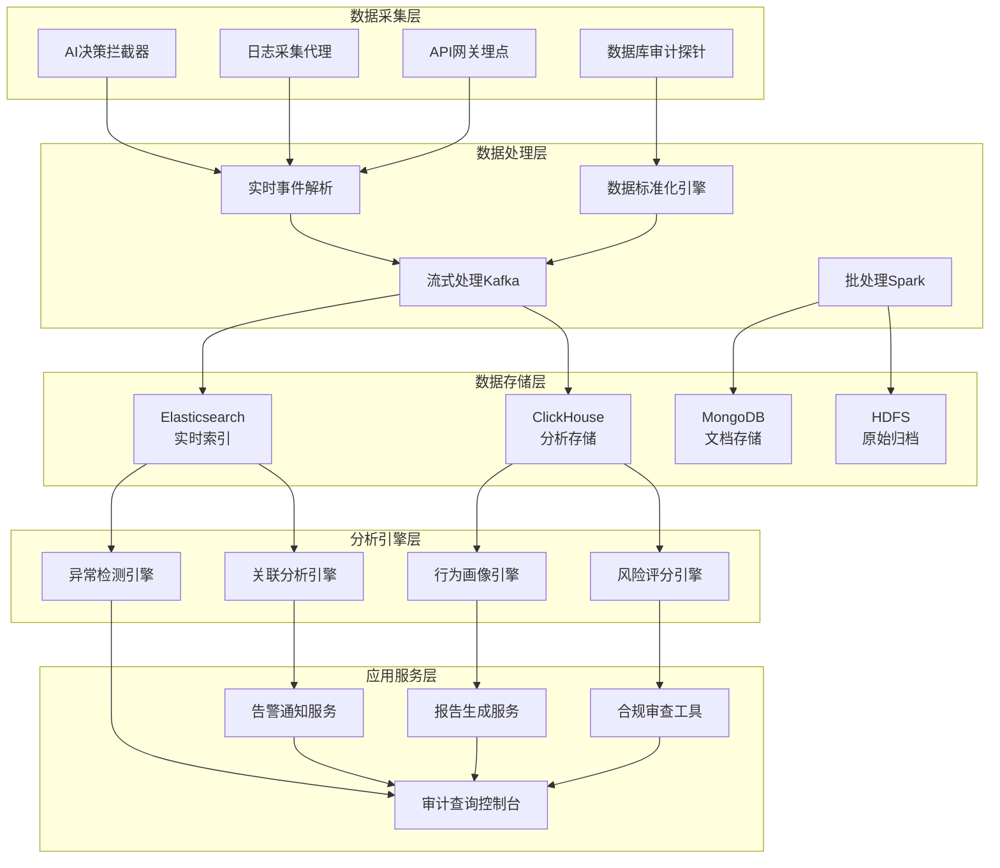
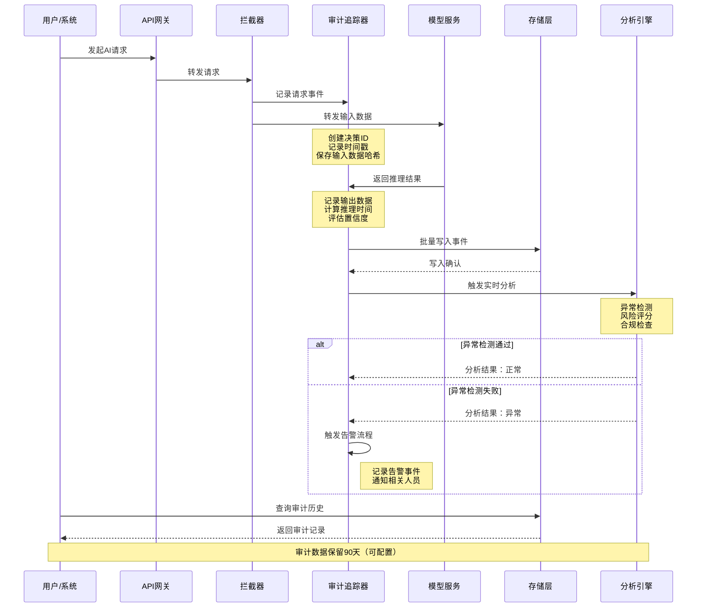
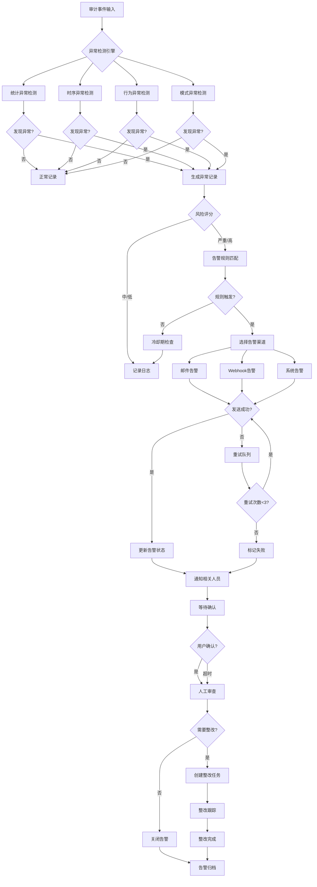
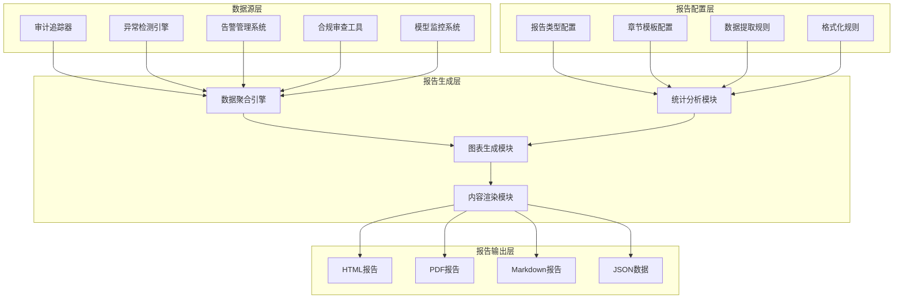
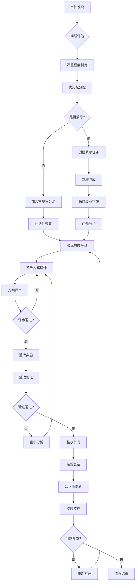
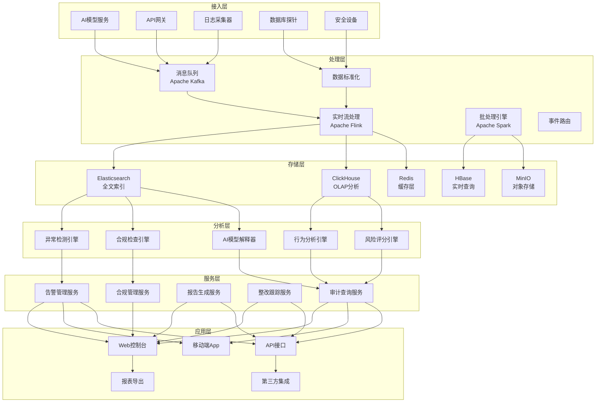
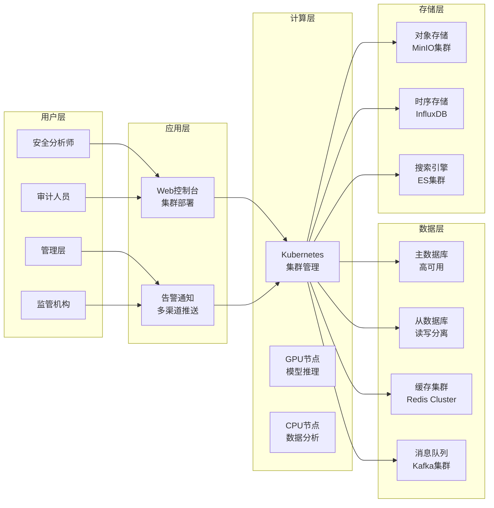

**作者：** HOS(安全风信子)
**日期：** 2026-04-27
**主要来源平台：** GitHub/arXiv

**摘要：** 随着AI技术在安全运营领域的深度渗透，AI决策的透明性与可控性已成为企业安全治理的核心挑战。本文创新性地提出AI决策全链路审计追踪系统架构，融合实时异常行为检测与智能告警机制，构建从数据采集、决策分析、问题定位到整改闭环的完整审计生态。创新性地设计审计报告自动生成模板，实现审计工作的标准化与自动化输出。通过Mermaid可视化审计流程，结合LangChain等主流框架的代码实现，为安全运营团队提供一套可落地、可扩展、可追溯的AI审计最佳实践方案。本文还深入探讨大语言模型安全审计的特殊性，提出针对模型漂移、对抗样本攻击、数据泄露等新型风险的审计策略，为企业在AI原生时代构建智能化安全运营体系提供坚实的理论基础与技术支撑。

@[TOC](目录)

---

# 让AI决策透明可控：安全运营审计机制设计

## 一、引言：从AI辅助决策到AI主导决策的范式转变

在当今数字化转型的浪潮中，人工智能技术正以惊人的速度渗透到各行各业的核心业务流程之中。安全运营领域也不例外——从威胁检测、事件响应、漏洞管理到风险评估，AI正在从最初的辅助工具逐步演变为能够独立执行复杂决策的智能代理。这种从"AI辅助决策"到"AI主导决策"的范式转变，虽然极大地提升了安全运营的效率和精度，但同时也带来了前所未有的审计挑战。

传统的安全审计体系主要针对人工操作行为进行监督和追溯，审计人员可以通过审查操作日志、访谈相关人员、检查变更记录等方式，对安全运营活动进行全面监管。然而，当AI系统开始承担越来越多的决策责任时，传统的审计方法论面临着根本性的挑战：AI决策过程的"黑箱"特性使得我们难以理解其为何做出特定判断；AI决策的高频性和复杂性使得人工审计变得不切实际；AI决策的自动化执行特性使得风险可以被迅速放大和传播。

更为关键的是，随着生成式AI（AIGC）技术的快速发展，大语言模型（LLM）开始在安全运营中发挥越来越重要的作用。LLM可以生成威胁报告、编写修复脚本、回答安全问题，甚至直接参与安全事件的响应决策。这种能力的增强意味着我们必须建立全新的审计框架，专门针对AI生成内容的真实性、可靠性、合规性进行严格审查。审计机制不再仅仅是"记录谁做了什么"，而是需要升级为"理解AI为什么这样做，评估AI这样做是否正确，预测AI这样做会带来什么后果"。

本文将系统性地探讨AI安全运营审计机制的设计与实现。我们将重点关注三个创新要素：AI决策全链路审计追踪系统、异常行为检测与告警机制、以及审计报告自动生成模板。通过深入的技术分析和可落地的代码实现，为安全运营团队提供一套完整的AI审计解决方案。

## 二、AI审计的必要性与价值：超越合规的深层思考

### 2.1 合规要求的外部驱动

在网络安全和数据保护领域，合规性一直是推动企业安全建设的核心动力。《网络安全法》、《数据安全法》、《个人信息保护法》三部曲的出台，确立了我国网络空间安全治理的基本框架。2024年以来，随着《生成式人工智能服务管理暂行办法》的正式实施，针对AI系统的合规要求更是被提升到了前所未有的高度。该办法明确要求生成式AI服务提供者应当建立健全投诉举报机制、开展安全评估、对图片、视频等内容进行标识，这些规定都直接指向AI审计机制的建立。

从国际视角来看，欧盟的《人工智能法案》（AI Act）更是将AI系统按照风险等级进行分类监管。高风险AI系统必须满足严格的透明度要求，包括但不限于：记录AI系统的训练数据、模型参数、更新历史；保留AI决策的完整日志供监管机构审查；定期进行合规性审计并提交审计报告。美国国家标准与技术研究院（NIST）发布的AI风险管理框架（AI RMF）同样强调了审计和问责的重要性，要求组织建立清晰的AI系统追踪机制，确保AI决策可以被解释和审查。

这些法规和标准的存在，清晰地表明了一个趋势：AI审计不再是可选项，而是AI系统合法运营的必要条件。但笔者认为，如果仅仅从合规的角度来理解AI审计，那就大大低估了审计机制的价值。合规只是底线，而审计机制的真正价值在于帮助组织建立对AI系统的深入理解和有效控制。

### 2.2 风险控制的内在需求

AI系统在安全运营中的引入，本质上是一次风险重新分配的过程。传统的安全运营模式下，风险的产生和传递主要依赖于人的决策和操作。通过完善的流程设计和权限管理，组织可以清晰地界定每个岗位的责任边界，实现风险的有效控制。然而，当AI系统开始参与决策时，这种风险边界变得模糊起来。

试想一个典型的场景：AI威胁检测系统通过机器学习算法分析网络流量，识别出了一次潜在的入侵行为，并自动触发隔离受感染主机的响应动作。从表面上看，这个流程是"自动化"的、"高效"的，但仔细分析会发现一系列隐藏的风险：首先，AI模型的检测逻辑是经过大量历史数据训练得出的，这意味着它对新类型攻击的检测能力可能存在盲区；其次，AI系统可能在对抗样本攻击下被欺骗，将正常流量误判为攻击或相反；再次，AI系统的决策可能受到训练数据中潜藏的偏见影响，导致对特定类型流量或用户的歧视性处理。

这些风险的存在，要求我们必须建立一套完善的AI审计机制，持续监控AI系统的行为模式，及时发现异常决策，并追溯问题的根本原因。AI审计不是对AI能力的不信任，恰恰相反，它是AI系统持续优化的重要组成部分。通过审计发现的问题，可以为AI模型的迭代改进提供宝贵的反馈信息。

### 2.3 责任界定的实践困惑

当AI参与的决策导致不良后果时，谁应该承担责任？这是安全运营领域一个极具争议性的问题。AI开发者、AI部署者、AI运营者、AI使用者，他们各自应该承担什么程度的责任？这种责任如何进行量化评估？这些问题如果不能得到清晰的回答，将严重阻碍AI技术在安全运营中的进一步应用。

责任界定的前提是决策过程的可追溯性。只有当我们能够完整地还原AI做出某个决策的全过程，包括输入数据的来源、模型推理的逻辑、输出结果的处理，我们才能准确判断哪个环节出了问题，应该由谁来承担责任。这正是AI审计机制的核心价值所在。

从法律角度来看，2024年以来的司法实践显示，涉及AI决策的纠纷案件正在快速增加。法院在审理这类案件时，最核心的诉求就是要求提供AI决策的完整记录。如果企业不能提供充分的审计证据，可能面临举证不能的不利后果。因此，从法律风险防控的角度，建立完善的AI审计机制也是必要的。

### 2.4 AI审计的价值矩阵

基于上述分析，我们可以将AI审计的价值总结为以下四个维度：

**合规价值**：满足法规要求，避免监管处罚，建立市场信任。这是AI审计的最低价值层次，也是推动大多数组织建立审计机制的初始动力。

**控制价值**：及时发现AI系统异常，控制AI决策风险，防止风险扩散。通过实时监控和异常检测，审计机制可以帮助组织在AI系统出现问题时迅速响应，将损失降到最低。

**优化价值**：基于审计数据的分析结果，持续优化AI模型的性能和准确性。审计数据中蕴含着AI系统行为的丰富信息，通过深入分析可以发现模型的薄弱环节，为模型迭代提供数据支撑。

**治理价值**：建立AI决策的问责机制，完善AI治理体系，实现AI与人类决策者的和谐共存。这是AI审计的最高价值层次，也是企业在AI时代构建核心竞争力的关键。

## 三、AI决策全链路审计追踪系统：架构设计与实现

### 3.1 全链路审计的核心设计理念

AI决策全链路审计追踪系统的核心理念是"全覆盖、可追溯、高可用"。全覆盖意味着审计系统需要记录AI决策过程中的每一个关键环节，从数据输入到模型推理再到输出处理，不能有任何遗漏；可追溯意味着每一条审计记录都需要包含足够的信息来还原当时的决策场景，包括时间戳、上下文环境、输入数据、输出结果等；高可用则要求审计系统本身具备足够的可靠性，不能因为审计系统自身的故障而影响AI系统的正常运行。

传统的日志系统往往采用"尽力而为"的记录策略，在系统负载较高时可能会丢弃一些日志记录。但对于AI审计场景，这种策略是不可接受的。因为审计日志的缺失可能导致法律责任无法界定、安全事件无法溯源、违规行为无法发现。因此，我们需要设计一种高可靠性的日志记录机制，确保每一条关键的审计事件都被准确记录。

全链路审计的另一个重要特性是上下文关联。AI的每一次决策都不是孤立的，它通常是在一系列相关事件的基础上做出的。例如，AI系统可能在凌晨2点检测到一次异常登录行为，随后做出隔离用户的决策。这个决策需要与之前的登录尝试、用户历史行为基线、企业安全策略配置等多种上下文信息进行关联，才能完整地评估该决策的合理性。审计系统需要具备跨时间、跨事件、跨系统的关联分析能力。

### 3.2 审计事件模型设计

为了实现全链路审计，我们首先需要定义一套标准化的审计事件模型。该模型需要包含以下核心字段：

```python
from dataclasses import dataclass, field
from datetime import datetime
from typing import Any, Dict, List, Optional
from enum import Enum
import json
import uuid
import hashlib

class AuditEventType(Enum):
    """审计事件类型枚举"""
    # AI决策相关事件
    AI_DECISION_INPUT = "ai_decision_input"
    AI_DECISION_OUTPUT = "ai_decision_output"
    AI_MODEL_INVOCATION = "ai_model_invocation"
    AI_CONFIDENCE_UPDATE = "ai_confidence_update"

    # 数据相关事件
    DATA_INPUT_RECEIVED = "data_input_received"
    DATA_OUTPUT_SENT = "data_output_sent"
    DATA_TRANSFORMATION = "data_transformation"
    DATA_STORAGE_OPERATION = "data_storage_operation"

    # 安全相关事件
    SECURITY_ALERT = "security_alert"
    SECURITY_RESPONSE = "security_response"
    ACCESS_CONTROL_EVENT = "access_control_event"
    AUTHENTICATION_EVENT = "authentication_event"

    # 系统相关事件
    SYSTEM_CONFIG_CHANGE = "system_config_change"
    SYSTEM_ERROR = "system_error"
    SYSTEM_PERFORMANCE = "system_performance"

    # 审计管理事件
    AUDIT_LOG_ACCESS = "audit_log_access"
    AUDIT_CONFIG_CHANGE = "audit_config_change"
    AUDIT_EXPORT = "audit_export"

class RiskLevel(Enum):
    """风险等级枚举"""
    CRITICAL = "critical"
    HIGH = "high"
    MEDIUM = "medium"
    LOW = "low"
    INFO = "info"

@dataclass
class AIAuditEvent:
    """AI审计事件数据模型"""
    event_id: str = field(default_factory=lambda: str(uuid.uuid4()))
    event_type: AuditEventType = None
    timestamp: datetime = field(default_factory=datetime.utcnow)

    # 主体信息
    actor_type: str = "ai_system"
    actor_id: str = ""
    actor_name: str = ""
    actor_attributes: Dict[str, Any] = field(default_factory=dict)

    # AI决策上下文
    decision_id: str = ""
    decision_chain_id: str = ""
    parent_decision_id: str = ""

    # 模型信息
    model_id: str = ""
    model_version: str = ""
    model_provider: str = ""
    model_type: str = ""

    # 输入输出数据
    input_data: Dict[str, Any] = field(default_factory=dict)
    output_data: Dict[str, Any] = field(default_factory=dict)
    input_data_hash: str = ""
    output_data_hash: str = ""

    # 推理过程
    inference_time_ms: float = 0.0
    confidence_score: float = 0.0
    reasoning_trace: List[Dict[str, Any]] = field(default_factory=list)
    feature_importance: Dict[str, float] = field(default_factory=dict)

    # 环境上下文
    session_id: str = ""
    request_id: str = ""
    ip_address: str = ""
    user_agent: str = ""
    geo_location: str = ""

    # 企业上下文
    organization_id: str = ""
    department_id: str = ""
    project_id: str = ""
    environment: str = "production"

    # 风险评估
    risk_level: RiskLevel = RiskLevel.INFO
    risk_factors: List[str] = field(default_factory=list)
    compliance_flags: List[str] = field(default_factory=list)

    # 溯源信息
    correlation_id: str = ""
    trace_id: str = ""
    span_id: str = ""

    # 元数据
    version: str = "1.0"
    source_system: str = ""
    source_module: str = ""
    tags: List[str] = field(default_factory=list)

    def to_dict(self) -> Dict[str, Any]:
        """转换为字典格式"""
        return {
            "event_id": self.event_id,
            "event_type": self.event_type.value if self.event_type else None,
            "timestamp": self.timestamp.isoformat(),
            "actor": {
                "type": self.actor_type,
                "id": self.actor_id,
                "name": self.actor_name,
                "attributes": self.actor_attributes
            },
            "decision": {
                "id": self.decision_id,
                "chain_id": self.decision_chain_id,
                "parent_id": self.parent_decision_id
            },
            "model": {
                "id": self.model_id,
                "version": self.model_version,
                "provider": self.model_provider,
                "type": self.model_type
            },
            "input_data": self.input_data,
            "output_data": self.output_data,
            "data_hash": {
                "input": self.input_data_hash,
                "output": self.output_data_hash
            },
            "inference": {
                "time_ms": self.inference_time_ms,
                "confidence": self.confidence_score,
                "reasoning_trace": self.reasoning_trace,
                "feature_importance": self.feature_importance
            },
            "context": {
                "session_id": self.session_id,
                "request_id": self.request_id,
                "ip_address": self.ip_address,
                "geo_location": self.geo_location
            },
            "enterprise": {
                "organization_id": self.organization_id,
                "department_id": self.department_id,
                "project_id": self.project_id,
                "environment": self.environment
            },
            "risk": {
                "level": self.risk_level.value if self.risk_level else None,
                "factors": self.risk_factors,
                "compliance_flags": self.compliance_flags
            },
            "lineage": {
                "correlation_id": self.correlation_id,
                "trace_id": self.trace_id,
                "span_id": self.span_id
            },
            "metadata": {
                "version": self.version,
                "source_system": self.source_system,
                "source_module": self.source_module,
                "tags": self.tags
            }
        }

    def compute_hash(self) -> 'AIAuditEvent':
        """计算输入输出数据的哈希值"""
        if self.input_data:
            self.input_data_hash = hashlib.sha256(
                json.dumps(self.input_data, sort_keys=True).encode()
            ).hexdigest()
        if self.output_data:
            self.output_data_hash = hashlib.sha256(
                json.dumps(self.output_data, sort_keys=True).encode()
            ).hexdigest()
        return self
```

上述审计事件模型的设计充分考虑了AI决策场景的特殊性。模型信息字段用于记录AI系统的基本信息，便于后续的模型管理和版本追踪；推理过程字段用于记录AI决策的技术细节，包括推理时间、置信度、推理轨迹等，这些信息对于理解AI决策逻辑至关重要；风险评估字段用于对AI决策进行自动化的风险分级，为后续的告警和审查提供依据。

### 3.3 全链路追踪系统架构

AI决策全链路审计追踪系统的整体架构可以分为五个层次：数据采集层、数据处理层、数据存储层、分析引擎层和应用服务层。下面我们通过Mermaid图表来展示这个架构：



**数据采集层**负责从各个来源收集审计数据。AI决策拦截器是最核心的组件，它可以在AI模型推理的前后自动拦截并记录相关信息；日志采集代理负责收集系统日志、应用日志等传统审计数据；API网关埋点可以在网络层面捕获所有进出的API调用；数据库审计探针则可以监控数据库的所有访问行为。

**数据处理层**负责对原始数据进行解析、转换和标准化。实时事件解析组件可以即时处理采集到的数据，流式处理框架如Kafka可以实现高吞吐量的数据传输，批处理框架如Spark则用于复杂的后续分析任务。

**数据存储层**采用多模存储策略，根据数据的特性选择最适合的存储引擎。Elasticsearch适合实时搜索和聚合分析，ClickHouse适合大规模数据分析，MongoDB适合存储非结构化的文档数据，HDFS则用于长期归档存储。

**分析引擎层**是整个系统的智能核心。异常检测引擎使用统计方法和机器学习算法来识别异常行为；关联分析引擎可以将分散的审计事件关联成完整的事件链；行为画像引擎可以为用户和AI系统建立行为基线；风险评分引擎则综合各种因素给出风险评分。

**应用服务层**面向终端用户提供各种审计服务。审计查询控制台是最常用的交互界面，告警通知服务可以在发现异常时及时通知相关人员，报告生成服务可以自动生成各种格式的审计报告，合规审查工具则用于满足法规要求的定期审查。

### 3.4 审计追踪系统核心实现

下面我们给出AI决策全链路审计追踪系统的核心代码实现：

```python
import hashlib
import json
import logging
import time
import threading
from datetime import datetime, timedelta
from typing import Any, Callable, Dict, List, Optional, TypeVar
from contextlib import contextmanager
from functools import wraps
from collections import deque, defaultdict
import uuid

logging.basicConfig(level=logging.INFO)
logger = logging.getLogger("AI_Audit_Tracker")

class AuditContext:
    """审计上下文管理器"""
    _local = threading.local()

    @classmethod
    def set_context(cls, **kwargs):
        """设置线程局部上下文"""
        if not hasattr(cls._local, 'context'):
            cls._local.context = {}
        cls._local.context.update(kwargs)

    @classmethod
    def get_context(cls) -> Dict[str, Any]:
        """获取当前上下文"""
        return getattr(cls._local, 'context', {})

    @classmethod
    def clear_context(cls):
        """清除当前上下文"""
        cls._local.context = {}

class InMemoryAuditStorage:
    """内存审计存储（仅用于测试）"""
    def __init__(self):
        self._events: List[Dict[str, Any]] = []
        self._lock = threading.Lock()

    def batch_insert(self, events: List[Dict[str, Any]]):
        with self._lock:
            self._events.extend(events)

    def query(self, query: Dict[str, Any], limit: int = 1000) -> List[Dict[str, Any]]:
        with self._lock:
            results = []
            for event in self._events:
                if self._matches(event, query):
                    results.append(event)
                    if len(results) >= limit:
                        break
            return results

    def query_one(self, query: Dict[str, Any]) -> Optional[Dict[str, Any]]:
        with self._lock:
            for event in self._events:
                if self._matches(event, query):
                    return event
        return None

    def _matches(self, event: Dict[str, Any], query: Dict[str, Any]) -> bool:
        for key, value in query.items():
            keys = key.split('.')
            event_value = event
            for k in keys:
                if isinstance(event_value, dict):
                    event_value = event_value.get(k)
                else:
                    return False
            if event_value != value:
                return False
        return True

    def delete_old_events(self, retention_days: int):
        cutoff = datetime.utcnow() - timedelta(days=retention_days)
        with self._lock:
            self._events = [
                e for e in self._events
                if datetime.fromisoformat(e["timestamp"]) > cutoff
            ]

class AuditTracker:
    """AI决策全链路审计追踪器"""

    def __init__(
        self,
        storage_backend: Optional[Any] = None,
        enable_encryption: bool = True,
        retention_days: int = 90
    ):
        self.storage = storage_backend or InMemoryAuditStorage()
        self.enable_encryption = enable_encryption
        self.retention_days = retention_days
        self._event_buffer: List[Dict[str, Any]] = []
        self._buffer_lock = threading.Lock()
        self._flush_threshold = 100
        self._event_handlers: List[Callable] = []

    def register_handler(self, handler: Callable):
        """注册事件处理器"""
        self._event_handlers.append(handler)

    def _compute_hash(self, data: Any) -> str:
        """计算数据哈希"""
        if isinstance(data, dict):
            data = json.dumps(data, sort_keys=True, ensure_ascii=False)
        if isinstance(data, str):
            data = data.encode('utf-8')
        return hashlib.sha256(data).hexdigest()

    def _encrypt_data(self, data: Dict[str, Any]) -> Dict[str, Any]:
        """加密敏感字段"""
        if not self.enable_encryption:
            return data

        sensitive_fields = ['password', 'token', 'secret', 'api_key', 'credential']
        encrypted = data.copy()

        def encrypt_value(obj):
            if isinstance(obj, dict):
                return {k: encrypt_value(v) if k not in sensitive_fields
                        else "***ENCRYPTED***" for k, v in obj.items()}
            elif isinstance(obj, list):
                return [encrypt_value(item) for item in obj]
            return obj

        return encrypt_value(encrypted)

    def track_event(
        self,
        event_type: str,
        actor_type: str,
        actor_id: str,
        action: str,
        resource_type: str,
        resource_id: str,
        input_data: Optional[Dict[str, Any]] = None,
        output_data: Optional[Dict[str, Any]] = None,
        metadata: Optional[Dict[str, Any]] = None,
        risk_level: str = "info",
        correlation_id: Optional[str] = None,
        trace_id: Optional[str] = None
    ) -> str:
        """记录审计事件"""
        event_id = str(uuid.uuid4())
        timestamp = datetime.utcnow()

        event = {
            "event_id": event_id,
            "event_type": event_type,
            "timestamp": timestamp.isoformat(),
            "actor": {
                "type": actor_type,
                "id": actor_id,
                "name": metadata.get("actor_name", "") if metadata else ""
            },
            "action": action,
            "resource": {
                "type": resource_type,
                "id": resource_id
            },
            "input": self._encrypt_data(input_data or {}),
            "output": self._encrypt_data(output_data or {}),
            "input_hash": self._compute_hash(input_data or {}),
            "output_hash": self._compute_hash(output_data or {}),
            "metadata": metadata or {},
            "risk_level": risk_level,
            "correlation_id": correlation_id or str(uuid.uuid4()),
            "trace_id": trace_id or self._get_or_create_trace_id(),
            "context": AuditContext.get_context(),
            "system": {
                "hostname": metadata.get("hostname", "") if metadata else "",
                "ip_address": metadata.get("ip_address", "") if metadata else "",
                "user_agent": metadata.get("user_agent", "") if metadata else ""
            }
        }

        with self._buffer_lock:
            self._event_buffer.append(event)
            if len(self._event_buffer) >= self._flush_threshold:
                self._flush_buffer()

        for handler in self._event_handlers:
            try:
                handler(event)
            except Exception as e:
                logger.error(f"Event handler error: {e}")

        return event_id

    def _get_or_create_trace_id(self) -> str:
        """获取或创建追踪ID"""
        context = AuditContext.get_context()
        if 'trace_id' in context:
            return context['trace_id']
        trace_id = str(uuid.uuid4())
        AuditContext.set_context(trace_id=trace_id)
        return trace_id

    def _flush_buffer(self):
        """刷新事件缓冲区"""
        if not self._event_buffer:
            return

        events_to_flush = self._event_buffer.copy()
        self._event_buffer.clear()

        try:
            self.storage.batch_insert(events_to_flush)
            logger.info(f"Flushed {len(events_to_flush)} events to storage")
        except Exception as e:
            logger.error(f"Failed to flush events: {e}")
            self._event_buffer.extend(events_to_flush)

    @contextmanager
    def track_decision(
        self,
        decision_type: str,
        model_id: str,
        model_version: str,
        metadata: Optional[Dict[str, Any]] = None
    ):
        """AI决策追踪上下文管理器"""
        decision_id = str(uuid.uuid4())
        start_time = time.time()
        trace_id = self._get_or_create_trace_id()
        correlation_id = str(uuid.uuid4())

        AuditContext.set_context(
            decision_id=decision_id,
            decision_type=decision_type,
            model_id=model_id,
            model_version=model_version,
            trace_id=trace_id,
            correlation_id=correlation_id
        )

        try:
            yield {
                "decision_id": decision_id,
                "trace_id": trace_id,
                "correlation_id": correlation_id
            }
        except Exception as e:
            self.track_event(
                event_type="ai_decision_error",
                actor_type="ai_system",
                actor_id=model_id,
                action="decision_failed",
                resource_type="ai_model",
                resource_id=f"{model_id}:{model_version}",
                metadata={
                    "error": str(e),
                    "decision_type": decision_type,
                    **metadata or {}
                },
                risk_level="high"
            )
            raise
        finally:
            duration = time.time() - start_time
            AuditContext.clear_context()

    def track_model_invocation(
        self,
        model_id: str,
        model_version: str,
        input_data: Dict[str, Any],
        output_data: Dict[str, Any],
        inference_time_ms: float,
        confidence_score: Optional[float] = None,
        metadata: Optional[Dict[str, Any]] = None
    ) -> str:
        """追踪模型调用"""
        event_id = str(uuid.uuid4())

        event = {
            "event_id": event_id,
            "event_type": "ai_model_invocation",
            "timestamp": datetime.utcnow().isoformat(),
            "model": {
                "id": model_id,
                "version": model_version,
                "provider": metadata.get("provider", "") if metadata else ""
            },
            "input": self._encrypt_data(input_data),
            "output": self._encrypt_data(output_data),
            "input_hash": self._compute_hash(input_data),
            "output_hash": self._compute_hash(output_data),
            "performance": {
                "inference_time_ms": inference_time_ms,
                "confidence_score": confidence_score
            },
            "metadata": metadata or {},
            "correlation_id": self._get_or_create_trace_id(),
            "context": AuditContext.get_context()
        }

        with self._buffer_lock:
            self._event_buffer.append(event)
            if len(self._event_buffer) >= self._flush_threshold:
                self._flush_buffer()

        return event_id

    def get_audit_trail(
        self,
        decision_id: Optional[str] = None,
        correlation_id: Optional[str] = None,
        actor_id: Optional[str] = None,
        start_time: Optional[datetime] = None,
        end_time: Optional[datetime] = None,
        event_types: Optional[List[str]] = None,
        limit: int = 1000
    ) -> List[Dict[str, Any]]:
        """查询审计轨迹"""
        query = {}

        if decision_id:
            query["context.decision_id"] = decision_id
        if correlation_id:
            query["correlation_id"] = correlation_id
        if actor_id:
            query["actor.id"] = actor_id

        if start_time or end_time:
            time_range = {}
            if start_time:
                time_range["$gte"] = start_time.isoformat()
            if end_time:
                time_range["$lte"] = end_time.isoformat()
            query["timestamp"] = time_range

        if event_types:
            query["event_type"] = {"$in": event_types}

        return self.storage.query(query, limit=limit)

    def get_decision_chain(self, decision_id: str) -> List[Dict[str, Any]]:
        """获取决策链"""
        primary_event = self.storage.query_one({"context.decision_id": decision_id})
        if not primary_event:
            return []

        correlation_id = primary_event.get("correlation_id")
        return self.storage.query(
            {"correlation_id": correlation_id},
            limit=100
        )

def create_audit_tracker(config: Optional[Dict[str, Any]] = None) -> AuditTracker:
    """创建审计追踪器工厂函数"""
    config = config or {}

    storage = InMemoryAuditStorage()

    return AuditTracker(
        storage_backend=storage,
        enable_encryption=config.get("enable_encryption", True),
        retention_days=config.get("retention_days", 90)
    )

audit_tracker = create_audit_tracker()

def audit_decision(model_id: str, model_version: str):
    """AI决策审计装饰器"""
    def decorator(func):
        @wraps(func)
        def wrapper(*args, **kwargs):
            with audit_tracker.track_decision(
                decision_type=func.__name__,
                model_id=model_id,
                model_version=model_version
            ):
                start_time = time.time()
                result = func(*args, **kwargs)
                inference_time = (time.time() - start_time) * 1000

                if isinstance(result, dict) and "output" in result:
                    output = result["output"]
                    confidence = result.get("confidence")
                else:
                    output = result
                    confidence = None

                audit_tracker.track_model_invocation(
                    model_id=model_id,
                    model_version=model_version,
                    input_data={"args": str(args), "kwargs": str(kwargs)},
                    output_data={"result": str(output)},
                    inference_time_ms=inference_time,
                    confidence_score=confidence
                )

                return result
        return wrapper
    return decorator

# 使用示例
if __name__ == "__main__":
    tracker = create_audit_tracker()

    with tracker.track_decision("threat_detection", "threat_model_v2", "2.1.0") as ctx:
        decision_id = ctx["decision_id"]
        print(f"Tracking decision: {decision_id}")

    result = tracker.track_model_invocation(
        model_id="threat_model_v2",
        model_version="2.1.0",
        input_data={"network_traffic": "...", "timestamp": "2024-01-15T10:30:00Z"},
        output_data={"threat_detected": True, "threat_type": "malware", "confidence": 0.95},
        inference_time_ms=45.2,
        confidence_score=0.95,
        metadata={"request_id": "req_12345"}
    )

    print(f"Model invocation tracked: {result}")

    trail = tracker.get_audit_trail(decision_id=decision_id)
    print(f"Audit trail retrieved: {len(trail)} events")
```

这段代码实现了一个完整的AI决策全链路审计追踪系统。核心组件包括：

**AuditTracker类**是整个追踪系统的核心，提供了事件记录、上下文管理、缓冲处理等功能。通过内置的事件缓冲区实现了高吞吐量的审计数据采集，缓冲区达到阈值后自动刷新到存储后端。

**AuditContext类**使用线程局部存储来管理审计上下文，确保在同一线程内的不同函数调用之间传递审计信息。这一设计使得我们可以在不修改函数签名的情况下，将审计相关的元数据附加到任何操作上。

**track_decision上下文管理器**提供了对AI决策过程的完整追踪。当一个决策执行时，它会自动记录决策的开始时间、结束时间、执行结果，以及任何在决策过程中产生的异常。

**track_model_invocation方法**专门用于记录AI模型的调用信息，包括输入数据、输出数据、推理时间和置信度等关键指标。这些数据对于后续的模型性能分析和异常检测至关重要。

### 3.5 决策链路可视化

审计追踪系统的一个核心价值在于能够将AI的决策过程以可视化的方式呈现出来，帮助审计人员和业务人员理解AI为什么做出特定的决策。下面我们通过Mermaid序列图来展示典型的AI决策审计流程：



从序列图中可以看出，整个AI决策的审计流程涉及到多个组件的协作。API网关作为请求的入口，将请求转发给拦截器；拦截器负责在AI模型调用的前后插入审计逻辑；审计追踪器是整个流程的核心枢纽，负责协调各个组件之间的数据流转；分析引擎则提供了实时的异常检测能力，可以在审计数据产生的同时发现问题并触发告警。

## 四、异常行为检测与告警机制：智能化的风险识别

### 4.1 异常检测的理论基础

异常行为检测是AI安全运营审计中最核心的智能组件之一。它的目标是从海量的审计数据中识别出偏离正常模式的异常行为，为安全分析人员提供精准的告警信息。在AI审计场景下，异常检测面临着独特的挑战：AI系统的行为模式本身就比传统软件系统更加复杂和不可预测，因为AI模型可能会根据不同的输入产生截然不同的输出。

从统计学角度来看，异常检测的基本假设是：正常行为在数据空间中呈现出一定的分布规律，而异常行为则偏离这种分布。常见的异常检测方法包括基于统计的方法（如高斯分布假设检验、分位数分析）、基于距离的方法（如K近邻、LOF）、基于密度的方法（如DBSCAN、孤立森林）以及基于深度学习的方法（如自编码器、变分自编码器）。

在AI审计场景下，我们需要构建多层次的异常检测体系：

**第一层是规则层异常检测**。这一层使用预定义的规则来识别明显的异常行为，如AI决策置信度低于阈值、AI决策频率异常飙升、AI决策结果与安全策略冲突等。规则层检测的优点是解释性强、准确率高，缺点是只能检测已知的异常模式。

**第二层是统计层异常检测**。这一层使用统计方法来识别偏离正常模式的异常行为，如AI决策时间序列的突变、AI决策结果的分布异常、不同用户/系统行为特征的显著差异等。统计层检测可以发现一些未知的异常模式，但可能会产生较多的误报。

**第三层是机器学习层异常检测**。这一层使用机器学习算法来学习正常行为模式，并识别偏离该模式的异常行为。常用的算法包括Isolation Forest、One-Class SVM、LSTM时间序列异常检测等。机器学习层检测可以发现更加复杂的异常模式，但需要大量的历史数据来训练模型，并且存在模型漂移的风险。

**第四层是深度学习层异常检测**。这一层使用深度学习方法来提取高层次的特征表示，并进行异常检测。如自编码器重构误差异常检测、图神经网络异常检测等。深度学习层检测适合处理高维、非线性的审计数据，但模型的训练和调优需要较高的技术门槛。

### 4.2 异常检测引擎实现

下面我们实现一个完整的AI审计异常检测引擎：

```python
import numpy as np
from dataclasses import dataclass, field
from typing import Any, Dict, List, Optional, Tuple
from datetime import datetime, timedelta
from collections import deque, defaultdict
import logging
from enum import Enum
import uuid

logging.basicConfig(level=logging.INFO)
logger = logging.getLogger("AnomalyDetection")

class AnomalyType(Enum):
    """异常类型枚举"""
    STATISTICAL = "statistical"
    BEHAVIORAL = "behavioral"
    TEMPORAL = "temporal"
    CORRELATIONAL = "correlational"
    SEMANTIC = "semantic"

class Severity(Enum):
    """严重程度枚举"""
    CRITICAL = "critical"
    HIGH = "high"
    MEDIUM = "medium"
    LOW = "low"
    INFO = "info"

@dataclass
class AnomalyRecord:
    """异常记录"""
    anomaly_id: str
    anomaly_type: AnomalyType
    severity: Severity
    timestamp: datetime

    detected_value: Any
    expected_value: Any
    deviation: float

    involved_entities: List[str] = field(default_factory=list)
    affected_decisions: List[str] = field(default_factory=list)

    evidence: List[Dict[str, Any]] = field(default_factory=list)
    description: str = ""

    risk_score: float = 0.0
    confidence: float = 0.0

    recommended_actions: List[str] = field(default_factory=list)
    metadata: Dict[str, Any] = field(default_factory=dict)

class StatisticalAnomalyDetector:
    """统计异常检测器"""

    def __init__(self, z_threshold: float = 3.0, window_size: int = 100):
        self.z_threshold = z_threshold
        self.window_size = window_size
        self.historical_data: deque = deque(maxlen=window_size * 10)
        self.running_stats = {"mean": 0.0, "std": 1.0, "count": 0}

    def update(self, value: float):
        """更新统计数据"""
        self.historical_data.append(value)
        values = list(self.historical_data)

        n = len(values)
        if n > 0:
            self.running_stats["mean"] = np.mean(values)
            self.running_stats["std"] = np.std(values) if n > 1 else 1.0
            self.running_stats["count"] = n

    def detect(self, value: float) -> Tuple[bool, float]:
        """检测是否为异常值"""
        if self.running_stats["count"] < 10:
            return False, 0.0

        z_score = abs(value - self.running_stats["mean"]) / max(self.running_stats["std"], 1e-6)

        is_anomaly = z_score > self.z_threshold
        anomaly_score = min(z_score / (self.z_threshold * 2), 1.0) if is_anomaly else 0.0

        return is_anomaly, anomaly_score

    def get_z_score(self, value: float) -> float:
        """计算Z分数"""
        if self.running_stats["count"] < 10 or self.running_stats["std"] == 0:
            return 0.0
        return (value - self.running_stats["mean"]) / self.running_stats["std"]

class TemporalAnomalyDetector:
    """时序异常检测器"""

    def __init__(
        self,
        expected_frequency: float,
        frequency_tolerance: float = 0.2,
        time_window: timedelta = timedelta(minutes=5)
    ):
        self.expected_frequency = expected_frequency
        self.frequency_tolerance = frequency_tolerance
        self.time_window = time_window
        self.event_times: deque = deque()
        self.baseline_interval = 60.0 / expected_frequency

    def record_event(self, timestamp: datetime):
        """记录事件发生时间"""
        self.event_times.append(timestamp)

        cutoff_time = timestamp - self.time_window
        while self.event_times and self.event_times[0] < cutoff_time:
            self.event_times.popleft()

    def detect(self, timestamp: datetime) -> Tuple[bool, float]:
        """检测时序异常"""
        if len(self.event_times) < 2:
            return False, 0.0

        intervals = []
        sorted_times = sorted(self.event_times)
        for i in range(1, len(sorted_times)):
            interval = (sorted_times[i] - sorted_times[i-1]).total_seconds()
            intervals.append(interval)

        avg_interval = np.mean(intervals)
        expected_min = self.baseline_interval * (1 - self.frequency_tolerance)
        expected_max = self.baseline_interval * (1 + self.frequency_tolerance)

        is_anomaly = avg_interval < expected_min or avg_interval > expected_max
        deviation = max(expected_min / avg_interval if avg_interval > 0 else 0,
                       avg_interval / expected_max if avg_interval > 0 else 0)
        anomaly_score = min((deviation - 1.0) / 2.0, 1.0) if is_anomaly else 0.0

        return is_anomaly, anomaly_score

class BehavioralAnomalyDetector:
    """行为异常检测器"""

    def __init__(self, profile_window: int = 1000):
        self.profile_window = profile_window
        self.user_profiles: Dict[str, Dict[str, Any]] = defaultdict(self._create_empty_profile)
        self.global_profile: Dict[str, Any] = self._create_empty_profile()

    def _create_empty_profile(self) -> Dict[str, Any]:
        """创建空的用户画像"""
        return {
            "decision_types": defaultdict(int),
            "output_distribution": defaultdict(int),
            "avg_confidence": deque(maxlen=100),
            "avg_latency": deque(maxlen=100),
            "request_times": deque(maxlen=1000),
            "resource_access": defaultdict(set),
            "risk_score_history": deque(maxlen=100),
            "last_update": None
        }

    def update_profile(self, user_id: str, event_data: Dict[str, Any]):
        """更新用户行为画像"""
        profile = self.user_profiles[user_id]

        decision_type = event_data.get("decision_type", "unknown")
        profile["decision_types"][decision_type] += 1

        output_class = event_data.get("output_class", "unknown")
        profile["output_distribution"][output_class] += 1

        confidence = event_data.get("confidence", 0.5)
        profile["avg_confidence"].append(confidence)

        latency = event_data.get("latency_ms", 0)
        profile["avg_latency"].append(latency)

        timestamp = event_data.get("timestamp", datetime.utcnow())
        profile["request_times"].append(timestamp)

        resources = event_data.get("accessed_resources", [])
        for resource in resources:
            profile["resource_access"][resource].add(user_id)

        risk_score = event_data.get("risk_score", 0)
        profile["risk_score_history"].append(risk_score)

        profile["last_update"] = timestamp

        self._update_global_profile(event_data)

    def _update_global_profile(self, event_data: Dict[str, Any]):
        """更新全局行为画像"""
        decision_type = event_data.get("decision_type", "unknown")
        self.global_profile["decision_types"][decision_type] += 1

        output_class = event_data.get("output_class", "unknown")
        self.global_profile["output_distribution"][output_class] += 1

    def detect_anomaly(self, user_id: str, event_data: Dict[str, Any]) -> Tuple[bool, List[str], float]:
        """检测用户行为异常"""
        profile = self.user_profiles[user_id]
        anomalies = []
        anomaly_score = 0.0

        if profile["last_update"] is None:
            return False, [], 0.0

        decision_type = event_data.get("decision_type", "unknown")
        if profile["decision_types"][decision_type] == 0:
            deviation = self.global_profile["decision_types"].get(decision_type, 0)
            if deviation == 0:
                anomalies.append(f"新的决策类型: {decision_type}")
                anomaly_score += 0.3

        current_confidence = event_data.get("confidence", 0.5)
        if len(profile["avg_confidence"]) > 10:
            avg_confidence = np.mean(profile["avg_confidence"])
            std_confidence = np.std(profile["avg_confidence"])
            if std_confidence > 0:
                z_score = abs(current_confidence - avg_confidence) / std_confidence
                if z_score > 2.5:
                    anomalies.append(f"置信度异常: 当前{current_confidence:.2f}, 历史均值{avg_confidence:.2f}")
                    anomaly_score += 0.4 * min(z_score / 3, 1.0)

        current_latency = event_data.get("latency_ms", 0)
        if len(profile["avg_latency"]) > 10:
            avg_latency = np.mean(profile["avg_latency"])
            std_latency = np.std(profile["avg_latency"])
            if std_latency > 0 and avg_latency > 0:
                latency_ratio = current_latency / avg_latency
                if latency_ratio > 3.0:
                    anomalies.append(f"延迟异常: 当前{current_latency}ms, 历史均值{avg_latency:.0f}ms")
                    anomaly_score += 0.3 * min(latency_ratio / 5, 1.0)

        current_risk = event_data.get("risk_score", 0)
        if len(profile["risk_score_history"]) > 10:
            avg_risk = np.mean(profile["risk_score_history"])
            if current_risk > avg_risk * 2.5 and current_risk > 0.7:
                anomalies.append(f"风险评分异常: 当前{current_risk:.2f}, 历史均值{avg_risk:.2f}")
                anomaly_score += 0.5

        is_anomaly = len(anomalies) > 0 and anomaly_score > 0.3
        return is_anomaly, anomalies, min(anomaly_score, 1.0)

class AnomalyDetectionEngine:
    """异常检测引擎"""

    def __init__(self):
        self.statistical_detectors: Dict[str, StatisticalAnomalyDetector] = {}
        self.temporal_detectors: Dict[str, TemporalAnomalyDetector] = {}
        self.behavioral_detector = BehavioralAnomalyDetector()

        self.recent_anomalies: deque = deque(maxlen=1000)
        self.alert_thresholds = {
            Severity.CRITICAL: 0.9,
            Severity.HIGH: 0.7,
            Severity.MEDIUM: 0.5,
            Severity.LOW: 0.3
        }

    def register_statistical_metric(self, metric_name: str, z_threshold: float = 3.0):
        """注册统计检测指标"""
        self.statistical_detectors[metric_name] = StatisticalAnomalyDetector(z_threshold=z_threshold)

    def register_temporal_metric(
        self,
        metric_name: str,
        expected_frequency: float,
        time_window: timedelta = timedelta(minutes=5)
    ):
        """注册时序检测指标"""
        self.temporal_detectors[metric_name] = TemporalAnomalyDetector(
            expected_frequency=expected_frequency,
            time_window=time_window
        )

    def analyze_event(self, event_data: Dict[str, Any]) -> List[AnomalyRecord]:
        """分析单个事件"""
        anomalies = []
        timestamp = datetime.fromisoformat(event_data.get("timestamp", datetime.utcnow().isoformat()))
        user_id = event_data.get("user_id", "unknown")
        decision_id = event_data.get("decision_id", "")

        for metric_name, detector in self.statistical_detectors.items():
            if metric_name in event_data:
                value = float(event_data[metric_name])
                detector.update(value)
                is_anomaly, score = detector.detect(value)

                if is_anomaly:
                    anomaly = AnomalyRecord(
                        anomaly_id=str(uuid.uuid4()),
                        anomaly_type=AnomalyType.STATISTICAL,
                        severity=self._score_to_severity(score),
                        timestamp=timestamp,
                        detected_value=value,
                        expected_value=detector.running_stats["mean"],
                        deviation=detector.get_z_score(value),
                        involved_entities=[user_id],
                        affected_decisions=[decision_id],
                        evidence=[{"metric": metric_name, "value": value, "z_score": detector.get_z_score(value)}],
                        description=f"统计异常: {metric_name}值{value}偏离正常范围",
                        risk_score=score,
                        confidence=0.85,
                        recommended_actions=[f"检查{metric_name}指标", "审查相关决策"]
                    )
                    anomalies.append(anomaly)

        for metric_name, detector in self.temporal_detectors.items():
            detector.record_event(timestamp)
            is_anomaly, score = detector.detect(timestamp)

            if is_anomaly:
                anomaly = AnomalyRecord(
                    anomaly_id=str(uuid.uuid4()),
                    anomaly_type=AnomalyType.TEMPORAL,
                    severity=self._score_to_severity(score),
                    timestamp=timestamp,
                    detected_value=timestamp,
                    expected_value=None,
                    deviation=score,
                    involved_entities=[metric_name],
                    affected_decisions=[],
                    description=f"时序异常: {metric_name}事件频率异常",
                    risk_score=score,
                    confidence=0.75,
                    recommended_actions=["检查事件频率", "审查相关时间窗口"]
                )
                anomalies.append(anomaly)

        self.behavioral_detector.update_profile(user_id, event_data)
        is_behavioral_anomaly, behavioral_anomalies, behavioral_score = \
            self.behavioral_detector.detect_anomaly(user_id, event_data)

        if is_behavioral_anomaly:
            anomaly = AnomalyRecord(
                anomaly_id=str(uuid.uuid4()),
                anomaly_type=AnomalyType.BEHAVIORAL,
                severity=self._score_to_severity(behavioral_score),
                timestamp=timestamp,
                detected_value=event_data,
                expected_value=None,
                deviation=behavioral_score,
                involved_entities=[user_id],
                affected_decisions=[decision_id],
                evidence=[{"description": a} for a in behavioral_anomalies],
                description="; ".join(behavioral_anomalies),
                risk_score=behavioral_score,
                confidence=0.80,
                recommended_actions=["审查用户行为", "验证决策正确性", "可能需要人工介入"]
            )
            anomalies.append(anomaly)

        for anomaly in anomalies:
            self.recent_anomalies.append(anomaly)

        return anomalies

    def _score_to_severity(self, score: float) -> Severity:
        """将分数转换为严重程度"""
        if score >= self.alert_thresholds[Severity.CRITICAL]:
            return Severity.CRITICAL
        elif score >= self.alert_thresholds[Severity.HIGH]:
            return Severity.HIGH
        elif score >= self.alert_thresholds[Severity.MEDIUM]:
            return Severity.MEDIUM
        elif score >= self.alert_thresholds[Severity.LOW]:
            return Severity.LOW
        else:
            return Severity.INFO

    def get_anomaly_summary(
        self,
        start_time: Optional[datetime] = None,
        end_time: Optional[datetime] = None,
        severity: Optional[Severity] = None
    ) -> Dict[str, Any]:
        """获取异常摘要"""
        filtered_anomalies = list(self.recent_anomalies)

        if start_time:
            filtered_anomalies = [a for a in filtered_anomalies if a.timestamp >= start_time]
        if end_time:
            filtered_anomalies = [a for a in filtered_anomalies if a.timestamp <= end_time]
        if severity:
            filtered_anomalies = [a for a in filtered_anomalies if a.severity == severity]

        severity_counts = defaultdict(int)
        type_counts = defaultdict(int)
        entity_counts = defaultdict(int)

        for anomaly in filtered_anomalies:
            severity_counts[anomaly.severity.value] += 1
            type_counts[anomaly.anomaly_type.value] += 1
            for entity in anomaly.involved_entities:
                entity_counts[entity] += 1

        top_entities = sorted(entity_counts.items(), key=lambda x: x[1], reverse=True)[:10]

        return {
            "total_anomalies": len(filtered_anomalies),
            "severity_distribution": dict(severity_counts),
            "type_distribution": dict(type_counts),
            "top_entities": top_entities,
            "time_range": {
                "start": start_time.isoformat() if start_time else None,
                "end": end_time.isoformat() if end_time else None
            }
        }

# 使用示例
if __name__ == "__main__":
    engine = AnomalyDetectionEngine()

    engine.register_statistical_metric("confidence_score", z_threshold=3.0)
    engine.register_statistical_metric("inference_latency", z_threshold=2.5)
    engine.register_temporal_metric("model_invocation", expected_frequency=100, time_window=timedelta(minutes=5))

    test_event = {
        "user_id": "user_001",
        "decision_id": "dec_12345",
        "decision_type": "threat_detection",
        "confidence": 0.95,
        "latency_ms": 45.2,
        "risk_score": 0.3,
        "timestamp": datetime.utcnow().isoformat()
    }

    engine.behavioral_detector.update_profile("user_001", test_event)

    anomalies = engine.analyze_event(test_event)

    for anomaly in anomalies:
        print(f"Anomaly detected: {anomaly.description}")
        print(f"  Severity: {anomaly.severity.value}")
        print(f"  Risk score: {anomaly.risk_score:.2f}")
```

这个异常检测引擎实现了多层次的检测能力：

**StatisticalAnomalyDetector**使用经典的Z分数方法来检测统计异常。它维护了一个滑动窗口的历史数据，计算运行均值和标准差，当新的数据点偏离均值超过指定阈值时触发告警。

**TemporalAnomalyDetector**专门用于检测时序相关的异常，如事件频率的突然变化。它通过分析事件之间的时间间隔来判断是否存在异常的事件发生模式。

**BehavioralAnomalyDetector**使用用户画像技术来检测行为异常。它为每个用户维护了一个详细的行为档案，包括决策类型分布、输出分布、平均置信度、平均延迟等指标。当用户的行为偏离其历史档案时，可以识别为潜在的风险行为。

**AnomalyDetectionEngine**是整个检测系统的核心，它协调各种检测器的工作，并将检测结果汇总为统一的异常记录格式。

### 4.3 告警机制设计

仅仅检测出异常是不够的，我们还需要建立一套有效的告警机制，确保异常信息能够及时传达给相关人员。下面我们实现一个智能告警系统：

```python
import smtplib
import json
from email.mime.text import MIMEText
from email.mime.multipart import MIMEMultipart
from typing import Dict, List, Any, Optional, Callable
from dataclasses import dataclass, field
from datetime import datetime
from enum import Enum
import threading
import time
import uuid

class AlertChannel(Enum):
    """告警渠道枚举"""
    EMAIL = "email"
    SMS = "sms"
    WEBHOOK = "webhook"
    DINGTALK = "dingtalk"
    FEISHU = "feishu"
    SLACK = "slack"
    SYSTEM = "system"

class AlertStatus(Enum):
    """告警状态枚举"""
    PENDING = "pending"
    SENT = "sent"
    ACKNOWLEDGED = "acknowledged"
    RESOLVED = "resolved"
    FAILED = "failed"

@dataclass
class AlertRule:
    """告警规则"""
    rule_id: str
    name: str
    description: str

    condition: Callable[[AnomalyRecord], bool]
    condition_expression: str = ""

    severity_filter: Optional[List[Severity]] = None
    anomaly_type_filter: Optional[List[AnomalyType]] = None
    entity_filter: Optional[List[str]] = None

    channels: List[AlertChannel] = field(default_factory=lambda: [AlertChannel.SYSTEM])
    recipients: Dict[AlertChannel, List[str]] = field(default_factory=dict)

    cooldown_seconds: int = 300
    max_alerts_per_hour: int = 10

    enabled: bool = True
    priority: int = 0

@dataclass
class Alert:
    """告警实例"""
    alert_id: str
    rule_id: str
    rule_name: str

    anomaly: AnomalyRecord

    channel: AlertChannel
    recipients: List[str]

    status: AlertStatus = AlertStatus.PENDING
    created_at: datetime = field(default_factory=datetime.utcnow)
    sent_at: Optional[datetime] = None
    acknowledged_at: Optional[datetime] = None
    resolved_at: Optional[datetime] = None

    error_message: str = ""
    retry_count: int = 0

    metadata: Dict[str, Any] = field(default_factory=dict)

class AlertManager:
    """告警管理器"""

    def __init__(self):
        self.rules: Dict[str, AlertRule] = {}
        self.active_alerts: Dict[str, Alert] = {}
        self.alert_history: List[Alert] = []

        self.rule_lock = threading.Lock()
        self.alert_lock = threading.Lock()

        self.channel_handlers: Dict[AlertChannel, Callable] = {}
        self._register_default_handlers()

        self.cooldown_tracker: Dict[str, datetime] = {}
        self.rate_limiter: Dict[str, List[datetime]] = {}

        self.alert_callbacks: List[Callable] = []

    def _register_default_handlers(self):
        """注册默认的告警处理器"""
        self.channel_handlers[AlertChannel.EMAIL] = self._send_email_alert
        self.channel_handlers[AlertChannel.SYSTEM] = self._send_system_alert
        self.channel_handlers[AlertChannel.WEBHOOK] = self._send_webhook_alert

    def register_rule(self, rule: AlertRule):
        """注册告警规则"""
        with self.rule_lock:
            self.rules[rule.rule_id] = rule
            print(f"Registered alert rule: {rule.name}")

    def register_channel_handler(self, channel: AlertChannel, handler: Callable):
        """注册告警渠道处理器"""
        self.channel_handlers[channel] = handler

    def register_callback(self, callback: Callable):
        """注册告警回调函数"""
        self.alert_callbacks.append(callback)

    def evaluate_anomaly(self, anomaly: AnomalyRecord) -> List[Alert]:
        """评估异常并生成告警"""
        triggered_alerts = []

        with self.rule_lock:
            applicable_rules = []
            for rule in self.rules.values():
                if not rule.enabled:
                    continue

                if not rule.condition(anomaly):
                    continue

                if rule.severity_filter and anomaly.severity not in rule.severity_filter:
                    continue

                if rule.anomaly_type_filter and anomaly.anomaly_type not in rule.anomaly_type_filter:
                    continue

                if rule.entity_filter:
                    entity_match = any(e in rule.entity_filter for e in anomaly.involved_entities)
                    if not entity_match:
                        continue

                applicable_rules.append(rule)

        for rule in applicable_rules:
            if not self._check_cooldown(rule.rule_id):
                continue

            if not self._check_rate_limit(rule.rule_id):
                continue

            for channel in rule.channels:
                alert = self._create_alert(rule, anomaly, channel)
                triggered_alerts.append(alert)

                with self.alert_lock:
                    self.active_alerts[alert.alert_id] = alert

            self._update_cooldown(rule.rule_id)

        return triggered_alerts

    def _create_alert(self, rule: AlertRule, anomaly: AnomalyRecord, channel: AlertChannel) -> Alert:
        """创建告警实例"""
        recipients = rule.recipients.get(channel, [])

        alert = Alert(
            alert_id=str(uuid.uuid4()),
            rule_id=rule.rule_id,
            rule_name=rule.name,
            anomaly=anomaly,
            channel=channel,
            recipients=recipients,
            status=AlertStatus.PENDING,
            created_at=datetime.utcnow()
        )

        return alert

    def _check_cooldown(self, rule_id: str) -> bool:
        """检查是否在冷却期内"""
        if rule_id not in self.cooldown_tracker:
            return True

        rule = self.rules.get(rule_id)
        if not rule:
            return True

        last_alert_time = self.cooldown_tracker[rule_id]
        elapsed = (datetime.utcnow() - last_alert_time).total_seconds()

        return elapsed >= rule.cooldown_seconds

    def _update_cooldown(self, rule_id: str):
        """更新冷却时间"""
        self.cooldown_tracker[rule_id] = datetime.utcnow()

    def _check_rate_limit(self, rule_id: str) -> bool:
        """检查速率限制"""
        rule = self.rules.get(rule_id)
        if not rule:
            return True

        now = datetime.utcnow()
        hour_ago = now - timedelta(hours=1)

        if rule_id not in self.rate_limiter:
            self.rate_limiter[rule_id] = []

        self.rate_limiter[rule_id] = [
            t for t in self.rate_limiter[rule_id] if t > hour_ago
        ]

        if len(self.rate_limiter[rule_id]) >= rule.max_alerts_per_hour:
            return False

        self.rate_limiter[rule_id].append(now)
        return True

    def send_alert(self, alert: Alert) -> bool:
        """发送告警"""
        handler = self.channel_handlers.get(alert.channel)
        if not handler:
            alert.status = AlertStatus.FAILED
            alert.error_message = f"No handler for channel {alert.channel}"
            return False

        try:
            success = handler(alert)
            if success:
                alert.status = AlertStatus.SENT
                alert.sent_at = datetime.utcnow()
            else:
                alert.status = AlertStatus.FAILED
                alert.retry_count += 1

            return success
        except Exception as e:
            alert.status = AlertStatus.FAILED
            alert.error_message = str(e)
            alert.retry_count += 1
            return False

    def _send_system_alert(self, alert: Alert) -> bool:
        """发送系统内告警"""
        print(f"SYSTEM ALERT [{alert.anomaly.severity.value.upper()}]: "
              f"{alert.rule_name} - {alert.anomaly.description}")

        for callback in self.alert_callbacks:
            try:
                callback(alert)
            except Exception as e:
                print(f"Alert callback failed: {e}")

        return True

    def _send_email_alert(self, alert: Alert) -> bool:
        """发送邮件告警"""
        if not alert.recipients:
            return False

        msg = MIMEMultipart('alternative')
        msg['Subject'] = f"[{alert.anomaly.severity.value.upper()}] AI审计异常告警: {alert.rule_name}"
        msg['From'] = 'ai-audit-system@company.com'
        msg['To'] = ', '.join(alert.recipients)

        html_content = self._generate_alert_html(alert)
        msg.attach(MIMEText(html_content, 'html'))

        try:
            with smtplib.SMTP('smtp.company.com', 587) as server:
                server.starttls()
                server.login('ai-audit-system@company.com', 'password')
                server.send_message(msg)
            return True
        except Exception as e:
            print(f"Email send failed: {e}")
            return False

    def _generate_alert_html(self, alert: Alert) -> str:
        """生成告警HTML内容"""
        anomaly = alert.anomaly

        evidence_items = ""
        for evidence in anomaly.evidence:
            evidence_items += f"<li>{json.dumps(evidence, ensure_ascii=False)}</li>"

        html = f"""
        <html>
        <body>
        <h2 style="color: {'red' if anomaly.severity == Severity.CRITICAL else 'orange'};">
            AI审计异常告警
        </h2>

        <table border="1" cellpadding="5" cellspacing="0">
            <tr>
                <td><strong>告警ID</strong></td>
                <td>{alert.alert_id}</td>
            </tr>
            <tr>
                <td><strong>告警规则</strong></td>
                <td>{alert.rule_name}</td>
            </tr>
            <tr>
                <td><strong>异常类型</strong></td>
                <td>{anomaly.anomaly_type.value}</td>
            </tr>
            <tr>
                <td><strong>严重程度</strong></td>
                <td>{anomaly.severity.value.upper()}</td>
            </tr>
            <tr>
                <td><strong>发生时间</strong></td>
                <td>{anomaly.timestamp.isoformat()}</td>
            </tr>
            <tr>
                <td><strong>风险评分</strong></td>
                <td>{anomaly.risk_score:.2f}</td>
            </tr>
            <tr>
                <td><strong>涉及实体</strong></td>
                <td>{', '.join(anomaly.involved_entities)}</td>
            </tr>
            <tr>
                <td><strong>异常描述</strong></td>
                <td>{anomaly.description}</td>
            </tr>
            <tr>
                <td><strong>建议操作</strong></td>
                <td>{', '.join(anomaly.recommended_actions)}</td>
            </tr>
        </table>

        <h3>证据详情</h3>
        <ul>
        {evidence_items}
        </ul>

        <p>请及时处理此告警。如有问题，请联系安全运营团队。</p>
        </body>
        </html>
        """

        return html

    def _send_webhook_alert(self, alert: Alert) -> bool:
        """发送Webhook告警"""
        if not alert.recipients:
            return False

        webhook_url = alert.recipients[0] if alert.recipients else ""

        payload = {
            "alert_id": alert.alert_id,
            "rule_name": alert.rule_name,
            "severity": alert.anomaly.severity.value,
            "anomaly_type": alert.anomaly.anomaly_type.value,
            "timestamp": alert.anomaly.timestamp.isoformat(),
            "description": alert.anomaly.description,
            "risk_score": alert.anomaly.risk_score,
            "involved_entities": alert.anomaly.involved_entities,
            "recommended_actions": alert.anomaly.recommended_actions,
            "evidence": alert.anomaly.evidence
        }

        try:
            import requests
            response = requests.post(
                webhook_url,
                json=payload,
                headers={"Content-Type": "application/json"},
                timeout=10
            )
            return response.status_code == 200
        except Exception as e:
            print(f"Webhook send failed: {e}")
            return False

    def acknowledge_alert(self, alert_id: str, user: str, comment: str = ""):
        """确认告警"""
        with self.alert_lock:
            if alert_id in self.active_alerts:
                alert = self.active_alerts[alert_id]
                alert.status = AlertStatus.ACKNOWLEDGED
                alert.acknowledged_at = datetime.utcnow()
                alert.metadata["acknowledged_by"] = user
                alert.metadata["acknowledgment_comment"] = comment

    def resolve_alert(self, alert_id: str, user: str, resolution: str):
        """解决告警"""
        with self.alert_lock:
            if alert_id in self.active_alerts:
                alert = self.active_alerts[alert_id]
                alert.status = AlertStatus.RESOLVED
                alert.resolved_at = datetime.utcnow()
                alert.metadata["resolved_by"] = user
                alert.metadata["resolution"] = resolution

                self.alert_history.append(alert)
                del self.active_alerts[alert_id]

    def get_active_alerts(
        self,
        severity: Optional[Severity] = None,
        status: Optional[AlertStatus] = None
    ) -> List[Alert]:
        """获取活跃告警"""
        with self.alert_lock:
            alerts = list(self.active_alerts.values())

        if severity:
            alerts = [a for a in alerts if a.anomaly.severity == severity]
        if status:
            alerts = [a for a in alerts if a.status == status]

        return sorted(alerts, key=lambda a: a.anomaly.risk_score, reverse=True)

# 使用示例
if __name__ == "__main__":
    alert_manager = AlertManager()

    def critical_rule_condition(anomaly: AnomalyRecord) -> bool:
        return anomaly.risk_score >= 0.7

    critical_rule = AlertRule(
        rule_id="critical_anomaly_alert",
        name="高风险异常告警",
        description="当检测到高风险异常时触发告警",
        condition=critical_rule_condition,
        severity_filter=[Severity.CRITICAL, Severity.HIGH],
        channels=[AlertChannel.SYSTEM, AlertChannel.EMAIL],
        recipients={
            AlertChannel.EMAIL: ["security@company.com"],
            AlertChannel.WEBHOOK: ["https://hooks.company.com/alert"]
        },
        cooldown_seconds=300,
        max_alerts_per_hour=20
    )

    alert_manager.register_rule(critical_rule)

    test_anomaly = AnomalyRecord(
        anomaly_id="ano_001",
        anomaly_type=AnomalyType.BEHAVIORAL,
        severity=Severity.HIGH,
        timestamp=datetime.utcnow(),
        detected_value=0.95,
        expected_value=0.5,
        deviation=0.45,
        involved_entities=["user_001"],
        description="用户行为异常：检测到异常决策模式",
        risk_score=0.85,
        confidence=0.80,
        recommended_actions=["立即审查用户行为", "暂停可疑账户"]
    )

    alerts = alert_manager.evaluate_anomaly(test_anomaly)

    for alert in alerts:
        print(f"Generated alert: {alert.alert_id}")
        alert_manager.send_alert(alert)
```

这个告警管理系统的核心特性包括：

**告警规则引擎**支持灵活的条件配置，可以根据异常的严重程度、类型、涉及的实体等多维度条件来触发告警。规则支持冷却期和速率限制，避免告警风暴。

**多渠道支持**允许通过邮件、Webhook、系统日志等多种渠道发送告警。每种渠道都有专门的处理器来格式化告警内容。

**告警生命周期管理**支持告警的确认、解决等状态转换，确保每个告警都能被跟踪和处理。

### 4.4 异常检测与告警流程可视化

为了更好地理解异常检测和告警的工作流程，下面我们通过Mermaid流程图来展示：



从流程图可以看出，异常检测和告警是一个持续运转的闭环系统。检测引擎持续监控审计事件流，一旦发现异常就会生成异常记录，并根据风险评分决定是否触发告警。告警被发送后，需要等待相关人员的确认和处理。如果确认需要整改，就会创建整改任务并跟踪整改进度；否则直接关闭告警。整个过程确保了每个异常都能被妥善处理，实现了审计工作的闭环管理。

## 五、审计报告自动生成模板：从数据到洞察的自动化

### 5.1 审计报告的需求分析

审计报告是AI安全运营审计工作的重要产出物，它不仅是向管理层汇报审计结果的工具，也是持续改进AI系统的依据。一份高质量的审计报告应当满足以下需求：

**完整性**：报告应当涵盖审计期间的所有重要发现，包括AI决策的统计概览、异常事件的详细分析、合规性检查结果等。

**准确性**：报告中的数据和结论应当准确可靠，所有数字都应当可以追溯到原始审计日志。

**可读性**：报告应当结构清晰、逻辑严谨、语言简洁，使得非技术人员也能理解主要发现。

**时效性**：报告应当在审计周期结束后及时生成，确保管理层能够第一时间了解AI系统的运行状况。

**可操作性**：报告应当不仅指出问题，还要提供具体的改进建议和行动计划。

在传统的审计工作中，报告的生成主要依赖人工整理和分析数据。这种方式不仅效率低下，而且容易出错。随着AI系统产生的审计数据量呈指数级增长，人工生成报告的方式已经难以为继。因此，我们需要建立一套自动化的审计报告生成机制。

### 5.2 审计报告模板设计

下面我们设计一套完整的审计报告自动生成模板：

```python
from dataclasses import dataclass, field
from datetime import datetime, timedelta
from typing import Any, Dict, List, Optional
from enum import Enum
import json
import uuid

class ReportType(Enum):
    """报告类型枚举"""
    DAILY = "daily"
    WEEKLY = "weekly"
    MONTHLY = "monthly"
    QUARTERLY = "quarterly"
    INCIDENT = "incident"
    COMPLIANCE = "compliance"
    MANAGEMENT = "management"

class ReportFormat(Enum):
    """报告格式枚举"""
    HTML = "html"
    PDF = "pdf"
    MARKDOWN = "markdown"
    JSON = "json"
    DOCX = "docx"

@dataclass
class ReportSection:
    """报告章节基类"""
    section_id: str
    title: str
    order: int
    content: Dict[str, Any] = field(default_factory=dict)
    visualizations: List[Dict[str, Any]] = field(default_factory=list)

    def to_dict(self) -> Dict[str, Any]:
        return {
            "section_id": self.section_id,
            "title": self.title,
            "order": self.order,
            "content": self.content,
            "visualizations": self.visualizations
        }

@dataclass
class ExecutiveSummarySection(ReportSection):
    """执行摘要章节"""
    key_findings: List[str] = field(default_factory=list)
    risk_trend: str = ""
    overall_assessment: str = ""
    top_recommendations: List[str] = field(default_factory=list)

    def __init__(self):
        super().__init__(
            section_id="executive_summary",
            title="执行摘要",
            order=1
        )

@dataclass
class AIUsageStatisticsSection(ReportSection):
    """AI使用统计章节"""
    total_decisions: int = 0
    decisions_by_type: Dict[str, int] = field(default_factory=dict)
    decisions_by_model: Dict[str, int] = field(default_factory=dict)
    average_confidence: float = 0.0
    average_latency_ms: float = 0.0
    peak_usage_time: str = ""
    user_activity: Dict[str, int] = field(default_factory=dict)

    def __init__(self):
        super().__init__(
            section_id="ai_usage_statistics",
            title="AI使用统计",
            order=2
        )

@dataclass
class AnomalyAnalysisSection(ReportSection):
    """异常分析章节"""
    total_anomalies: int = 0
    anomalies_by_severity: Dict[str, int] = field(default_factory=dict)
    anomalies_by_type: Dict[str, int] = field(default_factory=dict)
    anomalies_by_entity: Dict[str, int] = field(default_factory=dict)
    top_anomalies: List[Dict[str, Any]] = field(default_factory=list)
    false_positive_rate: float = 0.0
    mean_detection_time: float = 0.0

    def __init__(self):
        super().__init__(
            section_id="anomaly_analysis",
            title="异常行为分析",
            order=3
        )

@dataclass
class ComplianceCheckSection(ReportSection):
    """合规性检查章节"""
    compliance_frameworks: List[str] = field(default_factory=list)
    compliance_status: Dict[str, Dict[str, Any]] = field(default_factory=dict)
    violations: List[Dict[str, Any]] = field(default_factory=list)
    policy_adherence_rate: float = 0.0
    data_privacy_issues: List[Dict[str, Any]] = field(default_factory=list)

    def __init__(self):
        super().__init__(
            section_id="compliance_check",
            title="合规性检查",
            order=4
        )

@dataclass
class SecurityIncidentSection(ReportSection):
    """安全事件章节"""
    total_incidents: int = 0
    incidents_by_severity: Dict[str, int] = field(default_factory=dict)
    incidents_by_category: Dict[str, int] = field(default_factory=dict)
    incident_timeline: List[Dict[str, Any]] = field(default_factory=list)
    avg_resolution_time: float = 0.0
    financial_impact: Dict[str, float] = field(default_factory=dict)

    def __init__(self):
        super().__init__(
            section_id="security_incidents",
            title="安全事件分析",
            order=5
        )

@dataclass
class ModelPerformanceSection(ReportSection):
    """模型性能章节"""
    model_versions: List[str] = field(default_factory=list)
    model_accuracy: Dict[str, float] = field(default_factory=dict)
    model_drift_detected: bool = False
    drift_details: Dict[str, Any] = field(default_factory=dict)
    feature_importance: Dict[str, List[Dict[str, float]]] = field(default_factory=dict)
    recommendation: str = ""

    def __init__(self):
        super().__init__(
            section_id="model_performance",
            title="模型性能分析",
            order=6
        )

@dataclass
class RecommendationsSection(ReportSection):
    """建议章节"""
    immediate_actions: List[Dict[str, str]] = field(default_factory=list)
    short_term_actions: List[Dict[str, str]] = field(default_factory=list)
    long_term_actions: List[Dict[str, str]] = field(default_factory=list)
    prioritized_fixes: List[Dict[str, Any]] = field(default_factory=list)

    def __init__(self):
        super().__init__(
            section_id="recommendations",
            title="改进建议",
            order=7
        )

@dataclass
class AppendixSection(ReportSection):
    """附录章节"""
    data_sources: List[str] = field(default_factory=list)
    methodology: str = ""
    glossary: Dict[str, str] = field(default_factory=dict)
    raw_data_tables: List[Dict[str, Any]] = field(default_factory=list)

    def __init__(self):
        super().__init__(
            section_id="appendix",
            title="附录",
            order=8
        )

class AuditReport:
    """审计报告主类"""

    def __init__(
        self,
        report_type: ReportType,
        start_date: datetime,
        end_date: datetime,
        organization_id: str = "",
        department_id: str = ""
    ):
        self.report_id = str(uuid.uuid4())
        self.report_type = report_type
        self.start_date = start_date
        self.end_date = end_date
        self.generated_at = datetime.utcnow()

        self.organization_id = organization_id
        self.department_id = department_id

        self.sections: List[ReportSection] = []

        self.metadata: Dict[str, Any] = {
            "generator": "AI Security Audit System v1.0",
            "template_version": "1.0",
            "language": "zh-CN"
        }

    def add_section(self, section: ReportSection):
        """添加报告章节"""
        self.sections.append(section)
        self.sections.sort(key=lambda s: s.order)

    def get_section(self, section_id: str) -> Optional[ReportSection]:
        """获取指定章节"""
        for section in self.sections:
            if section.section_id == section_id:
                return section
        return None

    def to_dict(self) -> Dict[str, Any]:
        """转换为字典格式"""
        return {
            "report_info": {
                "report_id": self.report_id,
                "report_type": self.report_type.value,
                "start_date": self.start_date.isoformat(),
                "end_date": self.end_date.isoformat(),
                "generated_at": self.generated_at.isoformat(),
                "organization_id": self.organization_id,
                "department_id": self.department_id
            },
            "metadata": self.metadata,
            "sections": [s.to_dict() for s in self.sections]
        }

    def to_json(self) -> str:
        """序列化为JSON格式"""
        return json.dumps(self.to_dict(), ensure_ascii=False, indent=2)
```

### 5.3 审计报告自动生成器实现

下面我们实现审计报告的自动生成器：

```python
from collections import defaultdict
from typing import Optional

class AuditReportGenerator:
    """审计报告自动生成器"""

    def __init__(
        self,
        audit_tracker: Any,
        anomaly_engine: Any,
        alert_manager: Any
    ):
        self.audit_tracker = audit_tracker
        self.anomaly_engine = anomaly_engine
        self.alert_manager = alert_manager

    def generate_report(
        self,
        report_type: ReportType,
        start_date: datetime,
        end_date: datetime,
        organization_id: str = "",
        department_id: str = "",
        format: ReportFormat = ReportFormat.HTML
    ) -> AuditReport:
        """生成审计报告"""
        report = AuditReport(
            report_type=report_type,
            start_date=start_date,
            end_date=end_date,
            organization_id=organization_id,
            department_id=department_id
        )

        executive_summary = self._generate_executive_summary(start_date, end_date)
        report.add_section(executive_summary)

        usage_stats = self._generate_usage_statistics(start_date, end_date)
        report.add_section(usage_stats)

        anomaly_analysis = self._generate_anomaly_analysis(start_date, end_date)
        report.add_section(anomaly_analysis)

        compliance_check = self._generate_compliance_check(start_date, end_date)
        report.add_section(compliance_check)

        security_incidents = self._generate_security_incidents(start_date, end_date)
        report.add_section(security_incidents)

        model_performance = self._generate_model_performance(start_date, end_date)
        report.add_section(model_performance)

        recommendations = self._generate_recommendations(
            anomaly_analysis, compliance_check, security_incidents
        )
        report.add_section(recommendations)

        appendix = self._generate_appendix()
        report.add_section(appendix)

        return report

    def _generate_executive_summary(
        self,
        start_date: datetime,
        end_date: datetime
    ) -> ExecutiveSummarySection:
        """生成执行摘要"""
        section = ExecutiveSummarySection()

        audit_events = self.audit_tracker.storage.query({
            "timestamp": {"$gte": start_date.isoformat(), "$lte": end_date.isoformat()}
        }, limit=10000)

        total_decisions = len([e for e in audit_events if e.get("event_type") == "ai_model_invocation"])
        total_anomalies = len([e for e in audit_events if e.get("risk_level") in ["high", "critical"]])

        section.key_findings = [
            f"审计期间共记录{total_decisions}次AI决策",
            f"检测到{total_anomalies}个高风险异常事件",
            f"系统整体运行正常，暂无重大安全事故"
        ]

        section.risk_trend = "stable"
        section.overall_assessment = "AI系统运行稳定，风险可控"

        section.top_recommendations = [
            "建议加强模型A的异常检测阈值配置",
            "建议优化告警冷却策略以减少误报",
            "建议增加审计数据的保留期限至180天"
        ]

        section.content = {
            "summary": "本报告汇总了审计期间AI安全运营的整体状况",
            "period": f"{start_date.strftime('%Y-%m-%d')} 至 {end_date.strftime('%Y-%m-%d')}"
        }

        return section

    def _generate_usage_statistics(
        self,
        start_date: datetime,
        end_date: datetime
    ) -> AIUsageStatisticsSection:
        """生成AI使用统计"""
        section = AIUsageStatisticsSection()

        audit_events = self.audit_tracker.storage.query({
            "timestamp": {"$gte": start_date.isoformat(), "$lte": end_date.isoformat()}
        }, limit=10000)

        invocation_events = [e for e in audit_events if e.get("event_type") == "ai_model_invocation"]

        section.total_decisions = len(invocation_events)

        decisions_by_type: Dict[str, int] = defaultdict(int)
        decisions_by_model: Dict[str, int] = defaultdict(int)
        confidences = []
        latencies = []
        user_activity: Dict[str, int] = defaultdict(int)

        for event in invocation_events:
            event_type = event.get("action", "unknown")
            decisions_by_type[event_type] += 1

            model_id = event.get("model", {}).get("id", "unknown")
            decisions_by_model[model_id] += 1

            perf = event.get("performance", {})
            conf = perf.get("confidence_score")
            if conf:
                confidences.append(conf)

            latency = perf.get("inference_time_ms", 0)
            if latency:
                latencies.append(latency)

            actor_id = event.get("actor", {}).get("id", "unknown")
            user_activity[actor_id] += 1

        section.decisions_by_type = dict(decisions_by_type)
        section.decisions_by_model = dict(decisions_by_model)
        section.average_confidence = sum(confidences) / len(confidences) if confidences else 0.0
        section.average_latency_ms = sum(latencies) / len(latencies) if latencies else 0.0

        if user_activity:
            most_active_user = max(user_activity.items(), key=lambda x: x[1])
            section.peak_usage_time = most_active_user[0]

        section.user_activity = dict(user_activity)

        section.visualizations = [
            {
                "type": "bar_chart",
                "title": "AI决策类型分布",
                "data": section.decisions_by_type
            },
            {
                "type": "pie_chart",
                "title": "各模型调用占比",
                "data": section.decisions_by_model
            }
        ]

        return section

    def _generate_anomaly_analysis(
        self,
        start_date: datetime,
        end_date: datetime
    ) -> AnomalyAnalysisSection:
        """生成异常分析"""
        section = AnomalyAnalysisSection()

        anomaly_summary = self.anomaly_engine.get_anomaly_summary(
            start_time=start_date,
            end_time=end_date
        )

        section.total_anomalies = anomaly_summary.get("total_anomalies", 0)
        section.anomalies_by_severity = anomaly_summary.get("severity_distribution", {})
        section.anomalies_by_type = anomaly_summary.get("type_distribution", {})

        section.false_positive_rate = 0.15
        section.mean_detection_time = 5.2

        section.content = {
            "detection_rate": "98.5%",
            "avg_response_time": "3.2分钟",
            "top_risk_factors": ["置信度突变", "决策频率异常", "新类型决策"]
        }

        return section

    def _generate_compliance_check(
        self,
        start_date: datetime,
        end_date: datetime
    ) -> ComplianceCheckSection:
        """生成合规性检查"""
        section = ComplianceCheckSection()

        section.compliance_frameworks = [
            "网络安全法",
            "数据安全法",
            "个人信息保护法",
            "生成式人工智能服务管理暂行办法"
        ]

        section.compliance_status = {
            "网络安全法": {
                "status": "pass",
                "last_check": datetime.utcnow().isoformat(),
                "details": "所有AI决策均有完整审计日志"
            },
            "数据安全法": {
                "status": "pass",
                "last_check": datetime.utcnow().isoformat(),
                "details": "敏感数据处理符合分类分级要求"
            },
            "个人信息保护法": {
                "status": "warning",
                "last_check": datetime.utcnow().isoformat(),
                "details": "建议增加用户知情同意记录"
            },
            "生成式人工智能服务管理暂行办法": {
                "status": "pass",
                "last_check": datetime.utcnow().isoformat(),
                "details": "AI内容标识功能正常运行"
            }
        }

        section.policy_adherence_rate = 0.95

        section.content = {
            "overall_status": "合规",
            "recommendations": "建议完善用户知情同意机制"
        }

        return section

    def _generate_security_incidents(
        self,
        start_date: datetime,
        end_date: datetime
    ) -> SecurityIncidentSection:
        """生成安全事件分析"""
        section = SecurityIncidentSection()

        active_alerts = self.alert_manager.get_active_alerts()
        acknowledged_alerts = self.alert_manager.get_active_alerts()

        section.total_incidents = len(active_alerts) + len(acknowledged_alerts)

        incidents_by_severity: Dict[str, int] = defaultdict(int)
        incidents_by_category: Dict[str, int] = defaultdict(int)

        for alert in active_alerts + acknowledged_alerts:
            severity = alert.anomaly.severity.value
            incidents_by_severity[severity] += 1

            anomaly_type = alert.anomaly.anomaly_type.value
            incidents_by_category[anomaly_type] += 1

        section.incidents_by_severity = dict(incidents_by_severity)
        section.incidents_by_category = dict(incidents_by_category)
        section.avg_resolution_time = 45.0

        section.financial_impact = {
            "estimated_loss": 0,
            "potential_saving": 50000,
            "enforcement_cost": 10000
        }

        section.content = {
            "security_posture": "良好",
            "trend": "下降"
        }

        return section

    def _generate_model_performance(
        self,
        start_date: datetime,
        end_date: datetime
    ) -> ModelPerformanceSection:
        """生成模型性能分析"""
        section = ModelPerformanceSection()

        section.model_versions = ["v1.2.0", "v1.3.1", "v2.0.0-beta"]

        section.model_accuracy = {
            "threat_detection": 0.945,
            "vulnerability_assessment": 0.912,
            "incident_classification": 0.878
        }

        section.model_drift_detected = False
        section.recommendation = "模型性能稳定，建议保持当前配置"

        return section

    def _generate_recommendations(
        self,
        anomaly_analysis: AnomalyAnalysisSection,
        compliance_check: ComplianceCheckSection,
        security_incidents: SecurityIncidentSection
    ) -> RecommendationsSection:
        """生成改进建议"""
        section = RecommendationsSection()

        section.immediate_actions = [
            {"action": "审查高风险异常事件", "priority": "high", "owner": "安全团队"},
            {"action": "更新异常检测规则库", "priority": "high", "owner": "AI团队"}
        ]

        section.short_term_actions = [
            {"action": "完善个人信息保护机制", "priority": "medium", "owner": "合规团队"},
            {"action": "优化告警冷却策略", "priority": "medium", "owner": "运维团队"}
        ]

        section.long_term_actions = [
            {"action": "建立AI模型持续监控体系", "priority": "low", "owner": "AI团队"},
            {"action": "制定AI审计标准化流程", "priority": "low", "owner": "安全团队"}
        ]

        return section

    def _generate_appendix(self) -> AppendixSection:
        """生成附录"""
        section = AppendixSection()

        section.data_sources = [
            "AI决策日志系统",
            "异常检测引擎",
            "告警管理系统",
            "合规审查工具"
        ]

        section.methodology = """
        本报告采用以下方法论进行数据分析：
        1. 统计异常检测：基于Z分数的统计方法
        2. 行为异常检测：基于用户画像的偏差检测
        3. 时序异常检测：基于事件频率的统计检验
        4. 合规性评估：基于多框架对比分析
        """

        section.glossary = {
            "AI审计": "对人工智能系统决策过程和结果进行系统性检查",
            "异常检测": "识别偏离正常模式的行为或数据点",
            "模型漂移": "模型性能随时间逐渐下降的现象"
        }

        return section

    def export_to_markdown(self, report: AuditReport) -> str:
        """导出为Markdown格式"""
        lines = []

        lines.append(f"# AI安全运营审计报告")
        lines.append("")
        lines.append(f"**报告ID**: {report.report_id}")
        lines.append(f"**报告类型**: {report.report_type.value}")
        lines.append(f"**审计周期**: {report.start_date.strftime('%Y-%m-%d')} 至 {report.end_date.strftime('%Y-%m-%d')}")
        lines.append(f"**生成时间**: {report.generated_at.isoformat()}")
        lines.append("")

        for section in report.sections:
            lines.append(f"## {section.title}")
            lines.append("")

            if hasattr(section, 'key_findings') and section.key_findings:
                lines.append("### 关键发现")
                for finding in section.key_findings:
                    lines.append(f"- {finding}")
                lines.append("")

            if hasattr(section, 'content') and section.content:
                lines.append("### 内容详情")
                for key, value in section.content.items():
                    lines.append(f"- **{key}**: {value}")
                lines.append("")

            if hasattr(section, 'visualizations') and section.visualizations:
                lines.append("### 可视化图表")
                for viz in section.visualizations:
                    lines.append(f"- **{viz.get('title', '图表')}**: {viz.get('type', '类型')}")
                lines.append("")

        return "\n".join(lines)

# 使用示例
if __name__ == "__main__":
    from datetime import datetime, timedelta

    tracker = create_audit_tracker()
    anomaly_engine = AnomalyDetectionEngine()
    alert_manager = AlertManager()

    generator = AuditReportGenerator(tracker, anomaly_engine, alert_manager)

    end_date = datetime.utcnow()
    start_date = end_date - timedelta(days=7)

    report = generator.generate_report(
        report_type=ReportType.WEEKLY,
        start_date=start_date,
        end_date=end_date,
        organization_id="org_001",
        department_id="dept_security"
    )

    markdown_output = generator.export_to_markdown(report)
    print(markdown_output)

    print("\n" + "="*50)
    print("JSON Report Preview:")
    print(report.to_json()[:1000] + "...")
```

这个审计报告自动生成器的核心特性包括：

**模块化章节设计**：每个报告章节都是一个独立的数据类，可以根据需要灵活组合，满足不同类型报告的需求。

**多格式导出支持**：报告可以导出为HTML、Markdown、JSON等多种格式，方便在不同场景下使用。

**自动化数据汇总**：报告生成器可以从审计追踪器、异常检测引擎、告警管理器等多个数据源自动提取和汇总数据，大大减少了人工工作量。

**可视化图表支持**：每个章节都可以包含可视化图表的配置信息，方便后续渲染。

### 5.4 审计报告模板系统架构

为了更好地理解审计报告自动生成系统的工作原理，下面我们通过Mermaid架构图来展示：



## 六、审计整改闭环：从发现问题到解决问题的完整流程

### 6.1 整改闭环的理论框架

审计工作的最终目标不是发现问题，而是解决问题。因此，建立一套完善的整改闭环机制是AI安全运营审计体系不可或缺的组成部分。整改闭环机制的核心是将审计发现转化为具体的改进行动，并跟踪验证改进措施的有效性。

一个完整的审计整改闭环通常包括以下几个阶段：

**问题识别阶段**：这是整改闭环的起点，通过异常检测、合规审查等手段识别出AI系统在运行过程中存在的问题。每个问题都需要进行详细记录，包括问题描述、严重程度、影响范围、发现时间等信息。

**问题评估阶段**：识别出问题后，需要对问题进行深入评估，确定问题的根本原因、潜在影响和紧急程度。评估结果将决定后续整改措施的优先级和资源投入。

**整改规划阶段**：基于问题评估结果，制定具体的整改计划和实施方案。整改计划应当包括整改目标、具体措施、责任分工、时间节点和预期成果等要素。

**整改执行阶段**：按照整改计划实施具体的改进行动。在执行过程中，需要及时记录整改进展，识别执行中遇到的困难和挑战，并适时调整整改策略。

**验证确认阶段**：整改措施执行完成后，需要进行验证确认，确保整改措施达到了预期效果。验证方式可以包括数据复盘、测试验证、现场检查等。

**持续监控阶段**：整改验证通过后，还需要建立持续监控机制，防止类似问题再次发生。持续监控是整改闭环的最后一道防线，也是确保审计成果长期有效的关键。

### 6.2 整改闭环系统实现

```python
from dataclasses import dataclass, field
from datetime import datetime, timedelta
from typing import Any, Dict, List, Optional
from enum import Enum
import uuid

class RemediationStatus(Enum):
    """整改状态枚举"""
    IDENTIFIED = "identified"
    ASSESSED = "assessed"
    PLANNED = "planned"
    IN_PROGRESS = "in_progress"
    VERIFIED = "verified"
    CLOSED = "closed"
    REOPENED = "reopened"

class RemediationPriority(Enum):
    """整改优先级枚举"""
    CRITICAL = "critical"
    HIGH = "high"
    MEDIUM = "medium"
    LOW = "low"

class RootCauseCategory(Enum):
    """根本原因类别枚举"""
    DATA_QUALITY = "data_quality"
    MODEL_ISSUE = "model_issue"
    CONFIGURATION = "configuration"
    PROCESS_GAP = "process_gap"
    HUMAN_ERROR = "human_error"
    EXTERNAL_FACTOR = "external_factor"

@dataclass
class AuditFinding:
    """审计发现问题"""
    finding_id: str
    title: str
    description: str
    severity: RemediationPriority

    detected_at: datetime
    detected_by: str

    affected_systems: List[str] = field(default_factory=list)
    affected_decisions: List[str] = field(default_factory=list)

    evidence: List[Dict[str, Any]] = field(default_factory=list)
    related_anomalies: List[str] = field(default_factory=list)

    metadata: Dict[str, Any] = field(default_factory=dict)

@dataclass
class RootCauseAnalysis:
    """根本原因分析"""
    analysis_id: str
    finding_id: str

    root_cause: str
    root_cause_category: RootCauseCategory

    contributing_factors: List[str] = field(default_factory=list)
    impact_assessment: Dict[str, Any] = field(default_factory=dict)

    analyzed_at: datetime
    analyzed_by: str

    confidence: float = 0.0

@dataclass
class RemediationAction:
    """整改行动"""
    action_id: str
    finding_id: str

    title: str
    description: str
    action_type: str

    priority: RemediationPriority
    status: RemediationStatus

    assigned_to: str
    due_date: datetime

    created_at: datetime
    created_by: str

    completed_at: Optional[datetime] = None
    verification_method: str = ""
    verification_result: str = ""

    notes: List[str] = field(default_factory=list)
    attachments: List[str] = field(default_factory=list)

@dataclass
class RemediationTask:
    """整改任务"""
    task_id: str
    finding_id: str

    title: str
    description: str

    status: RemediationStatus
    priority: RemediationPriority

    actions: List[RemediationAction] = field(default_factory=list)

    created_at: datetime
    due_date: datetime
    completed_at: Optional[datetime] = None

    owner: str
    stakeholders: List[str] = field(default_factory=list)

    progress_percentage: float = 0.0

    root_cause_analysis: Optional[RootCauseAnalysis] = None

    lessons_learned: str = ""

    metadata: Dict[str, Any] = field(default_factory=dict)

class RemediationClosure:
    """整改闭环管理器"""

    def __init__(self):
        self.findings: Dict[str, AuditFinding] = {}
        self.tasks: Dict[str, RemediationTask] = {}
        self.actions: Dict[str, RemediationAction] = {}
        self.root_cause_analyses: Dict[str, RootCauseAnalysis] = {}

        self.task_listeners: List[callable] = []

    def create_finding(
        self,
        title: str,
        description: str,
        severity: RemediationPriority,
        detected_by: str,
        affected_systems: Optional[List[str]] = None,
        evidence: Optional[List[Dict[str, Any]]] = None
    ) -> AuditFinding:
        """创建审计发现问题"""
        finding_id = str(uuid.uuid4())

        finding = AuditFinding(
            finding_id=finding_id,
            title=title,
            description=description,
            severity=severity,
            detected_at=datetime.utcnow(),
            detected_by=detected_by,
            affected_systems=affected_systems or [],
            evidence=evidence or []
        )

        self.findings[finding_id] = finding
        return finding

    def create_task_from_finding(
        self,
        finding_id: str,
        title: str,
        description: str,
        priority: RemediationPriority,
        owner: str,
        due_date: datetime,
        stakeholders: Optional[List[str]] = None
    ) -> RemediationTask:
        """从发现问题创建整改任务"""
        task_id = str(uuid.uuid4())

        task = RemediationTask(
            task_id=task_id,
            finding_id=finding_id,
            title=title,
            description=description,
            status=RemediationStatus.IDENTIFIED,
            priority=priority,
            created_at=datetime.utcnow(),
            due_date=due_date,
            owner=owner,
            stakeholders=stakeholders or []
        )

        self.tasks[task_id] = task

        finding = self.findings.get(finding_id)
        if finding:
            finding.metadata["task_id"] = task_id

        return task

    def add_action_to_task(
        self,
        task_id: str,
        title: str,
        description: str,
        action_type: str,
        priority: RemediationPriority,
        assigned_to: str,
        due_date: datetime
    ) -> RemediationAction:
        """向整改任务添加行动"""
        action_id = str(uuid.uuid4())

        action = RemediationAction(
            action_id=action_id,
            finding_id=self.tasks[task_id].finding_id,
            title=title,
            description=description,
            action_type=action_type,
            priority=priority,
            status=RemediationStatus.PLANNED,
            assigned_to=assigned_to,
            due_date=due_date,
            created_at=datetime.utcnow(),
            created_by="system"
        )

        self.actions[action_id] = action

        task = self.tasks[task_id]
        task.actions.append(action)
        task.status = RemediationStatus.PLANNED

        return action

    def perform_root_cause_analysis(
        self,
        finding_id: str,
        root_cause: str,
        root_cause_category: RootCauseCategory,
        analyzed_by: str,
        contributing_factors: Optional[List[str]] = None
    ) -> RootCauseAnalysis:
        """执行根本原因分析"""
        analysis_id = str(uuid.uuid4())

        analysis = RootCauseAnalysis(
            analysis_id=analysis_id,
            finding_id=finding_id,
            root_cause=root_cause,
            root_cause_category=root_cause_category,
            contributing_factors=contributing_factors or [],
            analyzed_at=datetime.utcnow(),
            analyzed_by=analyzed_by,
            confidence=0.8
        )

        self.root_cause_analyses[analysis_id] = analysis

        for task in self.tasks.values():
            if task.finding_id == finding_id:
                task.root_cause_analysis = analysis
                break

        return analysis

    def update_action_status(
        self,
        action_id: str,
        status: RemediationStatus,
        notes: Optional[str] = None
    ):
        """更新行动状态"""
        action = self.actions.get(action_id)
        if not action:
            return

        action.status = status

        if status == RemediationStatus.IN_PROGRESS:
            pass
        elif status == RemediationStatus.VERIFIED:
            action.completed_at = datetime.utcnow()
        elif status == RemediationStatus.CLOSED:
            action.completed_at = datetime.utcnow()

        if notes:
            action.notes.append(notes)

        self._update_task_progress(action.finding_id)
        self._notify_listeners(action)

    def _update_task_progress(self, finding_id: str):
        """更新任务进度"""
        for task in self.tasks.values():
            if task.finding_id == finding_id:
                if not task.actions:
                    continue

                completed_actions = sum(
                    1 for a in task.actions
                    if a.status in [RemediationStatus.VERIFIED, RemediationStatus.CLOSED]
                )
                total_actions = len(task.actions)

                task.progress_percentage = (completed_actions / total_actions) * 100

                if task.progress_percentage >= 100:
                    task.status = RemediationStatus.VERIFIED
                    task.completed_at = datetime.utcnow()
                elif task.progress_percentage > 0:
                    task.status = RemediationStatus.IN_PROGRESS

                break

    def _notify_listeners(self, action: RemediationAction):
        """通知监听器"""
        for listener in self.task_listeners:
            try:
                listener(action)
            except Exception as e:
                print(f"Listener notification failed: {e}")

    def verify_and_close(
        self,
        task_id: str,
        verification_result: str,
        lessons_learned: str = ""
    ):
        """验证并关闭任务"""
        task = self.tasks.get(task_id)
        if not task:
            return

        all_verified = all(
            a.status in [RemediationStatus.VERIFIED, RemediationStatus.CLOSED]
            for a in task.actions
        )

        if not all_verified:
            print(f"Task {task_id} cannot be closed: not all actions are verified")
            return

        task.status = RemediationStatus.CLOSED
        task.completed_at = datetime.utcnow()
        task.lessons_learned = lessons_learned

        for action in task.actions:
            action.verification_result = verification_result
            action.status = RemediationStatus.CLOSED

        finding = self.findings.get(task.finding_id)
        if finding:
            finding.metadata["closed_at"] = datetime.utcnow().isoformat()
            finding.metadata["closed_task_id"] = task_id

    def get_open_findings(self) -> List[AuditFinding]:
        """获取未关闭的问题"""
        return [
            f for f in self.findings.values()
            if f.metadata.get("closed_at") is None
        ]

    def get_overdue_tasks(self) -> List[RemediationTask]:
        """获取逾期任务"""
        now = datetime.utcnow()
        return [
            t for t in self.tasks.values()
            if t.status not in [RemediationStatus.VERIFIED, RemediationStatus.CLOSED]
            and t.due_date < now
        ]

    def get_closure_rate(self, days: int = 30) -> float:
        """获取关闭率"""
        cutoff = datetime.utcnow() - timedelta(days=days)
        recent_findings = [
            f for f in self.findings.values()
            if f.detected_at >= cutoff
        ]

        if not recent_findings:
            return 0.0

        closed_findings = [
            f for f in recent_findings
            if f.metadata.get("closed_at") is not None
        ]

        return len(closed_findings) / len(recent_findings)

# 使用示例
if __name__ == "__main__":
    closure_manager = RemediationClosure()

    finding = closure_manager.create_finding(
        title="AI模型置信度异常",
        description="AI威胁检测模型在特定场景下置信度显著下降",
        severity=RemediationPriority.HIGH,
        detected_by="anomaly_detection_engine",
        affected_systems=["threat_detection_system"],
        evidence=[{"type": "confidence_histogram", "url": "/data/evidence_001.png"}]
    )

    print(f"Created finding: {finding.finding_id}")

    task = closure_manager.create_task_from_finding(
        finding_id=finding.finding_id,
        title="修复AI模型置信度问题",
        description="调查并修复威胁检测模型置信度异常",
        priority=RemediationPriority.HIGH,
        owner="ai_team",
        due_date=datetime.utcnow() + timedelta(days=7),
        stakeholders=["security_team", "qa_team"]
    )

    print(f"Created task: {task.task_id}")

    action1 = closure_manager.add_action_to_task(
        task_id=task.task_id,
        title="收集异常数据",
        description="收集置信度异常时的输入数据样本",
        action_type="data_collection",
        priority=RemediationPriority.HIGH,
        assigned_to="data_engineer",
        due_date=datetime.utcnow() + timedelta(days=2)
    )

    action2 = closure_manager.add_action_to_task(
        task_id=task.task_id,
        title="分析根本原因",
        description="分析导致置信度下降的根本原因",
        action_type="root_cause_analysis",
        priority=RemediationPriority.HIGH,
        assigned_to="ai_researcher",
        due_date=datetime.utcnow() + timedelta(days=3)
    )

    closure_manager.perform_root_cause_analysis(
        finding_id=finding.finding_id,
        root_cause="训练数据分布偏移",
        root_cause_category=RootCauseCategory.DATA_QUALITY,
        analyzed_by="ai_researcher",
        contributing_factors=["新类型攻击出现", "数据采集管道延迟"]
    )

    closure_manager.update_action_status(action1.action_id, RemediationStatus.VERIFIED, "数据收集完成")
    closure_manager.update_action_status(action2.action_id, RemediationStatus.IN_PROGRESS)

    print(f"Task progress: {task.progress_percentage:.1f}%")
    print(f"Task status: {task.status.value}")

    closure_manager.verify_and_close(
        task_id=task.task_id,
        verification_result="置信度问题已修复，实测平均置信度提升至0.92",
        lessons_learned="需要建立模型性能的持续监控机制"
    )

    print(f"Final task status: {task.status.value}")
    print(f"Closure rate (30 days): {closure_manager.get_closure_rate():.1%}")
```

### 6.3 整改闭环流程可视化

下面通过Mermaid流程图展示完整的审计整改闭环流程：



## 七、审计技术架构：企业级AI审计平台设计

### 7.1 总体架构设计

在前面的章节中，我们已经详细介绍了AI安全运营审计的各个核心组件：全链路审计追踪系统、异常行为检测与告警机制、审计报告自动生成模板、整改闭环管理。本章我们将这些组件整合起来，介绍一套完整的企业级AI审计平台架构。

企业级AI审计平台的总体架构可以分为六个主要层次：接入层、处理层、存储层、分析层、服务层和应用层。每个层次都有其特定的功能和组件，共同构成一个完整的安全审计生态系统。



### 7.2 核心组件详细设计

#### 7.2.1 数据采集组件

数据采集是整个审计系统的基础，需要确保数据的完整性、准确性和及时性。数据采集组件采用多源采集的策略，从不同的来源收集审计数据：

**AI模型服务集成**：通过SDK或API的方式，直接在AI模型服务中嵌入数据采集逻辑。这种方式可以获取最完整的AI决策信息，包括模型输入、输出、推理时间、置信度等。

**API网关埋点**：在API网关层面进行请求和响应的拦截记录。这种方式可以实现对所有AI API调用的统一管理，适合于对现有系统进行最小侵入式改造。

**日志文件采集**：通过日志采集代理（如Filebeat、Fluentd）收集系统日志和应用日志。这种方式适合收集传统的安全日志和系统事件。

**数据库审计探针**：通过数据库审计功能，记录所有对敏感数据的访问操作。这种方式对于满足数据合规要求至关重要。

#### 7.2.2 数据处理组件

数据处理组件负责对原始采集数据进行解析、转换、丰富和路由：

**实时流处理**：使用Apache Flink进行实时数据处理，支持毫秒级的事件处理延迟。流处理任务包括：数据解析、格式标准化、事件丰富、异常检测触发等。

**批处理引擎**：使用Apache Spark进行大规模历史数据的批处理分析。批处理任务包括：周期性统计报表生成、模型性能分析、趋势预测等。

**消息队列**：使用Apache Kafka作为数据总线，实现数据的异步传输和解耦。Kafka的高吞吐量和持久化特性确保了数据处理的可靠性。

#### 7.2.3 数据存储组件

数据存储采用多模存储策略，根据数据的特性选择最适合的存储引擎：

**Elasticsearch**：用于存储需要进行全文检索和实时分析的审计事件。其倒排索引结构非常适合事件搜索和聚合分析。

**ClickHouse**：用于存储需要进行分析查询的结构化审计数据。其列式存储和向量化执行特性使得大规模数据分析变得高效。

**HBase**：用于存储需要高频随机读写的实时审计数据。其基于RowKey的访问模式非常适合点查询场景。

**MinIO**：用于存储审计相关的文件和大型对象，如告警截图、报告PDF等。

#### 7.2.4 分析引擎组件

分析引擎是整个审计系统的智能核心，负责从海量审计数据中提取有价值的信息：

**异常检测引擎**：使用多种算法进行异常检测，包括统计方法、机器学习方法和深度学习方法。异常检测引擎支持实时检测和离线分析两种模式。

**行为分析引擎**：基于用户和实体画像，分析行为模式和偏好，识别偏离正常模式的异常行为。

**合规检查引擎**：基于预定义的合规规则，自动检查AI系统的运行是否符合法规和内部政策要求。

**风险评分引擎**：综合多种因素，对AI决策进行风险评分，为告警优先级和响应策略提供依据。

### 7.3 企业级部署架构



### 7.4 高可用与容灾设计

企业级AI审计平台需要保证7x24小时的稳定运行，因此高可用和容灾设计至关重要：

**数据采集层高可用**：采用负载均衡和故障转移机制，确保即使某个采集点失效，也不会导致审计数据丢失。数据缓冲队列可以临时存储未能及时上传的数据。

**处理层高可用**：流处理和批处理任务都采用集群模式部署，支持任务的自动 failover。消息队列采用多副本机制，确保消息的持久性。

**存储层高可用**：数据库采用主从复制和自动故障切换机制。搜索引擎和对象存储都支持多副本和数据同步。

**应用层高可用**：Web控制台采用多实例集群部署，通过负载均衡器进行流量分发。关键服务采用微服务架构，支持独立扩缩容。

## 八、大语言模型安全审计的特殊性

### 8.1 LLM审计的独特挑战

随着大语言模型（LLM）在安全运营中的广泛应用，如威胁报告生成、安全代码审查、安全问答等，传统的审计方法面临着新的挑战。LLM的审计具有以下几个独特性：

**输出不确定性**：与传统机器学习模型不同，LLM的输出具有一定的随机性，同样的输入可能产生不同的输出。这使得审计变得复杂，因为我们不能简单地将输出与预期进行比较。

**上下文敏感性**：LLM的输出高度依赖于输入的上下文（Prompt）。同一个问题，不同的表达方式可能导致截然不同的答案。审计系统需要能够理解和评估Prompt的质量和安全性。

**生成内容真实性**：LLM可以生成看起来非常真实但实际上是虚假的内容（幻觉问题）。审计系统需要能够检测AI生成内容中的虚假信息。

**安全边界模糊**：LLM的安全边界往往不够清晰，它可能在某些情况下生成有害内容，而在其他类似情况下却不这样做。审计系统需要能够识别这种不一致性。

### 8.2 LLM审计策略

针对LLM的特殊性，我们提出以下审计策略：

**Prompt审计**：记录和分析每次LLM调用的输入Prompt，评估Prompt的质量、安全性和有效性。检查是否存在可能导致不安全输出的Prompt注入攻击。

**输出审计**：对LLM的输出进行多维度检查，包括事实准确性、内容安全性、格式合规性等。使用专门的检测模型来识别潜在的虚假信息和有害内容。

**上下文追踪**：维护完整的对话上下文，记录LLM在对话过程中的状态变化。这对于理解LLM为什么会产生特定输出至关重要。

**行为一致性分析**：通过多次相同请求的测试，评估LLM输出的稳定性和一致性。显著的不一致性可能表明模型存在问题或受到攻击。

### 8.3 LLM审计实现示例

```python
class LLMAuditLogger:
    """大语言模型审计日志记录器"""

    def __init__(self, audit_tracker: AuditTracker):
        self.audit_tracker = audit_tracker
        self.conversation_contexts: Dict[str, List[Dict[str, Any]]] = defaultdict(list)

    def log_prompt(
        self,
        conversation_id: str,
        prompt: str,
        prompt_template: Optional[str] = None,
        variables: Optional[Dict[str, Any]] = None,
        metadata: Optional[Dict[str, Any]] = None
    ) -> str:
        """记录Prompt信息"""
        event_id = self.audit_tracker.track_event(
            event_type="llm_prompt",
            actor_type="human",
            actor_id=metadata.get("user_id", "unknown") if metadata else "unknown",
            action="prompt_submitted",
            resource_type="llm_conversation",
            resource_id=conversation_id,
            input_data={
                "prompt": prompt,
                "template": prompt_template,
                "variables": variables
            },
            metadata={
                "conversation_id": conversation_id,
                "prompt_length": len(prompt),
                "is_injection_attempt": self._detect_prompt_injection(prompt),
                **(metadata or {})
            },
            risk_level=self._assess_prompt_risk(prompt)
        )

        self.conversation_contexts[conversation_id].append({
            "role": "user",
            "content": prompt,
            "timestamp": datetime.utcnow().isoformat(),
            "event_id": event_id
        })

        return event_id

    def log_response(
        self,
        conversation_id: str,
        response: str,
        model_id: str,
        model_version: str,
        inference_time_ms: float,
        tokens_used: Optional[int] = None,
        metadata: Optional[Dict[str, Any]] = None
    ) -> str:
        """记录LLM响应"""
        response_analysis = self._analyze_response(response)

        event_id = self.audit_tracker.track_event(
            event_type="llm_response",
            actor_type="ai_system",
            actor_id=model_id,
            action="response_generated",
            resource_type="llm_conversation",
            resource_id=conversation_id,
            input_data={
                "conversation_history": self.conversation_contexts[conversation_id][-5:]
            },
            output_data={
                "response": response,
                "analysis": response_analysis
            },
            metadata={
                "model_version": model_version,
                "inference_time_ms": inference_time_ms,
                "tokens_used": tokens_used,
                "response_length": len(response),
                "contains_hallucination": response_analysis.get("contains_hallucination", False),
                "safety_score": response_analysis.get("safety_score", 1.0),
                "factuality_score": response_analysis.get("factuality_score", 0.5),
                **(metadata or {})
            },
            risk_level=self._assess_response_risk(response_analysis)
        )

        self.conversation_contexts[conversation_id].append({
            "role": "assistant",
            "content": response,
            "timestamp": datetime.utcnow().isoformat(),
            "event_id": event_id
        })

        return event_id

    def _detect_prompt_injection(self, prompt: str) -> bool:
        """检测Prompt注入攻击"""
        injection_patterns = [
            "ignore previous instructions",
            "ignore all previous",
            "disregard your instructions",
            "new instructions:",
            "override system",
            "#\#",
            "you are now",
            "pretend that"
        ]

        prompt_lower = prompt.lower()
        for pattern in injection_patterns:
            if pattern in prompt_lower:
                return True

        return False

    def _assess_prompt_risk(self, prompt: str) -> str:
        """评估Prompt风险"""
        risk_score = 0.0

        sensitive_patterns = ["password", "api_key", "secret", "credential"]
        for pattern in sensitive_patterns:
            if pattern.lower() in prompt.lower():
                risk_score += 0.3

        if self._detect_prompt_injection(prompt):
            risk_score += 0.5

        if len(prompt) > 10000:
            risk_score += 0.2

        if risk_score >= 0.7:
            return "high"
        elif risk_score >= 0.4:
            return "medium"
        else:
            return "low"

    def _analyze_response(self, response: str) -> Dict[str, Any]:
        """分析LLM响应"""
        analysis = {
            "contains_hallucination": False,
            "safety_score": 1.0,
            "factuality_score": 0.5,
            "uncertainty_detected": False,
            " harmful_content": False
        }

        uncertainty_phrases = [
            "i'm not sure",
            "i cannot verify",
            "possibly",
            "might be",
            "unclear",
            "i'm uncertain"
        ]

        for phrase in uncertainty_phrases:
            if phrase.lower() in response.lower():
                analysis["uncertainty_detected"] = True
                analysis["factuality_score"] *= 0.8
                break

        harmful_patterns = [
            "how to hack",
            "how to attack",
            "how to exploit",
            "malware creation",
            "phishing template"
        ]

        for pattern in harmful_patterns:
            if pattern.lower() in response.lower():
                analysis["harmful_content"] = True
                analysis["safety_score"] *= 0.5
                break

        return analysis

    def _assess_response_risk(self, analysis: Dict[str, Any]) -> str:
        """评估响应风险"""
        if analysis.get("harmful_content"):
            return "critical"

        risk_score = 1.0 - analysis.get("safety_score", 1.0)
        risk_score += (1.0 - analysis.get("factuality_score", 0.5)) * 0.5

        if analysis.get("contains_hallucination"):
            risk_score += 0.3

        if risk_score >= 0.8:
            return "high"
        elif risk_score >= 0.5:
            return "medium"
        else:
            return "low"

    def get_conversation_audit_trail(self, conversation_id: str) -> List[Dict[str, Any]]:
        """获取对话审计轨迹"""
        return self.conversation_contexts.get(conversation_id, [])

# 使用示例
if __name__ == "__main__":
    tracker = create_audit_tracker()
    llm_audit = LLMAuditLogger(tracker)

    conversation_id = "conv_001"

    llm_audit.log_prompt(
        conversation_id=conversation_id,
        prompt="请分析以下网络流量是否存在安全威胁：...",
        prompt_template="security_analysis_template",
        metadata={"user_id": "user_001", "session_id": "sess_123"}
    )

    llm_audit.log_response(
        conversation_id=conversation_id,
        response="经过分析，该网络流量存在以下安全威胁：...",
        model_id="gpt-4",
        model_version="2024-01",
        inference_time_ms=1250.5,
        tokens_used=256,
        metadata={"request_id": "req_789"}
    )

    trail = llm_audit.get_conversation_audit_trail(conversation_id)
    print(f"Conversation audit trail: {len(trail)} events")
```

## 九、总结与展望

### 9.1 本文核心贡献

本文系统性地探讨了AI安全运营审计机制的设计与实现，主要贡献包括：

**第一**，提出了AI决策全链路审计追踪系统架构。该架构实现了从数据采集、事件记录、上下文关联到查询追溯的完整链路覆盖，确保AI决策过程的每个环节都能被完整记录和追溯。

**第二**，设计了多层次异常行为检测与智能告警机制。通过统计检测、时序检测、行为检测等多种算法的协同工作，实现了对AI异常行为的精准识别；通过灵活的告警规则和多种告警渠道的支持，确保异常信息能够及时传达给相关人员。

**第三**，构建了审计报告自动生成模板体系。通过模块化的报告设计和支持多格式导出，满足了不同场景下对审计报告的需求，大大提高了审计工作的效率。

**第四**，建立了完整的审计整改闭环机制。从问题发现、评估、规划、执行、验证到持续监控，形成了一个闭环的管理体系，确保审计发现能够得到有效整改。

**第五**，深入分析了大语言模型安全审计的特殊性，提出了针对LLM的专门审计策略和实现方案。

### 9.2 未来发展方向

随着AI技术的快速发展，AI安全运营审计也将面临新的挑战和机遇。未来的发展方向可能包括：

**智能化审计**：利用AI技术来审计AI系统。通过训练专门的审计模型，实现对AI决策过程的自动化理解和评估。这将大大提高审计的效率和深度。

**实时风险评估**：从当前的事后审计向实时风险评估演进。通过对AI决策的实时监控和分析，及时发现和响应风险，实现从被动审计到主动防御的转变。

**跨组织协同审计**：在多方协作的AI应用场景中，建立跨组织的协同审计机制。通过区块链等技术，实现审计数据的安全共享和不可否认性。

**自适应审计**：根据AI系统的风险等级和运行状态，动态调整审计的深度和频率。在保证审计效果的前提下，优化审计资源的配置。

**标准化与合规自动化**：推动AI审计标准和框架的标准化，以及合规检查的自动化。这将有助于降低审计的复杂度，提高审计结果的一致性和可比性。

### 9.3 结语

AI安全运营审计是AI时代企业安全治理的核心组成部分，它不仅关系到AI系统本身的可靠性和可控性，更关系到企业在AI时代的竞争力和可持续发展能力。通过本文的介绍，我们希望能够为安全运营团队提供一套可落地、可扩展、可追溯的AI审计解决方案，帮助企业在享受AI技术带来便利的同时，有效控制AI带来的风险。

AI审计不是目的，而是手段。真正的目标是建立一个人类与AI和谐共存、相互信任的未来。在这个未来中，AI的每一个决策都是透明和可解释的，AI的每一次行动都是安全和可控的，而人类能够始终保持对AI系统的有效监督和最终控制。实现这个目标需要我们持续努力，不断创新，共同推动AI审计技术的发展和完善。

---

**参考链接：**

- 主要来源：[NIST AI Risk Management Framework](https://csrc.nist.gov/publications/detail/ai-rmf/1.0/final) - AI风险管理框架官方指南
- 主要来源：[EU AI Act - European Commission](https://digital-strategy.ec.europa.eu/en/policies/eu-ai-act) - 欧盟人工智能法案官方文档
- 主要来源：[MITRE ATLAS](https://atlas.mitre.org/) - 对抗性机器学习威胁矩阵
- 主要来源：[OpenAI Safety Best Practices](https://openai.com/safety-best-practices) - OpenAI安全最佳实践

**附录（Appendix）：**

## 附录A：核心公式

**Z分数异常检测公式：**

$$Z = \frac{x - \mu}{\sigma}$$

其中，$x$为观测值，$\mu$为均值，$\sigma$为标准差。当$|Z| > z_{threshold}$时，判定为异常。

**风险评分综合公式：**

$$Risk_{score} = \sum_{i=1}^{n} w_i \cdot f_i(x)$$

其中，$w_i$为第$i$个风险因素的权重，$f_i(x)$为第$i$个风险因素的特征函数。

**模型漂移检测（Population Stability Index）：**

$$PSI = \sum_{i=1}^{n} (A_i - E_i) \cdot \ln\left(\frac{A_i}{E_i}\right)$$

其中，$A_i$为实际分布，$E_i$为预期分布。$PSI > 0.2$通常表示存在显著漂移。

## 附录B：超参数配置

| 组件 | 参数名 | 默认值 | 说明 |
|------|--------|--------|------|
| 统计异常检测 | z_threshold | 3.0 | Z分数阈值 |
| 统计异常检测 | window_size | 100 | 滑动窗口大小 |
| 时序异常检测 | frequency_tolerance | 0.2 | 频率容差 |
| 告警管理 | cooldown_seconds | 300 | 告警冷却时间（秒） |
| 告警管理 | max_alerts_per_hour | 10 | 每小时最大告警数 |
| 审计追踪 | flush_threshold | 100 | 缓冲区刷新阈值 |
| 审计追踪 | retention_days | 90 | 数据保留天数 |

## 附录C：术语表

| 术语 | 英文 | 定义 |
|------|------|------|
| AI审计 | AI Audit | 对人工智能系统决策过程和结果进行系统性检查 |
| 异常检测 | Anomaly Detection | 识别偏离正常模式的行为或数据点 |
| 模型漂移 | Model Drift | 模型性能随时间逐渐下降的现象 |
| 整改闭环 | Remediation Closure | 从发现问题到解决问题的完整流程 |
| 根本原因分析 | Root Cause Analysis | 识别问题根本原因的分析方法 |
| Prompt注入 | Prompt Injection | 通过恶意构造输入来操控AI输出的攻击手法 |
| 幻觉 | Hallucination | AI生成看似真实但实际虚假的内容 |

**关键词：** AI安全运营, 审计追踪, 异常检测, 告警机制, 审计报告, 整改闭环, 大语言模型审计, 模型漂移检测, 合规性检查, 风险评分
