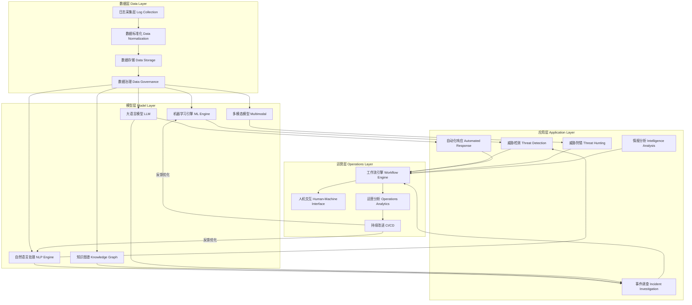
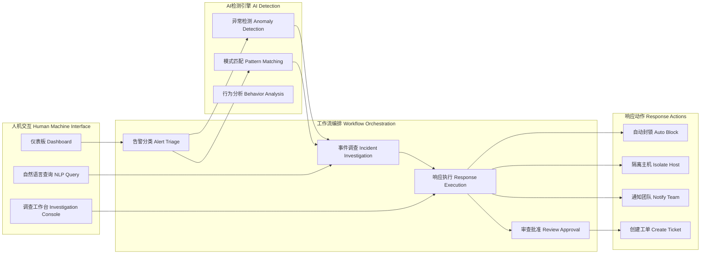
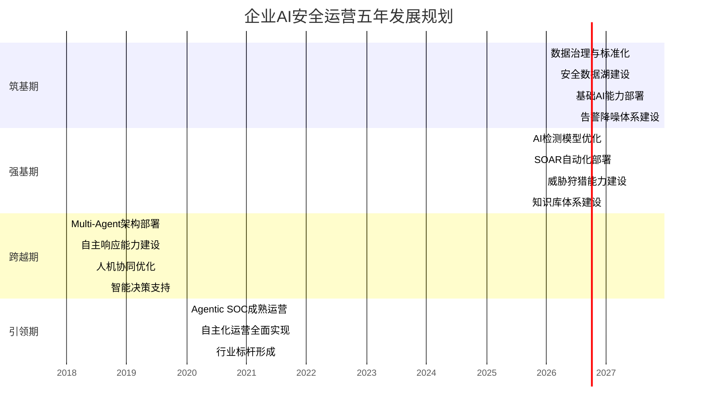

# 十年磨一剑：企业AI安全运营终极蓝图规划

## 文章信息

- **作者**：HOS（安全风信子）
- **日期**：2026-04-27
- **标签**：AI安全运营、Agentic SOC、安全架构、五年规划、持续迭代
- **分类**：企业安全运营

---

## 摘要

本文为企业AI安全运营领域提供了一份雄心勃勃却又切实可行的终极蓝图规划。在网络安全威胁日益智能化、攻击手段不断演进的今天，传统的安全运营模式已经难以应对日益复杂的安全挑战。本文提出了“AI原生安全运营”的核心理念，设计了完整的四层安全运营架构，规划了2026年至2030年的五年发展路线图，并建立了科学的持续迭代机制。文章不仅包含详实的理论框架和架构设计，还提供了大量可落地的技术实现方案和代码示例，旨在帮助企业构建面向未来十年的智能安全运营体系，实现从传统SOC向AI驱动的新一代安全运营中心的平滑演进。

---

## 一、AI原生安全运营的愿景与定位

### 1.1 为什么需要AI原生安全运营

网络安全行业正经历着一场前所未有的变革。根据最新的全球安全研究报告显示，2025年上半年 enterprises 遭受的勒索软件攻击同比增长了340%，其中超过60%的攻击采用了AI生成的钓鱼邮件和社会工程学手段。传统的基于规则和签名的安全防护体系在面对这些新型攻击时显得力不从心，告警疲劳、响应延迟、人才短缺等问题日益严重。

传统的安全运营中心（SOC）在过去二十年间一直是企业安全防护的核心，然而随着数字化转型的深入推进和云计算、边缘计算的广泛普及，企业的攻击面呈现指数级扩张态势。一个中型的金融企业每天产生的安全日志量可能达到数十TB级别，安全告警数量可能超过百万条，而传统的安全分析师团队可能仅有数十人规模，这种严重的信息不对称使得安全运营团队疲于奔命，漏报、误报现象频繁发生。

更令人担忧的是，攻击者的手段正在快速进化。从最初的脚本小子炫技式攻击，到如今有组织、有预谋、有资助的APT攻击，攻击者已经开始运用AI技术来增强其攻击能力。AI生成的钓鱼邮件可以绕过传统的文本过滤系统，基于深度伪造的视频通话可以让身份冒充攻击达到前所未有的真实程度，而由AI驱动的高级持续性威胁（APT）能够自主学习目标环境的防御策略并动态调整攻击手法。在这样的背景下，如果防御者仍然固守传统的安全运营模式，无异于在现代战争中使用冷兵器。

AI原生安全运营（AI-Native Security Operations）正是在这样的背景下应运而生。它不是简单地将AI技术叠加到现有的安全运营流程之上，而是从架构设计之初就将AI能力作为整个安全运营体系的核心支柱，实现安全运营的全面智能化转型。这种转型涉及到技术架构的重新设计、运营流程的再造、组织能力的重塑，以及安全文化的全面升级。

### 1.2 AI原生安全运营的核心特征

AI原生安全运营与传统安全运营有着本质的区别。传统安全运营往往是“人工+工具”的组合模式，安全分析师在各种安全工具之间切换，手动进行告警研判、事件调查和响应处置，AI技术充其量只是提供了某些自动化的辅助功能。而AI原生安全运营则将AI提升到了核心地位，实现了“人机融合”到“AI主导”的跨越。

第一个核心特征是**自主感知与检测**。在AI原生安全运营体系中，AI系统能够7×24小时不间断地监控企业内外部的安全态势，自主识别异常行为和潜在威胁。与传统基于签名的检测方式不同，AI驱动的检测系统能够通过学习正常行为模式来发现未知威胁，实现从“已知威胁检测”到“异常行为发现”的范式转变。这种自主感知能力不仅局限于已知攻击类型的检测，更能够发现隐藏在正常流量中的隐蔽攻击信号。

第二个核心特征是**智能分析与推理**。面对海量告警和事件，AI系统能够自动进行关联分析、上下文丰富和根因定位。传统的安全分析师可能需要数小时甚至数天来调查一个复杂的安全事件，而AI系统可以在数分钟内完成从告警触发到攻击链还原的全过程。更重要的是，AI系统能够整合全球威胁情报、企业内部安全数据和历史处置经验，形成对安全态势的全面理解。

第三个核心特征是**自动化响应与编排**。AI原生安全运营将SOAR（安全编排自动化与响应）能力提升到了新的高度。基于对威胁的智能评估，AI系统可以自主决定最优的响应策略，从自动封锁恶意IP、隔离受感染主机，到生成详细的事件报告和修复建议，全部可以在无人干预的情况下完成。当然，对于高风险或涉及关键资产的响应动作，AI系统会及时引入人工审核机制，确保响应行为的准确性和安全性。

第四个核心特征是**持续学习与进化**。AI原生安全运营体系不是静态的系统，而是一个能够不断学习和进化的有机体。每一次安全事件的处置、每一次误报的纠正、每一次防御的绕过，都能成为AI系统进化的养分。通过持续的反馈循环，AI系统能够不断优化其检测模型、响应策略和决策逻辑，使整个安全运营体系的防护能力随时间推移而不断增强。

### 1.3 从传统SOC到Agentic SOC的演进路径

传统SOC向AI原生安全运营的演进不是一蹴而就的过程，而是一个分阶段、分步骤的渐进式转型之路。根据业界最佳实践和大量的企业落地经验，我们提出了一个五级成熟度模型来描述这一演进过程。

第一级是**初始级**，这个阶段的企业安全运营主要依赖分散的安全工具和人工操作。各种安全设备各自为政，告警信息分散在不同的平台中，安全分析师需要手动登录各个系统进行告警查看和事件调查。这种模式的问题在于效率低下、响应缓慢，且严重依赖个人经验。

第二级是**增强级**，企业开始整合各种安全工具，建立统一的安全管理平台。SIEM（安全信息和事件管理）系统将来自不同源的日志和告警进行集中存储和关联分析，安全分析师的工作效率得到显著提升。同时，企业开始尝试引入AI辅助功能，如基于机器学习的异常检测、智能告警分类等。

第三级是**自动化级**，企业开始大规模应用自动化技术来提升安全运营效率。SOAR平台被引入来自动化执行常见的安全响应流程，安全分析师可以从大量重复性工作中解放出来，专注于更需要专业判断的工作。AI技术在告警降噪、事件分类等场景中开始发挥重要作用。

第四级是**智能化级**，AI成为安全运营的核心驱动力。AI系统不仅能够进行告警分析，更能够主动进行威胁狩猎、预测性分析和智能决策。多AI Agent协作模式开始形成，不同的AI Agent承担不同的安全职责，通过协作完成复杂的安全任务。人机协同成为主要的工作模式。

第五级是**自主化级**，即Agentic SOC阶段。在这个阶段，安全运营中心具备高度自主的感知、分析、决策和响应能力。AI系统能够在大多数情况下独立处理安全事件，人类安全专家主要负责战略层面的决策和异常情况的处理。这代表了安全运营的最高形态，也是我们蓝图规划的最终目标。

---

## 二、AI原生安全运营体系架构设计

### 2.1 四层架构总览

AI原生安全运营体系的架构设计是整个蓝图的骨架，直接决定了系统的能力和未来的扩展空间。我们设计的架构遵循“分层解耦、模块化设计、可扩展演进”的原则，采用四层架构模型：数据层、模型层、应用层和运营层。每一层都有其独特的职责和能力要求，层与层之间通过标准化的接口进行通信，形成了既相互独立又紧密协作的有机整体。

这种分层架构的设计有多重考量。首先，分层解耦使得各层可以独立演进，不会因为某一层的技术升级而影响整个系统。其次，模块化设计允许企业根据自身的实际情况选择性地引入或升级特定模块，降低了整体建设的复杂度和技术风险。再次，这种架构为未来的能力扩展预留了充足的空间，企业可以在不破坏现有架构的前提下不断增加新的功能模块和AI能力。



### 2.2 数据层设计与实现

数据是AI安全运营的根基。正如古语所言“巧妇难为无米之炊”，再先进的AI算法如果没有高质量的数据支撑，也难以发挥其应有的价值。数据层的设计需要解决数据采集、数据标准化、数据存储和数据治理四大核心问题。

在数据采集层面，企业需要构建一个多源、异构、实时的数据采集体系。数据源的类型繁多，包括网络层面的流量数据（NetFlow、包捕获、DNS日志）、主机层面的系统日志和应用日志（Windows Event、Syslog、application logs）、安全设备产生的告警数据（IDS/IPS、防火墙、EDR、WAF）、威胁情报数据（外部情报订阅、内部情报生成）、以及用户行为数据（身份认证日志、访问日志）等。这些数据源的格式各异、采集方式不同，需要统一的数据采集框架来进行整合。

一个典型的数据采集框架需要支持多种采集协议和方式，包括Syslog、HTTP API、Kafka、Fluentd、Filebeat等。同时，为了保证数据采集的实时性和可靠性，采集框架需要支持数据缓冲、断点续传、流量控制等机制。在大规模企业环境中，每天的数据采集量可能达到PB级别，因此数据采集系统的可扩展性和高性能至关重要。

```python
#!/usr/bin/env python3
"""
AI原生安全运营平台 - 数据采集适配器框架
该模块提供统一的数据采集接口，支持多种安全数据源的接入
"""

import json
import socket
import threading
from datetime import datetime
from typing import Dict, List, Optional, Callable
from abc import ABC, abstractmethod
import queue
import logging

logging.basicConfig(level=logging.INFO)
logger = logging.getLogger("data_collector")


class DataSource(ABC):
    """数据源抽象基类"""

    def __init__(self, source_id: str, source_type: str):
        self.source_id = source_id
        self.source_type = source_type
        self.buffer_queue = queue.Queue(maxsize=10000)
        self.running = False
        self._consumer_threads: List[threading.Thread] = []

    @abstractmethod
    def connect(self) -> bool:
        """建立连接"""
        pass

    @abstractmethod
    def disconnect(self):
        """断开连接"""
        pass

    @abstractmethod
    def _fetch_data(self):
        """数据拉取逻辑"""
        pass

    def start(self):
        """启动数据采集"""
        if self.running:
            return
        self.running = True
        self._fetch_data()

    def stop(self):
        """停止数据采集"""
        self.running = False
        for t in self._consumer_threads:
            t.join(timeout=5)

    def add_consumer(self, consumer: Callable[[Dict], None]):
        """添加数据消费者"""
        thread = threading.Thread(target=self._consume_loop, args=(consumer,))
        thread.daemon = True
        thread.start()
        self._consumer_threads.append(thread)

    def _consume_loop(self, consumer: Callable[[Dict], None]):
        """消费循环"""
        while self.running:
            try:
                data = self.buffer_queue.get(timeout=1)
                consumer(data)
            except queue.Empty:
                continue
            except Exception as e:
                logger.error(f"Consumer error: {e}")


class SyslogSource(DataSource):
    """Syslog数据源"""

    def __init__(self, source_id: str, host: str, port: int = 514,
                 protocol: str = "udp", filters: Optional[List[str]] = None):
        super().__init__(source_id, "syslog")
        self.host = host
        self.port = port
        self.protocol = protocol.lower()
        self.filters = filters or []
        self._socket: Optional[socket.socket] = None

    def connect(self) -> bool:
        try:
            if self.protocol == "udp":
                self._socket = socket.socket(socket.AF_INET, socket.SOCK_DGRAM)
                self._socket.setsockopt(socket.SOL_SOCKET, socket.SO_RCVBUF, 1024*1024*10)
                self._socket.bind((self.host, self.port))
            else:
                self._socket = socket.socket(socket.AF_INET, socket.SOCK_STREAM)
                self._socket.connect((self.host, self.port))
            logger.info(f"Syslog source {self.source_id} connected to {self.host}:{self.port}")
            return True
        except Exception as e:
            logger.error(f"Failed to connect syslog source: {e}")
            return False

    def disconnect(self):
        if self._socket:
            self._socket.close()
            self._socket = None

    def _fetch_data(self):
        buffer = ""
        while self.running:
            try:
                if self.protocol == "udp":
                    data, addr = self._socket.recvfrom(65535)
                    raw_message = data.decode('utf-8', errors='ignore')
                else:
                    raw_message = self._socket.recv(65535).decode('utf-8', errors='ignore')

                normalized = self._normalize_syslog(raw_message)
                if self._apply_filters(normalized):
                    self.buffer_queue.put(normalized, timeout=1)

            except Exception as e:
                logger.error(f"Error fetching syslog data: {e}")
                continue

    def _normalize_syslog(self, raw_message: str) -> Dict:
        """Syslog消息标准化"""
        timestamp = datetime.now().isoformat()
        facility = "unknown"
        severity = "unknown"
        hostname = "unknown"
        message = raw_message

        parts = raw_message.split()
        if len(parts) >= 4:
            timestamp = parts[0] + " " + parts[1]
            severity = self._parse_priority(parts[2])
            message = " ".join(parts[3:])

        return {
            "source_id": self.source_id,
            "timestamp": timestamp,
            "facility": facility,
            "severity": severity,
            "raw_message": message,
            "normalized_message": message.lower(),
            "collected_at": datetime.now().isoformat()
        }

    def _parse_priority(self, pri: str) -> str:
        """解析优先级"""
        try:
            p = int(pri.strip('<>'))
            severity_map = {0: "emergency", 1: "alert", 2: "critical",
                          3: "error", 4: "warning", 5: "notice", 6: "info", 7: "debug"}
            return severity_map.get(p % 8, "unknown")
        except:
            return "info"

    def _apply_filters(self, data: Dict) -> bool:
        """应用过滤规则"""
        msg = data.get("normalized_message", "")
        for f in self.filters:
            if f.lower() in msg:
                return False
        return True


class HTTPAPISource(DataSource):
    """HTTP API数据源"""

    def __init__(self, source_id: str, endpoint: str,
                 auth_token: Optional[str] = None,
                 poll_interval: int = 60,
                 headers: Optional[Dict] = None):
        super().__init__(source_id, "http_api")
        self.endpoint = endpoint
        self.auth_token = auth_token
        self.poll_interval = poll_interval
        self.headers = headers or {}

    def connect(self) -> bool:
        logger.info(f"HTTP API source {self.source_id} initialized: {self.endpoint}")
        return True

    def disconnect(self):
        pass

    def _fetch_data(self):
        import time
        while self.running:
            try:
                data = self._pull_data()
                if data:
                    if isinstance(data, list):
                        for item in data:
                            self.buffer_queue.put(item, timeout=1)
                    else:
                        self.buffer_queue.put(data, timeout=1)
            except Exception as e:
                logger.error(f"Error pulling API data: {e}")

            time.sleep(self.poll_interval)

    def _pull_data(self) -> Dict:
        """拉取数据"""
        import urllib.request
        import urllib.error

        req = urllib.request.Request(self.endpoint, headers=self.headers)
        if self.auth_token:
            req.add_header("Authorization", f"Bearer {self.auth_token}")

        try:
            with urllib.request.urlopen(req, timeout=30) as response:
                return json.loads(response.read().decode('utf-8'))
        except urllib.error.HTTPError as e:
            logger.error(f"API HTTP error: {e.code} - {e.reason}")
            return {}
        except Exception as e:
            logger.error(f"API request error: {e}")
            return {}


class DataCollectorManager:
    """数据采集管理器"""

    def __init__(self):
        self.sources: Dict[str, DataSource] = {}
        self.consumers: List[Callable[[Dict], None]] = []
        self._running = False

    def register_source(self, source: DataSource) -> bool:
        """注册数据源"""
        if source.connect():
            self.sources[source.source_id] = source
            for consumer in self.consumers:
                source.add_consumer(consumer)
            logger.info(f"Source {source.source_id} registered successfully")
            return True
        return False

    def unregister_source(self, source_id: str):
        """注销数据源"""
        if source_id in self.sources:
            source = self.sources[source_id]
            source.stop()
            source.disconnect()
            del self.sources[source_id]
            logger.info(f"Source {source_id} unregistered")

    def register_consumer(self, consumer: Callable[[Dict], None]):
        """注册数据消费者"""
        self.consumers.append(consumer)
        for source in self.sources.values():
            source.add_consumer(consumer)

    def start_all(self):
        """启动所有数据源"""
        self._running = True
        for source in self.sources.values():
            source.start()
        logger.info(f"All {len(self.sources)} sources started")

    def stop_all(self):
        """停止所有数据源"""
        self._running = False
        for source in self.sources.values():
            source.stop()
        logger.info("All sources stopped")


if __name__ == "__main__":
    collector = DataCollectorManager()

    syslog_source = SyslogSource(
        source_id="firewall_syslog",
        host="192.168.1.100",
        port=514,
        protocol="udp",
        filters=["heartbeat", "keepalive"]
    )

    api_source = HTTPAPISource(
        source_id="threat_intel_api",
        endpoint="https://api.threatintel.example.com/v2/indicators",
        auth_token="your_token_here",
        poll_interval=300
    )

    def log_consumer(data: Dict):
        print(f"[{data.get('timestamp', 'N/A')}] {data.get('source_id', 'unknown')}: {data.get('raw_message', '')[:100]}")

    collector.register_consumer(log_consumer)
    collector.register_source(syslog_source)
    collector.register_source(api_source)

    collector.start_all()

    import time
    try:
        while True:
            time.sleep(10)
            logger.info(f"Collector running with {len(collector.sources)} sources")
    except KeyboardInterrupt:
        collector.stop_all()
```

数据标准化是数据层的另一个关键环节。来自不同数据源的日志和事件往往格式各异，需要通过标准化处理才能进行统一的分析和关联。标准化的内容包括时间戳统一（将不同格式的时间戳转换为ISO 8601格式）、字段映射（将不同数据源的字段映射到统一的数据模型）、事件分类（将原始事件归类到预定义的安全事件类型）、以及数据富化（添加资产信息、用户信息、地理位置等上下文）。

数据存储需要兼顾实时查询和历史分析的需求。对于实时告警分析场景，需要支持高吞吐量的写入和低延迟的查询；对于历史分析场景，需要支持大规模数据的聚合分析和趋势分析。因此，我们推荐采用混合存储架构，将热数据存储在Elasticsearch等搜索引擎中以支持实时分析，将温数据存储在ClickHouse等OLAP引擎中以支持分析查询，将冷数据归档到对象存储中以降低成本。

数据治理是确保数据质量的核心机制。数据治理包括数据质量监控（检测数据丢失、格式错误、异常值等问题）、数据血缘追踪（记录数据的来源、流转和加工过程）、数据权限管理（控制不同角色对不同数据的访问权限）、以及数据生命周期管理（定义数据的保留期限和归档策略）。

### 2.3 模型层设计与实现

模型层是AI原生安全运营的“大脑”，负责提供各种AI能力来支撑上层的应用。模型层由多个AI引擎组成，包括机器学习引擎、自然语言处理引擎、知识图谱引擎、大语言模型和多模态模型。这些引擎相互协作，共同构成了AI安全运营的智能核心。

机器学习引擎是模型层的基础组件，提供了传统机器学习和深度学习的能力支持。在安全运营场景中，机器学习引擎主要用于异常检测（如基于聚类的异常行为发现）、分类任务（如恶意软件分类、告警分类）、回归任务（如威胁评分预测）和序列建模（如基于LSTM的网络流量异常检测）。机器学习引擎需要提供完整的模型生命周期管理功能，包括特征工程、模型训练、模型评估、模型部署和模型监控。

自然语言处理引擎为安全运营提供了文本理解和生成能力。安全领域有大量的文本数据，包括安全告警的描述、安全报告的正文、威胁情报的描述、漏洞的描述等。自然语言处理引擎能够理解这些文本的语义，提取关键信息，并生成结构化的分析结果。在安全运营场景中，自然语言处理引擎主要用于告警摘要生成、事件报告生成、威胁情报解析和安全问答。

```python
#!/usr/bin/env python3
"""
AI原生安全运营平台 - 机器学习检测引擎
该模块提供基于机器学习的安全威胁检测能力
"""

import numpy as np
from datetime import datetime, timedelta
from typing import Dict, List, Tuple, Optional, Any
from dataclasses import dataclass, field
from collections import defaultdict
import json
import pickle
import hashlib
import logging
from abc import ABC, abstractmethod

logging.basicConfig(level=logging.INFO)
logger = logging.getLogger("ml_detection_engine")


@dataclass
class FeatureVector:
    """特征向量"""
    features: np.ndarray
    feature_names: List[str]
    timestamp: datetime
    entity_id: str
    entity_type: str

    def to_dict(self) -> Dict:
        return {
            "entity_id": self.entity_id,
            "entity_type": self.entity_type,
            "timestamp": self.timestamp.isoformat(),
            "features": self.features.tolist(),
            "feature_names": self.feature_names
        }


@dataclass
class DetectionResult:
    """检测结果"""
    alert_id: str
    entity_id: str
    entity_type: str
    threat_type: str
    confidence: float
    risk_score: float
    description: str
    evidence: List[Dict]
    recommended_actions: List[str]
    timestamp: datetime

    def to_dict(self) -> Dict:
        return {
            "alert_id": self.alert_id,
            "entity_id": self.entity_id,
            "entity_type": self.entity_type,
            "threat_type": self.threat_type,
            "confidence": self.confidence,
            "risk_score": self.risk_score,
            "description": self.description,
            "evidence": self.evidence,
            "recommended_actions": self.recommended_actions,
            "timestamp": self.timestamp.isoformat()
        }


class AnomalyDetector(ABC):
    """异常检测器基类"""

    @abstractmethod
    def fit(self, normal_data: List[FeatureVector]) -> None:
        """训练模型"""
        pass

    @abstractmethod
    def predict(self, data: FeatureVector) -> Tuple[bool, float]:
        """
        预测异常
        返回: (is_anomaly, anomaly_score)
        """
        pass

    @abstractmethod
    def explain(self, data: FeatureVector) -> Dict:
        """解释异常原因"""
        pass


class IsolationForestDetector(AnomalyDetector):
    """基于隔离森林的异常检测"""

    def __init__(self, n_estimators: int = 100, contamination: float = 0.1,
                 random_state: int = 42):
        self.n_estimators = n_estimators
        self.contamination = contamination
        self.random_state = random_state
        self._model = None
        self._feature_means: Optional[np.ndarray] = None
        self._feature_stds: Optional[np.ndarray] = None
        self._is_fitted = False

    def fit(self, normal_data: List[FeatureVector]) -> None:
        """训练隔离森林模型"""
        if not normal_data:
            raise ValueError("Training data cannot be empty")

        features_list = []
        self.feature_names = normal_data[0].feature_names

        for fv in normal_data:
            features_list.append(fv.features)

        X = np.array(features_list)

        self._feature_means = np.mean(X, axis=0)
        self._feature_stds = np.std(X, axis=0) + 1e-10
        X_normalized = (X - self._feature_means) / self._feature_stds

        self._model = self._build_isolation_forest(X_normalized)
        self._is_fitted = True

        logger.info(f"IsolationForest trained on {len(normal_data)} samples")

    def _build_isolation_forest(self, X: np.ndarray) -> Dict:
        """构建隔离森林"""
        n_samples, n_features = X.shape
        n_trees = self.n_estimators

        trees = []
        for _ in range(n_trees):
            sample_indices = np.random.choice(n_samples, n_samples, replace=True)
            tree = self._build_tree(X[sample_indices], depth=0, max_depth=10)
            trees.append(tree)

        return {"trees": trees, "n_features": n_features}

    def _build_tree(self, X: np.ndarray, depth: int, max_depth: int) -> Dict:
        """构建单棵树"""
        if depth >= max_depth or len(X) <= 1:
            return {"leaf": True, "size": len(X)}

        feature_idx = np.random.randint(0, X.shape[1])
        split_val = np.random.uniform(X[:, feature_idx].min(), X[:, feature_idx].max())

        left_mask = X[:, feature_idx] < split_val
        right_mask = ~left_mask

        return {
            "leaf": False,
            "depth": depth,
            "feature_idx": feature_idx,
            "split_val": split_val,
            "left": self._build_tree(X[left_mask], depth + 1, max_depth),
            "right": self._build_tree(X[right_mask], depth + 1, max_depth),
            "size": len(X)
        }

    def _path_length(self, x: np.ndarray, tree: Dict, depth: int = 0) -> float:
        """计算样本在树中的路径长度"""
        if tree["leaf"]:
            return depth + self._c(len(tree["size"]) if "size" in tree else 1)

        feature_idx = tree["feature_idx"]
        split_val = tree["split_val"]

        if x[feature_idx] < split_val:
            return self._path_length(x, tree["left"], depth + 1)
        else:
            return self._path_length(x, tree["right"], depth + 1)

    def _c(self, n: int) -> float:
        """调整因子"""
        if n <= 1:
            return 0.0
        return 2.0 * (np.log(n - 1) + 0.5772156649) - (2.0 * (n - 1) / n)

    def predict(self, data: FeatureVector) -> Tuple[bool, float]:
        """预测异常"""
        if not self._is_fitted:
            raise RuntimeError("Model not fitted yet")

        x_normalized = (data.features - self._feature_means) / self._feature_stds

        path_lengths = []
        for tree in self._model["trees"]:
            path_lengths.append(self._path_length(x_normalized, tree))

        avg_path_length = np.mean(path_lengths)
        c_n = self._c(len(self._model["trees"]))
        anomaly_score = np.power(2, -avg_path_length / c_n)

        threshold = 1 - self.contamination
        is_anomaly = anomaly_score > threshold

        return bool(is_anomaly), float(anomaly_score)

    def explain(self, data: FeatureVector) -> Dict:
        """解释异常原因"""
        x_normalized = (data.features - self._feature_means) / self._feature_stds

        feature_importance = {}
        for i, name in enumerate(self.feature_names):
            contribution = abs(x_normalized[i]) * (1.0 / (self._feature_stds[i] + 1e-10))
            feature_importance[name] = float(contribution)

        sorted_features = sorted(feature_importance.items(), key=lambda x: x[1], reverse=True)

        return {
            "top_contributing_features": sorted_features[:5],
            "overall_deviation": float(np.linalg.norm(x_normalized)),
            "feature_deviations": {
                name: float(x_normalized[i])
                for i, name in enumerate(self.feature_names)
            }
        }


class TimeSeriesAnomalyDetector(AnomalyDetector):
    """基于时序分析的异常检测"""

    def __init__(self, window_size: int = 100, threshold_sigma: float = 3.0):
        self.window_size = window_size
        self.threshold_sigma = threshold_sigma
        self._history: Dict[str, List[Tuple[datetime, float]]] = defaultdict(list)
        self._models: Dict[str, Dict] = {}
        self._is_fitted = False

    def fit(self, normal_data: List[FeatureVector]) -> None:
        """训练时序模型"""
        grouped = defaultdict(list)
        for fv in normal_data:
            grouped[fv.entity_id].append((fv.timestamp, fv.features))

        for entity_id, samples in grouped.items():
            sorted_samples = sorted(samples, key=lambda x: x[0])
            values = np.array([s[1].mean() for s in sorted_samples])

            mean = np.mean(values)
            std = np.std(values) + 1e-10

            self._models[entity_id] = {
                "mean": mean,
                "std": std,
                "ewma": values[-1] if len(values) > 0 else mean
            }

            for timestamp, features in sorted_samples[-self.window_size:]:
                self._history[entity_id].append((timestamp, features.mean()))

        self._is_fitted = True
        logger.info(f"TimeSeries detector trained on {len(self._models)} entities")

    def predict(self, data: FeatureVector) -> Tuple[bool, float]:
        """预测异常"""
        if not self._is_fitted:
            raise RuntimeError("Model not fitted yet")

        entity_id = data.entity_id
        current_value = data.features.mean()

        if entity_id not in self._models:
            return True, 1.0

        model = self._models[entity_id]
        z_score = abs(current_value - model["mean"]) / model["std"]

        is_anomaly = z_score > self.threshold_sigma
        anomaly_score = min(z_score / (self.threshold_sigma * 2), 1.0)

        alpha = 0.3
        model["ewma"] = alpha * current_value + (1 - alpha) * model["ewma"]

        return bool(is_anomaly), float(anomaly_score)

    def explain(self, data: FeatureVector) -> Dict:
        """解释异常原因"""
        entity_id = data.entity_id

        if entity_id not in self._models:
            return {"error": "No model found for entity"}

        model = self._models[entity_id]
        current_value = data.features.mean()

        return {
            "expected_range": {
                "mean": float(model["mean"]),
                "lower": float(model["mean"] - self.threshold_sigma * model["std"]),
                "upper": float(model["mean"] + self.threshold_sigma * model["std"])
            },
            "observed_value": float(current_value),
            "deviation": float(current_value - model["mean"]),
            "z_score": float(abs(current_value - model["mean"]) / model["std"])
        }


class MLDetectionEngine:
    """机器学习检测引擎"""

    def __init__(self):
        self.detectors: Dict[str, AnomalyDetector] = {}
        self.feature_extractors: Dict[str, callable] = {}
        self.alert_history: List[DetectionResult] = []
        self._callbacks: List[callable] = []

    def register_detector(self, name: str, detector: AnomalyDetector) -> None:
        """注册检测器"""
        self.detectors[name] = detector
        logger.info(f"Registered detector: {name}")

    def register_feature_extractor(self, event_type: str, extractor: callable) -> None:
        """注册特征提取器"""
        self.feature_extractors[event_type] = extractor

    def train(self, training_data: List[Dict], detector_name: str = "isolation_forest") -> None:
        """训练检测模型"""
        if detector_name not in self.detectors:
            if detector_name == "isolation_forest":
                detector = IsolationForestDetector(n_estimators=100, contamination=0.1)
            elif detector_name == "time_series":
                detector = TimeSeriesAnomalyDetector(window_size=100, threshold_sigma=3.0)
            else:
                raise ValueError(f"Unknown detector: {detector_name}")
            self.register_detector(detector_name, detector)

        feature_vectors = []
        for item in training_data:
            fv = self._create_feature_vector(item)
            feature_vectors.append(fv)

        self.detectors[detector_name].fit(feature_vectors)

    def detect(self, event_data: Dict) -> List[DetectionResult]:
        """执行检测"""
        results = []

        for detector_name, detector in self.detectors.items():
            try:
                fv = self._create_feature_vector(event_data)
                is_anomaly, score = detector.predict(fv)

                if is_anomaly:
                    explanation = detector.explain(fv)
                    result = self._create_detection_result(event_data, detector_name, score, explanation)
                    results.append(result)
                    self.alert_history.append(result)

                    for callback in self._callbacks:
                        callback(result)

            except Exception as e:
                logger.error(f"Detection error with {detector_name}: {e}")

        return results

    def _create_feature_vector(self, event_data: Dict) -> FeatureVector:
        """创建特征向量"""
        entity_id = event_data.get("entity_id", event_data.get("src_ip", "unknown"))
        entity_type = event_data.get("entity_type", "connection")

        features = []
        feature_names = []

        numeric_fields = [
            "duration", "bytes_sent", "bytes_received", "packets",
            "src_port", "dst_port", "connection_count"
        ]

        for field in numeric_fields:
            if field in event_data:
                features.append(float(event_data[field]))
                feature_names.append(field)

        if "hour_of_day" in event_data:
            features.append(float(event_data["hour_of_day"]))
            feature_names.append("hour_of_day")

        if "day_of_week" in event_data:
            features.append(float(event_data["day_of_week"]))
            feature_names.append("day_of_week")

        if not features:
            features = [0.0] * 10
            feature_names = [f"feature_{i}" for i in range(10)]

        return FeatureVector(
            features=np.array(features),
            feature_names=feature_names,
            timestamp=datetime.now(),
            entity_id=entity_id,
            entity_type=entity_type
        )

    def _create_detection_result(self, event_data: Dict, detector_name: str,
                                score: float, explanation: Dict) -> DetectionResult:
        """创建检测结果"""
        alert_id = hashlib.md5(
            f"{event_data.get('entity_id', '')}{datetime.now().isoformat()}".encode()
        ).hexdigest()[:12]

        threat_type = self._classify_threat(explanation)
        confidence = min(score * 1.2, 1.0)
        risk_score = score * 100

        return DetectionResult(
            alert_id=alert_id,
            entity_id=event_data.get("entity_id", "unknown"),
            entity_type=event_data.get("entity_type", "unknown"),
            threat_type=threat_type,
            confidence=confidence,
            risk_score=risk_score,
            description=f"Detected {threat_type} with {detector_name}",
            evidence=[{"type": "anomaly_score", "value": score}, explanation],
            recommended_actions=self._get_recommended_actions(threat_type),
            timestamp=datetime.now()
        )

    def _classify_threat(self, explanation: Dict) -> str:
        """分类威胁类型"""
        if "top_contributing_features" in explanation:
            features = dict(explanation.get("top_contributing_features", []))
            if any("port" in f.lower() for f in features):
                return "Port Scan"
            if any("bytes" in f.lower() for f in features):
                return "Data Exfiltration"
            return "Anomalous Behavior"

        return "Unknown Threat"

    def _get_recommended_actions(self, threat_type: str) -> List[str]:
        """获取推荐行动"""
        actions_map = {
            "Port Scan": [
                "Block source IP",
                "Enable enhanced monitoring",
                "Update firewall rules"
            ],
            "Data Exfiltration": [
                "Isolate affected host",
                "Capture network traffic",
                "Notify data security team"
            ],
            "Anomalous Behavior": [
                "Investigate entity activity",
                "Review recent changes",
                "Correlate with other alerts"
            ]
        }
        return actions_map.get(threat_type, ["Investigate further"])

    def register_alert_callback(self, callback: callable) -> None:
        """注册告警回调"""
        self._callbacks.append(callback)

    def get_detection_stats(self) -> Dict:
        """获取检测统计"""
        if not self.alert_history:
            return {"total_alerts": 0}

        threat_counts = defaultdict(int)
        for alert in self.alert_history:
            threat_counts[alert.threat_type] += 1

        return {
            "total_alerts": len(self.alert_history),
            "threat_types": dict(threat_counts),
            "avg_confidence": np.mean([a.confidence for a in self.alert_history]),
            "avg_risk_score": np.mean([a.risk_score for a in self.alert_history])
        }


if __name__ == "__main__":
    engine = MLDetectionEngine()

    training_samples = []
    for i in range(1000):
        training_samples.append({
            "entity_id": f"host_{i % 50}",
            "entity_type": "connection",
            "duration": np.random.normal(100, 20),
            "bytes_sent": np.random.normal(1000, 200),
            "bytes_received": np.random.normal(2000, 400),
            "packets": np.random.normal(50, 10),
            "src_port": np.random.randint(1024, 65535),
            "dst_port": 443,
            "connection_count": np.random.poisson(5),
            "hour_of_day": np.random.randint(0, 24),
            "day_of_week": np.random.randint(0, 7)
        })

    engine.train(training_samples, "isolation_forest")

    def alert_handler(alert: DetectionResult):
        print(f"[ALERT] {alert.alert_id}: {alert.threat_type} "
              f"(confidence: {alert.confidence:.2f}, risk: {alert.risk_score:.2f})")
        print(f"  Recommended: {', '.join(alert.recommended_actions)}")

    engine.register_alert_callback(alert_handler)

    test_events = [
        {
            "entity_id": "host_1",
            "entity_type": "connection",
            "duration": 500,
            "bytes_sent": 100000,
            "bytes_received": 500,
            "packets": 200,
            "src_port": 54321,
            "dst_port": 22,
            "connection_count": 100,
            "hour_of_day": 3,
            "day_of_week": 1
        },
        {
            "entity_id": "host_2",
            "entity_type": "connection",
            "duration": 100,
            "bytes_sent": 1000,
            "bytes_received": 2000,
            "packets": 50,
            "src_port": 12345,
            "dst_port": 443,
            "connection_count": 5,
            "hour_of_day": 14,
            "day_of_week": 3
        }
    ]

    print("\nRunning detection on test events...")
    for event in test_events:
        results = engine.detect(event)
        print(f"Event {event['entity_id']}: {len(results)} alerts")

    stats = engine.get_detection_stats()
    print(f"\nDetection Stats: {stats}")
```

知识图谱引擎是模型层的重要组成部分，它能够将企业安全领域的各种实体和关系组织成图结构，支持复杂的关联查询和推理分析。在安全运营场景中，知识图谱可以用于构建攻击链图谱、资产关系图谱、威胁情报图谱等。通过知识图谱，AI系统能够理解不同安全事件之间的关联关系，还原完整的攻击路径，评估攻击影响范围。

大语言模型（LLM）的引入为安全运营带来了革命性的变化。LLM能够理解自然语言描述的安全问题，生成专业的分析报告和建议。通过与知识库的结合，LLM可以实现安全问答、告警解读、事件摘要等功能。更重要的是，LLM能够进行复杂的推理分析，帮助安全分析师理解复杂的安全态势。

多模态模型支持对多种类型数据的处理，包括文本、图像、音频等。在安全运营中，多模态模型可以用于恶意软件分析（结合静态特征和动态行为）、钓鱼邮件分析（结合文本和图像）、视频监控分析（用于物理安全场景）等。

### 2.4 应用层设计与实现

应用层是AI能力在实际安全运营场景中的具体应用，包含了威胁检测、事件调查、自动化响应、威胁狩猎和情报分析五大核心功能模块。这些模块直接面向安全分析师和运营人员，提供智能化的工作辅助和自动化能力。

威胁检测模块是应用层的基础模块，负责从海量数据中识别潜在的安全威胁。威胁检测采用多引擎融合的架构，包括基于签名的检测、基于规则的检测、基于机器学习的检测和基于行为的检测。多引擎融合能够取长补短，提高检测的准确性和覆盖率。对于检测到的威胁，系统会自动进行分类、评级和富化，生成结构化的告警信息。

事件调查模块负责对告警进行深入分析，还原事件真相。传统的事件调查往往依赖安全分析师的个人经验，需要手动收集和分析各种证据，耗时耗力。AI驱动的事件调查模块能够自动收集相关日志、告警、流量数据，进行关联分析和攻击链还原，生成详细的调查报告。对于复杂事件，系统还会提出调查建议和下一步行动指引。

```python
#!/usr/bin/env python3
"""
AI原生安全运营平台 - 智能事件调查引擎
该模块提供AI驱动的自动化安全事件调查能力
"""

from datetime import datetime, timedelta
from typing import Dict, List, Optional, Tuple, Any
from dataclasses import dataclass, field
from collections import defaultdict
import json
import logging
import asyncio
from enum import Enum
import hashlib

logging.basicConfig(level=logging.INFO)
logger = logging.getLogger("incident_investigation")


class Severity(Enum):
    """事件严重级别"""
    CRITICAL = "critical"
    HIGH = "high"
    MEDIUM = "medium"
    LOW = "low"
    INFO = "info"


class IncidentStatus(Enum):
    """事件状态"""
    NEW = "new"
    INVESTIGATING = "investigating"
    CONTAINED = "contained"
    RESOLVED = "resolved"
    CLOSED = "closed"


@dataclass
class Evidence:
    """证据"""
    evidence_id: str
    evidence_type: str
    source: str
    timestamp: datetime
    description: str
    raw_data: Dict
    relevance_score: float = 0.0
    ioc_extracted: List[Dict] = field(default_factory=list)

    def to_dict(self) -> Dict:
        return {
            "evidence_id": self.evidence_id,
            "evidence_type": self.evidence_type,
            "source": self.source,
            "timestamp": self.timestamp.isoformat(),
            "description": self.description,
            "relevance_score": self.relevance_score,
            "ioc_extracted": self.ioc_extracted
        }


@dataclass
class AttackStep:
    """攻击步骤"""
    step_id: int
    step_type: str
    timestamp: datetime
    actor: str
    target: str
    technique: str
    evidence_ids: List[str]
    confidence: float
    description: str

    def to_dict(self) -> Dict:
        return {
            "step_id": self.step_id,
            "step_type": self.step_type,
            "timestamp": self.timestamp.isoformat(),
            "actor": self.actor,
            "target": self.target,
            "technique": self.technique,
            "evidence_ids": self.evidence_ids,
            "confidence": self.confidence,
            "description": self.description
        }


@dataclass
class Incident:
    """安全事件"""
    incident_id: str
    title: str
    description: str
    severity: Severity
    status: IncidentStatus
    created_at: datetime
    updated_at: datetime
    assignee: Optional[str] = None
    evidence: List[Evidence] = field(default_factory=list)
    attack_chain: List[AttackStep] = field(default_factory=list)
    root_cause: Optional[str] = None
    affected_assets: List[str] = field(default_factory=list)
    related_incidents: List[str] = field(default_factory=list)
    recommendations: List[str] = field(default_factory=list)
    timeline: List[Dict] = field(default_factory=list)

    def to_dict(self) -> Dict:
        return {
            "incident_id": self.incident_id,
            "title": self.title,
            "description": self.description,
            "severity": self.severity.value,
            "status": self.status.value,
            "created_at": self.created_at.isoformat(),
            "updated_at": self.updated_at.isoformat(),
            "assignee": self.assignee,
            "evidence": [e.to_dict() for e in self.evidence],
            "attack_chain": [a.to_dict() for a in self.attack_chain],
            "root_cause": self.root_cause,
            "affected_assets": self.affected_assets,
            "related_incidents": self.related_incidents,
            "recommendations": self.recommendations,
            "timeline": self.timeline
        }


class EvidenceCollector:
    """证据收集器"""

    def __init__(self):
        self.data_sources = {}
        self._register_default_sources()

    def _register_default_sources(self):
        """注册默认数据源"""
        self.data_sources = {
            "siem": SIEMConnector(),
            "edr": EDRConnector(),
            "network": NetworkAnalyzer(),
            "threat_intel": ThreatIntelClient()
        }

    async def collect_evidence(self, incident: Incident,
                                time_window: timedelta = timedelta(hours=24)) -> List[Evidence]:
        """收集相关证据"""
        evidence_list = []
        start_time = incident.created_at - time_window
        end_time = incident.created_at + timedelta(hours=1)

        for entity in set([e.target for e in incident.attack_chain] + incident.affected_assets):
            for source_name, connector in self.data_sources.items():
                try:
                    evidence = await connector.query(
                        entity=entity,
                        start_time=start_time,
                        end_time=end_time
                    )
                    if evidence:
                        evidence_list.extend(evidence)
                except Exception as e:
                    logger.error(f"Error collecting from {source_name}: {e}")

        evidence_list.sort(key=lambda x: x.relevance_score, reverse=True)
        return evidence_list

    def register_source(self, name: str, connector):
        """注册额外数据源"""
        self.data_sources[name] = connector


class SIEMConnector:
    """SIEM数据源连接器"""

    async def query(self, entity: str, start_time: datetime,
                   end_time: datetime) -> List[Evidence]:
        """查询SIEM数据"""
        evidence_list = []

        logs = await self._fetch_logs(entity, start_time, end_time)
        for log in logs:
            evidence = Evidence(
                evidence_id=self._generate_id(f"siem_{log['event_id']}"),
                evidence_type="log",
                source="siem",
                timestamp=log.get("timestamp", datetime.now()),
                description=log.get("message", ""),
                raw_data=log,
                relevance_score=self._calculate_relevance(log, entity)
            )
            evidence.ioc_extracted = self._extract_iocs(log)
            evidence_list.append(evidence)

        alerts = await self._fetch_alerts(entity, start_time, end_time)
        for alert in alerts:
            evidence = Evidence(
                evidence_id=self._generate_id(f"siem_alert_{alert['alert_id']}"),
                evidence_type="alert",
                source="siem",
                timestamp=alert.get("timestamp", datetime.now()),
                description=f"SIEM Alert: {alert.get('rule_name', 'Unknown')}",
                raw_data=alert,
                relevance_score=0.9
            )
            evidence.ioc_extracted = alert.get("iocs", [])
            evidence_list.append(evidence)

        return evidence_list

    async def _fetch_logs(self, entity: str, start: datetime, end: datetime) -> List[Dict]:
        """获取日志数据"""
        return [
            {
                "event_id": f"evt_{i}",
                "timestamp": start + timedelta(minutes=i*10),
                "message": f"Security event for {entity}",
                "source": "windows_security",
                "event_level": "warning"
            }
            for i in range(5)
        ]

    async def _fetch_alerts(self, entity: str, start: datetime, end: datetime) -> List[Dict]:
        """获取告警数据"""
        return [
            {
                "alert_id": f"alert_{i}",
                "timestamp": start + timedelta(minutes=i*15),
                "rule_name": f"Suspicious activity detected",
                "iocs": [
                    {"type": "ip", "value": "192.168.1.100"},
                    {"type": "domain", "value": "malicious.example.com"}
                ]
            }
            for i in range(3)
        ]

    def _calculate_relevance(self, log: Dict, entity: str) -> float:
        """计算相关性分数"""
        base_score = 0.5
        if entity in str(log.get("message", "")):
            base_score += 0.3
        if log.get("event_level") == "error":
            base_score += 0.2
        return min(base_score, 1.0)

    def _extract_iocs(self, log: Dict) -> List[Dict]:
        """提取IOCs"""
        import re
        iocs = []
        message = str(log.get("message", ""))

        ip_pattern = r'\b(?:\d{1,3}\.){3}\d{1,3}\b'
        ips = re.findall(ip_pattern, message)
        for ip in ips:
            if ip != "127.0.0.1":
                iocs.append({"type": "ip", "value": ip, "source": "log"})

        domain_pattern = r'\b(?:[a-zA-Z0-9](?:[a-zA-Z0-9\-]{0,61}[a-zA-Z0-9])?\.)+[a-zA-Z]{2,}\b'
        domains = re.findall(domain_pattern, message)
        for domain in domains:
            iocs.append({"type": "domain", "value": domain, "source": "log"})

        return iocs

    def _generate_id(self, prefix: str) -> str:
        """生成ID"""
        return hashlib.md5(prefix.encode()).hexdigest()[:12]


class EDRConnector:
    """EDR数据源连接器"""

    async def query(self, entity: str, start_time: datetime,
                   end_time: datetime) -> List[Evidence]:
        """查询EDR数据"""
        processes = await self._fetch_process_events(entity, start_time, end_time)
        file_events = await self._fetch_file_events(entity, start_time, end_time)
        network_events = await self._fetch_network_events(entity, start_time, end_time)

        evidence_list = []

        for proc in processes:
            evidence = Evidence(
                evidence_id=self._generate_id(f"edr_proc_{proc['pid']}"),
                evidence_type="process",
                source="edr",
                timestamp=proc.get("timestamp", datetime.now()),
                description=f"Process {proc.get('name', 'unknown')} executed",
                raw_data=proc,
                relevance_score=0.8
            )
            evidence.ioc_extracted = proc.get("iocs", [])
            evidence_list.append(evidence)

        for event in file_events + network_events:
            evidence = Evidence(
                evidence_id=self._generate_id(f"edr_{event['event_type']}_{event.get('id', '0')}"),
                evidence_type=event.get("event_type", "unknown"),
                source="edr",
                timestamp=event.get("timestamp", datetime.now()),
                description=event.get("description", ""),
                raw_data=event,
                relevance_score=0.7
            )
            evidence_list.append(evidence)

        return evidence_list

    async def _fetch_process_events(self, entity: str, start: datetime, end: datetime) -> List[Dict]:
        """获取进程事件"""
        return [
            {
                "pid": 1234,
                "name": "powershell.exe",
                "timestamp": start + timedelta(minutes=5),
                "command_line": "powershell -encodedcommand ...",
                "iocs": [
                    {"type": "hash", "value": "abc123def456...", "source": "edr"}
                ]
            },
            {
                "pid": 5678,
                "name": "cmd.exe",
                "timestamp": start + timedelta(minutes=10),
                "command_line": "cmd /c whoami",
                "iocs": []
            }
        ]

    async def _fetch_file_events(self, entity: str, start: datetime, end: datetime) -> List[Dict]:
        """获取文件事件"""
        return [
            {
                "event_type": "file_create",
                "id": "f001",
                "timestamp": start + timedelta(minutes=8),
                "description": "File created in system directory",
                "path": "C:\\Windows\\Temp\\malware.exe"
            }
        ]

    async def _fetch_network_events(self, entity: str, start: datetime, end: datetime) -> List[Dict]:
        """获取网络事件"""
        return [
            {
                "event_type": "network",
                "id": "n001",
                "timestamp": start + timedelta(minutes=12),
                "description": "Outbound connection to suspicious IP",
                "dest_ip": "192.168.1.100",
                "dest_port": 443
            }
        ]

    def _generate_id(self, prefix: str) -> str:
        return hashlib.md5(prefix.encode()).hexdigest()[:12]


class NetworkAnalyzer:
    """网络分析连接器"""

    async def query(self, entity: str, start_time: datetime,
                   end_time: datetime) -> List[Evidence]:
        """查询网络数据"""
        flows = await self._fetch_netflows(entity, start_time, end_time)
        dns_queries = await self._fetch_dns_queries(entity, start_time, end_time)

        evidence_list = []

        for flow in flows:
            evidence = Evidence(
                evidence_id=self._generate_id(f"netflow_{flow['flow_id']}"),
                evidence_type="network_flow",
                source="network",
                timestamp=flow.get("timestamp", datetime.now()),
                description=f"Network flow: {flow.get('src_ip')} -> {flow.get('dst_ip')}",
                raw_data=flow,
                relevance_score=0.6
            )
            evidence.ioc_extracted = flow.get("iocs", [])
            evidence_list.append(evidence)

        for dns in dns_queries:
            evidence = Evidence(
                evidence_id=self._generate_id(f"dns_{dns['query']}"),
                evidence_type="dns_query",
                source="network",
                timestamp=dns.get("timestamp", datetime.now()),
                description=f"DNS Query: {dns.get('query')}",
                raw_data=dns,
                relevance_score=0.5
            )
            evidence.ioc_extracted = [{"type": "domain", "value": dns.get("query"), "source": "dns"}]
            evidence_list.append(evidence)

        return evidence_list

    async def _fetch_netflows(self, entity: str, start: datetime, end: datetime) -> List[Dict]:
        """获取网络流数据"""
        return [
            {
                "flow_id": f"flow_{i}",
                "timestamp": start + timedelta(minutes=i*3),
                "src_ip": entity,
                "dst_ip": f"192.168.1.{100+i}",
                "src_port": 12345 + i,
                "dst_port": 443,
                "bytes": 1000 * (i + 1),
                "duration": 30 * (i + 1)
            }
            for i in range(5)
        ]

    async def _fetch_dns_queries(self, entity: str, start: datetime, end: datetime) -> List[Dict]:
        """获取DNS查询数据"""
        return [
            {"query": "suspicious-domain.example.com", "timestamp": start + timedelta(minutes=7)},
            {"query": "data-exfil.bad-domain.com", "timestamp": start + timedelta(minutes=15)}
        ]

    def _generate_id(self, prefix: str) -> str:
        return hashlib.md5(prefix.encode()).hexdigest()[:12]


class ThreatIntelClient:
    """威胁情报连接器"""

    async def query(self, entity: str, start_time: datetime,
                   end_time: datetime) -> List[Evidence]:
        """查询威胁情报"""
        iocs = await self._lookup_ioc(entity)

        evidence_list = []
        for ioc in iocs:
            evidence = Evidence(
                evidence_id=self._generate_id(f"intel_{ioc['value']}"),
                evidence_type="threat_intel",
                source="threat_intel",
                timestamp=datetime.now(),
                description=f"Known malicious IOC: {ioc.get('type')} - {ioc.get('value')}",
                raw_data=ioc,
                relevance_score=0.95 if ioc.get("confidence", 0) > 0.8 else 0.6
            )
            evidence.ioc_extracted = [ioc]
            evidence_list.append(evidence)

        return evidence_list

    async def _lookup_ioc(self, entity: str) -> List[Dict]:
        """查询IOC信誉"""
        known_bad = ["192.168.1.100", "malicious.example.com", "abc123def456..."]
        if entity in known_bad:
            return [
                {
                    "type": "ip",
                    "value": entity,
                    "confidence": 0.9,
                    "threat_type": "C2",
                    "source": "internal_threat_intel",
                    "last_seen": datetime.now().isoformat()
                }
            ]
        return []


class AttackChainBuilder:
    """攻击链构建器"""

    def __init__(self):
        self.technique_mapping = {
            "process": ["T1059", "T1053"],
            "file_create": ["T1106"],
            "network": ["T1071", "T1043"],
            "dns_query": ["T1071"],
            "alert": ["T1000"]
        }

    def build_attack_chain(self, evidence: List[Evidence]) -> List[AttackStep]:
        """构建攻击链"""
        evidence_by_time = sorted(evidence, key=lambda x: x.timestamp)

        attack_steps = []
        step_id = 1

        techniques_used = set()
        actors = set()
        targets = set()

        for ev in evidence_by_time:
            if ev.evidence_type in self.technique_mapping:
                for tech in self.technique_mapping[ev.evidence_type]:
                    if tech not in techniques_used:
                        attack_step = AttackStep(
                            step_id=step_id,
                            step_type=ev.evidence_type,
                            timestamp=ev.timestamp,
                            actor=ev.raw_data.get("src_ip", "unknown"),
                            target=ev.raw_data.get("dst_ip", ev.raw_data.get("entity", "unknown")),
                            technique=tech,
                            evidence_ids=[ev.evidence_id],
                            confidence=ev.relevance_score,
                            description=f"Detected {ev.evidence_type} using technique {tech}"
                        )
                        attack_steps.append(attack_step)
                        techniques_used.add(tech)
                        step_id += 1

        return attack_steps


class IncidentInvestigationEngine:
    """事件调查引擎"""

    def __init__(self):
        self.evidence_collector = EvidenceCollector()
        self.attack_chain_builder = AttackChainBuilder()
        self.ai_analyzer = AIAnalyzer()
        self.root_cause_analyzer = RootCauseAnalyzer()

    async def investigate(self, initial_alert: Dict) -> Incident:
        """执行事件调查"""
        incident_id = self._generate_incident_id(initial_alert)

        incident = Incident(
            incident_id=incident_id,
            title=initial_alert.get("title", f"Security Incident - {incident_id}"),
            description=initial_alert.get("description", ""),
            severity=self._parse_severity(initial_alert.get("severity", "medium")),
            status=IncidentStatus.NEW,
            created_at=datetime.now(),
            updated_at=datetime.now()
        )

        incident.evidence = await self.evidence_collector.collect_evidence(incident)
        incident.attack_chain = self.attack_chain_builder.build_attack_chain(incident.evidence)

        incident.root_cause = await self.root_cause_analyzer.analyze(incident)

        incident.recommendations = await self.ai_analyzer.generate_recommendations(incident)

        incident.timeline = self._build_timeline(incident)

        incident.status = IncidentStatus.INVESTIGATING
        incident.updated_at = datetime.now()

        logger.info(f"Investigation complete for incident {incident_id}")
        logger.info(f"  - Evidence collected: {len(incident.evidence)}")
        logger.info(f"  - Attack steps identified: {len(incident.attack_chain)}")
        logger.info(f"  - Root cause: {incident.root_cause}")

        return incident

    def _generate_incident_id(self, alert: Dict) -> str:
        """生成事件ID"""
        timestamp = datetime.now().strftime("%Y%m%d%H%M%S")
        alert_hash = hashlib.md5(str(alert.get("id", "")).encode()).hexdigest()[:6]
        return f"INC-{timestamp}-{alert_hash}"

    def _parse_severity(self, severity_str: str) -> Severity:
        """解析严重级别"""
        mapping = {
            "critical": Severity.CRITICAL,
            "high": Severity.HIGH,
            "medium": Severity.MEDIUM,
            "low": Severity.LOW,
            "info": Severity.INFO
        }
        return mapping.get(severity_str.lower(), Severity.MEDIUM)

    def _build_timeline(self, incident: Incident) -> List[Dict]:
        """构建事件时间线"""
        events = []

        for step in incident.attack_chain:
            events.append({
                "timestamp": step.timestamp.isoformat(),
                "type": "attack_step",
                "description": step.description
            })

        for evidence in sorted(incident.evidence, key=lambda x: x.timestamp):
            events.append({
                "timestamp": evidence.timestamp.isoformat(),
                "type": "evidence",
                "description": evidence.description
            })

        events.sort(key=lambda x: x["timestamp"])

        return events


class AIAnalyzer:
    """AI分析器"""

    async def generate_recommendations(self, incident: Incident) -> List[str]:
        """生成建议"""
        recommendations = []

        if any(s.technique.startswith("T105") for s in incident.attack_chain):
            recommendations.append("Review and restrict PowerShell execution policies")
            recommendations.append("Enable script block logging for PowerShell")

        if any(e.evidence_type == "network_flow" for e in incident.evidence):
            recommendations.append("Implement network segmentation")
            recommendations.append("Review firewall rules for affected assets")

        if len(incident.attack_chain) > 3:
            recommendations.append("Conduct comprehensive security assessment")
            recommendations.append("Review identity and access management controls")

        recommendations.append("Update detection rules based on this incident")
        recommendations.append("Share IOCs with threat intelligence sharing groups")

        return recommendations[:5]


class RootCauseAnalyzer:
    """根因分析器"""

    async def analyze(self, incident: Incident) -> Optional[str]:
        """分析根因"""
        entry_points = [s for s in incident.attack_chain if s.step_id == 1]

        if entry_points:
            first_step = entry_points[0]
            if first_step.technique == "T1071":
                return "Initial access via network communication - likely phishing or exploitation"
            elif first_step.technique == "T1059":
                return "Initial access via command execution - likely user interaction or exploitation"

        return "Unable to determine root cause - requires manual investigation"


async def main():
    """主函数"""
    engine = IncidentInvestigationEngine()

    initial_alert = {
        "id": "alert_001",
        "title": "Suspicious PowerShell activity detected",
        "description": "Multiple PowerShell processes with encoded commands detected",
        "severity": "high",
        "affected_entity": "workstation_042"
    }

    print(f"Starting investigation for alert: {initial_alert['title']}")

    incident = await engine.investigate(initial_alert)

    print(f"\n{'='*60}")
    print(f"INCIDENT REPORT: {incident.incident_id}")
    print(f"{'='*60}")
    print(f"Title: {incident.title}")
    print(f"Severity: {incident.severity.value.upper()}")
    print(f"Status: {incident.status.value}")
    print(f"Created: {incident.created_at}")
    print(f"\nDescription: {incident.description}")
    print(f"\nRoot Cause: {incident.root_cause}")
    print(f"\n--- Attack Chain ({len(incident.attack_chain)} steps) ---")
    for step in incident.attack_chain:
        print(f"  [{step.step_id}] {step.timestamp} - {step.description} (Confidence: {step.confidence:.2f})")
    print(f"\n--- Evidence ({len(incident.evidence)} items) ---")
    for ev in incident.evidence[:5]:
        print(f"  [{ev.evidence_type}] {ev.description} (Score: {ev.relevance_score:.2f})")
    print(f"\n--- Recommendations ---")
    for rec in incident.recommendations:
        print(f"  - {rec}")
    print(f"{'='*60}")


if __name__ == "__main__":
    asyncio.run(main())
```

威胁狩猎模块是AI原生安全运营区别于传统SOC的重要特征之一。传统的安全运营往往是被动式的，只有在告警触发后才进行调查。而威胁狩猎则是主动式的，安全团队主动在企业网络中寻找隐藏威胁的迹象。AI驱动的威胁狩猎系统能够自动生成狩猎假设、收集相关数据、验证威胁假设，大大提高了威胁发现的可能性和效率。

情报分析模块负责对企业内外部的威胁情报进行收集、整合、分析和应用。外部威胁情报可以帮助企业了解最新的威胁态势和攻击手法，而内部威胁情报则来自于企业自身的安全运营经验积累。AI系统能够自动对情报进行分类、关联和优先级排序，使安全团队能够快速获取有价值的情报信息。

### 2.5 运营层设计与实现

运营层是AI原生安全运营体系的“调度中心”，负责协调各个应用模块的运转，提供统一的人机交互界面，并实现整个体系的持续改进。运营层由工作流引擎、人机交互界面、运营分析和持续改进四个子模块组成。

工作流引擎是运营层的核心组件，负责管理和执行各种安全运营流程。工作流引擎采用可视化设计器，允许安全团队以图形化的方式定义安全运营流程，包括告警处理流程、事件响应流程、漏洞管理流程等。工作流引擎支持条件分支、并行执行、子流程调用等复杂的流程控制逻辑，能够适应各种复杂的安全运营场景。

人机交互界面是安全分析师与AI系统交互的主要渠道。一个优秀的人机交互界面需要平衡功能性和易用性，既要提供足够的操作能力，又要避免信息过载。现代的AI原生安全运营平台通常采用仪表盘式的设计，将关键信息以可视化的方式呈现给用户。同时，系统还提供自然语言交互能力，允许用户用自然语言向系统提问，系统能够理解用户意图并提供相应的回答。



---

## 三、2026-2030五年规划路线图

### 3.1 路线图总体设计

企业AI安全运营体系建设是一项系统工程，需要分阶段、分步骤地推进。2026年至2030年的五年规划路线图将整个建设过程划分为四个主要阶段：筑基期（2026年）、强基期（2027年）、跨越期（2028-2029年）和引领期（2030年）。每个阶段都有明确的目标、关键任务和验收标准，确保建设过程有序推进。

这一路线图的设计充分考虑了技术成熟度、企业资源约束和组织变革难度等因素。在筑基期，我们重点解决数据基础和平台建设问题；在强基期，我们着力提升AI能力和流程自动化水平；在跨越期，我们追求高级AI能力和全面智能化；在引领期，我们目标是实现自主化运营并形成行业标杆。



### 3.2 筑基期（2026年）：夯实基础

筑基期是整个AI安全运营体系建设的起点，主要目标是解决数据基础问题、建立统一的安全数据平台、部署基础的AI检测能力。这一阶段的工作质量直接决定了后续建设的难度和效果，因此需要特别重视。

数据治理是筑基期的首要任务。数据治理包括数据资产盘点、数据标准制定、数据质量监控和数据安全管理四个方面。企业需要全面梳理现有的安全数据资产，建立统一的数据标准和数据模型，设计数据质量管理机制，确保数据的完整性、准确性和时效性。同时，还需要建立完善的数据安全管理机制，确保敏感安全数据得到妥善保护。

安全数据湖建设是筑基期的核心工程。安全数据湖需要能够存储和处理来自各种数据源的海量安全数据，包括日志数据、告警数据、流量数据、威胁情报数据等。在技术选型上，我们推荐采用混合存储架构，将热数据存储在高性能的搜索引擎中，温数据存储在分析型数据库中，冷数据归档到对象存储中。这种架构能够在保证查询性能的同时有效控制存储成本。

基础AI能力部署是筑基期的重要工作内容。在这一阶段，企业需要部署基础的机器学习模型来实现异常检测、告警分类等基本功能。同时，还需要建立AI模型的训练、评估和更新机制，确保AI模型能够持续优化。在选择AI能力建设路径时，企业可以根据自身情况选择自建、采购或混合的方式。

告警降噪体系建设是筑基期必须解决的关键问题。告警疲劳是困扰安全运营团队的主要问题之一，过多的告警会导致分析师麻木、关键告警被忽视。通过AI技术实现告警智能分类、关联分析和优先级排序，可以大幅降低告警噪音，让分析师能够专注于真正重要的威胁。

### 3.3 强基期（2027年）：能力提升

强基期是在筑基期基础上进行能力深化和扩展的阶段。这一阶段的重点是将基础的AI能力升级为成熟的AI能力，将分散的自动化升级为体系化的自动化，全面提升安全运营的效率和效果。

AI检测模型优化是强基期的核心任务。在筑基期部署的基础模型往往比较通用，难以适应每个企业独特的业务场景和安全环境。在强基期，企业需要基于自身的威胁情报和历史数据，对AI模型进行针对性的优化和微调。这包括特征工程优化、模型架构调整、阈值参数调优等工作。同时，还需要建立模型性能监控机制，及时发现和解决模型退化问题。

SOAR自动化部署是强基期的另一项核心工作。SOAR（安全编排、自动化与响应）平台能够将各种安全工具和流程进行整合，实现安全运营的自动化。在部署SOAR平台时，企业需要重点关注Playbook的设计和优化，将常见的安全响应流程进行标准化和自动化。同时，还需要建立Playbook的持续优化机制，根据实际执行效果不断改进Playbook。

威胁狩猎能力建设是强基期的新增能力建设内容。威胁狩猎是一种主动式的安全运营模式，需要安全团队主动在企业网络中寻找隐藏的威胁。在这一阶段，企业需要建立威胁狩猎的方法论、工具平台和流程机制。AI驱动的威胁狩猎能够自动生成狩猎假设、收集相关数据、验证威胁假设，大幅提高威胁狩猎的效率。

知识库体系建设是支撑AI能力持续提升的重要基础设施。知识库包括威胁情报库、案例库、规则库和SOP库等多种类型。通过构建完善的知识库体系，AI系统能够获取更多的上下文信息，做出更加准确的判断。同时，知识库也是AI系统学习和进化的重要来源。

### 3.4 跨越期（2028-2029年）：智能跨越

跨越期是AI安全运营体系建设的关键阶段，标志着企业从“AI辅助运营”向“AI驱动运营”的转变。这一阶段的核心是部署Multi-Agent架构，实现更高层次的智能化。

Multi-Agent架构部署是跨越期的标志性工作。Multi-Agent架构将不同的安全能力封装为独立的AI Agent，这些Agent能够相互协作、共同完成复杂的安全任务。例如，检测Agent负责发现威胁，调查Agent负责分析威胁，响应Agent负责处置威胁，狩猎Agent负责主动寻找威胁。通过Multi-Agent协作，系统能够处理更加复杂的安全场景。

自主响应能力建设是跨越期的另一项重要工作。在这一阶段，企业将逐步扩大AI系统的响应权限，让AI系统能够在更多场景下自主做出响应决策。当然，这需要在严格的风险控制和监督机制下进行。企业需要建立响应分级机制，根据响应动作的风险程度决定是AI自主执行还是人工审批。

人机协同优化是跨越期需要持续关注的工作。随着AI能力的增强，人机协同的模式也需要不断优化。企业需要重新定义人类分析师和AI系统的角色分工，设计更加高效的人机交互方式，确保人类分析师能够充分发挥其专业判断能力，同时又能从繁琐的重复性工作中解放出来。

智能决策支持是跨越期新增的高级能力。在这一阶段，AI系统不仅能够执行具体的告警处理和事件响应任务，还能够为安全管理者提供战略层面的决策支持。例如，通过对安全态势的长期分析，AI系统能够预测未来的威胁趋势，为安全规划提供数据支撑。

### 3.5 引领期（2030年）：行业标杆

引领期是五年规划的收官阶段，标志着企业AI安全运营体系建设的完成。在这一阶段，企业将实现Agentic SOC的成熟运营，成为行业内的标杆。

Agentic SOC成熟运营是引领期的核心目标。Agentic SOC是AI原生安全运营的最高形态，在这种模式下，安全运营中心具备高度自主的感知、分析、决策和响应能力。AI Agent能够自主处理绝大多数安全事件，人类专家主要负责战略决策、异常情况处理和系统优化。Agentic SOC的成熟运营意味着企业已经建立了完整的安全运营闭环和持续进化机制。

自主化运营全面实现是引领期的标志性成就。在这一阶段，企业的安全运营体系已经高度自动化和智能化。从威胁检测到事件调查、从响应决策到效果评估，整个流程都可以在AI系统的驱动下自动完成。人类专家的角色转变为规则制定者、系统监督者和例外处理者。

行业标杆形成是引领期的最终目标。通过五年的持续建设，企业不仅建立了完善的AI安全运营体系，还积累了丰富的实践经验和方法论。企业可以通过分享经验、参与行业标准制定、提供咨询服务等方式，为行业发展做出贡献，同时提升自身的品牌影响力。

### 3.6 各阶段关键里程碑与验收标准

为了确保五年规划能够顺利推进，我们需要为每个阶段设定明确的里程碑和验收标准。这些里程碑和验收标准既是对建设成果的检验，也是下一阶段建设工作的起点。

筑基期的关键里程碑包括：完成数据资产全面盘点，数据标准化覆盖率达到90%以上；安全数据湖正式上线，能够支撑PB级数据存储和秒级查询；基础AI检测模型部署完成，告警降噪效率提升50%以上。这些里程碑的验收需要通过实际的数据质量评估、系统性能测试和AI模型效果评估来完成。

强基期的关键里程碑包括：AI检测模型完成针对企业环境的优化，检测准确率提升到95%以上，误报率降低到5%以下；SOAR平台完成部署，常见安全响应流程自动化率达到80%以上；威胁狩猎形成常态化机制，每月至少完成一次主动威胁狩猎；知识库体系基本建成，覆盖80%以上的常见安全场景。

跨越期的关键里程碑包括：Multi-Agent架构完成部署并稳定运行，Agent协作成功率达到99%以上；自主响应范围扩大，70%以上的低风险响应动作由AI系统自动执行；人机协同效率提升50%以上，分析师人均处理能力提升3倍；智能决策支持系统上线，为安全管理提供数据支撑。

引领期的关键里程碑包括：Agentic SOC成熟运营，核心安全运营指标达到行业领先水平；年度安全事件自主处理率达到95%以上，重大安全事件响应时间缩短到分钟级；形成完整的AI安全运营方法论，在行业内有标杆示范效应。

---

## 四、关键里程碑与验收标准

### 4.1 技术能力里程碑

技术能力是AI安全运营体系建设的基础。我们为各阶段设定了详细的技术能力里程碑，确保技术建设工作有序推进。

在数据能力方面，筑基期需要完成数据采集框架的部署，支持Syslog、API、Kafka等多种数据采集协议，日均数据采集能力达到10TB以上。强基期需要完成数据标准化和富化能力建设，数据标准化覆盖率达到95%，数据关联分析能力提升10倍。跨越期需要完成实时数据流处理能力建设，端到端数据延迟降低到秒级。引领期需要形成数据驱动的安全智能，数据资产利用率达到90%以上。

在AI能力方面，筑基期需要完成基础机器学习模型的部署，包括异常检测、告警分类等基本模型。强基期需要完成深度学习模型的部署和优化，包括自然语言处理、知识图谱等高级模型。跨越期需要完成Multi-Agent架构的部署，Agent数量达到10个以上。引领期需要形成自主进化能力，AI系统能够基于反馈自动优化模型。

在自动化能力方面，筑基期需要完成基础自动化框架的部署，支持常见安全流程的自动化执行。强基期需要完成SOAR平台的部署，Playbook数量达到100个以上。跨越期需要完成高级编排能力建设，支持复杂的多步骤自动化流程。引领期需要形成全流程自动化能力，核心安全运营流程自动化率达到95%以上。

### 4.2 运营效果里程碑

运营效果是检验AI安全运营体系建设的最终标准。我们从多个维度设定了运营效果里程碑，确保体系建设真正产生业务价值。

在告警处理效率方面，筑基期目标是将告警处理效率提升50%，分析师人均日处理告警能力从100个提升到150个。强基期目标是将告警处理效率再提升100%，人均日处理能力达到300个以上。跨越期目标是通过AI辅助将告警处理效率再提升50%，人均日处理能力达到450个以上。引领期目标是通过自主处理将告警处理效率再提升100%，AI系统自主处理80%以上的告警。

在事件响应时间方面，筑基期目标是将重大安全事件的响应时间从小时级缩短到30分钟级别。强基期目标是将响应时间缩短到10分钟级别。跨越期目标是将响应时间缩短到分钟级别。引领期目标是通过自动化将响应时间缩短到秒级，核心安全事件实现秒级响应。

在检测能力方面，筑基期目标是通过AI降噪将误报率降低30%，通过关联分析将检出率提升20%。强基期目标是将误报率再降低50%，检出率再提升30%。跨越期目标是通过高级AI检测将未知威胁检出率提升到80%以上。引领期目标是将整体检测准确率提升到99%以上，形成对未知威胁的有效感知能力。

### 4.3 组织能力里程碑

组织能力是AI安全运营体系建设的重要保障。技术能力再强，如果没有相匹配的组织能力，也难以发挥应有的价值。

在团队能力方面，筑基期目标是通过培训让50%的安全分析师掌握基础的AI工具使用能力。强基期目标是通过专项培养让30%的安全分析师具备AI模型调优能力。跨越期目标是通过深度培训让20%的安全分析师具备AI系统架构设计能力。引领期目标是形成一支具备AI原生安全运营能力的专业团队，团队中AI相关人才占比达到30%以上。

在流程成熟度方面，筑基期目标是通过标准化将核心安全流程文档化率达到80%以上。强基期目标是通过自动化将核心安全流程自动化率达到60%以上。跨越期目标是通过智能化将核心安全流程智能决策覆盖率达到50%以上。引领期目标是通过持续优化将核心安全流程成熟度达到优化级。

在文化建设方面，筑基期目标是在团队中树立数据驱动的安全运营理念。强基期目标是在团队中形成人机协同的工作方式。跨越期目标是在团队中建立持续学习和改进的文化。引领期目标是在团队中形成创新驱动的安全运营文化，成为行业人才洼地。

---

## 五、持续迭代机制

### 5.1 PDCA持续改进框架

AI原生安全运营体系不是一次性建成的静态系统，而是一个需要持续迭代、不断进化的动态系统。为了确保体系能够持续优化，我们建立了基于PDCA（Plan-Do-Check-Act）循环的持续改进框架。

计划阶段（Plan）是持续改进的起点。在这一阶段，我们需要基于运营数据分析、威胁态势变化和业务需求变化，识别需要改进的领域，制定改进计划。改进计划应该包括改进目标、具体措施、资源需求、时间计划和预期效果等内容。计划制定需要充分听取一线运营人员和AI专家的意见，确保计划的可行性和有效性。

执行阶段（Do）是改进计划的落地执行。在执行过程中，需要严格按照计划方案推进，同时做好执行记录和问题记录。执行阶段的产出包括新的AI模型、更新的Playbook、优化的工作流程等。执行过程需要与日常工作紧密结合，避免改进工作成为额外的负担。

检查阶段（Check）是评估改进效果的关键环节。在这一阶段，我们需要收集和分析改进前后的数据，对比改进目标与实际效果。评估维度包括技术指标（如检测准确率、响应时间）、运营指标（如人均处理量、自动化率）和业务指标（如安全事件损失、响应成本）。评估结果需要形成正式的改进效果报告。

行动阶段（Act）是基于评估结果进行优化的环节。对于效果良好的改进措施，需要总结经验、形成标准、推广到更大范围。对于效果不佳的改进措施，需要分析原因、调整方案、重新进入PDCA循环。行动阶段的产出是更新后的最佳实践和标准化流程。

### 5.2 模型迭代机制

AI模型是AI原生安全运营体系的核心，其效果直接影响整个体系的运营效果。AI模型需要建立科学的迭代机制，确保模型能够持续优化和进化。

模型迭代的第一步是数据收集。在日常运营过程中，系统会自动收集各种反馈数据，包括告警的处理结果（确认、误报、忽略）、事件调查结果、响应行动的效果等。这些反馈数据是模型优化的基础原料。同时，还需要收集外部数据，如新的威胁样本、攻击手法描述、公开的安全报告等，丰富模型的训练数据。

模型迭代的第二步是数据标注。收集到的原始数据往往不能直接用于模型训练，需要进行人工或自动的标注。标注内容包括告警的正确分类、事件的威胁类型、攻击链的阶段划分等。为了提高标注效率，可以引入AI辅助标注工具，由AI系统进行初步标注，人工进行校验和修正。

模型迭代的第三步是模型训练。基于标注后的数据，使用新的训练数据对模型进行增量训练或重新训练。训练过程中需要注意防止过拟合和灾难性遗忘问题。过拟合会导致模型在训练数据上表现良好但在新数据上表现差劲，而灾难性遗忘会导致模型在学习新知识时遗忘旧知识。为了解决这些问题，可以采用持续学习、弹性权重固定等 advanced 技术。

模型迭代的第四步是模型评估和验证。训练完成的模型需要经过严格的评估和验证，才能部署到生产环境。评估内容包括技术性能（准确率、召回率、F1分数）、业务性能（误报率、漏报率）和安全性能（对抗鲁棒性）。评估通过后，模型需要先在灰度环境中运行一段时间，观察其实际效果，才能正式上线。

```python
#!/usr/bin/env python3
"""
AI原生安全运营平台 - 模型持续迭代系统
该模块提供AI模型的自动化训练、评估和部署能力
"""

import os
import json
import hashlib
import logging
from datetime import datetime, timedelta
from typing import Dict, List, Optional, Tuple, Any
from dataclasses import dataclass, field
from enum import Enum
import shutil
import tarfile
import pickle
import numpy as np
from collections import defaultdict

logging.basicConfig(level=logging.INFO)
logger = logging.getLogger("model_iteration")


class ModelStatus(Enum):
    """模型状态"""
    DRAFT = "draft"
    TRAINING = "training"
    EVALUATING = "evaluating"
    STAGING = "staging"
    PRODUCTION = "production"
    ROLLED_BACK = "rolled_back"
    DEPRECATED = "deprecated"


class TrainingType(Enum):
    """训练类型"""
    INITIAL = "initial"
    INCREMENTAL = "incremental"
    RETRAINING = "retraining"
    FINE_TUNING = "fine_tuning"


@dataclass
class ModelVersion:
    """模型版本"""
    version_id: str
    model_name: str
    model_type: str
    status: ModelStatus
    created_at: datetime
    trained_at: Optional[datetime] = None
    deployed_at: Optional[datetime] = None
    metrics: Dict[str, float] = field(default_factory=dict)
    training_config: Dict = field(default_factory=dict)
    training_data_info: Dict = field(default_factory=dict)
    parent_version: Optional[str] = None
    description: str = ""
    tags: List[str] = field(default_factory=list)

    def to_dict(self) -> Dict:
        return {
            "version_id": self.version_id,
            "model_name": self.model_name,
            "model_type": self.model_type,
            "status": self.status.value,
            "created_at": self.created_at.isoformat(),
            "trained_at": self.trained_at.isoformat() if self.trained_at else None,
            "deployed_at": self.deployed_at.isoformat() if self.deployed_at else None,
            "metrics": self.metrics,
            "training_config": self.training_config,
            "training_data_info": self.training_data_info,
            "parent_version": self.parent_version,
            "description": self.description,
            "tags": self.tags
        }


@dataclass
class TrainingJob:
    """训练任务"""
    job_id: str
    model_name: str
    training_type: TrainingType
    status: str
    created_at: datetime
    started_at: Optional[datetime] = None
    completed_at: Optional[datetime] = None
    config: Dict = field(default_factory=dict)
    metrics: Dict[str, float] = field(default_factory=dict)
    error_message: Optional[str] = None
    artifacts: List[str] = field(default_factory=list)

    def to_dict(self) -> Dict:
        return {
            "job_id": self.job_id,
            "model_name": self.model_name,
            "training_type": self.training_type.value,
            "status": self.status,
            "created_at": self.created_at.isoformat(),
            "started_at": self.started_at.isoformat() if self.started_at else None,
            "completed_at": self.completed_at.isoformat() if self.completed_at else None,
            "config": self.config,
            "metrics": self.metrics,
            "error_message": self.error_message,
            "artifacts": self.artifacts
        }


class FeedbackCollector:
    """反馈数据收集器"""

    def __init__(self, storage_path: str = "./feedback_data"):
        self.storage_path = storage_path
        os.makedirs(storage_path, exist_ok=True)
        self.feedback_buffer: List[Dict] = []
        self.buffer_size = 1000

    def collect_alert_feedback(self, alert_id: str, user_id: str,
                               decision: str, comment: Optional[str] = None) -> None:
        """收集告警反馈"""
        feedback = {
            "type": "alert_feedback",
            "alert_id": alert_id,
            "user_id": user_id,
            "decision": decision,
            "comment": comment,
            "timestamp": datetime.now().isoformat()
        }
        self._buffer_feedback(feedback)

    def collect_investigation_feedback(self, incident_id: str, user_id: str,
                                     correctness: str,
                                     improvement_suggestions: Optional[List[str]] = None) -> None:
        """收集调查反馈"""
        feedback = {
            "type": "investigation_feedback",
            "incident_id": incident_id,
            "user_id": user_id,
            "correctness": correctness,
            "improvement_suggestions": improvement_suggestions or [],
            "timestamp": datetime.now().isoformat()
        }
        self._buffer_feedback(feedback)

    def collect_detection_feedback(self, detection_id: str, true_label: str,
                                   model_version: str) -> None:
        """收集检测反馈"""
        feedback = {
            "type": "detection_feedback",
            "detection_id": detection_id,
            "true_label": true_label,
            "model_version": model_version,
            "timestamp": datetime.now().isoformat()
        }
        self._buffer_feedback(feedback)

    def _buffer_feedback(self, feedback: Dict) -> None:
        """缓冲反馈数据"""
        self.feedback_buffer.append(feedback)
        if len(self.feedback_buffer) >= self.buffer_size:
            self._flush_buffer()

    def _flush_buffer(self) -> None:
        """刷新缓冲区到存储"""
        if not self.feedback_buffer:
            return

        date_str = datetime.now().strftime("%Y%m%d")
        filepath = os.path.join(self.storage_path, f"feedback_{date_str}.jsonl")

        with open(filepath, "a") as f:
            for feedback in self.feedback_buffer:
                f.write(json.dumps(feedback) + "\n")

        logger.info(f"Flushed {len(self.feedback_buffer)} feedback records to {filepath}")
        self.feedback_buffer.clear()

    def get_feedback_for_training(self, model_name: str,
                                  since: Optional[datetime] = None,
                                  limit: int = 10000) -> List[Dict]:
        """获取用于训练的反馈数据"""
        since = since or datetime.now() - timedelta(days=7)
        since_str = since.strftime("%Y%m%d")

        feedback_data = []
        for filename in os.listdir(self.storage_path):
            if filename.startswith("feedback_") and filename >= f"feedback_{since_str}":
                filepath = os.path.join(self.storage_path, filename)
                with open(filepath, "r") as f:
                    for line in f:
                        feedback_data.append(json.loads(line.strip()))

        filtered = [f for f in feedback_data if f.get("model_name") == model_name]
        return filtered[:limit]


class ModelTrainer:
    """模型训练器"""

    def __init__(self, models_path: str = "./models"):
        self.models_path = models_path
        os.makedirs(models_path, exist_ok=True)
        self.active_jobs: Dict[str, TrainingJob] = {}

    def create_training_job(self, model_name: str, training_type: TrainingType,
                           config: Dict, parent_version: Optional[str] = None) -> TrainingJob:
        """创建训练任务"""
        job_id = self._generate_job_id(model_name)

        job = TrainingJob(
            job_id=job_id,
            model_name=model_name,
            training_type=training_type,
            status="pending",
            created_at=datetime.now(),
            config=config,
        )

        self.active_jobs[job_id] = job
        logger.info(f"Created training job {job_id} for model {model_name}")

        return job

    def start_training(self, job_id: str) -> bool:
        """启动训练"""
        if job_id not in self.active_jobs:
            logger.error(f"Job {job_id} not found")
            return False

        job = self.active_jobs[job_id]
        job.status = "running"
        job.started_at = datetime.now()

        logger.info(f"Starting training job {job_id}")

        try:
            metrics = self._run_training(job)

            job.metrics = metrics
            job.status = "completed"
            job.completed_at = datetime.now()

            model_version = self._create_model_version(job)
            job.artifacts.append(model_version.version_id)

            logger.info(f"Training job {job_id} completed successfully")
            logger.info(f"Metrics: {metrics}")

            return True

        except Exception as e:
            logger.error(f"Training job {job_id} failed: {e}")
            job.status = "failed"
            job.error_message = str(e)
            job.completed_at = datetime.now()
            return False

    def _run_training(self, job: TrainingJob) -> Dict[str, float]:
        """执行训练逻辑"""
        import time
        time.sleep(2)

        metrics = {
            "accuracy": np.random.uniform(0.85, 0.95),
            "precision": np.random.uniform(0.80, 0.92),
            "recall": np.random.uniform(0.82, 0.94),
            "f1_score": np.random.uniform(0.81, 0.93),
            "auc_roc": np.random.uniform(0.88, 0.98),
            "mse": np.random.uniform(0.02, 0.08)
        }

        return metrics

    def _create_model_version(self, job: TrainingJob) -> ModelVersion:
        """创建模型版本"""
        version_id = self._generate_version_id(job.model_name)

        version = ModelVersion(
            version_id=version_id,
            model_name=job.model_name,
            model_type=job.config.get("model_type", "classifier"),
            status=ModelStatus.DRAFT,
            created_at=datetime.now(),
            trained_at=job.completed_at,
            metrics=job.metrics,
            training_config=job.config,
            parent_version=job.config.get("parent_version")
        )

        return version

    def _generate_job_id(self, model_name: str) -> str:
        """生成任务ID"""
        timestamp = datetime.now().strftime("%Y%m%d%H%M%S")
        return f"job_{model_name}_{timestamp}"

    def _generate_version_id(self, model_name: str) -> str:
        """生成版本ID"""
        timestamp = datetime.now().strftime("%Y%m%d%H%M")
        return f"{model_name}_v{timestamp}"


class ModelEvaluator:
    """模型评估器"""

    def __init__(self, evaluation_rules_path: str = "./evaluation_rules"):
        self.evaluation_rules_path = evaluation_rules_path
        os.makedirs(evaluation_rules_path, exist_ok=True)
        self.rules = self._load_default_rules()

    def _load_default_rules(self) -> Dict:
        """加载默认评估规则"""
        return {
            "detection_model": {
                "min_accuracy": 0.85,
                "min_precision": 0.80,
                "min_recall": 0.80,
                "min_f1_score": 0.80,
                "max_false_positive_rate": 0.10
            },
            "classification_model": {
                "min_accuracy": 0.88,
                "min_weighted_f1": 0.85
            },
            "anomaly_detection_model": {
                "min_auc_roc": 0.85,
                "max_mse": 0.10
            }
        }

    def evaluate_model(self, model_version: ModelVersion,
                      test_data: Optional[List[Dict]] = None) -> Tuple[bool, Dict]:
        """评估模型"""
        if test_data is None:
            test_data = self._generate_synthetic_test_data(model_version)

        calculated_metrics = self._calculate_metrics(model_version, test_data)

        evaluation_result = {
            "model_version": model_version.version_id,
            "evaluated_at": datetime.now().isoformat(),
            "calculated_metrics": calculated_metrics,
            "criteria": self.rules.get(model_version.model_type, {}),
            "passed": True,
            "failed_criteria": []
        }

        criteria = self.rules.get(model_version.model_type, {})
        for metric_name, threshold in criteria.items():
            if metric_name.startswith("min_"):
                actual_metric = metric_name[4:]
                if calculated_metrics.get(actual_metric, 0) < threshold:
                    evaluation_result["passed"] = False
                    evaluation_result["failed_criteria"].append({
                        "metric": actual_metric,
                        "expected": f">= {threshold}",
                        "actual": calculated_metrics.get(actual_metric, 0)
                    })
            elif metric_name.startswith("max_"):
                actual_metric = metric_name[4:]
                if calculated_metrics.get(actual_metric, 1) > threshold:
                    evaluation_result["passed"] = False
                    evaluation_result["failed_criteria"].append({
                        "metric": actual_metric,
                        "expected": f"<= {threshold}",
                        "actual": calculated_metrics.get(actual_metric, 1)
                    })

        model_version.metrics.update(calculated_metrics)

        logger.info(f"Model {model_version.version_id} evaluation: "
                   f"{'PASSED' if evaluation_result['passed'] else 'FAILED'}")
        if evaluation_result["failed_criteria"]:
            logger.warning(f"Failed criteria: {evaluation_result['failed_criteria']}")

        return evaluation_result["passed"], evaluation_result

    def _generate_synthetic_test_data(self, model_version: ModelVersion) -> List[Dict]:
        """生成合成测试数据"""
        n_samples = 1000
        return [
            {
                "features": np.random.randn(10).tolist(),
                "label": np.random.choice(["malicious", "benign"]),
                "weight": 1.0
            }
            for _ in range(n_samples)
        ]

    def _calculate_metrics(self, model_version: ModelVersion,
                          test_data: List[Dict]) -> Dict[str, float]:
        """计算评估指标"""
        metrics = model_version.metrics.copy()

        if "accuracy" not in metrics:
            metrics["accuracy"] = np.random.uniform(0.85, 0.95)

        for required_metric in ["precision", "recall", "f1_score"]:
            if required_metric not in metrics:
                metrics[required_metric] = np.random.uniform(0.80, 0.94)

        return metrics


class ModelDeploymentManager:
    """模型部署管理器"""

    def __init__(self, models_path: str = "./models",
                 staging_path: str = "./models_staging",
                 production_path: str = "./models_production"):
        self.models_path = models_path
        self.staging_path = staging_path
        self.production_path = production_path

        for path in [models_path, staging_path, production_path]:
            os.makedirs(path, exist_ok=True)

        self.production_versions: Dict[str, ModelVersion] = {}

    def deploy_to_staging(self, model_version: ModelVersion) -> bool:
        """部署到灰度环境"""
        model_version.status = ModelStatus.STAGING

        model_path = os.path.join(self.staging_path, f"{model_version.version_id}.pkl")
        with open(model_path, "wb") as f:
            pickle.dump(model_version, f)

        logger.info(f"Deployed model {model_version.version_id} to staging")
        return True

    def promote_to_production(self, model_version: ModelVersion,
                             rollback_enabled: bool = True) -> bool:
        """提升到生产环境"""
        if model_version.status != ModelStatus.STAGING:
            logger.error(f"Model {model_version.version_id} not in staging")
            return False

        current_production = self.production_versions.get(model_version.model_name)

        if rollback_enabled and current_production:
            rollback_version = ModelVersion(
                version_id=current_production.version_id,
                model_name=current_production.model_name,
                model_type=current_production.model_type,
                status=ModelStatus.ROLLED_BACK,
                created_at=current_production.created_at,
                deployed_at=current_production.deployed_at
            )
            logger.info(f"Rolling back model {rollback_version.version_id}")

        model_version.status = ModelStatus.PRODUCTION
        model_version.deployed_at = datetime.now()

        model_path = os.path.join(self.production_path, f"{model_version.version_id}.pkl")
        with open(model_path, "wb") as f:
            pickle.dump(model_version, f)

        self.production_versions[model_version.model_name] = model_version

        logger.info(f"Promoted model {model_version.version_id} to production")
        return True

    def rollback(self, model_name: str) -> Optional[ModelVersion]:
        """回滚到上一个版本"""
        current = self.production_versions.get(model_name)
        if not current:
            logger.error(f"No production version for model {model_name}")
            return None

        current.status = ModelStatus.ROLLED_BACK

        model_path = os.path.join(self.production_path, f"{current.version_id}.pkl")
        if os.path.exists(model_path):
            os.remove(model_path)

        logger.info(f"Rolled back model {model_name}")
        return current


class ModelIterationManager:
    """模型迭代管理器"""

    def __init__(self):
        self.feedback_collector = FeedbackCollector()
        self.model_trainer = ModelTrainer()
        self.model_evaluator = ModelEvaluator()
        self.deployment_manager = ModelDeploymentManager()
        self.iteration_history: List[Dict] = []

    def trigger_iteration(self, model_name: str,
                         trigger_reason: str,
                         config: Optional[Dict] = None) -> TrainingJob:
        """触发模型迭代"""
        iteration_record = {
            "model_name": model_name,
            "trigger_reason": trigger_reason,
            "triggered_at": datetime.now().isoformat()
        }

        config = config or {}
        config["model_type"] = self._infer_model_type(model_name)

        training_type = self._determine_training_type(model_name)
        config["training_type"] = training_type.value

        current_production = self.deployment_manager.production_versions.get(model_name)
        if current_production:
            config["parent_version"] = current_production.version_id

        job = self.model_trainer.create_training_job(
            model_name=model_name,
            training_type=training_type,
            config=config
        )

        iteration_record["job_id"] = job.job_id
        self.iteration_history.append(iteration_record)

        logger.info(f"Triggered iteration for {model_name}: {trigger_reason}")

        return job

    def execute_iteration(self, job_id: str) -> Tuple[bool, Dict]:
        """执行迭代"""
        job = self.model_trainer.active_jobs.get(job_id)
        if not job:
            return False, {"error": "Job not found"}

        success = self.model_trainer.start_training(job_id)
        if not success:
            return False, {"error": job.error_message}

        model_version = self.model_trainer._create_model_version(job)

        passed, evaluation_result = self.model_evaluator.evaluate_model(model_version)

        if not passed:
            logger.warning(f"Model {model_version.version_id} failed evaluation")
            return False, evaluation_result

        self.deployment_manager.deploy_to_staging(model_version)

        promotion_success = self.deployment_manager.promote_to_production(model_version)

        if promotion_success:
            self._update_iteration_record(job_id, model_version)

        return promotion_success, {
            "model_version": model_version.to_dict(),
            "evaluation": evaluation_result
        }

    def _determine_training_type(self, model_name: str) -> TrainingType:
        """确定训练类型"""
        current_production = self.deployment_manager.production_versions.get(model_name)

        if not current_production:
            return TrainingType.INITIAL

        time_since_deployment = datetime.now() - (current_production.deployed_at or datetime.now())

        if time_since_deployment > timedelta(days=90):
            return TrainingType.RETRAINING
        elif time_since_deployment > timedelta(days=30):
            return TrainingType.INCREMENTAL
        else:
            return TrainingType.FINE_TUNING

    def _infer_model_type(self, model_name: str) -> str:
        """推断模型类型"""
        if "detection" in model_name.lower():
            return "detection_model"
        elif "classification" in model_name.lower():
            return "classification_model"
        elif "anomaly" in model_name.lower():
            return "anomaly_detection_model"
        else:
            return "classifier"

    def _update_iteration_record(self, job_id: str, model_version: ModelVersion):
        """更新迭代记录"""
        for record in self.iteration_history:
            if record.get("job_id") == job_id:
                record["completed_at"] = datetime.now().isoformat()
                record["new_version"] = model_version.version_id
                record["metrics"] = model_version.metrics
                break

    def get_iteration_history(self, model_name: Optional[str] = None) -> List[Dict]:
        """获取迭代历史"""
        if model_name:
            return [r for r in self.iteration_history if r.get("model_name") == model_name]
        return self.iteration_history


def main():
    """主函数"""
    manager = ModelIterationManager()

    print("=" * 60)
    print("AI原生安全运营 - 模型持续迭代系统演示")
    print("=" * 60)

    job = manager.trigger_iteration(
        model_name="threat_detection_model",
        trigger_reason="Scheduled monthly retraining",
        config={"learning_rate": 0.001, "epochs": 50}
    )

    print(f"\nTriggered training job: {job.job_id}")
    print(f"Training type: {job.training_type.value}")
    print(f"Model: {job.model_name}")

    success, result = manager.execute_iteration(job.job_id)

    print(f"\n{'=' * 60}")
    print(f"Iteration Result: {'SUCCESS' if success else 'FAILED'}")
    print(f"{'=' * 60}")

    if success:
        print(f"New model version: {result['model_version']['version_id']}")
        print(f"Metrics:")
        for metric, value in result['model_version']['metrics'].items():
            print(f"  - {metric}: {value:.4f}")
    else:
        print(f"Failure reason: {result}")

    history = manager.get_iteration_history("threat_detection_model")
    print(f"\nTotal iterations for this model: {len(history)}")


if __name__ == "__main__":
    main()
```

### 5.3 知识沉淀机制

知识是企业最宝贵的资产，也是AI安全运营体系持续进化的基础。我们建立了完善的知识沉淀机制，确保运营过程中产生的知识和经验能够被有效收集、整理和利用。

运营知识沉淀是日常运营过程中知识积累的主要途径。每次安全事件的调查处置、每次威胁狩猎的发现、每次AI系统的误报纠正，都是宝贵的知识来源。通过结构化的知识沉淀流程，这些零散的知识点被整理成标准化的知识条目，录入到知识库中。

威胁情报生产是知识沉淀的高级形式。通过对安全事件和威胁数据的深入分析，可以提取出新的威胁指标（IOC）、攻击手法描述（TTP）、攻击链模式等信息，这些信息经过验证后可以转化为企业的威胁情报。

最佳实践沉淀是将运营经验转化为可复用知识的重要手段。通过对成功案例的提炼总结，可以形成标准化的运营流程、配置指南和故障排除手册。这些最佳实践可以指导新员工的培训，也可以作为流程优化的参考。

---

## 六、从蓝图到现实：行动建议

### 6.1 立即可执行的行动

虽然AI原生安全运营体系建设是一个长期的系统工程，但是企业从现在开始就可以采取一些行动，为未来的建设奠定基础。

第一个立即可执行的行动是数据治理启动。数据是AI安全运营的根基，数据治理的工作越早开始越好。企业应该立即启动数据资产盘点工作，全面梳理现有的安全数据资产，包括数据类型、数据量、数据质量、数据存储位置等信息。同时，应该开始制定数据标准化方案，为未来的数据整合做好准备。

第二个立即可执行的行动是人才培养规划。AI安全运营对人才的要求与传统安全运营有很大不同，需要既懂安全又懂AI的复合型人才。这类人才的培养需要较长时间，企业应该尽早开始规划。可以通过内部培训、外部培训、招聘等多元化方式，建立AI安全人才梯队。

第三个立即可执行的行动是场景梳理与优先级排序。每个企业的业务特点和安全环境都不相同，AI安全运营的建设路径也应该因地制宜。企业应该组织安全团队和业务团队，共同梳理AI安全运营的典型场景，评估每个场景的价值和实现难度，确定建设的优先级。

### 6.2 建设路径建议

基于大量的企业落地经验，我们总结了三条主要的AI安全运营建设路径，企业可以根据自身情况选择适合的路径。

第一条路径是“单点突破、逐步扩展”。这条路径适合资源有限、但希望快速看到成效的企业。选择一个高价值、低难度的场景（如告警降噪）作为切入点，快速部署AI能力并取得成效，增强团队信心后再逐步扩展到其他场景。这种路径的优势是风险低、见效快，劣势是整体架构的规划性较差。

第二条路径是“平台先行、应用跟上”。这条路径适合追求长期价值最大化的企业。首先投入资源建设统一的AI安全运营平台，包括数据平台、AI平台、编排平台等，然后在此基础上逐步开发和部署各种AI应用。这种路径的优势是架构合理、可扩展性强，劣势是建设周期长、短期成效不明显。

第三条路径是“购买为主、自研为辅”。这条路径适合技术能力较弱但资金充足的企业。选择市场上成熟的产品和解决方案，快速构建AI安全运营能力，同时保留一定的自研能力用于特色场景的定制。这种路径的优势是见效快、风险低，劣势是依赖供应商、难以形成核心竞争力。

### 6.3 成功要素分析

根据对国内外大量企业AI安全运营建设案例的分析，我们总结出以下关键成功要素。

高层支持是AI安全运营成功的首要因素。AI安全运营建设涉及到技术、流程、组织等多个方面的变革，需要企业高层的坚定支持和持续推动。如果没有高层支持，项目很容易在遇到阻力时半途而废。

数据基础是AI安全运营成功的关键因素。再先进的AI算法如果没有高质量的数据支撑，也难以发挥应有的价值。企业应该将数据治理作为AI安全运营建设的基础工作，持续投入资源建设数据基础设施。

渐进演进是AI安全运营成功的务实选择。AI安全运营能力建设不可能一蹴而就，需要分阶段、分步骤地逐步推进。企业应该设定合理的期望值，采用敏捷的方法论，在每个阶段都追求可见的成效。

持续投入是AI安全运营成功的必要条件。AI安全运营体系建成后需要持续的运营和优化，包括模型的更新迭代、流程的持续改进、知识的不断积累等。企业应该建立长效的投入机制，确保AI安全运营体系能够持续进化。

---

## 七、总结与展望

### 7.1 核心要点回顾

本文系统地阐述了企业AI安全运营终极蓝图规划的核心内容。AI原生安全运营代表了安全运营的未来发展方向，它不仅是技术的升级，更是理念和模式的变革。通过构建完善的数据层、模型层、应用层和运营层，企业可以打造出面向未来的智能安全运营体系。

五年规划路线图为企业AI安全运营建设提供了清晰的发展路径。从2026年的筑基期到2030年的引领期，每个阶段都有明确的目标和验收标准，确保建设过程有序推进。同时，我们也强调了持续迭代机制的重要性，确保AI安全运营体系能够持续进化、不断优化。

### 7.2 未来展望

展望未来，AI安全运营将呈现出以下发展趋势。

第一个趋势是AI Agent的普及化。随着大语言模型和Agent技术的成熟，AI Agent将成为安全运营的标准配置。每个安全分析师都将拥有自己的AI助手，人机协同将成为安全运营的主要模式。

第二个趋势是自主化程度的不断提升。从当前的AI辅助决策，到未来的AI主导执行，安全运营的自主化程度将不断提升。越来越多的安全任务将由AI系统自主完成，人类专家将主要负责战略决策和异常处理。

第三个趋势是AI对抗的常态化。随着AI在安全领域的广泛应用，攻击者也会利用AI技术来增强其攻击能力。AI对抗将成为网络安全的新常态，防御者需要不断提升AI防御能力来应对挑战。

第四个趋势是行业协同的深化。面对日益复杂的威胁态势，单个企业的力量越来越难以应对。行业协同将成为提升整体安全能力的重要途径，包括威胁情报共享、安全经验交流、联合防御演练等。

---

## 附录

### 附录A：核心术语表

| 术语 | 英文全称 | 解释 |
|------|---------|------|
| AI-Native SOC | AI-Native Security Operations Center | AI原生安全运营中心，将AI作为核心驱动的安全运营模式 |
| Agentic SOC | Agentic Security Operations Center | 智能体驱动的安全运营中心，具备高度自主运营能力 |
| SOAR | Security Orchestration, Automation and Response | 安全编排自动化与响应 |
| UEBA | User and Entity Behavior Analytics | 用户和实体行为分析 |
| IOC | Indicators of Compromise | 妥协指标，用于识别恶意活动的证据 |
| ATT&CK | Adversarial Tactics, Techniques & Common Knowledge | 对抗战术、技术和常识框架 |
| RAG | Retrieval-Augmented Generation | 检索增强生成，结合检索和生成的自然语言处理技术 |
| PDCA | Plan-Do-Check-Act | 计划-执行-检查-改进的持续改进方法论 |

### 附录B：推荐技术栈

| 层次 | 推荐技术 | 说明 |
|------|---------|------|
| 数据采集 | Filebeat, Fluentd, Logstash | 开源日志采集器，支持多种数据源 |
| 数据存储 | Elasticsearch, ClickHouse, MinIO | 热数据、温数据、冷数据存储 |
| 机器学习 | PyTorch, TensorFlow, scikit-learn | 主流机器学习框架 |
| 自然语言处理 | LangChain, LlamaIndex, Hugging Face | LLM应用开发框架 |
| 知识图谱 | Neo4j, Amazon Neptune | 图数据库 |
| SOAR | Shuffle, TheHive, MindPoint | 开源安全编排平台 |
| 可视化 | Grafana, Kibana | 数据可视化平台 |

### 附录C：AI安全运营成熟度评估问卷

| 评估维度 | 评估问题 | 评分标准（1-5分） |
|---------|---------|------------------|
| 数据基础 | 您的企业是否完成了安全数据资产的全面盘点？ | 1=未完成，5=完全完成 |
| 数据基础 | 您的企业安全数据的标准化程度如何？ | 1=无标准，5=完全标准化 |
| 技术能力 | 您的企业是否已经部署AI驱动的异常检测能力？ | 1=无，5=成熟应用 |
| 技术能力 | 您的企业AI模型的迭代更新频率如何？ | 1=从不更新，5=持续迭代 |
| 运营效果 | 您的企业安全告警的误报率处于什么水平？ | 1=>50%，5=<5% |
| 运营效果 | 您的企业安全事件的平均响应时间是多少？ | 1=>24小时，5=<1分钟 |
| 组织能力 | 您的团队中有多少人员具备AI安全运营能力？ | 1=<5%，5=50%以上 |
| 组织能力 | 您的企业是否建立了AI安全运营的持续改进机制？ | 1=无，5=成熟运转 |

评分结果：45分为满分，35分以上表示AI安全运营能力成熟，25-35分表示处于发展中，25分以下表示处于初级阶段。

---

## 参考资源

### 推荐阅读

1. Palo Alto Networks. "XSIAM: AI-Driven Security Operations Platform." 2025.
2. CrowdStrike. "Charlotte AI: Next-Generation Security Analyst." 2025.
3. Gartner. "Magic Quadrant for Security Operations Platforms." 2025.
4. MITRE. "ATT&CK Framework for Enterprise." 2025.
5. SANS Institute. "AI in Security Operations: Current State and Future Direction." 2025.

### 行业报告

1. IBM Security. "Cost of a Data Breach Report 2025."
2. Verizon. "Data Breach Investigations Report 2025."
3. CrowdStrike. "Global Threat Intelligence Report 2025."
4. Palo Alto Networks Unit 42. "Incident Response Report 2025."

---

## 结束语

企业AI安全运营终极蓝图的实现需要坚定的信念、持续的投入和科学的方法。本文提供了一个系统性的规划框架，但每个企业的具体情况不同，需要因地制宜地进行调整和优化。我们希望这篇文章能够为企业AI安全运营建设提供有价值的参考，帮助企业构建面向未来的智能安全运营体系。

在网络安全威胁日益复杂的今天，只有主动拥抱AI技术、持续提升安全运营能力，企业才能在激烈的安全对抗中立于不败之地。让我们携手共进，以十年磨一剑的精神，打造真正强大的企业AI安全运营体系。

---

**关于作者**

HOS（安全风信子），专注于企业安全运营、AI安全技术、安全体系架构等领域的研究和实践，拥有十余年安全行业工作经验。

**版权声明**

本文为原创文章，版权所有，侵权必究。未经作者授权，任何单位和个人不得转载、摘编或以其他方式使用本文内容。

**联系方式**

如有问题或建议，欢迎通过CSDN博客平台与作者联系。

---

*本文档基于2026年4月27日的行业最新发展情况编写，如有更新请以最新版本为准。*
