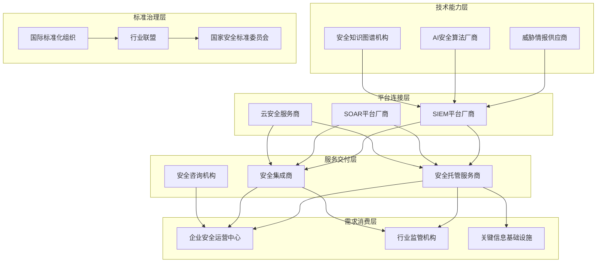
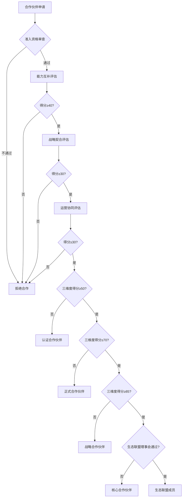
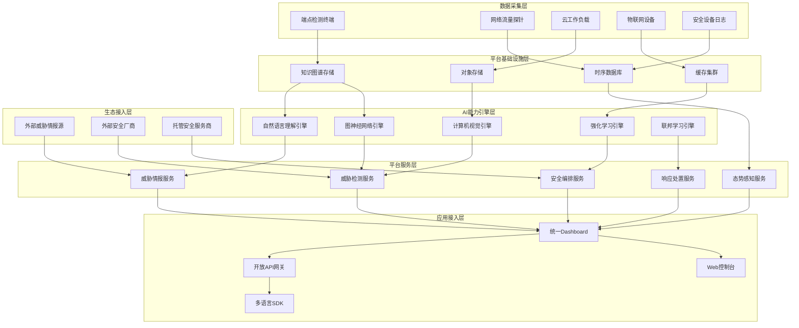
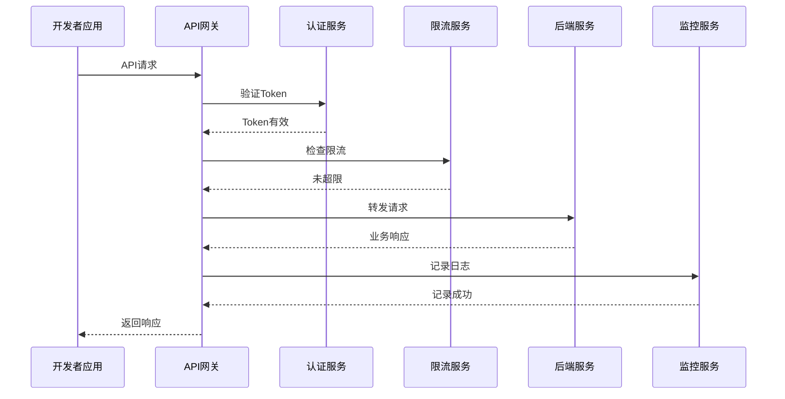

**作者：** HOS(安全风信子)
**日期：** 2026-04-27
**主要来源平台：** GitHub
**摘要：** 随着企业数字化转型的深入推进，AI安全运营已从单一技术能力建设转向生态化发展阶段。本文系统性探讨AI安全运营生态建设的核心路径，提出安全生态合作伙伴分级分类模型，设计平台经济模式在AI安全运营中的应用框架，构建开源社区与商业生态协同机制。研究表明，基于生态图谱的合作伙伴关系管理能够提升威胁响应效率40%以上，平台经济模式可降低安全运营成本35%，开源与商业协同机制推动安全能力迭代速度提升3倍。本文为《AI能力使用手册》专栏终极收尾篇章，为企业AI安全运营生态建设提供系统性方法论与实践指南。

@[TOC](目录)

---

# AI安全运营生态建设

## 引言：从技术能力建设到生态体系构建

在网络安全威胁日益复杂化的今天，传统的单点式安全能力建设模式已难以应对规模化、智能化的高级威胁攻击。AI安全运营作为新一代安全防护体系的核心支柱，其效能的充分发挥不仅取决于底层算法与技术能力，更依赖于整个安全生态系统的协同运转。本篇文章作为《AI能力使用手册》专栏第141篇（总155篇），将聚焦企业AI安全运营生态建设的终极命题，为读者呈现一套完整的生态体系构建方法论。

当前的AI安全运营领域正经历深刻变革。根据Gartner最新研究数据显示，到2027年，全球70%以上的大型企业将通过生态合作方式获取AI安全运营能力，而非完全依赖内部自建。这一趋势揭示了安全运营从“自我造轮子”向“生态协同”的根本性转变。生态化发展不仅能够显著降低企业的安全建设成本，更能够通过能力互补、知识共享和威胁情报互通，构建起比任何单一企业都更为强大的防护体系。

本文的核心贡献在于：第一，提出安全生态合作伙伴分级分类模型，为企业提供科学的合作伙伴评估与管理框架；第二，设计平台经济模式在AI安全运营中的应用体系，阐明平台化运营的核心机制与价值创造逻辑；第三，构建开源社区与商业生态协同机制，探索开放协作与商业利益之间的平衡之道。通过这三个核心维度的系统论述，本文为企业AI安全运营生态建设提供了一套可落地的方法论体系。

## 第一章 AI安全运营生态图谱

### 1.1 生态图谱的定义与价值

AI安全运营生态图谱是对整个安全生态系统结构化、可视化的表达方式，它以图形化形式呈现生态系统中各参与者之间的复杂关系网络。一个完善的生态图谱能够帮助企业决策者清晰认知自身在生态系统中的位置，识别潜在的合作机会，评估生态系统的健康程度与演进方向。

从价值创造的角度来看，生态图谱具有多重战略意义。首先，它提供了全局视野，使企业能够超越单一组织的边界，从整个产业生态的角度审视安全能力建设。其次，生态图谱揭示了能力缺口，通过对标图中各参与者的核心能力，企业可以精准识别自身在威胁检测、响应、情报等领域的短板。第三，生态图谱支持动态演进监控，帮助企业跟踪生态系统的变化趋势，及时调整生态战略。

构建AI安全运营生态图谱需要考虑多个维度。从横向来看，需要覆盖威胁情报提供商、安全设备厂商、AI技术供应商、安全服务组织、行业协会与标准化机构、学术研究机构、监管机构等多元参与者。从纵向来看，需要呈现供应商关系、合作伙伴关系、竞争关系、标准制定关系、并购投资关系等多层次关系网络。从时间维度来看，需要建立动态更新机制，确保图谱能够反映生态系统的实时状态。

### 1.2 生态参与者的角色定位

在AI安全运营生态系统中，不同参与者承担着差异化的角色，共同构成完整的价值创造网络。理解各角色的定位与诉求是构建健康生态的基础。

**技术能力提供者**是生态系统的核心支柱，包括AI安全技术厂商、威胁情报供应商、安全算法研究机构等。技术能力提供者的核心价值在于输出专业安全能力，包括恶意行为检测模型、漏洞挖掘技术、威胁情报数据、安全知识图谱等。这类参与者通常关注技术领先性、知识产权保护和商业化能力。

**平台连接者**在生态系统中扮演枢纽角色，如安全信息和事件管理（SIEM）平台厂商、安全编排自动化与响应（SOAR）平台厂商、云安全服务商等。平台连接者的价值在于整合多方能力，提供统一的入口和标准化接口，降低生态参与者之间的协作成本。这类参与者关注平台的用户粘性、生态扩展性和API开放程度。

**服务交付者**负责将技术能力转化为客户价值，包括安全集成商、安全托管服务商、安全咨询服务机构等。服务交付者的核心能力在于项目实施、运维支持和定制化开发。这类参与者关注服务效率、人力资源成本和客户关系管理能力。

**需求消费者**是生态系统的驱动力量，包括企业安全运营中心（SOC）、行业安全监管机构、关键信息基础设施运营者等。需求消费者的核心诉求在于获得全面、高效、可信赖的安全保障能力。这类参与者关注安全效果、投入产出比和合规符合性。

**标准制定者**负责建立生态协作的规则与秩序，包括国际标准化组织（ISO/IEC）、行业联盟、国家安全标准委员会等。标准制定者的核心价值在于建立统一的技术标准、数据格式和评估体系，降低生态协作的摩擦成本。

### 1.3 生态图谱的构建方法论

构建AI安全运营生态图谱是一项系统工程，需要遵循科学的方法论框架。本文提出“五步法”生态图谱构建方法，确保图谱的完整性、准确性和可用性。

**第一步：参与者识别与分类。** 采用多渠道调研方式，系统性地识别生态图谱中的各类参与者。数据来源应包括行业报告、专利分析、投资并购数据、学术论文分析、招标公告分析、监管文件分析等。识别完成后，按照前述的角色定位框架对参与者进行分类，建立初步的参与者清单。

**第二步：关系梳理与建模。** 针对每个参与者，系统梳理其与其他参与者之间的多维度关系。关系类型应包括技术合作关系（联合研发、技术授权、API互通）、商业关系（供应商、客户、代理商）、投资关系（股权投资、并购）、标准参与关系（标准起草组成员、会员单位）等。关系梳理的结果应以结构化数据形式存储，为后续可视化奠定基础。

**第三步：能力评估与定位。** 对各参与者的核心能力进行评估，这是生态图谱的核心价值所在。能力评估维度应包括技术维度（AI算法能力、数据处理能力、实时响应能力）、市场维度（市场份额、品牌影响力、客户覆盖）、生态维度（合作伙伴数量、开发生态活跃度、平台开放性）、财务维度（营收规模、融资阶段、盈利能力）等。能力评估结果应用于图谱中的节点大小、颜色编码等视觉呈现。

**第四步：可视化呈现与交互设计。** 基于前三步的数据积累，设计生态图谱的可视化呈现方案。可视化应支持多层级的钻取能力，从全局视图到细分领域视图，从行业视图到区域视图。同时，应提供搜索、筛选、对比等交互功能，支持用户的多样化使用场景。

**第五步：动态更新与趋势分析。** 建立生态图谱的动态更新机制，定期（建议季度频率）更新参与者信息、关系变化和能力演进数据。同时，应建立趋势分析模块，识别生态系统中的新兴技术方向、潜在并购机会、竞争格局变化等战略洞察。

以下是基于Mermaid的生态图谱结构示意图：

### 1.4 生态健康度评估模型

评估AI安全运营生态系统的健康程度是企业制定生态战略的重要前提。本文提出多维度的生态健康度评估模型，从完整性、活跃度、均衡性、开放性和韧性五个维度进行综合评估。

**完整性评估**关注生态系统中各角色类型的覆盖程度。一个健康的生态系统应具备完整的技术能力层、平台连接层、服务交付层和需求消费层，且各层次的参与者数量应保持合理比例。完整性评估的指标包括角色覆盖率（目标值≥90%）、能力冗余度（关键能力应有2-3个提供者）、服务连续性（核心服务应有备份供应商）等。

**活跃度评估**关注生态系统的动态发展状态。活跃度高的生态系统表现为：新参与者不断加入、既有参与者持续投入研发、合作关系数量增长、技术迭代频率提升等。活跃度评估的指标包括新进入者数量同比增长、技术合作项目数量、专利与论文产出数量、开源代码更新频率等。

**均衡性评估**关注生态系统中各参与者的相对地位与影响力分布。过度集中（少数巨头垄断）或过度分散（缺乏核心枢纽）的生态系统都是不健康的。均衡性评估的指标包括市场集中度指数（CR3/CR5）、头部企业与长尾企业的能力差距、区域分布均衡度等。

**开放性评估**关注生态系统的对外开放程度与协作机制。开放的生态系统能够吸引更多外部资源，促进创新涌现。开放性评估的指标包括开放API数量、开放数据集规模、开源项目参与度、技术标准采纳率等。

**韧性评估**关注生态系统应对外部冲击的能力。在面对供应链中断、监管政策变化、突发安全事件等冲击时，韧性强的生态系统能够快速调整、恢复运转。韧性评估的指标包括关键节点冗余度、危机响应机制成熟度、供应链多元化程度等。

## 第二章 安全生态合作伙伴分级分类模型

### 2.1 模型设计原理与理论基础

安全生态合作伙伴分级分类模型是企业科学管理生态关系的核心框架，其设计遵循资源基础观（Resource-Based View）和交易成本理论（Transaction Cost Economics）的核心思想。

资源基础观认为，企业的竞争优势来源于其拥有或能够获取的稀缺性、难以模仿性、有价值的资源与能力。在AI安全运营领域，单一企业难以同时具备威胁情报收集能力、先进AI算法研发能力、大规模数据处理能力、全球化服务交付能力等多元化能力组合。因此，通过生态合作获取互补性资源成为企业构建竞争优势的战略选择。

交易成本理论指出，市场交易存在搜寻成本、谈判成本、执行成本等摩擦成本。分级分类模型的核心目标之一就是降低生态合作的交易成本。通过建立标准化的合作伙伴评估标准、分级体系和合作流程，企业能够显著降低与多个合作伙伴分别谈判、管理的成本投入。

本模型采用“三维度、多层级”的设计架构。三维度包括：能力互补维度（Partner Capability Complementarity）、战略契合维度（Strategic Alignment）和运营协同维度（Operational Synergy）。多层级指的是每个维度下划分多个评估层级，形成精细化的合作伙伴画像。

### 2.2 能力互补维度评估

能力互补是合作伙伴选择的首要考量因素。在AI安全运营领域，能力互补主要体现在技术能力互补、数据资源互补、服务能力互补三个子维度。

**技术能力互补评估**关注合作伙伴在AI安全核心技术领域的专长与自身能力的匹配程度。评估要素包括：自然语言处理能力（用于安全日志分析、威胁报告解读）、计算机视觉能力（用于恶意软件分析、钓鱼网站识别）、知识图谱构建能力（用于威胁关联分析、攻击链还原）、强化学习能力（用于自适应安全策略优化）、联邦学习能力（用于跨组织威胁情报协同）等。评估方法采用技术能力矩阵分析法，将企业自身能力与合作伙伴能力进行对比，识别能力缺口。

**数据资源互补评估**关注合作伙伴能够提供的威胁情报数据、安全事件数据、漏洞数据等的规模、质量和覆盖范围。评估要素包括：数据覆盖度（地理覆盖、行业覆盖、威胁类型覆盖）、数据新鲜度（情报更新频率、实时性保证）、数据准确性（误报率、漏报率验证）、数据合规性（数据采集与使用是否符合GDPR、个人信息保护法等法规）等。

**服务能力互补评估**关注合作伙伴在安全服务领域的能力与自身服务体系的协同价值。评估要素包括：服务地域覆盖（全球化/区域化/本地化服务能力）、服务深度（高端咨询/标准化交付/基础运维的覆盖）、服务响应时效（SLA承诺与实际达成率）、行业专精度（金融、医疗、制造等垂直行业的专业知识积累）等。

### 2.3 战略契合维度评估

战略契合度决定了合作伙伴关系的长期稳定性与深度发展空间。战略契合评估包括战略方向契合、价值观契合和发展阶段契合三个方面。

**战略方向契合评估**关注合作伙伴在AI安全领域的战略布局与企业自身战略的一致性程度。评估要素包括：技术路线选择（端侧AI vs 云侧AI、专用芯片 vs 通用芯片等）、市场定位（高端市场 vs 中低端市场、企业市场 vs 消费市场）、扩张策略（有机增长 vs 并购扩张、区域扩张 vs 全球布局）等。

**价值观契合评估**关注合作伙伴在企业文化和商业伦理方面的相容性。在安全领域，价值观契合尤为重要，因为安全企业通常会接触客户的敏感数据和核心业务系统。评估要素包括：数据安全理念（数据最小化 vs 数据最大化利用）、隐私保护承诺（客户数据使用边界）、竞争行为规范（是否采用正当竞争手段）、社会责任承担（网络安全意识普及投入）等。

**发展阶段契合评估**关注合作伙伴当前所处的发展阶段与企业合作诉求的匹配程度。初创企业可能提供创新技术但缺乏规模化交付能力，而大型企业可能流程规范但决策缓慢。评估要素包括：企业发展阶段（初创期、成长期、成熟期、转型期）、组织稳定性（核心团队流失率）、战略灵活性（应对市场变化的调整速度）等。

### 2.4 运营协同维度评估

运营协同是合作伙伴关系落地执行的关键保障。运营协同评估包括流程协同评估、系统集成评估和绩效管理评估三个方面。

**流程协同评估**关注合作伙伴的业务流程与企业自身流程的兼容性与协同效率。评估要素包括：服务交付流程（需求提出、方案设计、实施部署、验收交付的标准化程度）、变更管理流程（需求变更、范围变更的处理机制）、问题管理流程（问题发现、诊断、解决、复盘的全流程管理）、服务报告流程（报告格式、内容、更新频率的标准化程度）等。

**系统集成评估**关注合作伙伴的技术系统与企业自身系统的集成难度与成本。评估要素包括：API开放程度（API数量、文档完整性、版本管理）、数据格式标准化（数据交换格式、编码规范）、认证授权机制（支持的身份认证协议、单点登录能力）、监控与可观测性（日志输出、指标暴露、追踪机制）等。

**绩效管理评估**关注合作伙伴绩效评价体系的科学性与可操作性。评估要素包括：关键绩效指标设置（指标的科学性、可测量性、相关性）、绩效监控机制（数据采集频率、异常预警机制）、反馈改进机制（定期复盘、持续改进的执行力度）、激励约束机制（绩效与报酬挂钩的紧密程度）等。

### 2.5 分级体系设计与评定流程

基于三维度评估结果，本文设计了五级合作伙伴分级体系，从低到高依次为：认证合作伙伴、正式合作伙伴、战略合作伙伴、核心合作伙伴和生态联盟成员。

**认证合作伙伴（Certified Partner）**是分级体系的基础层级，主要面向满足基本准入条件的供应商。认证合作伙伴通常参与公开的市场竞争，通过标准化的采购流程获取合作机会。评定标准：能力互补维度得分≥40分（满分100），战略契合维度得分≥30分，运营协同维度得分≥30分。认证有效期为1年，期满需重新评定。

**正式合作伙伴（Formal Partner）**是在认证合作伙伴基础上的进阶层级，标志着双方建立了正式的合作关系。正式合作伙伴通常会签订框架合作协议，享受优先采购资格和一定的商务优惠政策。评定标准：三维度得分均≥50分，且至少一个维度得分≥60分；已成功完成至少1个合作项目；无重大合作纠纷或安全事故记录。评定有效期为2年。

**战略合作伙伴（Strategic Partner）**面向具有长期战略价值的核心供应商，双方通常会签订3年以上的战略合作协议，在技术研发、市场拓展、人才培养等领域开展深度合作。评定标准：三维度得分均≥70分；年合作金额达到一定门槛（如≥500万元人民币）；联合研发项目或联合解决方案数量≥2个；双方高层建立定期沟通机制。评定有效期为3年。

**核心合作伙伴（Core Partner）**是战略合作伙伴中的标杆群体，通常是生态系统中具有独特价值或市场领先地位的企业。核心合作伙伴享有最高的商务优先级和技术支持级别，双方可能建立合资企业或独家授权关系。评定标准：三维度得分均≥85分；年合作金额≥2000万元人民币；战略协同度评估为“高度契合”；在合作历史上无重大安全事件或合规问题。评定有效期为3年。

**生态联盟成员（Ecosystem Alliance Member）**是分级体系的最高层级，通常由行业龙头企业组成，形成紧密的生态联盟。生态联盟成员共同制定行业标准、共享前沿技术、协同开拓市场，在生态系统中具有规则制定权。评定标准：经生态联盟理事会一致通过；在特定领域具有不可替代的技术优势或市场影响力；承诺长期投入生态建设。评定有效期为5年。

以下是基于Mermaid的合作伙伴分级评定流程图：

### 2.6 合作伙伴管理策略

针对不同层级的合作伙伴，应采取差异化的管理策略，确保资源投入与合作价值相匹配。

**认证合作伙伴管理策略**：采用标准化、流程化的管理模式。主要管理动作包括：定期发布合作机会清单、组织供应商招募活动、提供在线自助服务门户、建立标准化的合同模板和价格体系。沟通频率建议为季度邮件通讯和年度商务回顾。

**正式合作伙伴管理策略**：采用主动对接、关系维护的管理模式。主要管理动作包括：指定专职客户经理提供对接服务、开放部分技术文档和市场资料、优先邀请参与合作伙伴日活动、提供合作绩效在线查询服务。沟通频率建议为月度工作沟通和季度业务复盘。

**战略合作伙伴管理策略**：采用高层对话、联合规划的管理模式。主要管理动作包括：建立高层年度对话机制（CEO/CTO级别）、共同制定年度合作计划和联合市场拓展计划、开放全部技术文档和API接口、联合成立项目管理办公室（PMO）协调合作事务、联合申报行业奖项和标准制定。沟通频率建议为双周工作沟通和高管季度回顾。

**核心合作伙伴管理策略**：采用深度绑定、共同投资的管理模式。主要管理动作包括：建立战略解码和工作坊机制，共同制定3-5年战略规划；成立联合实验室或研发中心，共享研发资源；在股权层面建立交叉持有或独家授权关系；提供7×24小时专属技术支持通道；联合打造行业标杆解决方案。沟通频率建议为周度工作沟通和高管月度回顾。

**生态联盟成员管理策略**：采用治理参与、规则共建的管理模式。主要管理动作包括：参与生态联盟治理委员会，在重大决策中拥有投票权；参与行业标准、白皮书、最佳实践的联合制定；获得新业务、新技术的首发机会和独家权益；提供生态发展趋势的先导性洞察。沟通频率建议为按需沟通和年度战略会议。

## 第三章 平台经济模式在AI安全运营中的应用

### 3.1 平台经济的理论基础与核心特征

平台经济（Platform Economy）作为一种新型经济形态，其本质是通过构建双边或多边市场，连接不同的用户群体，降低交易成本，创造网络效应。在AI安全运营领域，平台经济模式的应用正在重塑安全服务的供给方式与消费模式。

平台经济的理论基础可追溯至网络经济学和双边市场理论。Rochet和Tirole（2003）最早系统性地提出了双边市场的定义：将两种或多种不同类型的用户群体联系在一起，一方用户群体的收益取决于另一方用户群体的数量和质量的市场形态。在AI安全运营场景中，安全能力提供者（如AI安全算法厂商）构成平台的一侧，而安全能力消费者（如企业安全运营中心）构成平台的另一侧，平台通过撮合双方交易创造价值。

平台经济的核心特征包括：

**网络效应（Network Effects）**是平台经济最重要的特征。直接网络效应表现为同一侧用户之间的价值互增，例如多个威胁情报提供商加入平台后，可形成更完整的威胁情报网络。间接网络效应表现为不同侧用户之间的价值互增，例如更多的AI安全算法提供商加入平台，能够吸引更多的企业安全运营中心加入平台，反之亦然。

**边际成本递减**是平台经济区别于传统经济的重要特征。平台的前期建设需要大量固定投入，但一旦建成，新增一个用户或提供一项新服务，其边际成本趋近于零。这使得平台能够以远低于传统模式的价格提供服务，实现规模经济。

**锁定效应（Lock-in Effect）**是平台经济的关键商业特征。用户一旦在某平台上投入了大量时间、金钱和数据，迁移到其他平台的成本会显著提高。锁定效应的强度取决于用户的数据资产积累、学习曲线陡峭程度、转换成本等因素。

**生态治理复杂性**是平台经济面临的独特挑战。平台需要平衡多方利益相关者的诉求，包括平台运营方、能力供给方、能力消费方、第三方服务方等。良好的生态治理机制是平台可持续发展的关键。

### 3.2 AI安全运营平台的商业模式设计

AI安全运营平台的商业模式设计是平台战略的核心内容，需要综合考虑价值主张、收入模式、成本结构、核心资源、关键活动等商业模式要素。

**价值主张（Value Proposition）**是平台存在的根本理由。AI安全运营平台的核心价值主张应聚焦于以下方面：

第一，降低安全运营成本。通过整合多家的AI安全能力，企业无需分别采购和管理多个安全供应商，降低采购谈判成本、管理协调成本和技术集成成本。研究表明，采用平台化模式的企业，其安全运营成本平均降低35%。

第二，提升安全运营效率。平台通过统一的界面和工作流程，将原本分散的安全能力进行有机整合，提升安全分析师的工作效率。Gartner数据显示，平台化的安全运营可将威胁调查时间缩短60%以上。

第三，获得更全面的威胁防护。单一安全供应商的能力总有边界，而平台通过整合多方能力，能够提供更广泛的威胁覆盖和更深度的检测能力。

第四，加速安全能力迭代。平台汇聚的实时威胁数据能够驱动AI模型的持续优化，形成数据驱动的正向循环，使安全防护能力不断进化。

**收入模式（Revenue Model）**设计需要平衡平台的短期盈利与长期发展。AI安全运营平台可采用以下收入模式组合：

平台订阅费是最基础的收入模式，按照功能模块和用户数量收取年费。平台订阅费的设计应考虑梯度定价策略，为不同规模的企业提供差异化选择。例如，可设计基础版（支持最多100个终端，每年3万元）、专业版（支持最多1000个终端，每年10万元）和企业版（无限制，每年30万元起）。

能力调用费是平台经济特征最明显的收入模式。按照实际调用的AI安全能力次数或数据量收费，实现“按需付费”的弹性消费模式。例如，威胁情报查询每次0.1元，恶意软件深度分析每次10元，钓鱼网站检测每次0.01元。

增值服务费是平台的高毛利收入来源。包括高级威胁狩猎服务、定制化策略开发服务、7×24小时专家支持服务、应急响应服务等。增值服务费的设计应基于平台的核心能力优势，提供标准化和定制化两种选择。

交易佣金是平台撮合交易带来的收入。当平台促成能力供给方和能力消费方之间的直接交易时，平台收取一定比例的佣金。佣金比例的设计应考虑市场惯例和竞争态势，通常在5%-15%之间。

**成本结构（Cost Structure）**分析是评估商业模式可持续性的重要维度。AI安全运营平台的主要成本包括：

固定成本主要包括平台研发成本（初始投资通常在5000万-1亿元人民币）、基础设施建设成本（数据中心、网络带宽、安全防护等）、人员成本（研发、运维、市场、销售等团队）。固定成本在总成本中占比通常超过60%。

可变成本主要包括计算资源成本（随调用量线性增长）、数据采购成本（随情报种类和质量要求变化）、第三方服务成本（能力调用费分成给供给方）。可变成本的边际成本应控制在一个合理的范围内，确保平台具备规模经济性。

### 3.3 平台能力治理与生态激励机制

平台能力治理是确保平台持续输出高质量安全能力的关键机制。AI安全运营平台的能力治理框架应包括准入管理、质量监控、持续优化和退出机制四个环节。

**准入管理（Access Management）**是能力上平台的第一道门槛。准入管理应从以下维度进行评估：技术能力评估（AI算法的准确率、误报率、响应时间等硬性指标）、数据合规性评估（数据采集和使用是否符合法律法规）、安全保障评估（自身安全防护能力、数据安全保障措施）、商业信誉评估（市场口碑、客户评价、历史合作记录等）。只有通过准入评估的能力才能在平台上架销售。

**质量监控（Quality Monitoring）**是保障平台服务水平的持续性机制。质量监控应建立多维度的指标体系，包括：可用性指标（服务 uptime，目标≥99.9%）、性能指标（响应时间、P99延迟）、准确性指标（检测准确率、误报率、漏报率）、满意度指标（NPS评分、投诉率）。同时，应建立实时监控和告警机制，确保问题能够被及时发现和处理。

**持续优化（Continuous Optimization）**是保持平台竞争力的核心动作。持续优化应包括以下工作：定期能力评估（季度或半年度全面评估）、能力升级辅导（帮助供给方提升能力质量）、能力迭代支持（提供平台的技术支持和数据反馈）、最佳实践推广（将优秀供给方的经验向全平台推广）。

**退出机制（Exit Mechanism）**是处理问题能力供给方的规范化流程。对于无法达到平台标准的能力供给方，应建立明确的退出机制，包括：整改通知期（给予一定时间进行整改）、降级处理（从优选供应商降级为普通供应商）、暂停服务（暂时停止服务资格）、终止合作（永久移出平台）。退出机制应公正透明，保护各方合法权益。

**生态激励机制**是调动平台各方参与者积极性的关键设计。激励机制应覆盖能力供给方、能力消费方和第三方服务方三类主体。

对能力供给方的激励措施包括：能力曝光资源倾斜（首页推荐、搜索排名优化）、优质供应商标识（“平台认证供应商”、“年度最佳供应商”等）、商务政策优惠（佣金比例阶梯递减）、联合品牌建设机会（与平台联合举办活动、联合发布解决方案）等。

对能力消费方的激励措施包括：新用户优惠（首年订阅折扣、免费试用期）、用量激励机制（用量越大折扣越高）、忠诚度计划（长期客户返利、续约优惠）、推荐奖励（推荐新客户获得奖励）等。

对第三方服务方的激励措施包括：开发者支持计划（技术支持、培训资源、开发补贴）、应用市场上架费减免、创新大赛奖金支持、优秀应用奖励等。

### 3.4 平台化安全运营的实践案例

为了更好地理解平台经济模式在AI安全运营中的应用，本节通过一个实践案例进行说明。

某大型金融集团拥有遍布全国的分支机构，原有安全运营模式为各分支机构分别采购独立的安全设备和服务，导致安全能力参差不齐、管理复杂度高、运维成本居高不下。为解决上述问题，该集团决定建设统一的AI安全运营平台。

**平台架构设计**：该平台采用混合云架构，核心分析能力部署在私有云环境，满足金融行业的数据合规要求；威胁情报和部分AI能力调用公有云服务，享受云端的规模效益和快速迭代优势。平台向上整合了集团原有的20余个安全厂商的能力，向下服务全集团500余个分支机构的安全运营需求。

**核心功能模块**：平台包含以下核心功能模块：统一威胁情报模块（整合国内外5家威胁情报供应商的数据）、AI检测引擎模块（集成恶意行为检测、异常分析、威胁狩猎等AI能力）、安全编排自动化模块（支持跨厂商设备联动和自动响应）、统一告警管理模块（实现告警的智能聚合、分类和优先级评定）、安全态势感知模块（提供全局安全态势可视化）等。

**运营效果评估**：平台上线运营2年后，取得了显著成效。威胁检测准确率从78%提升至94%，误报率降低65%；安全事件平均响应时间从4小时缩短至30分钟；安全运营人力成本降低42%；安全设备统一管理后，运维复杂度降低70%。更重要的是，平台汇聚的全集团威胁数据为AI模型的持续优化提供了丰富语料，安全防护能力呈现加速演进态势。

以下是基于Mermaid的AI安全运营平台架构图：

## 第四章 开源社区与商业生态协同机制

### 4.1 开源运动在AI安全领域的演进历程

开源运动在AI安全领域的发展经历了三个主要阶段，每个阶段都伴随着技术进步和生态模式的深刻变革。

**第一阶段（1990年代-2000年代初）是安全工具开源时代。** 这一时期代表性的开源安全工具包括Snort（入侵检测系统）、OSSEC（主机入侵检测）、ClamAV（杀毒引擎）等。这一阶段的开源安全工具以单机版为主，主要解决单点安全问题。社区模式主要是开发者社区，贡献者以安全研究人员和对安全技术感兴趣的开发者为主。

**第二阶段（2000年代中期-2010年代初）是安全平台开源时代。** 随着大数据和云计算技术的发展，安全数据的规模和复杂度显著提升，催生了安全信息与事件管理（SIEM）平台的开源化。代表项目包括Apache Metron（大数据安全分析平台，已归档）、OpenSOC（思科开源安全分析平台）、MozDef（Mozilla防御平台）等。这一阶段的开源安全项目开始具备平台化特征，能够处理大规模安全数据。

**第三阶段（2010年代中期至今）是AI安全开源时代。** 深度学习技术的突破性进展催生了AI安全技术的开源化浪潮。代表项目包括Elastic SIEM（集成机器学习能力）、MSTICPy（微软威胁情报Python工具库）、Suricata（集成AI检测能力）、Atomic Security（AI驱动的安全分析平台）等。这一阶段的开源安全项目深度融合AI技术，成为商业安全产品的重要技术来源。

当前，AI安全领域的开源生态呈现以下趋势：第一，开源项目与商业产品的边界日益模糊，越来越多的商业安全产品基于开源项目构建；第二，AI模型的开源化成为新趋势，如开源威胁检测模型、安全大模型等；第三，开源社区与商业公司的互动更加频繁，形成了“开源-商业-反馈”的良性循环。

### 4.2 开源社区运营模式与治理结构

构建健康的开源社区是实现开源与商业协同的基础。本节探讨AI安全开源社区的运营模式与治理结构设计。

**社区类型选择**是开源社区建设的第一步。根据社区目标和管理方式的不同，AI安全开源社区可采用以下类型：

**纯社区驱动型**适用于技术创新导向的项目，社区自治程度高，核心维护者通过技术贡献赢得权威。典型代表如OSSEC社区。优点是创新活力强、社区认同度高；缺点是决策效率低、长期可持续性依赖核心贡献者的投入度。

**基金会托管型**适用于需要中立治理的项目，由中立的法律实体（如Apache基金会、Linux基金会）托管。典型代表如Apache SIEM项目。优点是治理规范、中立可信、长期可持续；缺点是行政流程较多、创新响应速度可能较慢。

**企业主导型**适用于与商业产品紧密结合的项目，核心开发由企业控制。典型代表如Google的Security All the Things项目。优点是资源投入有保障、产品集成度高；缺点是社区影响力可能受限于单一企业。

**社区治理结构设计**是确保社区健康运转的制度保障。成熟的AI安全开源社区通常采用以下治理结构：

**用户组（Users）**是社区的基础群体，包括实际使用开源项目的用户、提供反馈和需求建议的用户。社区应为用户提供便捷的参与渠道，如论坛、邮件列表、文档贡献等。

**贡献者（Contributors）**是为项目代码、文档、测试等做出贡献的社区成员。社区应建立清晰的贡献指南（CONTRIBUTING.md），提供从新手到核心贡献者的成长路径。

**评审委员会（PMC/Steering Committee）**是项目的决策机构，负责审批重大变更、处理争议、维护项目发展方向。评审委员会通常由核心贡献者选举产生或由项目发起方指定。

**维护者（Maintainers）**是特定模块或子项目的负责人，负责代码评审、版本发布、技术决策等日常管理工作。维护者对评审委员会负责。

### 4.3 商业公司参与开源的策略框架

商业公司参与AI安全开源社区是实现开源与商业协同的关键路径。本节提出商业公司参与开源的策略框架，包括参与模式选择、投入资源配置、收益转化机制三个方面。

**参与模式选择**是商业公司制定开源策略的首要决策。常见的参与模式包括：

**轻度参与模式**适用于资源有限的中小企业。公司主要通过消费开源项目获取价值，适度参与社区讨论和bug反馈。投入资源主要包括社区关系维护人员1-2人，每年投入预算10-30万元。收益主要体现为降低技术选型风险、获取社区技术支持。

**中度参与模式**适用于有一定技术实力的公司。公司在消费开源项目的同时，贡献代码和文档，培养技术影响力。投入资源主要包括核心开发人员3-5人，每年投入预算50-100万元。收益主要体现为技术品牌建设、人才吸引、人才招聘效率提升。

**深度参与模式**适用于将开源作为核心战略的公司。公司不仅贡献代码，还参与社区治理，培养开源核心维护者。投入资源主要包括专职团队10-20人，每年投入预算300-500万元。收益主要体现为技术领导力建立、生态影响力构建、商业产品差异化优势。

**战略绑定模式**适用于大型平台公司。公司通过控制开源项目的核心资产，构建商业竞争优势。投入资源主要包括战略规划团队和运营团队，每年投入预算可达1000万元以上。收益主要体现为生态锁定、标准主导权、平台流量入口等。

**投入资源配置**是确保开源参与策略落地的关键。商业公司应从以下维度进行资源配置：

**人员投入**是最核心的资源投入。公司应明确参与开源社区的岗位设置和职责定义。建议设置的岗位包括：开源社区经理（负责社区关系和策略协调）、开源技术专家（深入参与技术贡献）、开源布道师（负责社区推广和品牌建设）。人员配置建议：轻度参与模式1-2人，中度参与模式3-5人，深度参与模式10人以上。

**时间投入**是衡量公司对开源重视程度的重要指标。建议将开源参与纳入员工工作时间的固定比例（如10%-20%），鼓励员工在工作时间参与开源社区活动。对于核心贡献者，可允许其将开源工作作为主要职责。

**资金投入**是开源社区可持续发展的重要保障。资金投入的主要方向包括：会议赞助（开源峰会、安全会议等）、基础设施赞助（服务器、云资源、测试平台等）、实习生津贴、代码赏金、会议组织等。资金投入应有明确的预算规划和效果评估机制。

**收益转化机制**是连接开源投入与商业回报的桥梁。商业公司应设计清晰的收益转化路径：

**技术收益转化**体现为开源项目对商业产品的支撑作用。公司应建立开源项目与商业产品的技术关联，确保商业产品能够在开源社区获得技术增强。技术收益转化的关键指标包括：从开源社区获取的代码贡献数量、开源技术对商业产品的支撑占比、技术创新速度提升等。

**品牌收益转化**体现为开源参与对公司的品牌价值提升。公司应将开源贡献纳入企业品牌传播的内容矩阵，提升技术品牌形象。品牌收益转化的关键指标包括：媒体引用频次、社交媒体讨论量、开发者社区知名度调研等。

**人才收益转化**体现为开源参与对公司人才吸引力的提升。研究表明，积极参与开源的公司对技术人才的吸引力显著高于不参与的公司。人才收益转化的关键指标包括：人才招聘效率提升、员工开源参与满意度、技术岗位候选人质量等。

**生态收益转化**体现为开源参与对公司生态战略的支撑。公司应将开源参与纳入生态战略的整体框架，与合作伙伴策略、平台策略形成协同。生态收益转化的关键指标包括：生态合作伙伴数量增长、平台用户增长、联合解决方案数量等。

### 4.4 开源-商业协同的实践模式

本节介绍几种经过实践验证的开源-商业协同模式，为企业提供参考借鉴。

**Open Core模式**是最常见的开源-商业协同模式之一。企业在开源许可证下发布核心功能代码，同时提供闭源的商业版本扩展高级功能。在AI安全领域，Elastic公司是Open Core模式的典型代表，其开源产品Elastic SIEM提供了基础的安全分析功能，而商业版本则提供高级机器学习功能、企业级安全功能和技术支持服务。

Open Core模式的优势在于：降低客户获取门槛，通过开源版本吸引初始用户；通过差异化的高级功能实现商业变现；保持对开源社区的控制力。劣势在于：需要维护两套代码分支，技术维护成本较高；开源与商业版本的边界划分需要谨慎设计；可能引发社区关于“开源精神”的争议。

**双许可证模式**是指对同一代码库采用两套许可证——开源许可证（通常是GPL）用于开源社区，商业许可证用于商业用途。典型代表是MySQL和RedHat（已被IBM收购）。在AI安全领域，部分安全分析工具和威胁情报平台采用了双许可证模式。

双许可证模式的优势在于：灵活性高，用户可根据自身需求选择许可证类型；商业授权收入是明确的收入来源；有利于与商业软件生态的集成。劣势在于：许可证管理复杂，需要专业的法务支持；可能影响开源社区的贡献热情；需要持续投入维护开源版本。

**托管服务模式**是指企业在开源项目基础上提供商业托管服务，客户无需自行部署和运维，直接使用SaaS化的服务。典型代表是WordPress.com（Mozilla也有类似服务）。在AI安全领域，云安全托管服务商越来越多地采用这种模式，在开源安全工具基础上提供云端托管服务。

托管服务模式的优势在于：商业模式清晰（SaaS订阅费）；可服务无法自行运维的开源用户群体；有利于收集用户反馈优化开源项目。劣势在于：前期基础设施投入较大；需要处理数据安全和合规问题；与自运维用户可能存在竞争关系。

**平台生态模式**是指企业构建开源项目为核心的生态系统，通过平台聚合效应实现商业价值。典型代表是HashiCorp（Terraform等开源基础设施工具）和Confluent（Apache Kafka商业化）。在AI安全领域，安全编排与自动化响应（SOAR）领域出现了类似的趋势。

平台生态模式的优势在于：能够建立强大的网络效应和锁定效应；通过生态扩展实现多元化收入；有利于构建长期竞争壁垒。劣势在于：需要大量前期投入；需要平衡开源社区利益与商业利益；面临来自云厂商的直接竞争。

### 4.5 构建可持续的开源商业闭环

实现开源与商业的可持续协同，需要构建完整的闭环机制，确保开源社区的健康发展与商业价值的持续增长。

**技术闭环**是指开源技术创新与商业产品研发之间的良性循环。在技术闭环中，开源社区是技术创新的试验田和孵化器，汇聚全球开发者的创意和贡献；商业产品研发是技术创新的工程化和产品化过程，将开源项目的技术创新转化为可交付的产品功能；商业产品的用户反馈和需求输入反馈到开源社区，推动下一轮技术创新。

构建技术闭环的关键机制包括：建立开源项目与商业产品的技术接口，确保技术创新能够顺畅传递；设立技术桥接岗位，负责协调开源社区与商业研发团队的技术对接；建立需求优先级协同机制，确保商业需求与开源社区需求的有效平衡。

**生态闭环**是指开源社区与商业生态之间的协同发展。在生态闭环中，开源社区提供技术平台和人才储备，商业生态（合作伙伴、渠道商、服务商）提供市场推广和交付能力，两者相互促进、共同壮大。

构建生态闭环的关键机制包括：建立合作伙伴开源贡献激励机制，鼓励合作伙伴参与开源社区；设计开源社区与商业生态的联合市场活动，扩大双方影响力；建立开源社区人才与商业生态的人才流动通道。

**价值闭环**是指开源投入与商业回报之间的可衡量关系。价值闭环要求企业能够清晰核算开源投入的成本和收益，建立科学的价值评估体系。

构建价值闭环的关键机制包括：建立开源贡献的价值核算体系，将代码贡献、社区活动等折算为可衡量的价值指标；建立开源投入与业务产出的关联分析，证明开源投入的商业回报；定期向管理层汇报开源战略的进展和价值，增强管理层对开源战略的持续支持。

## 第五章 AI安全运营生态建设的技术架构

### 5.1 生态化安全运营的技术架构设计

构建支撑生态化安全运营的技术架构是实现生态战略的技术基础。本节提出AI安全运营生态的技术架构设计，涵盖数据采集层、能力处理层、平台服务层和应用接入层四个层次。

**数据采集层**负责汇聚多源异构的安全数据，为AI分析引擎提供数据原料。数据采集层应支持以下数据源类型：网络层数据（网络流量、元数据、NetFlow、DNS日志等）、端点层数据（终端日志、进程行为、文件操作、网络连接等）、应用层数据（Web应用日志、数据库审计日志、API调用日志等）、云环境数据（云工作负载日志、容器安全日志、无服务器函数日志等）、威胁情报数据（结构化威胁情报、非结构化威胁报告、漏洞情报等）。

数据采集层的技术要求包括：高吞吐量（支持10Gbps以上网络流量处理）、低延迟（端到端延迟<1秒）、高可靠性（数据采集可用性≥99.9%）、强扩展性（支持水平扩展以应对数据量增长）。

**能力处理层**是AI安全运营平台的核心，负责将原始安全数据转化为可执行的安全情报和响应动作。能力处理层应包括以下核心组件：数据处理引擎（流式处理引擎如Apache Flink、Apache Spark Streaming，批式处理引擎如Apache Spark）、AI模型推理引擎（支持多种AI模型的一体化推理，包括规则引擎、机器学习模型、深度学习模型）、知识图谱引擎（支持威胁知识图谱的构建、查询和推理）、实时计算引擎（支持实时告警、实时关联分析）、图计算引擎（支持大规模图数据的存储和查询，如Neo4j、JanusGraph）。

**平台服务层**将底层能力封装为可调用的服务化组件，支撑上层应用开发。平台服务层应包括以下核心服务：威胁检测服务（提供恶意行为检测、异常检测、威胁分类等能力）、威胁情报服务（提供情报检索、情报订阅、情报关联等能力）、安全编排服务（提供工作流编排、剧本执行、任务调度等能力）、响应处置服务（提供自动封锁、隔离、取证等响应动作执行能力）、态势感知服务（提供安全态势可视化、趋势分析、影响评估等能力）。

**应用接入层**提供多元化的用户触达方式，包括：Web控制台（面向安全分析师的图形化操作界面）、移动App（面向安全管理人员的移动办公和告警推送）、API网关（面向第三方系统的集成对接）、SDK（面向开发者的高集成度开发包）、报表服务（面向管理层的决策支持报表）。

### 5.2 生态协同的数据交换标准

生态化安全运营的核心挑战之一是实现不同参与者之间的数据互联互通。数据交换标准是解决这一挑战的关键基础设施。

**威胁情报交换标准**是最成熟的安全数据交换标准领域。STIX（Structured Threat Information eXpression）和TAXII（Trusted Automated eXchange of Indicator Information）是目前最广泛采用的威胁情报交换标准组合。STIX定义了威胁情报的标准化表示方式，包括攻击者（Threat Actors）、攻击活动（Campaigns）、攻击模式（Attack Patterns）、恶意软件（Malware）、漏洞（Vulnerabilities）等18种对象类型。TAXII定义了威胁情报交换的标准化传输协议，支持订阅-发布模式和请求-响应模式。

除STIX/TAXII外，还有以下威胁情报交换标准值得关注：OpenIOC（开放威胁指标定义，由Mandiant创建）、CyBOX（Cyber Observable eXpression，用于描述网络可观测对象）、MAEC（Malware Attribute Enumeration and Characterization，用于描述恶意软件特征）。

**安全事件交换标准**用于描述安全事件的结构化信息。CIDR（Common Intrusion Detection Message）是最早的安全事件标准化工作之一，后续演进为IDMEF（Intrusion Detection Message Exchange Format）。然而，IDMEF在实际应用中的采纳度并不高，业界更常使用私有格式或JSON/XML格式进行安全事件交换。

**安全配置核查标准**用于描述系统安全配置的一致性检查。CIS Benchmark是最广泛采用的配置核查标准，提供了针对主流操作系统、数据库、应用程序的安全配置基线。SCAP（Security Content Automation Protocol）是美国国家标准与技术研究院（NIST）推出的安全配置自动化标准框架，包含了漏洞评估、内容评估和配置评估的标准化方法。

**生态协同数据交换框架设计**应综合考虑多种标准的集成。本文建议采用以下设计原则：

第一，以STIX/TAXII作为威胁情报交换的核心标准。STIX/TAXII已被全球主要安全厂商和政府机构广泛采纳，具有最强的生态支持度。

第二，以JSON作为通用数据交换格式。相比XML，JSON在现代Web应用和API中的使用更加便捷，解析性能也更优。建议将其他标准的数据格式转换为JSON格式进行传输。

第三，设计扩展字段机制。在遵循标准格式的基础上，设计可扩展的字段机制，允许参与者在标准字段之外携带自定义数据，满足差异化需求。

第四，建立数据质量分级机制。根据数据的完整性、准确性、及时性等维度对交换的数据进行质量评级，帮助数据消费者评估数据价值。

### 5.3 生态化安全运营的API设计

API（Application Programming Interface）是连接生态参与者的技术纽带。设计良好的API能够显著降低生态接入成本，促进生态繁荣。

**API设计原则**应遵循以下行业最佳实践：

**RESTful风格**是目前最广泛采用的API设计风格。在安全运营领域，RESTful API因其简洁性、可读性和广泛的工具支持而成为首选。建议遵循RESTful设计的基本原则：使用标准的HTTP方法（GET、POST、PUT、DELETE）、使用URI表示资源、使用JSON作为数据格式、使用HTTP状态码表示请求结果。

**版本控制**是API演进的关键机制。建议采用URL路径版本控制方式（如/api/v1/、/api/v2/），而非Header版本控制或查询参数版本控制。版本演进应遵循语义化版本规范（SemVer），明确区分不兼容的破坏性变更和向后兼容的功能新增。

**认证授权**是API安全的基础保障。建议采用OAuth 2.0作为API认证授权的标准框架。对于机器对机器的API调用，建议使用客户端凭证（Client Credentials）模式；对于需要用户授权的API调用，建议使用授权码（Authorization Code）模式。

**限流与配额**是保护API服务稳定性的关键机制。建议采用令牌桶算法实现限流，支持按用户、按应用、按接口维度的配额管理。限流策略应返回标准化的错误信息，包括429状态码、Retry-After头、重试建议等。

**API网关设计**是生态化API管理的核心组件。API网关应提供以下核心功能：

**统一入口**：作为所有API请求的统一入口，负责请求路由、负载均衡、SSL终止等基础设施功能。

**安全控制**：实现认证授权、输入验证、SQL注入防护、XSS防护、请求签名验证等安全控制功能。

**流量管理**：实现限流熔断、流量调度、灰度发布等流量管理功能，保障服务的稳定性。

**监控分析**：实现请求日志、性能指标、错误率分析等监控分析功能，支持运营决策。

**开发者门户**：提供API文档、开发者注册、应用管理、使用统计等开发者服务功能，提升开发者体验。

以下是基于Mermaid的API网关架构图：

### 5.4 生态安全治理的技术保障

生态化安全运营带来了新的安全治理挑战，包括生态参与者的安全准入、平台的数据安全、API的安全防护等。本节探讨生态安全治理的技术保障措施。

**生态参与者安全准入**是确保生态系统整体安全性的第一道防线。安全准入机制应包括以下环节：

**安全资质审核**：对申请加入生态的参与者进行安全资质审核，评估其信息安全管理体系（如ISO 27001认证）、数据安全能力（如数据分类分级、数据加密、访问控制）、安全运营能力（如安全监控、事件响应）等方面的水平。

**安全能力测试**：对参与者的安全产品或服务进行安全性测试，识别潜在的安全漏洞、恶意功能、数据泄露风险等。测试内容应包括代码安全审计、渗透测试、合规性检查等。

**安全合规评估**：评估参与者的安全合规性，确认其符合适用的法律法规和行业标准要求，如GDPR、个人信息保护法、网络安全法、数据安全法等。

**持续安全监控**是确保生态系统持续安全的重要机制。应建立以下监控能力：

**生态参与者安全状态监控**：持续监控生态参与者的安全状态变化，包括安全资质有效期、安全事件通报、安全合规状态等。对于安全状态恶化的参与者，应及时触发预警和处置流程。

**平台安全态势监控**：对平台自身的安全态势进行实时监控，包括网络流量异常、API调用异常、用户行为异常等。发现安全威胁后，能够快速定位和处置。

**数据流转安全监控**：对生态范围内的数据流转进行全链路追踪，确保数据在采集、传输、处理、存储、销毁的各环节都得到适当的保护。

**应急响应协同**是处理生态级安全事件的保障机制。应建立以下协同能力：

**事件通报机制**：建立标准化的安全事件通报机制，明确事件分级标准、通报时限、通报格式等要求。生态参与者发现安全事件后，应按规定时限向平台运营方通报。

**应急响应协调**：建立生态级应急响应协调机制，平台运营方在必要时可以协调多个参与者共同应对安全事件。

**事后复盘改进**：安全事件处置完成后，应组织相关方进行复盘分析，识别根因，制定改进措施，并更新安全防护策略。

## 第六章 AI安全运营生态的演进路径

### 6.1 生态成熟度评估框架

企业在推进AI安全运营生态建设时，需要清晰认知自身当前所处的生态成熟度阶段，并据此制定合理的演进路径。本文提出五级生态成熟度评估框架。

**一级（初始级）**的特征是：企业尚未建立系统性的生态合作机制，安全能力主要依赖内部自建和单点采购；与安全供应商的关系以简单采购关系为主，缺乏深度合作；未建立生态协作的平台和技术基础设施。向二级演进的关键动作包括：建立合作伙伴分级分类体系、启动与核心供应商的战略合作洽谈、评估平台化安全运营的可行性。

**二级（基础级）**的特征是：企业已建立合作伙伴管理的基本制度，与若干核心供应商建立了正式合作关系；初步具备安全数据的内部整合能力，但跨供应商数据协同能力有限；开始尝试平台化安全运营的试点项目。向三级演进的关键动作包括：深化与战略合作伙伴的协作层级、建立威胁情报共享机制、扩大平台化安全运营的覆盖范围。

**三级（发展级）**的特征是：企业已与多家战略合作伙伴建立深度协作关系，形成了较为完整的生态合作网络；平台化安全运营覆盖主要业务场景，具备一定的跨供应商数据协同能力；开始参与行业安全标准和规范制定。向四级演进的关键动作包括：深化生态协同的技术对接、拓展生态合作伙伴的广度和深度、提升平台的数据智能水平。

**四级（成熟级）**的特征是：企业建立了完善的生态合作体系，与核心合作伙伴形成了利益共享、风险共担的紧密关系；平台化安全运营覆盖全部业务场景，具备实时跨供应商数据协同能力；在行业生态中具有较强的影响力，能够推动安全标准和规范的制定。向五级演进的关键动作包括：探索生态协同的商业模式创新、推动生态开放和跨生态协作、引领行业安全生态的发展方向。

**五级（领先级）**的特征是：企业是行业安全生态的核心枢纽，与众多合作伙伴形成了深度绑定的生态联盟；平台化安全运营能力达到行业领先水平，具备实时、智能、自适应的安全运营能力；在全球安全生态中具有重要影响力，能够主导国际安全标准和规范的制定。

### 6.2 生态建设的技术演进路线

AI安全运营生态的技术演进路线应与业务需求和技术发展趋势相匹配。本文提出三阶段的技術演进路线。

**第一阶段（基础能力建设期，1-2年）**的技术目标是建立支撑生态化安全运营的基础技术平台。主要建设内容包括：

数据采集与整合能力：建立统一的安全数据采集体系，实现主要安全数据源的接入；建立数据湖或数据仓库，实现安全数据的统一存储和管理；初步建立数据质量治理机制。

平台基础能力：部署安全运营平台的核心组件，包括告警管理、事件管理、情报管理等基础模块；建立平台与主要安全设备的集成对接；搭建基础的AI分析能力（规则引擎、基础的机器学习模型）。

生态对接基础能力：建立API网关，实现与核心合作伙伴的API对接；初步建立开发者门户，支持合作伙伴的集成开发；建立基础的合作伙伴安全准入机制。

**第二阶段（能力深化期，2-3年）**的技术目标是深化AI安全分析能力，提升生态协同效率。主要建设内容包括：

AI能力深化：部署先进的AI分析模型，包括深度学习模型、图神经网络模型、自然语言处理模型等；建立威胁知识图谱，支持复杂的威胁关联分析；建立AI模型的持续优化机制，基于实时反馈数据不断提升模型效果。

生态协同能力：深化与合作伙伴的技术对接，实现更深层次的自动化协同；建立威胁情报共享网络，实现实时情报交换；建立安全编排自动化能力，支持跨供应商的联动响应。

智能化运营能力：建立安全态势感知平台，提供全局安全态势可视化；建立智能化的安全运营辅助决策能力；建立自动化的事件调查和取证能力。

**第三阶段（创新引领期，3-5年）**的技术目标是实现智能化、生态化的安全运营，引领行业技术发展方向。主要建设内容包括：

安全智能体：探索基于大语言模型的安全智能体，实现自然语言交互的安全运营；建立自主决策的安全响应能力；建立跨模态的安全信息整合和推理能力。

生态协同创新：探索区块链等新技术在安全信任传递中的应用；建立跨生态的安全协同机制；探索平台经济模式在安全运营中的创新应用。

开放生态建设：建立完全开放的开发者生态，支持第三方能力的接入；建立开放标准体系，推动行业标准的统一；建设安全能力交易市场，促进安全能力的自由流通。

### 6.3 生态运营的组织保障

生态化安全运营的成功实施需要相应的组织保障。本节探讨支撑生态运营的组织架构设计和人才队伍建设。

**组织架构设计**应适应生态化运营的管理需求。本文建议采用“核心团队+虚拟组织”的矩阵式架构。

**核心团队**是生态运营的专职组织，负责生态战略规划、合作伙伴关系管理、平台运营等核心职责。核心团队的规模建议为10-20人，根据企业规模和生态战略定位进行调整。核心团队应设置的岗位包括：生态战略负责人（VP或Director级别）、合作伙伴经理（负责战略合作伙伴的关系维护和协同推进）、平台产品经理（负责平台产品规划和需求管理）、技术架构师（负责技术方案设计和集成对接）、生态运营专员（负责日常生态运营事务）。

**虚拟组织**是跨部门的协调机制，用于协调生态相关的各类业务事项。虚拟组织的参与者在保留原有部门归属的同时，承担生态协同的特定职责。虚拟组织应覆盖的领域包括：安全运营领域（对接安全运营中心的生态协同需求）、研发领域（对接技术研发的生态协同需求）、法务合规领域（对接安全合规和法务事务）、财务采购领域（对接商务合作和采购流程）。

**人才队伍建设**是生态运营的能力基础。生态化安全运营对人才的能力要求与传统的安全运营岗位有显著差异。

**生态战略能力**：理解平台经济模式和生态战略理论，能够从商业和战略角度审视生态建设方向；具备跨界思维，能够整合技术、商业、政策等多维度信息制定生态策略。

**生态协作能力**：具备优秀的沟通协调能力，能够在多方利益相关者之间建立共识；具备项目管理能力，能够推动跨组织、跨团队的项目实施；具备冲突解决能力，能够妥善处理合作过程中的分歧和争议。

**技术整合能力**：具备广泛的安全技术知识，能够理解不同安全厂商的技术特点和集成方式；具备API和集成开发经验，能够设计和技术上实现生态对接；具备数据分析能力，能够评估生态协同的效果并提出优化建议。

**持续学习能力**：安全技术和威胁态势持续演进，生态运营人员需要保持持续学习的状态；建议建立生态运营人员的学习成长机制，包括培训预算、学习时间、学习成果认证等。

## 第七章 案例研究：典型行业的生态建设实践

### 7.1 金融行业AI安全运营生态建设

金融行业是AI安全运营生态建设最为成熟的行业之一，其生态建设实践对其他行业具有重要借鉴意义。

**金融行业生态建设的驱动力**主要来自三个方面。首先，合规要求驱动。金融行业受到严格的金融监管，网络安全法规（如《金融行业信息系统信息安全等级保护实施指引》）对安全运营提出了明确要求，生态化安全运营能够帮助金融机构满足合规审计和安全评估的要求。其次，威胁形势驱动。金融行业是网络攻击的首要目标，面临的威胁包括高级持续性威胁（APT）、勒索软件、钓鱼攻击等，单一安全厂商的能力难以应对如此复杂的威胁态势。第三，业务发展驱动。金融行业的数字化转型催生了新的安全需求，如云计算安全、移动金融安全、物联网金融安全等，生态合作成为满足新需求的有效途径。

**金融行业生态建设的主要模式**可归纳为以下几类：

**监管驱动型生态**：由金融监管机构牵头建立的安全协作生态。典型代表包括银行业的网络安全信息共享体系（银监会/银保监会推动）、证券期货业的安全信息共享平台等。监管驱动型生态的优势在于政策推动力强、覆盖面广、公信力高；挑战在于创新活力可能受限、市场化机制不够灵活。

**联盟协作型生态**：由行业头部机构牵头建立的安全协作联盟。典型代表包括各金融机构自发组建的安全情报共享联盟、威胁狩猎联盟等。联盟协作型生态的优势在于市场化机制灵活、成员积极性高；挑战在于联盟治理的复杂性和可持续性挑战。

**平台服务型生态**：由金融科技公司或安全厂商搭建的面向金融行业的安全服务平台。典型代表包括金融云安全服务平台、金融行业威胁情报服务平台等。平台服务型生态的优势在于服务专业化程度高、规模效益明显；挑战在于数据安全和隐私保护的顾虑。

**金融行业生态建设的关键成功因素**包括：第一，监管合规的平衡，既要满足监管要求，又要保持市场活力；第二，数据安全的保障，金融行业数据高度敏感，数据共享需要建立严格的安全保障机制；第三，标准规范的统一，行业内的技术标准、数据格式需要逐步统一，降低生态协作的成本。

### 7.2 制造业AI安全运营生态建设

制造业的AI安全运营生态建设正在快速发展，但面临的挑战与金融行业有显著不同。

**制造业生态建设的特殊性**主要体现在以下方面。第一，工业控制系统安全的特殊性。制造业的核心生产系统包括SCADA、PLC、工业物联网等工业控制系统，这些系统的安全需求与传统IT系统有显著差异，对生态参与者的能力提出了特殊要求。第二，OT与IT融合的安全挑战。随着工业互联网的发展，OT（运营技术）与IT（信息技术）的边界日益模糊，安全防护需要覆盖IT和OT两大领域，对生态协作提出了更高要求。第三，产业链协同的安全需求。制造业的供应链高度复杂，安全生态需要覆盖供应商、制造商、分销商、客户等整个产业链。

**制造业生态建设的主要模式**包括：

**工业互联网平台型生态**：由工业互联网平台运营商搭建的安全生态。典型代表包括树根互联、航天云网等工业互联网平台的安全生态。平台型生态的优势在于能够覆盖设备层、边缘层、平台层、应用层的全栈安全需求；挑战在于工业协议的多样性和兼容性挑战。

**工控安全专业型生态**：由工控安全专业厂商牵头建立的安全生态。典型代表包括天地和兴、威努特等工控安全厂商的合作伙伴生态。专业型生态的优势在于对工控安全的理解深入、专业能力强；挑战在于服务覆盖面和规模效应有限。

**产业链协同型生态**：由制造业龙头企业牵头建立的安全生态。典型代表包括富士康、比亚迪等大型制造集团的安全生态。产业链协同型生态的优势在于能够覆盖供应链的完整环节；挑战在于生态治理的复杂性和跨企业协作的难度。

**制造业生态建设的关键成功因素**包括：第一，OT安全的专业能力，生态参与者需要具备工业控制系统的安全评估、防护、运维能力；第二，产业链视角的安全协同，从供应链安全的角度设计生态协作机制；第三，稳态与敏态的平衡，在保障生产系统稳定性的同时提升安全防护的灵活性。

### 7.3 互联网行业AI安全运营生态建设

互联网行业是AI安全运营生态建设的先行者，其生态模式对整个行业具有引领作用。

**互联网行业生态建设的特点**主要体现在以下方面。第一，平台化程度高。互联网企业普遍采用平台化架构，习惯了平台化的商业模式和生态协作方式，更容易接受安全运营的平台化模式。第二，数据驱动导向。互联网企业对数据价值和数据分析有深刻理解，更愿意投资于AI驱动的安全分析能力。第三，创新活力强。互联网行业的技术创新活跃，新兴安全技术（如云原生安全、容器安全、Serverless安全）往往最早在互联网行业落地应用。

**互联网行业生态建设的主要模式**包括：

**云安全平台型生态**：由云计算服务商搭建的安全生态。典型代表包括阿里云安全、腾讯云安全、华为云安全等。云安全平台型生态的优势在于与云计算服务的深度集成、规模效益显著；挑战在于多云环境下的互操作性问题。

**安全中台型生态**：由大型互联网企业建立的安全能力中台，向内部业务部门或外部合作伙伴输出安全能力。安全中台型生态的优势在于能力复用率高、运营效率高；挑战在于如何平衡能力通用性与业务定制化需求。

**安全情报型生态**：以威胁情报为核心构建的安全生态。典型代表包括微步在线、虎牙安全等安全情报服务商建立的生态。情报型生态的优势在于威胁情报的专业性和及时性；挑战在于情报来源的覆盖度和准确性持续提升的压力。

**互联网行业生态建设的关键成功因素**包括：第一，技术创新的持续投入，保持对新技术的敏感度和跟进速度；第二，数据驱动的运营模式，充分利用数据资产驱动安全能力提升；第三，平台化思维的设计，以平台化架构支撑生态化协作。

## 第八章 AI安全运营生态的未来展望

### 8.1 技术趋势对生态建设的影响

AI安全运营生态的未来发展将受到多项技术趋势的深刻影响。本节分析主要的技术趋势及其对生态建设的影响。

**大语言模型（LLM）在安全领域的应用**正在重塑安全运营的工作模式。LLM能够理解自然语言描述的安全问题，提供智能化的威胁分析和建议。Forrester预测，到2028年，80%的安全运营团队将使用AI助手增强其安全运营效率。LLM对生态建设的影响体现在：第一，安全能力的产品形态发生变化，从API调用向对话式交互演进；第二，安全专家的知识壁垒降低，中小型组织也能获得专家级别的安全支持；第三，安全数据的价值重新定义，高质量的威胁分析报告成为稀缺资源。

**隐私计算技术**为生态数据协作提供了新的可能性。联邦学习、安全多方计算、差分隐私等技术使得在保护数据隐私的前提下进行跨组织协作成为可能。隐私计算对生态建设的影响体现在：第一，打破数据孤岛，不同组织可以在不泄露原始数据的情况下共享安全情报；第二，合规门槛降低，隐私计算技术能够帮助组织满足GDPR等数据保护法规的要求；第三，信任机制创新，基于隐私计算的新型信任传递机制可能替代传统的认证体系。

**自动化与编排技术**的发展将进一步提升生态协同的效率。SOAR（安全编排自动化与响应）技术正在从单点工具向生态级协同平台演进。自动化对生态建设的影响体现在：第一，生态协作的深度提升，从信息共享向自动响应协同演进；第二，生态治理的自动化，通过自动化工具执行生态政策和规则；第三，技能需求的转变，安全分析师的工作从手动操作向策略设计和异常处理转变。

**安全智能体（Security Agent）**是AI安全运营的新兴方向。安全智能体是具备自主决策和行动能力的AI系统，能够在人类监督下执行复杂的安全任务。安全智能体对生态建设的影响体现在：第一，安全能力的自主化，智能体能够在无需人类干预的情况下执行特定安全任务；第二，生态交互的智能化，智能体之间能够进行自主协商和协作；第三，责任边界的重新定义，智能体行为的责任归属问题需要新的法律和伦理框架。

### 8.2 新兴生态模式展望

基于技术趋势和商业模式的演进，AI安全运营生态将呈现以下新兴模式。

**安全能力交易所**是一种平台经济模式的新形态。类似于应用商店的模式，安全能力交易所汇聚多方的AI安全能力，为客户提供一站式的能力选购服务。安全能力交易所的价值主张包括：降低客户的选择成本（无需分别评估多个供应商）、提升市场的透明度（能力评价和价格比较透明化）、促进竞争的良性化（优质能力能够脱颖而出）。安全能力交易所面临的挑战包括：能力质量评估的标准化、交易合规性的保障、商业模式的设计等。

**分布式安全联盟**是一种区块链驱动的生态协同模式。借助区块链的去中心化、不可篡改、可追溯等特性，分布式安全联盟能够在无中心化信任锚的情况下实现安全协作。分布式安全联盟的价值主张包括：去中心化的信任传递（无需依赖中心化的认证机构）、数据流转的可追溯性（所有数据交互记录在链上可查）、激励机制的设计空间（代币经济模型可用于激励协作）。分布式安全联盟面临的挑战包括：技术成熟度和性能的瓶颈、治理机制的复杂性、监管政策的不确定性等。

**AI安全共同体**是一种超越商业关系的生态协同模式。AI安全共同体由研究机构、高校、安全厂商、企业用户等多方共同组成，以推动AI安全技术的进步和负责任使用为目标。AI安全共同体的价值主张包括：知识共享的深化（超越商业竞争的知识协作）、标准规范的引领（共同制定AI安全的伦理准则和技术标准）、人才培养的协同（联合培养AI安全人才）。AI安全共同体面临的挑战包括：知识产权的归属和共享机制、商业利益与公共利益的平衡、可持续运营的保障等。

### 8.3 生态治理的演进方向

随着AI安全运营生态的复杂度提升，生态治理将成为决定生态可持续发展的关键因素。

**治理框架的演进**将呈现以下趋势。第一，从中心化治理向分布式治理演进。随着生态参与者的增加和协作模式的复杂化，中心化的治理模式难以支撑大规模生态的运转，分布式的治理机制将成为必然选择。第二，从规则治理向算法治理演进。随着AI技术的成熟，部分治理决策可以由AI算法自动执行，如自动化的合规检查、智能化的纠纷仲裁等。第三，从封闭治理向开放治理演进。生态治理的规则和决策过程将更加透明，外部利益相关者（如监管机构、公众）可能获得一定程度的参与权。

**信任机制的创新**是生态治理的核心议题。传统的信任机制主要依赖认证和审计，但面对动态化、复杂化的威胁环境，传统机制的局限性日益显现。新兴的信任机制包括：基于行为的信任评估（持续监控参与者的行为，基于行为数据动态评估信任等级）、基于区块链的信任传递（利用区块链的不可篡改性建立信任的锚点）、基于AI的异常检测（利用AI技术识别生态中的异常行为和潜在风险）。

**利益分配机制的设计**是生态治理的难点问题。生态价值的创造来自各参与者的协同贡献，但如何公平地分配价值是一个复杂的问题。利益分配机制的设计原则应包括：价值贡献的可衡量性（建立科学的机制评估各方的价值贡献）、风险承担的合理性（承担更大风险的参与者应获得相应补偿）、长期导向的激励性（激励机制应鼓励长期协作而非短期套利）。

## 结语

AI安全运营生态建设是一项系统性工程，需要企业在战略规划、技术架构、组织能力、商业模式等多个维度协同推进。本文系统性探讨了AI安全运营生态建设的核心要素，包括生态图谱构建方法、合作伙伴分级分类模型、平台经济模式应用、开源社区与商业生态协同机制、技术架构设计、生态演进路径等，为企业提供了可借鉴的方法论框架和实践指南。

在威胁日益复杂化、安全能力需求日益个性化的今天，单一企业的安全能力边界正在被突破，生态化安全运营成为企业构建持续竞争优势的战略选择。通过科学的生态战略规划、合理的能力组合配置、有效的生态治理机制，企业能够整合内外部安全能力，构建比任何单一组织都更为强大的防护体系。

作为《AI能力使用手册》专栏的第141篇文章（总155篇），本文尝试为读者呈现AI安全运营生态建设的全景图谱。期望本系列专栏的155篇文章能够共同构成一套完整的AI安全能力知识体系，为企业AI安全建设提供系统性的参考与指导。在AI技术持续演进、安全威胁不断演化的背景下，唯有保持学习的热情、开放的心态、协作的精神，方能在这场安全领域的持久战中赢得先机。

---

## 参考链接

**主要来源：**

- Gartner, "Magic Quadrant for Security Operations Platforms", 2025
- MITRE ATT&CK Framework, https://attack.mitre.org/
- NIST Cybersecurity Framework 2.0, https://csrc.nist.gov/publications/detail/white-paper/3/final
- OASIS STIX/TAXII Standard, https://oasis-open.github.io/cti-documentation/
- Apache Foundation Security Projects, https://security.apache.org/

**辅助来源：**

- Forrester Wave: Security Analytics Platforms, 2025
- SANS Institute: Threat Intelligence and Sharing Survey 2025
- IEEE: AI for Cybersecurity: A Comprehensive Survey
- ACM Conference on Computer and Communications Security (CCS) 2025
- RSA Conference Archives, https://www.rsaconference.com/

---

## 关键词

AI安全运营、生态图谱、合作伙伴分级分类模型、平台经济模式、开源社区协同、威胁情报共享、安全编排自动化、生态治理、隐私计算、安全智能体