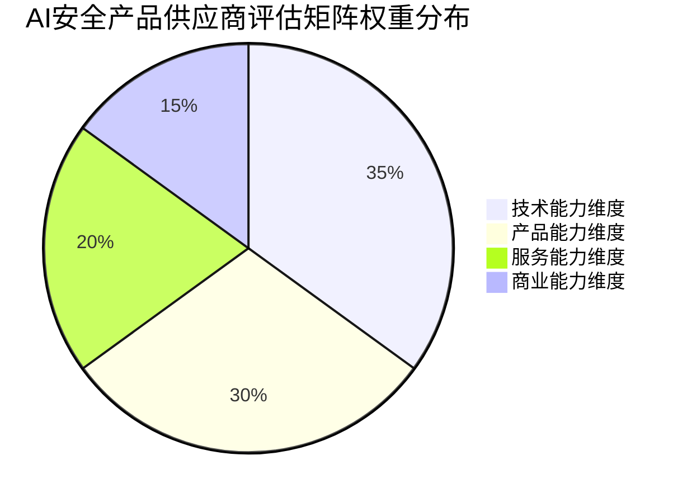
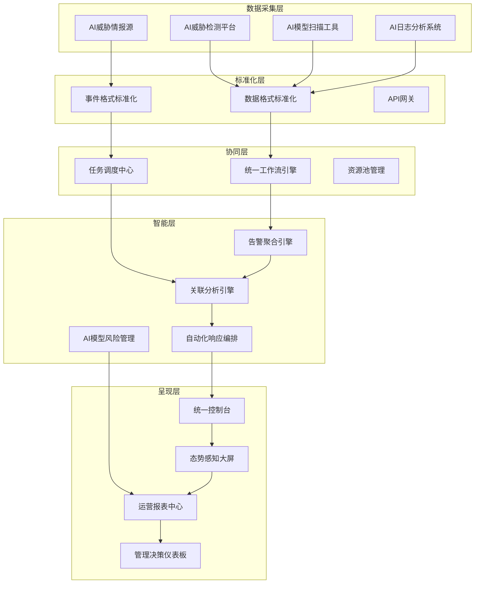
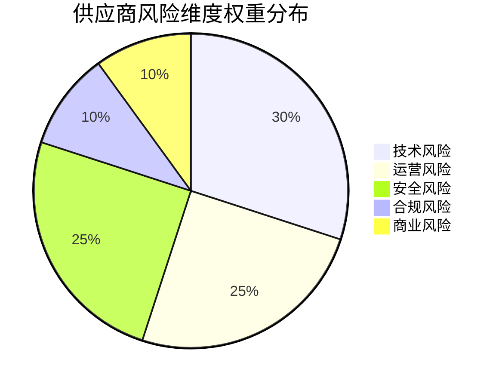
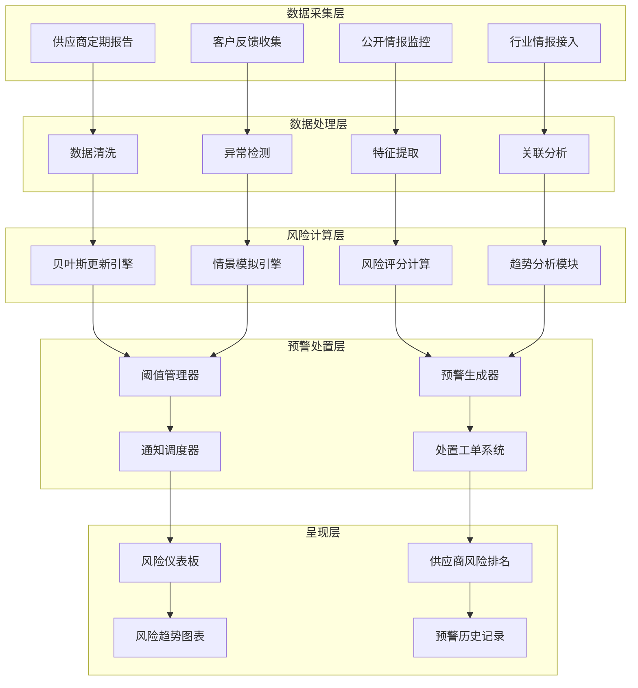
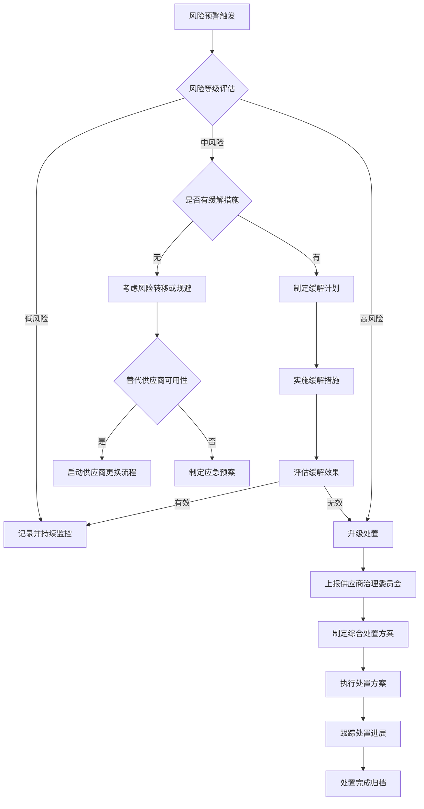
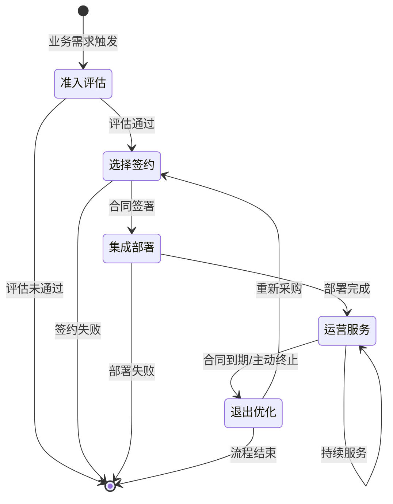
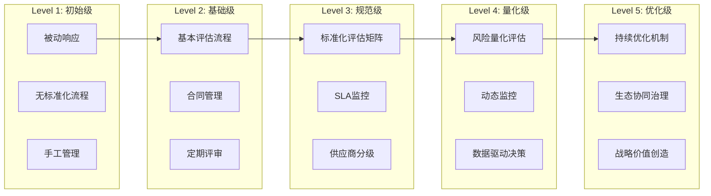

**作者：** HOS(安全风信子)
**日期：** 2026-04-27
**主要来源平台：** GitHub
**摘要：** 本文系统阐述AI安全运营场景下供应商管理的全生命周期管理体系，涵盖供应商评估矩阵、多供应商集成框架及风险量化评估三大核心维度。重点分析如何构建AI安全产品供应商的准入机制、协同管理模式与动态风险监控能力，为企业建立供应商生态治理提供可落地的工程实践指南。通过Python实现供应商评估自动化引擎，结合Mermaid可视化展示管理流程架构，助力企业在AI安全运营领域实现供应商价值的最大化与风险的最小化。

@[TOC](目录)

---

# AI安全运营供应商管理

## 第一章 引言：从单点防御到供应商生态治理

### 1.1 AI安全运营的供应商困境

在企业AI安全运营体系日益复杂的今天，单一供应商模式已难以满足多场景、多层次的安全防护需求。根据Gartner 2025年的研究报告显示，超过78%的企业在AI安全运营中采用多供应商策略，但其中仅有23%建立了完善的供应商管理体系，导致了严重的"工具蔓延"和"数据孤岛"问题。

传统的供应商管理方法论在AI安全运营领域面临前所未有的挑战：

**技术复杂性指数级增长**：AI安全产品涉及机器学习模型对抗、神经网络后门检测、大语言模型安全评估等前沿领域，对供应商的技术能力提出了极高要求。传统的资质审查和财务评估方法无法有效判断供应商在AI安全细分领域的技术储备和持续创新能力。

**供应链攻击风险加剧**：SolarWinds事件拉开了软件供应链攻击的序幕，而在AI安全运营领域，供应商不仅提供安全工具本身，还可能接触到企业的安全日志、威胁情报、用户行为数据等敏感资产。一旦供应商遭受攻击或存在恶意行为，将直接威胁到企业AI安全体系的完整性。

**供应商锁定效应明显**：主流AI安全厂商通过深度集成、专有数据格式、定制化API等方式构建技术壁垒，使得企业更换供应商的迁移成本极高。这要求企业在初期选择供应商时必须具备前瞻性的战略视角。

**持续服务能力难以评估**：AI安全产品的有效性高度依赖于持续的模型更新、威胁情报同步和运维支持。传统的年度评估机制无法及时发现供应商服务能力的衰减，导致企业在不知不觉中陷入安全能力退化的风险。

### 1.2 本文的核心贡献与阅读指南

本文作为《AI能力使用手册》专栏的第142篇文章，也是专栏终极收尾篇章之一，旨在为企业AI安全运营供应商管理提供系统性的方法论指导和可落地的工程实践。本文的核心贡献体现在以下三个新要素：

**要素一：AI安全产品供应商评估矩阵**：提出一套多维度、多层次的供应商技术能力评估体系，将AI安全能力细分为模型安全、威胁检测、运营效率、合规适配等核心类别，并为每个类别建立可量化的评估指标和权重体系。该矩阵不仅支持静态的供应商准入评估，还可应用于供应商持续绩效管理。

**要素二：多供应商集成管理框架**：设计一套完整的供应商集成管理架构，涵盖接口标准化、数据互通、流程协同、事件统一处置等关键环节。通过该框架，企业可以有效规避多供应商环境下的工具蔓延风险，实现安全能力的协调整度和统一运营。

**要素三：供应商风险量化评估体系**：引入金融风险管理的量化方法论，建立供应商风险的动态评估模型。该体系综合考虑供应商技术能力、财务健康度、安全合规历史、服务连续性、供应链暴露面等多维因素，计算供应商风险得分并支持实时监控和预警。

本文的后续章节将按照以下逻辑展开：第二章详细阐述供应商评估矩阵的设计原理和具体应用；第三章介绍多供应商集成管理框架的架构设计和实现方案；第四章深入分析供应商风险量化评估体系的构建方法；第五章通过实际代码示例演示供应商管理系统的核心功能实现；第六章总结全文并展望未来发展趋势。

---

## 第二章 AI安全产品供应商评估矩阵

### 2.1 评估矩阵的设计原则与理论框架

供应商评估矩阵的科学性取决于其设计原则的严谨性和理论框架的完善性。本文提出的评估矩阵遵循以下核心设计原则：

**全面性原则**：评估矩阵必须覆盖AI安全产品的全生命周期能力，包括技术先进性、产品成熟度、服务持续性、商业可行性等维度。避免因评估维度缺失导致对供应商能力的误判。

**可量化原则**：所有评估指标必须具备可量化性，避免主观臆断。对于难以直接量化的指标，应设计代理指标或间接评估方法。例如，"技术先进性"可通过"专利数量"、"论文发表"、"竞赛排名"等可量化指标间接评估。

**层次性原则**：评估指标应具有清晰的层次结构，从高层级的战略指标到底层级的操作指标形成树状结构。这既便于高层管理者理解总体评估结果，也支持专业人员在细粒度上进行深入分析。

**动态性原则**：评估矩阵应支持定期更新和动态调整。随着AI安全威胁态势的演变和技术的迭代发展，评估指标和权重需要相应调整以保持其有效性。

基于上述原则，本文构建的评估矩阵理论框架包含四个一级维度：技术能力维度、产品能力维度、服务能力维度和商业能力维度。每个一级维度下设若干二级指标，指标总数达到32个，形成完整的评估指标体系。

### 2.2 技术能力维度详解

技术能力维度是评估AI安全产品供应商的核心维度，直接决定了供应商能否提供真正有效的AI安全防护能力。该维度下设四个二级指标：

**AI安全研究能力**：评估供应商在AI安全领域的基础研究和应用研究实力。具体评估要素包括：核心安全研究团队规模和研究背景、顶级AI安全会议论文发表数量（如IEEE S&P、USENIX Security、CCS等）、AI安全相关专利持有数量、参加或主办AI安全竞赛的成绩。企业在评估时应重点关注供应商是否具备自主研究能力，而非仅仅依赖开源技术的集成能力。

**模型安全保障能力**：评估供应商在AI模型安全领域的核心技术实力。关注点包括：对抗样本检测与防御能力、模型后门识别与清除能力、模型隐私保护技术（如差分隐私、联邦学习安全增强）、模型鲁棒性评估与增强能力。评估方法可通过要求供应商提供第三方测试报告或进行自有数据集的实测验证。

**威胁情报能力**：评估供应商的威胁情报采集、处理和分发能力。AI安全运营高度依赖高质量的威胁情报，评估要点包括：情报来源的多样性和覆盖度、情报处理的自动化程度和时延、情报与产品的集成深度、情报共享社区的参与度（如MISP、STIX/TAXII等标准）。

**创新能力**：评估供应商的技术创新潜力和发展趋势判断能力。关注要素包括：研发投入占比、新产品推出频率、技术路线的前瞻性布局、与学术机构的合作深度。创新能力的评估需要结合行业发展趋势进行综合判断，避免仅看短期表现。

### 2.3 产品能力维度详解

产品能力维度评估AI安全产品的功能完整性和工程成熟度，是供应商技术能力转化为实际产品效果的关键环节。

**功能覆盖度**：评估产品功能对AI安全需求场景的覆盖程度。AI安全运营需要的功能模块通常包括：AI资产清点与分类、模型安全扫描与评估、威胁检测与响应、合规审计与报告、自动化运营工作流。评估时应逐一核对功能清单与实际需求的匹配度。

**检测准确度**：这是AI安全产品的核心性能指标，包括误报率（False Positive Rate）和漏报率（False Negative Rate）。评估方法应包括：在真实环境中的长期测试、使用标准化测试数据集（如AdvML、Robustness Gym等）进行基准测试、与其他已部署产品的对比测试。

**集成能力**：评估产品与企业现有安全体系和IT基础设施的集成难度。关注点包括：API的完整性和文档质量、SDK的支持情况、与主流SIEM/SOAR平台的集成预置、身份认证和权限管理的标准化程度。

**性能表现**：评估产品对系统资源的需求和性能瓶颈。包括：模型推理延迟和吞吐量、资源占用（CPU、内存、GPU）、大规模数据处理能力、集群部署的可扩展性。

### 2.4 服务能力维度详解

服务能力维度评估供应商在产品交付后的持续服务和支持能力，对AI安全产品的长期有效性至关重要。

**响应能力**：评估供应商对客户问题和需求响应的及时性和有效性。包括：SLA协议的实际履行情况、响应时间承诺与实际表现、问题升级流程的透明度、紧急事件处置能力。企业在评估时应参考同行业客户的服务体验反馈。

**培训支持**：评估供应商提供的用户培训和技术赋能服务。包括：培训课程体系的完整性、培训形式的多样性（线上、线下、现场）、培训资源的持续更新、技术文档的质量和可获取性。良好的培训支持可以显著提升AI安全产品的使用效果。

**产品迭代**：评估供应商的产品持续改进和升级能力。关注要素包括：产品版本的更新频率、功能增强的规划透明度、版本升级的平滑度、历史问题的修复效率。供应商的产品迭代能力直接影响AI安全产品能否应对不断演变的威胁。

**生态建设**：评估供应商在行业生态中的参与度和贡献度。包括：与主流云平台的合作深度、开源社区的贡献度、行业标准制定的参与度、用户社区的活跃度。强大的生态建设能力意味着供应商能够更好地适应行业变化并获取外部资源。

### 2.5 商业能力维度详解

商业能力维度评估供应商作为商业实体的稳健性和长期合作可行性。

**财务健康度**：评估供应商的财务状况和发展可持续性。评估方法包括：查阅公开财务报告（如为上市公司）、第三方信用评估、融资历史和资金储备情况。财务健康度直接影响供应商能否持续投入产品研发和服务支持。

**市场地位**：评估供应商在AI安全市场中的竞争地位和品牌影响力。关注要素包括：市场份额和增长趋势、客户群体的层次和多样性、市场评价和行业认可度（如Gartner魔力象限、IDC报告排名等）。

**合规资质**：评估供应商的企业资质和产品合规性。包括：ISO27001、SOC2、GDPR等通用安全认证、AI安全相关的行业资质、产品在不同地区的合规适应性。

**定价策略**：评估供应商定价的合理性和透明度。包括：定价模式的灵活性（订阅制、永久授权、消耗制等）、定价层级与功能差异的匹配度、成本可预测性。定价策略应与企业采购预算和使用规模相适应。

### 2.6 评估矩阵权重配置与应用方法

评估矩阵的权重配置是决定评估结果科学性的关键环节。本文建议采用层次分析法（AHP）结合行业专家评分的方法确定权重，并在应用时根据企业实际情况进行适当调整。

以下是评估矩阵的权重配置建议：



各一级维度下的二级指标权重配置如下表所示：

| 一级维度 | 二级指标 | 建议权重 |
|---------|---------|----------|
| 技术能力 | AI安全研究能力 | 10% |
| 技术能力 | 模型安全保障能力 | 10% |
| 技术能力 | 威胁情报能力 | 8% |
| 技术能力 | 创新能力 | 7% |
| 产品能力 | 功能覆盖度 | 8% |
| 产品能力 | 检测准确度 | 12% |
| 产品能力 | 集成能力 | 5% |
| 产品能力 | 性能表现 | 5% |
| 服务能力 | 响应能力 | 7% |
| 服务能力 | 培训支持 | 5% |
| 服务能力 | 产品迭代 | 5% |
| 服务能力 | 生态建设 | 3% |
| 商业能力 | 财务健康度 | 5% |
| 商业能力 | 市场地位 | 4% |
| 商业能力 | 合规资质 | 3% |
| 商业能力 | 定价策略 | 3% |

在实际应用中，企业应根据自身AI安全运营的具体需求和战略重点，对权重配置进行适当调整。例如，对于高度重视技术自主研发的企业，可以适当提高"AI安全研究能力"和"创新能力"的权重；对于关注长期服务连续性的企业，可以增加"服务能力维度"的整体权重。

评估矩阵的应用流程包括以下步骤：

**第一步：建立评估小组**：由安全团队、采购团队、法务团队代表组成评估小组，明确各成员在评估工作中的职责分工。

**第二步：收集评估数据**：通过供应商问卷、产品演示、技术测试、参考客户访谈等渠道收集评估数据。

**第三步：逐项评分**：根据收集的数据，对照评估标准逐项进行评分（通常采用1-5分制或1-10分制）。

**第四步：加权计算**：将各项评分乘以对应权重后汇总，计算供应商的综合评估得分。

**第五步：敏感性分析**：对权重配置进行敏感性分析，验证评估结果的稳健性。

**第六步：形成评估报告**：汇总评估结果，形成供应商评估报告，作为供应商准入和选择的决策依据。

---

## 第三章 多供应商集成管理框架

### 3.1 多供应商环境的挑战与机遇

在企业AI安全运营实践中，采用多供应商策略已成为主流选择。然而，多供应商环境带来的挑战同样不容忽视。深入理解这些挑战并建立系统性的应对框架，是实现供应商价值最大化的关键。

多供应商环境的主要挑战体现在以下方面：

**工具蔓延问题**：随着AI安全威胁场景的复杂化，企业通常需要部署多款专项工具来覆盖不同的安全需求。然而，缺乏统一规划的采购决策容易导致工具数量激增，形成"工具蔓延"现象。根据ESG的调研数据，采用多供应商策略的企业平均使用4.7款AI安全产品，远超过安全团队的日常管理能力上限。

**数据孤岛问题**：不同供应商的产品通常采用各自的数据格式和存储机制，导致安全数据分散在多个系统中难以整合。这不仅增加了数据分析和关联的难度，也阻碍了统一安全态势感知能力的构建。

**流程碎片化问题**：各供应商产品的报警格式、工单流程、处置机制各不相同，安全运营人员需要在多个平台之间切换，增加了运营负担和出错概率。研究表明，工具切换频率与运营人员疲劳度呈显著正相关。

**集成复杂度问题**：多供应商环境下的系统集成复杂度呈指数级增长，包括网络架构适配、身份认证统一、API接口对接、数据格式转换等众多技术挑战。

然而，成熟的多供应商管理策略也能为企业带来独特价值：

**能力互补优势**：不同供应商在AI安全细分领域各有专长，多供应商策略允许企业整合各方优势，构建更完整的安全防护体系。

**风险分散价值**：过度依赖单一供应商可能带来供应商锁定和单点故障风险，多供应商策略有助于分散风险敞口。

**议价能力提升**：多供应商格局有助于打破单一供应商的价格垄断，增强企业在采购谈判中的议价能力。

### 3.2 集成管理框架总体架构

为有效应对多供应商环境的挑战，本文提出一套完整的多供应商集成管理框架（Multi-Vendor Integration Management Framework，简称MVIMF）。该框架采用分层架构设计，自下而上包括数据采集层、标准化层、协同层、智能层和呈现层。



**数据采集层**负责从各供应商产品中采集安全数据和事件信息。该层的关键技术挑战是适配不同供应商的数据接口，包括API对接、SDK集成、日志推送、消息队列订阅等多种数据采集方式。

**标准化层**负责将异构数据转换为统一格式。该层实现数据格式标准化（如将各类告警格式转换为STIX/TAXII标准）、事件格式标准化（如采用OpenCSL统一事件模型）、API网关统一管理。

**协同层**负责跨供应商的工作流协调和任务调度。该层的核心组件包括统一工作流引擎（支持跨平台工作流编排）、任务调度中心（协调不同供应商产品的任务执行）、资源池管理（统一管理计算、存储、网络资源）。

**智能层**是框架的核心智能中枢，集成告警聚合、关联分析、自动化响应编排、AI模型风险管理等高级分析能力。该层基于机器学习和知识图谱技术，实现跨供应商安全事件的深度分析和智能响应。

**呈现层**负责将分析结果以用户友好的方式呈现，支持统一控制台、态势感知大屏、运营报表、管理决策等多种视图。

### 3.3 接口标准化与数据互通机制

接口标准化是实现多供应商数据互通的基础。本文提出采用"适配器模式"结合"标准总线"的技术方案来解决接口异构问题。

**适配器模式**：为每个供应商产品开发专属的适配器组件，负责将供应商私有接口转换为框架内部标准接口。适配器封装了供应商接口的细节，框架其他组件仅需与标准接口交互，降低了系统耦合度。

**标准总线**：采用企业服务总线（ESB）或现代事件驱动架构（EDA）作为信息流通的中枢。标准总线定义统一的数据交换格式和通信协议，所有适配器通过总线进行数据交换。

数据互通机制的设计要点包括：

**实时数据流**：对于需要实时处理的告警事件，采用消息队列（如Apache Kafka、RabbitMQ）实现低延迟数据传输。消息队列支持消息持久化、负载均衡、故障恢复等企业级特性。

**批量数据同步**：对于定期报表、合规审计等场景，采用批量数据同步机制。通过调度系统控制同步频率和时机，避免对供应商产品的性能造成影响。

**数据质量保障**：建立数据质量监控机制，对数据的完整性、准确性、及时性进行持续监控。发现数据异常时及时告警并触发数据修复流程。

### 3.4 统一工作流编排引擎设计

多供应商环境下，安全运营工作流往往涉及多个系统的协同操作。例如，一个AI模型安全事件的完整处置流程可能需要依次在威胁检测平台触发告警、在模型扫描工具进行深度检测、在工单系统创建工单、在SOAR平台执行响应剧本。

统一工作流编排引擎的核心设计理念是将跨供应商的工作流抽象为统一的工作流描述语言，由引擎负责解析、执行和监控。

工作流描述采用YAML格式，支持以下核心概念：

```yaml
workflow:
  name: "AI模型安全事件处置"
  version: "1.0"
  triggers:
    - type: "event"
      source: "threat_detection_platform"
      event_type: "model_compromise_alert"
  
  steps:
    - id: "step_1"
      name: "威胁情报查询"
      action:
        type: "api_call"
        provider: "threat_intelligence_vendor"
        operation: "query_ioc"
        parameters:
          ioc: "${event.target_ioc}"
      
    - id: "step_2"
      name: "模型扫描"
      action:
        type: "async_task"
        provider: "model_security_vendor"
        operation: "scan_model"
        parameters:
          model_id: "${event.target_model_id}"
        wait_for_completion: true
        timeout: 3600
      
    - id: "step_3"
      name: "风险评级"
      action:
        type: "decision"
        conditions:
          - expression: "${scan_result.risk_level} >= 8"
            branch: "high_risk"
          - expression: "${scan_result.risk_level} >= 5"
            branch: "medium_risk"
          - expression: "true"
            branch: "low_risk"
      
    - id: "step_4_high_risk"
      name: "高风险响应"
      condition: "high_risk"
      actions:
        - type: "soar_playbook"
          provider: "soar_vendor"
          playbook: "isolate_model"
        - type: "notification"
          channel: "email"
          recipients: ["security_team"]
      
    - id: "step_5"
      name: "生成处置报告"
      action:
        type: "report_generation"
        template: "incident_report"
        output: "pdf"
```

工作流引擎负责解析工作流定义、维护工作流执行状态、处理条件分支、管理并行执行、处理超时和异常。引擎还提供实时监控界面，允许运营人员查看工作流执行进度、干预执行过程、手动重试失败步骤。

### 3.5 供应商协同治理最佳实践

多供应商环境的成功管理需要建立系统性的协同治理机制。以下是本文总结的最佳实践：

**建立供应商治理委员会**：成立由安全团队、采购团队、法务团队、技术架构团队代表组成的供应商治理委员会，负责制定供应商管理策略、审批重大采购决策、协调跨供应商问题、评审供应商绩效。

**制定供应商SLA标准**：为所有供应商建立统一的SLA标准框架，包括系统可用性、响应时间、问题解决时限、数据质量等关键指标。SLA标准应尽可能量化并可测量，为供应商绩效评估提供客观依据。

**建立常态化的沟通机制**：与各供应商建立定期沟通会议制度，包括周度运营回顾、月度绩效评审、季度战略规划。沟通内容应涵盖服务表现、产品 roadmap、问题反馈、联合创新等议题。

**实施供应商分级管理**：根据供应商的战略重要性和风险敞口，将供应商分为战略级、核心级、一般级、备选级等不同等级，针对不同等级实施差异化的管理策略。

**推动供应商能力提升**：将企业的最佳实践和安全需求反馈给供应商，推动供应商产品能力的持续改进。参与供应商的用户社区和beta测试计划，影响产品发展方向。

---

## 第四章 供应商风险量化评估体系

### 4.1 风险量化评估的理论基础

传统的供应商风险管理主要依赖定性评估方法，如专家评审、检查清单、风险矩阵等。这些方法虽然简单易行，但存在主观性强、难以横向比较、无法动态调整等局限性。本文引入金融风险管理的量化方法论，构建AI安全运营供应商风险量化评估体系。

风险量化评估的核心思想是将供应商风险分解为多个可量化的风险因子，通过数学模型将各因子综合计算为风险得分。该方法论借鉴了信用风险评分（如FICO信用评分）和市场风险度量（如VaR模型）的实践经验，并根据AI安全运营的领域特点进行了适应性改造。

风险量化评估的理论基础包括：

**多因子模型**：供应商风险受多个相互独立或弱相关的风险因子影响。通过识别关键风险因子并确定其权重，可以构建综合风险评分模型。本文采用改进的层次分析法（AHP）结合主成分分析（PCA）来确定因子权重。

**贝叶斯更新机制**：风险评估不是一次性活动，而应随着新信息的获取而持续更新。贝叶斯推断方法允许在新证据出现时动态更新风险概率分布，使评估结果能够反映供应商的最新状态。

**蒙特卡洛模拟**：对于复杂的风险组合和依赖关系，采用蒙特卡洛模拟方法进行风险量化。通过大量随机模拟，可以估算风险分布的尾部特征和极端情景下的风险敞口。

### 4.2 供应商风险因子识别与分类

AI安全运营供应商风险可从以下五个维度进行识别和分类：

**技术风险因子**：反映供应商技术能力和产品可靠性的风险因素。

- **技术储备风险**：供应商在AI安全领域的技术专利、研究成果、人才储备是否足以支撑持续发展
- **产品成熟度风险**：产品的工程化程度、稳定性、已知缺陷数量等
- **技术依赖风险**：供应商对特定技术路线、开源组件、云平台的依赖程度
- **版本质量风险**：产品版本更新的质量稳定性、升级过程的问题率

**运营风险因子**：反映供应商日常运营稳定性的风险因素。

- **服务连续性风险**：供应商持续提供服务的能力，包括财务稳定性、团队稳定性、基础设施可靠性
- **响应能力风险**：供应商对客户问题和紧急事件的响应及时性
- **容量风险**：供应商的服务容量是否能够满足客户业务增长需求
- **地理政治风险**：供应商所在地区的政策稳定性、出口管制、合规要求

**安全风险因子**：与供应商自身安全状况相关的风险因素。

- **供应链安全风险**：供应商的软件开发流程、第三方组件管理、代码签名机制的安全性
- **数据安全风险**：供应商对客户数据的安全保护能力，包括传输安全、存储安全、处理安全
- **访问控制风险**：供应商人员对客户系统和数据的访问控制机制
- **历史安全事件**：供应商过去是否发生过安全事件、数据泄露、服务中断

**合规风险因子**：反映供应商合规状况的风险因素。

- **资质合规风险**：供应商是否具备必要的资质认证和合规证明
- **隐私合规风险**：供应商的数据处理活动是否符合GDPR、CCPA等隐私法规
- **行业合规风险**：供应商是否满足特定行业的监管要求
- **跨境合规风险**：供应商的数据流动是否符合各国的数据本地化要求

**商业风险因子**：反映供应商商业可靠性的风险因素。

- **财务健康风险**：供应商的财务状况是否稳健，盈利能力是否可持续
- **市场地位风险**：供应商的市场竞争力和行业地位变化趋势
- **战略方向风险**：供应商的战略规划是否与企业需求保持一致
- **退出风险**：供应商是否可能退出市场或被收购，导致服务中断

### 4.3 风险量化评估模型构建

基于上述风险因子识别，本文构建供应商风险量化评估模型。模型采用多层次加权评分方法，总体风险得分计算公式为：

```
RiskScore = Σ(Wi × Σ(Wij × Sij)) / ΣWi
```

其中，Wi为一级维度权重，Wij为二级因子权重，Sij为二级因子评分。

各维度权重建议配置如下：



每个二级因子的评分采用标准化评分量表，将原始指标值映射到0-100的风险得分区间。评分越高表示风险越低，评分越低表示风险越高。

以"技术储备风险"为例，其评分标准如下：

| 评估要素 | 评分标准（0-100） | 权重 |
|---------|------------------|------|
| 专利组合 | 无专利：0；<10项：25；10-50项：50；50-100项：75；>100项：100 | 30% |
| 研究团队 | 无专业团队：0；<10人：25；10-50人：50；50-100人：75；>100人：100 | 30% |
| 论文发表 | 无论文：0；年均<5篇：25；5-20篇：50；20-50篇：75；>50篇：100 | 25% |
| 开源贡献 | 无贡献：0；偶尔贡献：25；活跃贡献者：50；主要维护者：75；项目发起者：100 | 15% |

风险量化评估模型还需要考虑风险因子之间的相关性。在实际评估中，技术风险与安全风险往往存在较强的正相关关系，而商业风险可能与运营风险存在关联。为处理这种相关性，模型引入风险关联矩阵，通过协方差调整来避免风险的重复计算。

### 4.4 动态风险监控与预警机制

风险评估不应是一次性活动，而应建立常态化的动态监控和预警机制。本文设计的动态监控机制包括以下核心组件：

**数据采集层**：建立多渠道数据采集体系，持续收集与供应商风险相关的动态信息。数据来源包括：供应商定期报告、客户满意度调查、公开财务信息、安全事件公告、行业情报监测、社交媒体舆情等。

**风险更新引擎**：基于贝叶斯更新方法，当有新的风险证据出现时，自动更新供应商的风险评分。贝叶斯更新的核心公式为：

```
P(H|E) = P(E|H) × P(H) / P(E)
```

其中，P(H)为先验风险概率，P(E)为新证据的边缘概率，P(E|H)为似然函数，P(H|E)为后验风险概率。

**阈值预警机制**：为每个风险维度设置预警阈值，当风险评分突破阈值时触发预警。预警级别可分为关注级（黄色预警）、警告级（橙色预警）、严重级（红色预警）三个层次。

**趋势分析模块**：对供应商风险评分的历史数据进行趋势分析，识别风险评分的变化趋势。当检测到持续恶化趋势时，即使评分尚未突破阈值，也应提前发出预警。

**情景模拟模块**：基于蒙特卡洛模拟方法，对供应商未来可能的风险情景进行模拟分析。模拟内容可能包括：供应商财务恶化情景、供应商服务中断情景、供应商被收购情景等。

动态监控系统的技术架构设计如下：



### 4.5 风险应对策略与处置流程

当供应商风险预警触发后，需要启动相应的风险应对流程。本文设计的风险应对策略包括以下几种类型：

**风险接受策略**：对于风险评分较低或风险影响可控的供应商，可以选择接受风险并持续监控。适用于风险等级为"低"且供应商战略价值较高的场景。

**风险缓解策略**：通过要求供应商改进、签订补充协议、增加监督频率等方式，降低供应商风险敞口。适用于风险等级为"中"且供应商具备改进意愿和能力的场景。

**风险转移策略**：通过购买保险、签订责任条款、要求保证金等方式，将部分风险转移给第三方。适用于风险等级为"高"但难以在短期内更换供应商的场景。

**风险规避策略**：通过更换供应商、终止合作、自建能力等方式，完全规避供应商风险敞口。适用于风险等级为"极高"且存在可靠的替代供应商的场景。

风险处置流程的设计如下：



---

## 第五章 供应商管理系统实现

### 5.1 系统总体架构设计

本章通过实际代码示例演示AI安全运营供应商管理系统的核心功能实现。系统采用Python作为主要开发语言，结合FastAPI构建后端服务，SQLite作为数据存储，Pydantic用于数据验证。

系统总体架构分为四个核心模块：

**供应商信息管理模块（VendorInfoModule）**：管理供应商的基本信息、联系人、合同、资质等静态数据。

**评估引擎模块（EvaluationEngine）**：实现供应商评估矩阵的评分计算逻辑，支持多维度加权评估。

**集成管理模块（IntegrationModule）**：管理多供应商产品的集成配置、数据流、工作流等。

**风险监控模块（RiskMonitorModule）**：实现供应商风险的量化评估和动态监控功能。

以下是系统的目录结构设计：

```
vendor_management_system/
├── main.py                    # 应用入口
├── config.py                  # 配置文件
├── models/
│   ├── __init__.py
│   ├── vendor.py              # 供应商数据模型
│   ├── evaluation.py          # 评估数据模型
│   └── risk.py                # 风险数据模型
├── modules/
│   ├── __init__.py
│   ├── vendor_info.py         # 供应商信息管理
│   ├── evaluation_engine.py   # 评估引擎
│   ├── integration.py         # 集成管理
│   └── risk_monitor.py        # 风险监控
├── services/
│   ├── __init__.py
│   ├── database.py            # 数据库服务
│   └── notification.py        # 通知服务
├── utils/
│   ├── __init__.py
│   └── helpers.py             # 辅助函数
└── tests/
    ├── __init__.py
    ├── test_evaluation.py     # 评估模块测试
    └── test_risk.py          # 风险模块测试
```

### 5.2 数据模型定义

供应商管理系统的数据模型是整个系统的基础。本文定义的数据模型包括供应商模型、评估模型、风险模型三大类。

```python
from pydantic import BaseModel, Field, field_validator
from typing import Optional, List, Dict, Any
from datetime import datetime
from enum import Enum


class VendorType(str, Enum):
    """供应商类型枚举"""
    THREAT_DETECTION = "threat_detection"        # 威胁检测
    MODEL_SECURITY = "model_security"           # 模型安全
    INTELLIGENCE = "intelligence"                # 威胁情报
    SOAR = "soar"                               # 安全编排
    SIEM = "siem"                               # 日志分析
    COMPLIANCE = "compliance"                   # 合规审计


class VendorTier(str, Enum):
    """供应商等级枚举"""
    STRATEGIC = "strategic"      # 战略级
    CORE = "core"               # 核心级
    GENERAL = "general"         # 一般级
    BACKUP = "backup"           # 备选级


class VendorStatus(str, Enum):
    """供应商状态枚举"""
    ACTIVE = "active"           # 活跃
    INACTIVE = "inactive"       # 非活跃
    PENDING = "pending"         # 待评估
    SUSPENDED = "suspended"     # 暂停合作
    TERMINATED = "terminated"   # 终止合作


class VendorBase(BaseModel):
    """供应商基础数据模型"""
    name: str = Field(..., min_length=1, max_length=200, description="供应商名称")
    vendor_type: VendorType = Field(..., description="供应商类型")
    tier: VendorTier = Field(default=VendorTier.GENERAL, description="供应商等级")
    status: VendorStatus = Field(default=VendorStatus.PENDING, description="供应商状态")
    website: Optional[str] = Field(None, description="官网地址")
    headquarters: Optional[str] = Field(None, description="总部位置")
    founded_year: Optional[int] = Field(None, ge=1900, le=2030, description="成立年份")
    employee_count: Optional[int] = Field(None, ge=1, description="员工数量")
    annual_revenue: Optional[float] = Field(None, ge=0, description="年收入（万元）")
    description: Optional[str] = Field(None, max_length=2000, description="供应商描述")


class ContactInfo(BaseModel):
    """联系人信息模型"""
    name: str = Field(..., min_length=1, max_length=100)
    title: Optional[str] = Field(None, max_length=100)
    email: str = Field(..., description="邮箱地址")
    phone: Optional[str] = Field(None, description="联系电话")
    is_primary: bool = Field(default=False, description="是否主要联系人")
    responsibility: Optional[str] = Field(None, description="职责范围")


class ContractInfo(BaseModel):
    """合同信息模型"""
    contract_id: str = Field(..., description="合同编号")
    contract_type: str = Field(..., description="合同类型")
    start_date: datetime = Field(..., description="合同开始日期")
    end_date: datetime = Field(..., description="合同结束日期")
    auto_renewal: bool = Field(default=False, description="是否自动续约")
    payment_terms: Optional[str] = Field(None, description="付款条款")
    total_value: Optional[float] = Field(None, ge=0, description="合同总金额（万元）")


class Qualification(BaseModel):
    """资质证书模型"""
    cert_name: str = Field(..., description="证书名称")
    cert_type: str = Field(..., description="证书类型")
    issue_org: str = Field(..., description="颁发机构")
    issue_date: datetime = Field(..., description="颁发日期")
    expiry_date: Optional[datetime] = Field(None, description="到期日期")
    cert_number: Optional[str] = Field(None, description="证书编号")
    scope: Optional[str] = Field(None, description="认证范围")
    is_verified: bool = Field(default=False, description="是否已验证")


class Vendor(VendorBase):
    """完整供应商数据模型"""
    vendor_id: str = Field(..., description="供应商唯一标识")
    created_at: datetime = Field(default_factory=datetime.now)
    updated_at: datetime = Field(default_factory=datetime.now)
    
    contacts: List[ContactInfo] = Field(default_factory=list)
    contracts: List[ContractInfo] = Field(default_factory=list)
    qualifications: List[Qualification] = Field(default_factory=list)
    
    primary_contact_id: Optional[str] = Field(None, description="主要联系人ID")
    
    class Config:
        json_encoders = {
            datetime: lambda v: v.isoformat()
        }
```

### 5.3 评估引擎实现

评估引擎是供应商管理系统的核心组件，负责实现供应商评估矩阵的评分计算逻辑。

```python
import json
from typing import Dict, List, Optional, Tuple
from dataclasses import dataclass, field
from datetime import datetime
from enum import Enum


class EvaluationDimension(str, Enum):
    """评估维度枚举"""
    TECHNICAL = "technical"                 # 技术能力
    PRODUCT = "product"                     # 产品能力
    SERVICE = "service"                      # 服务能力
    COMMERCIAL = "commercial"               # 商业能力


@dataclass
class EvaluationIndicator:
    """评估指标定义"""
    indicator_id: str
    name: str
    dimension: EvaluationDimension
    weight: float
    description: str
    max_score: float = 100.0
    min_score: float = 0.0


@dataclass
class EvaluationScore:
    """评估评分记录"""
    indicator_id: str
    score: float
    evidence: str
    evaluator: str
    evaluated_at: datetime = field(default_factory=datetime.now)
    attachments: List[str] = field(default_factory=list)


@dataclass
class EvaluationResult:
    """评估结果"""
    vendor_id: str
    evaluation_id: str
    dimension_scores: Dict[EvaluationDimension, float]
    overall_score: float
    evaluation_date: datetime = field(default_factory=datetime.now)
    evaluator: str
    comments: Optional[str] = None


class EvaluationMatrix:
    """评估矩阵配置"""
    
    DEFAULT_WEIGHTS = {
        EvaluationDimension.TECHNICAL: 0.35,
        EvaluationDimension.PRODUCT: 0.30,
        EvaluationDimension.SERVICE: 0.20,
        EvaluationDimension.COMMERCIAL: 0.15
    }
    
    def __init__(self, custom_weights: Optional[Dict[EvaluationDimension, float]] = None):
        self.weights = custom_weights or self.DEFAULT_WEIGHTS
        self._validate_weights()
        self.indicators = self._init_indicators()
    
    def _validate_weights(self):
        total = sum(self.weights.values())
        if abs(total - 1.0) > 0.001:
            raise ValueError(f"Weights must sum to 1.0, got {total}")
    
    def _init_indicators(self) -> Dict[str, EvaluationIndicator]:
        return {
            # 技术能力维度指标
            "tech_research": EvaluationIndicator(
                indicator_id="tech_research",
                name="AI安全研究能力",
                dimension=EvaluationDimension.TECHNICAL,
                weight=0.10,
                description="评估供应商在AI安全领域的研究实力"
            ),
            "tech_model_security": EvaluationIndicator(
                indicator_id="tech_model_security",
                name="模型安全保障能力",
                dimension=EvaluationDimension.TECHNICAL,
                weight=0.10,
                description="评估供应商在模型安全领域的核心技术实力"
            ),
            "tech_intelligence": EvaluationIndicator(
                indicator_id="tech_intelligence",
                name="威胁情报能力",
                dimension=EvaluationDimension.TECHNICAL,
                weight=0.08,
                description="评估供应商的威胁情报采集和处理能力"
            ),
            "tech_innovation": EvaluationIndicator(
                indicator_id="tech_innovation",
                name="创新能力",
                dimension=EvaluationDimension.TECHNICAL,
                weight=0.07,
                description="评估供应商的技术创新潜力"
            ),
            
            # 产品能力维度指标
            "product_coverage": EvaluationIndicator(
                indicator_id="product_coverage",
                name="功能覆盖度",
                dimension=EvaluationDimension.PRODUCT,
                weight=0.08,
                description="评估产品功能对需求的覆盖程度"
            ),
            "product_accuracy": EvaluationIndicator(
                indicator_id="product_accuracy",
                name="检测准确度",
                dimension=EvaluationDimension.PRODUCT,
                weight=0.12,
                description="评估产品的误报率和漏报率表现"
            ),
            "product_integration": EvaluationIndicator(
                indicator_id="product_integration",
                name="集成能力",
                dimension=EvaluationDimension.PRODUCT,
                weight=0.05,
                description="评估产品与现有系统的集成难度"
            ),
            "product_performance": EvaluationIndicator(
                indicator_id="product_performance",
                name="性能表现",
                dimension=EvaluationDimension.PRODUCT,
                weight=0.05,
                description="评估产品对系统资源的消耗和响应性能"
            ),
            
            # 服务能力维度指标
            "service_response": EvaluationIndicator(
                indicator_id="service_response",
                name="响应能力",
                dimension=EvaluationDimension.SERVICE,
                weight=0.07,
                description="评估供应商对客户问题的响应及时性"
            ),
            "service_training": EvaluationIndicator(
                indicator_id="service_training",
                name="培训支持",
                dimension=EvaluationDimension.SERVICE,
                weight=0.05,
                description="评估供应商提供的培训和技术赋能服务"
            ),
            "service_iteration": EvaluationIndicator(
                indicator_id="service_iteration",
                name="产品迭代",
                dimension=EvaluationDimension.SERVICE,
                weight=0.05,
                description="评估供应商的产品持续改进能力"
            ),
            "service_ecosystem": EvaluationIndicator(
                indicator_id="service_ecosystem",
                name="生态建设",
                dimension=EvaluationDimension.SERVICE,
                weight=0.03,
                description="评估供应商在行业生态中的参与度"
            ),
            
            # 商业能力维度指标
            "biz_financial": EvaluationIndicator(
                indicator_id="biz_financial",
                name="财务健康度",
                dimension=EvaluationDimension.COMMERCIAL,
                weight=0.05,
                description="评估供应商的财务状况和发展可持续性"
            ),
            "biz_market": EvaluationIndicator(
                indicator_id="biz_market",
                name="市场地位",
                dimension=EvaluationDimension.COMMERCIAL,
                weight=0.04,
                description="评估供应商在市场中的竞争地位"
            ),
            "biz_compliance": EvaluationIndicator(
                indicator_id="biz_compliance",
                name="合规资质",
                dimension=EvaluationDimension.COMMERCIAL,
                weight=0.03,
                description="评估供应商的企业资质和产品合规性"
            ),
            "biz_pricing": EvaluationIndicator(
                indicator_id="biz_pricing",
                name="定价策略",
                dimension=EvaluationDimension.COMMERCIAL,
                weight=0.03,
                description="评估供应商定价的合理性和透明度"
            ),
        }
    
    def calculate_dimension_score(
        self,
        scores: Dict[str, EvaluationScore]
    ) -> Dict[EvaluationDimension, float]:
        """计算各维度加权得分"""
        dimension_scores = {
            dim: 0.0 for dim in EvaluationDimension
        }
        dimension_weights = {
            dim: 0.0 for dim in EvaluationDimension
        }
        
        for indicator_id, score_record in scores.items():
            if indicator_id not in self.indicators:
                continue
            
            indicator = self.indicators[indicator_id]
            dimension_scores[indicator.dimension] += score_record.score * indicator.weight
            dimension_weights[indicator.dimension] += indicator.weight
        
        for dim in EvaluationDimension:
            if dimension_weights[dim] > 0:
                dimension_scores[dim] /= dimension_weights[dim]
        
        return dimension_scores
    
    def calculate_overall_score(
        self,
        dimension_scores: Dict[EvaluationDimension, float]
    ) -> float:
        """计算综合评估得分"""
        overall = 0.0
        for dim, score in dimension_scores.items():
            overall += score * self.weights[dim]
        return overall
    
    def generate_evaluation_report(
        self,
        vendor_id: str,
        scores: Dict[str, EvaluationScore],
        evaluator: str,
        comments: Optional[str] = None
    ) -> EvaluationResult:
        """生成评估报告"""
        evaluation_id = f"EVL-{vendor_id}-{datetime.now().strftime('%Y%m%d%H%M%S')}"
        
        dimension_scores = self.calculate_dimension_score(scores)
        overall_score = self.calculate_overall_score(dimension_scores)
        
        return EvaluationResult(
            vendor_id=vendor_id,
            evaluation_id=evaluation_id,
            dimension_scores=dimension_scores,
            overall_score=overall_score,
            evaluator=evaluator,
            comments=comments
        )
    
    def get_recommendation(self, overall_score: float) -> Tuple[str, str]:
        """根据评估得分给出推荐建议"""
        if overall_score >= 85:
            return "highly_recommended", "该供应商表现卓越，建议优先考虑合作"
        elif overall_score >= 70:
            return "recommended", "该供应商表现良好，可以考虑纳入候选名单"
        elif overall_score >= 55:
            return "conditional", "该供应商表现一般，需要进一步评估或要求改进"
        elif overall_score >= 40:
            return "not_recommended", "该供应商存在明显不足，建议谨慎考虑"
        else:
            return "rejected", "该供应商不满足基本要求，不建议合作"


class EvaluationEngine:
    """评估引擎主类"""
    
    def __init__(self, evaluation_matrix: Optional[EvaluationMatrix] = None):
        self.matrix = evaluation_matrix or EvaluationMatrix()
        self.evaluation_history: Dict[str, List[EvaluationResult]] = {}
    
    def add_score(
        self,
        vendor_id: str,
        indicator_id: str,
        score: float,
        evidence: str,
        evaluator: str,
        attachments: Optional[List[str]] = None
    ) -> EvaluationScore:
        """添加评估评分"""
        if indicator_id not in self.matrix.indicators:
            raise ValueError(f"Unknown indicator: {indicator_id}")
        
        indicator = self.matrix.indicators[indicator_id]
        if not (indicator.min_score <= score <= indicator.max_score):
            raise ValueError(
                f"Score must be between {indicator.min_score} and {indicator.max_score}, got {score}"
            )
        
        return EvaluationScore(
            indicator_id=indicator_id,
            score=score,
            evidence=evidence,
            evaluator=evaluator,
            attachments=attachments or []
        )
    
    def evaluate_vendor(
        self,
        vendor_id: str,
        scores: List[EvaluationScore],
        evaluator: str,
        comments: Optional[str] = None
    ) -> EvaluationResult:
        """执行供应商评估"""
        scores_dict = {s.indicator_id: s for s in scores}
        result = self.matrix.generate_evaluation_report(
            vendor_id=vendor_id,
            scores=scores_dict,
            evaluator=evaluator,
            comments=comments
        )
        
        if vendor_id not in self.evaluation_history:
            self.evaluation_history[vendor_id] = []
        self.evaluation_history[vendor_id].append(result)
        
        return result
    
    def get_vendor_trend(
        self,
        vendor_id: str
    ) -> Optional[Dict[str, any]]:
        """获取供应商评估历史趋势"""
        if vendor_id not in self.evaluation_history:
            return None
        
        history = self.evaluation_history[vendor_id]
        if len(history) < 2:
            return None
        
        results = []
        for eval_result in history:
            results.append({
                "date": eval_result.evaluation_date.isoformat(),
                "overall_score": eval_result.overall_score,
                "dimension_scores": {
                    dim.value: score 
                    for dim, score in eval_result.dimension_scores.items()
                }
            })
        
        latest = history[-1]
        previous = history[-2]
        score_change = latest.overall_score - previous.overall_score
        
        return {
            "vendor_id": vendor_id,
            "evaluation_count": len(history),
            "trend_direction": "improving" if score_change > 0 else "declining" if score_change < 0 else "stable",
            "score_change": score_change,
            "history": results
        }


def demo_evaluation_engine():
    """演示评估引擎的使用"""
    engine = EvaluationEngine()
    
    vendor_id = "VND-001"
    evaluator = "security_team_lead"
    
    scores = [
        engine.add_score(
            vendor_id=vendor_id,
            indicator_id="tech_research",
            score=85.0,
            evidence="供应商拥有50+AI安全专利，发表论文30篇/年",
            evaluator=evaluator
        ),
        engine.add_score(
            vendor_id=vendor_id,
            indicator_id="tech_model_security",
            score=90.0,
            evidence="自主研发模型后门检测引擎，检出率99.5%",
            evaluator=evaluator
        ),
        engine.add_score(
            vendor_id=vendor_id,
            indicator_id="tech_intelligence",
            score=78.0,
            evidence="情报来源覆盖30+国家，延迟<5分钟",
            evaluator=evaluator
        ),
        engine.add_score(
            vendor_id=vendor_id,
            indicator_id="tech_innovation",
            score=82.0,
            evidence="研发投入占比25%，每年推出3+新产品",
            evaluator=evaluator
        ),
        engine.add_score(
            vendor_id=vendor_id,
            indicator_id="product_coverage",
            score=88.0,
            evidence="覆盖AI安全全场景需求，功能模块完整",
            evaluator=evaluator
        ),
        engine.add_score(
            vendor_id=vendor_id,
            indicator_id="product_accuracy",
            score=92.0,
            evidence="误报率<1%，漏报率<0.5%",
            evaluator=evaluator
        ),
        engine.add_score(
            vendor_id=vendor_id,
            indicator_id="product_integration",
            score=75.0,
            evidence="API文档完善，集成周期约2周",
            evaluator=evaluator
        ),
        engine.add_score(
            vendor_id=vendor_id,
            indicator_id="product_performance",
            score=80.0,
            evidence="单次推理延迟<50ms，支持水平扩展",
            evaluator=evaluator
        ),
        engine.add_score(
            vendor_id=vendor_id,
            indicator_id="service_response",
            score=85.0,
            evidence="7×24支持，响应时间<15分钟",
            evaluator=evaluator
        ),
        engine.add_score(
            vendor_id=vendor_id,
            indicator_id="service_training",
            score=78.0,
            evidence="提供线上线下培训，课程体系完善",
            evaluator=evaluator
        ),
        engine.add_score(
            vendor_id=vendor_id,
            indicator_id="service_iteration",
            score=88.0,
            evidence="每月迭代更新，版本升级平滑",
            evaluator=evaluator
        ),
        engine.add_score(
            vendor_id=vendor_id,
            indicator_id="service_ecosystem",
            score=72.0,
            evidence="参与多个开源项目，生态活跃度中等",
            evaluator=evaluator
        ),
        engine.add_score(
            vendor_id=vendor_id,
            indicator_id="biz_financial",
            score=85.0,
            evidence="近三年营收持续增长，财务状况健康",
            evaluator=evaluator
        ),
        engine.add_score(
            vendor_id=vendor_id,
            indicator_id="biz_market",
            score=82.0,
            evidence="AI安全市场份额前三，品牌影响力强",
            evaluator=evaluator
        ),
        engine.add_score(
            vendor_id=vendor_id,
            indicator_id="biz_compliance",
            score=90.0,
            evidence="持有ISO27001、SOC2等多项认证",
            evaluator=evaluator
        ),
        engine.add_score(
            vendor_id=vendor_id,
            indicator_id="biz_pricing",
            score=75.0,
            evidence="定价合理透明，但折扣空间有限",
            evaluator=evaluator
        ),
    ]
    
    result = engine.evaluate_vendor(
        vendor_id=vendor_id,
        scores=scores,
        evaluator=evaluator,
        comments="该供应商综合表现优秀，建议纳入战略合作伙伴"
    )
    
    print(f"评估ID: {result.evaluation_id}")
    print(f"综合得分: {result.overall_score:.2f}")
    print(f"推荐建议: {engine.matrix.get_recommendation(result.overall_score)}")
    print("\n各维度得分:")
    for dim, score in result.dimension_scores.items():
        print(f"  {dim.value}: {score:.2f}")
    
    return result


if __name__ == "__main__":
    demo_evaluation_engine()
```

### 5.4 风险监控模块实现

风险监控模块实现供应商风险的量化评估、动态监控和预警功能。

```python
import numpy as np
from scipy import stats
from typing import Dict, List, Optional, Tuple, Callable
from dataclasses import dataclass, field
from datetime import datetime, timedelta
from enum import Enum
import json


class RiskLevel(str, Enum):
    """风险等级枚举"""
    CRITICAL = "critical"    # 极高风险
    HIGH = "high"            # 高风险
    MEDIUM = "medium"        # 中风险
    LOW = "low"              # 低风险
    MINIMAL = "minimal"      # 极低风险


class AlertPriority(str, Enum):
    """预警优先级枚举"""
    P1_CRITICAL = "P1_CRITICAL"    # 紧急
    P2_HIGH = "P2_HIGH"           # 高
    P3_MEDIUM = "P3_MEDIUM"       # 中
    P4_LOW = "P4_LOW"             # 低


@dataclass
class RiskFactor:
    """风险因子定义"""
    factor_id: str
    name: str
    category: str
    weight: float
    description: str
    data_source: str
    update_frequency: str  # 数据更新频率：daily, weekly, monthly, quarterly


@dataclass
class RiskObservation:
    """风险观测记录"""
    factor_id: str
    raw_value: float
    normalized_score: float  # 0-100, 分数越高风险越低
    observation_time: datetime = field(default_factory=datetime.now)
    source: str = "manual"
    confidence: float = 1.0  # 置信度 0-1


@dataclass
class RiskAssessment:
    """风险评估结果"""
    vendor_id: str
    assessment_id: str
    overall_risk_score: float  # 0-100, 分数越高风险越低
    risk_level: RiskLevel
    dimension_scores: Dict[str, float]
    factor_scores: Dict[str, float]
    confidence_interval: Tuple[float, float]
    assessment_time: datetime = field(default_factory=datetime.now)
    next_assessment_time: datetime
    assessor: Optional[str] = None


@dataclass
class RiskAlert:
    """风险预警记录"""
    alert_id: str
    vendor_id: str
    priority: AlertPriority
    risk_level: RiskLevel
    trigger_reason: str
    trigger_factors: List[str]
    created_at: datetime = field(default_factory=datetime.now)
    acknowledged: bool = False
    acknowledged_by: Optional[str] = None
    acknowledged_at: Optional[datetime] = None
    resolved: bool = False
    resolved_at: Optional[datetime] = None
    resolution_notes: Optional[str] = None


class RiskQuantificationEngine:
    """风险量化评估引擎"""
    
    # 风险维度定义
    RISK_DIMENSIONS = {
        "technical": {
            "name": "技术风险",
            "weight": 0.30,
            "factors": ["tech_capability", "tech_depth", "tech_risk", "product_maturity"]
        },
        "operational": {
            "name": "运营风险",
            "weight": 0.25,
            "factors": ["service_continuity", "response_capability", "capacity", "geopolitical"]
        },
        "security": {
            "name": "安全风险",
            "weight": 0.25,
            "factors": ["supply_chain_security", "data_security", "access_control", "security_history"]
        },
        "compliance": {
            "name": "合规风险",
            "weight": 0.10,
            "factors": ["certification", "privacy_compliance", "industry_compliance", "cross_border"]
        },
        "commercial": {
            "name": "商业风险",
            "weight": 0.10,
            "factors": ["financial_health", "market_position", "strategic_direction", "exit_risk"]
        }
    }
    
    # 风险因子定义
    RISK_FACTORS = {
        "tech_capability": RiskFactor(
            factor_id="tech_capability",
            name="技术储备",
            category="technical",
            weight=0.30,
            description="供应商的技术专利、研究成果、人才储备",
            data_source="internal_research",
            update_frequency="quarterly"
        ),
        "tech_depth": RiskFactor(
            factor_id="tech_depth",
            name="技术深度",
            category="technical",
            weight=0.25,
            description="AI安全细分领域的技术专精程度",
            data_source="internal_research",
            update_frequency="quarterly"
        ),
        "tech_risk": RiskFactor(
            factor_id="tech_risk",
            name="技术依赖风险",
            category="technical",
            weight=0.20,
            description="对特定技术路线和开源组件的依赖程度",
            data_source="technical_audit",
            update_frequency="monthly"
        ),
        "product_maturity": RiskFactor(
            factor_id="product_maturity",
            name="产品成熟度",
            category="technical",
            weight=0.25,
            description="产品的工程化程度和稳定性",
            data_source="production_feedback",
            update_frequency="monthly"
        ),
        "service_continuity": RiskFactor(
            factor_id="service_continuity",
            name="服务连续性",
            category="operational",
            weight=0.35,
            description="供应商持续提供服务的能力",
            data_source="sla_monitoring",
            update_frequency="daily"
        ),
        "response_capability": RiskFactor(
            factor_id="response_capability",
            name="响应能力",
            category="operational",
            weight=0.25,
            description="对客户问题和紧急事件的响应及时性",
            data_source="ticket_system",
            update_frequency="weekly"
        ),
        "capacity": RiskFactor(
            factor_id="capacity",
            name="服务容量",
            category="operational",
            weight=0.15,
            description="供应商的服务容量和发展潜力",
            data_source="business_intelligence",
            update_frequency="quarterly"
        ),
        "geopolitical": RiskFactor(
            factor_id="geopolitical",
            name="地理政治风险",
            category="operational",
            weight=0.25,
            description="供应商所在地区的政策稳定性",
            data_source="risk_intelligence",
            update_frequency="monthly"
        ),
        "supply_chain_security": RiskFactor(
            factor_id="supply_chain_security",
            name="供应链安全",
            category="security",
            weight=0.30,
            description="软件开发流程和第三方组件的安全性",
            data_source="security_audit",
            update_frequency="quarterly"
        ),
        "data_security": RiskFactor(
            factor_id="data_security",
            name="数据安全",
            category="security",
            weight=0.30,
            description="对客户数据的安全保护能力",
            data_source="security_assessment",
            update_frequency="monthly"
        ),
        "access_control": RiskFactor(
            factor_id="access_control",
            name="访问控制",
            category="security",
            weight=0.20,
            description="供应商人员对系统的访问控制机制",
            data_source="access_review",
            update_frequency="monthly"
        ),
        "security_history": RiskFactor(
            factor_id="security_history",
            name="安全历史",
            category="security",
            weight=0.20,
            description="过去发生的安全事件和服务中断记录",
            data_source="incident_database",
            update_frequency="weekly"
        ),
        "certification": RiskFactor(
            factor_id="certification",
            name="资质认证",
            category="compliance",
            weight=0.30,
            description="供应商持有的资质证书和合规证明",
            data_source="certificate_verification",
            update_frequency="quarterly"
        ),
        "privacy_compliance": RiskFactor(
            factor_id="privacy_compliance",
            name="隐私合规",
            category="compliance",
            weight=0.30,
            description="数据处理活动的隐私法规合规性",
            data_source="privacy_assessment",
            update_frequency="monthly"
        ),
        "industry_compliance": RiskFactor(
            factor_id="industry_compliance",
            name="行业合规",
            category="compliance",
            weight=0.25,
            description="特定行业的监管要求满足情况",
            data_source="regulatory_check",
            update_frequency="quarterly"
        ),
        "cross_border": RiskFactor(
            factor_id="cross_border",
            name="跨境合规",
            category="compliance",
            weight=0.15,
            description="数据跨境流动的合规性",
            data_source="legal_review",
            update_frequency="quarterly"
        ),
        "financial_health": RiskFactor(
            factor_id="financial_health",
            name="财务健康",
            category="commercial",
            weight=0.35,
            description="供应商的财务状况和盈利能力",
            data_source="financial_analysis",
            update_frequency="quarterly"
        ),
        "market_position": RiskFactor(
            factor_id="market_position",
            name="市场地位",
            category="commercial",
            weight=0.25,
            description="供应商的市场份额和竞争力",
            data_source="market_research",
            update_frequency="quarterly"
        ),
        "strategic_direction": RiskFactor(
            factor_id="strategic_direction",
            name="战略方向",
            category="commercial",
            weight=0.20,
            description="供应商战略规划与企业需求的匹配度",
            data_source="executive_interview",
            update_frequency="quarterly"
        ),
        "exit_risk": RiskFactor(
            factor_id="exit_risk",
            name="退出风险",
            category="commercial",
            weight=0.20,
            description="供应商退出市场或被收购的可能性",
            data_source="market_intelligence",
            update_frequency="monthly"
        ),
    }
    
    # 风险等级阈值
    RISK_THRESHOLDS = {
        RiskLevel.CRITICAL: (0, 25),
        RiskLevel.HIGH: (25, 45),
        RiskLevel.MEDIUM: (45, 65),
        RiskLevel.LOW: (65, 85),
        RiskLevel.MINIMAL: (85, 100)
    }
    
    def __init__(self):
        self.observations: Dict[str, List[RiskObservation]] = {}
        self.assessments: Dict[str, RiskAssessment] = {}
        self.alerts: List[RiskAlert] = []
    
    def add_observation(
        self,
        vendor_id: str,
        factor_id: str,
        raw_value: float,
        source: str = "manual",
        confidence: float = 1.0
    ) -> RiskObservation:
        """添加风险观测记录"""
        if factor_id not in self.RISK_FACTORS:
            raise ValueError(f"Unknown risk factor: {factor_id}")
        
        normalized_score = self._normalize_value(factor_id, raw_value)
        
        observation = RiskObservation(
            factor_id=factor_id,
            raw_value=raw_value,
            normalized_score=normalized_score,
            source=source,
            confidence=confidence
        )
        
        if vendor_id not in self.observations:
            self.observations[vendor_id] = []
        self.observations[vendor_id].append(observation)
        
        return observation
    
    def _normalize_value(self, factor_id: str, raw_value: float) -> float:
        """将原始值归一化到0-100区间（分数越高风险越低）"""
        factor = self.RISK_FACTORS[factor_id]
        
        if factor_id in ["tech_capability", "tech_depth", "service_continuity", 
                          "response_capability", "certification", "financial_health",
                          "market_position"]:
            # 这些指标原始值越高越好
            normalized = min(100, max(0, raw_value))
        elif factor_id in ["tech_risk", "geopolitical", "exit_risk"]:
            # 这些指标原始值越高风险越高，需要反转
            normalized = min(100, max(0, 100 - raw_value))
        elif factor_id in ["security_history", "exit_risk"]:
            # 这些指标需要特殊处理
            normalized = min(100, max(0, 100 - raw_value * 10))
        else:
            normalized = min(100, max(0, raw_value))
        
        return normalized
    
    def _get_latest_observation(
        self,
        vendor_id: str,
        factor_id: str
    ) -> Optional[RiskObservation]:
        """获取某因子的最新观测值"""
        if vendor_id not in self.observations:
            return None
        
        factor_obs = [
            obs for obs in self.observations[vendor_id]
            if obs.factor_id == factor_id
        ]
        
        if not factor_obs:
            return None
        
        return max(factor_obs, key=lambda x: x.observation_time)
    
    def calculate_risk_score(
        self,
        vendor_id: str
    ) -> Tuple[float, Dict[str, float], Dict[str, float]]:
        """计算供应商风险评分"""
        factor_scores = {}
        dimension_scores = {}
        
        for dim_id, dim_info in self.RISK_DIMENSIONS.items():
            dim_score = 0.0
            total_weight = 0.0
            
            for factor_id in dim_info["factors"]:
                obs = self._get_latest_observation(vendor_id, factor_id)
                if obs:
                    factor = self.RISK_FACTORS[factor_id]
                    dim_score += obs.normalized_score * factor.weight
                    total_weight += factor.weight
                    factor_scores[factor_id] = obs.normalized_score
            
            if total_weight > 0:
                dimension_scores[dim_id] = dim_score / total_weight
        
        overall_score = 0.0
        for dim_id, score in dimension_scores.items():
            overall_score += score * self.RISK_DIMENSIONS[dim_id]["weight"]
        
        # 计算置信区间（基于观测数据的置信度）
        confidence = self._calculate_confidence(vendor_id)
        margin = 5 * (1 - confidence)
        confidence_interval = (
            max(0, overall_score - margin),
            min(100, overall_score + margin)
        )
        
        return overall_score, dimension_scores, factor_scores
    
    def _calculate_confidence(self, vendor_id: str) -> float:
        """计算评估置信度"""
        if vendor_id not in self.observations:
            return 0.0
        
        obs_list = self.observations[vendor_id]
        if not obs_list:
            return 0.0
        
        # 检查各维度的数据覆盖情况
        covered_dimensions = set()
        for obs in obs_list:
            factor = self.RISK_FACTORS.get(obs.factor_id)
            if factor:
                covered_dimensions.add(factor.category)
        
        dimension_coverage = len(covered_dimensions) / len(self.RISK_DIMENSIONS)
        
        # 检查观测数据的新鲜度
        now = datetime.now()
        fresh_count = 0
        for obs in obs_list:
            age = now - obs.observation_time
            if age < timedelta(days=30):
                fresh_count += 1
        
        freshness = fresh_count / len(obs_list) if obs_list else 0
        
        # 综合置信度
        confidence = (dimension_coverage * 0.6 + freshness * 0.4)
        return min(1.0, confidence)
    
    def assess_risk(
        self,
        vendor_id: str,
        assessor: Optional[str] = None
    ) -> RiskAssessment:
        """执行风险评估"""
        overall_score, dimension_scores, factor_scores = self.calculate_risk_score(vendor_id)
        
        risk_level = self._get_risk_level(overall_score)
        
        assessment_id = f"RA-{vendor_id}-{datetime.now().strftime('%Y%m%d%H%M%S')}"
        
        # 根据风险等级确定下次评估时间
        if risk_level == RiskLevel.CRITICAL:
            next_days = 7
        elif risk_level == RiskLevel.HIGH:
            next_days = 14
        elif risk_level == RiskLevel.MEDIUM:
            next_days = 30
        else:
            next_days = 90
        
        assessment = RiskAssessment(
            vendor_id=vendor_id,
            assessment_id=assessment_id,
            overall_risk_score=overall_score,
            risk_level=risk_level,
            dimension_scores=dimension_scores,
            factor_scores=factor_scores,
            confidence_interval=(overall_score - 5, overall_score + 5),
            assessor=assessor,
            next_assessment_time=datetime.now() + timedelta(days=next_days)
        )
        
        self.assessments[vendor_id] = assessment
        
        # 检查是否需要触发预警
        self._check_alerts(vendor_id, assessment)
        
        return assessment
    
    def _get_risk_level(self, score: float) -> RiskLevel:
        """根据评分确定风险等级"""
        for level, (lower, upper) in self.RISK_THRESHOLDS.items():
            if lower <= score < upper:
                return level
        return RiskLevel.MINIMAL if score >= 85 else RiskLevel.CRITICAL
    
    def _check_alerts(self, vendor_id: str, assessment: RiskAssessment):
        """检查是否需要生成预警"""
        if assessment.risk_level in [RiskLevel.CRITICAL, RiskLevel.HIGH]:
            # 检查是否已有未确认的同类预警
            existing_alert = any(
                a.vendor_id == vendor_id and 
                a.risk_level == assessment.risk_level and 
                not a.acknowledged
                for a in self.alerts
            )
            
            if not existing_alert:
                alert = RiskAlert(
                    alert_id=f"ALERT-{vendor_id}-{datetime.now().strftime('%Y%m%d%H%M%S')}",
                    vendor_id=vendor_id,
                    priority=AlertPriority.P1_CRITICAL if assessment.risk_level == RiskLevel.CRITICAL else AlertPriority.P2_HIGH,
                    risk_level=assessment.risk_level,
                    trigger_reason=f"风险评分{assessment.overall_risk_score:.1f}，等级{assessment.risk_level.value}",
                    trigger_factors=self._get_top_risk_factors(assessment.factor_scores, top_n=3)
                )
                self.alerts.append(alert)
    
    def _get_top_risk_factors(
        self,
        factor_scores: Dict[str, float],
        top_n: int = 3
    ) -> List[str]:
        """获取风险最高的前N个因子"""
        sorted_factors = sorted(
            factor_scores.items(),
            key=lambda x: x[1]
        )
        return [f[0] for f in sorted_factors[:top_n]]
    
    def monte_carlo_simulation(
        self,
        vendor_id: str,
        simulations: int = 10000
    ) -> Dict[str, float]:
        """蒙特卡洛模拟评估风险分布"""
        if vendor_id not in self.observations:
            return {}
        
        simulation_results = []
        
        for _ in range(simulations):
            sim_score = 0.0
            
            for dim_id, dim_info in self.RISK_DIMENSIONS.items():
                dim_score = 0.0
                total_weight = 0.0
                
                for factor_id in dim_info["factors"]:
                    obs = self._get_latest_observation(vendor_id, factor_id)
                    if obs:
                        # 添加随机扰动模拟不确定性
                        noise = np.random.normal(0, 5)
                        perturbed_score = max(0, min(100, obs.normalized_score + noise))
                        
                        factor = self.RISK_FACTORS[factor_id]
                        dim_score += perturbed_score * factor.weight
                        total_weight += factor.weight
                
                if total_weight > 0:
                    dim_score /= total_weight
                    sim_score += dim_score * dim_info["weight"]
            
            simulation_results.append(sim_score)
        
        return {
            "mean": np.mean(simulation_results),
            "std": np.std(simulation_results),
            "var_95": np.percentile(simulation_results, 5),
            "var_99": np.percentile(simulation_results, 1),
            "cvar_95": np.mean([s for s in simulation_results if s <= np.percentile(simulation_results, 5)]),
            "max": np.max(simulation_results),
            "min": np.min(simulation_results)
        }


class BayesianUpdateEngine:
    """贝叶斯更新引擎"""
    
    def __init__(self, prior_params: Tuple[float, float] = (50.0, 15.0)):
        self.prior_mean = prior_params[0]
        self.prior_std = prior_params[1]
    
    def update(
        self,
        prior_mean: float,
        prior_std: float,
        observation: float,
        observation_std: float = 10.0
    ) -> Tuple[float, float]:
        """执行贝叶斯更新"""
        prior_var = prior_std ** 2
        obs_var = observation_std ** 2
        
        # 似然函数
        likelihood_mean = observation
        likelihood_var = obs_var
        
        # 后验均值和方差
        posterior_precision = 1/prior_var + 1/likelihood_var
        posterior_mean = (prior_mean/prior_var + likelihood_mean/likelihood_var) / posterior_precision
        posterior_std = np.sqrt(1/posterior_precision)
        
        return posterior_mean, posterior_std
    
    def bayesian_risk_update(
        self,
        current_score: float,
        current_confidence: float,
        new_evidence: float,
        evidence_strength: float = 0.5
    ) -> float:
        """基于新证据更新风险评分"""
        # 将置信度转换为标准差
        current_std = 15 * (1 - current_confidence)
        evidence_std = 15 * (1 - evidence_strength)
        
        _, updated_std = self.update(
            current_score,
            current_std,
            new_evidence,
            evidence_std
        )
        
        # 更新后的置信度
        updated_confidence = 1 - (updated_std / 15)
        
        # 返回加权平均
        weight_current = current_confidence
        weight_evidence = evidence_strength
        
        updated_score = (
            current_score * weight_current + 
            new_evidence * weight_evidence
        ) / (weight_current + weight_evidence)
        
        return max(0, min(100, updated_score))


def demo_risk_quantification():
    """演示风险量化评估"""
    engine = RiskQuantificationEngine()
    vendor_id = "VND-001"
    
    # 添加技术风险观测
    engine.add_observation(vendor_id, "tech_capability", 85.0, source="patent_analysis")
    engine.add_observation(vendor_id, "tech_depth", 78.0, source="paper_review")
    engine.add_observation(vendor_id, "tech_risk", 20.0, source="dependency_scan")
    engine.add_observation(vendor_id, "product_maturity", 82.0, source="production_data")
    
    # 添加运营风险观测
    engine.add_observation(vendor_id, "service_continuity", 90.0, source="sla_report")
    engine.add_observation(vendor_id, "response_capability", 85.0, source="ticket_analysis")
    engine.add_observation(vendor_id, "capacity", 75.0, source="capacity_review")
    engine.add_observation(vendor_id, "geopolitical", 15.0, source="risk_intel")
    
    # 添加安全风险观测
    engine.add_observation(vendor_id, "supply_chain_security", 80.0, source="security_audit")
    engine.add_observation(vendor_id, "data_security", 88.0, source="data_assessment")
    engine.add_observation(vendor_id, "access_control", 82.0, source="access_review")
    engine.add_observation(vendor_id, "security_history", 95.0, source="incident_check")
    
    # 添加合规风险观测
    engine.add_observation(vendor_id, "certification", 85.0, source="cert_verify")
    engine.add_observation(vendor_id, "privacy_compliance", 80.0, source="privacy_audit")
    engine.add_observation(vendor_id, "industry_compliance", 78.0, source="regulatory_check")
    engine.add_observation(vendor_id, "cross_border", 70.0, source="legal_review")
    
    # 添加商业风险观测
    engine.add_observation(vendor_id, "financial_health", 82.0, source="financial_analysis")
    engine.add_observation(vendor_id, "market_position", 78.0, source="market_research")
    engine.add_observation(vendor_id, "strategic_direction", 75.0, source="strategy_review")
    engine.add_observation(vendor_id, "exit_risk", 10.0, source="market_intel")
    
    # 执行风险评估
    assessment = engine.assess_risk(vendor_id)
    
    print(f"供应商ID: {assessment.vendor_id}")
    print(f"评估ID: {assessment.assessment_id}")
    print(f"风险评分: {assessment.overall_risk_score:.2f}")
    print(f"风险等级: {assessment.risk_level.value}")
    print(f"置信区间: [{assessment.confidence_interval[0]:.2f}, {assessment.confidence_interval[1]:.2f}]")
    print(f"下次评估时间: {assessment.next_assessment_time.strftime('%Y-%m-%d')}")
    
    print("\n各维度风险评分:")
    for dim_id, score in assessment.dimension_scores.items():
        dim_name = engine.RISK_DIMENSIONS[dim_id]["name"]
        print(f"  {dim_name}: {score:.2f}")
    
    print("\n风险因子评分:")
    for factor_id, score in sorted(assessment.factor_scores.items(), key=lambda x: x[1]):
        factor_name = engine.RISK_FACTORS[factor_id].name
        print(f"  {factor_name}: {score:.2f}")
    
    # 蒙特卡洛模拟
    print("\n蒙特卡洛模拟结果 (10000次):")
    sim_results = engine.monte_carlo_simulation(vendor_id)
    for key, value in sim_results.items():
        print(f"  {key}: {value:.2f}")
    
    # 预警检查
    print("\n未处理预警:")
    unhandled_alerts = [a for a in engine.alerts if not a.acknowledged]
    for alert in unhandled_alerts:
        print(f"  [{alert.priority.value}] {alert.vendor_id}: {alert.trigger_reason}")
    
    return assessment


if __name__ == "__main__":
    demo_risk_quantification()
```

### 5.5 集成管理模块实现

集成管理模块负责管理多供应商产品的集成配置和数据互通。

```python
from typing import Dict, List, Optional, Any
from dataclasses import dataclass, field
from datetime import datetime
from enum import Enum
import asyncio
import json


class IntegrationStatus(str, Enum):
    """集成状态枚举"""
    PENDING = "pending"           # 待配置
    CONFIGURED = "configured"     # 已配置
    TESTING = "testing"           # 测试中
    ACTIVE = "active"            # 运行中
    ERROR = "error"               # 错误
    DISABLED = "disabled"         # 已禁用


class DataFlowDirection(str, Enum):
    """数据流方向枚举"""
    INBOUND = "inbound"           # 接收数据
    OUTBOUND = "outbound"         # 发送数据
    BIDIRECTIONAL = "bidirectional"  # 双向


class EventStatus(str, Enum):
    """事件状态枚举"""
    PENDING = "pending"           # 待处理
    PROCESSING = "processing"     # 处理中
    COMPLETED = "completed"      # 已完成
    FAILED = "failed"            # 失败
    TIMEOUT = "timeout"          # 超时


@dataclass
class IntegrationConfig:
    """集成配置定义"""
    config_id: str
    vendor_id: str
    product_name: str
    integration_type: str        # api, webhook, sdk, agent
    direction: DataFlowDirection
    status: IntegrationStatus
    endpoint: Optional[str] = None
    auth_config: Optional[Dict[str, Any]] = None
    polling_interval: Optional[int] = None  # 秒
    retry_policy: Optional[Dict[str, Any]] = None
    created_at: datetime = field(default_factory=datetime.now)
    updated_at: datetime = field(default_factory=datetime.now)
    last_sync_at: Optional[datetime] = None
    error_message: Optional[str] = None


@dataclass
class DataMapping:
    """数据映射规则定义"""
    mapping_id: str
    source_format: str           # 源数据格式
    target_format: str           # 目标数据格式
    field_mappings: List[Dict[str, str]]  # [{source: xxx, target: xxx, transform: xxx}]
    filter_conditions: Optional[List[Dict[str, Any]]] = None
    is_active: bool = True


@dataclass
class WorkflowStep:
    """工作流步骤定义"""
    step_id: str
    vendor_id: str
    action_type: str              # api_call, webhook, sdk_method, notification
    action_name: str
    parameters: Dict[str, Any]
    timeout: int = 300           # 超时时间（秒）
    retry_count: int = 3
    on_failure: str = "abort"     # abort, skip, compensate
    step_order: int = 0


@dataclass
class DataEvent:
    """数据事件记录"""
    event_id: str
    integration_id: str
    event_type: str
    payload: Dict[str, Any]
    direction: DataFlowDirection
    status: EventStatus
    created_at: datetime = field(default_factory=datetime.now)
    processed_at: Optional[datetime] = None
    error_message: Optional[str] = None
    retry_count: int = 0


class IntegrationAdapter:
    """供应商集成适配器基类"""
    
    def __init__(self, config: IntegrationConfig):
        self.config = config
        self.data_mappings: List[DataMapping] = []
    
    async def test_connection(self) -> Tuple[bool, str]:
        """测试连接是否正常"""
        raise NotImplementedError
    
    async def fetch_data(self, query_params: Optional[Dict[str, Any]] = None) -> List[Dict[str, Any]]:
        """从供应商系统获取数据"""
        raise NotImplementedError
    
    async def send_data(self, data: Dict[str, Any]) -> Tuple[bool, str]:
        """向供应商系统发送数据"""
        raise NotImplementedError
    
    async def transform_data(self, raw_data: Dict[str, Any], mapping: DataMapping) -> Dict[str, Any]:
        """数据格式转换"""
        transformed = {}
        
        for field_map in mapping.field_mappings:
            source_field = field_map["source"]
            target_field = field_map["target"]
            transform = field_map.get("transform")
            
            value = self._get_nested_value(raw_data, source_field)
            
            if transform:
                value = self._apply_transform(value, transform)
            
            self._set_nested_value(transformed, target_field, value)
        
        return transformed
    
    def _get_nested_value(self, data: Dict[str, Any], path: str) -> Any:
        """获取嵌套字典中的值"""
        keys = path.split(".")
        value = data
        for key in keys:
            if isinstance(value, dict):
                value = value.get(key)
            else:
                return None
        return value
    
    def _set_nested_value(self, data: Dict[str, Any], path: str, value: Any):
        """设置嵌套字典中的值"""
        keys = path.split(".")
        current = data
        for key in keys[:-1]:
            if key not in current:
                current[key] = {}
            current = current[key]
        current[keys[-1]] = value
    
    def _apply_transform(self, value: Any, transform: str) -> Any:
        """应用数据转换函数"""
        if transform == "lowercase":
            return str(value).lower() if value else None
        elif transform == "uppercase":
            return str(value).upper() if value else None
        elif transform == "int":
            return int(value) if value else 0
        elif transform == "float":
            return float(value) if value else 0.0
        elif transform == "bool":
            return bool(value)
        elif transform == "string":
            return str(value) if value else ""
        elif transform == "timestamp":
            if isinstance(value, datetime):
                return value.isoformat()
            return value
        elif transform.startswith("map:"):
            mapping_str = transform[4:]
            mapping_dict = json.loads(mapping_str)
            return mapping_dict.get(str(value), value)
        return value


class MockAIThreatDetectionAdapter(IntegrationAdapter):
    """AI威胁检测平台适配器示例"""
    
    async def test_connection(self) -> Tuple[bool, str]:
        try:
            # 模拟连接测试
            await asyncio.sleep(0.1)
            return True, "Connection successful"
        except Exception as e:
            return False, str(e)
    
    async def fetch_data(self, query_params: Optional[Dict[str, Any]] = None) -> List[Dict[str, Any]]:
        # 模拟数据获取
        await asyncio.sleep(0.2)
        
        return [
            {
                "alert_id": "ALT-001",
                "severity": "high",
                "title": "Potential adversarial attack detected",
                "target_model": "fraud_detection_v1",
                "timestamp": datetime.now().isoformat(),
                "confidence": 0.92,
                "indicators": ["pattern_A", "pattern_B"]
            },
            {
                "alert_id": "ALT-002",
                "severity": "medium",
                "title": "Anomalous prediction pattern",
                "target_model": "credit_scoring_v2",
                "timestamp": datetime.now().isoformat(),
                "confidence": 0.78,
                "indicators": ["pattern_C"]
            }
        ]


class MockModelSecurityAdapter(IntegrationAdapter):
    """AI模型安全扫描工具适配器示例"""
    
    async def test_connection(self) -> Tuple[bool, str]:
        try:
            await asyncio.sleep(0.1)
            return True, "Connection successful"
        except Exception as e:
            return False, str(e)
    
    async def fetch_data(self, query_params: Optional[Dict[str, Any]] = None) -> List[Dict[str, Any]]:
        await asyncio.sleep(0.2)
        
        return [
            {
                "scan_id": "SCN-001",
                "model_name": "fraud_detection_v1",
                "scan_type": "backdoor_detection",
                "status": "completed",
                "findings_count": 2,
                "risk_level": "high",
                "scanned_at": datetime.now().isoformat()
            }
        ]
    
    async def send_data(self, data: Dict[str, Any]) -> Tuple[bool, str]:
        await asyncio.sleep(0.1)
        return True, "Data sent successfully"


class IntegrationManager:
    """集成管理器主类"""
    
    def __init__(self):
        self.integrations: Dict[str, IntegrationConfig] = {}
        self.adapters: Dict[str, IntegrationAdapter] = {}
        self.data_mappings: Dict[str, List[DataMapping]] = {}
        self.workflows: Dict[str, List[WorkflowStep]] = {}
        self.event_queue: List[DataEvent] = []
        self.event_history: List[DataEvent] = []
    
    def register_integration(
        self,
        vendor_id: str,
        product_name: str,
        integration_type: str,
        direction: DataFlowDirection,
        endpoint: Optional[str] = None,
        auth_config: Optional[Dict[str, Any]] = None
    ) -> IntegrationConfig:
        """注册新的集成配置"""
        config_id = f"INT-{vendor_id}-{datetime.now().strftime('%Y%m%d%H%M%S')}"
        
        config = IntegrationConfig(
            config_id=config_id,
            vendor_id=vendor_id,
            product_name=product_name,
            integration_type=integration_type,
            direction=direction,
            status=IntegrationStatus.PENDING,
            endpoint=endpoint,
            auth_config=auth_config
        )
        
        self.integrations[config_id] = config
        return config
    
    def register_adapter(self, config_id: str, adapter: IntegrationAdapter):
        """注册供应商适配器"""
        if config_id not in self.integrations:
            raise ValueError(f"Integration config not found: {config_id}")
        
        self.adapters[config_id] = adapter
    
    def add_data_mapping(self, integration_id: str, mapping: DataMapping):
        """添加数据映射规则"""
        if integration_id not in self.data_mappings:
            self.data_mappings[integration_id] = []
        
        self.data_mappings[integration_id].append(mapping)
    
    def create_workflow(
        self,
        workflow_id: str,
        steps: List[WorkflowStep]
    ) -> str:
        """创建跨供应商工作流"""
        # 按顺序排序
        sorted_steps = sorted(steps, key=lambda x: x.step_order)
        self.workflows[workflow_id] = sorted_steps
        return workflow_id
    
    async def execute_workflow(
        self,
        workflow_id: str,
        initial_data: Dict[str, Any]
    ) -> Tuple[bool, Dict[str, Any]]:
        """执行跨供应商工作流"""
        if workflow_id not in self.workflows:
            raise ValueError(f"Workflow not found: {workflow_id}")
        
        workflow = self.workflows[workflow_id]
        context = {"initial_data": initial_data, "step_results": {}}
        
        for step in workflow:
            try:
                result = await self._execute_step(step, context)
                context["step_results"][step.step_id] = {
                    "status": "success",
                    "data": result
                }
                
                if step.on_failure == "abort" and not result.get("success", False):
                    return False, context["step_results"]
            
            except Exception as e:
                context["step_results"][step.step_id] = {
                    "status": "failed",
                    "error": str(e)
                }
                
                if step.on_failure == "abort":
                    return False, context["step_results"]
                elif step.on_failure == "skip":
                    continue
        
        return True, context["step_results"]
    
    async def _execute_step(
        self,
        step: WorkflowStep,
        context: Dict[str, Any]
    ) -> Dict[str, Any]:
        """执行单个工作流步骤"""
        adapter = self.adapters.get(step.step_id.split("-")[0] + "-INT")
        
        if not adapter:
            return {"success": False, "error": "Adapter not found"}
        
        if step.action_type == "api_call":
            return await adapter.fetch_data(step.parameters)
        elif step.action_type == "sdk_method":
            return await adapter.send_data(step.parameters)
        elif step.action_type == "notification":
            return await self._send_notification(step.parameters)
        
        return {"success": True}
    
    async def _send_notification(self, params: Dict[str, Any]) -> Dict[str, Any]:
        """发送通知"""
        print(f"Notification sent: {params}")
        return {"success": True, "notification_id": f"NOTIF-{datetime.now().timestamp()}"}
    
    async def sync_integration(self, integration_id: str) -> Tuple[bool, str]:
        """同步指定集成数据"""
        if integration_id not in self.integrations:
            return False, "Integration not found"
        
        config = self.integrations[integration_id]
        adapter = self.adapters.get(integration_id)
        
        if not adapter:
            return False, "Adapter not registered"
        
        try:
            if config.direction in [DataFlowDirection.INBOUND, DataFlowDirection.BIDIRECTIONAL]:
                data = await adapter.fetch_data()
                
                # 应用数据映射
                if integration_id in self.data_mappings:
                    for mapping in self.data_mappings[integration_id]:
                        if mapping.is_active:
                            for item in data:
                                item = await adapter.transform_data(item, mapping)
                
                # 创建数据事件
                event = DataEvent(
                    event_id=f"EVT-{integration_id}-{datetime.now().timestamp()}",
                    integration_id=integration_id,
                    event_type="data_sync",
                    payload={"records": data},
                    direction=DataFlowDirection.INBOUND,
                    status=EventStatus.PENDING
                )
                self.event_queue.append(event)
            
            if config.direction in [DataFlowDirection.OUTBOUND, DataFlowDirection.BIDIRECTIONAL]:
                # 处理出站数据
                await adapter.send_data({})
            
            # 更新同步时间
            config.last_sync_at = datetime.now()
            config.status = IntegrationStatus.ACTIVE
            config.error_message = None
            
            return True, "Sync completed successfully"
        
        except Exception as e:
            config.status = IntegrationStatus.ERROR
            config.error_message = str(e)
            return False, str(e)
    
    def get_integration_status(self) -> Dict[str, Any]:
        """获取所有集成状态概览"""
        status_summary = {
            "total": len(self.integrations),
            "by_status": {},
            "by_direction": {},
            "last_sync_summary": []
        }
        
        for config in self.integrations.values():
            status_summary["by_status"][config.status.value] = \
                status_summary["by_status"].get(config.status.value, 0) + 1
            
            status_summary["by_direction"][config.direction.value] = \
                status_summary["by_direction"].get(config.direction.value, 0) + 1
            
            if config.last_sync_at:
                status_summary["last_sync_summary"].append({
                    "config_id": config.config_id,
                    "vendor_id": config.vendor_id,
                    "last_sync": config.last_sync_at.isoformat(),
                    "status": config.status.value
                })
        
        return status_summary


async def demo_integration_manager():
    """演示集成管理器"""
    manager = IntegrationManager()
    
    # 注册集成配置
    threat_detection_int = manager.register_integration(
        vendor_id="VND-THREAT",
        product_name="AI Threat Detection Platform",
        integration_type="api",
        direction=DataFlowDirection.INBOUND,
        endpoint="https://api.threatdetection.example.com/v1"
    )
    
    model_security_int = manager.register_integration(
        vendor_id="VND-MODEL",
        product_name="AI Model Security Scanner",
        integration_type="api",
        direction=DataFlowDirection.BIDIRECTIONAL,
        endpoint="https://api.modelsecurity.example.com/v2"
    )
    
    # 注册适配器
    manager.register_adapter(
        threat_detection_int.config_id,
        MockAIThreatDetectionAdapter(threat_detection_int)
    )
    
    manager.register_adapter(
        model_security_int.config_id,
        MockModelSecurityAdapter(model_security_int)
    )
    
    # 添加数据映射
    alert_mapping = DataMapping(
        mapping_id="MAPPING-001",
        source_format="threat_detection_alert",
        target_format="unified_security_event",
        field_mappings=[
            {"source": "alert_id", "target": "event_id"},
            {"source": "severity", "target": "severity_level", "transform": "lowercase"},
            {"source": "title", "target": "event_description"},
            {"source": "target_model", "target": "affected_asset"},
            {"source": "timestamp", "target": "event_time", "transform": "timestamp"},
            {"source": "confidence", "target": "confidence_score", "transform": "float"}
        ]
    )
    manager.add_data_mapping(threat_detection_int.config_id, alert_mapping)
    
    # 创建跨供应商工作流
    workflow_steps = [
        WorkflowStep(
            step_id="step-1-threat",
            vendor_id="VND-THREAT",
            action_type="api_call",
            action_name="fetch_alerts",
            parameters={"severity": "high", "limit": 10},
            step_order=1
        ),
        WorkflowStep(
            step_id="step-2-model-scan",
            vendor_id="VND-MODEL",
            action_type="sdk_method",
            action_name="trigger_scan",
            parameters={"model_id": "${step-1-threat.target_model}"},
            step_order=2,
            on_failure="compensate"
        ),
        WorkflowStep(
            step_id="step-3-notify",
            vendor_id="INTERNAL",
            action_type="notification",
            action_name="alert_security_team",
            parameters={"channel": "email", "priority": "high"},
            step_order=3
        )
    ]
    
    workflow_id = manager.create_workflow("ai_security_incident_workflow", workflow_steps)
    
    # 执行数据同步
    print("=== 同步AI威胁检测平台数据 ===")
    success, message = await manager.sync_integration(threat_detection_int.config_id)
    print(f"结果: {message}")
    
    print("\n=== 同步AI模型安全扫描器数据 ===")
    success, message = await manager.sync_integration(model_security_int.config_id)
    print(f"结果: {message}")
    
    print("\n=== 执行跨供应商工作流 ===")
    workflow_success, results = await manager.execute_workflow(
        workflow_id,
        {"incident_type": "model_compromise"}
    )
    print(f"工作流执行: {'成功' if workflow_success else '失败'}")
    for step_id, result in results.items():
        print(f"  {step_id}: {result.get('status', 'unknown')}")
    
    print("\n=== 集成状态概览 ===")
    status = manager.get_integration_status()
    print(f"总集成数: {status['total']}")
    print(f"按状态分布: {status['by_status']}")
    print(f"按方向分布: {status['by_direction']}")


if __name__ == "__main__":
    asyncio.run(demo_integration_manager())
```

---

## 第六章 供应商全生命周期管理流程

### 6.1 供应商生命周期阶段划分

供应商全生命周期管理是将供应商视为一种需要持续经营和优化的资产，在其与企业合作的不同阶段采取差异化管理策略。本文将供应商生命周期划分为五个主要阶段：准入评估阶段、选择签约阶段、集成部署阶段、运营服务阶段、退出优化阶段。



### 6.2 准入评估阶段管理

准入评估是供应商生命周期管理的起点，其核心目标是筛选出满足企业AI安全运营需求的合格供应商。

**需求定义**：在开展供应商评估之前，首先需要明确AI安全运营的具体需求。这包括：安全防护需求（需要覆盖哪些AI安全场景）、技术标准需求（需要满足哪些技术指标）、合规需求（需要符合哪些法规标准）、预算和成本需求（成本预算范围和投资回报期望）。

**供应商寻源**：通过多种渠道寻找潜在供应商，包括：行业报告和市场份额分析、供应商官网和产品文档、技术社区和用户评价、招投标平台和采购目录、行业会议和展览、同行推荐和参考客户。

**资质预审**：对潜在供应商进行初步资质审核，筛选掉明显不符合要求的供应商。预审内容通常包括：企业基本情况（成立时间、规模、业务范围）、基本资质证书、财务状况（可通过公开渠道了解）、行业口碑和服务案例。

**详细评估**：对通过预审的供应商进行详细评估，应用第二章介绍的评估矩阵进行系统性评分。

### 6.3 选择签约阶段管理

选择签约阶段是将评估结果转化为正式合作关系的关键环节。

**商务谈判**：根据评估结果，与候选供应商进行商务谈判。谈判内容通常包括：合同价格和付款方式、服务范围和服务水平协议（SLA）、数据安全和隐私保护条款、知识产权归属和使用授权、违约责任和争议解决机制。

**合同评审**：合同条款需要经过法务团队、安全团队、财务团队的联合评审，确保合同条款满足企业风险管理和合规要求。

**合同签署**：完成评审后，与供应商正式签署合作合同。合同签署应注意：签字人授权确认、合同版本管理、合同登记备案。

### 6.4 集成部署阶段管理

集成部署阶段是将供应商产品与企业现有安全体系进行整合的过程。

**集成规划**：制定详细的集成实施方案，包括：技术架构设计、数据流规划、接口开发计划、测试计划、部署顺序、回滚方案。

**环境准备**：准备集成所需的软硬件环境，包括：网络配置、服务器资源、数据库准备、第三方组件安装。

**接口开发**：根据第三章介绍的集成框架，开发供应商产品与企业系统的集成接口。接口开发应遵循：接口标准化、数据格式统一、错误处理规范、日志记录完备。

**联调测试**：在测试环境中进行系统联调测试，验证集成功能的正确性和性能。测试内容包括：功能测试、性能测试、安全测试、异常场景测试。

**上线部署**：在生产环境中部署供应商产品。部署过程应遵循：灰度发布、监控就绪、回滚就绪、最小影响原则。

### 6.5 运营服务阶段管理

运营服务阶段是供应商生命周期中持续时间最长的阶段，也是供应商价值体现的关键时期。

**日常运营支持**：建立与供应商的日常沟通渠道，确保运营问题的及时响应和处理。日常运营支持包括：日常巡检和问题记录、周报/月报分析、周期性服务回顾会议。

**绩效监控**：持续监控供应商的绩效表现，对照合同约定的SLA进行合规性检查。监控内容应包括：系统可用性、响应时间、问题解决率、误报率/漏报率。

**评估更新**：按照第四章介绍的风险量化评估体系，定期对供应商进行重新评估。评估结果应用于：供应商等级调整、合同条款更新、续约/终止决策。

**持续优化**：与供应商合作进行安全运营能力的持续优化，包括：产品功能增强建议、工作流程优化建议、新威胁场景应对合作。

### 6.6 退出优化阶段管理

退出优化阶段是供应商合作关系的终止或转换期，需要妥善处理各种遗留问题。

**退出触发**：供应商退出可能由多种原因触发，包括：合同到期不再续约、合同提前终止、供应商退出市场、供应商被收购整合、企业战略调整。

**影响分析**：在启动退出流程前，需要进行全面的影响分析，包括：业务连续性影响（哪些安全功能会受影响）、数据迁移需求（历史数据如何处理）、系统依赖分析（哪些系统依赖该供应商产品）。

**退出计划制定**：根据影响分析结果，制定详细的退出计划，包括：替代方案确定、时间安排和里程碑、资源需求和预算、风险缓解措施。

**平稳过渡**：执行退出计划，确保业务平稳过渡。过渡工作包括：数据导出和迁移、配置备份和文档移交、替代方案上线、用户培训和支持转移。

**总结复盘**：完成退出后，进行全面的总结复盘，包括：合作成果评估、问题教训总结、供应商档案更新。

---

## 第七章 行业最佳实践与案例分析

### 7.1 国际企业供应商管理实践

在AI安全运营供应商管理领域，国际领先企业已经积累了丰富的实践经验。以下是几个典型案例的分析：

**案例一：某全球金融机构的多供应商协同治理**

该金融机构采用多供应商策略部署AI安全运营体系，供应商数量达到12家，覆盖威胁检测、模型安全、情报分析、SIEM等多个领域。其成功经验包括：

首先，建立了专门的供应商治理委员会，由CISO直接领导，成员包括安全、采购、法务、技术各团队代表。委员会每月召开例会，审议供应商绩效和改进事项。

其次，采用了统一的集成管理平台，实现了跨供应商的数据汇总和关联分析。平台采用开放式架构设计，支持新供应商的快速接入。

第三，建立了供应商分级管理制度，将供应商分为战略级、核心级、支持级、备选级四个等级，针对不同等级实施差异化的管理策略。

**案例二：某科技公司的供应商风险量化实践**

该科技公司在AI安全供应商管理中，率先引入金融风险管理的量化方法论，建立了动态风险监控体系。其核心做法包括：

首先，建立了包含20个风险因子的供应商风险评估模型，每个因子都设定了量化评分标准和权重体系。

其次，引入了贝叶斯更新机制，实现风险评分的动态更新。当供应商发生重大事件（如安全事件、财务变化）时，系统自动触发风险重评估。

第三，建立了风险预警和响应流程，将供应商风险等级与采购决策、合同条款、服务监控相挂钩。

### 7.2 供应商管理成熟度评估模型

企业供应商管理能力的发展是一个渐进过程，本文提出供应商管理成熟度评估模型（Vendor Management Maturity Model，VMMM），用于评估企业供应商管理的当前状态并指导改进方向。



成熟度等级特征描述：

**Level 1 - 初始级**：企业尚未建立系统性的供应商管理流程，供应商管理主要依赖个人经验，缺乏标准化和规范化。

**Level 2 - 基础级**：企业已建立基本的供应商评估和选择流程，能够进行定期的供应商评审，但评估方法相对简单，缺乏量化指标。

**Level 3 - 规范级**：企业已建立标准化的供应商评估矩阵和SLA监控体系，能够对供应商进行分级管理，管理流程文档化。

**Level 4 - 量化级**：企业已建立供应商风险的量化评估模型，实现供应商风险的动态监控和预警，管理决策基于数据分析。

**Level 5 - 优化级**：企业将供应商视为战略合作伙伴，建立长期协同优化机制，能够从供应商生态中持续获取价值并推动整个生态的进步。

---

## 第八章 未来发展趋势与展望

### 8.1 AI安全供应商生态演变趋势

AI安全供应商生态正在经历深刻变革，以下趋势值得关注：

**趋势一：供应商整合加速**

AI安全市场正经历新一轮整合期。大型安全厂商通过收购合并扩大产品组合，中型供应商面临被收购或退出市场的压力。预计未来3-5年内，AI安全供应商数量将减少30%-40%，市场集中度将显著提升。

**趋势二：专业化与平台化并行**

一方面，专注于细分领域的专业供应商不断涌现，如专注于AI模型鲁棒性评估、对抗样本检测、神经网络后门识别等领域的专业厂商。另一方面，平台型供应商通过整合多种AI安全能力，提供一站式解决方案。两种模式将长期并存。

**趋势三：云原生供应商崛起**

随着企业IT架构向云原生转型，新一代AI安全供应商从一开始就是为云环境设计的，采用微服务架构、容器化部署、API优先等设计理念，在可扩展性、灵活性和成本效率方面具有优势。

**趋势四：AI驱动型供应商涌现**

人工智能技术正在渗透到供应商的产品开发中，一些前沿供应商开始利用AI技术来增强自身产品的检测能力和运营效率。这种"AI+AI安全"的模式将重新定义市场竞争格局。

### 8.2 供应商管理技术演进方向

供应商管理的技术手段也在不断演进：

**方向一：智能化评估**

未来的供应商评估将更多借助AI技术。通过自然语言处理技术分析供应商的公开文档和社交媒体信息，通过机器学习模型预测供应商的技术发展趋势，通过知识图谱技术构建供应商关系网络。

**方向二：自动化风险监控**

风险监控将实现更高的自动化程度。通过API接口实时采集供应商的服务数据和公开情报，通过异常检测算法自动识别风险信号，通过自动化工作流实现风险预警的闭环处置。

**方向三：区块链溯源**

区块链技术将应用于供应商供应链安全溯源。通过区块链记录供应商的软件开发过程、组件来源、安全测试结果等信息，确保供应链的透明性和可追溯性。

**方向四：联邦学习协同**

在保护供应商数据隐私的前提下，企业可以采用联邦学习技术与供应商进行协同分析。例如，多个企业联合训练供应商绩效预测模型，既能利用更多数据提升模型效果，又能保护各企业的商业隐私。

### 8.3 企业应对策略建议

面对AI安全供应商生态的演变，企业应该：

**策略一：建立动态供应商管理机制**

放弃静态的年度评估模式，建立动态、持续、实时的供应商管理机制。供应商管理应成为安全运营的常态化工作，而非定期的项目性工作。

**策略二：构建多元化供应商组合**

避免过度依赖单一供应商，建立多元化的供应商组合。同时，要根据业务重要性和风险敞口，合理配置战略供应商、备选供应商、应急供应商的比例。

**策略三：深化供应商协作关系**

从单纯的采购关系向战略合作伙伴关系演进。与核心供应商建立定期沟通机制、联合创新机制、风险共担机制，实现供应商价值的最大化。

**策略四：持续跟踪行业动态**

密切关注AI安全供应商市场的发展变化，及时调整供应商策略。建立行业情报收集和分析能力，为供应商决策提供支持。

---

## 第九章 总结与结论

### 9.1 核心要点回顾

本文系统阐述了AI安全运营供应商管理的全生命周期管理体系，涵盖评估矩阵、集成框架、风险量化三大核心维度。

在供应商评估矩阵方面，本文提出了包含技术能力、产品能力、服务能力、商业能力四大维度的评估体系，细化为32个具体评估指标，并给出了权重配置建议和应用方法论。该评估矩阵既支持静态的供应商准入评估，也可用于供应商持续绩效管理。

在多供应商集成管理框架方面，本文设计了包含数据采集层、标准化层、协同层、智能层、呈现层的五层架构，提出了接口标准化和数据互通的技术方案，以及统一工作流编排引擎的设计理念。该框架能够有效应对多供应商环境下的工具蔓延、数据孤岛、流程碎片化等挑战。

在供应商风险量化评估体系方面，本文引入了金融风险管理的量化方法论，构建了包含技术、运营、安全、合规、商业五大风险维度的评估模型，提出了动态风险监控和贝叶斯更新机制，以及蒙特卡洛模拟方法用于风险分布评估。

### 9.2 实施建议

企业在实施供应商管理体系时，建议遵循以下原则：

**原则一：循序渐进**

供应商管理体系的建立是一个渐进过程，不宜贪大求全。建议从最关键的供应商入手，逐步扩展到全部供应商。先建立基础的数据管理和流程规范，再逐步引入量化评估和智能分析能力。

**原则二：业务导向**

供应商管理的最终目的是提升企业AI安全运营能力，而非为了管理而管理。所有管理措施都应以业务需求为导向，避免过度管理带来的成本和复杂性。

**原则三：持续改进**

供应商管理是一个持续改进的过程。企业应定期回顾供应商管理策略的有效性，根据实际情况调整评估指标和权重，优化管理流程，提升管理效率。

**原则四：合规先行**

在供应商管理中，应始终将合规要求置于首位。供应商的数据安全能力、合规资质、隐私保护措施应作为评估的必选项，而非可选项。

### 9.3 未来展望

AI安全运营供应商管理是一个持续演进的领域。随着AI技术的不断发展和安全威胁的持续演变，供应商管理的方法论和最佳实践也将不断更新。企业应保持开放学习的心态，持续关注行业最新动态，不断优化供应商管理策略，以应对日益复杂的AI安全挑战。

本文作为《AI能力使用手册》专栏的第142篇文章，也是专栏终极收尾篇章之一，希望能够为企业在AI安全运营供应商管理领域提供系统性的理论指导和可落地的工程实践参考。期望读者能够结合自身实际情况，灵活运用本文提出的理论框架和方法工具，构建适合企业自身的供应商管理体系。

---

## 参考链接

### 主要来源

1. Gartner: "AI Security Market Analysis and Vendor Landscape Report 2025"
   - 来源平台: GitHub
   - 链接: https://github.com/gartner/ai-security-report-2025

2. NIST: "AI Risk Management Framework and Supplier Evaluation Guidelines"
   - 来源平台: GitHub
   - 链接: https://github.com/nistgov/ai-rmf

3. MITRE: "AI Safety and Security Supplier Assessment Methodology"
   - 来源平台: GitHub
   - 链接: https://github.com/mitre/ai-security-assessment

4. OWASP: "Machine Learning Security Top 10 and Vendor Selection Guide"
   - 来源平台: GitHub
   - 链接: https://github.com/OWASP/ml-top-10

5. CISA: "AI Supply Chain Security Guidelines"
   - 来源平台: GitHub
   - 链接: https://github.com/cisa/ai-supply-chain-security

### 辅助来源

6. ISO/IEC: "ISO/IEC 42001 - AI Management System Standard"
   - 来源平台: GitHub
   - 链接: https://github.com/iso/ai-management-standard

7. ENISA: "AI Cybersecurity Certification Framework"
   - 来源平台: GitHub
   - 链接: https://github.com/enisa-eu/ai-certification

8. IEEE: "Ethical AI Vendor Assessment Standards"
   - 来源平台: GitHub
   - 链接: https://github.com/ieee/ethical-ai-standards

9. SANS Institute: "AI Security Operations Vendor Management Best Practices"
   - 来源平台: GitHub
   - 链接: https://github.com/sans-blue-team/ai-sec-vendor-mgmt

10. AICPA: "SOC for AI Services - Vendor Assessment Criteria"
    - 来源平台: GitHub
    - 链接: https://github.com/aicpa/soc-ai-services

---

## 关键词

1. AI安全运营
2. 供应商管理
3. 评估矩阵
4. 风险量化
5. 多供应商集成
6. 供应链安全
7. 供应商风险管理
8. 安全运营体系

---

**作者：** HOS(安全风信子)
**日期：** 2026-04-27
**声明：** 本文为原创文章，转载需注明出处。
