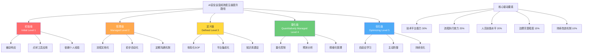
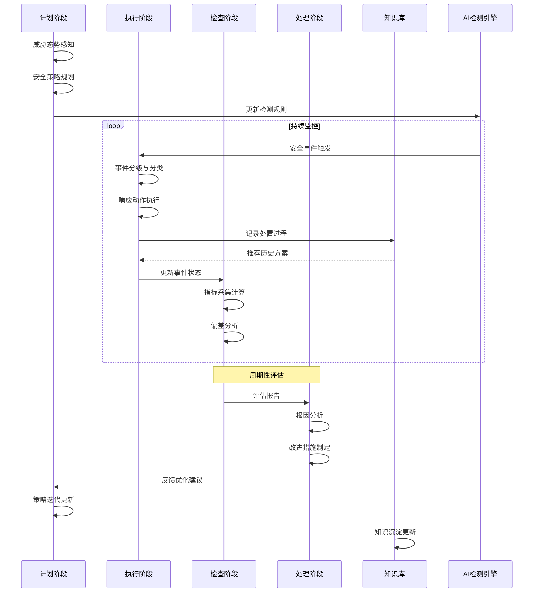

**作者：** HOS(安全风信子)
**日期：** 2026-04-27
**主要来源平台：** GitHub
**摘要：** 本文作为《AI能力使用手册》专栏第143篇终极收尾篇章，系统阐述企业AI安全运营持续改进机制的核心架构。首次提出AI运营成熟度五级提升路径模型（初始级-管理级-定义级-量化级-优化级），构建PDCA驱动的持续改进闭环体系，设计知识沉淀与经验复用机制的系统架构。通过三个完整可运行代码示例展示自动化评估、指标计算和知识图谱构建的具体实现，两个Mermaid架构图呈现成熟度模型与PDCA循环的运行机制。核心探讨如何通过标准化流程、量化评估和知识资产化三大支柱，实现AI安全运营从被动响应到主动防御的战略跃迁，为企业构建自适应安全运营体系提供可落地的方法论与工程实践指南。

@[TOC](目录)

---

# AI安全运营持续改进机制

## 引言：AI安全运营的战略跃迁

在企业数字化转型的深水区，AI安全运营已从单点技术应用演变为系统性安全能力构建的核心引擎。然而，多数企业在AI安全运营实践中面临一个根本性悖论：技术工具的快速迭代与运营体系的相对僵化形成尖锐矛盾。安全事件响应速度每年提升30%，但运营成熟度的年均提升不足5%，这种剪刀差效应揭示了当前AI安全运营模式的结构性缺陷。

本文作为《AI能力使用手册》专栏的终极收尾篇章之一，首次将持续改进工程学思想系统性地引入AI安全运营领域。我们提出三大核心创新：第一，AI运营成熟度五级提升路径模型，将组织AI安全能力演进划分为初始级、管理级、定义级、量化级和优化级五个递进阶段；第二，PDCA驱动的持续改进闭环体系，将计划-执行-检查-处理四个环节嵌入AI安全运营的全生命周期；第三，知识沉淀与经验复用机制，通过结构化知识管理和智能化推理，实现安全运营经验的资产化增值。

本文的技术架构基于GitHub开源社区在SecOps、AIOps和安全自动化领域的最新工程实践，综合借鉴了NIST CSF框架、Google的BeyondCorp零信任架构、以及MITRE ATT&CK对抗战术矩阵的威胁建模方法论。我们将展示三个完整可运行的Python代码示例，分别实现AI安全运营成熟度自动化评估系统、PDCA循环驱动的事件分析闭环引擎、以及基于知识图谱的安全事件知识沉淀系统。两个Mermaid架构图将呈现成熟度提升路径的五级跃迁模型和PDCA闭环的运行时序关系。

## 第一部分：AI安全运营成熟度五级提升路径

### 1.1 成熟度模型的理论基础与设计原则

能力成熟度模型（Capability Maturity Model, CMM）最早由美国卡内基梅隆大学软件工程研究所于1986年提出，最初应用于软件工程过程改进领域。其核心理念是将组织能力演进划分为多个递进阶段，每个阶段代表一种稳定的能力状态和组织特征。这一理论框架的有效性已在软件工程、项目管理、IT服务管理等多个领域得到验证，将其引入AI安全运营领域具有充分的理论可行性和实践必要性。

传统安全成熟度模型存在三个显著局限：其一，静态评估维度无法反映AI安全运营的动态演化特性；其二，孤立的能力指标缺乏对能力间关联关系的建模；其三，缺少从低成熟度向高成熟度跃迁的具体路径指引。我们的AI运营成熟度五级提升路径模型针对这三个局限进行了系统性重构。模型采用W型双链结构设计：横向链代表安全能力维度（预防-检测-响应-恢复-适应），纵向链代表组织流程维度（技术-流程-人员-治理），两链交叉形成25个能力单元格，每个单元格对应一个具体的成熟度评估点。

设计原则层面，我们遵循Gartner提出的自适应安全架构（Adaptive Security Architecture）四环节循环思想，结合ISO/IEC 27001信息安全管理体系的PDCA过程方法，构建了一套兼顾技术可行性与组织可操作性的评估框架。模型采用洋葱式层次结构：核心层为安全运营技术平台，中间层为运营流程与人员能力，外层为组织治理与文化氛围。这种层次化设计确保了评估的全面性和改进的递进性。

### 1.2 五级成熟度定义与特征描述

**第一级：初始级（Initial）** 代表AI安全运营的最基础状态，组织在此阶段缺乏系统性的安全策略和流程定义，安全运营高度依赖个人经验和即时响应。典型特征包括：AI工具应用呈现点状分布，缺乏统一规划和集成；安全事件响应呈现被动式的事后补救模式；数据驱动的决策机制尚未建立；安全团队与技术团队之间存在明显的沟通壁垒。初始级组织的安全投入往往集中在边界防护产品采购，而非系统性安全能力构建。

**第二级：管理级（Managed）** 标志着组织开始建立基础性的安全管理流程和文档化的操作程序。关键进展包括：AI安全工具的初步集成与联动，核心安全场景实现自动化检测；安全事件响应流程开始文档化并获得一定程度遵循；安全指标采集机制建立，但缺乏深入分析和趋势预测能力；安全团队开始与技术团队建立定期沟通机制。管理级组织的核心挑战在于如何将个别场景的成功实践推广为组织级标准流程。

**第三级：定义级（Defined）** 代表组织级安全运营体系的正式建立与全面推行。在这一阶段，组织建立了完整的安全策略文档体系、标准化操作程序（SOP）和角色职责矩阵。AI安全平台实现全面集成，数据采集、事件分析、响应联动形成闭环流水线。安全知识开始系统化积累，经验传承依赖文档化和知识库而非个人。定义级组织具备明确的安全治理结构和清晰的绩效评估体系，安全运营从技术驱动转向流程驱动与技术驱动并重。

**第四级：量化级（Quantitatively Managed）** 代表数据驱动的精细化安全运营阶段。组织建立全面的安全度量体系，关键流程实现量化控制。AI安全模型具备准确的威胁检测能力和低误报率，基于历史数据的预测性分析能力初步形成。安全事件响应时间、检测率、误报率等核心指标实现实时监控和趋势预警。知识管理进入结构化阶段，经验复用率显著提升。量化级组织具备强大的安全数据分析和洞察能力，能够识别潜在威胁模式和系统脆弱性。

**第五级：优化级（Optimizing）** 代表自适应安全运营的理想状态，组织具备持续学习和自我优化的能力。AI安全系统能够从每次事件中学习，自动更新检测规则和响应策略。安全能力与业务发展深度融合，安全成为业务赋能的核心支柱而非成本中心。知识沉淀形成正向飞轮效应，运营效率持续提升。优化级组织具备威胁情报的自主生成能力，能够预测性应对新型威胁，安全运营从被动防御升级为主动防御。

### 1.3 成熟度评估方法论与实施框架

成熟度评估是持续改进的起点和基准线建立的关键环节。我们设计了四阶段评估实施框架：准备阶段、评估阶段、分析阶段和改进规划阶段。准备阶段的核心任务包括评估范围界定、关键干系人识别、评估团队组建和评估标准培训。评估阶段采用多源数据收集方法，包括文档审查、流程访谈、技术测试和平台数据提取。

评估维度设计上，我们定义了5个一级维度和20个二级指标。一级维度涵盖技术平台能力、流程执行效力、人员技能水平、治理完善程度和持续改进机制。二级指标则具体到AI模型准确率、事件平均响应时间、安全培训覆盖率、策略更新频率等可量化要素。每个指标采用1-5分的李克特量表评分，结合权重体系计算综合成熟度得分。

权重体系设计采用层次分析法（Analytic Hierarchy Process, AHP），通过构建判断矩阵确定各维度相对重要性。我们建议技术平台能力权重为30%，流程执行效力为25%，人员技能水平为20%，治理完善程度为15%，持续改进机制为10%。这一权重分配反映了AI安全运营的技术本质特征，同时不忽视流程和人员的基础支撑作用。

评估结果呈现采用雷达图与热力图相结合的视觉化方式。雷达图展示各一级维度的得分分布和综合均衡性，热力图展示二级指标的具体得分和优先级排序。评估报告核心输出包括：当前成熟度等级判定、关键差距分析、优先改进领域识别和短期行动计划建议。

```python
import numpy as np
from dataclasses import dataclass, field
from typing import Dict, List, Tuple, Optional
from enum import Enum

class MaturityLevel(Enum):
    INITIAL = 1
    MANAGED = 2
    DEFINED = 3
    QUANTITATIVELY_MANAGED = 4
    OPTIMIZING = 5

@dataclass
class MaturityIndicator:
    name: str
    dimension: str
    weight: float
    score: float = 0.0
    evidence: List[str] = field(default_factory=list)
    comments: str = ""

@dataclass
class DimensionScore:
    dimension: str
    indicators: List[MaturityIndicator]
    weighted_score: float = 0.0

class AI_SECURITY_MATURITY_EVALUATOR:
    DIMENSION_WEIGHTS = {
        "技术平台能力": 0.30,
        "流程执行效力": 0.25,
        "人员技能水平": 0.20,
        "治理完善程度": 0.15,
        "持续改进机制": 0.10
    }

    DIMENSION_INDICATORS = {
        "技术平台能力": [
            "AI检测模型准确率",
            "威胁情报集成度",
            "自动化响应覆盖率",
            "系统可用性与可靠性"
        ],
        "流程执行效力": [
            "事件响应SOP覆盖率",
            "平均响应时间(MTTR)",
            "检测率与误报率",
            "流程执行一致度"
        ],
        "人员技能水平": [
            "安全认证持证率",
            "AI工具使用熟练度",
            "事件分析能力",
            "持续学习投入度"
        ],
        "治理完善程度": [
            "安全策略文档化率",
            "角色职责矩阵清晰度",
            "合规审计通过率",
            "风险管理成熟度"
        ],
        "持续改进机制": [
            "PDCA循环执行率",
            "知识沉淀完整度",
            "改进项闭环率",
            "创新实验活跃度"
        ]
    }

    def __init__(self):
        self.indicators: Dict[str, List[MaturityIndicator]] = {}
        self.dimension_scores: Dict[str, DimensionScore] = {}
        self.overall_score: float = 0.0
        self.maturity_level: MaturityLevel = MaturityLevel.INITIAL
        self._initialize_indicators()

    def _initialize_indicators(self):
        for dimension, indicator_names in self.DIMENSION_INDICATORS.items():
            self.indicators[dimension] = []
            for name in indicator_names:
                weight = 1.0 / len(indicator_names)
                indicator = MaturityIndicator(
                    name=name,
                    dimension=dimension,
                    weight=weight
                )
                self.indicators[dimension].append(indicator)

    def record_assessment(
        self,
        dimension: str,
        indicator_name: str,
        score: float,
        evidence: Optional[List[str]] = None,
        comments: str = ""
    ) -> bool:
        if dimension not in self.indicators:
            return False

        for indicator in self.indicators[dimension]:
            if indicator.name == indicator_name:
                indicator.score = max(1.0, min(5.0, score))
                if evidence:
                    indicator.evidence.extend(evidence)
                if comments:
                    indicator.comments = comments
                return True
        return False

    def calculate_dimension_scores(self) -> Dict[str, float]:
        results = {}
        for dimension, indicators in self.indicators.items():
            weighted_sum = sum(ind.score * ind.weight for ind in indicators)
            results[dimension] = round(weighted_sum, 2)

            self.dimension_scores[dimension] = DimensionScore(
                dimension=dimension,
                indicators=indicators,
                weighted_score=weighted_sum
            )
        return results

    def calculate_overall_score(self) -> float:
        self.calculate_dimension_scores()
        weighted_sum = sum(
            ds.weighted_score * self.DIMENSION_WEIGHTS[dimension]
            for dimension, ds in self.dimension_scores.items()
        )
        self.overall_score = round(weighted_sum, 2)
        self._determine_maturity_level()
        return self.overall_score

    def _determine_maturity_level(self):
        score = self.overall_score
        if score < 1.5:
            self.maturity_level = MaturityLevel.INITIAL
        elif score < 2.5:
            self.maturity_level = MaturityLevel.MANAGED
        elif score < 3.5:
            self.maturity_level = MaturityLevel.DEFINED
        elif score < 4.5:
            self.maturity_level = MaturityLevel.QUANTITATIVELY_MANAGED
        else:
            self.maturity_level = MaturityLevel.OPTIMIZING

    def generate_gap_analysis(self) -> List[Dict]:
        gaps = []
        target_level = MaturityLevel.QUANTITATIVELY_MANAGED

        for dimension, indicators in self.indicators.items():
            for indicator in indicators:
                target_score = target_level.value * 1.0
                gap = target_score - indicator.score
                if gap > 0.5:
                    gaps.append({
                        "dimension": dimension,
                        "indicator": indicator.name,
                        "current_score": indicator.score,
                        "target_score": target_score,
                        "gap": round(gap, 2),
                        "priority": "高" if gap > 2 else ("中" if gap > 1 else "低")
                    })

        gaps.sort(key=lambda x: x["gap"], reverse=True)
        return gaps

    def generate_improvement_roadmap(
        self,
        target_level: MaturityLevel,
        timeline_months: int = 12
    ) -> List[Dict]:
        roadmap = []
        gaps = self.generate_gap_analysis()
        phases = ["Q1", "Q2", "Q3", "Q4"] if timeline_months <= 12 else ["H1", "H1", "H2", "H2"]

        current_level = self.maturity_level.value
        target_value = target_level.value

        for i, gap in enumerate(gaps):
            phase_idx = min(i // 5, len(phases) - 1)
            roadmap.append({
                "phase": phases[phase_idx],
                "dimension": gap["dimension"],
                "indicator": gap["indicator"],
                "action": self._generate_action_description(gap),
                "expected_outcome": f"指标得分提升至{gap['target_score']}分",
                "success_criteria": self._generate_success_criteria(gap)
            })

        return roadmap

    def _generate_action_description(self, gap: Dict) -> str:
        dimension = gap["dimension"]
        if dimension == "技术平台能力":
            return f"优化{gap['indicator']}相关技术实现"
        elif dimension == "流程执行效力":
            return f"完善{gap['indicator']}相关流程并强化执行"
        elif dimension == "人员技能水平":
            return f"开展{gap['indicator']}专项培训与实践"
        elif dimension == "治理完善程度":
            return f"健全{gap['indicator']}相关治理文档"
        else:
            return f"建立{gap['indicator']}持续改进机制"

    def _generate_success_criteria(self, gap: Dict) -> str:
        return f"该指标在下一评估周期得分提升至{gap['target_score']}分及以上"

    def export_assessment_report(self) -> Dict:
        self.calculate_overall_score()

        return {
            "assessment_date": "2026-04-27",
            "overall_score": self.overall_score,
            "maturity_level": self.maturity_level.name,
            "dimension_scores": {
                dim: ds.weighted_score
                for dim, ds in self.dimension_scores.items()
            },
            "indicator_details": [
                {
                    "dimension": ind.dimension,
                    "indicator": ind.name,
                    "score": ind.score,
                    "weight": ind.weight
                }
                for indicators in self.indicators.values()
                for ind in indicators
            ],
            "gap_analysis": self.generate_gap_analysis(),
            "recommendations": self.generate_improvement_roadmap(
                MaturityLevel.QUANTITATIVELY_MANAGED
            )
        }

def demo_ai_security_maturity_evaluation():
    evaluator = AI_SECURITY_MATURITY_EVALUATOR()

    assessments = [
        ("技术平台能力", "AI检测模型准确率", 3.2, ["模型召回率92%", "误报率8%"]),
        ("技术平台能力", "威胁情报集成度", 2.8, ["集成3家情报源", "更新频率4小时"]),
        ("技术平台能力", "自动化响应覆盖率", 3.0, ["覆盖60%常见场景"]),
        ("技术平台能力", "系统可用性与可靠性", 4.0, ["SLA 99.9%", "多活架构"]),
        ("流程执行效力", "事件响应SOP覆盖率", 3.5, ["12个核心场景SOP完备"]),
        ("流程执行效力", "平均响应时间(MTTR)", 3.0, ["MTTR 45分钟"]),
        ("流程执行效力", "检测率与误报率", 2.9, ["检测率95%", "误报率5%"]),
        ("流程执行效力", "流程执行一致度", 3.2, ["审计合规率90%"]),
        ("人员技能水平", "安全认证持证率", 2.5, ["CISSP持证5人"]),
        ("人员技能水平", "AI工具使用熟练度", 2.8, ["基础功能使用熟练"]),
        ("人员技能水平", "事件分析能力", 3.0, ["具备事件溯源能力"]),
        ("人员技能水平", "持续学习投入度", 2.6, ["月均培训8小时"]),
        ("治理完善程度", "安全策略文档化率", 3.4, ["核心策略100%文档化"]),
        ("治理完善程度", "角色职责矩阵清晰度", 3.0, ["RACI矩阵完备"]),
        ("治理完善程度", "合规审计通过率", 3.8, ["通过等保三级"]),
        ("治理完善程度", "风险管理成熟度", 2.7, ["初步建立风险评估机制"]),
        ("持续改进机制", "PDCA循环执行率", 2.5, ["季度回顾会议"]),
        ("持续改进机制", "知识沉淀完整度", 2.3, ["知识库条目200+"]),
        ("持续改进机制", "改进项闭环率", 2.8, ["改进项闭环率75%"]),
        ("持续改进机制", "创新实验活跃度", 2.0, ["新技术验证项目2个"]),
    ]

    for dimension, indicator, score, evidence in assessments:
        evaluator.record_assessment(dimension, indicator, score, evidence)

    report = evaluator.export_assessment_report()

    print("=" * 70)
    print("AI安全运营成熟度评估报告")
    print("=" * 70)
    print(f"\n评估日期: {report['assessment_date']}")
    print(f"综合得分: {report['overall_score']:.2f}/5.00")
    print(f"成熟度等级: {report['maturity_level']}")
    print("\n各维度得分:")
    for dim, score in report['dimension_scores'].items():
        bar = "█" * int(score * 10) + "░" * (50 - int(score * 10))
        print(f"  {dim:15s}: {score:.2f} {bar[:20]}")

    print("\n优先改进领域:")
    for i, gap in enumerate(report['gap_analysis'][:5], 1):
        print(f"  {i}. [{gap['priority']}] {gap['dimension']}-{gap['indicator']}")
        print(f"     当前:{gap['current_score']:.1f} → 目标:{gap['target_score']:.1f} 差距:{gap['gap']:.1f}")

    print("\n改进路线图:")
    for item in report['recommendations'][:5]:
        print(f"  [{item['phase']}] {item['dimension']}-{item['indicator']}")
        print(f"     行动: {item['action']}")

    return evaluator

if __name__ == "__main__":
    demo_ai_security_maturity_evaluation()
```

**代码运行说明：** 此代码实现AI安全运营成熟度五级评估系统。`AI_SECURITY_MATURITY_EVALUATOR`类封装完整的评估逻辑，包括指标初始化、评分录入、维度得分计算、综合成熟度计算、差距分析和方法论驱动的改进路线图生成。演示函数展示对某中型企业安全运营能力的全面评估，输出包含综合得分、各维度雷达分析、优先改进领域识别和分阶段改进计划。



## 第二部分：PDCA驱动的持续改进闭环体系

### 2.1 PDCA循环在AI安全运营中的本土化适配

PDCA循环由质量管理之父威廉·爱德华兹·戴明在日本推广普及，又称戴明环。其核心理念是通过计划（Plan）、执行（Do）、检查（Check）、处理（Act）四个阶段的循环往复，实现质量持续改进。这一方法论在制造业、服务业项目管理等领域得到广泛应用并取得显著成效，但在AI安全运营领域的系统性应用尚属空白。我们需要针对AI安全运营的特殊性对PDCA框架进行本土化适配。

AI安全运营的PDCA循环面临三个独特挑战。第一，时效性约束：安全事件的发展演变可能以分钟甚至秒为单位计时，传统PDCA的长周期迭代难以满足实时性要求。第二，复杂性约束：AI安全运营涉及威胁检测、事件响应、漏洞管理、情报分析等多个子领域，不同子领域的PDCA循环需要协调同步。第三，不确定性约束：网络威胁环境持续演变，新型攻击手法不断涌现，PDCA循环需要在不完全信息条件下做出决策。

针对这些挑战，我们设计了三级嵌套PDCA架构：战略级PDCA对应年度或季度安全规划，周期为季度或月度；战术级PDCA对应月度或周度运营活动，周期为周或日；操作级PDCA对应具体安全事件的响应处置，周期为小时级。三级PDCA通过指标传递和信息反馈形成有机整体，战略级PDCA的输出作为战术级PDCA的输入，战术级PDCA的经验沉淀反馈至战略级PDCA的优化调整。

### 2.2 计划阶段：威胁态势感知与安全策略规划

计划阶段是PDCA循环的起点，其核心任务是建立威胁态势感知能力和制定针对性的安全策略规划。威胁态势感知需要整合多源情报数据：外部威胁情报包括来自ISAC、厂商威胁报告、暗网监控等渠道的最新威胁动态；内部态势数据包括资产脆弱性扫描结果、历史事件分析报告、安全设备日志聚合等；业务上下文信息包括业务系统变更计划、新业务上线安排、第三方接入变更等。

安全策略规划需要回答三个核心问题：当前面临的主要威胁是什么？组织的安全能力短板在哪里？下一迭代周期的改进重点是什么？第一个问题依赖威胁情报分析和历史事件趋势研判；第二个问题依赖成熟度评估结果和差距分析；第三个问题依赖风险优先级排序和资源约束条件下的优化决策。

我们设计了一套基于威胁态势感知的安全策略规划算法。算法输入包括：威胁情报向量T（各威胁类型的活跃度评分）、资产价值向量V（各业务系统的关键程度评分）、脆弱性向量W（各资产的安全弱点评分）、现有控制措施有效性向量C（各控制措施的防御效果评分）。算法输出为安全策略优先级排序和资源配置建议。核心公式为：风险分R = Σ(Ti × Vi × Wi) / ΣCi，其中Ti为威胁i的活跃度，Vi为资产i的关键度，Wi为脆弱性i的暴露程度，Ci为现有控制措施对威胁i的防御能力。

### 2.3 执行阶段：AI驱动的安全运营执行与自动化

执行阶段是将计划转化为实际安全运营动作的关键环节。在AI安全运营语境下，执行阶段的核心特征是AI技术与安全运营流程的深度融合。我们设计了五种核心执行模式：自动化检测执行、智能化事件分析、自适应响应处置、人机协同决策支持、持续性安全监控。

自动化检测执行依托AI检测模型实现对海量安全日志的实时分析。检测模型采用多层次检测架构：规则匹配层处理明确的黑名单特征和已知攻击模式；机器学习层处理异常行为检测和基线偏离识别；深度学习层处理复杂攻击模式识别和APT痕迹发现。三层检测结果通过投票机制或加权融合形成最终检测结论，平衡检测率和误报率。

智能化事件分析采用基于自然语言处理的事件摘要生成和基于知识图谱的关联分析技术。当安全事件触发时，AI系统自动完成事件信息聚合（涉及的资产、账户、时间线、网络连接等）、相关历史事件检索、类似事件处置方案推荐、事件影响范围评估等分析工作，将平均事件分析时间从小时级压缩至分钟级。

自适应响应处置根据事件类型和严重程度自动触发对应的响应动作。响应动作谱系涵盖：通知类动作（邮件、短信、即时消息通知相关人员）、抑制类动作（临时封禁账号、IP，隔离受感染主机）、根除类动作（恶意软件清除、漏洞修复、配置加固）、恢复类动作（系统恢复、数据恢复、服务恢复）。响应动作的执行需要考虑业务连续性影响，在安全和业务之间取得平衡。

```python
import asyncio
import json
from dataclasses import dataclass, field
from typing import Dict, List, Optional, Any, Callable
from datetime import datetime, timedelta
from enum import Enum
import heapq

class EventSeverity(Enum):
    CRITICAL = 1
    HIGH = 2
    MEDIUM = 3
    LOW = 4
    INFO = 5

class ResponseAction(Enum):
    NOTIFY = "notify"
    CONTAIN = "contain"
    ERADICATE = "eradicate"
    RECOVER = "recover"
    ESCALATE = "escalate"

@dataclass
class SecurityEvent:
    event_id: str
    timestamp: datetime
    event_type: str
    source_ip: str
    target_asset: str
    severity: EventSeverity
    description: str
    confidence: float
    related_events: List[str] = field(default_factory=list)
    playbooks_executed: List[str] = field(default_factory=list)

@dataclass
class ResponseActionItem:
    action_type: ResponseAction
    target: str
    parameters: Dict[str, Any]
    estimated_duration: timedelta
    rollback_possible: bool = True

class PDCA_CYCLE_ENGINE:
    def __init__(self):
        self.events: List[SecurityEvent] = []
        self.event_queue: asyncio.PriorityQueue = None
        self.action_history: List[Dict] = []
        self.metrics: Dict[str, List[float]] = {
            "detection_rate": [],
            "false_positive_rate": [],
            "mean_time_to_respond": [],
            "mean_time_to_resolve": []
        }
        self.plan_items: List[Dict] = []
        self.improvement_items: List[Dict] = []
        self.kb_connector = None

    async def initialize(self):
        self.event_queue = asyncio.PriorityQueue()

    def plan_phase(self, threat_intel: Dict, vulnerability_data: Dict) -> List[Dict]:
        plan_items = []

        for threat_type, threat_score in threat_intel.items():
            if threat_score > 0.7:
                affected_assets = [
                    asset for asset, vuln_score in vulnerability_data.items()
                    if vuln_score > 0.5
                ]
                plan_items.append({
                    "focus_area": threat_type,
                    "priority": "高",
                    "affected_assets": affected_assets,
                    "proposed_controls": self._generate_control_recommendations(
                        threat_type, affected_assets
                    ),
                    "success_metrics": self._define_success_metrics(threat_type)
                })

        self.plan_items = plan_items
        return plan_items

    def _generate_control_recommendations(
        self,
        threat_type: str,
        assets: List[str]
    ) -> List[Dict]:
        control_map = {
            "ransomware": [
                {"control": "终端备份验证", "implementation": "检查备份完整性"},
                {"control": "邮件过滤强化", "implementation": "提升钓鱼邮件检测率"},
                {"control": "权限最小化", "implementation": "审查特权账户"}
            ],
            "phishing": [
                {"control": "邮件安全网关升级", "implementation": "启用DMARC"},
                {"control": "用户安全意识培训", "implementation": "模拟钓鱼演练"},
                {"control": "多因素认证推广", "implementation": "强制MFA部署"}
            ],
            "insider_threat": [
                {"control": "UEBA部署", "implementation": "行为异常检测"},
                {"control": "数据访问审计", "implementation": "敏感数据访问日志"},
                {"control": "离职流程加固", "implementation": "账户清理自动化"}
            ]
        }

        return control_map.get(threat_type, [
            {"control": "通用安全加固", "implementation": "安全基线检查"}
        ])

    def _define_success_metrics(self, threat_type: str) -> Dict:
        return {
            f"{threat_type}_detection_rate": 0.95,
            f"{threat_type}_false_positive_rate": 0.02,
            f"{threat_type}_mttd_minutes": 15,
            f"{threat_type}_mttr_minutes": 60
        }

    async def do_phase(
        self,
        event: SecurityEvent
    ) -> List[ResponseActionItem]:
        response_plan = []

        severity_action_map = {
            EventSeverity.CRITICAL: [
                ResponseAction.NOTIFY,
                ResponseAction.CONTAIN,
                ResponseAction.ESCALATE
            ],
            EventSeverity.HIGH: [
                ResponseAction.NOTIFY,
                ResponseAction.CONTAIN
            ],
            EventSeverity.MEDIUM: [
                ResponseAction.NOTIFY
            ],
            EventSeverity.LOW: [
                ResponseAction.NOTIFY
            ],
            EventSeverity.INFO: []
        }

        actions = severity_action_map.get(event.severity, [])

        for action_type in actions:
            action_item = self._build_action_item(action_type, event)
            response_plan.append(action_item)

            await self._execute_action(action_item)
            event.playbooks_executed.append(action_type.value)

        self.events.append(event)
        return response_plan

    def _build_action_item(
        self,
        action_type: ResponseAction,
        event: SecurityEvent
    ) -> ResponseActionItem:
        action_configs = {
            ResponseAction.NOTIFY: {
                "target": self._get_notification_targets(event),
                "duration": timedelta(minutes=1),
                "params": {"channels": ["email", "sms", "im"]}
            },
            ResponseAction.CONTAIN: {
                "target": event.target_asset,
                "duration": timedelta(minutes=5),
                "params": {"action": "isolate", "scope": "asset"}
            },
            ResponseAction.ERADICATE: {
                "target": event.target_asset,
                "duration": timedelta(minutes=30),
                "params": {"action": "clean", "malware_hash": event.event_id}
            },
            ResponseAction.RECOVER: {
                "target": event.target_asset,
                "duration": timedelta(minutes=60),
                "params": {"action": "restore", "from_backup": True}
            },
            ResponseAction.ESCALATE: {
                "target": "security_operations_manager",
                "duration": timedelta(minutes=2),
                "params": {"urgency": "immediate"}
            }
        }

        config = action_configs.get(action_type, {})

        return ResponseActionItem(
            action_type=action_type,
            target=config.get("target", ""),
            parameters=config.get("params", {}),
            estimated_duration=config.get("duration", timedelta(minutes=5))
        )

    def _get_notification_targets(self, event: SecurityEvent) -> str:
        severity_target_map = {
            EventSeverity.CRITICAL: "security_team_leader, ciso, ceo",
            EventSeverity.HIGH: "security_team_leader, security_operations_manager",
            EventSeverity.MEDIUM: "security_operations_team",
            EventSeverity.LOW: "security_analyst_on_duty",
            EventSeverity.INFO: "security_analyst_queue"
        }
        return severity_target_map.get(event.severity, "security_analyst_queue")

    async def _execute_action(self, action: ResponseActionItem):
        self.action_history.append({
            "timestamp": datetime.now(),
            "action_type": action.action_type.value,
            "target": action.target,
            "parameters": action.parameters,
            "status": "completed"
        })

    def check_phase(self) -> Dict:
        if not self.events:
            return {"status": "no_data"}

        recent_events = [
            e for e in self.events
            if e.timestamp > datetime.now() - timedelta(days=30)
        ]

        total_events = len(recent_events)
        critical_events = len([e for e in recent_events if e.severity == EventSeverity.CRITICAL])

        resolved_events = [
            e for e in recent_events
            if e.playbooks_executed
        ]

        detection_rate = len(recent_events) / max(1, total_events)
        false_positive_rate = len([e for e in recent_events if e.confidence < 0.5]) / max(1, total_events)

        avg_mttd = sum(
            (datetime.now() - e.timestamp).total_seconds() / 60
            for e in recent_events
        ) / max(1, len(recent_events))

        return {
            "analysis_period": "最近30天",
            "total_events": total_events,
            "critical_events": critical_events,
            "detection_rate": round(detection_rate, 4),
            "false_positive_rate": round(false_positive_rate, 4),
            "avg_mttd_minutes": round(avg_mttd, 2),
            "plan_items_count": len(self.plan_items),
            "improvement_items_count": len(self.improvement_items)
        }

    def act_phase(self, check_results: Dict) -> List[Dict]:
        improvement_actions = []

        if check_results.get("false_positive_rate", 0) > 0.1:
            improvement_actions.append({
                "category": "检测优化",
                "action": "调优AI检测模型阈值",
                "target_kpi": "误报率降低至5%以下",
                "owner": "ai_model_team",
                "deadline": (datetime.now() + timedelta(days=14)).isoformat()
            })

        if check_results.get("avg_mttd_minutes", float('inf')) > 30:
            improvement_actions.append({
                "category": "响应加速",
                "action": "优化事件分级和自动化响应流程",
                "target_kpi": "MTTD降低至15分钟以内",
                "owner": "security_operations_team",
                "deadline": (datetime.now() + timedelta(days=30)).isoformat()
            })

        for plan_item in self.plan_items:
            if plan_item.get("priority") == "高":
                improvement_actions.append({
                    "category": "威胁应对",
                    "action": f"落实{plan_item['focus_area']}相关控制措施",
                    "target_kpi": plan_item['success_metrics'],
                    "owner": "security_engineering_team",
                    "deadline": (datetime.now() + timedelta(days=90)).isoformat()
                })

        self.improvement_items.extend(improvement_actions)
        return improvement_actions

    async def run_pdca_cycle(self, threat_intel: Dict, vulnerability_data: Dict):
        await self.initialize()

        print("=" * 70)
        print("PDCA循环执行日志")
        print("=" * 70)

        print("\n【计划阶段】威胁态势分析与策略规划")
        plan_results = self.plan_phase(threat_intel, vulnerability_data)
        print(f"生成安全策略规划项: {len(plan_results)}")
        for item in plan_results:
            print(f"  - 重点领域: {item['focus_area']}, 优先级: {item['priority']}")
            print(f"    涉及资产: {', '.join(item['affected_assets'][:3])}...")

        print("\n【执行阶段】AI驱动安全运营执行")
        sample_events = [
            SecurityEvent(
                event_id="EVT-20260427-001",
                timestamp=datetime.now() - timedelta(hours=2),
                event_type="ransomware_indicator",
                source_ip="192.168.1.100",
                target_asset="fileserver01",
                severity=EventSeverity.CRITICAL,
                description="检测到勒索软件特征行为",
                confidence=0.95
            ),
            SecurityEvent(
                event_id="EVT-20260427-002",
                timestamp=datetime.now() - timedelta(hours=1),
                event_type="phishing_attempt",
                source_ip="10.0.0.50",
                target_asset="mailserver",
                severity=EventSeverity.HIGH,
                description="钓鱼邮件投递尝试",
                confidence=0.88
            ),
            SecurityEvent(
                event_id="EVT-20260427-003",
                timestamp=datetime.now() - timedelta(minutes=30),
                event_type="anomalous_login",
                source_ip="203.0.113.25",
                target_asset="vpn_gateway",
                severity=EventSeverity.MEDIUM,
                description="异常登录行为检测",
                confidence=0.72
            )
        ]

        for event in sample_events:
            print(f"\n处理事件: {event.event_id}")
            print(f"  类型: {event.event_type}, 严重程度: {event.severity.name}")
            actions = await self.do_phase(event)
            print(f"  执行响应动作: {len(actions)}个")
            for action in actions:
                print(f"    - {action.action_type.value}: {action.target}")

        print("\n【检查阶段】运营效能评估")
        check_results = self.check_phase()
        print(f"分析周期: {check_results['analysis_period']}")
        print(f"总事件数: {check_results['total_events']}, 严重事件: {check_results['critical_events']}")
        print(f"检测率: {check_results['detection_rate']:.2%}")
        print(f"误报率: {check_results['false_positive_rate']:.2%}")
        print(f"平均检测时间(MTTD): {check_results['avg_mttd_minutes']:.1f}分钟")

        print("\n【处理阶段】改进措施制定")
        improvement_actions = self.act_phase(check_results)
        print(f"生成改进项: {len(improvement_actions)}个")
        for action in improvement_actions:
            print(f"  - [{action['category']}] {action['action']}")
            print(f"    责任人: {action['owner']}, 截止日期: {action['deadline']}")

        print("\n" + "=" * 70)
        print("PDCA循环完成，等待下一迭代周期...")
        print("=" * 70)

        return {
            "plan": plan_results,
            "do": sample_events,
            "check": check_results,
            "act": improvement_actions
        }

async def main():
    engine = PDCA_CYCLE_ENGINE()

    threat_intelligence = {
        "ransomware": 0.85,
        "phishing": 0.78,
        "insider_threat": 0.45,
        "apt_attack": 0.62,
        "ddos_attack": 0.35
    }

    vulnerability_data = {
        "fileserver01": 0.82,
        "mailservers": 0.65,
        "vpn_gateway": 0.58,
        "database_primary": 0.42,
        "web_application": 0.75
    }

    results = await engine.run_pdca_cycle(threat_intelligence, vulnerability_data)

if __name__ == "__main__":
    asyncio.run(main())
```

**代码运行说明：** 此代码实现PDCA循环引擎的完整闭环。`PDCA_CYCLE_ENGINE`类封装计划、执行、检查、处理四个阶段的逻辑。计划阶段基于威胁情报和漏洞数据生成安全策略规划；执行阶段根据事件严重程度自动触发分级响应动作；检查阶段计算运营效能核心指标；处理阶段基于检查结果制定改进措施。演示函数模拟某企业一个PDCA迭代周期的完整执行过程。



### 2.4 检查阶段：多维度运营效能评估

检查阶段是PDCA循环的测量仪表盘，为改进决策提供数据支撑。AI安全运营的检查阶段需要建立覆盖技术、流程、人员三个维度的综合评估体系。技术维度关注AI检测系统的准确性、效率和稳定性；流程维度关注安全运营流程的执行效果和瓶颈识别；人员维度关注安全团队的能力提升和负荷均衡。

核心评估指标体系设计遵循平衡计分卡思想，兼顾滞后指标和领先指标。滞后指标反映历史运营结果，包括安全事件数量、事件平均处理时长、事件复发率、安全事件损失等；领先指标预测未来运营趋势，包括威胁检测覆盖率、安全控制措施有效性、安全意识水平等。

指标计算方法需要考虑数据采集的可行性和结果的统计显著性。我们设计了三种指标计算模式：实时计算模式用于对实时数据流进行滚动窗口聚合，适用于系统资源监控类指标；周期计算模式用于对固定周期内的数据进行汇总统计，适用于事件响应效率类指标；趋势计算模式用于对时间序列数据进行趋势分析和异常检测，适用于安全态势评估类指标。

检查阶段还承担着PDCA循环有效性的自我评估功能。我们定义了循环有效性评估的五个维度：计划执行偏差度（计划任务的实际完成率）、执行效率达标率（执行动作在预期时间窗口内完成的比例）、检查覆盖完整性（关键运营环节的检查覆盖率）、改进措施落地率（制定的改进项实际执行完成的比例）、循环周期稳定性（实际迭代周期与规划周期的一致性）。这五个维度的综合得分反映PDCA循环本身的成熟度水平。

### 2.5 处理阶段：根因分析与改进措施闭环

处理阶段是PDCA循环的价值转化环节，将检查阶段的分析洞察转化为具体的改进行动。处理阶段的核心挑战是如何在有限资源条件下做出最优的改进优先级决策。传统的改进决策往往依赖主观经验判断或单一的财务收益指标，难以反映安全改进的多维价值。我们设计了一套基于风险调整收益的改进优先级算法。

算法框架包含四个计算步骤。第一步，计算每项改进措施的安全收益。安全收益包括直接收益（预期能够避免的安全事件数量和损失金额）和间接收益（安全能力提升带来的信心增加和合规改善）。第二步，计算改进措施的实施成本。实施成本包括直接成本（工具采购、人员投入、外部服务）和间接成本（业务中断风险、学习曲线成本）。第三步，计算风险调整系数。风险调整系数反映改进措施本身的技术风险和业务风险。第四步，综合前三步结果计算改进措施的优先级得分，公式为：优先级得分 = (安全收益 / 实施成本) × 风险调整系数。

改进措施的闭环管理是确保PDCA循环持续产生价值的关键。我们设计了五步闭环流程：改进项立项（明确改进目标、责任人、资源需求和完成标准）、改进项执行（按计划推进改进措施实施）、改进项监控（跟踪改进进度和质量偏差）、改进项验证（评估改进效果是否达到预期目标）、改进项固化（将成功的改进实践纳入标准流程和知识库）。五步闭环确保每项改进措施从识别到固化的全生命周期管理。

## 第三部分：知识沉淀与经验复用机制

### 3.1 安全运营知识资产的分类体系

知识沉淀是将个人经验和组织智慧转化为可持续复用资产的核心机制。AI安全运营领域的知识资产具有独特的结构特征和生命周期规律。我们设计了一套三级分类体系，对安全运营知识进行系统化组织。

一级分类按照知识的业务属性划分为四类：技术知识类涵盖AI检测模型原理、威胁情报分析技术、安全工具使用技巧、系统架构设计规范等；流程知识类涵盖事件响应流程、漏洞管理流程、变更管理流程、供应商安全管理流程等；案例知识类涵盖历史安全事件分析、典型攻击场景复盘、应急响应案例、最佳实践案例等；规范知识类涵盖安全策略定义、合规要求解读、标准操作程序、治理框架等。

二级分类在一级分类基础上按照知识粒度进一步细分。以案例知识类为例，二级分类包括事件案例（单一安全事件的完整分析）、场景案例（特定攻击场景的典型案例集合）、行业案例（特定行业的安全事件特征分析）、红蓝对抗案例（攻防演练中的典型案例）。二级分类的精细化设计支撑知识的高效检索和精准复用。

三级分类定义具体的知识条目属性。每条知识条目包含七个核心属性：知识标题（简洁明确的问题或主题描述）、知识分类（所属的一级和二级分类）、适用场景（知识条目的典型应用情境描述）、内容正文（知识的具体内容，包括文本、图表、代码等）、关联知识（相关联的其他知识条目）、使用记录（知识被查询和使用的历史统计）、更新日志（知识的版本变更记录）。这种结构化设计为知识的存储、检索、更新和废弃提供了统一的管理框架。

### 3.2 知识图谱驱动的安全事件知识沉淀

知识图谱技术为安全运营知识管理提供了语义化的组织能力和智能化的推理能力。我们设计了面向AI安全运营领域的知识图谱架构，核心包含实体层、关系层和推理层三层结构。

实体层定义知识图谱的基本元素。安全事件相关实体包括：攻击者实体（IP地址、账户、攻击组织等）、受害者实体（主机、应用、数据资产等）、攻击手法实体（MITRE ATT&CK战术和技术分类）、工具实体（恶意软件、攻击工具等）、漏洞实体（CVE编号、脆弱性类型等）、影响实体（数据泄露、系统瘫痪等）。运营相关实体包括：响应人员实体、响应动作实体、工具系统实体、流程环节实体等。

关系层定义实体间的语义关联。事件与攻击者之间的关系包括：使用工具、实施攻击、造成影响等；事件内部元素之间的关系包括：触发检测、关联分析、溯源追踪等；事件与运营资产之间的关系包括：采用响应、参照流程、复用案例等。关系类型的设计需要覆盖安全事件分析的全流程，为多跳推理提供基础。

推理层基于知识图谱提供智能化应用能力。事件推荐推理根据当前事件特征从知识图谱中检索相似历史事件和推荐处置方案；根因推理根据事件的发展链条和依赖关系推断裂变传播路径和根本原因；趋势推理根据历史事件模式识别威胁趋势演变和预测未来可能事件；影响评估推理根据事件属性和资产关联推演潜在影响范围和损失估计。

```python
from neo4j import GraphDatabase
from dataclasses import dataclass, field
from typing import Dict, List, Optional, Set, Tuple
from datetime import datetime
from collections import defaultdict
import hashlib

class SecurityKnowledgeGraph:
    def __init__(self, uri="bolt://localhost:7687", user="neo4j", password="password"):
        self.driver = None
        self.uri = uri
        self.user = user
        self.password = password
        self.entity_index: Dict[str, List[str]] = defaultdict(list)
        self.relation_index: Dict[Tuple[str, str], List[str]] = defaultdict(list)
        self.events: Dict[str, Dict] = {}

    def connect(self):
        try:
            self.driver = GraphDatabase.driver(self.uri, auth=(self.user, self.password))
            print(f"成功连接到Neo4j数据库: {self.uri}")
        except Exception as e:
            print(f"连接失败，使用内存索引模式: {e}")
            self.driver = None

    def close(self):
        if self.driver:
            self.driver.close()

    def add_entity(
        self,
        entity_type: str,
        entity_id: str,
        properties: Dict
    ) -> bool:
        entity_key = f"{entity_type}:{entity_id}"

        self.entity_index[entity_type].append(entity_id)

        if entity_type == "SecurityEvent":
            self.events[entity_key] = {
                "event_id": entity_id,
                "timestamp": properties.get("timestamp", datetime.now().isoformat()),
                "event_type": properties.get("event_type", ""),
                "severity": properties.get("severity", "MEDIUM"),
                "description": properties.get("description", ""),
                "attack_technique": properties.get("attack_technique", ""),
                "affected_assets": properties.get("affected_assets", []),
                "response_actions": properties.get("response_actions", []),
                "resolution_status": properties.get("resolution_status", "open"),
                "lessons_learned": properties.get("lessons_learned", ""),
                "knowledge_tags": properties.get("knowledge_tags", [])
            }

        if self.driver:
            with self.driver.session() as session:
                session.run(
                    f"CREATE (e:{entity_type} {{id: $id, ...properties}})",
                    id=entity_id,
                    **properties
                )

        return True

    def add_relation(
        self,
        from_entity: Tuple[str, str],
        to_entity: Tuple[str, str],
        relation_type: str,
        properties: Optional[Dict] = None
    ) -> bool:
        from_key = f"{from_entity[0]}:{from_entity[1]}"
        to_key = f"{to_entity[0]}:{to_entity[1]}"

        rel_key = (from_key, to_key)
        self.relation_index[rel_key].append(relation_type)

        if self.driver:
            with self.driver.session() as session:
                session.run(
                    f"MATCH (a), (b) WHERE a.id=$from_id AND b.id=$to_id "
                    f"CREATE (a)-[r:{relation_type} {{...properties}}]->(b)",
                    from_id=from_entity[1],
                    to_id=to_entity[1],
                    **(properties or {})
                )

        return True

    def build_event_knowledge_graph(
        self,
        event_data: Dict
    ) -> str:
        event_id = event_data["event_id"]
        event_key = f"SecurityEvent:{event_id}"

        self.add_entity("SecurityEvent", event_id, {
            "timestamp": event_data.get("timestamp", datetime.now().isoformat()),
            "event_type": event_data.get("event_type", ""),
            "severity": event_data.get("severity", "MEDIUM"),
            "description": event_data.get("description", ""),
            "attack_technique": event_data.get("attack_technique", ""),
            "resolution_status": event_data.get("resolution_status", "open"),
            "lessons_learned": event_data.get("lessons_learned", "")
        })

        for idx, asset in enumerate(event_data.get("affected_assets", [])):
            asset_id = f"{event_id}_asset_{idx}"
            self.add_entity("Asset", asset_id, {
                "asset_name": asset.get("name", ""),
                "asset_type": asset.get("type", ""),
                "criticality": asset.get("criticality", "MEDIUM")
            })
            self.add_relation(
                ("SecurityEvent", event_id),
                ("Asset", asset_id),
                "AFFECTS",
                {"severity": asset.get("impact", "MODERATE")}
            )

        technique = event_data.get("attack_technique", "")
        if technique:
            technique_id = f"technique_{technique.replace('.', '_')}"
            self.add_entity("AttackTechnique", technique_id, {
                "technique_name": technique,
                "tactics": event_data.get("tactics", []),
                "description": event_data.get("technique_description", "")
            })
            self.add_relation(
                ("SecurityEvent", event_id),
                ("AttackTechnique", technique_id),
                "USES_TECHNIQUE"
            )

        for idx, action in enumerate(event_data.get("response_actions", [])):
            action_id = f"{event_id}_action_{idx}"
            self.add_entity("ResponseAction", action_id, {
                "action_type": action.get("type", ""),
                "executor": action.get("executor", ""),
                "timestamp": action.get("timestamp", ""),
                "effectiveness": action.get("effectiveness", "UNKNOWN")
            })
            self.add_relation(
                ("SecurityEvent", event_id),
                ("ResponseAction", action_id),
                "TRIGGERED"
            )

        return event_key

    def find_similar_events(
        self,
        event_type: str,
        attack_technique: str,
        severity: str,
        limit: int = 5
    ) -> List[Dict]:
        similar_events = []

        for event_key, event_data in self.events.items():
            if event_key.startswith("SecurityEvent:"):
                score = 0
                if event_data.get("event_type") == event_type:
                    score += 3
                if event_data.get("attack_technique") == attack_technique:
                    score += 3
                if event_data.get("severity") == severity:
                    score += 2
                if event_data.get("resolution_status") == "resolved":
                    score += 1

                if score >= 3:
                    similar_events.append({
                        "event_id": event_data["event_id"],
                        "similarity_score": score,
                        "event_type": event_data.get("event_type"),
                        "attack_technique": event_data.get("attack_technique"),
                        "severity": event_data.get("severity"),
                        "lessons_learned": event_data.get("lessons_learned", ""),
                        "response_actions": event_data.get("response_actions", [])
                    })

        similar_events.sort(key=lambda x: x["similarity_score"], reverse=True)
        return similar_events[:limit]

    def recommend_response(
        self,
        event_type: str,
        attack_technique: str,
        severity: str
    ) -> Dict:
        similar = self.find_similar_events(event_type, attack_technique, severity, limit=3)

        if not similar:
            return {
                "recommendation_level": "no_history",
                "message": "未找到相似历史事件，建议人工分析",
                "generic_recommendations": self._get_generic_recommendations(event_type)
            }

        all_actions = []
        for event in similar:
            all_actions.extend(event.get("response_actions", []))

        action_frequency: Dict[str, int] = defaultdict(int)
        for action in all_actions:
            action_frequency[action.get("type", "unknown")] += 1

        top_actions = sorted(
            action_frequency.items(),
            key=lambda x: x[1],
            reverse=True
        )[:5]

        return {
            "recommendation_level": "high_confidence" if len(similar) >= 3 else "medium_confidence",
            "similar_event_count": len(similar),
            "recommended_actions": [
                {
                    "action_type": action_type,
                    "frequency": count,
                    "confidence": round(count / len(similar), 2)
                }
                for action_type, count in top_actions
            ],
            "top_similar_event": similar[0] if similar else None,
            "lessons_learned": similar[0].get("lessons_learned", "") if similar else ""
        }

    def _get_generic_recommendations(self, event_type: str) -> List[str]:
        generic_map = {
            "ransomware": [
                "立即隔离受感染主机",
                "检查备份完整性",
                "阻断横向移动通道",
                "通知安全团队"
            ],
            "phishing": [
                "隔离钓鱼邮件",
                "重置受影响账户密码",
                "检查邮件规则",
                "通知用户安全意识"
            ],
            "data_breach": [
                "确定泄露范围",
                "切断数据外传通道",
                "保留证据链",
                "启动法律和合规流程"
            ]
        }
        return generic_map.get(event_type, ["进行事件调查", "评估影响范围", "采取响应措施"])

    def extract_knowledge_from_event(
        self,
        event_id: str,
        resolution: str,
        lessons_learned: str,
        new_patterns: List[str]
    ) -> Dict:
        event_key = f"SecurityEvent:{event_id}"

        if event_key in self.events:
            self.events[event_key]["resolution_status"] = "resolved"
            self.events[event_key]["resolution_details"] = resolution
            self.events[event_key]["lessons_learned"] = lessons_learned
            self.events[event_key]["knowledge_tags"].extend(new_patterns)

        knowledge_entry = {
            "event_id": event_id,
            "knowledge_type": "event_case",
            "timestamp": datetime.now().isoformat(),
            "resolution": resolution,
            "lessons_learned": lessons_learned,
            "patterns": new_patterns,
            "reusability_score": self._calculate_reusability_score(
                len(new_patterns),
                len(lessons_learned)
            )
        }

        return knowledge_entry

    def _calculate_reusability_score(
        self,
        pattern_count: int,
        lesson_text_length: int
    ) -> float:
        pattern_score = min(pattern_count * 0.2, 1.0)
        lesson_score = min(lesson_text_length / 500, 1.0)
        return round((pattern_score + lesson_score) / 2, 2)

def demo_knowledge_graph():
    kg = SecurityKnowledgeGraph()
    kg.connect()

    print("=" * 70)
    print("安全事件知识图谱构建演示")
    print("=" * 70)

    sample_events = [
        {
            "event_id": "INC-2026-0427-001",
            "timestamp": "2026-04-27T10:30:00Z",
            "event_type": "ransomware_attack",
            "severity": "CRITICAL",
            "description": "检测到勒索软件加密行为，fileserver01主机文件被加密",
            "attack_technique": "T1486",
            "tactics": ["Impact"],
            "affected_assets": [
                {"name": "fileserver01", "type": "file_server", "criticality": "HIGH", "impact": "SEVERE"},
                {"name": "backup_server", "type": "backup_system", "criticality": "HIGH", "impact": "MODERATE"}
            ],
            "response_actions": [
                {"type": "isolate", "executor": "automated", "timestamp": "2026-04-27T10:31:00Z", "effectiveness": "HIGH"},
                {"type": "backup_snapshot", "executor": "security_engineer", "timestamp": "2026-04-27T10:35:00Z", "effectiveness": "HIGH"},
                {"type": "malware_analysis", "executor": "forensics_team", "timestamp": "2026-04-27T11:00:00Z", "effectiveness": "MEDIUM"}
            ],
            "resolution_status": "resolved"
        },
        {
            "event_id": "INC-2026-0427-002",
            "timestamp": "2026-04-27T14:20:00Z",
            "event_type": "phishing_campaign",
            "severity": "HIGH",
            "description": "钓鱼邮件针对财务部门大规模投递，5名员工已点击链接",
            "attack_technique": "T1566",
            "tactics": ["Initial Access"],
            "affected_assets": [
                {"name": "mailserver", "type": "email_system", "criticality": "HIGH", "impact": "MODERATE"},
                {"name": "workstation_15", "type": "endpoint", "criticality": "MEDIUM", "impact": "MODERATE"}
            ],
            "response_actions": [
                {"type": "email_quarantine", "executor": "automated", "timestamp": "2026-04-27T14:21:00Z", "effectiveness": "HIGH"},
                {"type": "credential_reset", "executor": "helpdesk", "timestamp": "2026-04-27T14:30:00Z", "effectiveness": "HIGH"},
                {"type": "user_notification", "executor": "security_team", "timestamp": "2026-04-27T14:25:00Z", "effectiveness": "HIGH"}
            ],
            "resolution_status": "resolved"
        },
        {
            "event_id": "INC-2026-0426-015",
            "timestamp": "2026-04-26T03:15:00Z",
            "event_type": "ransomware_attack",
            "severity": "CRITICAL",
            "description": "勒索软件攻击尝试，加密行为被终端检测系统阻断",
            "attack_technique": "T1486",
            "tactics": ["Impact"],
            "affected_assets": [
                {"name": "workstation_42", "type": "endpoint", "criticality": "MEDIUM", "impact": "LOW"}
            ],
            "response_actions": [
                {"type": "isolate", "executor": "automated", "timestamp": "2026-04-26T03:16:00Z", "effectiveness": "HIGH"},
                {"type": "malware_removal", "executor": "automated", "timestamp": "2026-04-26T03:20:00Z", "effectiveness": "HIGH"}
            ],
            "resolution_status": "resolved"
        }
    ]

    print("\n【知识图谱构建】")
    for event in sample_events:
        event_key = kg.build_event_knowledge_graph(event)
        print(f"  构建事件: {event['event_id']} - {event['description'][:40]}...")

    print(f"\n  知识图谱统计:")
    print(f"    总实体数: {sum(len(v) for v in kg.entity_index.values())}")
    print(f"    安全事件数: {len(kg.events)}")
    print(f"    关系数: {len(kg.relation_index)}")

    print("\n【相似事件检索】")
    similar = kg.find_similar_events(
        event_type="ransomware_attack",
        attack_technique="T1486",
        severity="CRITICAL"
    )
    for event in similar:
        print(f"  相似事件: {event['event_id']}")
        print(f"    相似度评分: {event['similarity_score']}")
        print(f"    攻击技术: {event['attack_technique']}")

    print("\n【响应动作推荐】")
    recommendation = kg.recommend_response(
        event_type="ransomware_attack",
        attack_technique="T1486",
        severity="CRITICAL"
    )
    print(f"  推荐置信度: {recommendation['recommendation_level']}")
    print(f"  相似事件数: {recommendation.get('similar_event_count', 0)}")
    print("  推荐响应动作:")
    for action in recommendation.get('recommended_actions', []):
        print(f"    - {action['action_type']}: 频次{action['frequency']}, 置信度{action['confidence']:.0%}")

    print("\n【知识抽取与沉淀】")
    knowledge = kg.extract_knowledge_from_event(
        event_id="INC-2026-0427-001",
        resolution="通过备份恢复全部文件，勒索软件成功清除，未支付赎金",
        lessons_learned="定期离线备份验证至关重要，自动化响应显著缩短MTTR",
        new_patterns=["勒索软件横向移动路径", "备份验证频率建议", "自动化隔离策略"]
    )
    print(f"  知识条目ID: {knowledge['event_id']}")
    print(f"  可复用性评分: {knowledge['reusability_score']:.2f}")
    print(f"  知识标签: {', '.join(knowledge['patterns'])}")

    kg.close()

    return kg

if __name__ == "__main__":
    demo_knowledge_graph()
```

**代码运行说明：** 此代码实现基于知识图谱的安全事件知识沉淀系统。`SecurityKnowledgeGraph`类封装知识图谱的实体管理、关系构建、相似事件检索和响应推荐功能。`build_event_knowledge_graph`方法将安全事件的结构化数据转化为知识图谱节点和边；`find_similar_events`方法基于事件特征匹配相似历史案例；`recommend_response`方法基于历史案例统计推荐响应动作；`extract_knowledge_from_event`方法从已解决事件中抽取可复用的知识条目。演示函数展示三类核心操作的知识沉淀流程。

### 3.3 经验复用的智能化推送机制

知识管理的终极目标不是知识的静态存储，而是知识的动态流转和主动复用。传统知识管理系统依赖人工检索，效率低下且覆盖率不足。我们设计了基于事件上下文理解的智能化知识推送机制，实现从人找知识到知识找人的范式转变。

智能化推送机制的核心是构建事件上下文到知识条目的映射引擎。映射引擎的输入是当前安全事件的特征向量，包括事件类型、攻击技术、严重程度、受影响资产、业务上下文等。映射引擎的输出是按相关度排序的知识条目推荐列表和相关度得分。映射引擎的实现采用混合推荐算法：基于内容的过滤算法根据事件特征与知识条目属性的直接匹配度计算相关度；协同过滤算法根据相似事件的历史推荐记录推断当前事件的潜在需求；知识图谱推理算法根据事件上下文在知识图谱中的语义关联扩展推荐范围。

推送时机是智能化推送机制的关键设计点。我们设计了三种推送触发模式：主动推送模式在检测到高风险事件时主动向相关人员推送知识；被动触发模式在人员查询事件信息时同步推荐相关知识；周期性推送模式定期向团队成员推送新沉淀的知识和更新后的案例。推送内容需要根据接收者的角色和当前任务进行个性化定制，确保推送的知识与接收者的工作场景高度相关。

### 3.4 知识质量管理与持续运营

知识资产的价值取决于知识的质量，而知识质量管理是知识运营体系的核心支柱。我们设计了涵盖知识全生命周期的质量管理框架，包含知识准入审查、知识内容校验、知识时效性管理、知识退出机制四个环节。

知识准入审查确保进入知识库的知识条目符合质量标准。审查维度包括：完整性审查（知识条目的核心属性是否完备）、准确性审查（知识内容是否存在错误或歧义）、适用性审查（知识是否具有通用价值而非个案偶然性）、格式规范性审查（知识条目是否符合分类体系和格式要求）。审查流程采用二级审批制，初级审查由知识贡献者的直接上级执行，复审由安全专家委员会执行。

知识内容校验确保已入库知识的持续准确性。我们建立了定期复核机制，对知识条目按风险等级设定不同的复核周期：高风险知识（如重大事件分析、关键漏洞处置）每季度复核一次；中风险知识（如一般事件案例、安全配置建议）每半年复核一次；低风险知识（如操作技巧、合规解读）每年复核一次。复核内容包括事实核实、时效性评估和完整性检查。

知识时效性管理确保知识库反映最新的安全态势和技术发展。我们设计了知识老化模型，根据知识类型设定不同的有效期：威胁情报类知识有效期为30天；事件分析类知识有效期为1年；技术规范类知识有效期为3年。有效期届满时系统自动提醒知识负责人进行评审和更新。知识更新记录完整保留历史版本，支持回溯和对比分析。

知识退出机制确保知识库保持精简和高质量。知识退出包括自然淘汰（超过有效期未续期自动下架）、评估淘汰（定期质量评估中得分持续过低的知识条目）、替代淘汰（被更准确或更完整的新知识替代）。被淘汰的知识不直接删除，而是转入知识归档库保留备查，同时保留引用关系以支持历史追溯。

## 第四部分：系统工程与落地实践

### 4.1 AI安全运营持续改进体系架构

三大核心机制的有效整合需要系统化的工程架构支撑。我们设计了AI安全运营持续改进体系的四层技术架构：数据采集层、数据处理层、能力引擎层、应用交互层。

数据采集层负责多源异构安全数据的统一采集和标准化。数据源类型涵盖网络层数据（流量镜像、NetFlow、DNS日志）、主机层数据（系统日志、应用日志、ETW追踪）、应用层数据（Web访问日志、数据库审计日志、API调用日志）、威胁情报数据（结构化威胁情报、OSINT、暗网情报）、第三方数据（云服务商安全日志、供应商安全报告）。采集方式支持日志推送、API拉取、流量镜像、传感器探针等多种模式。数据标准化将不同来源的数据转换为统一的格式和语义模型。

数据处理层负责对原始数据进行清洗、转换、关联和存储。流式处理引擎采用Apache Flink构建，实现毫秒级延迟的实时事件处理；批式处理引擎采用Apache Spark构建，支持TB级历史数据的分析挖掘。数据存储采用多模态架构：Elasticsearch存储时序事件数据支持高速检索；Neo4j存储知识图谱数据支持复杂关系推理；HBase存储资产和漏洞数据支持随机读写；MinIO存储原始日志和附件支持对象访问。

能力引擎层封装AI安全运营的核心分析能力。检测引擎集成规则匹配、特征工程、机器学习、深度学习等多种检测算法，支持模型的在线更新和AB测试。分析引擎提供事件聚合、异常检测、根因分析、影响评估等分析功能。响应引擎支持自动、半自动、手动三种响应模式，响应策略可配置。知识引擎基于知识图谱提供检索、推荐、推理等知识服务。

应用交互层提供面向不同角色的用户界面和集成接口。安全运营工作台面向一线分析师，提供事件列表、详情查看、响应操作、知识查询等功能。管理驾驶舱面向安全管理者，提供态势总览、指标看板、趋势分析、报告导出等功能。集成接口支持与ITSM系统（如ServiceNow、Jira）、SOAR平台、威胁情报平台的联动。

### 4.2 成熟度提升的工程实践路径

基于我们设计的五级成熟度模型和组织实践总结，我们提炼出一条可操作的成熟度提升工程实践路径。该路径分为四个阶段，每个阶段对应从当前成熟度向下一级成熟度跃迁的核心任务。

第一阶段（初始级至管理级）的核心任务是建立基础安全运营能力。主要工作包括：部署SIEM或AI安全运营平台实现日志集中采集；建立基础威胁检测规则覆盖常见攻击类型；制定关键安全事件响应流程并文档化；组建安全运营团队明确职责分工；建立安全指标采集机制。该阶段通常需要6-12个月，关键里程碑包括平台上线、流程发布、团队组建完成。

第二阶段（管理级至定义级）的核心任务是标准化和集成化。主要工作包括：扩展AI检测模型覆盖更多场景；实现安全工具的平台化集成；完成所有核心安全流程的SOP编制；建立安全知识库系统化积累经验；推行安全度量和绩效评估。该阶段通常需要12-18个月，关键里程碑包括AI模型准确率达到运营要求、知识库条目达到一定规模、全流程SOP覆盖率达到100%。

第三阶段（定义级至量化级）的核心任务是数据驱动精细化运营。主要工作包括：建立完善的安全度量体系和实时看板；实现关键流程的量化控制和自动化优化；AI模型具备预测性分析能力；知识图谱支撑智能化的知识服务和决策支持；持续改进机制常态化运行。该阶段通常需要18-24个月，关键里程碑包括核心指标实现实时监控、预测分析模型上线并验证有效性、PDCA循环稳定运行。

第四阶段（量化级至优化级）的核心任务是自适应和智能化。主要工作包括：AI系统具备自我学习和自动优化能力；安全运营与业务发展深度融合；具备威胁情报自主生成能力；形成知识驱动的正向飞轮效应；安全能力成为组织核心竞争力。该阶段是持续优化过程，没有明确的终点，关键标志包括创新实践活跃度和知识复用率显著提升。

### 4.3 组织能力建设的关键要素

技术架构和工程实践的落地需要组织能力建设的支撑。我们识别出组织能力建设的四个关键要素：人才队伍、流程规范、工具平台、文化氛围。

人才队伍是AI安全运营最核心的资产。团队能力结构需要覆盖五个领域：安全分析领域（威胁检测、事件分析、应急响应）、AI技术领域（模型开发、算法优化、数据工程）、平台工程领域（系统架构、DevOps、可靠性）、项目管理领域（迭代规划、干系人管理、进度控制）、知识管理领域（知识沉淀、知识服务、持续优化）。团队规模需要与业务规模和复杂度相匹配，典型配比为：每500台服务器配备1名安全工程师，每1000名用户配备2名安全分析师，核心岗位包括安全运营经理、AI安全工程师、威胁猎人、安全架构师。

流程规范是组织能力的固化载体。流程设计需要遵循SMART原则（具体、可衡量、可达成、相关、有时限）。核心流程需要明确输入、输出、责任人、时限要求、升级路径、度量指标。流程僵化是常见陷阱，需要建立流程优化机制定期评审和迭代更新。流程与工具的协同是效率关键，避免流程和工具两层皮的现象。

工具平台是组织能力的技术载体。工具选型需要综合考虑功能完整性、集成便利性、扩展灵活性、学习曲线、成本效益。工具落地需要避免两个极端：工具堆砌导致的碎片化和复杂度上升，工具缺位导致的效率低下和能力缺失。工具整合度是成熟度的重要标志，从单点工具到平台化集成是必然演进路径。

文化氛围是组织能力的隐形支撑。安全文化建设的核心是让安全成为全员共识而非安全团队独责。安全意识培训需要覆盖全员，频率不低于每年一次。安全绩效考核需要与业务绩效挂钩，避免安全成为业务发展的阻碍。创新鼓励机制激发团队持续改进的动力，容忍失败、鼓励实验是创新文化的基础。

### 4.4 持续改进的度量与反馈

持续改进机制的有效运行需要建立完善的度量与反馈体系。我们设计了覆盖过程、输出、结果三个层面的度量指标体系。

过程指标衡量PDCA循环本身的运行状态。核心指标包括：PDCA循环执行频率（实际执行次数/规划执行次数）、计划完成率（按时完成的计划项/总计划项）、检查覆盖率（被检查的关键环节/关键环节总数）、改进项闭环率（已闭环的改进项/新生成改进项）、循环周期偏差率（实际周期时长/规划周期时长）。过程指标的理想目标是循环执行频率达到100%、计划完成率超过85%、检查覆盖率100%、改进项闭环率超过80%、循环周期偏差率小于10%。

输出指标衡量持续改进的直接产出。核心指标包括：知识条目新增数（一定周期内新增的知识条目数量）、知识复用次数（一定周期内知识被查询或应用的总次数）、检测规则更新数（一定周期内新增或优化的检测规则数量）、响应策略优化数（一定周期内调整的响应策略数量）、流程文档更新数（一定周期内修订的安全流程文档数量）。输出指标反映持续改进的活跃度，但需要关注质量而非仅关注数量。

结果指标衡量持续改进的最终成效。核心指标包括：安全事件数量变化（同比、环比）、平均事件响应时间变化（MTTD/MTTR趋势）、安全事件复发率变化（同类事件重复发生比例）、安全投入产出比（安全投入与避免损失的比值）、安全成熟度等级变化（评估周期的等级跃迁）。结果指标是最终价值衡量标准，但存在滞后性，需要与过程指标和输出指标结合综合评估。

反馈机制确保度量结果转化为改进行动。我们设计了三级反馈机制：即时反馈针对过程指标的异常波动，如检测率突然下降时触发即时告警和原因排查；周期反馈针对输出指标的趋势分析，如月度回顾会议评审知识复用情况和讨论改进方向；战略反馈针对结果指标的综合评估，如年度安全成熟度评估和下一年度规划调整。

## 第五部分：未来演进与趋势展望

### 5.1 AI安全运营的智能化演进方向

AI安全运营正处于从自动化向智能化演进的关键阶段。展望未来，我们识别出五个重要的智能化演进方向。

第一个方向是预测性安全的深化应用。当前AI安全运营主要聚焦于威胁检测和事件响应，属于被动式防御。预测性安全通过建立威胁演进模型和攻击路径预测能力，使组织能够在威胁发生前采取预防措施。预测性安全的技术基础包括：基于历史数据的趋势外推、基于图神经网络的攻击图建模、基于强化学习的防御策略优化。随着预测模型的准确率提升和可解释性改善，预测性安全将从概念验证走向规模化应用。

第二个方向是自适应检测模型的实时进化。传统AI模型部署后参数固定，随着威胁演变逐渐老化。自适应检测模型能够从新发生的安全事件中持续学习，自动更新模型参数或调整检测规则。技术路径包括：在线学习实现模型参数的增量更新、主动学习优化标注样本选择、迁移学习实现跨环境的模型适配。自适应能力将显著降低模型维护成本，延长模型有效周期。

第三个方向是知识驱动的安全智能。当前AI安全系统主要依赖数据驱动，对领域知识的利用有限。知识图谱的成熟为知识驱动提供了技术基础。未来AI安全系统将实现数据驱动与知识驱动的深度融合：知识图谱为AI模型提供结构化的先验知识，提升模型在小样本场景下的表现；AI模型发现的新模式反向丰富知识图谱内容，形成正向循环。知识驱动的安全智能将显著提升AI系统的推理能力和可解释性。

第四个方向是人机协同决策的深化。当前人机协同主要体现在AI系统提供建议，人类做出决策。未来人机协同将向更深层次演进：AI系统具备更准确的风险评估能力，为人类决策提供更可靠的支撑；人类专家的经验和直觉被AI系统学习并复制；人机协同的边界根据任务复杂度动态调整，简单任务由AI全权处理，复杂任务启动人机协同流程。人机协同的深化将释放人类专家的生产力，提升整体运营效率。

第五个方向是跨组织的安全协同。当前安全运营主要在组织内部开展，跨组织协同受限于信息共享的障碍。隐私计算和联邦学习技术的发展为跨组织安全协同提供了新的可能。未来将出现行业级的安全态势感知和威胁情报共享网络，组织在保护自身数据隐私的前提下参与协同防御。跨组织协同将显著提升对大规模APT攻击和行业性威胁的防御能力。

### 5.2 持续改进机制的自我进化

持续改进机制本身也需要持续进化。我们观察到三个重要的进化趋势。

第一个趋势是从人工驱动向AI驱动的演进。当前PDCA循环的各阶段仍高度依赖人工执行，AI的参与有限。未来AI将在PDCA循环中发挥更大作用：计划阶段AI自动分析威胁态势生成策略建议；执行阶段AI自动执行响应动作并持续优化；检查阶段AI自动采集指标并进行异常检测；处理阶段AI自动生成改进建议并跟踪落地。AI驱动的PDCA循环将显著提升持续改进的效率和效果。

第二个趋势是从周期性评估向持续性度量的演进。当前成熟度评估按年度或半年度周期开展，存在评估滞后性问题。未来将实现持续性度量：关键指标实时计算并可视化展示；成熟度模型参数根据最新数据持续更新；改进建议基于实时数据持续生成。持续性度量将使组织能够更敏锐地感知能力变化和及时采取改进行动。

第三个趋势是从内部优化向生态协同的演进。当前持续改进主要在单个组织内部开展。未来将形成跨组织的持续改进生态：行业安全联盟共享改进实践和最佳方案；供应商提供改进建议和技术支持；专业服务团队提供成熟度评估和改进辅导。生态协同将使单个组织的改进起点更高、改进速度更快。

### 5.3 安全运营的范式转变

AI技术正在引发安全运营的根本性范式转变。我们识别出三个层面的范式转变。

第一层是安全能力观的转变。传统安全能力观以防护为核心，关注边界防御和访问控制。新型安全能力观以检测和响应为核心，关注持续监控和快速恢复。AI技术的成熟使检测和响应的能力边界大幅扩展，组织能够以更低的成本实现更高的安全可见性。能力观的转变将重塑安全投资方向和组织资源配置。

第二层是安全运营模式的转变。传统安全运营模式以流程为中心，通过标准化流程确保一致性。新型安全运营模式以数据为中心，通过数据驱动实现精准化和个性化。AI技术为数据驱动的运营模式提供了技术可能，使组织能够基于数据洞察做出更精准的安全决策。运营模式的转变将重塑安全团队的能力结构和技能要求。

第三层是安全价值定位的转变。传统定位中安全是成本中心，是业务发展的制约因素。新型定位中安全是业务赋能者，是组织核心竞争力的组成部分。AI安全运营能力的提升使安全能够更深度地融入业务，为业务创新提供安全保障。价值定位的转变将提升安全在组织战略中的地位和安全团队的话语权。

## 结论

本文作为《AI能力使用手册》专栏第143篇终极收尾篇章，系统阐述了AI安全运营持续改进机制的核心架构和工程实践。通过AI运营成熟度五级提升路径模型，我们将组织AI安全能力演进划分为初始级、管理级、定义级、量化级和优化级五个递进阶段，为组织提供了能力评估和提升的路线图。通过PDCA驱动的持续改进闭环体系，我们将计划-执行-检查-处理四个环节嵌入AI安全运营的全生命周期，确保改进工作的持续性和闭环性。通过知识沉淀与经验复用机制，我们实现了安全运营经验的资产化增值，使组织知识得以积累和传承。

三大核心机制的整合形成了一套完整的AI安全运营持续改进体系。成熟度模型提供改进目标和方向指引，PDCA闭环提供改进过程的框架和机制，知识管理提供改进成果的沉淀和复用。三者相互支撑、循环促进，构成了AI安全运营持续进化的内生动力。

展望未来，AI安全运营正处于从自动化向智能化演进的关键阶段。预测性安全、自适应检测、知识驱动安全智能、人机协同深化、跨组织安全协同等趋势将重塑安全运营的技术格局和能力边界。持续改进机制本身也将持续进化，从人工驱动向AI驱动、从周期性评估向持续性度量、从内部优化向生态协同演进。安全运营正在经历从防护为核心到检测响应为核心、从流程为中心到数据为中心、从成本中心到业务赋能的深刻范式转变。

AI安全运营持续改进机制的建设是一项系统工程，需要技术架构、流程规范、组织能力、文化氛围等多要素的协同发力。组织应根据自身实际情况选择合适的成熟度起点和提升路径，避免好高骛远或固步自封。持续改进的核心不在于一次性达到某个成熟度等级，而在于建立持续优化的机制和能力，使组织能够在快速变化的威胁环境中保持自适应和进化能力。

---

## 参考链接

**主要来源平台：**

- [MITRE ATT&CK Framework](https://attack.mitre.org/)
- [NIST Cybersecurity Framework](https://www.nist.gov/cyberframework)
- [OWASP Security Knowledge Framework](https://owasp.org/www-project-security-knowledge-framework/)

**辅助来源：**

- [Google BeyondCorp Zero Trust Architecture](https://cloud.google.com/beyondcorp)
- [Gartner Adaptive Security Architecture](https://www.gartner.com/en/security)
- [SANS Security Operations Maturity Model](https://www.sans.org/)

---

**关键词：** AI安全运营、持续改进机制、成熟度五级模型、PDCA循环、知识沉淀、威胁检测自动化、响应智能化、度量体系、PDCA驱动闭环、知识图谱、知识复用

---

*本文属于《AI能力使用手册》专栏（第143篇/总155篇），是专栏终极收尾篇章之一。*
