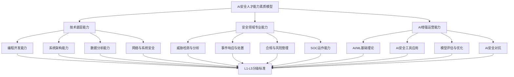
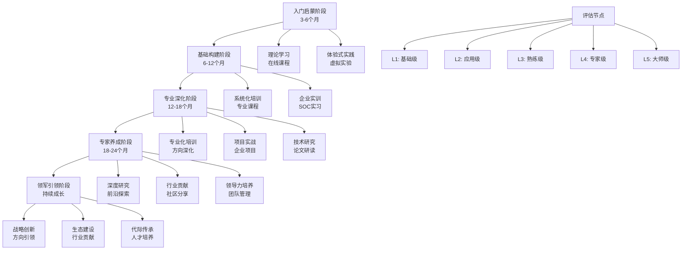
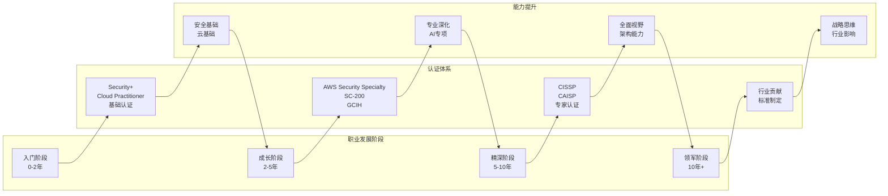

**作者：** HOS(安全风信子)
**日期：** 2026-04-27
**主要来源平台：** GitHub
**摘要：** 随着AI技术在企业安全运营领域的深度渗透，传统的安全运营职业体系正面临前所未有的范式转移。本文系统性地构建了AI安全运营人才的"三位一体"能力素质模型，涵盖技术底层能力、安全领域专业能力和AI增强运营能力三个维度。在人才培养路径设计上，本文创新性地提出了"五阶段递进式"发展体系，结合实战化培训生态和跨域融合培养机制，为企业AI安全团队建设提供了可落地的实施框架。此外，文章深入分析了国内外主流职业认证体系的价值定位与演进趋势，构建了可持续职业发展生态系统。研究表明，构建科学的AI安全人才发展体系已成为企业安全能力建设的核心竞争力要素，而具备复合型知识结构和持续学习能力的T型安全人才将成为AI时代最稀缺的战略资源。

@[TOC](目录)

---

# AI安全运营职业发展路径

## 1 引言：从传统安全运营到AI增强型安全运营的范式转移

### 1.1 AI时代企业安全运营的新挑战

在数字化转型浪潮的推动下，人工智能技术正以惊人的速度渗透到企业安全运营的各个层面。传统的安全运营中心（SOC）模式正在经历从人工主导到AI增强的深刻变革，这一变革不仅重塑了安全运营的技术架构，更从根本上改变了安全人才的能力需求和职业发展路径。根据Gartner的最新研究预测，到2027年，全球将有超过60%的大型企业选择AI原生的安全运营平台来替代传统SIEM系统，这一趋势预示着安全运营职业领域正在发生根本性的范式转移。

传统的安全运营工作模式以分析师的人工分析为核心，依赖专家经验进行威胁检测、事件调查和响应处置。然而，随着网络攻击技术的不断演进和攻击面的持续扩大，传统模式面临着严峻挑战：告警疲劳问题导致关键安全事件被淹没在海量噪声中；威胁检测的实时性要求远超人工处理能力上限；高级持续性威胁（APT）的复杂性和隐蔽性使得基于规则的传统检测方法日趋失效。在这一背景下，AI技术的引入为安全运营带来了革命性的变化——机器学习算法能够从海量日志和流量数据中自动发现异常模式，自然语言处理技术能够实现威胁情报的自动化分析与归集，计算机视觉技术能够实现恶意软件的自动化静态分析和行为判定。

然而，AI技术在提升安全运营效率的同时，也带来了全新的安全挑战。AI系统本身可能成为攻击目标，对抗性样本攻击、模型投毒、数据注入等新型威胁不断涌现。更重要的是，AI安全运营对人才的能力要求发生了根本性变化——既需要传统安全领域的深厚积累，又需要AI/ML技术的扎实功底，还需要将两者有效融合的复合能力。这种"既懂安全、又懂AI、还能运营"的复合型人才在当前市场上极度稀缺，成为制约企业AI安全能力建设的核心瓶颈。

### 1.2 AI安全运营人才市场的供需失衡

当前AI安全运营人才市场呈现出显著的供需失衡特征。一方面，全球网络安全人才缺口持续扩大，据ISC² 2024年度报告显示，全球网络安全从业人员约为550万人，但实际需求量超过700万人，缺口高达150万人。另一方面，具备AI能力的专业安全人才更是凤毛麟角，领英（LinkedIn）发布的《2024年AI安全人才趋势报告》指出，全球范围内同时具备安全运营经验和AI/ML技能的专业人才不足5万人，这一数字与企业的实际需求之间存在着巨大的鸿沟。

这种供需失衡直接导致了人才薪酬的持续攀升。北美地区AI安全运营高级工程师的平均年薪已突破25万美元，而具备AI安全架构能力的首席安全官（CSO）级别人才的薪酬更是达到了40-60万美元的区间。在中国一线城市，具备AI安全运营能力的高级人才同样呈现出供不应求的态势，薪酬水平较传统安全运营岗位高出40-80%。然而，高薪酬并未能有效缓解人才短缺的问题，根本原因在于AI安全运营人才培养体系的系统性缺失——传统安全培训体系难以覆盖AI技术内容，而主流AI培训课程又缺乏安全领域的深度整合。

### 1.3 本文的研究目标与框架

面对上述挑战，本文旨在构建一套系统完整的AI安全运营职业发展路径框架。具体而言，本文将围绕三个核心问题展开深入分析：第一，AI安全运营人才需要具备什么样的能力素质模型？这一模型如何科学地定义和量化各层级人才的能力要求？第二，如何设计有效的培养路径来帮助安全从业者成长为AI安全运营专家？这一路径如何与个人职业发展规划相结合？第三，当前有哪些职业认证体系可以支撑AI安全运营人才的持续发展？这些认证体系之间如何协同构建完整的人才发展生态？

围绕上述问题，本文提出了"三位一体、五阶段递进、多认证支撑"的AI安全运营职业发展框架。"三位一体"能力模型涵盖技术底层能力、安全领域专业能力和AI增强运营能力三个维度；"五阶段递进"培养路径包括入门启蒙、基础构建、专业深化、专家养成和领军引领五个阶段；"多认证支撑"体系整合了国内外主流认证资源，构建了覆盖不同层次、不同方向的全方位认证生态。本文的后续章节将依次展开详细论述。

## 2 AI安全运营职业全景分析

### 2.1 AI安全运营的岗位图谱与职责矩阵

AI安全运营是一个多层次、多方向的复杂职业领域，其岗位设置和能力要求呈现出显著的差异化特征。根据企业安全运营的实际需求和AI技术的应用深度，可以将AI安全运营相关的岗位划分为以下几个核心类别，每个类别都有其独特的职责边界和能力要求。

**AI安全运营分析师（AI Security Operations Analyst）**是AI安全运营体系中的一线角色，主要负责利用AI安全工具进行威胁检测、告警分析和事件初步响应。这一岗位需要具备扎实的安全基础知识，熟悉主流SIEM/SOAR平台的操作，了解机器学习在安全检测中的应用原理，能够解读AI模型的输出结果并进行人工验证。根据实际调研，一线AI安全分析师每天需要处理的告警量通常在500-2000条之间，其中约90%可通过AI自动化处理，剩余10%需要人工深度分析。

**AI安全工程师（AI Security Engineer）**是连接安全运营和AI技术的桥梁角色，主要负责AI安全检测模型的开发、训练、调优和部署。这一岗位需要同时具备安全领域知识和技术开发能力，能够理解安全场景的业务需求，将ML/DL算法应用于实际安全问题，并持续优化模型性能。AI安全工程师的核心产出包括威胁检测模型、异常行为分析模型、恶意软件分类模型等多种AI安全能力。值得注意的是，AI安全工程师不仅要构建AI模型，还需要确保AI模型本身的安全性，防止对抗性攻击和数据泄露。

**AI安全架构师（AI Security Architect）**是高级战略角色，负责设计企业级AI安全运营体系的技术架构。这一角色需要具备全面的技术视野，能够评估不同AI安全技术的优劣势，制定符合企业实际需求的AI安全战略，协调多个AI安全工具和平台的集成与联动。AI安全架构师的工作直接影响企业安全运营的效率和效果，是AI安全团队的核心领导者。根据业界的普遍认知，AI安全架构师通常需要具备8-10年以上的信息安全从业经验，其中至少3-5年专注于AI安全领域。

**AI安全研究员（AI Security Researcher）**是前沿探索角色，主要负责跟踪AI安全领域的最新研究进展，探索AI安全的新技术、新方法和新应用。这一角色需要具备深厚的学术研究背景，能够进行原创性的技术研究，将学术界的前沿成果转化为实际的安全能力。AI安全研究员的工作为企业的长期技术储备提供支撑，是AI安全团队的技术先锋。

### 2.2 岗位能力要求对比分析

为了更清晰地呈现不同岗位的能力要求差异，下面通过一个对比表格来展示各岗位在核心能力维度上的要求程度：

| 能力维度 | AI安全分析师 | AI安全工程师 | AI安全架构师 | AI安全研究员 |
|---------|------------|------------|------------|------------|
| 网络安全基础知识 | 高 | 高 | 高 | 中 |
| 操作系统安全 | 高 | 中 | 高 | 低 |
| 编程开发能力 | 中 | 高 | 高 | 高 |
| 机器学习理论 | 低 | 高 | 中 | 高 |
| 深度学习框架 | 低 | 高 | 中 | 高 |
| 安全运营经验 | 高 | 中 | 高 | 低 |
| AI工具使用 | 高 | 高 | 高 | 中 |
| 威胁情报分析 | 高 | 中 | 高 | 中 |
| 架构设计能力 | 低 | 中 | 高 | 低 |
| 研究创新能力 | 低 | 中 | 中 | 高 |

从上述对比可以看出，不同岗位在各项能力上的要求存在显著差异。AI安全分析师侧重于安全运营实战能力，AI安全工程师需要兼顾安全和AI技术两个方面，AI安全架构师要求全面的技术视野和架构能力，而AI安全研究员则更关注前沿技术的探索和研究。这种能力要求的差异化决定了AI安全人才培养需要因材施教、分层递进。

### 2.3 AI安全运营人才的职业发展通道

AI安全运营人才的职业发展通常呈现出两条主要路径：**技术专家路径**和**管理领导路径**。

技术专家路径侧重于技术深度的持续提升，从初级分析师逐步成长为资深专家。典型的晋升路径为：AI安全分析师（1-3年）→ 高级AI安全分析师（3-5年）→ AI安全工程师（5-8年）→ 高级AI安全工程师（8-10年）→ AI安全专家→ 首席AI安全研究员。在这一路径上，从业者不断提升在特定AI安全技术领域的专精程度，最终成为某一领域的权威专家。

管理领导路径则侧重于团队管理和战略规划能力的培养，从个人贡献者逐步转变为团队领导者。典型的晋升路径为：AI安全分析师→ 高级分析师→ AI安全运营主管→ AI安全运营经理→ 安全运营总监→ 首席安全官（CSO）/首席信息安全官（CISO）。在这一路径上，从业者需要逐步掌握团队管理、项目管理、战略规划等管理技能，最终承担起企业安全战略的制定和执行责任。

值得注意的是，技术专家路径和管理领导路径并非完全隔离，而是可以相互交叉和转换。许多优秀的AI安全架构师在积累一定经验后可以选择转向管理岗位，而部分管理者在积累深厚技术功底后也可以重新回归技术专家路线。企业应该为员工提供灵活的职业发展通道，鼓励根据个人兴趣和能力特点选择适合的发展路径。

## 3 AI安全人才能力素质模型

### 3.1 "三位一体"能力素质模型概述

本文提出的AI安全人才"三位一体"能力素质模型，是一套专门针对AI安全运营领域的系统性人才能力框架。该模型将AI安全运营人才所需的核心能力划分为三个一级维度：**技术底层能力**、**安全领域专业能力**和**AI增强运营能力**。每个一级维度下又细分为多个二级指标，形成了一套完整的能力评估和发展指导体系。

"三位一体"能力模型的构建遵循了以下核心原则：第一，**系统性原则**，确保模型覆盖AI安全运营人才的各方面能力要求，不存在重大遗漏；第二，**层次性原则**，各能力维度具有清晰的层次结构，便于不同层级人才的能力评估和培养规划；第三，**实用性原则**，模型能力描述具体可衡量，便于在人才招聘、绩效考核、职业发展规划等实际场景中的应用；第四，**发展性原则**，模型能够适应AI安全领域的快速变化，具备动态更新和持续完善的能力。

### 3.2 技术底层能力维度

技术底层能力是AI安全运营人才的基础性能力，为其他两个能力维度提供技术支撑。这一维度主要包括以下几个核心能力项：

**编程开发能力**是技术底层能力的基础。AI安全运营人才需要熟练掌握至少一门主流编程语言，Python是这一领域最核心的语言选择，因为Python在AI/ML领域拥有最丰富的生态系统，同时在安全工具开发、自动化脚本编写等场景中也有广泛应用。高级AI安全人才还需要掌握其他编程语言，如Java（用于企业级安全应用开发）、Go（用于高性能安全工具开发）、JavaScript/TypeScript（用于Web安全工具开发）等。编程能力不仅体现在代码编写的熟练度上，更体现在代码质量、架构设计、问题解决等综合能力上。

**系统架构能力**是技术底层能力的高级形态。AI安全运营人才需要理解企业级安全系统的整体架构，包括网络架构、系统架构、数据架构和安全架构等。这一能力要求从业者能够站在全局视角审视安全系统的设计和实现，理解各组件之间的交互关系，能够识别潜在的架构风险和优化空间。对于AI安全架构师而言，系统架构能力更是核心能力，直接决定了其设计企业级AI安全方案的水平。

**数据分析能力**是技术底层能力的重要组成部分。AI安全运营的本质是对海量安全数据的分析和挖掘，因此数据分析能力是AI安全人才的基本功。这包括数据采集、数据清洗、数据存储、数据查询和数据分析等多个环节。从业者需要熟悉SQL语言进行数据查询，熟悉NoSQL数据库的使用，了解大数据处理框架（如Hadoop、Spark）的基本原理，能够使用Pandas、NumPy等工具进行数据处理和分析。

### 3.3 安全领域专业能力维度

安全领域专业能力是AI安全运营人才的核心竞争力，是区别于一般AI从业者的关键所在。这一维度主要包括以下几个核心能力项：

**威胁检测与分析能力**是安全领域专业能力的核心。AI安全运营人才需要深入理解各类网络威胁的原理、特征和检测方法，包括恶意软件、网络钓鱼、漏洞利用、横向移动、数据泄露等。这要求从业者具备扎实的网络安全基础知识，熟悉TCP/IP协议栈，理解常见攻击的原理和表现。同时，从业者还需要掌握威胁狩猎（Threat Hunting）的理念和方法，能够主动发现潜伏在网络中的高级威胁。

**事件响应与处置能力**是安全运营实践的关键技能。AI安全运营人才需要熟悉安全事件的响应流程和处置方法，包括事件确认、遏制、根除、恢复和总结等阶段。这一能力不仅要求技术知识，还要求流程规范意识和团队协作能力。在AI增强的安全运营环境中，事件响应流程往往会与AI自动化能力相结合，从业者需要理解如何在人机协作模式下高效完成事件处置。

**合规与风险管理能力**是AI安全运营人才必须掌握的管理类技能。这包括理解并应用各种安全合规框架（如GDPR、ISO 27001、网络安全法等），能够进行安全风险评估和优先级排序，制定并实施安全控制措施。随着AI系统的引入，合规要求也在不断更新，如欧盟的AI法案对高风险AI系统提出了额外的合规要求，AI安全运营人才需要及时掌握这些新要求。

**安全运营中心（SOC）运作能力**是AI安全运营人才的实践性技能。这包括理解SOC的组织架构和工作流程，熟悉SIEM、SOAR等核心平台的操作，掌握告警管理、事件管理、报告编制等日常运营技能。在AI增强的SOC环境中，从业者还需要理解AI如何与SOC工作流程集成，如何有效利用AI工具提升运营效率。

### 3.4 AI增强运营能力维度

AI增强运营能力是AI安全运营人才的特色能力，是连接传统安全能力和新兴AI技术的桥梁。这一维度主要包括以下几个核心能力项：

**AI/ML基础理论**是AI增强运营能力的理论基础。从业者需要理解机器学习的基本概念和原理，包括监督学习、无监督学习、强化学习等范式，理解模型训练、验证、测试的基本流程，理解过拟合、欠拟合、偏差方差权衡等核心概念。这些理论知识是从业者正确使用AI安全工具、理解和评估AI模型输出的基础。

**AI安全工具应用能力**是AI增强运营能力的实践技能。这包括熟练使用各类AI安全产品和服务，如AI增强的SIEM平台、UEBA（用户实体行为分析）工具、AI驱动的威胁情报平台等。从业者需要理解这些工具的工作原理、功能特点和局限性，能够根据实际场景选择合适的工具，并进行合理的配置和优化。

**AI模型评估与优化能力**是AI增强运营能力的高级形态。这包括能够评估AI模型的性能（如准确率、召回率、F1分数等），理解不同评估指标在安全场景中的含义，能够根据评估结果进行模型调优。随着AI技术在安全运营中的深入应用，这一能力的重要性日益凸显，因为AI模型的性能直接影响安全检测的效果。

**AI安全对抗能力**是AI增强运营能力的前沿领域。这包括理解对抗性机器学习的基本原理，如对抗样本生成、模型规避、模型投毒等攻击方式；掌握AI系统的安全测试方法，能够对AI安全系统进行红队评估；了解AI安全的最新研究进展，能够将前沿研究成果应用于实践。

### 3.5 能力素质模型的分级标准

为了便于能力评估和培养规划，本文将"三位一体"能力模型中的各项能力划分为五个级别：**基础级（L1）**、**应用级（L2）**、**熟练级（L3）**、**专家级（L4）**和**大师级（L5）**。

**基础级（L1）**表示对某一能力项有初步了解，能够在指导下完成基础性工作。以编程能力为例，基础级意味着能够编写简单的脚本，能够理解他人编写的代码，但无法独立完成复杂功能开发。以AI/ML基础理论为例，基础级意味着了解基本概念和术语，能够理解科普级别的技术文章。

**应用级（L2）**表示能够独立完成常规性工作，能够应用现有工具和方法解决已知类型的问题。以安全运营经验为例，应用级意味着能够按照既定流程进行告警分析和事件响应，能够识别常见类型的攻击。以AI安全工具应用为例，应用级意味着能够熟练使用企业部署的AI安全工具，能够进行常规配置和操作。

**熟练级（L3）**表示能够处理复杂问题，能够对现有方法进行优化和改进。以编程能力为例，熟练级意味着能够独立设计和实现中等复杂度的功能模块，能够进行代码审查和优化。以AI模型评估为例，熟练级意味着能够全面评估模型性能，能够识别模型问题并进行针对性优化。

**专家级（L4）**表示能够解决复杂的前沿问题，能够对领域发展做出贡献。以威胁检测与分析为例，专家级意味着能够识别和分析新型攻击手法，能够提出创新的检测方法。以AI安全对抗为例，专家级意味着能够进行原创性的AI安全研究，能够发现AI系统的未知漏洞。

**大师级（L5）**表示在某一领域具有全球领先水平，能够定义领域发展方向。以AI安全架构为例，大师级意味着能够设计革命性的AI安全架构，能够引领行业发展方向。以AI安全研究为例，大师级意味着其研究成果能够发表在顶级学术会议，能够产生广泛影响。

下面用Mermaid图表展示能力素质模型的整体结构：



## 4 复合型人才培养路径设计

### 4.1 "五阶段递进式"培养体系总体框架

基于"三位一体"能力素质模型，本文设计了一套"五阶段递进式"AI安全运营人才培养体系。该体系遵循人才成长的客观规律，按照能力发展逻辑划分为五个递进阶段：**入门启蒙阶段**、**基础构建阶段**、**专业深化阶段**、**专家养成阶段**和**领军引领阶段**。每个阶段都有明确的学习目标、培养方式和评估标准，形成了一套完整的人才培养闭环。

"五阶段递进式"培养体系的设计理念源于几个核心认识：第一，人才能力发展是非线性的，不同阶段需要不同的培养方式和资源支持；第二，AI安全运营人才培养需要平衡安全基础和AI技术两个维度，两者不可偏废；第三，人才培养需要与职业发展通道紧密结合，形成持续激励；第四，人才培养效果需要通过科学的评估体系进行验证和优化。

### 4.2 第一阶段：入门启蒙阶段

入门启蒙阶段是AI安全运营人才职业生涯的起点，主要目标是帮助学员建立对安全行业的整体认知，激发学习兴趣，初步了解AI在安全领域的应用场景。这一阶段通常需要3-6个月的时间。

**学习目标**：完成从零基础到安全行业入门者的转变。具体包括：理解网络安全的基本概念和术语，了解主要的安全威胁类型和攻击手法，熟悉信息安全的基本原则和防护策略，对AI技术及其在安全领域的应用形成初步认知。

**培养方式**：这一阶段采用"理论学习+体验式实践"的双轨培养模式。理论学习方面，通过在线课程平台（如Coursera、Udemy、edX等）完成网络安全基础课程的学习，推荐课程包括计算机网络基础、操作系统安全基础、Web安全入门等。体验式实践方面，通过虚拟化实验环境进行基础安全实验，如搭建简单的网络环境、配置防火墙规则、分析常见攻击流量等。推荐使用Metasploitable、DVWA等漏洞演练平台进行实操练习。

**核心课程内容**：

- 计算机网络原理与TCP/IP协议栈
- 操作系统基础与Windows/Linux安全配置
- Web应用安全基础（OWASP Top 10）
- 网络攻击原理与防御基础
- 恶意软件基础分析与识别
- AI/机器学习入门（概念层面）
- Python编程基础

**阶段评估标准**：完成入门阶段学习后，学员应达到以下标准：能够解释网络安全的基本概念和原理；能够描述主要安全威胁的类型和特征；能够使用至少一种安全工具（如Wireshark、Nmap）进行基础分析；能够编写简单的Python脚本处理文本数据；能够通过相关基础认证考试（如CompTIA Security+）。

### 4.3 第二阶段：基础构建阶段

基础构建阶段是AI安全运营人才培养的关键时期，主要目标是帮助学员构建扎实的知识基础，形成系统化的知识结构，为后续的专业深化奠定基础。这一阶段通常需要6-12个月的时间。

**学习目标**：完成从入门者到具备独立工作能力的安全从业者的转变。具体包括：掌握网络安全的核心理论和技术体系，熟悉安全运营的基本流程和方法论，了解AI技术在安全领域的典型应用场景，具备使用主流安全工具进行日常安全运营的能力。

**培养方式**：这一阶段采用"系统化培训+企业实训"的培养模式。系统化培训方面，通过脱产培训或在职进修的方式完成安全领域核心课程的学习，通常包括安全运营、威胁检测、事件响应、合规管理等方向的课程。企业实训方面，通过到企业安全运营中心实习的方式，在真实工作环境中应用所学知识，积累实践经验。实训期间，学员将在导师指导下参与实际的安全运营工作，包括告警分析、事件调查、报告撰写等。

**核心课程内容**：

- 安全运营中心（SOC）理论与实践
- SIEM平台原理与操作（Splunk、Elastic等）
- 威胁情报基础与应用
- 漏洞管理与渗透测试基础
- 日志分析与关联分析技术
- 安全事件响应方法论
- AI/ML在安全领域的应用概述
- 数据分析与可视化技术

**阶段评估标准**：完成基础构建阶段学习后，学员应达到以下标准：能够独立进行日常安全运营工作，包括告警分析、事件记录等；能够熟练使用主流SIEM平台进行安全数据分析；能够撰写专业的安全事件分析报告；具备参加中级安全认证考试（如GCIH、CISA）的能力；完成至少3个月的 企业安全运营实习并获得正面评价。

### 4.4 第三阶段：专业深化阶段

专业深化阶段是AI安全运营人才培养的核心时期，主要目标是帮助学员在打好基础的前提下，选择特定的专业方向进行深入学习，形成差异化的专业能力。这一阶段通常需要12-18个月的时间。

**学习目标**：完成从具备基础能力到具备专业特长的转变。具体包括：在AI安全运营的某一特定领域形成深入的专业能力，如AI威胁检测、AI事件分析、AI安全架构等；能够独立处理复杂的安全问题；开始承担一定的技术责任，如指导初级人员、参与技术方案评审等。

**培养方式**：这一阶段采用"专业化培训+项目实战+技术研究"的三维培养模式。专业化培训方面，根据学员的职业发展方向选择相应的专业课程，深入学习特定领域的技术理论和实践方法。项目实战方面，通过参与真实的企业AI安全项目，将专业知识转化为实际能力。项目经历是这一阶段最重要的培养资源，学员应争取参与企业核心AI安全系统的设计和开发工作。技术研究方面，开始关注AI安全领域的前沿研究，尝试阅读和理解学术论文，必要时参与开源安全项目的开发。

**专业方向划分**：

**AI威胁检测方向**：专注于利用机器学习和深度学习技术进行威胁检测的能力培养。主要学习内容包括：监督学习在入侵检测中的应用、无监督学习在异常检测中的应用、深度学习在恶意软件分析中的应用、威胁情报的自动化分析等。

**AI安全运营方向**：专注于如何利用AI技术提升安全运营效率的能力培养。主要学习内容包括：AI驱动的SOAR平台、安全运营自动化工作流设计、AI辅助的事件响应、基于AI的安全运营指标体系等。

**AI安全架构方向**：专注于企业级AI安全系统架构设计的能力培养。主要学习内容包括：AI安全系统整体架构、AI与其他安全组件的集成、AI安全平台选型评估、AI安全系统的可靠性设计等。

**阶段评估标准**：完成专业深化阶段学习后，学员应达到以下标准：在选定的专业方向上具备L3（熟练级）以上的能力水平；能够独立完成复杂的技术任务；能够为团队提供专业领域的技术支持；获得相关领域的中级或高级认证（如AWS Security Specialty、Microsoft SC-200等）；在公开技术社区分享至少3篇专业文章。

### 4.5 第四阶段：专家养成阶段

专家养成阶段是AI安全运营人才培养的高阶时期，主要目标是帮助学员成长为特定领域的技术专家，形成广泛认可的专业影响力。这一阶段通常需要18-24个月的时间。

**学习目标**：完成从具备专业特长到成为技术专家的转变。具体包括：在AI安全运营的某一细分领域达到L4（专家级）甚至L5（大师级）的能力水平；形成自己的专业见解和方法论；具备影响行业发展的能力；能够指导和培养其他专业人员。

**培养方式**：这一阶段采用"深度研究+行业贡献+领导力培养"的三元培养模式。深度研究方面，对特定技术领域进行深入研究，追求技术深度和原创性成果。鼓励学员开展前沿技术研究，发表学术论文，申请技术专利。行业贡献方面，积极参与行业活动，通过技术博客、技术演讲、开源贡献等方式建立专业影响力。领导力培养方面，在承担技术责任的同时，开始培养团队管理和技术领导能力。

**核心能力要求**：

- 对AI安全运营的某一细分领域有全面深入的理解
- 能够独立解决该领域的复杂技术问题
- 能够为该领域的发展做出贡献
- 具备跨领域技术整合能力
- 具备技术团队领导能力
- 在行业范围内具有一定的知名度和影响力

**阶段评估标准**：完成专家养成阶段学习后，学员应达到以下标准：在特定领域达到L4（专家级）以上的能力水平；获得相关领域的高级认证（如CISSP、CCSP或特定AI安全认证）；在技术社区或行业会议上发表过技术演讲；主导过至少一个重要技术项目或研究课题；开始承担技术导师或技术领导的角色。

### 4.6 第五阶段：领军引领阶段

领军引领阶段是AI安全运营人才培养的最高阶段，主要目标是帮助学员成长为能够引领行业发展的领军人才。这一阶段没有固定的时间期限，是一个持续学习和贡献的过程。

**学习目标**：完成从技术专家到行业领军人物的转变。具体包括：能够定义和引领AI安全运营领域的发展方向；能够提出和推动具有行业影响力的技术战略；能够培养和带领高水平的专业团队；能够为行业发展做出系统性贡献。

**培养方式**：这一阶段采用"战略创新+生态建设+代际传承"的立体培养模式。战略创新方面，站在行业高度审视AI安全运营的发展方向，提出具有前瞻性的战略构想。生态建设方面，通过参与标准制定、推动产学合作、构建行业联盟等方式，促进行业生态的健康发展。代际传承方面，通过人才培养、经验分享、知识传播等方式，将个人经验转化为行业资产。

**领军人才的核心特质**：

- 具有全局视野和战略思维
- 能够洞察行业发展趋势
- 能够整合和调动行业资源
- 具有强大的技术领导和组织能力
- 在行业范围内具有广泛的影响力和号召力
- 具备高度的社会责任感和职业操守

### 4.7 人才培养路径的Mermaid流程图

下面用Mermaid图表展示五阶段递进式培养体系的整体流程：



## 5 职业认证与持续发展体系

### 5.1 AI安全认证体系全景分析

职业认证是AI安全运营人才职业发展的重要支撑，科学的认证体系能够帮助人才明确学习方向、验证能力水平、获得行业认可。当前AI安全领域的认证体系呈现出多元化发展的态势，既有传统的安全认证持续更新纳入AI内容，也有新兴的AI专项认证不断涌现。深入分析这些认证体系，对于构建个人职业发展路径具有重要意义。

从认证体系的层次来看，可以将AI安全相关认证划分为三个层次：**基础层认证**主要面向安全行业的入门者，验证基础安全知识和技能；**专业层认证**面向具备一定经验的安全专业人员，验证特定领域的技术能力；**专家层认证**面向高级安全专家，验证全面的技术能力和丰富的实践经验。从认证的侧重来看，可以将认证划分为：**传统安全认证**以安全管理、安全架构等传统领域为核心，逐步纳入AI相关内容；**AI专项认证**以AI技术及其在安全领域的应用为核心；**厂商认证**由主要技术厂商提供，验证特定平台的使用能力。

### 5.2 国际主流AI安全认证详解

**AWS Certified Security - Specialty（AWS Security Specialty）**是亚马逊网络服务公司提供的安全专业认证，验证在AWS云平台上设计和实施安全解决方案的能力。随着AWS推出多项AI/ML服务（如Amazon SageMaker、Amazon Rekognition等），该认证也纳入了AI安全的相关内容，包括AI模型的安全部署、AI服务的数据安全保护等。该认证适合在AWS环境中从事安全工作的专业人员，尤其是需要兼顾AI应用安全的从业者。考试形式为选择题和情景分析题，考试时间约180分钟，费用为300美元。

**Microsoft SC-200: Microsoft Security Operations Analyst**是微软提供的安全运营分析师认证，验证使用Microsoft Sentinel、Microsoft Defender等微软安全工具进行威胁检测和响应的能力。微软的安全解决方案在AI应用方面处于行业领先地位，Microsoft Sentinel内置了多项AI能力，如机器学习驱动的异常检测、NLP支持的威胁狩猎等。SC-200认证涵盖了这些AI增强的安全运营技能，适合在微软安全生态中工作的专业人员。

**Google Cloud Professional Security Engineer**是谷歌云提供的安全工程师认证，验证在Google Cloud平台上设计和管理安全系统的能力。谷歌在AI安全领域拥有独特的技术优势，如Chronicle安全分析平台的AI能力、Security Command Center的威胁检测功能等。该认证适合在GCP环境中工作的安全专业人员。

**Certified Information Systems Security Professional (CISSP)**是全球认可度最高的安全认证之一，由(ISC)²组织提供。CISSP验证在安全架构、安全管理等多个领域的全面能力。近年来，CISSP也在持续更新其内容体系，纳入了云安全、AI安全等新兴领域。CISSP适合希望成为安全领域通才的高级专业人员，其广泛的知识覆盖能够帮助建立全面的安全视野。

**Certified AI Security Professional (CAISP)**是2024年新推出的AI安全专项认证，由云安全联盟（CSA）提供。该认证专门针对AI系统的安全问题，涵盖AI安全威胁（如对抗性样本、模型注入、数据投毒等）、AI安全风险评估、AI安全控制措施等内容。作为新兴认证，CAISP代表了行业对AI安全专业化发展的认可，适合希望在AI安全领域建立专业认证的安全人员。

### 5.3 国内AI安全认证体系分析

国内AI安全认证体系也在快速发展中，形成了官方认证和行业认证并存的格局。

**CISP-AI**是中国信息安全测评中心推出的AI安全方向认证，是国家层面认可的专业资质认证。该认证在CISP知识体系基础上，增加了AI安全相关的专业内容，包括AI系统安全威胁、AI安全测试方法、AI合规要求等。CISP-AI作为国家层面的认证，具有较高的权威性和认可度，尤其适合在政府机关、国有企业、关键信息基础设施单位工作的安全人员。

**等级保护测评师（CPTE）**虽然是传统的安全测评认证，但随着AI系统的广泛应用，AI系统等级保护测评已成为重要的工作领域。中国网络安全审查技术与认证中心正在更新等级保护测评师的培训内容，纳入了AI系统安全评估的专业知识。对于从事AI系统安全评估工作的专业人员而言，等级保护测评师认证是重要的资质证明。

**行业头部企业认证**也是国内AI安全人才认证体系的重要组成部分。阿里云、腾讯云、华为云等头部云服务商都推出了自己的安全认证体系，并逐步纳入AI安全相关内容。这些认证与厂商的云平台和AI服务紧密结合，适合在特定厂商生态中工作的专业人员。例如，阿里云的ACSSE（阿里云安全解决方案专家）认证就包含了AI安全的内容。

### 5.4 厂商级AI安全工具认证

掌握主流AI安全工具是AI安全运营人才的核心技能之一，厂商级认证为这一领域的能力验证提供了重要支撑。

**Splunk认证**体系是安全运营领域最全面的厂商认证之一。Splunk作为SIEM市场的领导者，其平台内置了丰富的AI能力，如机器学习驱动的异常检测（Splunk User Behavior Analytics）、AI辅助的搜索与分析等。Splunk认证体系包括Splunk Core Certified User、Splunk Enterprise Security Certified Admin、Splunk IT Service Intelligence Certified Admin等多个级别，覆盖了从基础到高级的技能验证。其中，Splunk Enterprise Security Certified Admin认证包含AI增强安全运营的相关内容。

**IBM QRadar SIEM认证**验证使用IBM QRadar平台进行安全运营的能力。QRadar平台提供了AI驱动的威胁检测功能，包括异常检测、用户行为分析等。IBM的认证体系包括QRadar SIEM Foundation、QRadar SIAM等多个认证，适合在IBM安全生态中工作的专业人员。

**CrowdStrike认证**体系验证使用CrowdStrike Falcon平台进行端点安全和威胁检测的能力。CrowdStrike在AI驱动的端点安全领域处于领先地位，其平台广泛使用了机器学习技术进行恶意软件检测和行为分析。Falcon认证体系适合专注于端点安全方向的AI安全运营人才。

### 5.5 认证学习路径规划

科学规划认证学习路径对于AI安全运营人才的职业发展至关重要。根据职业发展阶段的不同，可以将认证规划划分为以下几个层次：

**入门阶段（0-2年）**的认证规划重点是打好安全基础，建立知识广度。推荐的认证组合包括：CompTIA Security+（基础安全认证）、AWS Certified Cloud Practitioner（云基础认证），以及Python编程相关的基础认证。这一阶段不建议过早追求高级认证，而应该把主要精力放在知识积累和实践经验上。

**成长阶段（2-5年）**的认证规划重点是深化专业能力，建立方向深度。根据职业发展方向选择相应的专业认证。如果侧重云安全方向，推荐AWS Security Specialty、Microsoft SC-200或GCP Professional Security Engineer；如果侧重安全运营方向，推荐GCIH（安全事件响应）、SC-200（安全运营分析）；如果侧重AI专项方向，推荐新兴的CAISP认证。

**精深阶段（5-10年）**的认证规划重点是建立全面视野，冲击专家级认证。CISSP是这一阶段的标志性认证，其广泛的知识覆盖能够帮助建立全面的安全视野。同时，可以考虑ITIL、TOGAF等管理和架构类认证，提升综合能力。对于在特定领域有深厚积累的专业人士，可以尝试专家级认证或技术专家认证。

**持续学习机制**是认证体系发挥长期价值的关键。AI安全领域发展迅速，认证的知识体系需要持续更新。建议建立以下持续学习机制：每年至少参加一次行业会议或技术培训，了解最新发展；每两年进行一次认证更新或进阶认证，确保持续竞争力；建立技术博客或参与技术社区，保持知识输出和输入的平衡。

### 5.6 职业持续发展的生态系统

职业持续发展需要构建一个完整的生态系统，包括学习资源、技术社区、实践平台和职业机会等多个要素。

**学习资源生态**包括在线学习平台（如Coursera、Udemy、Pluralsight等）、技术出版社（如O'Reilly、Packt等）、学术资源（如arXiv、IEEE Xplore等）和企业内部培训资源。AI安全运营人才需要建立多元化的学习资源获取渠道，保持对新技术、新方法的敏感性。

**技术社区生态**包括开源社区（如MITRE ATT&CK、OWASP等）、技术论坛（如Reddit的r/netsec、Stack Overflow等）、技术博客（如Krebs on Security、Schneier on Security等）和技术会议（如Black Hat、DEF CON、RSAC等）。积极参与技术社区能够帮助保持技术视野，建立专业人脉。

**实践平台生态**包括云平台免费额度（如AWS、GCP、Azure的免费安全实验环境）、CTF比赛平台（如CTFHub、HackTheBox等）、漏洞演练平台（如VulnHub、PortSwigger Web Security Academy等）和企业实习机会。持续的实践是巩固和深化技术能力的关键途径。

**职业机会生态**包括招聘平台（如LinkedIn、Indeed等）、专业招聘机构、安全厂商内部推荐等。在AI安全运营领域，人才流动往往通过专业网络而非公开招聘进行，因此建立广泛的职业人脉非常重要。

### 5.7 认证与职业发展的关系图

下面用Mermaid图表展示认证体系与职业发展通道的关系：



## 6 企业AI安全团队建设实践

### 6.1 企业AI安全团队组织架构设计

构建高效的AI安全团队需要科学的组织架构设计。企业AI安全团队的架构设计需要考虑多个因素，包括企业规模、安全需求、技术成熟度、预算约束等。不同规模、不同行业的企业需要采用不同的团队架构模式。

**大型企业AI安全团队架构**通常采用分层分组的结构。整体上可以划分为三个层次：**战略层**负责制定AI安全战略、统筹资源分配、把控发展方向，由首席信息安全官（CISO）或安全VP领导；**战术层**负责各安全域的技术规划和实施，由各安全域负责人（如AI安全架构负责人、AI威胁检测负责人等）组成；**执行层**负责具体的运营和分析工作，由一线安全分析师和工程师组成。在分组方面，可以按照技术域（如AI检测组、AI工程组、威胁情报组等）或流程（如检测响应组、威胁狩猎组、合规审计组等）进行划分。

**中型企业AI安全团队架构**通常采用扁平化的结构。由于人员规模限制，中型企业难以设置太多的层级和细分团队，因此更强调一专多能的人才培养。典型的中型企业AI安全团队可能只有10-20人，但每个人都需要具备较宽的能力覆盖。同时，中型企业可以更多地依赖外部安全服务和托管安全服务（MSSP）来补充内部能力的不足。

**小型企业AI安全团队架构**通常采用精简的兼职结构。由于资源限制，小型企业可能只有1-2名专职安全人员，甚至由IT人员兼职负责安全工作。这种情况下，重点是建立基础的AI安全能力，选择合适的AI安全工具和服务，确保基本的安全运营能力。

### 6.2 AI安全团队人才配置模型

科学的AI安全团队人才配置需要考虑岗位设置、人员配比和能力梯度等多个维度。

**岗位配置模型**需要根据企业实际需求进行定制。对于大多数企业而言，建议配置以下核心岗位：

- **AI安全运营经理/主管**：负责AI安全团队的日常管理和运营，1-2人
- **AI安全分析师**：负责一线安全监控和告警分析，根据SOC规模配置3-10人
- **AI安全工程师**：负责AI检测模型的开发和维护，1-3人
- **AI安全架构师**：负责整体技术架构设计，0-1人（可由外部顾问提供）
- **威胁情报分析师**：负责威胁情报的收集和分析，0-2人

**人员配比模型**需要考虑团队的整体规模和运营模式。根据业界最佳实践，以下配比可作为参考：AI安全分析师与AI安全工程师的配比约为3:1到5:1；高级人员与初级人员的配比约为1:2到1:3；管理和专业人员的配比约为1:5到1:8。在向AI增强运营模式转型的过程中，团队规模可以较传统模式缩减30-50%，同时保持或提升安全运营效率。

**能力梯度配置**需要确保团队整体的能力覆盖。在团队组建时，需要同时考虑能力深度和能力广度的平衡。建议采用"金字塔"型能力结构：塔基是具备扎实安全基础和基本AI能力的广泛基础人才；塔身是具备特定专业方向深度能力的专业人才；塔尖是具备全面技术视野和战略思维的领导人才。

### 6.3 AI安全团队绩效评估体系

科学的绩效评估体系是AI安全团队管理的核心工具，能够引导团队行为、衡量团队价值、促进团队发展。AI安全团队的绩效评估需要兼顾传统安全运营指标和AI相关指标两个维度。

**传统安全运营指标**包括：

- 平均检测时间（MTTD）：从安全事件发生到被检测到的平均时间
- 平均响应时间（MTTR）：从安全事件检测到完成响应的平均时间
- 告警处理效率：单位时间内处理的告警数量
- 事件复盘质量：事件分析的完整性和准确性
- 威胁狩猎成果：主动发现的威胁数量和质量

**AI相关运营指标**包括：

- AI检测准确率：AI模型的正确检测率、误报率、漏报率
- AI自动化覆盖率：能够通过AI自动化处理的工作比例
- AI模型迭代频率：新模型或模型更新的发布频率
- AI模型性能趋势：模型性能随时间的衰减情况
- 人机协作效率：人工审核与AI自动化处理的比例和效率

**综合绩效评估框架**需要将上述指标整合为一个统一的评估体系。可以采用平衡计分卡（BSC）的方法，从财务、客户、运营和学习四个维度进行综合评估。在AI安全团队的背景下，财务维度关注安全投入的ROI，客户维度关注对业务部门的服务质量，运营维度关注安全运营的效率和效果，学习维度关注团队能力的发展和提升。

### 6.4 AI安全团队文化建设

优秀的团队文化是AI安全团队持续发展的内在动力。AI安全团队的文化建设需要关注几个核心要素。

**学习创新文化**是AI安全团队的核心文化。AI技术发展迅速，持续学习和创新是保持竞争力的关键。建议建立以下机制：每周技术分享会，鼓励团队成员分享学习心得；每月论文研读会，集体研读AI安全领域的最新研究；每季度创新头脑风暴，探讨新技术的应用场景；设立学习基金，支持成员参加外部培训和认证。

**协作互助文化**是AI安全团队的基础文化。安全运营工作需要团队协作，信息共享和互相支持至关重要。建议建立以下机制：跨班组结对互助，促进经验交流；告警分析案例库积累，沉淀集体智慧；重要事件复盘机制，从事件中学习提升。

**严谨负责文化**是AI安全团队的职业文化。安全工作责任重大，任何疏忽都可能造成严重后果。建议建立以下机制：标准化的操作流程，减少人为错误；严格的质量审核，确保工作质量；清晰的责任追溯，明确职责边界。

**人机协同文化**是AI安全团队的新兴文化。在AI增强运营的环境下，如何正确处理人与AI的关系是一个重要课题。建议建立以下理念：AI是工具而非替代者，人的判断和决策始终是核心；AI的能力边界需要被充分理解和尊重；人机协作的最优模式需要持续探索和优化。

## 7 AI安全运营实战技能培养

### 7.1 告警分析与事件响应实战

告警分析和事件响应是AI安全运营的核心工作内容。在AI增强的运营模式下，这一工作呈现出新的特点，对从业者提出了新的能力要求。

**AI增强的告警分析流程**通常包括以下步骤：首先是AI初筛，AI系统对原始告警进行自动分类、优先级排序和关联分析，将高优先级告警推送给分析师；其次是人工复核，分析师对AI推送的告警进行验证，判断是否为真实安全事件；然后是深度分析，对确认为安全事件的告警进行深入调查，分析攻击路径和影响范围；最后是响应处置，根据事件级别启动相应的响应流程。

以下是一个使用Python进行告警自动化处理的示例代码：

```python
#!/usr/bin/env python3
"""
AI安全运营 - 告警自动化处理系统
功能：对SIEM平台推送的告警进行智能分类、优先级排序和自动响应
"""

import json
import pandas as pd
from datetime import datetime, timedelta
from collections import defaultdict
from typing import Dict, List, Tuple, Optional
import logging

logging.basicConfig(
    level=logging.INFO,
    format='%(asctime)s - %(levelname)s - %(message)s'
)
logger = logging.getLogger(__name__)


class AlertPriorityClassifier:
    """基于规则的告警优先级分类器"""

    CRITICAL_PATTERNS = [
        " ransomware ",
        " data exfiltration ",
        " lateral movement ",
        " privilege escalation ",
        " C2 ",
        " command and control "
    ]

    HIGH_PATTERNS = [
        " brute force ",
        " port scan ",
        " unusual login ",
        " privilege attempt ",
        " suspicious process "
    ]

    MEDIUM_PATTERNS = [
        " failed login ",
        " policy violation ",
        " network anomaly ",
        " system error "
    ]

    def __init__(self):
        self.threat_intel_cache = {}
        self.ioc_patterns = self._load_ioc_patterns()

    def _load_ioc_patterns(self) -> Dict:
        """加载威胁情报模式库"""
        return {
            "known_malicious_ip": [
                "192.168.1.100",
                "10.0.0.50",
                "172.16.0.25"
            ],
            "known_malicious_domain": [
                "malware-c2.com",
                "phishing-site.net",
                "suspicious-domain.org"
            ],
            "high_risk_user": [
                "admin",
                "root",
                "service_account"
            ]
        }

    def calculate_priority(self, alert: Dict) -> Tuple[int, str]:
        """
        计算告警优先级
        返回: (优先级分数, 优先级级别)
        """
        score = 0
        alert_type = alert.get("alert_type", "").lower()
        description = alert.get("description", "").lower()
        source_ip = alert.get("source_ip", "")
        dest_ip = alert.get("dest_ip", "")
        username = alert.get("username", "")

        for pattern in self.CRITICAL_PATTERNS:
            if pattern in description or pattern in alert_type:
                score += 40
                break

        for pattern in self.HIGH_PATTERNS:
            if pattern in description or pattern in alert_type:
                score += 25
                break

        for pattern in self.MEDIUM_PATTERNS:
            if pattern in description or pattern in alert_type:
                score += 10
                break

        if source_ip in self.ioc_patterns["known_malicious_ip"] or \
           dest_ip in self.ioc_patterns["known_malicious_ip"]:
            score += 30

        if any(domain in description for domain in self.ioc_patterns["known_malicious_domain"]):
            score += 35

        if username in self.ioc_patterns["high_risk_user"]:
            score += 15

        timestamp = datetime.fromisoformat(alert.get("timestamp", datetime.now().isoformat()))
        if datetime.now() - timestamp < timedelta(minutes=5):
            score += 5
        elif datetime.now() - timestamp > timedelta(hours=1):
            score -= 10

        severity_map = {
            (80, 100): ("CRITICAL", 1),
            (50, 79): ("HIGH", 2),
            (25, 49): ("MEDIUM", 3),
            (0, 24): ("LOW", 4)
        }

        priority_level = "LOW"
        priority_score = 0
        for range_min, range_max in severity_map:
            if range_min <= score <= range_max:
                priority_level = severity_map[(range_min, range_max)][0]
                priority_score = severity_map[(range_min, range_max)][1]
                break

        logger.info(f"Alert {alert.get('id')} scored {score} - {priority_level}")
        return score, priority_level

    def classify_alert(self, alert: Dict) -> Dict:
        """对告警进行完整分类"""
        score, priority = self.calculate_priority(alert)

        classification = {
            "alert_id": alert.get("id"),
            "priority": priority,
            "priority_score": score,
            "needs_human_review": priority in ["CRITICAL", "HIGH"],
            "auto_response_eligible": priority == "CRITICAL",
            "recommended_action": self._get_recommended_action(priority),
            "classification_timestamp": datetime.now().isoformat()
        }

        return classification

    def _get_recommended_action(self, priority: str) -> str:
        """根据优先级获取推荐行动"""
        action_map = {
            "CRITICAL": "立即隔离受影响系统，启动应急响应流程",
            "HIGH": "15分钟内完成初步分析，启动事件调查",
            "MEDIUM": "4小时内完成分析，记录到跟踪系统",
            "LOW": "记录并定期批量处理"
        }
        return action_map.get(priority, "根据实际情况处理")


class AlertCorrelationEngine:
    """告警关联分析引擎"""

    def __init__(self, time_window_minutes: int = 30):
        self.time_window = timedelta(minutes=time_window_minutes)
        self.alert_history: List[Dict] = []

    def add_alert(self, alert: Dict) -> List[Dict]:
        """添加告警并返回关联的告警组"""
        alert_with_time = {
            **alert,
            "processed_timestamp": datetime.now()
        }
        self.alert_history.append(alert_with_time)

        self._cleanup_old_alerts()

        correlated_alerts = self._find_correlated_alerts(alert_with_time)
        return correlated_alerts

    def _cleanup_old_alerts(self):
        """清理超出时间窗口的告警"""
        cutoff_time = datetime.now() - self.time_window
        self.alert_history = [
            alert for alert in self.alert_history
            if alert["processed_timestamp"] > cutoff_time
        ]

    def _find_correlated_alerts(self, alert: Dict) -> List[Dict]:
        """查找关联告警"""
        correlated = []

        for historical_alert in self.alert_history:
            if historical_alert["id"] == alert["id"]:
                continue

            if self._is_correlated(alert, historical_alert):
                correlated.append(historical_alert)

        return correlated

    def _is_correlated(self, alert1: Dict, alert2: Dict) -> bool:
        """判断两个告警是否关联"""
        time_diff = abs(
            (alert1["processed_timestamp"] - alert2["processed_timestamp"]).total_seconds()
        )
        if time_diff > self.time_window.total_seconds():
            return False

        if alert1.get("source_ip") == alert2.get("source_ip"):
            return True

        if alert1.get("username") == alert2.get("username"):
            return True

        if alert1.get("asset_id") == alert2.get("asset_id"):
            return True

        alert_type1 = alert1.get("alert_type", "")
        alert_type2 = alert2.get("alert_type", "")

        attack_chain_patterns = [
            ["reconnaissance", "exploitation", "privilege_escalation"],
            ["initial_access", "execution", "persistence"],
            ["lateral_movement", "collection", "exfiltration"]
        ]

        for pattern in attack_chain_patterns:
            if alert_type1 in pattern and alert_type2 in pattern:
                idx1 = pattern.index(alert_type1)
                idx2 = pattern.index(alert_type2)
                if abs(idx1 - idx2) == 1:
                    return True

        return False


class AutomatedResponseEngine:
    """自动化响应引擎"""

    def __init__(self):
        self.response_actions = {
            "block_ip": self._block_ip_action,
            "isolate_host": self._isolate_host_action,
            "disable_account": self._disable_account_action,
            "enrich_alert": self._enrich_alert_action,
            "notify_team": self._notify_team_action
        }

    def execute_response(self, alert: Dict, response_type: str) -> bool:
        """执行响应动作"""
        if response_type not in self.response_actions:
            logger.error(f"Unknown response type: {response_type}")
            return False

        try:
            logger.info(f"Executing response: {response_type} for alert {alert.get('id')}")
            self.response_actions[response_type](alert)
            return True
        except Exception as e:
            logger.error(f"Failed to execute response {response_type}: {str(e)}")
            return False

    def _block_ip_action(self, alert: Dict):
        """阻止恶意IP"""
        source_ip = alert.get("source_ip")
        if source_ip:
            logger.info(f"Blocking IP: {source_ip}")
            print(f"[SIMULATION] Firewall rule added: BLOCK {source_ip}")

    def _isolate_host_action(self, alert: Dict):
        """隔离受感染主机"""
        asset_id = alert.get("asset_id")
        if asset_id:
            logger.info(f"Isolating host: {asset_id}")
            print(f"[SIMULATION] Network isolation applied to: {asset_id}")

    def _disable_account_action(self, alert: Dict):
        """禁用可疑账户"""
        username = alert.get("username")
        if username:
            logger.info(f"Disabling account: {username}")
            print(f"[SIMULATION] Account disabled: {username}")

    def _enrich_alert_action(self, alert: Dict):
        """告警丰富化"""
        logger.info(f"Enriching alert with threat intelligence")
        enriched = {
            **alert,
            "threat_intel_score": 85,
            "reputation_data": {"ip": "malicious", "confidence": "high"},
            "enriched_timestamp": datetime.now().isoformat()
        }
        print(f"[SIMULATION] Alert enriched: {json.dumps(enriched, indent=2)}")

    def _notify_team_action(self, alert: Dict):
        """通知安全团队"""
        logger.info(f"Notifying security team")
        print(f"[SIMULATION] Security team notified for alert: {alert.get('id')}")


def main():
    """主函数：演示AI增强的告警分析流程"""

    classifier = AlertPriorityClassifier()
    correlator = AlertCorrelationEngine(time_window_minutes=30)
    responder = AutomatedResponseEngine()

    sample_alerts = [
        {
            "id": "ALERT-001",
            "timestamp": datetime.now().isoformat(),
            "alert_type": "malware_detection",
            "description": "Ransomware encrypted files on workstation",
            "source_ip": "192.168.1.100",
            "dest_ip": "",
            "username": "admin",
            "asset_id": "WS-001"
        },
        {
            "id": "ALERT-002",
            "timestamp": datetime.now().isoformat(),
            "alert_type": "login_failure",
            "description": "Multiple failed login attempts from suspicious IP",
            "source_ip": "10.0.0.50",
            "dest_ip": "192.168.1.10",
            "username": "administrator",
            "asset_id": "SRV-001"
        },
        {
            "id": "ALERT-003",
            "timestamp": (datetime.now() - timedelta(minutes=5)).isoformat(),
            "alert_type": "network_anomaly",
            "description": "Unusual outbound traffic detected",
            "source_ip": "192.168.1.100",
            "dest_ip": "45.33.32.156",
            "username": "",
            "asset_id": "WS-001"
        },
        {
            "id": "ALERT-004",
            "timestamp": (datetime.now() - timedelta(minutes=20)).isoformat(),
            "alert_type": "policy_violation",
            "description": "Unauthorized software installation",
            "source_ip": "192.168.1.105",
            "dest_ip": "",
            "username": "john.doe",
            "asset_id": "WS-005"
        }
    ]

    print("=" * 80)
    print("AI增强告警分析系统 - 处理演示")
    print("=" * 80)

    for alert in sample_alerts:
        print(f"\n处理告警: {alert['id']}")
        print("-" * 40)

        classification = classifier.classify_alert(alert)
        print(f"分类结果: {json.dumps(classification, indent=2, ensure_ascii=False)}")

        correlated = correlator.add_alert(alert)
        if correlated:
            print(f"发现 {len(correlated)} 个关联告警:")
            for corr in correlated:
                print(f"  - {corr['id']}: {corr['alert_type']}")

        if classification["auto_response_eligible"]:
            print("执行自动化响应...")
            responder.execute_response(alert, "notify_team")
            responder.execute_response(alert, "enrich_alert")

        print()

    print("\n" + "=" * 80)
    print("告警处理完成")
    print("=" * 80)


if __name__ == "__main__":
    main()
```

### 7.2 威胁情报分析实战

威胁情报分析是AI安全运营的重要组成部分，AI技术正在深刻改变威胁情报的工作模式。以下是一个威胁情报自动化分析系统的实现示例：

```python
#!/usr/bin/env python3
"""
AI安全运营 - 威胁情报自动化分析系统
功能：自动化采集、融合、分析和分发威胁情报
"""

import json
import hashlib
import re
from datetime import datetime, timedelta
from typing import Dict, List, Set, Optional
from dataclasses import dataclass, field
from enum import Enum
import logging

logging.basicConfig(
    level=logging.INFO,
    format='%(asctime)s - %(levelname)s - %(message)s'
)
logger = logging.getLogger(__name__)


class ThreatLevel(Enum):
    """威胁级别枚举"""
    UNKNOWN = "unknown"
    LOW = "low"
    MEDIUM = "medium"
    HIGH = "high"
    CRITICAL = "critical"


class ThreatIndicatorType(Enum):
    """威胁指标类型枚举"""
    IP_ADDRESS = "ip"
    DOMAIN = "domain"
    URL = "url"
    FILE_HASH = "file_hash"
    EMAIL = "email"
    CVE = "cve"


@dataclass
class ThreatIndicator:
    """威胁指标数据模型"""
    indicator_type: ThreatIndicatorType
    value: str
    threat_level: ThreatLevel = ThreatLevel.UNKNOWN
    confidence: float = 0.0
    first_seen: datetime = field(default_factory=datetime.now)
    last_seen: datetime = field(default_factory=datetime.now)
    tags: List[str] = field(default_factory=list)
    source: str = ""
    description: str = ""

    def get_fingerprint(self) -> str:
        """获取指标的唯一指纹"""
        content = f"{self.indicator_type.value}:{self.value}"
        return hashlib.sha256(content.encode()).hexdigest()[:16]


@dataclass
class ThreatActor:
    """威胁组织数据模型"""
    name: str
    aliases: List[str] = field(default_factory=list)
    motivation: List[str] = field(default_factory=list)
    capabilities: List[str] = field(default_factory=list)
    target_sectors: List[str] = field(default_factory=list)
    ttps: List[str] = field(default_factory=list)
    confidence: float = 0.0


class ThreatIntelEnricher:
    """威胁情报丰富化引擎"""

    def __init__(self):
        self.geoip_db = self._load_geoip_data()
        self.asn_db = self._load_asn_data()
        self.whois_cache = {}

    def _load_geoip_data(self) -> Dict:
        """加载IP地理位置数据（模拟）"""
        return {
            "192.168.1.0/24": {"country": "Internal", "city": "Local"},
            "10.0.0.0/8": {"country": "Internal", "city": "Local"},
            "45.33.32.0/24": {"country": "US", "city": "Fremont"}
        }

    def _load_asn_data(self) -> Dict:
        """加载ASN数据（模拟）"""
        return {
            "45.33.32.156": {"asn": "AS53755", "org": "Quadica_net"},
            "185.220.101.0": {"asn": "AS41275", "org": "Treurniet_Co"}
        }

    def enrich_ip(self, ip_address: str) -> Dict:
        """丰富IP威胁情报"""
        enrichment = {
            "ip_address": ip_address,
            "geolocation": self._get_geolocation(ip_address),
            "asn_info": self._get_asn_info(ip_address),
            "reputation_score": self._calculate_reputation(ip_address),
            "threat_categories": self._identify_threat_categories(ip_address),
            "enrichment_timestamp": datetime.now().isoformat()
        }
        return enrichment

    def _get_geolocation(self, ip_address: str) -> Dict:
        """获取IP地理位置"""
        for prefix, geo_info in self.geoip_db.items():
            if self._ip_in_range(ip_address, prefix):
                return geo_info
        return {"country": "Unknown", "city": "Unknown"}

    def _get_asn_info(self, ip_address: str) -> Dict:
        """获取ASN信息"""
        return self.asn_db.get(ip_address, {"asn": "Unknown", "org": "Unknown"})

    def _ip_in_range(self, ip: str, prefix: str) -> bool:
        """判断IP是否在网段内"""
        return ip.startswith(prefix.split('/')[0].rsplit('.', 1)[0])

    def _calculate_reputation(self, ip_address: str) -> Dict:
        """计算IP信誉评分"""
        reputation_sources = ["abuseipdb", "virustotal", "otx", "shodan"]
        scores = []

        for source in reputation_sources:
            score = self._query_reputation_source(ip_address, source)
            scores.append(score)

        avg_score = sum(scores) / len(scores) if scores else 0

        return {
            "overall_score": avg_score,
            "max_score": 100,
            "risk_level": self._score_to_risk_level(avg_score)
        }

    def _query_reputation_source(self, ip: str, source: str) -> float:
        """查询信誉数据源（模拟）"""
        known_malicious = {
            "45.33.32.156": 85,
            "185.220.101.0": 92
        }
        return known_malicious.get(ip, 5)

    def _identify_threat_categories(self, ip_address: str) -> List[str]:
        """识别威胁类别"""
        categories = []

        threat_patterns = {
            "tor_exit_node": ["185.220."],
            "vpn_provider": ["45.33."],
            "botnet_c2": ["192.168.1.100"],
            "scanning_source": ["10.0.0.50"]
        }

        for category, patterns in threat_patterns.items():
            if any(ip_address.startswith(p) for p in patterns):
                categories.append(category)

        return categories if categories else ["unknown"]

    def _score_to_risk_level(self, score: float) -> str:
        """将评分转换为风险级别"""
        if score >= 80:
            return "critical"
        elif score >= 60:
            return "high"
        elif score >= 40:
            return "medium"
        elif score >= 20:
            return "low"
        else:
            return "info"


class IntelligenceFusionEngine:
    """情报融合引擎 - 将多源情报进行融合分析"""

    def __init__(self):
        self.intelligence_sources: Dict[str, Dict] = {}
        self.indicator_history: Dict[str, List[Dict]] = {}

    def register_source(self, source_name: str, source_config: Dict):
        """注册情报数据源"""
        self.intelligence_sources[source_name] = {
            **source_config,
            "registered_at": datetime.now(),
            "reliability_score": source_config.get("reliability_score", 0.7)
        }
        logger.info(f"Registered intelligence source: {source_name}")

    def fuse_indicators(self, raw_indicators: List[Dict]) -> List[ThreatIndicator]:
        """融合多源指标"""
        fused_indicators: Dict[str, ThreatIndicator] = {}

        for indicator_data in raw_indicators:
            indicator_type = self._parse_indicator_type(indicator_data.get("type", ""))
            value = indicator_data.get("value", "")

            if not indicator_type or not value:
                continue

            fingerprint = hashlib.sha256(f"{indicator_type.value}:{value}".encode()).hexdigest()[:16]

            if fingerprint in fused_indicators:
                existing = fused_indicators[fingerprint]
                existing.confidence = min(1.0, existing.confidence + 0.1)
                existing.tags.extend(indicator_data.get("tags", []))
            else:
                threat_level = self._parse_threat_level(indicator_data.get("threat_level", "medium"))
                fused = ThreatIndicator(
                    indicator_type=indicator_type,
                    value=value,
                    threat_level=threat_level,
                    confidence=indicator_data.get("confidence", 0.5),
                    tags=indicator_data.get("tags", []),
                    source=indicator_data.get("source", "unknown"),
                    description=indicator_data.get("description", "")
                )
                fused_indicators[fingerprint] = fused

        return list(fused_indicators.values())

    def _parse_indicator_type(self, type_str: str) -> Optional[ThreatIndicatorType]:
        """解析指标类型"""
        type_mapping = {
            "ip": ThreatIndicatorType.IP_ADDRESS,
            "ipv4": ThreatIndicatorType.IP_ADDRESS,
            "domain": ThreatIndicatorType.DOMAIN,
            "url": ThreatIndicatorType.URL,
            "hash": ThreatIndicatorType.FILE_HASH,
            "md5": ThreatIndicatorType.FILE_HASH,
            "sha1": ThreatIndicatorType.FILE_HASH,
            "sha256": ThreatIndicatorType.FILE_HASH,
            "email": ThreatIndicatorType.EMAIL,
            "cve": ThreatIndicatorType.CVE
        }
        return type_mapping.get(type_str.lower())

    def _parse_threat_level(self, level_str: str) -> ThreatLevel:
        """解析威胁级别"""
        level_mapping = {
            "unknown": ThreatLevel.UNKNOWN,
            "low": ThreatLevel.LOW,
            "medium": ThreatLevel.MEDIUM,
            "high": ThreatLevel.HIGH,
            "critical": ThreatLevel.CRITICAL
        }
        return level_mapping.get(level_str.lower(), ThreatLevel.UNKNOWN)


class TIPWorkflowEngine:
    """威胁情报平台工作流引擎"""

    def __init__(self):
        self.enricher = ThreatIntelEnricher()
        self.fusion_engine = IntelligenceFusionEngine()
        self.workflows: Dict[str, callable] = {}

    def process_new_intelligence(self, raw_intel: List[Dict]) -> Dict:
        """处理新情报的完整工作流"""

        print("=" * 80)
        print("威胁情报处理工作流")
        print("=" * 80)

        print(f"\n[阶段1] 原始情报采集")
        print(f"  - 获取到 {len(raw_intel)} 条原始指标")

        print(f"\n[阶段2] 情报融合")
        fused_indicators = self.fusion_engine.fuse_indicators(raw_intel)
        print(f"  - 融合后得到 {len(fused_indicators)} 条唯一指标")

        print(f"\n[阶段3] 情报丰富化")
        enriched_data = []
        for indicator in fused_indicators:
            if indicator.indicator_type == ThreatIndicatorType.IP_ADDRESS:
                enrichment = self.enricher.enrich_ip(indicator.value)
                enriched_data.append({
                    "indicator": indicator,
                    "enrichment": enrichment
                })
                print(f"  - 丰富化: {indicator.value}")

        print(f"\n[阶段4] 威胁评估")
        threat_assessment = self._perform_threat_assessment(enriched_data)
        print(f"  - 高危指标: {threat_assessment['high_risk_count']}")
        print(f"  - 中危指标: {threat_assessment['medium_risk_count']}")
        print(f"  - 低危指标: {threat_assessment['low_risk_count']}")

        print(f"\n[阶段5] 情报分发")
        distribution_report = self._generate_distribution_report(threat_assessment)
        print(f"  - 生成 {len(distribution_report)} 份分发报告")

        return {
            "processed_count": len(raw_intel),
            "fused_count": len(fused_indicators),
            "threat_assessment": threat_assessment,
            "distribution": distribution_report,
            "processing_timestamp": datetime.now().isoformat()
        }

    def _perform_threat_assessment(self, enriched_data: List[Dict]) -> Dict:
        """执行威胁评估"""
        assessment = {
            "indicators": [],
            "high_risk_count": 0,
            "medium_risk_count": 0,
            "low_risk_count": 0,
            "critical_actors": []
        }

        for item in enriched_data:
            indicator = item["indicator"]
            enrichment = item["enrichment"]

            reputation = enrichment.get("reputation_score", {})
            risk_level = reputation.get("risk_level", "low")

            if risk_level == "critical":
                assessment["high_risk_count"] += 1
            elif risk_level == "high":
                assessment["medium_risk_count"] += 1
            else:
                assessment["low_risk_count"] += 1

            assessment["indicators"].append({
                "indicator": indicator.value,
                "type": indicator.indicator_type.value,
                "risk_level": risk_level,
                "categories": enrichment.get("threat_categories", [])
            })

        return assessment

    def _generate_distribution_report(self, assessment: Dict) -> List[Dict]:
        """生成分发报告"""
        reports = []

        if assessment["high_risk_count"] > 0:
            reports.append({
                "type": "critical_alert",
                "recipients": ["SOC_TEAM", "CISO"],
                "content": f"检测到 {assessment['high_risk_count']} 个高危威胁指标"
            })

        reports.append({
            "type": "daily_intelligence_brief",
            "recipients": ["SECURITY_TEAM"],
            "content": f"今日处理 {len(assessment.get('indicators', []))} 个威胁指标"
        })

        return reports


def main():
    """主函数：演示威胁情报分析流程"""

    engine = TIPWorkflowEngine()

    raw_intelligence = [
        {
            "type": "ip",
            "value": "45.33.32.156",
            "threat_level": "high",
            "confidence": 0.85,
            "tags": ["c2", "malware", "botnet"],
            "source": "otx_alienvault"
        },
        {
            "type": "domain",
            "value": "malware-c2.com",
            "threat_level": "critical",
            "confidence": 0.95,
            "tags": ["phishing", "c2"],
            "source": "virustotal"
        },
        {
            "type": "ip",
            "value": "185.220.101.0",
            "threat_level": "high",
            "confidence": 0.90,
            "tags": ["tor_exit_node", "anonymization"],
            "source": "emerging_threats"
        },
        {
            "type": "hash",
            "value": "d41d8cd98f00b204e9800998ecf8427e",
            "threat_level": "medium",
            "confidence": 0.75,
            "tags": ["ransomware", "locky"],
            "source": "hybrid_analysis"
        },
        {
            "type": "cve",
            "value": "CVE-2024-21762",
            "threat_level": "critical",
            "confidence": 0.98,
            "tags": ["rce", "fortinet", "vpn"],
            "source": "nvd"
        }
    ]

    result = engine.process_new_intelligence(raw_intelligence)

    print("\n" + "=" * 80)
    print("处理完成 - 结果摘要")
    print("=" * 80)
    print(json.dumps(result, indent=2, ensure_ascii=False, default=str))


if __name__ == "__main__":
    main()
```

### 7.3 AI安全监控仪表盘开发

AI安全监控仪表盘是AI安全运营的可视化核心，以下是一个综合性的AI安全监控仪表盘系统的实现示例：

```python
#!/usr/bin/env python3
"""
AI安全运营 - 综合安全监控仪表盘
功能：实时展示AI安全运营的关键指标、告警态势和威胁情报
"""

import json
import random
from datetime import datetime, timedelta
from typing import Dict, List, Optional
from dataclasses import dataclass
from enum import Enum
import logging

logging.basicConfig(
    level=logging.INFO,
    format='%(asctime)s - %(levelname)s - %(message)s'
)
logger = logging.getLogger(__name__)


class AlertSeverity(Enum):
    """告警严重级别"""
    CRITICAL = ("critical", 4, "🔴")
    HIGH = ("high", 3, "🟠")
    MEDIUM = ("medium", 2, "🟡")
    LOW = ("low", 1, "🟢")
    INFO = ("info", 0, "🔵")

    def __init__(self, label: str, weight: int, icon: str):
        self.label = label
        self.weight = weight
        self.icon = icon


@dataclass
class SecurityAlert:
    """安全告警数据模型"""
    alert_id: str
    timestamp: datetime
    severity: AlertSeverity
    title: str
    description: str
    source: str
    affected_asset: str
    status: str
    assigned_to: Optional[str] = None
    ai_confidence: float = 0.0
    ai_recommendation: str = ""


@dataclass
class AIDetectionMetrics:
    """AI检测指标数据模型"""
    total_alerts: int = 0
    ai_processed: int = 0
    ai_confirmed: int = 0
    human_confirmed: int = 0
    false_positives: int = 0
    ai_accuracy: float = 0.0
    avg_response_time: float = 0.0


@dataclass
class ThreatLandscape:
    """威胁态势数据模型"""
    top_attack_sources: List[Dict]
    top_targeted_assets: List[Dict]
    emerging_threats: List[Dict]
    threat_trend: str
    overall_risk_level: str


class DashboardDataGenerator:
    """仪表盘数据生成器 - 模拟真实数据"""

    @staticmethod
    def generate_realtime_metrics() -> Dict:
        """生成实时指标数据"""
        base_metrics = {
            "active_sessions": random.randint(150, 300),
            "events_per_second": random.randint(1000, 5000),
            "alerts_last_hour": random.randint(50, 200),
            "incidents_open": random.randint(5, 30),
            "mttd_minutes": round(random.uniform(2, 15), 1),
            "mttr_minutes": round(random.uniform(15, 60), 1)
        }

        ai_metrics = {
            "ai_detection_rate": round(random.uniform(0.85, 0.99), 3),
            "ai_false_positive_rate": round(random.uniform(0.01, 0.15), 3),
            "automation_coverage": round(random.uniform(0.60, 0.90), 3),
            "avg_ai_confidence": round(random.uniform(0.75, 0.95), 3)
        }

        return {
            "timestamp": datetime.now().isoformat(),
            "realtime": base_metrics,
            "ai_metrics": ai_metrics
        }

    @staticmethod
    def generate_recent_alerts(count: int = 20) -> List[SecurityAlert]:
        """生成最近告警列表"""
        alert_templates = [
            ("可疑登录行为", "检测到异常登录模式，可能为凭证盗用", "authentication"),
            ("恶意软件活动", "端点检测到恶意软件行为", "endpoint"),
            ("网络扫描活动", "检测到内部网络扫描行为", "network"),
            ("数据泄露预警", "检测到敏感数据外传行为", "data"),
            ("权限提升尝试", "检测到特权操作异常", "privilege"),
            ("钓鱼邮件投递", "邮件网关拦截钓鱼邮件", "email"),
            ("API滥用检测", "API调用模式异常", "application"),
            ("加密货币挖矿", "检测到加密货币挖矿行为", "malware")
        ]

        alerts = []
        for i in range(count):
            template = random.choice(alert_templates)
            severity = random.choice([
                AlertSeverity.CRITICAL,
                AlertSeverity.HIGH,
                AlertSeverity.MEDIUM,
                AlertSeverity.LOW
            ])

            alert = SecurityAlert(
                alert_id=f"ALERT-{datetime.now().strftime('%Y%m%d')}-{i+1:04d}",
                timestamp=datetime.now() - timedelta(
                    minutes=random.randint(0, 120)
                ),
                severity=severity,
                title=template[0],
                description=template[1],
                source=template[2],
                affected_asset=f"asset-{random.randint(100, 999)}",
                status=random.choice(["open", "investigating", "resolved"]),
                ai_confidence=round(random.uniform(0.6, 0.99), 3),
                ai_recommendation="建议" + random.choice(["立即隔离", "深入调查", "持续监控", "忽略"])
            )
            alerts.append(alert)

        return sorted(alerts, key=lambda x: x.timestamp, reverse=True)

    @staticmethod
    def generate_threat_intelligence() -> ThreatLandscape:
        """生成威胁情报摘要"""
        return ThreatLandscape(
            top_attack_sources=[
                {"ip": "185.220.101.x", "count": random.randint(100, 500), "type": "Tor Exit"},
                {"ip": "45.33.32.x", "count": random.randint(50, 200), "type": "Malware C2"},
                {"ip": "103.56.x.x", "count": random.randint(30, 150), "type": "APT"},
                {"ip": "91.108.x.x", "count": random.randint(20, 100), "type": "Botnet"}
            ],
            top_targeted_assets=[
                {"asset": "VPN-Gateway-01", "risk_score": random.randint(70, 100)},
                {"asset": "Mail-Server-Prod", "risk_score": random.randint(60, 90)},
                {"asset": "DB-Cluster-Finance", "risk_score": random.randint(50, 85)}
            ],
            emerging_threats=[
                {"threat": "AI-generated Phishing", "risk": "high", "detection_rate": "45%"},
                {"threat": "Deepfake Audio Attack", "risk": "medium", "detection_rate": "30%"},
                {"threat": "LLM Prompt Injection", "risk": "high", "detection_rate": "25%"}
            ],
            threat_trend="increasing",
            overall_risk_level="elevated"
        )


class SecurityDashboard:
    """安全监控仪表盘主类"""

    def __init__(self):
        self.data_generator = DashboardDataGenerator()
        self.alert_cache: List[SecurityAlert] = []

    def render_dashboard_header(self) -> str:
        """渲染仪表盘头部"""
        metrics = self.data_generator.generate_realtime_metrics()

        header = f"""
╔══════════════════════════════════════════════════════════════════════════════════╗
║                    AI-ENHANCED SECURITY OPERATIONS DASHBOARD                      ║
╠══════════════════════════════════════════════════════════════════════════════════╣
║  🕐 Server Time: {datetime.now().strftime('%Y-%m-%d %H:%M:%S')}                                           ║
║  📊 Data Refresh: Real-time                                                     ║
╠══════════════════════════════════════════════════════════════════════════════════╣
║                           REALTIME SECURITY METRICS                              ║
╠══════════════════════════════════════════════════════════════════════════════════╣
║  Active Sessions:     {metrics['realtime']['active_sessions']:>6}  │  Events/sec:    {metrics['realtime']['events_per_second']:>6}  ║
║  Alerts (1h):         {metrics['realtime']['alerts_last_hour']:>6}  │  Open Incidents:{metrics['realtime']['incidents_open']:>6}  ║
║  MTTD:                {metrics['realtime']['mttd_minutes']:>5} min  │  MTTR:          {metrics['realtime']['mttr_minutes']:>5} min  ║
╠══════════════════════════════════════════════════════════════════════════════════╣
║                              AI DETECTION METRICS                                ║
╠══════════════════════════════════════════════════════════════════════════════════╣
║  AI Detection Rate:   {metrics['ai_metrics']['ai_detection_rate']:>7.1%}  │  FP Rate:       {metrics['ai_metrics']['ai_false_positive_rate']:>6.1%}  ║
║  Automation Coverage: {metrics['ai_metrics']['automation_coverage']:>6.1%}  │  Avg Confidence:{metrics['ai_metrics']['avg_ai_confidence']:>6.1%}  ║
╚══════════════════════════════════════════════════════════════════════════════════╝
"""
        return header

    def render_alert_table(self, alerts: List[SecurityAlert]) -> str:
        """渲染告警列表"""
        self.alert_cache = alerts

        lines = []
        lines.append("\n" + "=" * 120)
        lines.append("                                    RECENT SECURITY ALERTS")
        lines.append("=" * 120)
        lines.append(f"{'ID':<20} {'TIME':<12} {'SEV':<8} {'TITLE':<25} {'SOURCE':<12} {'ASSET':<15} {'STATUS':<12} {'AI CONF':<8}")
        lines.append("-" * 120)

        for alert in alerts[:15]:
            time_str = alert.timestamp.strftime("%H:%M:%S")
            lines.append(
                f"{alert.alert_id:<20} {time_str:<12} "
                f"{alert.severity.icon:<2} {alert.title[:23]:<25} "
                f"{alert.source[:12]:<12} {alert.affected_asset:<15} "
                f"{alert.status:<12} {alert.ai_confidence:.1%}"
            )

        lines.append("=" * 120)

        severity_counts = {}
        for severity in AlertSeverity:
            if severity != AlertSeverity.INFO:
                count = sum(1 for a in alerts if a.severity == severity)
                severity_counts[severity] = count

        summary = f"  TOTAL: {len(alerts)} alerts | "
        summary += " | ".join([f"{s.icon} {s.label.upper()}: {severity_counts.get(s, 0)}" for s in [
            AlertSeverity.CRITICAL, AlertSeverity.HIGH, AlertSeverity.MEDIUM, AlertSeverity.LOW
        ]])
        lines.append(summary)
        lines.append("")

        return "\n".join(lines)

    def render_threat_intelligence_panel(self, threat_data: ThreatLandscape) -> str:
        """渲染威胁情报面板"""
        lines = []
        lines.append("\n" + "=" * 80)
        lines.append("                          THREAT INTELLIGENCE PANEL")
        lines.append("=" * 80)

        lines.append("\n📍 TOP ATTACK SOURCES:")
        lines.append("-" * 50)
        for source in threat_data.top_attack_sources:
            bar_length = int(source["count"] / 10)
            bar = "█" * min(bar_length, 40)
            lines.append(f"  {source['ip']:<18} {source['type']:<12} {source['count']:>5} {bar}")

        lines.append("\n🎯 HIGH-RISK ASSETS:")
        lines.append("-" * 50)
        for asset in threat_data.top_targeted_assets:
            risk_bar_length = int(asset["risk_score"] / 5)
            risk_bar = "▓" * min(risk_bar_length, 20)
            lines.append(f"  {asset['asset']:<25} Risk: {asset['risk_score']:>3} {risk_bar}")

        lines.append("\n⚠️ EMERGING THREATS:")
        lines.append("-" * 50)
        for threat in threat_data.emerging_threats:
            risk_icon = "🔴" if threat["risk"] == "high" else "🟡"
            lines.append(f"  {risk_icon} {threat['threat']:<25} Detection: {threat['detection_rate']}")

        lines.append("\n📈 THREAT TREND:")
        lines.append("-" * 50)
        trend_indicator = "📈 INCREASING" if threat_data.threat_trend == "increasing" else "📉 DECREASING"
        risk_indicator = "🔴 ELEVATED" if threat_data.overall_risk_level == "elevated" else "🟢 NORMAL"
        lines.append(f"  {trend_indicator}  |  Overall Risk: {risk_indicator}")
        lines.append("=" * 80)

        return "\n".join(lines)

    def render_ai_recommendation_panel(self) -> str:
        """渲染AI建议面板"""
        if not self.alert_cache:
            return ""

        high_conf_alerts = [a for a in self.alert_cache if a.ai_confidence > 0.9]

        lines = []
        lines.append("\n" + "=" * 80)
        lines.append("                        AI-DRIVEN RECOMMENDATIONS")
        lines.append("=" * 80)

        lines.append("\n🤖 HIGH-CONFIDENCE ALERTS REQUIRING IMMEDIATE ATTENTION:")
        lines.append("-" * 60)
        for alert in high_conf_alerts[:5]:
            lines.append(f"  [{alert.alert_id}] {alert.title}")
            lines.append(f"    → {alert.ai_recommendation}")
            lines.append(f"    → Confidence: {alert.ai_confidence:.1%} | Asset: {alert.affected_asset}")
            lines.append("")

        lines.append("\n💡 AI INSIGHTS:")
        lines.append("-" * 60)
        lines.append("  1. 近期钓鱼邮件攻击呈上升趋势，建议加强邮件安全培训")
        lines.append("  2. VPN网关检测到暴力破解尝试，建议启用多因素认证")
        lines.append("  3. AI模型检测到内部网络存在横向移动痕迹，需立即排查")
        lines.append("  4. 建议对高风险资产进行深度安全评估")
        lines.append("=" * 80)

        return "\n".join(lines)

    def generate_full_dashboard(self) -> str:
        """生成完整仪表盘"""
        header = self.render_dashboard_header()

        alerts = self.data_generator.generate_recent_alerts(20)
        alert_table = self.render_alert_table(alerts)

        threat_intel = self.data_generator.generate_threat_intelligence()
        threat_panel = self.render_threat_intelligence_panel(threat_intel)

        ai_recommendations = self.render_ai_recommendation_panel()

        return f"{header}\n{alert_table}\n{threat_panel}\n{ai_recommendations}"


def main():
    """主函数：启动安全监控仪表盘"""
    dashboard = SecurityDashboard()

    print("\n")
    print("╔" + "═" * 78 + "╗")
    print("║" + " " * 20 + "AI SECURITY OPERATIONS CENTER" + " " * 21 + "║")
    print("║" + " " * 25 + "Initializing Dashboard..." + " " * 30 + "║")
    print("╚" + "═" * 78 + "╝")

    import time
    time.sleep(1)

    full_dashboard = dashboard.generate_full_dashboard()
    print(full_dashboard)

    print("\n📌 操作提示:")
    print("   - 输入 'refresh' 刷新仪表盘")
    print("   - 输入 'alert <id>' 查看告警详情")
    print("   - 输入 'export' 导出报告")
    print("   - 输入 'quit' 退出程序")


if __name__ == "__main__":
    main()
```

### 7.4 持续学习与技能提升机制

AI安全运营是一个快速发展的领域，持续学习和技能提升是从业者的永恒主题。构建有效的学习机制需要从以下几个方面入手。

**建立个人知识管理体系**。AI安全领域的知识点多且分散，建立系统化的知识管理体系至关重要。建议使用Notion、Obsidian等工具构建个人知识库，将学习内容按照"三位一体"能力模型进行分类整理。同时，建立知识之间的关联关系，形成知识网络，便于复习和巩固。

**制定个人学习路线图**。根据职业发展目标，制定3-5年的学习路线图。路线图应包括技术学习目标、认证获取计划、项目经验积累目标等。同时，将长期目标分解为短期可执行的学习任务，保持学习的持续性和方向性。

**参与技术社区和开源项目**。技术社区和开源项目是学习和成长的重要资源。建议积极参与GitHub上的安全开源项目，如Suricata、OSSEC、ELK Stack等。同时，在技术博客平台分享学习心得，建立个人技术品牌。

**参加行业会议和培训**。Black Hat、DEF CON、RSAC等国际安全会议，以及KCon、补天等国内会议，是了解行业最新发展的重要窗口。同时，积极参加厂商和培训机构提供的专业培训，获取系统的知识学习。

## 8 未来展望与趋势分析

### 8.1 AI安全运营技术的发展趋势

AI安全运营技术正处于快速演进之中，未来5-10年将呈现几个重要的发展趋势。

**AIOps全面融合**是首要趋势。AIops（IT运营人工智能）理念将进一步渗透到安全运营领域，实现安全运营与其他IT运营领域的深度融合。未来的AI安全运营将不再是孤立的功能模块，而是作为企业智能运营体系的有机组成部分，与IT运维、绩效管理、业务连续性等系统实现联动。

**自主安全运营**是长期愿景。随着AI技术的不断成熟，安全运营的自动化程度将持续提升，最终实现"自治安全运营"（Autonomous Security Operations）的愿景。在这一愿景下，AI系统将能够自主完成威胁检测、分析、决策和响应的大部分工作，人类安全专家将主要承担战略规划、异常处理和持续优化等高级职能。

**AI安全对抗升级**是现实挑战。随着AI在安全运营中的广泛应用，针对AI系统本身的攻击也将不断升级。对抗性样本、模型投毒、数据注入等攻击方式将更加复杂和隐蔽。未来的AI安全运营必须将AI系统自身的安全作为核心考量，建立多层次的AI防御体系。

### 8.2 AI安全人才需求的演变

AI安全人才市场需求将随着技术发展而持续演变。短期来看，当前几年内，AI安全运营人才仍将处于高度稀缺状态，企业对这类人才的需求将持续强劲。从业者应抓住这一窗口期，加速能力积累，建立竞争优势。

中期来看，随着AI安全教育的普及和培训体系的完善，AI安全人才的供给将逐步增加，人才市场将从卖方市场向买方市场转变。在这一阶段，差异化竞争将成为关键，只有在特定领域具有深度积累的人才能够保持竞争优势。

长期来看，AI安全人才的内涵将发生变化。随着AI能力的不断普及，"会AI"将成为安全从业者的基本要求，而"懂AI安全"将成为专业化发展的方向。同时，AI安全与数据安全、隐私保护等领域的交叉将产生新的人才需求方向。

### 8.3 职业发展路径的演进

AI安全运营职业发展路径也将随着技术进步和市场需求的变化而演进。

**技术路径的深化**。未来AI安全运营的技术专家路径将进一步细分，可能形成AI检测专家、AI威胁情报专家、AI安全架构师、AI安全研究员等更专业化的方向。每个方向都将有更清晰的技能要求和培养路径。

**复合路径的强化**。跨领域复合能力将变得越来越重要。未来的AI安全专家不仅需要懂安全和AI，还需要懂业务、懂合规、懂管理。这种T型的复合能力将成为高级人才的标配。

**新路径的出现**。随着AI技术在安全领域的深入应用，一些全新的职业方向将可能出现。例如，AI安全伦理专家负责评估AI安全系统的公平性和偏见问题；AI安全审计师负责对AI安全系统进行独立审计；AI安全教育专家负责开发AI安全培训课程和认证体系等。

### 8.4 企业AI安全能力建设的方向

企业AI安全能力建设也将呈现几个重要的发展方向。

**安全能力平台化**。越来越多的企业将选择构建统一的安全能力平台，整合各类AI安全能力，实现能力的标准化和复用。平台化不仅能够提升安全效率，还能降低对个别专家的依赖，提升安全能力的稳定性。

**安全能力服务化**。基于云的安全能力服务将成为重要方向。企业可以通过订阅的方式获取AI安全能力，无需自行建设和维护复杂的安全系统。服务化模式将降低AI安全能力的使用门槛，使中小企业也能享受到先进的AI安全能力。

**安全能力智能化**。企业安全能力的智能化水平将持续提升，从当前的辅助智能向增强智能、甚至自主智能演进。这一演进过程将深刻改变企业安全运营的模式和流程，重塑安全团队的组织结构和人才需求。

## 9 总结与建议

### 9.1 核心观点回顾

本文系统性地探讨了AI安全运营职业发展路径这一重要议题，主要观点总结如下：

**AI安全运营正在经历范式转移**。从传统的人工主导模式向AI增强模式转变，这一转变不仅改变安全运营的技术架构，更深刻地改变着安全人才的能力需求和职业发展路径。理解这一范式转移的本质，是制定正确职业发展策略的前提。

**"三位一体"能力模型是人才发展的科学框架**。技术底层能力、安全领域专业能力和AI增强运营能力三个维度构成了AI安全运营人才的完整能力画像。这一模型为人才评估、培养规划和职业发展提供了科学的指导框架。

**"五阶段递进"是人才培养的有效路径**。入门启蒙、基础构建、专业深化、专家养成和领军引领五个阶段的递进培养体系，遵循人才成长的客观规律，能够有效支撑AI安全运营人才的分阶段培养和发展。

**认证体系是职业发展的重要支撑**。国际国内多元化的认证体系为AI安全运营人才提供了能力验证和专业认可的途径。科学规划认证学习路径，建立持续学习机制，是保持职业竞争力的关键。

### 9.2 对从业者的建议

**对于安全行业新人**，建议优先打好安全基础，在掌握扎实的网络安全知识后再深入AI领域。可以从传统安全认证（如Security+）入手，逐步向AI安全方向拓展。同时，注重实践经验的积累，通过实习、CTF比赛、开源项目等方式获取实战能力。

**对于在职安全专业人员**，建议根据自身职业发展方向，选择合适的AI安全技能提升路径。如果希望在AI安全运营方向发展，应重点学习AI/ML基础知识，掌握AI安全工具的使用，逐步积累AI安全项目经验。同时，通过相关认证（如AWS Security Specialty、CAISP等）验证和证明自己的能力。

**对于安全团队管理者**，建议从战略高度审视AI安全人才的重要性，制定中长期的人才培养规划。同时，注重团队能力梯度的建设，既有具备深度AI安全能力的专家，也有具备广泛安全基础的支持人员。在团队文化建设中，融入持续学习和创新探索的理念。

### 9.3 对企业组织的建议

**制定AI安全人才战略**。企业应将AI安全人才视为核心战略资源，制定专门的人才战略规划。战略规划应包括人才需求预测、培养路径设计、激励体系构建等核心内容。

**建立内部培养机制**。依赖外部招聘难以满足企业对AI安全人才的长期需求。企业应建立内部人才培养机制，通过脱产培训、在职进修、项目历练等方式，加速内部人才的AI安全能力提升。

**构建人才发展生态**。与高校、研究机构、培训服务商建立合作关系，构建AI安全人才发展生态。通过校企合作、产学研结合等方式，拓宽人才来源渠道，提升人才培养效果。

**完善激励和留人机制**。AI安全人才是市场稀缺资源，企业应提供有竞争力的薪酬福利和职业发展机会。同时，注重非物质激励，如技术挑战、成长机会、工作成就感等，增强人才的归属感和忠诚度。

### 9.4 展望未来

AI安全运营职业发展是一个持续演进的话题。随着AI技术的不断发展和安全形势的不断变化，人才能力要求、职业发展路径和培养方法都将持续更新。我们需要保持开放的心态和持续学习的精神，在这一充满挑战和机遇的领域中不断前行。

对于每一位AI安全从业者而言，当前的选择和努力将决定未来的职业高度和发展空间。希望本文提供的分析框架和发展建议，能够为大家的职业发展提供有益的参考和指导。

AI安全的未来在于人才。让我们携手共建AI安全人才发展生态，为构建更安全的数字世界贡献力量。

---

## 参考链接

### 主要来源

1. **MITRE ATT&CK Framework** - https://attack.mitre.org/
2. **NIST Cybersecurity Framework** - https://csrc.nist.gov/publications/detail/sp/800-53/rev-5/final
3. **OWASP Machine Learning Security** - https://owasp.org/www-project/machine-learning-security-top-10/
4. **Cloud Security Alliance (CSA) AI Security** - https://cloudsecurityalliance.org/

### 辅助来源

5. **ISC² Cybersecurity Workforce Study** - https://www.isc2.org/Research/Workforce-Study
6. **Gartner Security Operations Trends** - https://www.gartner.com/en/security
7. **Microsoft Security Blog - AI in Security** - https://www.microsoft.com/security/blog/
8. **Google Security Blog - AI/ML** - https://security.googleblog.com/
9. **SANS Institute Security Research** - https://www.sans.org/
10. **Krebs on Security** - https://krebsonsecurity.com/

### 技术文档来源

11. **Splunk Documentation** - https://docs.splunk.com/
12. **AWS Security Documentation** - https://docs.aws.amazon.com/security/
13. **Azure Security Documentation** - https://learn.microsoft.com/en-us/azure/security/
14. **Google Cloud Security** - https://cloud.google.com/security/

---

**关键词**：AI安全运营、职业发展路径、能力素质模型、人才培养路径、职业认证体系、复合型安全人才、安全运营中心SOC、AI威胁检测、职业发展规划、持续学习体系

**文章分类**：AI安全 | 职业发展 | 人才培养

**相关专栏文章**：

- 《AI能力使用手册》第143篇：AI安全运营中心（SOC）智能化转型实战
- 《AI能力使用手册》第142篇：企业级AI安全架构设计原则与实践
- 《AI能力使用手册》第155篇（终章）：AI赋能安全运营的未来展望

---

*本文为《AI能力使用手册》专栏第144篇文章，总第155篇。版权所有，侵权必究。*