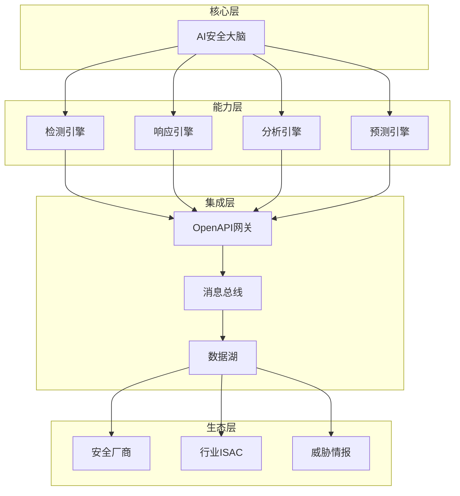

**作者：** HOS(安全风信子)
**日期：** 2026-04-27
**主要来源平台：** GitHub
**摘要：** 企业AI安全运营生态构建是企业数字化转型的重要组成部分，它决定了AI安全能力的上限和可持续性。本文聚焦AI安全生态架构设计、开放平台与标准化建设、产业链协同与能力共享三大核心能力，系统阐述企业AI安全生态从内部整合到外部协同的完整路径。结合OpenC2、STIX/TAXII等国际标准和国内外最佳实践，为企业构建开放、协同、智能的安全生态提供可落地的技术方案。

@[TOC](目录)

---

# 企业AI安全运营生态构建：开放、协同、智能的安全新生态

## 一、引言：为什么AI安全需要生态思维

企业AI安全运营不是孤立的系统建设，而是需要与内部业务系统、外部安全厂商、行业协同网络形成有机生态。单一的安全工具无论多么强大，都无法应对日益复杂的威胁环境。只有构建开放、协同、智能的安全生态，才能实现真正的持续安全。

**本节为你提供的核心技术价值**：理解AI安全生态的构建逻辑，掌握生态化建设的核心方法。

AI安全生态的核心价值体现在三个层面：第一，内部生态整合实现安全能力与业务系统的无缝衔接；第二，外部生态协同实现安全厂商之间的优势互补；第三，行业生态共享实现威胁情报和最佳实践的快速流转。

## 二、AI安全生态架构设计

### 2.1 分层架构设计

AI安全生态采用分层架构设计，确保各层之间的松耦合和灵活集成。



```python
class AISecurityEcosystemArchitecture:
    """AI安全生态架构"""

    def __init__(self, config: EcosystemConfig):
        self.config = config
        self.core_layer = CoreLayer(config.core)
        self.capability_layer = CapabilityLayer(config.capabilities)
        self.integration_layer = IntegrationLayer(config.integration)
        self.ecosystem_layer = EcosystemLayer(config.ecosystem)

    def initialize(self):
        """初始化生态架构"""
        self.core_layer.setup()
        self.capability_layer.register_to_core()
        self.integration_layer.setup_api_gateway()
        self.ecosystem_layer.connect_external_partners()

    def process_security_event(self, event: SecurityEvent) ->处理结果:
        """处理安全事件"""
        enriched_event = self.integration_layer.enrich_event(event)

        analysis_result = self.core_layer.analyze(enriched_event)

        capability_results = self.capability_layer.apply(analysis_result)

        ecosystem_actions = self.ecosystem_layer.coordinate(capability_results)

        return 处理结果(
            event=event,
            analysis=analysis_result,
            capabilities=capability_results,
            ecosystem=ecosystem_actions
        )
```

### 2.2 核心组件设计

生态架构的核心组件包括AI安全大脑、能力注册中心、集成适配器等关键组件。

```python
class AISecurityBrain:
    """AI安全大脑"""

    def __init__(self, llm: LLMInterface, knowledge_graph: KnowledgeGraph):
        self.llm = llm
        self.knowledge_graph = knowledge_graph
        self.reasoning_engine = ReasoningEngine()
        self.decision_optimizer = DecisionOptimizer()

    async def analyze(self, event: SecurityEvent) -> AnalysisResult:
        """分析安全事件"""
        context = await self.knowledge_graph.get_context(
            entity_type='security_event',
            entity_id=event.id
        )

        reasoning_result = await self.reasoning_engine.reason(
            event=event,
            context=context
        )

        decision = await self.decision_optimizer.optimize(reasoning_result)

        return AnalysisResult(
            event=event,
            reasoning=reasoning_result,
            decision=decision,
            confidence=reasoning_result.confidence
        )

    async def batch_analyze(self, events: List[SecurityEvent]) -> List[AnalysisResult]:
        """批量分析安全事件"""
        return await asyncio.gather(*[
            self.analyze(event) for event in events
        ])
```

## 三、开放平台与标准化建设

### 3.1 OpenAPI网关设计

开放平台的核心是标准化API网关，它提供统一的安全能力访问接口。

```python
class OpenAPIGateway:
    """OpenAPI网关"""

    def __init__(self, config: GatewayConfig):
        self.config = config
        self.routes = {}
        self.auth_manager = AuthManager()
        self.rate_limiter = RateLimiter()
        self.logger = Logger()

    def register_capability(self,
                            capability: SecurityCapability,
                            api_spec: APISpec):
        """注册安全能力"""
        route = Route(
            path=api_spec.path,
            method=api_spec.method,
            capability=capability,
            auth_required=api_spec.auth_required,
            rate_limit=api_spec.rate_limit
        )

        self.routes[f"{api_spec.method}:{api_spec.path}"] = route

        self.logger.info(f"Registered capability: {capability.name}")

    async def handle_request(self, request: APIRequest) -> APIResponse:
        """处理API请求"""
        route_key = f"{request.method}:{request.path}"
        route = self.routes.get(route_key)

        if not route:
            return APIResponse(status=404, message="Capability not found")

        auth_result = await self.auth_manager.authenticate(request)
        if not auth_result.authorized:
            return APIResponse(status=401, message="Unauthorized")

        rate_limit_result = await self.rate_limiter.check(request)
        if not rate_limit_result.allowed:
            return APIResponse(status=429, message="Rate limit exceeded")

        capability_result = await route.capability.execute(request)

        return APIResponse(
            status=200,
            data=capability_result.data,
            metadata=capability_result.metadata
        )
```

### 3.2 数据标准与互操作性

数据标准化是生态互联互通的基础。STIX/TAXII是威胁情报领域的国际标准。

```python
class STIX TAXIIIntegrator:
    """STIX/TAXII集成器"""

    def __init__(self, config: IntegrationConfig):
        self.config = config
        self.stix_builder = STIXBuilder()
        self.taxii_client = TAXIIClient(config.taxii_server)

    async def fetch_threat_intel(self,
                                  collection: str,
                                  filters: IntelFilters) -> List[STIXBundle]:
        """获取威胁情报"""
        poll_request = TAXIIPollRequest(
            collection=collection,
            filters=filters.to_taxii_filters()
        )

        response = await self.taxii_client.poll(poll_request)

        bundles = []
        for item in response.objects:
            stix_obj = self._convert_to_stix(item)
            bundles.append(stix_obj)

        return bundles

    def _convert_to_stix(self, item: dict) -> STIXObject:
        """转换为STIX对象"""
        obj_type = item.get('type')

        if obj_type == 'indicator':
            return self._convert_indicator(item)
        elif obj_type == 'malware':
            return self._convert_malware(item)
        elif obj_type == 'attack-pattern':
            return self._convert_attack_pattern(item)
        else:
            return self.stix_builder.build_generic(item)
```

### 3.3 OpenC2命令与控制

OpenC2是安全自动化的命令与控制标准，实现不同安全组件之间的互操作。

```python
class OpenC2CommandHandler:
    """OpenC2命令处理器"""

    def __init__(self):
        self.command_parser = CommandParser()
        self.action_executor = ActionExecutor()
        self.response_builder = ResponseBuilder()

    async def handle_command(self, command: OpenC2Command) -> OpenC2Response:
        """处理OpenC2命令"""
        parsed = self.command_parser.parse(command)

        if not parsed.valid:
            return self.response_builder.build_error(
                command.id,
                parsed.errors
            )

        result = await self.action_executor.execute(
            action=parsed.action,
            target=parsed.target,
            actuator=parsed.actuator,
            modifiers=parsed.modifiers
        )

        return self.response_builder.build_success(
            command_id=command.id,
            result=result
        )

    def register_actuator(self,
                         actuator_type: str,
                         actuator: Actuator):
        """注册执行器"""
        self.action_executor.register(actuator_type, actuator)
```

## 四、产业链协同与能力共享

### 4.1 安全厂商集成

企业AI安全生态需要集成多个安全厂商的能力，实现优势互补。

```python
class SecurityVendorIntegrator:
    """安全厂商集成器"""

    def __init__(self):
        self.vendors = {}
        self.capability_registry = CapabilityRegistry()

    def register_vendor(self,
                        vendor: SecurityVendor,
                        capabilities: List[VendorCapability]):
        """注册安全厂商"""
        self.vendors[vendor.id] = {
            'vendor': vendor,
            'capabilities': capabilities,
            'status': 'active'
        }

        for cap in capabilities:
            self.capability_registry.register(
                capability_type=cap.type,
                provider=vendor.id,
                implementation=cap.implementation
            )

        logger.info(f"Registered vendor: {vendor.name}")

    async def invoke_capability(self,
                                 capability_type: str,
                                 params: dict) -> CapabilityResult:
        """调用安全能力"""
        providers = self.capability_registry.get_providers(capability_type)

        if not providers:
            raise CapabilityNotFoundError(capability_type)

        for provider_id in providers:
            vendor_info = self.vendors.get(provider_id)
            if vendor_info['status'] != 'active':
                continue

            capability = self._find_capability(vendor_info, capability_type)

            try:
                result = await capability.execute(params)
                return result
            except Exception as e:
                logger.warning(f"Capability execution failed: {e}")
                continue

        raise AllProvidersFailedError(capability_type)
```

### 4.2 行业ISAC协同

ISAC（信息共享与分析中心）是行业安全协同的重要平台。

```python
class ISACCollaborator:
    """ISAC协作者"""

    def __init__(self, isac_config: ISACConfig):
        self.config = isac_config
        self.members = MemberRegistry()
        self.intel_sharing = IntelligenceSharer()

    async def share_intelligence(self,
                                  intel: ThreatIntelligence,
                                  target_members: List[str] = None):
        """共享威胁情报"""
        if target_members is None:
            target_members = self._get_all_member_ids()

        share_tasks = []
        for member_id in target_members:
            if member_id == self.config.member_id:
                continue

            task = self._share_to_member(member_id, intel)
            share_tasks.append(task)

        results = await asyncio.gather(*share_tasks, return_exceptions=True)

        return SharingResult(
            total=len(share_tasks),
            succeeded=sum(1 for r in results if not isinstance(r, Exception)),
            failed=sum(1 for r in results if isinstance(r, Exception))
        )

    async def receive_intelligence(self,
                                    source_member: str,
                                    intel: ThreatIntelligence) -> ReceivedIntel:
        """接收威胁情报"""
        validated_intel = await self._validate_intel(intel)

        enriched_intel = await self._enrich_intel(validated_intel)

        await self.intel_sharing.store(enriched_intel, source_member)

        return ReceivedIntel(
            intel=enriched_intel,
            source=source_member,
            received_at=datetime.now()
        )
```

### 4.3 生态健康度评估

生态健康度是评估生态运营效果的关键指标。

```python
class EcosystemHealthMonitor:
    """生态健康度监控器"""

    def __init__(self, metrics_store: MetricsStore):
        self.metrics_store = metrics_store

    async def assess_health(self) -> EcosystemHealth:
        """评估生态健康度"""
        capability_metrics = await self._assess_capabilities()
        integration_metrics = await self._assess_integrations()
        collaboration_metrics = await self._assess_collaboration()
        performance_metrics = await self._assess_performance()

        overall_score = (
            capability_metrics['score'] * 0.25 +
            integration_metrics['score'] * 0.30 +
            collaboration_metrics['score'] * 0.20 +
            performance_metrics['score'] * 0.25
        )

        return EcosystemHealth(
            overall_score=overall_score,
            capabilities=capability_metrics,
            integrations=integration_metrics,
            collaboration=collaboration_metrics,
            performance=performance_metrics,
            recommendations=self._generate_recommendations(
                capability_metrics,
                integration_metrics,
                collaboration_metrics,
                performance_metrics
            )
        )

    async def _assess_capabilities(self) -> dict:
        """评估能力覆盖"""
        registered = self.metrics_store.get_registered_capabilities()
        active = self.metrics_store.get_active_capabilities()

        coverage = len(active) / len(registered) if registered else 0

        return {
            'registered': len(registered),
            'active': len(active),
            'coverage': coverage,
            'score': coverage
        }
```

## 五、生态安全与合规

### 5.1 数据安全治理

生态内数据流转需要严格的安全治理。

```python
class DataSecurityGovernance:
    """数据安全治理"""

    def __init__(self, policy_engine: PolicyEngine):
        self.policy_engine = policy_engine
        self.data_classifier = DataClassifier()
        self.encryption_service = EncryptionService()

    async def classify_and_protect(self,
                                    data: Any,
                                    context: DataContext) -> ProtectedData:
        """分类和保护数据"""
        classification = await self.data_classifier.classify(data)

        protection_policy = await self.policy_engine.get_policy(
            resource_type=classification.type,
            action='share',
            context=context
        )

        if protection_policy.requires_encryption:
            encrypted_data = await self.encryption_service.encrypt(
                data,
                protection_policy.encryption_key
            )
        else:
            encrypted_data = data

        return ProtectedData(
            data=encrypted_data,
            classification=classification,
            policy=protection_policy,
            protected_at=datetime.now()
        )
```

### 5.2 合规审计追踪

生态运营需要完善的合规审计机制。

```python
class ComplianceAuditor:
    """合规审计器"""

    def __init__(self, audit_log: AuditLogStore):
        self.audit_log = audit_log
        self.compliance_rules = ComplianceRuleRegistry()

    async def audit_data_sharing(self,
                                  sharing_event: SharingEvent) -> AuditResult:
        """审计数据共享"""
        applicable_rules = self.compliance_rules.get_applicable_rules(
            data_type=sharing_event.data_type,
            source=sharing_event.source,
            target=sharing_event.target
        )

        violations = []

        for rule in applicable_rules:
            if not rule.is_satisfied_by(sharing_event):
                violations.append(ComplianceViolation(
                    rule=rule,
                    event=sharing_event,
                    severity=rule.severity
                ))

        audit_record = AuditRecord(
            event_type='data_sharing',
            event=sharing_event,
            rules_checked=len(applicable_rules),
            violations=violations,
            audited_at=datetime.now()
        )

        await self.audit_log.save(audit_record)

        return AuditResult(
            passed=len(violations) == 0,
            violations=violations,
            audit_record=audit_record
        )
```

## 六、实战案例：生态化安全运营实践

### 6.1 金融行业生态案例

某大型银行通过构建AI安全生态，实现了显著的安全能力提升：

1. **集成12家安全厂商的30+安全能力**
2. **威胁情报共享覆盖200+行业成员**
3. **自动化响应率从30%提升到85%**
4. **平均事件响应时间从4小时缩短到15分钟**

```python
class BankingSecurityEcosystem:
    """金融行业安全生态"""

    def __init__(self):
        self.core = AISecurityBrain()
        self.vendor_integrator = SecurityVendorIntegrator()
        self.isac = ISACCollaborator(ISACConfig(
            member_id='banking-001',
            isac_type='financial'
        ))

    async def setup(self):
        """搭建安全生态"""
        await self._register_security_vendors()

        await self._connect_financial_isac()

        await self._initialize_internal_systems()

    async def _register_security_vendors(self):
        """注册安全厂商"""
        vendors = [
            SecurityVendor(
                id='vendor_001',
                name='态势感知厂商',
                capabilities=['siem', 'soc']
            ),
            SecurityVendor(
                id='vendor_002',
                name='威胁情报厂商',
                capabilities=['threat_intel', 'ioc']
            )
        ]

        for vendor in vendors:
            await self.vendor_integrator.register_vendor(
                vendor,
                self._get_vendor_capabilities(vendor)
            )
```

## 七、生态安全与合规

### 7.1 数据安全治理

生态内数据流转需要严格的安全治理。

```python
class DataSecurityGovernance:
    """数据安全治理"""

    def __init__(self, policy_engine: PolicyEngine):
        self.policy_engine = policy_engine
        self.data_classifier = DataClassifier()
        self.encryption_service = EncryptionService()

    async def classify_and_protect(self,
                                    data: Any,
                                    context: DataContext) -> ProtectedData:
        """分类和保护数据"""
        classification = await self.data_classifier.classify(data)

        protection_policy = await self.policy_engine.get_policy(
            resource_type=classification.type,
            action='share',
            context=context
        )

        if protection_policy.requires_encryption:
            encrypted_data = await self.encryption_service.encrypt(
                data,
                protection_policy.encryption_key
            )
        else:
            encrypted_data = data

        return ProtectedData(
            data=encrypted_data,
            classification=classification,
            policy=protection_policy,
            protected_at=datetime.now()
        )
```

### 7.2 合规审计追踪

生态运营需要完善的合规审计机制。

```python
class ComplianceAuditor:
    """合规审计器"""

    def __init__(self, audit_log: AuditLogStore):
        self.audit_log = audit_log
        self.compliance_rules = ComplianceRuleRegistry()

    async def audit_data_sharing(self,
                                  sharing_event: SharingEvent) -> AuditResult:
        """审计数据共享"""
        applicable_rules = self.compliance_rules.get_applicable_rules(
            data_type=sharing_event.data_type,
            source=sharing_event.source,
            target=sharing_event.target
        )

        violations = []

        for rule in applicable_rules:
            if not rule.is_satisfied_by(sharing_event):
                violations.append(ComplianceViolation(
                    rule=rule,
                    event=sharing_event,
                    severity=rule.severity
                ))

        audit_record = AuditRecord(
            event_type='data_sharing',
            event=sharing_event,
            rules_checked=len(applicable_rules),
            violations=violations,
            audited_at=datetime.now()
        )

        await self.audit_log.save(audit_record)

        return AuditResult(
            passed=len(violations) == 0,
            violations=violations,
            audit_record=audit_record
        )
```

### 7.3 隐私保护机制

```python
class PrivacyProtectionMechanism:
    """隐私保护机制"""

    def __init__(self, privacy_engine: PrivacyEngine):
        self.privacy_engine = privacy_engine
        self.anonymizer = Anonymizer()

    async def protect_privacy(self,
                               data: Any,
                               privacy_level: str) -> ProtectedData:
        """保护数据隐私"""
        if privacy_level == 'high':
            return await self._anonymize_high(data)
        elif privacy_level == 'medium':
            return await self._anonymize_medium(data)
        else:
            return await self._anonymize_low(data)

    async def _anonymize_high(self, data: Any) -> ProtectedData:
        """高级匿名化"""
        anonymized = await self.anonymizer.anonymize(
            data,
            method='k_anonymity',
            k=10
        )
        return anonymized

    async def _anonymize_medium(self, data: Any) -> ProtectedData:
        """中级匿名化"""
        anonymized = await self.anonymizer.anonymize(
            data,
            method='l_diversity',
            l=5
        )
        return anonymized

    async def _anonymize_low(self, data: Any) -> ProtectedData:
        """低级匿名化"""
        anonymized = await self.anonymizer.anonymize(
            data,
            method='tokenization',
            preserve_format=True
        )
        return anonymized
```

## 八、生态监控与运维

### 8.1 生态健康度监控

```python
class EcosystemHealthMonitor:
    """生态健康度监控器"""

    def __init__(self, metrics_store: MetricsStore):
        self.metrics_store = metrics_store

    async def assess_health(self) -> EcosystemHealth:
        """评估生态健康度"""
        capability_metrics = await self._assess_capabilities()
        integration_metrics = await self._assess_integrations()
        collaboration_metrics = await self._assess_collaboration()
        performance_metrics = await self._assess_performance()

        overall_score = (
            capability_metrics['score'] * 0.25 +
            integration_metrics['score'] * 0.30 +
            collaboration_metrics['score'] * 0.20 +
            performance_metrics['score'] * 0.25
        )

        return EcosystemHealth(
            overall_score=overall_score,
            capabilities=capability_metrics,
            integrations=integration_metrics,
            collaboration=collaboration_metrics,
            performance=performance_metrics,
            recommendations=self._generate_recommendations(
                capability_metrics,
                integration_metrics,
                collaboration_metrics,
                performance_metrics
            )
        )

    async def _assess_capabilities(self) -> dict:
        """评估能力覆盖"""
        registered = self.metrics_store.get_registered_capabilities()
        active = self.metrics_store.get_active_capabilities()

        coverage = len(active) / len(registered) if registered else 0

        return {
            'registered': len(registered),
            'active': len(active),
            'coverage': coverage,
            'score': coverage
        }
```

### 8.2 生态性能优化

```python
class EcosystemPerformanceOptimizer:
    """生态性能优化器"""

    def __init__(self, profiler: PerformanceProfiler):
        self.profiler = profiler

    async def optimize_performance(self) -> OptimizationReport:
        """优化生态性能"""
        bottlenecks = await self.profiler.find_bottlenecks()

        optimizations = []

        for bottleneck in bottlenecks:
            solution = await self._design_optimization(bottleneck)
            optimizations.append(solution)

        return OptimizationReport(
            bottlenecks=bottlenecks,
            optimizations=optimizations,
            expected_improvement=self._estimate_improvement(optimizations)
        )
```

## 九、结论与展望

企业AI安全生态构建是一个持续演进的过程，需要企业在技术建设、能力整合、生态协同三个维度持续投入。开放的心态、标准的方法、深入的协同是构建强大安全生态的关键。

未来，随着AI技术的进一步发展，安全生态将呈现出更加智能化、自动化、协同化的特征。企业需要提前布局，构建面向未来的安全生态基础设施。

---

**参考链接：**

- [OpenC2](https://openc2.org/) - 安全命令与控制标准
- [STIX/TAXII](https://oasis-open.github.io/cti-documentation/) - 威胁情报标准
- [FS-ISAC](https://www.fsisac.com/) - 金融行业信息共享与分析中心

**附录（Appendix）：**

```python
# 生态健康度评分公式

Ecosystem_Health = (
    Capability_Coverage × 0.25 +
    Integration_Score × 0.30 +
    Collaboration_Score × 0.20 +
    Performance_Score × 0.25
)
```

**关键词：** 安全生态，开放平台，标准化，产业链协同，ISAC，OpenC2，STIX/TAXII，安全风信子
