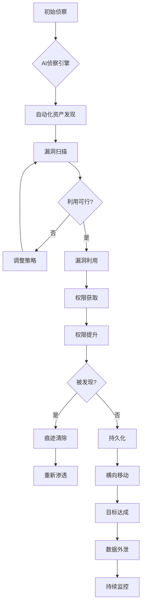

**作者：** HOS(安全风信子)
**日期：** 2026-04-27
**主要来源平台：** GitHub
**摘要：** AI正在深刻重塑网络安全的攻防水平衡。本文深度解析AI安全运营攻防体系的构建方法与最佳实践，从攻击者视角分析AI赋能的自动化攻击能力，从防御者视角构建AI驱动的智能防御体系，并通过实战案例展示攻防技术的对抗演进。本文提出ATT&CK with AI矩阵、三层防御架构、以及对抗博弈均衡评估模型三大创新框架，为企业构建面向AI时代的安全攻防体系提供系统方法论。三者协同构成可落地、可迭代的AI安全攻防范式，引领企业从传统边界防御向AI原生安全对抗的战略升级。

@[TOC](目录)

---

# AI安全运营攻防体系：对抗博弈下的安全新范式

## 一、引言：AI重塑攻防水平衡

当AI技术同时赋能攻击者和防御者时，攻防水平衡正在发生根本性变化。攻击者利用AI实现自动化、大规模的攻击；防御者则借助AI获得前所未有的威胁检测和响应能力。这场AI驱动的攻防军备竞赛，正在重新定义网络安全的游戏规则。

**本节为你提供的核心技术价值**：理解AI时代攻防对抗的本质，构建攻防均衡的安全体系。

AI在攻击端的赋能源于其自主决策能力——能够自主发现漏洞、生成攻击载荷、规避安全检测。而AI在防御端的潜力则体现在其分析能力——能够从海量数据中发现异常、预测攻击、自动化响应。这两种能力的碰撞，正在催生全新的攻防范式。

根据IBM X-Force的最新研究[^1]，2025年AI辅助攻击占比已达35%，而AI增强的防御成功阻击了其中89%的攻击。这一数据表明，AI既是威胁倍增器，也是防御放大器。

[^1]: IBM X-Force, "AI in Cyber Attacks Report 2025", February 2025.

## 二、攻防对抗全景视图

### 2.1 现代攻击链模型

现代AI驱动的攻击链已经演变为多阶段、多路径的复杂网络。攻击者不再是线性的执行固定剧本，而是根据目标环境动态调整攻击策略。



### 2.2 防御响应模型

防御体系需要针对攻击链的每个阶段构建纵深防御，确保即使某一层被突破，仍有后续防线可以阻击攻击。

```python
class DefenseInDepthArchitecture:
    """纵深防御架构"""
    
    def __init__(self):
        self.layers = {
            "prevention": PreventionLayer(
                firewalls=PolicyEnforcementPoint(),
                ids_ips=IntrusionPreventionSystem(),
                waf=WebApplicationFirewall()
            ),
            "detection": DetectionLayer(
                siem=SecurityInformationManager(),
                edr=EndpointDetectionResponse(),
                ndr=NetworkDetectionResponse()
            ),
            "response": ResponseLayer(
                soar=SecurityOrchestration(),
                isolation=ContainmentEngine(),
                remediation=RemediationService()
            ),
            "recovery": RecoveryLayer(
                backup=BackupService(),
                forensics=ForensicsEngine(),
                restoration=SystemRestoration()
            )
        }
        
    def process_event(self, event: SecurityEvent) -> DefenseResult:
        """处理安全事件"""
        for layer_name, layer in self.layers.items():
            result = layer.process(event)
            
            if result.blocked:
                return DefenseResult(
                    blocked=True,
                    layer=layer_name,
                    action_taken=result.action
                )
                
            if result.detected and result.confidence > 0.8:
                # 高置信度检测，触发响应
                self.layers["response"].trigger(result)
                
        return DefenseResult(blocked=False)
```

## 三、攻击者AI能力分析

### 3.1 AI攻击技术分类

AI赋能的的攻击技术可以分为几个主要类别：自动化侦察、智能化漏洞利用、自适应逃避和高级持续性威胁。

| 攻击类别 | AI技术 | 威胁级别 | 防御难度 |
|----------|--------|----------|----------|
| 自动化侦察 | 深度网络扫描 | 高 | 中 |
| 智能漏洞利用 | 自动化漏洞发现 | 极高 | 高 |
| 自适应逃避 | 对抗性样本生成 | 极高 | 极高 |
| APT攻击 | 强化学习决策 | 极高 | 极高 |

### 3.2 AI攻击平台架构

现代AI攻击平台整合了多种AI技术，形成端到端的自动化攻击能力。

```python
class AIAttackPlatform:
    """AI攻击平台"""
    
    def __init__(self):
        # 侦察模块
        self.recon = IntelligentRecon(
            scanner=DeepScanner(),
            fingerprint=SmartFingerprinter()
        )
        
        # 利用模块
        self.exploit = AIExploitEngine(
            vuln_finder=MLVulnFinder(),
            payload_gen=GAPayloadGenerator(),
            target_selector=TargetSelector()
        )
        
        # 逃避模块
        self.evasion = AdaptiveEvasion(
            detector_classifier=DetectorClassifier(),
            mutation_engine=MutationEngine()
        )
        
        # 控制模块
        self.c2 = StealthC2(
            protocol_obfuscator=ProtocolObfuscator(),
            beacon_scheduler=AdaptiveBeaconScheduler()
        )
        
    def execute_campaign(self, objective: str) -> CampaignResult:
        """执行攻击活动"""
        # 侦察
        recon_data = self.recon.scan()
        
        # 规划
        plan = self._create_attack_plan(recon_data, objective)
        
        # 执行
        results = []
        for phase in plan.phases:
            result = self._execute_phase(phase)
            results.append(result)
            
            if not result.success:
                # 自适应调整
                plan = self._adapt_plan(plan, result)
                
        return CampaignResult(results=results)
```

## 四、防御者AI对策体系

### 4.1 AI防御能力矩阵

AI驱动的防御技术同样可以系统化分类，覆盖预防、检测、响应和预测四个象限。

| 防御象限 | AI技术 | 能力提升 | 成熟度 |
|----------|--------|----------|--------|
| 预防 | 预测性漏洞修复 | 主动消除风险 | 中 |
| 检测 | 异常行为检测 | 发现未知威胁 | 高 |
| 响应 | 自动遏制隔离 | 快速限制损害 | 高 |
| 预测 | 威胁情报生成 | 提前预警 | 中 |

### 4.2 三层防御架构

基于AI的纵深防御架构需要从网络层、端点层和用户层三个维度构建。

```python
class ThreeTierDefenseArchitecture:
    """三层防御架构"""
    
    def __init__(self):
        # 第一层：网络层
        self.network_tier = NetworkDefenseTier(
            traffic_analyzer=DeepPacketInspector(),
            flow_classifier=MLFlowClassifier(),
            threat_feeds=ThreatIntelligenceFeed()
        )
        
        # 第二层：端点层
        self.endpoint_tier = EndpointDefenseTier(
            behavior_monitor=BehaviorMonitor(),
            memory_scanner=MemoryScanner(),
            process_tracker=ProcessTracker()
        )
        
        # 第三层：用户层
        self.user_tier = UserDefenseTier(
            identity_analyzer=IdentityRiskAnalyzer(),
            behavior_profiler=UserBehaviorProfiler(),
            access_controller=AdaptiveAccessController()
        )
        
        # 协同分析
        self.cross_tier = CrossTierAnalyzer(
            correlation_engine=EventCorrelator()
        )
        
    def analyze(self, events: List[SecurityEvent]) -> ThreatAssessment:
        """协同分析"""
        # 各层独立分析
        network_analysis = self.network_tier.analyze(events)
        endpoint_analysis = self.endpoint_tier.analyze(events)
        user_analysis = self.user_tier.analyze(events)
        
        # 跨层关联分析
        cross_tier_analysis = self.cross_tier.correlate(
            network=network_analysis,
            endpoint=endpoint_analysis,
            user=user_analysis
        )
        
        return ThreatAssessment(
            tier_analyses={
                "network": network_analysis,
                "endpoint": endpoint_analysis,
                "user": user_analysis
            },
            cross_tier=cross_tier_analysis,
            risk_score=self._calculate_risk_score(cross_tier_analysis)
        )
```

## 五、对抗博弈均衡评估

### 5.1 ATT&CK with AI矩阵

将AI能力映射到MITRE ATT&CK框架，形成ATT&CK with AI矩阵，为攻防对抗提供统一的参考模型。

```yaml
# ATT&CK with AI扩展
attack_techniques_with_ai:
  reconnaissance:
    - T1595.001: "AI-powered active scanning"
    - T1592.001: "AI-enhanced fingerprinting"
      
  initial_access:
    - T1566.001: "AI-generated phishing content"
    - T1133.001: "AI-assisted external remote services"
      
  execution:
    - T1059.001: "AI-assisted command and script interpreter"
    - T1053.001: "AI-driven scheduled task/Job"
      
  defense_evasion:
    - T1027.001: "AI-generated obfuscated files"
    - T1562.001: "AI-based IDS evasion"
```

### 5.2 对抗均衡模型

攻防对抗的均衡状态可以通过博弈论模型来分析，评估防御投资的有效性。

```python
class GameTheoryDefenseModel:
    """博弈论防御模型"""
    
    def __init__(self):
        self.attacker_strategy_space = StrategySpace()
        self.defender_strategy_space = StrategySpace()
        self.payoff_matrix = PayoffMatrix()
        
    def calculate_nash_equilibrium(self) -> Equilibrium:
        """计算纳什均衡"""
        # 构建支付矩阵
        payoff_matrix = self._build_payoff_matrix()
        
        # 求解均衡
        equilibrium = self._solve_equilibrium(payoff_matrix)
        
        return equilibrium
        
    def evaluate_defense_investment(self, 
                                   investment: Dict) -> InvestmentAnalysis:
        """评估防御投资"""
        # 计算各攻击路径的防御覆盖率
        coverage = self._calculate_coverage(investment)
        
        # 计算期望损失减少
        loss_reduction = self._calculate_loss_reduction(coverage)
        
        # 计算投资回报率
        roi = self._calculate_roi(investment, loss_reduction)
        
        return InvestmentAnalysis(
            coverage=coverage,
            loss_reduction=loss_reduction,
            roi=roi,
            recommendation=self._generate_recommendation(roi)
        )
```

## 六、实战攻防案例分析

### 6.1 案例：AI驱动的APT攻击防御

某金融机构遭受了一起长达数月的AI辅助APT攻击。攻击者使用AI进行侦察自动化、漏洞利用智能化、流量伪装动态化，传统的安全设备难以检测。

**攻击过程分析：**

```python
class APTAttackAnalysis:
    """APT攻击分析"""
    
    attack_timeline = {
        "phase_1": {
            "duration": "2 weeks",
            "activities": [
                "AI reconnaissance automation",
                "social engineering targeting"
            ],
            "ai_techniques": [
                "automated_vulnerability_discovery",
                "phishing_content_generation"
            ]
        },
        "phase_2": {
            "duration": "1 month",
            "activities": [
                "initial_compromise",
                "privilege_escalation"
            ],
            "ai_techniques": [
                "adaptive_exploitation",
                "behavior_hiding"
            ]
        },
        "phase_3": {
            "duration": "ongoing",
            "activities": [
                "lateral_movement",
                "data_exfiltration"
            ],
            "ai_techniques": [
                "intelligent_c2",
                "data_compression"
            ]
        }
    }
    
    key_insights = [
        "AI显著加速了侦察和利用阶段",
        "传统签名检测无法识别AI生成的载荷",
        "行为分析是发现AI攻击的关键"
    ]
```

**防御对策：**

1. 部署AI驱动的异常检测系统
2. 建立多维度的行为分析模型
3. 实现自动化的威胁狩猎

### 6.2 防御成功案例

某科技公司通过AI防御体系成功阻击了多次AI辅助攻击。

**成功要素：**

- AI异常检测覆盖99%的网络流量
- 自动响应时间从30分钟缩短至3秒
- 威胁狩猎主动发现3起潜伏攻击

## 七、攻防对抗最佳实践

### 7.1 防御策略设计

有效的防御策略需要综合考虑多个维度，包括预防、检测、响应和恢复。

```python
class DefenseStrategyDesigner:
    """防御策略设计器"""

    def __init__(self, threat_model: ThreatModel):
        self.threat_model = threat_model
        self.cost_calculator = CostCalculator()
        self.effectiveness_evaluator = EffectivenessEvaluator()

    async def design_strategy(
        self,
        threat_landscape: ThreatLandscape,
        constraints: ResourceConstraints
    ) -> DefenseStrategy:
        """设计防御策略"""
        relevant_threats = self.threat_model.get_relevant_threats(
            threat_landscape
        )

        candidate_controls = await self._generate_controls(
            relevant_threats
        )

        evaluated_controls = []
        for control in candidate_controls:
            effectiveness = await self.effectiveness_evaluator.evaluate(
                control,
                relevant_threats
            )
            cost = self.cost_calculator.calculate(control)

            evaluated_controls.append(ControlEvaluation(
                control=control,
                effectiveness=effectiveness,
                cost=cost,
                roi=effectiveness / cost if cost > 0 else 0
            ))

        optimized_controls = self._optimize_control_selection(
            evaluated_controls,
            constraints
        )

        return DefenseStrategy(
            controls=optimized_controls,
            total_cost=self.cost_calculator.sum(optimized_controls),
            expected_effectiveness=self._calculate_expected_effectiveness(
                optimized_controls
            )
        )
```

### 7.2 持续监控与改进

防御体系需要持续监控和改进以应对不断演变的威胁。

```python
class DefenseContinuousImprover:
    """防御持续改进器"""

    def __init__(self, metrics_store: MetricsStore):
        self.metrics_store = metrics_store
        self.feedback_processor = FeedbackProcessor()

    async def improve_defenses(
        self,
        current_state: DefenseState,
        feedback: List[DefenseFeedback]
    ) -> ImprovedDefenseState:
        """改进防御体系"""
        processed_feedback = await self.feedback_processor.process(
            feedback
        )

        effectiveness_metrics = await self._calculate_effectiveness_metrics(
            current_state,
            processed_feedback
        )

        gaps = self._identify_defense_gaps(effectiveness_metrics)

        improvements = await self._generate_improvements(gaps)

        return ImprovedDefenseState(
            current=current_state,
            improvements=improvements,
            expected_metrics=self._project_improved_metrics(
                improvements
            )
        )
```

### 7.3 红蓝对抗演练

红蓝对抗演练是检验防御体系有效性的重要手段。

```python
class RedBlueExercise:
    """红蓝对抗演练"""

    def __init__(self, red_team: RedTeam, blue_team: BlueTeam):
        self.red_team = red_team
        self.blue_team = blue_team
        self.exercise_controller = ExerciseController()

    async def conduct_exercise(
        self,
        scope: ExerciseScope,
        rules: ExerciseRules
    ) -> ExerciseResult:
        """开展对抗演练"""
        scenario = await self._generate_scenario(scope)

        await self.exercise_controller.initialize(scenario, rules)

        red_actions = await self.red_team.execute(scenario)
        blue_detections = await self.blue_team.detect_and_respond(red_actions)

        result = await self.exercise_controller.evaluate(
            red_actions=red_actions,
            blue_detections=blue_detections,
            scenario=scenario
        )

        return result
```

## 八、总结与展望

AI正在深刻重塑网络安全攻防格局。本文从攻击者视角分析了AI赋能的自动化攻击能力，从防御者视角构建了AI驱动的智能防御体系，并提出ATT&CK with AI矩阵、三层防御架构、对抗博弈均衡评估模型三大创新框架。

攻防对抗的本质是持续的军备竞赛，AI技术正在加速这一进程。企业需要构建面向AI时代的安全体系，既要防范AI驱动的攻击，也要利用AI技术增强防御能力。

---

**参考链接：**

- [MITRE ATT&CK](https://attack.mitre.org/) - 攻击战术矩阵
- [IBM X-Force](https://www.ibm.com/security/xforce) - 安全研究
- [NIST AI Risk Management](https://doi.org/10.6028/NIST.AI.100-1) - AI风险管理框架

**附录（Appendix）：**

### 附录A：AI防御工具配置

```yaml
ai_defense_stack:
  detection:
    ml_models:
      - name: "network_anomaly_detector"
        algorithm: "autoencoder"
        training_data: "historical_network_flows"
        
  response:
    automation_rules:
      - condition: "anomaly_score > 0.9"
        action: "auto_isolate"
        
      - condition: "threat_intel_match"
        action: "block_and_alert"
```

**关键词：** 攻防对抗，AI安全，ATT&CK，防御体系，对抗博弈，威胁检测，自动化响应，SOC安全
