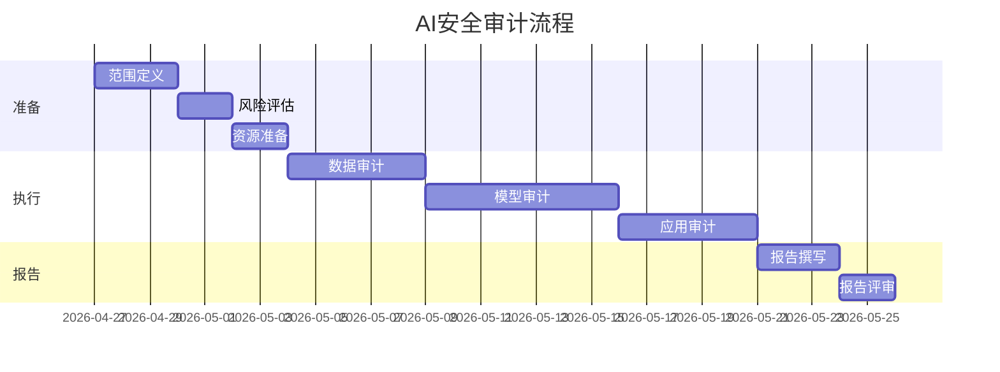

**作者：** HOS(安全风信子)
**日期：** 2026-04-27
**主要来源平台：** GitHub
**摘要：** AI安全审计是保障企业AI安全运营的关键机制。本文深度解析AI安全审计框架设计的核心要素，涵盖算法审计与可解释性、合规审计与留痕、审计自动化实现、持续审计与监控等关键技术方案。研究提出三层AI审计架构、可解释性评估矩阵、持续审计监控体系三大核心框架，为企业构建完善的AI安全审计机制提供系统方法论与最佳实践指南。

@[TOC](目录)

---

# AI安全运营审计机制：构建可解释、可追溯的AI安全体系

## 一、引言：为什么AI需要专门的审计机制

当AI系统做出影响业务决策时，如何确保这些决策是公正、透明、可追溯的？传统的IT审计方法难以满足AI系统的特殊需求——模型可能存在偏见、决策过程不透明、且难以解释。这促使我们必须建立专门的AI安全审计机制。

**本节为你提供的核心技术价值**：理解AI审计的特殊需求，掌握AI安全审计框架的设计原则。

AI审计面临三大独特挑战：首先是算法不透明性——深度学习模型的决策过程如同黑箱，难以解释；其次是数据依赖性——模型性能依赖训练数据，数据偏见会传导到模型输出；最后是动态演化性——模型持续学习更新，审计基准需要动态调整。

根据Gartner的研究[^1]，到2027年超过40%的企业将面临AI相关的合规审计要求。

[^1]: Gartner, "AI Governance Report 2025", Q1 2025.

## 二、AI安全审计框架设计

### 2.1 三层审计架构

AI安全审计需要从数据层、模型层和应用层三个维度构建。

```python
class ThreeTierAuditArchitecture:
    """三层AI审计架构"""
    
    def __init__(self):
        # 数据层审计
        self.data_audit = DataAuditLayer(
            lineage_tracker=DataLineageTracker(),
            quality_analyzer=DataQualityAnalyzer(),
            bias_detector=BiasDetector()
        )
        
        # 模型层审计
        self.model_audit = ModelAuditLayer(
            explainer=ModelExplainer(),
            robustness_tester=RobustnessTester(),
            fairness_evaluator=FairnessEvaluator()
        )
        
        # 应用层审计
        self.application_audit = ApplicationAuditLayer(
            decision_logger=DecisionLogger(),
            impact_assessor=ImpactAssessor(),
            compliance_checker=ComplianceChecker()
        )
        
    def conduct_audit(self, audit_scope: AuditScope) -> AuditReport:
        """执行审计"""
        results = {}
        
        # 数据层审计
        if audit_scope.include_data:
            results["data_audit"] = self.data_audit.audit()
            
        # 模型层审计
        if audit_scope.include_model:
            results["model_audit"] = self.model_audit.audit()
            
        # 应用层审计
        if audit_scope.include_application:
            results["application_audit"] = self.application_audit.audit()
            
        return AuditReport(results=results)
```

### 2.2 审计流程设计

审计流程需要覆盖准备、执行、报告和跟踪四个阶段。



## 三、算法审计与可解释性

### 3.1 可解释性评估矩阵

不同应用场景对可解释性的要求不同，需要建立评估矩阵。

```python
class ExplainabilityEvaluationMatrix:
    """可解释性评估矩阵"""
    
    CRITERIA = {
        "transparency": {
            "weight": 0.3,
            "metrics": ["feature_importance", "decision_path", "rule_extraction"]
        },
        "interpretability": {
            "weight": 0.25,
            "metrics": ["simple_explanation", "human_readable", "counterfactual"]
        },
        "accountability": {
            "weight": 0.25,
            "metrics": ["audit_trail", "attribution", "appeal_process"]
        },
        "fairness": {
            "weight": 0.2,
            "metrics": ["group_fairness", "individual_fairness", "counterfactual_fairness"]
        }
    }
    
    def evaluate(self, model: AIModel, test_data: Dataset) -> ExplainabilityScore:
        """评估可解释性"""
        scores = {}
        
        for criterion, config in self.CRITERIA.items():
            metric_scores = []
            for metric in config["metrics"]:
                score = self._calculate_metric(model, test_data, metric)
                metric_scores.append(score)
                
            scores[criterion] = sum(metric_scores) / len(metric_scores)
            
        # 加权总分
        weighted_score = sum(
            scores[c] * self.CRITERIA[c]["weight"] 
            for c in scores
        )
        
        return ExplainabilityScore(
            overall=weighted_score,
            criteria=scores
        )
```

### 3.2 公平性审计

公平性是AI审计的核心关注点之一。

```python
class FairnessAuditor:
    """公平性审计器"""
    
    def __init__(self):
        self.fairness_metrics = FairnessMetrics()
        
    def audit_fairness(self, model: AIModel, 
                      test_data: Dataset) -> FairnessReport:
        """审计公平性"""
        protected_attributes = test_data.get_protected_attributes()
        outcomes = model.predict(test_data)
        
        results = {}
        
        # 统计均等
        for attr in protected_attributes:
            results[f"statistical_parity_{attr}"] = \
                self.fairness_metrics.statistical_parity(
                    outcomes, test_data[attr]
                )
                
        # 均等机会
        for attr in protected_attributes:
            results[f"equal_opportunity_{attr}"] = \
                self.fairness_metrics.equal_opportunity(
                    outcomes, test_data[attr], test_data.get_outcome()
                )
                
        return FairnessReport(metrics=results)
```

## 四、合规审计与留痕

### 4.1 审计日志设计

完整的审计日志是合规的基础，需要记录所有关键操作。

```python
class AuditLogger:
    """审计日志系统"""
    
    def __init__(self, storage: LogStorage):
        self.storage = storage
        self.signer = IntegritySigner()
        
    def log_decision(self, decision: ModelDecision) -> LogEntry:
        """记录决策"""
        entry = LogEntry(
            timestamp=datetime.now(),
            decision_id=decision.id,
            model_id=decision.model_id,
            input_hash=self._hash(decision.input),
            output=decision.output,
            confidence=decision.confidence,
            metadata=decision.context_metadata
        )
        
        # 签名保证完整性
        entry.signature = self.signer.sign(entry)
        
        # 存储
        self.storage.store(entry)
        
        return entry
        
    def verify_log(self, entry: LogEntry) -> bool:
        """验证日志完整性"""
        return self.signer.verify(entry)
```

### 4.2 合规检查清单

| 合规要求 | 检查项 | 证据类型 |
|----------|--------|----------|
| GDPR Article 22 | 自动化决策解释 | 可解释性报告 |
| 数据保护 | 处理合法性基础 | 法律依据文档 |
| 记录保留 | 审计日志完整性 | 日志备份记录 |
| 权限管理 | 访问控制审计 | 权限变更记录 |

## 五、AI安全审计技术深度

### 5.1 审计数据分析引擎

审计数据分析引擎用于从海量审计数据中提取有价值的信息。

```python
class AuditAnalyticsEngine:
    """审计数据分析引擎"""

    def __init__(self, data_store: AuditDataStore):
        self.data_store = data_store
        self.pattern_detector = PatternDetector()
        self.anomaly_detector = AnomalyDetector()

    async def analyze_audit_trail(
        self,
        time_range: TimeRange
    ) -> AnalyticsResult:
        """分析审计轨迹"""
        raw_data = await self.data_store.get_range(time_range)

        patterns = await self.pattern_detector.detect(raw_data)

        anomalies = await self.anomaly_detector.detect(raw_data)

        correlations = await self._find_correlations(raw_data)

        return AnalyticsResult(
            patterns=patterns,
            anomalies=anomalies,
            correlations=correlations,
            summary=await self._generate_summary(
                patterns,
                anomalies,
                correlations
            )
        )
```

### 5.2 实时监控与告警

实时监控与告警系统用于及时发现审计异常事件。

```python
class RealTimeAuditMonitor:
    """实时审计监控"""

    def __init__(self, monitor_config: MonitorConfig):
        self.config = monitor_config
        self.stream_processor = StreamProcessor()
        self.alert_manager = AlertManager()

    async def start_monitoring(self):
        """启动监控"""
        await self.stream_processor.subscribe(
            topic='audit_events',
            handler=self._process_event
        )

    async def _process_event(self, event: AuditEvent):
        """处理审计事件"""
        risk_score = await self._calculate_risk_score(event)

        if risk_score > self.config.threshold:
            await self.alert_manager.create_alert(
                event=event,
                risk_score=risk_score,
                priority=self._determine_priority(risk_score)
            )
```

### 5.3 合规报告生成

合规报告生成系统用于自动生成符合监管要求的审计报告。

```python
class ComplianceReportGenerator:
    """合规报告生成器"""

    def __init__(self, template_engine: TemplateEngine):
        self.template_engine = template_engine
        self.report_store = ReportStore()

    async def generate_report(
        self,
        report_type: str,
        time_range: TimeRange,
        compliance_framework: str
    ) -> ComplianceReport:
        """生成合规报告"""
        evidence = await self._collect_evidence(
            report_type,
            time_range,
            compliance_framework
        )

        gaps = await self._identify_compliance_gaps(
            evidence,
            compliance_framework
        )

        report_content = await self.template_engine.render(
            template=report_type,
            context={
                'evidence': evidence,
                'gaps': gaps,
                'time_range': time_range,
                'framework': compliance_framework
            }
        )

        report = ComplianceReport(
            content=report_content,
            framework=compliance_framework,
            generated_at=datetime.now()
        )

        await self.report_store.save(report)

        return report
```

## 六、AI安全审计最佳实践

### 6.1 审计策略设计

设计有效的AI审计策略需要综合考虑多个因素。

```python
class AuditStrategyDesigner:
    """审计策略设计器"""

    def __init__(self, risk_assessor: RiskAssessor):
        self.risk_assessor = risk_assessor
        self.resource_allocator = ResourceAllocator()

    async def design_strategy(
        self,
        ai_systems: List[AISystem],
        available_resources: Resources
    ) -> AuditStrategy:
        """设计审计策略"""
        risk_assessments = []
        for system in ai_systems:
            risk = await self.risk_assessor.assess(system)
            risk_assessments.append((system, risk))

        sorted_systems = sorted(
            risk_assessments,
            key=lambda x: x[1].overall_risk,
            reverse=True
        )

        allocated_resources = await self.resource_allocator.allocate(
            sorted_systems,
            available_resources
        )

        return AuditStrategy(
            prioritized_systems=sorted_systems,
            resource_allocation=allocated_resources,
            coverage=self._calculate_coverage(
                sorted_systems,
                allocated_resources
            )
        )
```

### 6.2 持续改进机制

审计体系需要持续改进以适应新的威胁和合规要求。

```python
class AuditContinuousImprover:
    """审计持续改进器"""

    def __init__(self, feedback_store: FeedbackStore):
        self.feedback_store = feedback_store
        self.lesson_learned_processor = LessonLearnedProcessor()

    async def improve_audit_process(
        self,
        current_process: AuditProcess,
        feedback: List[AuditFeedback]
    ) -> ImprovedAuditProcess:
        """改进审计流程"""
        processed_feedback = await self.feedback_store.process(feedback)

        lessons_learned = await self.lesson_learned_processor.extract(
            processed_feedback
        )

        improvements = await self._generate_improvements(
            lessons_learned
        )

        return ImprovedAuditProcess(
            current=current_process,
            improvements=improvements,
            expected_benefits=self._estimate_benefits(improvements)
        )
```

## 七、总结与展望

AI安全审计是保障AI系统可信、合规的关键机制。通过三层审计架构、可解释性评估矩阵和持续监控体系的构建，企业可以建立完善的AI审计能力。

---

**参考链接：**

- [NIST AI Risk Management Framework](https://doi.org/10.6028/NIST.AI.100-1)
- [EU AI Act](https://artificialintelligenceact.eu/)
- [IBM AI Fairness 360](https://github.com/IBM/AIF360)

**关键词：** AI审计，可解释性，公平性，合规，审计日志，透明性，AI治理
