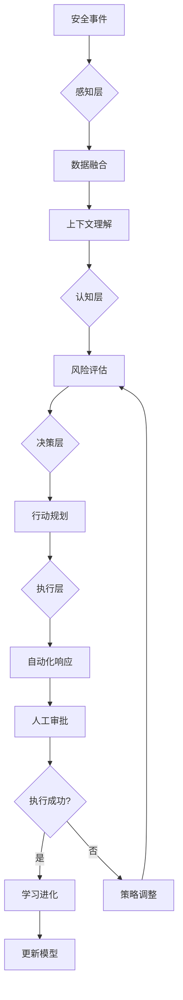

**作者：** HOS(安全风信子)
**日期：** 2026-04-27
**主要来源平台：** GitHub
**摘要：** 下一代自主化SOC代表了安全运营的未来方向。本文深度解析Agentic SOC的架构设计与核心技术，包括自主感知与决策能力、自我进化与学习机制、人机协同新范式等关键要素。研究提出四层自主架构、感知-决策-执行闭环、自适应学习引擎三大核心框架，为企业构建面向未来的自主化SOC提供系统方法论与技术路线图。

@[TOC](目录)

---

# 下一代自主化SOC：迈向安全运营的无人驾驶

## 一、引言：从自动化到自主化

传统SOC经历了从手工到自动化的发展历程，但真正的革命性变化是向自主化的跨越。Agentic SOC不仅仅是自动化地执行预设任务，而是能够自主感知环境、自主决策行动、自主学习进化。

**本节为你提供的核心技术价值**：理解Agentic SOC的本质特征，掌握自主化SOC架构设计的核心原则。

如果说自动化是"让机器按照人的指令执行"，那么自主化就是"让机器像人一样思考和行动"。Agentic SOC中的AI Agent能够理解安全态势、评估风险、做出决策、采取行动，而不需要人类的持续指导。

根据Gartner预测[^1]，到2028年超过50%的大型企业将部署某种形式的Agentic SOC。

[^1]: Gartner, "Security Operations Future 2028", December 2025.

## 二、Agentic SOC架构设计

### 2.1 四层自主架构

Agentic SOC采用感知层、认知层、决策层和执行层的四层架构。

```python
class AgenticSOCArchitecture:
    """Agentic SOC四层架构"""
    
    def __init__(self):
        # 感知层
        self.perception = PerceptionLayer(
            data_sources=["siem", "edr", "ndr", "threat_intel"],
            sensor_fusion=SensorFusionEngine()
        )
        
        # 认知层
        self.cognition = CognitionLayer(
            context_builder=ContextBuilder(),
            pattern_recognizer=PatternRecognizer(),
            anomaly_detector=AnomalyDetector()
        )
        
        # 决策层
        self.decision = DecisionLayer(
            planner=StrategicPlanner(),
            risk_evaluator=RiskEvaluator(),
            action_selector=ActionSelector()
        )
        
        # 执行层
        self.execution = ExecutionLayer(
            orchestrator=Orchestrator(),
            automation_engine=AutomationEngine(),
            human_interface=HumanInterface()
        )
        
    def process_security_event(self, event: SecurityEvent) -> SOCResponse:
        """处理安全事件"""
        # 感知
        context = self.perception.sense(event)
        
        # 认知
        understanding = self.cognition.understand(context)
        
        # 决策
        decision = self.decision.decide(understanding)
        
        # 执行
        response = self.execution.act(decision)
        
        # 学习反馈
        self._learn_from_response(response)
        
        return response
```

### 2.2 自主感知与决策能力

Agentic SOC的核心是构建类人的感知-决策闭环。



## 三、自我进化与学习机制

### 3.1 自适应学习引擎

Agentic SOC需要持续从历史事件中学习，不断提升能力。

```python
class AdaptiveLearningEngine:
    """自适应学习引擎"""
    
    def __init__(self):
        self.experience_db = ExperienceDatabase()
        self.model_updater = ModelUpdater()
        self.evaluation = PerformanceEvaluator()
        
    def learn_from_event(self, event: SecurityEvent, 
                        response: SOCResponse) -> LearningUpdate:
        """从事件中学习"""
        # 提取经验
        experience = ExperienceExtractor.extract(event, response)
        
        # 存储经验
        self.experience_db.store(experience)
        
        # 评估效果
        performance = self.evaluation.evaluate(response)
        
        # 如果效果不佳，更新模型
        if performance.score < self.threshold:
            updates = self.model_updater.generate_updates(
                experience, performance
            )
            self.model_updater.apply(updates)
            
        return LearningUpdate(
            experience_stored=True,
            model_updated=performance.score < self.threshold,
            improvement=performance.improvement
        )
```

## 四、人机协同新范式

### 4.1 人类角色转变

在Agentic SOC中，人类从执行者转变为监督者和决策者。

| 传统SOC角色 | Agentic SOC角色 |
|-------------|-----------------|
| 事件分析师 | AI监督员 |
| 告警处理员 | 策略审核员 |
| 事件响应者 | 紧急干预专家 |
| 安全架构师 | AI训练师 |

## 五、自主化SOC技术深度

### 5.1 感知层技术实现

感知层是Agentic SOC的基础，负责从各种数据源收集安全信息。

```python
class PerceptionLayer:
    """感知层"""

    def __init__(self, config: PerceptionConfig):
        self.data_sources = config.data_sources
        self.processors = self._initialize_processors()

    async def perceive(self) -> PerceptionResult:
        """执行感知"""
        perceptions = []

        for source in self.data_sources:
            data = await self._collect_from_source(source)
            processed = await self.processors[source.type].process(data)
            perceptions.append(processed)

        fused = await self._fuse_perceptions(perceptions)

        return PerceptionResult(
            raw_perceptions=perceptions,
            fused_perception=fused,
            confidence=self._calculate_confidence(fused)
        )

    async def _fuse_perceptions(
        self,
        perceptions: List[Perception]
    ) -> FusedPerception:
        """融合多源感知"""
        weights = [p.confidence for p in perceptions]

        fused_content = self._weighted_merge(perceptions, weights)

        return FusedPerception(
            content=fused_content,
            source_count=len(perceptions),
            quality_score=sum(w * p.quality for w, p in zip(weights, perceptions))
        )
```

### 5.2 认知层技术实现

认知层负责理解、分析感知数据，提取威胁情报。

```python
class CognitiveLayer:
    """认知层"""

    def __init__(self, llm: LLMInterface, knowledge_graph: KnowledgeGraph):
        self.llm = llm
        self.knowledge_graph = knowledge_graph
        self.reasoner = ContextualReasoner()

    async def认知(self, perception: PerceptionResult) -> CognitiveResult:
        """执行认知处理"""
        context = await self.knowledge_graph.get_context(
            perception.fused_perception
        )

        reasoning = await self.reasoner.reason(
            perception=perception.fused_perception,
            context=context
        )

        threat_understanding = await self._understand_threat(reasoning)

        return CognitiveResult(
            reasoning=reasoning,
            threat_understanding=threat_understanding,
            confidence=reasoning.confidence
        )

    async def _understand_threat(
        self,
        reasoning: ReasoningResult
    ) -> ThreatUnderstanding:
        """理解威胁"""
        threat_indicators = self._extract_indicators(reasoning)

        threat_actors = await self._identify_threat_actors(
            threat_indicators
        )

        attack_patterns = self._match_attack_patterns(
            threat_indicators
        )

        return ThreatUnderstanding(
            indicators=threat_indicators,
            actors=threat_actors,
            patterns=attack_patterns,
            severity=self._assess_severity(threat_indicators)
        )
```

### 5.3 决策层技术实现

决策层负责基于认知结果生成响应策略。

```python
class DecisionLayer:
    """决策层"""

    def __init__(self, strategy_engine: StrategyEngine):
        self.strategy_engine = strategy_engine
        self.risk_calculator = RiskCalculator()

    async def decide(
        self,
        cognitive_result: CognitiveResult
    ) -> DecisionResult:
        """生成决策"""
        possible_actions = await self.strategy_engine.generate_actions(
            cognitive_result.threat_understanding
        )

        evaluated_actions = []
        for action in possible_actions:
            risk = await self.risk_calculator.calculate(
                action,
                cognitive_result
            )
            evaluated_actions.append(EvaluatedAction(
                action=action,
                risk=risk,
                expected_benefit=self._estimate_benefit(action)
            ))

        optimal_action = self._select_optimal(evaluated_actions)

        return DecisionResult(
            selected_action=optimal_action,
            alternatives=evaluated_actions,
            reasoning=self._generate_reasoning(optimal_action)
        )
```

### 5.4 执行层技术实现

执行层负责将决策转化为具体的安全行动。

```python
class ExecutionLayer:
    """执行层"""

    def __init__(self, action_registry: ActionRegistry):
        self.action_registry = action_registry
        self.executor = ActionExecutor()

    async def execute(
        self,
        decision: DecisionResult
    ) -> ExecutionResult:
        """执行决策"""
        action_def = self.action_registry.get(decision.selected_action.type)

        execution_plan = await self.executor.plan_execution(
            action_def,
            decision.selected_action.parameters
        )

        results = await self.executor.execute_plan(execution_plan)

        return ExecutionResult(
            action=decision.selected_action,
            execution_results=results,
            success=self._assess_success(results)
        )
```

## 六、人机协同新范式

### 6.1 人类角色在Agentic SOC中的重新定义

在Agentic SOC中，人类扮演着不可或缺的监督和指导角色。

```python
class HumanInTheLoopAgenticSOC:
    """人在环的Agentic SOC"""

    def __init__(self, agentic_soc: AgenticSOC):
        self.soc = agentic_soc
        self.human_oversight = HumanOversight()

    async def process_with_human_oversight(
        self,
        event: SecurityEvent
    ) -> OverseenedResult:
        """在人类监督下处理事件"""
        soc_result = await self.soc.process_event(event)

        if self._requires_human_review(soc_result):
            oversight_result = await self.human_oversight.review(soc_result)

            if oversight_result.requires_modification:
                modified_result = await self._apply_modifications(
                    soc_result,
                    oversight_result.modifications
                )
                return modified_result

        return soc_result
```

### 6.2 人机协作工作流

```python
class HumanMachineCollaborationWorkflow:
    """人机协作工作流"""

    def __init__(self):
        self.task_router = TaskRouter()
        self.human_pool = HumanExpertPool()

    async def route_and_collaborate(
        self,
        task: SecurityTask
    ) -> CollaborationResult:
        """路由任务并协作"""
        routing_decision = await self.task_router.route(task)

        if routing_decision.assigned_to == 'human':
            human_result = await self._execute_human_task(task)
            return CollaborationResult(
                executor='human',
                result=human_result
            )
        elif routing_decision.assigned_to == 'agent':
            agent_result = await self._execute_agent_task(task)
            return CollaborationResult(
                executor='agent',
                result=agent_result
            )
        else:
            collaborative_result = await self._execute_collaborative(task)
            return CollaborationResult(
                executor='hybrid',
                result=collaborative_result
            )
```

## 七、总结与展望

Agentic SOC代表了安全运营的未来方向。通过感知、认知、决策、执行四层架构的构建，结合持续学习进化能力，企业可以迈向安全运营的"无人驾驶"境界。

---

**参考链接：**

- [Gartner Security Trends](https://www.gartner.com/security)
- [Autonomous SOC Research](https://research.slashnext.com/autonomous-soc)

**关键词：** Agentic SOC，自主化SOC，安全运营自动化，AI安全，人机协同
