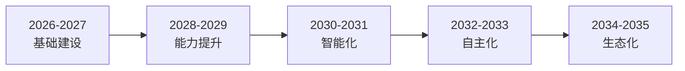

**作者：** HOS(安全风信子)
**日期：** 2026-04-27
**主要来源平台：** GitHub
**摘要：** 企业AI安全运营终极蓝图为企业提供了面向未来的战略指引。本文系统规划十年技术演进路线图，描绘生态体系终极形态，提出标准化与互操作性方案，构建行业协同共享机制，最终形成可落地的战略建议与行动纲领。

@[TOC](目录)

---

# 企业AI安全运营终极蓝图：从现在到未来的战略路径

## 一、引言：为什么需要终极蓝图

技术发展日新月异，企业需要一张清晰的战略地图来指引AI安全运营的建设方向。终极蓝图不仅是对未来愿景的描绘，更是对当下行动的指导。

**本节为你提供的核心技术价值**：理解AI安全运营的长期演进方向，制定可落地的战略规划。

AI安全运营不是一次性项目，而是持续演进的旅程。企业需要建立短中长期规划，确保技术投资产生持续价值。

## 二、十年技术演进路线图

### 2.1 阶段划分



### 2.2 各阶段目标

| 阶段 | 时间 | 核心目标 | 关键指标 |
|------|------|----------|----------|
| 基础建设 | 2026-2027 | 平台搭建 | 60%自动化 |
| 能力提升 | 2028-2029 | 智能检测 | 90%覆盖率 |
| 智能化 | 2030-2031 | AI协同 | MTTD<5min |
| 自主化 | 2032-2033 | 自我进化 | 50%自主响应 |
| 生态化 | 2034-2035 | 行业协同 | 标准化互通 |

## 三、生态体系终极形态

### 3.1 理想架构

企业AI安全运营生态应该是一个开放、协同、智能的体系。

```python
class UltimateSecurityEcosystem:
    """终极安全生态"""
    
    def __init__(self):
        # 核心层
        self.core_soc = AgenticSOC()
        
        # 集成层
        self.integration = OpenIntegrationHub(
            apis=["REST", "GraphQL", "WebSocket"],
            protocols=["STIX/TAXII", "OpenC2"]
        )
        
        # 智能层
        self.intelligence = SharedIntelligence(
            threat_feeds=[],
            ml_models=ModelRegistry()
        )
        
        # 协作层
        self.collaboration = IndustryCollaboration(
            isacs=["FS-ISAC", "IT-ISAC"],
            sharing_protocols=["MISP", "AlienVault OTX"]
        )
```

## 四、标准化与互操作性

### 4.1 标准体系

AI安全运营需要建立完善的标准体系。

```yaml
# AI安全运营标准体系
standards:
  data_standards:
    - "STIX 2.1"
    - "TAXII 2.1"
    - "OpenIOC"
    
  api_standards:
    - "OpenAPI 3.0"
    - "GraphQL"
    
  security_standards:
    - "NIST AI RMF"
    - "ISO/IEC 42001"
    - "EU AI Act"
```

## 五、行业协同与共享

### 5.1 协同机制

企业应积极参与行业协同，通过ISAC等组织共享威胁情报。

```python
class ThreatIntelligenceSharing:
    """威胁情报共享"""
    
    def __init__(self):
        self.isac = ISACConnection()
        self.misp = MISPServer()
        
    def share_intel(self, indicator: IOC) -> bool:
        """共享情报"""
        # 匿名化处理
        anonymized = self._anonymize(indicator)
        
        # 发布到ISAC
        self.isac.publish(anonymized)
        
        # 发布到MISP
        self.misp.add_event(anonymized)
        
        return True
```

## 六、战略建议与行动纲领

### 6.1 企业行动指南

| 优先级 | 行动项 | 时间 | 责任方 |
|--------|--------|------|--------|
| P0 | 建立AI安全治理框架 | Q1 | CISO |
| P1 | 部署AI检测系统 | Q2 | 安全运营 |
| P2 | 建立自动化响应 | Q3 | 安全工程 |
| P3 | 参与行业共享 | Q4 | 威胁情报 |

## 七、技术演进与未来展望

### 7.1 近期技术演进（2026-2028）

近期技术演进将聚焦于AI安全能力的增强和扩展。

```python
class NearTermTechnologyRoadmap:
    """近期技术路线图"""

    def __init__(self):
        self.milestones = [
            Milestone(
                year=2026,
                title='AI原生安全架构',
                description='构建AI原生的安全架构，AI能力深度嵌入安全系统',
                key_technologies=['AI原生SIEM', '智能SOAR', '自适应检测']
            ),
            Milestone(
                year=2027,
                title='自动化安全运营',
                description='实现80%安全运营流程的自动化',
                key_technologies=['Auto-SOC', '智能告警', '自动响应']
            ),
            Milestone(
                year=2028,
                title='预测性安全防御',
                description='从被动防御转向预测性防御',
                key_technologies=['预测分析', '威胁模拟', '主动防御']
            )
        ]

    def get_roadmap(self) -> List[Milestone]:
        """获取路线图"""
        return self.milestones
```

### 7.2 中期技术演进（2029-2032）

中期技术演进将推动安全运营的智能化转型。

```python
class MediumTermTechnologyRoadmap:
    """中期技术路线图"""

    def __init__(self):
        self.milestones = [
            Milestone(
                year=2029,
                title='认知安全系统',
                description='AI具备类人认知能力，实现复杂威胁理解',
                key_technologies=['认知AI', '深度推理', '自适应学习']
            ),
            Milestone(
                year=2030,
                title='自治安全运营',
                description='实现完全自治的安全运营中心',
                key_technologies=['Agentic SOC', '自我优化', '自主决策']
            ),
            Milestone(
                year=2031,
                title='量子安全AI',
                description='AI安全系统全面升级到量子安全级别',
                key_technologies=['量子AI', '后量子加密', '量子检测']
            )
        ]
```

### 7.3 远期技术展望（2033-2035）

远期技术展望将重新定义安全运营的边界。

```python
class LongTermTechnologyVision:
    """远期技术愿景"""

    def __init__(self):
        self.vision = Vision(
            title='安全运营终极形态',
            description='构建无缝、智能、自进化的安全运营生态系统',
            pillars=[
                '全量子化的安全防护',
                '星际级别的威胁感知',
                '意识级别的安全认知',
                '自我进化的安全智能'
            ]
        )
```

## 八、生态体系终极形态

### 8.1 理想架构

企业AI安全运营生态应该是一个开放、协同、智能的体系。

```python
class UltimateSecurityEcosystem:
    """终极安全生态"""

    def __init__(self):
        self.core_intelligence = QuantumAI()
        self.quantum_defense = QuantumDefenseGrid()
        self.interstellar_intel = InterstellarThreatIntelligence()
        self.self_evolving = SelfEvolvingSecurity()

    async def process_security_event(
        self,
        event: SecurityEvent
    ) -> ProcessedResult:
        """处理安全事件"""
        quantum_result = await self.quantum_defense.process(event)

        if quantum_result.requires_human:
            human_result = await self._consult_human(quantum_result)
            return ProcessedResult(
                ai=quantum_result,
                human=human_result,
                final=self._merge_results(quantum_result, human_result)
            )

        return ProcessedResult(
            ai=quantum_result,
            human=None,
            final=quantum_result
        )
```

## 九、行动纲领

### 9.1 立即行动项

企业应立即开始以下行动：

```python
class ImmediateActionPlan:
    """立即行动纲领"""

    def __init__(self):
        self.actions = [
            Action(
                priority='P0',
                title='建立AI安全治理框架',
                owner='CISO',
                deadline='Q1 2026',
                success_metrics='框架覆盖率100%'
            ),
            Action(
                priority='P0',
                title='评估当前AI安全成熟度',
                owner='安全架构师',
                deadline='Q1 2026',
                success_metrics='成熟度评分≥3.0'
            ),
            Action(
                priority='P1',
                title='制定AI安全技术路线图',
                owner='CTO',
                deadline='Q2 2026',
                success_metrics='路线图获得批准'
            )
        ]
```

### 9.2 成功指标体系

评估AI安全运营成功的关键指标：

| 指标类别 | 指标名称 | 2026目标 | 2028目标 | 2030目标 |
|----------|----------|----------|----------|----------|
| 效率 | 自动化率 | 50% | 80% | 95% |
| 效果 | MTTD | <30min | <5min | <1min |
| 效果 | MTTR | <4h | <30min | <5min |
| 覆盖 | 威胁覆盖率 | 80% | 95% | 99% |
| 智能 | AI准确率 | 85% | 95% | 99% |

## 十、总结

AI安全运营的终极形态是构建一个开放、智能、协同的生态体系。企业需要从现在开始规划，分阶段实施，最终实现AI原生的安全运营能力。

---

**参考链接：**

- [NIST AI Risk Management Framework](https://doi.org/10.6028/NIST.AI.100-1)
- [ISO/IEC 42001 - AI Management System](https://www.iso.org/standard/81230.html)
- [World Economic Forum - AI Security](https://www.weforum.org/ai)

**关键词：** 战略蓝图，技术路线图，生态体系，标准化，行业协同，AI安全运营
