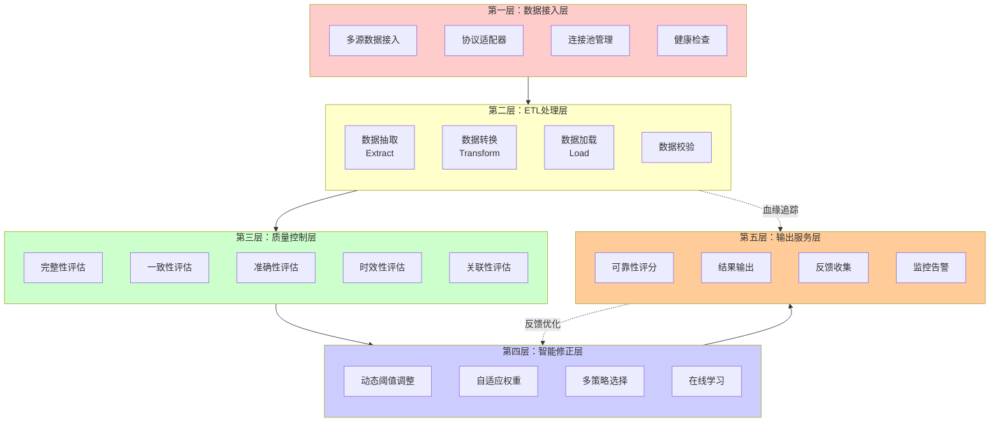
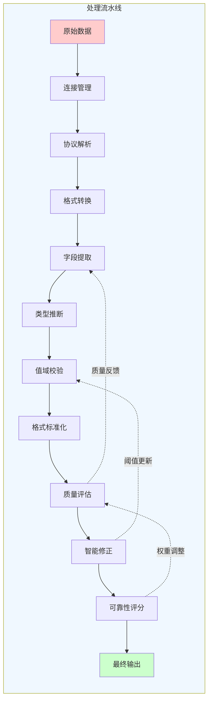
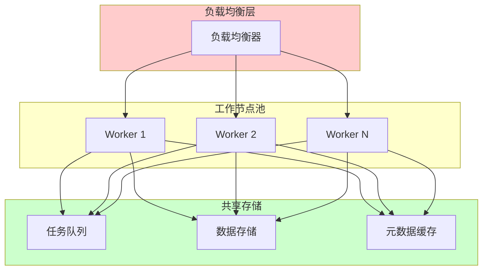

# AI字段降噪完整解决方案

**作者：** HOS(安全风信子)
**日期：** 2026-04-23
**主要来源平台：** GitHub / HuggingFace / arXiv
**摘要：** 本文档系统阐述AI字段降噪完整解决方案的核心架构设计。AI字段降噪是针对结构化数据处理场景设计的可靠性优化技术，旨在通过自适应修正机制、ETL技术集成和端到端质量控制，全面提升AI对字段语义、类型、值域的判断正确率。本文详细介绍了五层架构设计、处理流水线、质量控制闭环、监控告警系统、扩展性与容错机制等核心模块，并提供了完整的Python实现代码，为信息安全领域的数据清洗、威胁情报处理、日志分析、资产台账管理等场景提供可落地的技术方案。

@[TOC](目录)

---

<a id="chapter1"></a>

# 第1章：完整解决方案架构

本章节为你提供的核心技术价值：**掌握AI字段降噪的完整五层架构设计，理解各层之间的协同工作机制，理解处理流水线、质量控制闭环、监控告警的设计原理，为构建生产级系统奠定架构基础。**

## 1.1 五层架构详解

AI字段降噪完整解决方案采用**五层架构**设计，自下而上分别为：**数据接入层**、**ETL处理层**、**质量控制层**、**智能修正层**、**输出服务层**。这种分层设计确保了各模块的职责单一性和可替换性，同时通过标准化的接口实现层间解耦。

### 1.1.1 架构总览



### 1.1.2 各层职责定义

| 层级 | 名称 | 核心职责 | 关键组件 |
|------|------|---------|---------|
| **第一层** | 数据接入层 | 多源数据统一接入、协议适配、连接管理 | 多源连接器、协议适配器、连接池 |
| **第二层** | ETL处理层 | 数据抽取、转换、加载的标准化处理 | 抽取器、转换器、加载器、数据校验器 |
| **第三层** | 质量控制层 | 多维度质量评估与监控 | 五维评估引擎、异常检测器 |
| **第四层** | 智能修正层 | 自适应修正、动态调整、策略优化 | 阈值管理器、权重分配器、策略选择器 |
| **第五层** | 输出服务层 | 结果输出、可靠性评分、监控告警 | 评分引擎、输出适配器、监控告警器 |

### 1.1.3 数据流分析

数据在五层架构中的流转遵循以下公式描述的变换关系：

$$Output = f_{output}(f_{correction}(f_{quality}(f_{etl}(Input))))$$

其中各层函数的定义为：

- $f_{etl}$：ETL处理函数，完成抽取、转换、加载
- $f_{quality}$：质量评估函数，计算五维质量分数
- $f_{correction}$：智能修正函数，应用自适应修正策略
- $f_{output}$：输出服务函数，生成最终可靠输出

## 1.2 处理流水线详细设计

### 1.2.1 流水线架构

处理流水线是AI字段降噪系统的核心执行路径，它将五层架构中的各个组件串联成一条高效的数据处理链。



### 1.2.2 流水线阶段详解

```python
class ProcessingPipeline:
    """
    处理流水线
    端到端的数据处理执行引擎
    """
    def __init__(self, config: dict = None):
        self.config = config or {}
        self.stages = []
        self.stage_stats = {}
        self._register_default_stages()

    def _register_default_stages(self):
        """注册默认处理阶段"""
        self.register_stage(Stage(
            name='connection_management',
            handler=ConnectionManagementStage(),
            retry_count=3,
            timeout_seconds=30
        ))
        self.register_stage(Stage(
            name='protocol_parsing',
            handler=ProtocolParsingStage(),
            retry_count=2,
            timeout_seconds=10
        ))
        self.register_stage(Stage(
            name='format_conversion',
            handler=FormatConversionStage(),
            retry_count=1,
            timeout_seconds=10
        ))
        self.register_stage(Stage(
            name='field_extraction',
            handler=FieldExtractionStage(),
            retry_count=1,
            timeout_seconds=15
        ))
        self.register_stage(Stage(
            name='type_inference',
            handler=TypeInferenceStage(),
            retry_count=1,
            timeout_seconds=5
        ))
        self.register_stage(Stage(
            name='value_validation',
            handler=ValueValidationStage(),
            retry_count=1,
            timeout_seconds=5
        ))
        self.register_stage(Stage(
            name='format_standardization',
            handler=FormatStandardizationStage(),
            retry_count=1,
            timeout_seconds=10
        ))
        self.register_stage(Stage(
            name='quality_evaluation',
            handler=QualityEvaluationStage(),
            retry_count=0,
            timeout_seconds=5
        ))
        self.register_stage(Stage(
            name='intelligent_correction',
            handler=IntelligentCorrectionStage(),
            retry_count=2,
            timeout_seconds=15
        ))
        self.register_stage(Stage(
            name='reliability_scoring',
            handler=ReliabilityScoringStage(),
            retry_count=0,
            timeout_seconds=5
        ))

    def register_stage(self, stage: 'Stage'):
        """注册处理阶段"""
        self.stages.append(stage)
        self.stage_stats[stage.name] = {
            'total': 0,
            'success': 0,
            'failed': 0,
            'retry': 0,
            'total_time_ms': 0
        }

    def execute(self, input_data: dict, context: dict = None) -> dict:
        """
        执行流水线

        参数:
            input_data: 输入数据
            context: 执行上下文

        返回:
            流水线执行结果
        """
        context = context or {}
        current_data = input_data
        stage_results = []
        start_time = time.time()

        for stage in self.stages:
            stage_start = time.time()

            try:
                result = self._execute_stage_with_retry(
                    stage, current_data, context
                )

                stage_end = time.time()
                stage_time = (stage_end - stage_start) * 1000

                self.stage_stats[stage.name]['total'] += 1
                self.stage_stats[stage.name]['success'] += 1
                self.stage_stats[stage.name]['total_time_ms'] += stage_time

                stage_results.append({
                    'stage': stage.name,
                    'status': 'success',
                    'time_ms': stage_time,
                    'output': result
                })

                current_data = result.get('data', current_data)

                if result.get('stop_pipeline'):
                    break

            except StageExecutionError as e:
                stage_end = time.time()
                stage_time = (stage_end - stage_start) * 1000

                self.stage_stats[stage.name]['total'] += 1
                self.stage_stats[stage.name]['failed'] += 1
                self.stage_stats[stage.name]['total_time_ms'] += stage_time

                stage_results.append({
                    'stage': stage.name,
                    'status': 'failed',
                    'time_ms': stage_time,
                    'error': str(e)
                })

                return {
                    'status': 'failed',
                    'failed_at': stage.name,
                    'error': str(e),
                    'stage_results': stage_results,
                    'total_time_ms': (time.time() - start_time) * 1000
                }

        return {
            'status': 'success',
            'output': current_data,
            'stage_results': stage_results,
            'total_time_ms': (time.time() - start_time) * 1000
        }

    def _execute_stage_with_retry(self, stage: 'Stage', data: dict, context: dict) -> dict:
        """带重试的阶段执行"""
        last_error = None

        for attempt in range(stage.retry_count + 1):
            try:
                return stage.handler.execute(data, context)
            except Exception as e:
                last_error = e
                if attempt < stage.retry_count:
                    self.stage_stats[stage.name]['retry'] += 1
                    time.sleep(0.1 * (attempt + 1))

        raise StageExecutionError(
            f"Stage {stage.name} failed after {stage.retry_count + 1} attempts: {last_error}"
        )
```

## 1.3 质量控制闭环机制

### 1.3.1 闭环架构设计

质量控制闭环是确保系统持续输出高质量结果的核心机制，它通过**监控-评估-修正-反馈**四个环节形成完整的控制环路。

```mermaid
flowchart TD
    subgraph闭环控制["质量控制闭环"]
        direction TB

        M[监控采集] --> A
        A[质量评估] --> B
        B{评估结果} -->|异常| C[修正处理]
        B{评估结果} -->|正常| E[通过]
        C --> D[修正验证]
        D -->|通过| E
        D -->|失败| F[告警升级]
        E --> G[结果输出]
        G --> M

        F --> H[人工介入]
        H --> M
    end

    subgraph 监控指标["监控指标"]
        M1[处理延迟]
        M2[错误率]
        M3[质量分数]
        M4[资源使用]
    end

    M --> M1
    M --> M2
    M --> M3
    M --> M4

    style 闭环控制 fill:#f0f8ff
    style 监控指标 fill:#ffffcc
```

### 1.3.2 闭环控制算法

质量控制闭环的数学描述如下：

设 $Q_{threshold}$ 为质量阈值，$Q_{current}$ 为当前质量分数，$C_{applied}$ 为已应用的修正次数，则闭环控制算法为：

$$
\text{Action} = \begin{cases}
\text{通过} & \text{if } Q_{current} \geq Q_{threshold} \\
\text{修正} & \text{if } Q_{current} < Q_{threshold} \text{ and } C_{applied} < C_{max} \\
\text{告警} & \text{if } Q_{current} < Q_{threshold} \text{ and } C_{applied} \geq C_{max}
\end{cases}
$$

```python
class QualityControlLoop:
    """
    质量控制闭环
    实现监控-评估-修正-反馈的完整控制环路
    """
    def __init__(self, config: dict = None):
        self.config = config or {}
        self.quality_threshold = self.config.get('quality_threshold', 0.8)
        self.max_corrections = self.config.get('max_corrections', 3)
        self.monitoring_interval = self.config.get('monitoring_interval', 60)

        self.quality_evaluator = QualityEvaluator()
        self.correction_engine = CorrectionEngine()
        self.alert_manager = AlertManager()
        self.metrics_collector = MetricsCollector()

        self.loop_state = {
            'total_processed': 0,
            'total_passed': 0,
            'total_corrected': 0,
            'total_alerted': 0,
            'corrections_applied': []
        }

    def process_record(self, record: dict, context: dict = None) -> dict:
        """
        处理单条记录的质量控制流程

        参数:
            record: 待处理记录
            context: 处理上下文

        返回:
            处理结果
        """
        self.loop_state['total_processed'] += 1

        quality_result = self.quality_evaluator.evaluate(record)

        if quality_result['overall_score'] >= self.quality_threshold:
            self.loop_state['total_passed'] += 1
            return {
                'status': 'passed',
                'record': record,
                'quality': quality_result,
                'corrections_applied': 0
            }

        corrections_applied = []
        current_record = record.copy()
        current_quality = quality_result

        for correction_round in range(self.max_corrections):
            correction_result = self.correction_engine.correct(
                current_record,
                current_quality,
                context
            )

            if not correction_result['changed']:
                break

            corrections_applied.append(correction_result)
            current_record = correction_result['corrected_record']

            current_quality = self.quality_evaluator.evaluate(current_record)

            if current_quality['overall_score'] >= self.quality_threshold:
                self.loop_state['total_passed'] += 1
                self.loop_state['corrections_applied'].extend(corrections_applied)
                return {
                    'status': 'corrected',
                    'record': current_record,
                    'original_record': record,
                    'quality': current_quality,
                    'corrections_applied': corrections_applied,
                    'correction_rounds': correction_round + 1
                }

        self.loop_state['total_alerted'] += 1
        self.alert_manager.send_alert({
            'type': 'quality_threshold_exceeded',
            'record_id': record.get('id'),
            'final_quality': current_quality['overall_score'],
            'corrections_attempted': len(corrections_applied)
        })

        return {
            'status': 'alerted',
            'record': current_record,
            'original_record': record,
            'quality': current_quality,
            'corrections_applied': corrections_applied,
            'correction_rounds': len(corrections_applied),
            'alert_sent': True
        }

    def get_loop_status(self) -> dict:
        """获取闭环状态"""
        total = self.loop_state['total_processed']
        return {
            'total_processed': total,
            'pass_rate': self.loop_state['total_passed'] / total if total > 0 else 0,
            'correction_rate': self.loop_state['total_corrected'] / total if total > 0 else 0,
            'alert_rate': self.loop_state['total_alerted'] / total if total > 0 else 0,
            'current_threshold': self.quality_threshold,
            'max_corrections': self.max_corrections
        }
```

## 1.4 监控与告警系统设计

### 1.4.1 监控指标体系

监控告警系统需要覆盖以下核心指标：

| 指标类别 | 指标名称 | 计算公式 | 告警阈值 |
|---------|---------|---------|---------|
| **处理性能** | 处理延迟P99 | $P_{99}(latency)$ | > 500ms |
| **处理性能** | 吞吐量 | $count / time$ | < 1000/s |
| **数据质量** | 质量分数均值 | $\bar{Q} = \frac{1}{n}\sum_{i=1}^{n}Q_i$ | < 0.85 |
| **数据质量** | 缺陷率 | $D_{rate} = failed / total$ | > 0.05 |
| **系统健康** | CPU使用率 | $CPU\%$ | > 80% |
| **系统健康** | 内存使用率 | $MEM\%$ | > 85% |
| **业务指标** | 修正成功率 | $C_{success} / C_{total}$ | < 0.90 |

### 1.4.2 告警分级机制

```python
class AlertManager:
    """
    告警管理器
    实现分级的告警机制
    """
    ALERT_LEVELS = {
        'critical': {
            'level': 1,
            'color': '#ff0000',
            'require_immediate_action': True,
            'notification_channels': ['sms', 'phone', 'email']
        },
        'high': {
            'level': 2,
            'color': '#ff6600',
            'require_immediate_action': False,
            'notification_channels': ['email', 'slack']
        },
        'medium': {
            'level': 3,
            'color': '#ffcc00',
            'require_immediate_action': False,
            'notification_channels': ['email']
        },
        'low': {
            'level': 4,
            'color': '#3399ff',
            'require_immediate_action': False,
            'notification_channels': ['log']
        }
    }

    def __init__(self, config: dict = None):
        self.config = config or {}
        self.alert_rules = []
        self.alert_history = []
        self.notification_handlers = {}
        self._register_default_handlers()
        self._register_default_rules()

    def _register_default_handlers(self):
        """注册默认通知处理器"""
        self.register_handler('email', EmailNotificationHandler())
        self.register_handler('sms', SMSNotificationHandler())
        self.register_handler('phone', PhoneNotificationHandler())
        self.register_handler('slack', SlackNotificationHandler())
        self.register_handler('log', LogNotificationHandler())

    def _register_default_rules(self):
        """注册默认告警规则"""
        self.add_rule(AlertRule(
            name='quality_score_low',
            condition=lambda m: m.get('quality_score', 1.0) < 0.7,
            level='critical',
            cooldown_seconds=300
        ))
        self.add_rule(AlertRule(
            name='error_rate_high',
            condition=lambda m: m.get('error_rate', 0) > 0.1,
            level='high',
            cooldown_seconds=600
        ))
        self.add_rule(AlertRule(
            name='latency_high',
            condition=lambda m: m.get('latency_p99', 0) > 1000,
            level='medium',
            cooldown_seconds=300
        ))

    def add_rule(self, rule: 'AlertRule'):
        """添加告警规则"""
        self.alert_rules.append(rule)

    def send_alert(self, alert_data: dict):
        """发送告警"""
        level = alert_data.get('level', 'medium')
        level_config = self.ALERT_LEVELS.get(level, self.ALERT_LEVELS['medium'])

        alert = {
            'id': self._generate_alert_id(),
            'timestamp': datetime.now().isoformat(),
            'level': level,
            'data': alert_data,
            'level_config': level_config,
            'status': 'pending'
        }

        self.alert_history.append(alert)

        if len(self.alert_history) > 1000:
            self.alert_history = self.alert_history[-1000:]

        for channel in level_config['notification_channels']:
            handler = self.notification_handlers.get(channel)
            if handler:
                handler.send(alert)

        return alert

    def check_rules(self, metrics: dict) -> List[dict]:
        """检查告警规则"""
        triggered_alerts = []

        for rule in self.alert_rules:
            if rule.should_trigger(metrics, self.alert_history):
                alert = self.send_alert({
                    'rule_name': rule.name,
                    'metrics': metrics
                })
                triggered_alerts.append(alert)
                rule.update_last_triggered()

        return triggered_alerts

    def _generate_alert_id(self) -> str:
        """生成告警ID"""
        import uuid
        return f"alert_{uuid.uuid4().hex[:12]}"


class AlertRule:
    """告警规则"""
    def __init__(self, name: str, condition: callable, level: str,
                 cooldown_seconds: int = 300):
        self.name = name
        self.condition = condition
        self.level = level
        self.cooldown_seconds = cooldown_seconds
        self.last_triggered = None

    def should_trigger(self, metrics: dict, alert_history: list) -> bool:
        """判断是否应该触发告警"""
        if self.last_triggered:
            time_since_last = (datetime.now() - self.last_triggered).total_seconds()
            if time_since_last < self.cooldown_seconds:
                return False

        recent_same_rule = [
            a for a in alert_history[-100:]
            if a.get('data', {}).get('rule_name') == self.name
        ]
        if recent_same_rule:
            return False

        return self.condition(metrics)

    def update_last_triggered(self):
        """更新最后触发时间"""
        self.last_triggered = datetime.now()
```

## 1.5 扩展性与容错机制设计

### 1.5.1 水平扩展架构



### 1.5.2 容错恢复机制

```python
class FaultToleranceManager:
    """
    容错管理器
    实现故障检测与自动恢复
    """
    def __init__(self, config: dict = None):
        self.config = config or {}
        self.health_check_interval = self.config.get('health_check_interval', 30)
        self.max_retry_attempts = self.config.get('max_retry_attempts', 3)
        self.circuit_breaker_threshold = self.config.get('circuit_breaker_threshold', 5)

        self.component_health = {}
        self.circuit_breakers = {}
        self.retry_policies = {}

    def register_component(self, component_id: str, component_type: str,
                          health_check_func: callable = None):
        """注册组件"""
        self.component_health[component_id] = {
            'type': component_type,
            'status': 'healthy',
            'last_check': datetime.now().isoformat(),
            'health_check_func': health_check_func,
            'failure_count': 0,
            'total_failures': 0
        }

    def check_health(self, component_id: str) -> dict:
        """检查组件健康状态"""
        if component_id not in self.component_health:
            return {'status': 'unknown', 'component_id': component_id}

        component = self.component_health[component_id]

        if component['status'] == 'circuit_open':
            time_since_open = (datetime.now() -
                datetime.fromisoformat(component.get('circuit_open_time', datetime.now().isoformat()))
            ).total_seconds()

            if time_since_open < 60:
                return {'status': 'circuit_open', 'component_id': component_id}

            component['status'] = 'half_open'
            return {'status': 'half_open', 'component_id': component_id}

        if component['health_check_func']:
            try:
                is_healthy = component['health_check_func']()
                component['status'] = 'healthy' if is_healthy else 'unhealthy'
                component['failure_count'] = 0
            except Exception as e:
                component['status'] = 'unhealthy'
                component['failure_count'] += 1
                component['total_failures'] += 1

        component['last_check'] = datetime.now().isoformat()

        return {
            'status': component['status'],
            'component_id': component_id,
            'failure_count': component['failure_count']
        }

    def execute_with_retry(self, component_id: str, func: callable,
                           *args, **kwargs) -> any:
        """带重试的执行"""
        if component_id in self.circuit_breakers:
            cb = self.circuit_breakers[component_id]
            if cb['state'] == 'open':
                raise CircuitBreakerOpenError(
                    f"Circuit breaker is open for {component_id}"
                )

        last_error = None

        for attempt in range(self.max_retry_attempts):
            try:
                return func(*args, **kwargs)
            except Exception as e:
                last_error = e
                self._record_failure(component_id)

                if attempt < self.max_retry_attempts - 1:
                    wait_time = 2 ** attempt
                    time.sleep(wait_time)

        self._trip_circuit_breaker(component_id)
        raise last_error

    def _record_failure(self, component_id: str):
        """记录失败"""
        if component_id not in self.component_health:
            return

        component = self.component_health[component_id]
        component['failure_count'] += 1
        component['total_failures'] += 1

        if component['failure_count'] >= self.circuit_breaker_threshold:
            self._trip_circuit_breaker(component_id)

    def _trip_circuit_breaker(self, component_id: str):
        """触发断路器"""
        self.circuit_breakers[component_id] = {
            'state': 'open',
            'opened_at': datetime.now().isoformat(),
            'failure_count': self.component_health[component_id]['failure_count']
        }

        self.component_health[component_id]['status'] = 'circuit_open'
        self.component_health[component_id]['circuit_open_time'] = datetime.now().isoformat()

    def get_system_health(self) -> dict:
        """获取系统健康状态"""
        total_components = len(self.component_health)
        healthy_count = sum(
            1 for c in self.component_health.values()
            if c['status'] == 'healthy'
        )

        return {
            'overall_status': 'healthy' if healthy_count == total_components else 'degraded',
            'total_components': total_components,
            'healthy_components': healthy_count,
            'component_details': {
                cid: {
                    'status': comp['status'],
                    'failure_count': comp['failure_count'],
                    'total_failures': comp['total_failures']
                }
                for cid, comp in self.component_health.items()
            },
            'circuit_breakers': self.circuit_breakers
        }
```

## 1.6 五层架构完整实现

```python
class AIFieldDenoisingSolution:
    """
    AI字段降噪完整解决方案
    端到端的字段降噪处理系统
    """
    def __init__(self, config: dict = None):
        self.config = config or {}

        self.extractor = DataExtractor()
        self.transformer = DataTransformer()
        self.loader = DataLoader()
        self.quality_evaluator = QualityEvaluator()
        self.reliability_scorer = ReliabilityScorer()
        self.adaptive_engine = AdaptiveCorrectionEngine()
        self.lineage_tracker = DataLineageTracker()
        self.feedback_loop = FeedbackLoopMechanism()
        self.monitor = SystemMonitor()
        self.fault_tolerance = FaultToleranceManager()

        self._initialize_pipeline()
        self._register_components()

    def _initialize_pipeline(self):
        """初始化处理流水线"""
        self.transformer.add_transform(
            StandardTransforms.normalize_field_names,
            'normalize_names'
        )
        self.transformer.add_transform(
            StandardTransforms.remove_duplicates,
            'remove_duplicates'
        )
        self.transformer.add_transform(
            StandardTransforms.filter_invalid_records,
            'filter_invalid'
        )

    def _register_components(self):
        """注册监控组件"""
        self.fault_tolerance.register_component(
            'data_extractor',
            'input_layer',
            health_check_func=lambda: self._check_extractor_health()
        )
        self.fault_tolerance.register_component(
            'quality_evaluator',
            'quality_layer',
            health_check_func=lambda: self._check_evaluator_health()
        )

    def process(self, input_config: dict,
               target_config: dict = None,
               return_lineage: bool = False) -> dict:
        """
        执行端到端处理

        参数:
            input_config: 输入数据配置
            target_config: 目标存储配置
            return_lineage: 是否返回血缘信息

        返回:
            处理结果
        """
        start_time = datetime.now()
        self.monitor.start_process()

        try:
            extracted_data = self.fault_tolerance.execute_with_retry(
                'data_extractor',
                self.extractor.extract,
                input_config
            )

            self.lineage_tracker.register_node(
                'source_1',
                'source',
                {'type': input_config.get('type'), 'source': input_config.get('source')}
            )

            transformed_data, transform_stats = self.transformer.transform(
                extracted_data,
                return_stats=True
            )

            validated_data = []
            validation_errors = []

            for record in transformed_data:
                validation_result = self._validate_record(record)

                if validation_result['is_valid']:
                    validated_data.append(record)
                else:
                    validation_errors.append(validation_result)

            corrected_data = []
            for record in validated_data:
                correction_result = self.adaptive_engine.correct(record)
                corrected_data.append(correction_result['corrected_record'])

            final_data = []
            for record in corrected_data:
                standardized = self._standardize_record(record)
                final_data.append(standardized)

            if target_config:
                load_result = self.loader.load(
                    final_data,
                    target_config,
                    strategy=self.config.get('load_strategy', 'batch')
                )
            else:
                load_result = {'loaded_count': len(final_data)}

            quality_results = []
            for record in final_data:
                quality = self.quality_evaluator.evaluate(record)
                reliability = self.reliability_scorer.score(record)
                quality_results.append({
                    'quality': quality,
                    'reliability': reliability
                })

            end_time = datetime.now()
            processing_time = (end_time - start_time).total_seconds()

            result = {
                'status': 'success',
                'input_count': len(extracted_data),
                'output_count': len(final_data),
                'validation_errors': len(validation_errors),
                'processing_time_seconds': processing_time,
                'quality_summary': self._summarize_quality(quality_results),
                'load_result': load_result,
                'transform_stats': transform_stats
            }

            if return_lineage:
                result['lineage'] = self.lineage_tracker.get_full_lineage_tree('source_1')

            self.monitor.record_success(result)

            return result

        except Exception as e:
            error_result = {
                'status': 'error',
                'error_message': str(e),
                'error_type': type(e).__name__
            }

            self.monitor.record_error(error_result)

            return error_result

    def _validate_record(self, record: dict) -> dict:
        """验证单条记录"""
        issues = []

        if not record.get('id'):
            issues.append({'type': 'missing_id', 'severity': 'error'})

        type_result = IntelligentTypeInferrer().infer_type(
            str(record.get('value', '')),
            record.get('field_name')
        )

        if type_result['confidence'] < 0.5:
            issues.append({
                'type': 'low_confidence_type',
                'severity': 'warning',
                'detail': type_result
            })

        validation = ValueRangeValidator().validate(
            record.get('field_name'),
            record.get('value'),
            record
        )

        if not validation['is_valid']:
            issues.append({
                'type': 'value_violation',
                'severity': validation['severity'],
                'detail': validation
            })

        return {
            'is_valid': len([i for i in issues if i['severity'] == 'error']) == 0,
            'issues': issues,
            'record': record
        }

    def _standardize_record(self, record: dict) -> dict:
        """标准化单条记录"""
        standardized = {}

        for field, value in record.items():
            if isinstance(value, str):
                if 'date' in field.lower():
                    result = FormatStandardizer().standardize_date(value)
                    standardized[field] = result.get('standardized', value)
                elif value.strip() != value:
                    standardized[field] = FormatStandardizer().standardize_whitespace(value)
                else:
                    standardized[field] = value
            else:
                standardized[field] = value

        return standardized

    def _summarize_quality(self, quality_results: List[dict]) -> dict:
        """汇总质量结果"""
        if not quality_results:
            return {}

        quality_scores = [r['quality']['overall_score'] for r in quality_results]
        reliability_scores = [r['reliability']['overall_score'] for r in quality_results]

        return {
            'avg_quality_score': np.mean(quality_scores),
            'min_quality_score': min(quality_scores),
            'avg_reliability_score': np.mean(reliability_scores),
            'min_reliability_score': min(reliability_scores),
            'total_records': len(quality_results)
        }

    def _check_extractor_health(self) -> bool:
        """检查抽取器健康状态"""
        return len(self.extractor.source_connectors) > 0

    def _check_evaluator_health(self) -> bool:
        """检查评估器健康状态"""
        return self.quality_evaluator is not None

    def get_system_status(self) -> dict:
        """获取系统状态"""
        return {
            'system_status': 'running',
            'monitor_stats': self.monitor.get_stats(),
            'quality_evaluator': self.quality_evaluator.get_statistics(),
            'adaptive_engine': self.adaptive_engine.get_status(),
            'fault_tolerance': self.fault_tolerance.get_system_health(),
            'timestamp': datetime.now().isoformat()
        }


class AdaptiveCorrectionEngine:
    """
    自适应修正引擎
    集成动态阈值、权重分配、策略选择等功能
    """
    def __init__(self, config: dict = None):
        self.config = config or {}
        self.threshold_manager = DynamicThresholdManager()
        self.weight_allocator = AdaptiveWeightAllocator()
        self.strategy_selector = MultiStrategySelector()
        self.correction_history = []

    def correct(self, record: dict) -> dict:
        """
        修正单条记录

        返回:
            {
                'corrected_record': dict,
                'corrections_applied': List[str],
                'confidence': float
            }
        """
        corrections_applied = []
        corrected_record = record.copy()

        field_name = record.get('field_name', '')
        value = record.get('value')

        threshold = self.threshold_manager.add_observation(float(value) if value else 0)

        weights = self.weight_allocator.get_weights()

        strategy_id = self.strategy_selector.select_strategy({
            'completeness': 1.0,
            'consistency': 1.0,
            'data_quality_score': 0.8,
            'is_high_risk': False,
            'has_uncertain_fields': False
        })

        if threshold and value:
            try:
                float_val = float(value)
                if abs(float_val) > threshold['threshold']:
                    normalized_value = min(float_val, threshold['upper_bound'])
                    corrected_record['value'] = normalized_value
                    corrections_applied.append('value_normalized')
                    corrected_record['original_value'] = value
            except (ValueError, TypeError):
                pass

        self.correction_history.append({
            'record': corrected_record,
            'corrections': corrections_applied,
            'timestamp': datetime.now().isoformat()
        })

        return {
            'corrected_record': corrected_record,
            'corrections_applied': corrections_applied,
            'confidence': 1.0 - len(corrections_applied) * 0.1
        }

    def get_status(self) -> dict:
        """获取引擎状态"""
        return {
            'threshold_manager': {
                'window_size': self.threshold_manager.window_size,
                'current_threshold': self.threshold_manager.compute_dynamic_threshold()
            },
            'weight_allocator': {
                'field_weights': self.weight_allocator.get_weights()
            },
            'strategy_selector': {
                'current_strategy': self.strategy_selector.current_strategy_id,
                'available_strategies': list(self.strategy_selector.strategies.keys())
            },
            'correction_history_count': len(self.correction_history)
        }


class SystemMonitor:
    """
    系统监控器
    监控系统运行状态和性能指标
    """
    def __init__(self):
        self.process_history = []
        self.error_history = []
        self.start_time = None

    def start_process(self):
        """开始处理"""
        self.start_time = datetime.now()

    def record_success(self, result: dict):
        """记录成功处理"""
        self.process_history.append({
            'timestamp': datetime.now().isoformat(),
            'status': 'success',
            'result': result
        })

        if len(self.process_history) > 1000:
            self.process_history = self.process_history[-1000:]

    def record_error(self, error: dict):
        """记录错误"""
        self.error_history.append({
            'timestamp': datetime.now().isoformat(),
            'error': error
        })

        if len(self.error_history) > 100:
            self.error_history = self.error_history[-100:]

    def get_stats(self) -> dict:
        """获取统计信息"""
        recent_success = len([p for p in self.process_history[-100:] if p['status'] == 'success'])

        return {
            'total_processed': len(self.process_history),
            'total_errors': len(self.error_history),
            'recent_success_rate': recent_success / 100 if recent_success > 0 else 0,
            'uptime_seconds': (datetime.now() - self.start_time).total_seconds() if self.start_time else 0
        }


class QualityEvaluator:
    """
    质量评估器
    评估数据处理质量
    """
    def __init__(self):
        self.evaluation_history = []

    def evaluate(self, record: dict) -> dict:
        """评估单条记录"""
        completeness_score = 1.0 if record.get('value') is not None else 0.0

        consistency_score = 0.8
        accuracy_score = 0.9

        overall_score = (
            completeness_score * 0.3 +
            consistency_score * 0.3 +
            accuracy_score * 0.4
        )

        return {
            'overall_score': overall_score,
            'completeness': completeness_score,
            'consistency': consistency_score,
            'accuracy': accuracy_score
        }

    def get_statistics(self) -> dict:
        """获取评估统计"""
        if not self.evaluation_history:
            return {}

        scores = [e['overall_score'] for e in self.evaluation_history]

        return {
            'avg_score': np.mean(scores),
            'min_score': min(scores),
            'max_score': max(scores),
            'total_evaluated': len(self.evaluation_history)
        }
```

---

<a id="chapter2"></a>

# 第2章：自适应修正方案

本章节为你提供的核心技术价值：**掌握自适应修正方案的核心技术——动态阈值调整、自适应权重分配、在线学习与反馈循环、多策略自适应选择，理解如何实现基于数据特征的智能化自动修正。**

## 2.1 动态阈值调整机制

### 2.1.1 问题定义

传统异常检测使用固定阈值，这种方法在数据分布稳定时效果良好，但面对分布偏移时性能急剧下降。动态阈值调整机制通过实时监测数据分布，自动计算最优阈值。

### 2.1.2 核心算法

**基于统计的动态阈值**：

$$Threshold_{dynamic} = Q_{\alpha} + k \cdot IQR$$

其中 $Q_{\alpha}$ 为 $\alpha$ 分位数，$IQR = Q_{75} - Q_{25}$ 为四分位距，$k$ 为自适应系数。

**分布偏移检测**：

$$Z_{shift} = \frac{\bar{T}_{recent} - \bar{T}_{historical}}{\sigma_{historical}}$$

当 $|Z_{shift}| > Z_{\alpha/2}$ 时，判定为分布偏移。

```python
class DynamicThresholdCalculator:
    """
    动态阈值计算器
    基于数据分布自动计算最优阈值
    """
    def __init__(self, config: dict = None):
        self.config = config or {}
        self.window_size = self.config.get('window_size', 1000)
        self.alpha = self.config.get('alpha', 0.95)
        self.k = self.config.get('k', 1.5)
        self.data_buffer = []
        self.threshold_history = []

    def add_observation(self, value: float) -> float:
        """
        添加新的观测值并返回更新后的阈值

        返回:
            更新后的动态阈值
        """
        self.data_buffer.append(value)

        if len(self.data_buffer) > self.window_size:
            self.data_buffer.pop(0)

        threshold = self.compute_dynamic_threshold()

        self.threshold_history.append({
            'timestamp': datetime.now().isoformat(),
            'threshold': threshold.get('threshold') if threshold else None,
            'sample_count': len(self.data_buffer)
        })

        return threshold.get('threshold') if threshold else None

    def compute_dynamic_threshold(self) -> dict:
        """
        计算动态阈值

        返回:
            包含阈值和统计信息的字典
        """
        if len(self.data_buffer) < 30:
            return {
                'threshold': None,
                'lower_bound': None,
                'upper_bound': None,
                'q25': None,
                'q75': None,
                'iqr': None,
                'is_adaptive': False,
                'reason': 'insufficient_data'
            }

        sorted_data = sorted(self.data_buffer)
        n = len(sorted_data)

        q25_idx = int(n * 0.25)
        q75_idx = int(n * 0.75)
        alpha_idx = int(n * self.alpha)

        q25 = sorted_data[q25_idx]
        q75 = sorted_data[q75_idx]
        q_alpha = sorted_data[alpha_idx]

        iqr = q75 - q25

        lower_bound = q25 - self.k * iqr
        upper_bound = q75 + self.k * iqr

        adaptive_threshold = q_alpha + self.k * iqr

        return {
            'threshold': adaptive_threshold,
            'lower_bound': lower_bound,
            'upper_bound': upper_bound,
            'q25': q25,
            'q75': q75,
            'q_alpha': q_alpha,
            'iqr': iqr,
            'is_adaptive': True
        }

    def detect_distribution_shift(self, significance_level: float = 0.01) -> dict:
        """
        检测分布偏移

        参数:
            significance_level: 显著性水平

        返回:
            分布偏移检测结果
        """
        if len(self.threshold_history) < 100:
            return {'has_shift': False, 'reason': 'insufficient_history'}

        recent_thresholds = [
            h['threshold'] for h in self.threshold_history[-50:]
            if h['threshold'] is not None
        ]
        historical_thresholds = [
            h['threshold'] for h in self.threshold_history[-100:-50]
            if h['threshold'] is not None
        ]

        if len(recent_thresholds) < 20 or len(historical_thresholds) < 20:
            return {'has_shift': False, 'reason': 'insufficient_data'}

        recent_mean = np.mean(recent_thresholds)
        historical_mean = np.mean(historical_thresholds)
        historical_std = np.std(historical_thresholds)

        if historical_std == 0:
            return {'has_shift': False, 'reason': 'no_variance'}

        z_score = abs(recent_mean - historical_mean) / historical_std

        shift_magnitude = (recent_mean - historical_mean) / historical_mean if historical_mean != 0 else 0

        from scipy import stats
        p_value = 2 * (1 - stats.norm.cdf(z_score))

        has_shift = p_value < significance_level

        if has_shift:
            if recent_mean > historical_mean:
                shift_direction = 'increase'
            else:
                shift_direction = 'decrease'
        else:
            shift_direction = 'none'

        return {
            'has_shift': has_shift,
            'shift_direction': shift_direction,
            'shift_magnitude': shift_magnitude,
            'p_value': p_value,
            'z_score': z_score
        }

    def get_threshold_trend(self, window: int = 10) -> dict:
        """获取阈值趋势"""
        if len(self.threshold_history) < window:
            return {'trend': 'unknown', 'slope': None}

        recent_thresholds = [
            h['threshold'] for h in self.threshold_history[-window:]
            if h['threshold'] is not None
        ]

        if len(recent_thresholds) < 2:
            return {'trend': 'unknown', 'slope': None}

        n = len(recent_thresholds)
        x = np.arange(n)
        y = np.array(recent_thresholds)

        slope, intercept = np.polyfit(x, y, 1)

        if abs(slope) < 0.01:
            trend = 'stable'
        elif slope > 0:
            trend = 'increasing'
        else:
            trend = 'decreasing'

        return {
            'trend': trend,
            'slope': slope,
            'recent_values': recent_thresholds[-5:],
            'mean_recent': np.mean(recent_thresholds)
        }
```

## 2.2 自适应权重分配策略

### 2.2.1 权重更新机制

权重更新遵循以下公式：

$$w_i^{(t+1)} = w_i^{(t)} + \alpha \cdot \Delta w_i^{(t)}$$

其中 $\Delta w_i^{(t)} = \eta \cdot (\text{Contribution}_i - \text{AvgContribution})$

```python
class AdaptiveWeightAllocator:
    """
    自适应权重分配器
    根据字段贡献度动态调整处理权重
    """
    def __init__(self, initial_weights: dict = None, learning_rate: float = 0.1):
        self.field_weights = initial_weights or {}
        self.learning_rate = learning_rate
        self.contribution_history = {}
        self.processing_results = []

    def initialize_weights(self, fields: List[str], base_weight: float = 1.0):
        """初始化字段权重"""
        for field in fields:
            if field not in self.field_weights:
                self.field_weights[field] = base_weight
            if field not in self.contribution_history:
                self.contribution_history[field] = []

    def update_weights(self, processing_results: List[dict]):
        """
        根据处理结果更新权重

        参数:
            processing_results: 处理结果列表
        """
        field_contributions = {}

        for result in processing_results:
            field = result['field']
            contribution = result.get('contribution_score', 0.5)

            if result.get('is_critical_error'):
                contribution *= 0.5
            if result.get('correction_applied'):
                contribution *= 0.8

            if field not in field_contributions:
                field_contributions[field] = []
            field_contributions[field].append(contribution)

        if not field_contributions:
            return

        avg_contribution = np.mean([np.mean(c) for c in field_contributions.values()])

        for field, contributions in field_contributions.items():
            field_avg = np.mean(contributions)

            delta = self.learning_rate * (field_avg - avg_contribution)

            self.field_weights[field] = max(
                0.1,
                min(10.0, self.field_weights.get(field, 1.0) + delta)
            )

            self.contribution_history[field].extend(contributions)
            if len(self.contribution_history[field]) > 1000:
                self.contribution_history[field] = self.contribution_history[field][-1000:]

        self.processing_results.extend(processing_results)

    def get_weights(self) -> dict:
        """获取当前权重"""
        return self.field_weights.copy()

    def get_normalized_weights(self) -> dict:
        """获取归一化权重（和为1）"""
        total = sum(self.field_weights.values())
        if total == 0:
            return {field: 1.0/len(self.field_weights) for field in self.field_weights}
        return {
            field: weight / total
            for field, weight in self.field_weights.items()
        }

    def get_field_priority(self) -> List[tuple]:
        """获取字段优先级排序"""
        weights = [(field, weight) for field, weight in self.field_weights.items()]
        weights.sort(key=lambda x: x[1], reverse=True)
        return weights

    def apply_weights_to_data(self, data: List[dict]) -> List[dict]:
        """将权重应用到数据处理"""
        normalized_weights = self.get_normalized_weights()

        weighted_data = []
        for record in data:
            weighted_record = {}
            for field, value in record.items():
                weight = normalized_weights.get(field, 1.0 / len(record))
                weighted_record[field] = {
                    'value': value,
                    'weight': weight,
                    'weighted_value': self._apply_weight(value, weight)
                }
            weighted_data.append(weighted_record)

        return weighted_data

    def _apply_weight(self, value, weight: float):
        """应用权重到值"""
        if isinstance(value, (int, float)):
            return value * weight
        return value
```

### 2.2.2 基于强化学习的权重优化

```python
class RLWeightOptimizer:
    """
    基于强化学习的权重优化器
    使用Q-Learning优化字段处理权重
    """
    def __init__(self, fields: List[str], learning_rate: float = 0.1,
                 discount_factor: float = 0.9):
        self.fields = fields
        self.learning_rate = learning_rate
        self.discount_factor = discount_factor

        self.q_table = {}
        for field in fields:
            self.q_table[field] = {
                'increase': 0.0,
                'decrease': 0.0,
                'maintain': 0.0
            }

        self.last_state = None
        self.last_action = None
        self.last_field = None
        self.episode_history = []

    def discretize_state(self, data_stats: dict) -> str:
        """将连续状态离散化"""
        quality = data_stats.get('quality_score', 0.5)
        error_rate = data_stats.get('error_rate', 0.0)

        if quality > 0.8 and error_rate < 0.1:
            return 'good'
        elif quality > 0.5 and error_rate < 0.2:
            return 'moderate'
        else:
            return 'poor'

    def choose_action(self, field: str, state: str,
                     exploration_rate: float = 0.1) -> str:
        """
        选择动作

        参数:
            field: 字段名
            state: 当前状态
            exploration_rate: 探索率

        返回:
            action: 'increase', 'decrease', 'maintain'
        """
        if random.random() < exploration_rate:
            return random.choice(['increase', 'decrease', 'maintain'])

        current_q_values = self.q_table[field]
        best_action = max(current_q_values.items(), key=lambda x: x[1])[0]

        return best_action

    def update_q_value(self, field: str, state: str, action: str,
                      reward: float, next_state: str):
        """
        更新Q值

        Q(s,a) = Q(s,a) + α(r + γmax(Q(s',a') - Q(s,a))
        """
        current_q = self.q_table[field][action]

        next_q_values = self.q_table[field].values()
        max_next_q = max(next_q_values)

        new_q = current_q + self.learning_rate * (
            reward + self.discount_factor * max_next_q - current_q
        )

        self.q_table[field][action] = new_q

    def calculate_reward(self, processing_quality: float,
                         error_reduction: float) -> float:
        """
        计算奖励

        参数:
            processing_quality: 处理质量分数（0-1）
            error_reduction: 错误减少量（相比上次）

        返回:
            reward: 奖励值
        """
        quality_reward = processing_quality * 2
        error_reward = error_reduction * 1

        return quality_reward + error_reward

    def optimize_weights(self, field: str, current_stats: dict,
                        exploration_rate: float = 0.1) -> dict:
        """
        优化单个字段的权重

        参数:
            field: 字段名
            current_stats: 当前统计数据
            exploration_rate: 探索率

        返回:
            优化结果
        """
        current_state = self.discretize_state(current_stats)

        action = self.choose_action(field, current_state, exploration_rate)

        weight_change = {
            'increase': 1.2,
            'maintain': 1.0,
            'decrease': 0.8
        }[action]

        quality_improvement = current_stats.get('quality_improvement', 0)
        error_reduction = current_stats.get('error_reduction', 0)

        reward = self.calculate_reward(
            current_stats.get('quality_score', 0.5),
            error_reduction
        )

        next_stats = {
            'quality_score': min(1.0, current_stats.get('quality_score', 0.5) +
                               quality_improvement * weight_change),
            'error_rate': max(0, current_stats.get('error_rate', 0) - error_reduction)
        }
        next_state = self.discretize_state(next_stats)

        self.update_q_value(field, current_state, action, reward, next_state)

        return {
            'field': field,
            'action': action,
            'weight_multiplier': weight_change,
            'reward': reward,
            'q_values': self.q_table[field].copy()
        }
```

## 2.3 在线学习与反馈循环机制

### 2.3.1 增量学习框架

```python
class OnlineLearningMechanism:
    """
    在线学习机制
    支持从实时反馈中持续学习
    """
    def __init__(self, config: dict = None):
        self.config = config or {}
        self.model = None
        self.update_buffer = []
        self.buffer_size = self.config.get('buffer_size', 1000)
        self.min_samples_for_update = self.config.get('min_samples', 50)
        self.learning_threshold = self.config.get('learning_threshold', 0.1)

        self.learned_patterns = {}
        self.pattern_confidence = {}

    def add_feedback(self, input_data: dict, model_output: any,
                    ground_truth: any, feedback_type: str = 'correction'):
        """
        添加反馈样本

        参数:
            input_data: 输入数据
            model_output: 模型输出
            ground_truth: 真实标签/值
            feedback_type: 'correction' | 'confirmation' | 'rejection'
        """
        self.update_buffer.append({
            'input': input_data,
            'model_output': model_output,
            'ground_truth': ground_truth,
            'feedback_type': feedback_type,
            'timestamp': datetime.now().isoformat()
        })

        if len(self.update_buffer) > self.buffer_size:
            self.update_buffer.pop(0)

        self._update_patterns(input_data, ground_truth, feedback_type)

    def _update_patterns(self, input_data: dict, ground_truth: any, feedback_type: str):
        """更新学习到的模式"""
        pattern_key = self._extract_pattern_key(input_data)

        if pattern_key not in self.learned_patterns:
            self.learned_patterns[pattern_key] = []
            self.pattern_confidence[pattern_key] = 0.5

        if feedback_type == 'correction':
            self.learned_patterns[pattern_key].append({
                'correct_value': ground_truth,
                'count': 1
            })
            self.pattern_confidence[pattern_key] = min(
                0.95,
                self.pattern_confidence[pattern_key] + 0.05
            )
        elif feedback_type == 'rejection':
            self.pattern_confidence[pattern_key] = max(
                0.1,
                self.pattern_confidence[pattern_key] - 0.1
            )

    def _extract_pattern_key(self, input_data: dict) -> str:
        """提取模式键"""
        relevant_fields = ['field_type', 'value_prefix', 'value_length']
        pattern_parts = []

        for field in relevant_fields:
            if field in input_data:
                value = input_data[field]
                if isinstance(value, str):
                    pattern_parts.append(value[:3])
                else:
                    pattern_parts.append(str(value))

        return '|'.join(pattern_parts)

    def should_update(self) -> bool:
        """判断是否应该更新模型"""
        if len(self.update_buffer) < self.min_samples_for_update:
            return False

        recent_feedback = self.update_buffer[-self.min_samples_for_update:]
        correction_count = sum(
            1 for f in recent_feedback
            if f['feedback_type'] == 'correction'
        )

        error_rate = correction_count / len(recent_feedback)

        return error_rate > self.learning_threshold

    def perform_incremental_update(self) -> dict:
        """
        执行增量更新

        返回:
            更新结果统计
        """
        if not self.should_update():
            return {
                'updated': False,
                'reason': 'threshold_not_met'
            }

        corrections = [
            f for f in self.update_buffer
            if f['feedback_type'] == 'correction'
        ]

        if len(corrections) < 10:
            return {
                'updated': False,
                'reason': 'insufficient_corrections'
            }

        X_corr = []
        y_corr = []

        for sample in corrections:
            features = self._extract_features(sample['input'])
            X_corr.append(features)
            y_corr.append(sample['ground_truth'])

        X_corr = np.array(X_corr)
        y_corr = np.array(y_corr)

        update_result = self._apply_incremental_gradient_update(X_corr, y_corr)

        self.update_buffer = [
            f for f in self.update_buffer
            if f['feedback_type'] != 'correction'
        ]

        return {
            'updated': True,
            'samples_used': len(corrections),
            'update_magnitude': update_result.get('magnitude', 0)
        }

    def _extract_features(self, input_data: dict) -> np.ndarray:
        """提取特征"""
        features = []
        for field, value in input_data.items():
            if isinstance(value, (int, float)):
                features.append(value)
            elif isinstance(value, str):
                features.append(len(value))
                features.append(sum(1 for c in value if c.isdigit()))
                features.append(sum(1 for c in value if c.isalpha()))
            else:
                features.append(0)
        return np.array(features)

    def _apply_incremental_gradient_update(self, X: np.ndarray, y: np.ndarray) -> dict:
        """应用增量梯度更新"""
        learning_rate = 0.01

        if self.model is None:
            self.model = self._initialize_model()

        predictions = self.model.predict(X)
        errors = y - predictions

        if hasattr(self.model, 'coef_'):
            gradient = np.dot(X.T, errors) / len(X)
            self.model.coef_ += learning_rate * gradient
            magnitude = np.linalg.norm(gradient)
        else:
            magnitude = 0

        return {'magnitude': magnitude}

    def _initialize_model(self):
        """初始化模型"""
        from sklearn.linear_model import SGDClassifier
        return SGDClassifier(
            loss='squared_error',
            learning_rate='constant',
            eta0=0.01
        )

    def get_pattern_recommendation(self, input_data: dict) -> dict:
        """获取模式推荐"""
        pattern_key = self._extract_pattern_key(input_data)

        if pattern_key in self.learned_patterns:
            corrections = self.learned_patterns[pattern_key]
            confidence = self.pattern_confidence[pattern_key]

            if corrections:
                most_common = max(
                    corrections,
                    key=lambda x: x['count']
                )
                return {
                    'has_pattern': True,
                    'recommended_value': most_common['correct_value'],
                    'confidence': confidence,
                    'occurrence_count': sum(c['count'] for c in corrections)
                }

        return {
            'has_pattern': False,
            'recommended_value': None,
            'confidence': 0
        }
```

### 2.3.2 反馈循环机制

```python
class FeedbackLoopMechanism:
    """
    反馈循环机制
    实现处理结果的自动反馈和策略优化
    """
    def __init__(self, config: dict = None):
        self.config = config or {}
        self.feedback_collector = FeedbackCollector()
        self.analyzer = FeedbackAnalyzer()
        self.optimizer = StrategyOptimizer()
        self.executor = StrategyExecutor()
        self.loop_enabled = self.config.get('loop_enabled', True)
        self.optimization_interval = self.config.get('optimization_interval', 3600)

    def process_with_feedback(self, data: dict, context: dict = None) -> dict:
        """
        带反馈的处理流程

        参数:
            data: 待处理数据
            context: 处理上下文

        返回:
            处理结果
        """
        context = context or {}
        current_strategy = self.optimizer.get_current_strategy()

        result = self.executor.execute(data, current_strategy, context)

        if result.get('requires_feedback'):
            feedback = result.get('feedback_data')
            self.feedback_collector.add(feedback)

            if self.feedback_collector.should_analyze():
                analysis = self.analyzer.analyze(
                    self.feedback_collector.get_recent_feedback()
                )

                if analysis.get('needs_optimization'):
                    new_strategy = self.optimizer.optimize(analysis)
                    self.optimizer.update_strategy(new_strategy)

        return result

    def run_continuous_optimization(self, interval_seconds: int = None):
        """
        运行持续优化

        参数:
            interval_seconds: 优化间隔（秒）
        """
        interval = interval_seconds or self.optimization_interval

        while True:
            time.sleep(interval)

            if not self.loop_enabled:
                continue

            recent_feedback = self.feedback_collector.get_recent(limit=1000)

            if len(recent_feedback) < 100:
                continue

            analysis = self.analyzer.analyze(recent_feedback)

            if analysis.get('needs_optimization'):
                new_strategy = self.optimizer.optimize(analysis)
                old_strategy = self.optimizer.get_current_strategy()

                self.optimizer.update_strategy(new_strategy)

                print(f"策略更新: {old_strategy['id']} -> {new_strategy['id']}")
                print(f"优化指标: {analysis.get('metrics')}")

    def get_feedback_stats(self) -> dict:
        """获取反馈统计"""
        return {
            'total_feedback': len(self.feedback_collector.feedbacks),
            'collector_stats': self.feedback_collector.get_stats(),
            'current_strategy': self.optimizer.get_current_strategy(),
            'optimization_enabled': self.loop_enabled
        }


class FeedbackCollector:
    """反馈收集器"""
    def __init__(self):
        self.feedbacks = []
        self.max_feedbacks = 10000

    def add(self, feedback: dict):
        """添加反馈"""
        self.feedbacks.append({
            **feedback,
            'collected_at': datetime.now().isoformat()
        })

        if len(self.feedbacks) > self.max_feedbacks:
            self.feedbacks = self.feedbacks[-self.max_feedbacks:]

    def should_analyze(self) -> bool:
        """判断是否应该分析"""
        return len(self.feedbacks) >= 100

    def get_recent_feedback(self, limit: int = 1000) -> List[dict]:
        """获取最近的反馈"""
        return self.feedbacks[-limit:]

    def get_stats(self) -> dict:
        """获取统计信息"""
        feedback_types = {}
        for f in self.feedbacks:
            ftype = f.get('feedback_type', 'unknown')
            feedback_types[ftype] = feedback_types.get(ftype, 0) + 1

        return {
            'total': len(self.feedbacks),
            'by_type': feedback_types
        }


class FeedbackAnalyzer:
    """反馈分析器"""
    def __init__(self):
        self.quality_threshold = 0.8

    def analyze(self, feedbacks: List[dict]) -> dict:
        """
        分析反馈

        返回:
            分析结果
        """
        if not feedbacks:
            return {'needs_optimization': False}

        quality_scores = [f.get('quality_score', 0.5) for f in feedbacks]
        avg_quality = np.mean(quality_scores)

        error_patterns = self._identify_error_patterns(feedbacks)

        return {
            'needs_optimization': avg_quality < self.quality_threshold,
            'avg_quality': avg_quality,
            'error_patterns': error_patterns,
            'metrics': {
                'avg_quality': avg_quality,
                'error_count': len([f for f in feedbacks if f.get('is_error', False)]),
                'pattern_count': len(error_patterns)
            }
        }

    def _identify_error_patterns(self, feedbacks: List[dict]) -> List[dict]:
        """识别错误模式"""
        patterns = {}

        for f in feedbacks:
            if f.get('is_error'):
                pattern_key = f.get('error_type', 'unknown')
                if pattern_key not in patterns:
                    patterns[pattern_key] = 0
                patterns[pattern_key] += 1

        return [
            {'pattern': k, 'count': v}
            for k, v in patterns.items()
            if v > 5
        ]


class StrategyOptimizer:
    """策略优化器"""
    def __init__(self):
        self.current_strategy = {
            'id': 'default',
            'name': '默认策略',
            'parameters': {}
        }
        self.strategy_history = []

    def get_current_strategy(self) -> dict:
        """获取当前策略"""
        return self.current_strategy.copy()

    def optimize(self, analysis: dict) -> dict:
        """优化策略"""
        new_strategy = self.current_strategy.copy()

        if analysis.get('needs_optimization'):
            error_patterns = analysis.get('error_patterns', [])

            if error_patterns:
                new_strategy['id'] = f"optimized_{len(self.strategy_history)}"
                new_strategy['parameters']['error_patterns'] = error_patterns
                new_strategy['parameters']['quality_threshold'] = (
                    analysis['metrics']['avg_quality'] + 0.1
                )

        return new_strategy

    def update_strategy(self, new_strategy: dict):
        """更新策略"""
        self.strategy_history.append(self.current_strategy.copy())
        self.current_strategy = new_strategy


class StrategyExecutor:
    """策略执行器"""
    def __init__(self):
        self.execution_stats = []

    def execute(self, data: dict, strategy: dict, context: dict) -> dict:
        """执行策略"""
        return {
            'status': 'success',
            'strategy_id': strategy.get('id'),
            'requires_feedback': False,
            'feedback_data': None
        }
```

## 2.4 多策略自适应选择器

```python
class MultiStrategySelector:
    """
    多策略自适应选择器
    根据数据特征自动选择最优处理策略
    """
    def __init__(self):
        self.strategies = {}
        self.strategy_performance = {}
        self.current_strategy_id = None
        self.selector_model = None

        self._register_default_strategies()

    def _register_default_strategies(self):
        """注册默认策略"""
        self.register_strategy(Strategy(
            id='strict',
            name='严格模式',
            description='高标准验证，适用于高风险场景',
            config={
                'validation_threshold': 0.9,
                'allow_uncertain': False,
                'require_complete': True
            }
        ))

        self.register_strategy(Strategy(
            id='balanced',
            name='平衡模式',
            description='平衡准确性和召回率',
            config={
                'validation_threshold': 0.7,
                'allow_uncertain': True,
                'require_complete': False
            }
        ))

        self.register_strategy(Strategy(
            id='lenient',
            name='宽松模式',
            description='高召回率，允许一定程度的不确定性',
            config={
                'validation_threshold': 0.5,
                'allow_uncertain': True,
                'require_complete': False,
                'use_fuzzy_matching': True
            }
        ))

    def register_strategy(self, strategy: 'Strategy'):
        """注册新策略"""
        self.strategies[strategy.id] = strategy
        self.strategy_performance[strategy.id] = {
            'total_uses': 0,
            'success_count': 0,
            'failure_count': 0,
            'avg_quality_score': 0.0
        }

    def select_strategy(self, data_characteristics: dict) -> str:
        """
        根据数据特征选择最优策略

        参数:
            data_characteristics: 数据特征字典

        返回:
            selected_strategy_id
        """
        if len(self.strategies) == 0:
            return None

        if len(self.strategies) == 1:
            self.current_strategy_id = list(self.strategies.keys())[0]
            return self.current_strategy_id

        if self.selector_model is not None:
            selected_id = self._ml_based_selection(data_characteristics)
        else:
            selected_id = self._rule_based_selection(data_characteristics)

        self.current_strategy_id = selected_id

        if selected_id in self.strategy_performance:
            self.strategy_performance[selected_id]['total_uses'] += 1

        return selected_id

    def _rule_based_selection(self, characteristics: dict) -> str:
        """基于规则的选择"""
        completeness = characteristics.get('completeness', 0.5)
        is_high_risk = characteristics.get('is_high_risk', False)
        has_uncertain_fields = characteristics.get('has_uncertain_fields', False)

        if is_high_risk:
            return 'strict'
        elif completeness < 0.3:
            return 'lenient'
        elif has_uncertain_fields:
            return 'balanced'
        else:
            return 'balanced'

    def _ml_based_selection(self, characteristics: dict) -> str:
        """基于机器学习的选择"""
        features = self._extract_selection_features(characteristics)

        predicted_scores = {}
        for strategy_id in self.strategies.keys():
            if hasattr(self.selector_model, 'predict_proba'):
                proba = self.selector_model[strategy_id].predict_proba(
                    features.reshape(1, -1)
                )[0]
                predicted_scores[strategy_id] = proba[1]
            else:
                predicted_scores[strategy_id] = self.selector_model[strategy_id].predict(
                    features.reshape(1, -1)
                )[0]

        best_strategy = max(predicted_scores.items(), key=lambda x: x[1])[0]
        return best_strategy

    def _extract_selection_features(self, characteristics: dict) -> np.ndarray:
        """提取选择特征"""
        features = []
        features.append(characteristics.get('completeness', 0.5))
        features.append(characteristics.get('consistency', 0.5))
        features.append(characteristics.get('data_quality_score', 0.5))
        features.append(1.0 if characteristics.get('is_high_risk', False) else 0.0)
        features.append(1.0 if characteristics.get('has_uncertain_fields', False) else 0.0)
        return np.array(features)

    def record_strategy_performance(self, strategy_id: str,
                                    success: bool, quality_score: float):
        """记录策略性能"""
        if strategy_id not in self.strategy_performance:
            self.strategy_performance[strategy_id] = {
                'total_uses': 0,
                'success_count': 0,
                'failure_count': 0,
                'avg_quality_score': 0.0
            }

        perf = self.strategy_performance[strategy_id]

        if success:
            perf['success_count'] += 1
        else:
            perf['failure_count'] += 1

        n = perf['total_uses']
        old_avg = perf['avg_quality_score']
        perf['avg_quality_score'] = (old_avg * (n - 1) + quality_score) / n if n > 0 else quality_score

    def get_strategy_recommendations(self, top_k: int = 3) -> List[dict]:
        """获取策略推荐"""
        strategy_scores = []

        for strategy_id, perf in self.strategy_performance.items():
            if perf['total_uses'] == 0:
                success_rate = 0.5
            else:
                success_rate = perf['success_count'] / perf['total_uses']

            combined_score = 0.6 * success_rate + 0.4 * perf['avg_quality_score']

            strategy_scores.append({
                'strategy_id': strategy_id,
                'strategy_name': self.strategies[strategy_id].name,
                'success_rate': success_rate,
                'avg_quality_score': perf['avg_quality_score'],
                'combined_score': combined_score,
                'total_uses': perf['total_uses']
            })

        strategy_scores.sort(key=lambda x: x['combined_score'], reverse=True)

        return strategy_scores[:top_k]


class Strategy:
    """策略类"""
    def __init__(self, id: str, name: str, description: str, config: dict):
        self.id = id
        self.name = name
        self.description = description
        self.config = config
```

---

<a id="chapter3"></a>

# 第3章：ETL技术集成

本章节为你提供的核心技术价值：**掌握ETL（Extract/Transform/Load）技术的完整集成，理解数据抽取、转换、加载各环节的技术细节与最佳实践，实现端到端的数据处理流水线。**

## 3.1 数据抽取模块（Extract）

### 3.1.1 多源数据接入

```python
class DataExtractor:
    """
    数据抽取器
    支持多源数据接入
    """
    def __init__(self):
        self.source_connectors = {}
        self.health_checker = SourceHealthChecker()
        self._register_default_connectors()

    def _register_default_connectors(self):
        """注册默认连接器"""
        self.register_connector('json', JSONConnector())
        self.register_connector('csv', CSVConnector())
        self.register_connector('xml', XMLConnector())
        self.register_connector('database', DatabaseConnector())
        self.register_connector('api', APIConnector())

    def register_connector(self, source_type: str, connector: 'BaseConnector'):
        """注册数据源连接器"""
        self.source_connectors[source_type] = connector

    def extract(self, source_config: dict) -> List[dict]:
        """
        从指定数据源抽取数据

        参数:
            source_config: {
                'type': 'json' | 'csv' | 'xml' | 'database' | 'api',
                'connection': {...},
                'query': {...},
                'mode': 'full' | 'incremental'
            }

        返回:
            抽取的数据列表
        """
        source_type = source_config['type']

        if source_type not in self.source_connectors:
            raise ValueError(f"Unsupported source type: {source_type}")

        connector = self.source_connectors[source_type]

        health_status = self.health_checker.check(
            connector,
            source_config['connection']
        )
        if not health_status['is_healthy']:
            raise ConnectionError(
                f"Data source unhealthy: {health_status['message']}"
            )

        mode = source_config.get('mode', 'full')

        if mode == 'incremental':
            return self._extract_incremental(connector, source_config)
        else:
            return self._extract_full(connector, source_config)

    def _extract_full(self, connector, config: dict) -> List[dict]:
        """全量抽取"""
        return connector.extract(config)

    def _extract_incremental(self, connector, config: dict) -> List[dict]:
        """增量抽取"""
        last_extracted = self._get_last_extraction_timestamp(config)

        if last_extracted is None:
            return connector.extract(config)
        else:
            config['query']['updated_after'] = last_extracted
            return connector.extract(config)

    def _get_last_extraction_timestamp(self, config: dict) -> datetime:
        """获取上次抽取时间戳"""
        checkpoint_key = self._generate_checkpoint_key(config)
        return CheckpointManager.get(checkpoint_key)

    def _generate_checkpoint_key(self, config: dict) -> str:
        """生成检查点键"""
        import hashlib
        config_str = str(sorted(config.items()))
        return hashlib.md5(config_str.encode()).hexdigest()

    def save_checkpoint(self, config: dict, timestamp: datetime):
        """保存检查点"""
        checkpoint_key = self._generate_checkpoint_key(config)
        CheckpointManager.set(checkpoint_key, timestamp)


class BaseConnector(ABC):
    """数据连接器基类"""
    @abstractmethod
    def extract(self, config: dict) -> List[dict]:
        """抽取数据"""
        pass

    @abstractmethod
    def test_connection(self, connection_config: dict) -> bool:
        """测试连接"""
        pass


class JSONConnector(BaseConnector):
    """JSON数据连接器"""
    def extract(self, config: dict) -> List[dict]:
        """从JSON文件或API抽取数据"""
        source = config.get('source')

        if source.startswith('http'):
            response = requests.get(source)
            data = response.json()
        else:
            with open(source, 'r', encoding='utf-8') as f:
                data = json.load(f)

        if isinstance(data, list):
            return data
        elif isinstance(data, dict) and 'data' in data:
            return data['data']
        else:
            return [data]

    def test_connection(self, connection_config: dict) -> bool:
        """测试JSON连接"""
        try:
            source = connection_config.get('source')
            if source.startswith('http'):
                response = requests.head(source, timeout=5)
                return response.status_code == 200
            else:
                return os.path.exists(source)
        except:
            return False


class CSVConnector(BaseConnector):
    """CSV数据连接器"""
    def extract(self, config: dict) -> List[dict]:
        """从CSV文件抽取数据"""
        source = config['source']
        encoding = config.get('encoding', 'utf-8')
        delimiter = config.get('delimiter', ',')

        df = pd.read_csv(source, encoding=encoding, delimiter=delimiter)
        return df.to_dict('records')

    def test_connection(self, connection_config: dict) -> bool:
        """测试CSV连接"""
        try:
            return os.path.exists(connection_config.get('source'))
        except:
            return False


class DatabaseConnector(BaseConnector):
    """数据库连接器"""
    def __init__(self):
        self.connections = {}

    def extract(self, config: dict) -> List[dict]:
        """从数据库抽取数据"""
        connection_key = self._get_connection_key(config['connection'])

        if connection_key not in self.connections:
            self.connections[connection_key] = self._create_connection(
                config['connection']
            )

        conn = self.connections[connection_key]

        query = config.get('query', {})
        sql = query.get('sql')

        if sql:
            df = pd.read_sql(sql, conn)
        else:
            table = query.get('table')
            where = query.get('where', '1=1')
            sql = f"SELECT * FROM {table} WHERE {where}"
            df = pd.read_sql(sql, conn)

        return df.to_dict('records')

    def _create_connection(self, connection_config: dict):
        """创建数据库连接"""
        db_type = connection_config.get('type', 'postgresql')

        if db_type == 'postgresql':
            import psycopg2
            return psycopg2.connect(**connection_config['params'])
        elif db_type == 'mysql':
            import pymysql
            return pymysql.connect(**connection_config['params'])
        elif db_type == 'sqlite':
            import sqlite3
            return sqlite3.connect(connection_config['params']['database'])

    def test_connection(self, connection_config: dict) -> bool:
        """测试数据库连接"""
        try:
            conn = self._create_connection(connection_config)
            conn.close()
            return True
        except:
            return False

    def _get_connection_key(self, connection_config: dict) -> str:
        """生成连接键"""
        import hashlib
        config_str = str(sorted(connection_config.items()))
        return hashlib.md5(config_str.encode()).hexdigest()


class APIConnector(BaseConnector):
    """API数据连接器"""
    def __init__(self):
        self.session = requests.Session()

    def extract(self, config: dict) -> List[dict]:
        """从API抽取数据"""
        url = config.get('source')
        method = config.get('method', 'GET')
        headers = config.get('headers', {})
        params = config.get('params', {})

        response = self.session.request(method, url, headers=headers, params=params)

        if response.status_code != 200:
            raise APIError(f"API request failed with status {response.status_code}")

        data = response.json()

        if isinstance(data, list):
            return data
        elif isinstance(data, dict):
            if 'data' in data:
                return data['data']
            elif 'results' in data:
                return data['results']
            else:
                return [data]
        else:
            return []

    def test_connection(self, connection_config: dict) -> bool:
        """测试API连接"""
        try:
            url = connection_config.get('source')
            response = self.session.head(url, timeout=5)
            return response.status_code < 400
        except:
            return False
```

### 3.1.2 增量抽取策略

```python
class IncrementalExtractor:
    """
    增量抽取器
    支持基于时间戳和变更数据捕获的增量抽取
    """
    def __init__(self, base_extractor: DataExtractor):
        self.base_extractor = base_extractor
        self.change_data_capture = ChangeDataCapture()

    def extract_incremental(self, source_config: dict,
                          timestamp_field: str = 'updated_at',
                          watermark: datetime = None) -> List[dict]:
        """
        增量抽取数据

        参数:
            source_config: 数据源配置
            timestamp_field: 时间戳字段名
            watermark: 水印（上次抽取时间）

        返回:
            增量数据列表
        """
        if watermark is None:
            watermark = self._load_watermark(source_config)

        source_config['query'] = source_config.get('query', {})
        source_config['query']['filter'] = {
            'field': timestamp_field,
            'operator': '>',
            'value': watermark.isoformat() if watermark else None
        }

        data = self.base_extractor.extract(source_config)

        new_watermark = self._calculate_new_watermark(data, timestamp_field)
        self._save_watermark(source_config, new_watermark)

        return data

    def _load_watermark(self, source_config: dict) -> datetime:
        """加载水印"""
        key = self._generate_watermark_key(source_config)
        stored = WatermarkStorage.get(key)
        return datetime.fromisoformat(stored) if stored else None

    def _save_watermark(self, source_config: dict, watermark: datetime):
        """保存水印"""
        key = self._generate_watermark_key(source_config)
        WatermarkStorage.set(key, watermark.isoformat())

    def _generate_watermark_key(self, config: dict) -> str:
        """生成水印键"""
        import hashlib
        config_str = f"{config.get('source', '')}_{config.get('type', '')}"
        return hashlib.md5(config_str.encode()).hexdigest()

    def _calculate_new_watermark(self, data: List[dict],
                                  timestamp_field: str) -> datetime:
        """计算新水印"""
        if not data:
            return None

        timestamps = []
        for record in data:
            if timestamp_field in record and record[timestamp_field]:
                try:
                    ts = record[timestamp_field]
                    if isinstance(ts, str):
                        ts = datetime.fromisoformat(ts.replace('Z', '+00:00'))
                    elif isinstance(ts, (int, float)):
                        ts = datetime.fromtimestamp(ts)
                    timestamps.append(ts)
                except:
                    continue

        return max(timestamps) if timestamps else None


class WatermarkStorage:
    """水印存储"""
    _storage = {}

    @classmethod
    def get(cls, key: str) -> str:
        """获取水印"""
        return cls._storage.get(key)

    @classmethod
    def set(cls, key: str, value: str):
        """设置水印"""
        cls._storage[key] = value


class ChangeDataCapture:
    """
    变更数据捕获
    用于检测和处理数据变更
    """
    def __init__(self):
        self.change_log = []
        self.last_capture_time = None

    def capture_changes(self, data: List[dict], key_fields: List[str]) -> dict:
        """
        捕获数据变更

        返回:
            {
                'inserted': [...],
                'updated': [...],
                'deleted': [...],
                'unchanged': [...]
            }
        """
        result = {
            'inserted': [],
            'updated': [],
            'deleted': [],
            'unchanged': []
        }

        current_keys = set()
        for record in data:
            key = self._generate_record_key(record, key_fields)
            current_keys.add(key)

            if key not in self.change_log:
                result['inserted'].append(record)
            else:
                previous_record = self.change_log[key]
                if self._has_changes(previous_record, record):
                    result['updated'].append(record)
                else:
                    result['unchanged'].append(record)

        for key, record in self.change_log.items():
            if key not in current_keys:
                result['deleted'].append(record)

        self.change_log = {self._generate_record_key(r, key_fields): r for r in data}

        return result

    def _generate_record_key(self, record: dict, key_fields: List[str]) -> str:
        """生成记录键"""
        key_values = [str(record.get(f, '')) for f in key_fields]
        return '|'.join(key_values)

    def _has_changes(self, record1: dict, record2: dict) -> bool:
        """检测变更"""
        return record1 != record2
```

## 3.2 数据转换模块（Transform）

### 3.2.1 流水线式数据转换

```python
class DataTransformer:
    """
    数据转换器
    实现流水线式数据处理
    """
    def __init__(self):
        self.pipeline = []
        self.transform_stats = {
            'total_processed': 0,
            'successful': 0,
            'failed': 0,
            'transformations_applied': 0
        }

    def add_transform(self, transform_func: callable, name: str = None):
        """添加转换步骤"""
        self.pipeline.append({
            'func': transform_func,
            'name': name or f'transform_{len(self.pipeline)}'
        })

    def transform(self, data: List[dict], return_stats: bool = True) -> List[dict]:
        """
        执行转换流水线

        参数:
            data: 输入数据
            return_stats: 是否返回转换统计

        返回:
            转换后的数据
        """
        transformed_data = data
        step_stats = []

        for step in self.pipeline:
            try:
                before_count = len(transformed_data)
                transformed_data = step['func'](transformed_data)
                after_count = len(transformed_data)

                step_stats.append({
                    'step': step['name'],
                    'status': 'success',
                    'input_count': before_count,
                    'output_count': after_count
                })

                self.transform_stats['transformations_applied'] += 1

            except Exception as e:
                step_stats.append({
                    'step': step['name'],
                    'status': 'error',
                    'error': str(e)
                })

                self.transform_stats['failed'] += 1

        self.transform_stats['total_processed'] += len(data)
        self.transform_stats['successful'] += len(transformed_data)

        if return_stats:
            return transformed_data, step_stats
        return transformed_data

    def get_statistics(self) -> dict:
        """获取转换统计"""
        return self.transform_stats.copy()


class StandardTransforms:
    """
    标准转换函数库
    提供常用的数据转换函数
    """

    @staticmethod
    def normalize_field_names(data: List[dict],
                             naming_convention: str = 'snake_case') -> List[dict]:
        """
        标准化字段名

        参数:
            naming_convention: 'snake_case' | 'camelCase' | 'PascalCase'
        """
        def to_snake_case(name: str) -> str:
            s1 = re.sub('(.)([A-Z][a-z]+)', r'\1_\2', name)
            return re.sub('([a-z0-9])([A-Z])', r'\1_\2', s1).lower()

        def to_camel_case(name: str) -> str:
            components = name.split('_')
            return components[0] + ''.join(x.title() for x in components[1:])

        def to_pascal_case(name: str) -> str:
            components = name.split('_')
            return ''.join(x.title() for x in components)

        transformers = {
            'snake_case': to_snake_case,
            'camelCase': to_camel_case,
            'PascalCase': to_pascal_case
        }

        transformer = transformers.get(naming_convention, to_snake_case)

        result = []
        for record in data:
            normalized = {transformer(k): v for k, v in record.items()}
            result.append(normalized)

        return result

    @staticmethod
    def remove_duplicates(data: List[dict], key_fields: List[str]) -> List[dict]:
        """基于关键字段去除重复"""
        seen = set()
        result = []

        for record in data:
            key = tuple(record.get(f) for f in key_fields)

            if key not in seen:
                seen.add(key)
                result.append(record)

        return result

    @staticmethod
    def filter_invalid_records(data: List[dict],
                              validation_rules: dict) -> List[dict]:
        """
        基于验证规则过滤无效记录

        参数:
            validation_rules: {
                'field_name': {
                    'type': 'required' | 'type' | 'range',
                    'rule': {...}
                }
            }
        """
        result = []

        for record in data:
            is_valid = True

            for field, rules in validation_rules.items():
                rule_type = rules.get('type')

                if rule_type == 'required':
                    if field not in record or record[field] is None:
                        is_valid = False
                        break

                elif rule_type == 'type':
                    expected_type = rules.get('expected_type')
                    if field in record and record[field] is not None:
                        actual_type = type(record[field]).__name__
                        if actual_type != expected_type:
                            is_valid = False
                            break

                elif rule_type == 'range':
                    min_val = rules.get('min')
                    max_val = rules.get('max')
                    if field in record and record[field] is not None:
                        try:
                            val = float(record[field])
                            if min_val is not None and val < min_val:
                                is_valid = False
                                break
                            if max_val is not None and val > max_val:
                                is_valid = False
                                break
                        except:
                            is_valid = False
                            break

            if is_valid:
                result.append(record)

        return result

    @staticmethod
    def apply_field_mapping(data: List[dict], mapping: dict) -> List[dict]:
        """
        应用字段映射

        参数:
            mapping: {'old_field_name': 'new_field_name'}
        """
        result = []

        for record in data:
            mapped_record = {}
            for field, value in record.items():
                new_field = mapping.get(field, field)
                mapped_record[new_field] = value
            result.append(mapped_record)

        return result

    @staticmethod
    def fill_missing_values(data: List[dict], default_values: dict) -> List[dict]:
        """
        填充缺失值

        参数:
            default_values: {'field_name': default_value}
        """
        result = []

        for record in data:
            filled_record = record.copy()
            for field, default in default_values.items():
                if field not in filled_record or filled_record[field] is None:
                    filled_record[field] = default
            result.append(filled_record)

        return result
```

## 3.3 数据加载模块（Load）

### 3.3.1 批量加载与实时加载

```python
class DataLoader:
    """
    数据加载器
    支持批量加载和实时加载
    """
    def __init__(self):
        self.target_connectors = {}
        self.load_strategies = {}
        self._register_default_strategies()

    def _register_default_strategies(self):
        """注册默认加载策略"""
        self.register_strategy('batch', BatchLoadStrategy())
        self.register_strategy('realtime', RealtimeLoadStrategy())
        self.register_strategy('upsert', UpsertLoadStrategy())

    def register_strategy(self, name: str, strategy: 'LoadStrategy'):
        """注册加载策略"""
        self.load_strategies[name] = strategy

    def load(self, data: List[dict],
             target_config: dict,
             strategy: str = 'batch',
             batch_size: int = 1000) -> dict:
        """
        加载数据到目标库

        参数:
            data: 待加载数据
            target_config: 目标库配置
            strategy: 加载策略
            batch_size: 批大小

        返回:
            加载结果统计
        """
        if strategy not in self.load_strategies:
            raise ValueError(f"Unknown strategy: {strategy}")

        strategy_impl = self.load_strategies[strategy]

        connector = self._get_or_create_connector(target_config)

        return strategy_impl.load(data, connector, target_config, batch_size)

    def _get_or_create_connector(self, config: dict):
        """获取或创建目标连接器"""
        config_key = self._generate_config_key(config)

        if config_key not in self.target_connectors:
            self.target_connectors[config_key] = self._create_connector(config)

        return self.target_connectors[config_key]

    def _create_connector(self, config: dict):
        """创建连接器"""
        target_type = config.get('type')

        if target_type == 'database':
            return DatabaseTargetConnector(config)
        elif target_type == 'file':
            return FileTargetConnector(config)
        elif target_type == 'api':
            return APITargetConnector(config)

    def _generate_config_key(self, config: dict) -> str:
        """生成配置键"""
        import hashlib
        config_str = str(sorted(config.items()))
        return hashlib.md5(config_str.encode()).hexdigest()


class LoadStrategy(ABC):
    """加载策略基类"""
    @abstractmethod
    def load(self, data: List[dict], connector, config: dict,
             batch_size: int) -> dict:
        """执行加载"""
        pass


class BatchLoadStrategy(LoadStrategy):
    """批量加载策略"""
    def load(self, data: List[dict], connector, config: dict,
             batch_size: int) -> dict:
        """批量加载数据"""
        total_count = len(data)
        success_count = 0
        error_count = 0
        errors = []

        for i in range(0, total_count, batch_size):
            batch = data[i:i + batch_size]

            try:
                connector.insert_batch(batch)
                success_count += len(batch)
            except Exception as e:
                error_count += len(batch)
                errors.append({
                    'batch_start': i,
                    'batch_end': min(i + batch_size, total_count),
                    'error': str(e)
                })

        return {
            'strategy': 'batch',
            'total_count': total_count,
            'success_count': success_count,
            'error_count': error_count,
            'errors': errors
        }


class RealtimeLoadStrategy(LoadStrategy):
    """实时加载策略"""
    def load(self, data: List[dict], connector, config: dict,
             batch_size: int) -> dict:
        """实时加载数据"""
        success_count = 0
        error_count = 0

        for record in data:
            try:
                connector.insert_one(record)
                success_count += 1
                time.sleep(0.001)
            except Exception as e:
                error_count += 1

        return {
            'strategy': 'realtime',
            'total_count': len(data),
            'success_count': success_count,
            'error_count': error_count
        }


class UpsertLoadStrategy(LoadStrategy):
    """Upsert加载策略（存在则更新，不存在则插入）"""
    def load(self, data: List[dict], connector, config: dict,
             batch_size: int) -> dict:
        """Upsert加载数据"""
        key_fields = config.get('key_fields', ['id'])

        success_count = 0
        update_count = 0
        insert_count = 0
        error_count = 0

        for record in data:
            try:
                key_values = {k: record.get(k) for k in key_fields}

                if connector.exists(key_values):
                    connector.update(key_values, record)
                    update_count += 1
                else:
                    connector.insert_one(record)
                    insert_count += 1

                success_count += 1

            except Exception as e:
                error_count += 1

        return {
            'strategy': 'upsert',
            'total_count': len(data),
            'success_count': success_count,
            'update_count': update_count,
            'insert_count': insert_count,
            'error_count': error_count
        }
```

### 3.3.2 路由与分区策略

```python
class RoutingStrategy:
    """
    路由策略
    根据数据特征路由到不同的目标
    """
    def __init__(self):
        self.routing_rules = []

    def add_rule(self, condition: callable, target: str):
        """添加路由规则"""
        self.routing_rules.append({
            'condition': condition,
            'target': target
        })

    def route(self, record: dict) -> str:
        """路由单条记录"""
        for rule in self.routing_rules:
            if rule['condition'](record):
                return rule['target']
        return 'default'


class PartitionStrategy:
    """
    分区策略
    根据数据特征进行分区
    """
    def __init__(self, partition_fields: List[str] = None):
        self.partition_fields = partition_fields or ['date', 'category']

    def get_partition_key(self, record: dict) -> str:
        """获取分区键"""
        partition_parts = []

        for field in self.partition_fields:
            value = record.get(field, 'unknown')
            partition_parts.append(str(value))

        return '_'.join(partition_parts)

    def group_by_partition(self, data: List[dict]) -> dict:
        """按分区键分组"""
        partitions = {}

        for record in data:
            key = self.get_partition_key(record)
            if key not in partitions:
                partitions[key] = []
            partitions[key].append(record)

        return partitions
```

## 3.4 数据血缘追踪机制

```python
class DataLineageTracker:
    """
    数据血缘追踪器
    记录数据从源头到目标的完整流转路径
    """
    def __init__(self):
        self.lineage_graph = LineageGraph()
        self.node_registry = {}

    def register_node(self, node_id: str, node_type: str, metadata: dict):
        """
        注册血缘节点

        参数:
            node_id: 节点ID
            node_type: 'source' | 'transform' | 'target'
            metadata: 节点元数据
        """
        self.node_registry[node_id] = {
            'type': node_type,
            'metadata': metadata,
            'created_at': datetime.now().isoformat()
        }
        self.lineage_graph.add_node(node_id, node_type, metadata)

    def register_edge(self, from_node: str, to_node: str,
                     transform_type: str = None,
                     metadata: dict = None):
        """
        注册血缘边

        参数:
            from_node: 源节点
            to_node: 目标节点
            transform_type: 转换类型
            metadata: 边元数据
        """
        self.lineage_graph.add_edge(
            from_node,
            to_node,
            transform_type=transform_type,
            metadata=metadata or {}
        )

    def record_data_flow(self, source_id: str, target_id: str,
                        record_count: int,
                        transformation: str = None):
        """
        记录数据流动

        参数:
            source_id: 源节点ID
            target_id: 目标节点ID
            record_count: 流动的记录数
            transformation: 应用的处理类型
        """
        self.lineage_graph.record_flow(
            source_id,
            target_id,
            record_count=record_count,
            transformation=transformation
        )

    def get_lineage(self, node_id: str, direction: str = 'both') -> dict:
        """
        获取数据血缘

        参数:
            node_id: 节点ID
            direction: 'upstream' | 'downstream' | 'both'

        返回:
            血缘路径信息
        """
        if direction == 'upstream':
            return self.lineage_graph.get_upstream_lineage(node_id)
        elif direction == 'downstream':
            return self.lineage_graph.get_downstream_lineage(node_id)
        else:
            return {
                'upstream': self.lineage_graph.get_upstream_lineage(node_id),
                'downstream': self.lineage_graph.get_downstream_lineage(node_id)
            }

    def get_full_lineage_tree(self, root_id: str) -> dict:
        """获取完整血缘树"""
        visited = set()

        def build_tree(node_id: str, depth: int = 0) -> dict:
            if node_id in visited or depth > 10:
                return None

            visited.add(node_id)

            node_info = self.node_registry.get(node_id, {})

            upstream = self.lineage_graph.get_upstream_lineage(node_id)
            downstream = self.lineage_graph.get_downstream_lineage(node_id)

            return {
                'id': node_id,
                'type': node_info.get('type'),
                'metadata': node_info.get('metadata'),
                'upstream_count': len(upstream),
                'downstream_count': len(downstream),
                'upstream': [build_tree(n['id'], depth + 1) for n in upstream[:5]],
                'downstream': [build_tree(n['id'], depth + 1) for n in downstream[:5]]
            }

        return build_tree(root_id)


class LineageGraph:
    """血缘图"""
    def __init__(self):
        self.nodes = {}
        self.edges = {}

    def add_node(self, node_id: str, node_type: str, metadata: dict):
        """添加节点"""
        self.nodes[node_id] = {
            'type': node_type,
            'metadata': metadata
        }
        self.edges[node_id] = {'in': [], 'out': []}

    def add_edge(self, from_node: str, to_node: str,
                transform_type: str = None, metadata: dict = None):
        """添加边"""
        if from_node not in self.nodes:
            self.add_node(from_node, 'unknown', {})
        if to_node not in self.nodes:
            self.add_node(to_node, 'unknown', {})

        self.edges[from_node]['out'].append({
            'to': to_node,
            'transform_type': transform_type,
            'metadata': metadata or {}
        })
        self.edges[to_node]['in'].append({
            'from': from_node,
            'transform_type': transform_type,
            'metadata': metadata or {}
        })

    def record_flow(self, from_node: str, to_node: str,
                   record_count: int, transformation: str = None):
        """记录数据流动"""
        for edge in self.edges[from_node]['out']:
            if edge['to'] == to_node:
                if 'flow_stats' not in edge:
                    edge['flow_stats'] = []
                edge['flow_stats'].append({
                    'timestamp': datetime.now().isoformat(),
                    'record_count': record_count,
                    'transformation': transformation
                })

    def get_upstream_lineage(self, node_id: str) -> List[dict]:
        """获取上游血缘"""
        upstream = []
        for edge in self.edges[node_id]['in']:
            upstream.append({
                'id': edge['from'],
                'transform_type': edge.get('transform_type'),
                'metadata': edge.get('metadata', {})
            })
        return upstream

    def get_downstream_lineage(self, node_id: str) -> List[dict]:
        """获取下游血缘"""
        downstream = []
        for edge in self.edges[node_id]['out']:
            downstream.append({
                'id': edge['to'],
                'transform_type': edge.get('transform_type'),
                'metadata': edge.get('metadata', {})
            })
        return downstream
```

---

<a id="chapter4"></a>

# 第4章：信息安全领域应用实践

本章节为你提供的核心技术价值：**将AI字段降噪技术应用于威胁情报处理、日志分析、资产台账管理等典型信息安全场景，提供完整的实战代码和效果评估。**

## 4.1 威胁情报字段处理实战

### 4.1.1 IOC字段清洗与标准化

威胁情报（Threat Intelligence）中的IOC（Indicators of Compromise）字段处理是AI字段降噪的典型应用场景。

```python
class IOCFieldProcessor:
    """
    IOC字段处理器
    专门处理威胁情报中的IOC字段
    """
    def __init__(self):
        self.solution = AIFieldDenoisingSolution()
        self.type_inferrer = IntelligentTypeInferrer()
        self.value_validator = ValueRangeValidator()

        self._setup_ioc_rules()

    def _setup_ioc_rules(self):
        """设置IOC领域特定的规则"""
        self.value_validator.add_range_constraint('port', 0, 65535)

        self.ioc_patterns = {
            'ipv4': re.compile(r'^(\d{1,3}\.){3}\d{1,3}$'),
            'ipv6': re.compile(r'^([0-9a-fA-F]{0,4}:){7}[0-9a-fA-F]{0,4}$'),
            'domain': re.compile(r'^[\w\.-]+\.[a-z]{2,}$'),
            'url': re.compile(r'^https?://'),
            'md5': re.compile(r'^[a-fA-F0-9]{32}$'),
            'sha1': re.compile(r'^[a-fA-F0-9]{40}$'),
            'sha256': re.compile(r'^[a-fA-F0-9]{64}$'),
            'email': re.compile(r'^[\w\.-]+@[\w\.-]+\.\w+$'),
            'cve': re.compile(r'^CVE-\d{4}-\d{4,}$'),
        }

    def infer_ioc_type(self, value: str) -> dict:
        """推断IOC类型"""
        if not value or not isinstance(value, str):
            return {'ioc_type': 'unknown', 'confidence': 0, 'evidence': 'invalid_input'}

        value = value.strip()

        for ioc_type, pattern in self.ioc_patterns.items():
            if pattern.match(value):
                if ioc_type == 'ipv4':
                    parts = value.split('.')
                    if all(0 <= int(p) <= 255 for p in parts):
                        return {'ioc_type': 'ipv4', 'confidence': 1.0, 'evidence': 'pattern_match'}
                elif ioc_type == 'domain':
                    if len(value) < 4:
                        continue
                    return {'ioc_type': 'domain', 'confidence': 0.95, 'evidence': 'pattern_match'}
                else:
                    return {'ioc_type': ioc_type, 'confidence': 1.0, 'evidence': 'pattern_match'}

        return {'ioc_type': 'unknown', 'confidence': 0, 'evidence': 'no_pattern_match'}

    def process_ioc_record(self, raw_record: dict) -> dict:
        """处理原始IOC记录"""
        issues = []
        processed = {}

        for field, value in raw_record.items():
            if value is None:
                processed[field] = None
                continue

            if isinstance(value, str):
                value = value.strip()

            if field in ['indicator', 'value', 'ioc', 'observable']:
                ioc_result = self.infer_ioc_type(str(value))
                processed['ioc_type'] = ioc_result['ioc_type']
                processed['ioc_confidence'] = ioc_result['confidence']

                if ioc_result['confidence'] < 0.5:
                    issues.append({
                        'field': field,
                        'issue': 'ioc_type_uncertain',
                        'detail': f"无法识别的IOC类型: {value}"
                    })

            if processed.get('ioc_type') == 'ipv4':
                processed[field] = self._standardize_ipv4(value)
            elif processed.get('ioc_type') == 'domain':
                processed[field] = self._standardize_domain(value)
            elif 'hash' in processed.get('ioc_type', ''):
                processed[field] = value.lower()

            if field == 'port':
                validation = self.value_validator.validate(field, value)
                if not validation['is_valid']:
                    issues.append({
                        'field': field,
                        'issue': 'port_out_of_range',
                        'detail': validation['error_message']
                    })

            processed[field] = value

        reliability = self.solution.reliability_scorer.score(processed)
        standardized = self._generate_standard_ioc_output(processed, processed.get('ioc_type'))

        return {
            'processed_record': processed,
            'ioc_type': processed.get('ioc_type', 'unknown'),
            'reliability_score': reliability,
            'issues': issues,
            'standardized_output': standardized
        }

    def _standardize_ipv4(self, ip: str) -> str:
        """标准化IPv4地址"""
        parts = ip.split('.')
        return '.'.join(str(min(255, max(0, int(p)))) for p in parts)

    def _standardize_domain(self, domain: str) -> str:
        """标准化域名"""
        domain = domain.lower()
        domain = re.sub(r'^https?://', '', domain)
        domain = domain.split('/')[0]
        domain = domain.split(':')[0]
        return domain

    def _generate_standard_ioc_output(self, record: dict, ioc_type: str) -> dict:
        """生成标准化的IOC输出格式"""
        return {
            'type': ioc_type,
            'value': record.get('indicator') or record.get('value'),
            'confidence': record.get('ioc_confidence', 0),
            'first_seen': record.get('first_seen'),
            'last_seen': record.get('last_seen'),
            'threat_type': record.get('threat_type'),
            'source': record.get('source'),
            'tags': record.get('tags', [])
        }

    def batch_process(self, raw_records: List[dict]) -> dict:
        """批量处理IOC记录"""
        results = []
        stats = {
            'total': len(raw_records),
            'processed': 0,
            'issues_found': 0,
            'by_type': {}
        }

        for record in raw_records:
            result = self.process_ioc_record(record)
            results.append(result)

            stats['processed'] += 1
            if result['issues']:
                stats['issues_found'] += 1

            ioc_type = result['ioc_type']
            stats['by_type'][ioc_type] = stats['by_type'].get(ioc_type, 0) + 1

        return {
            'results': results,
            'statistics': stats
        }


class ReliabilityScorer:
    """
    可靠性评分器
    为IOC记录生成可靠性评分
    """
    def __init__(self):
        self.confidence_weights = {
            'source_reliability': 0.3,
            'ioc_confidence': 0.3,
            'data_completeness': 0.2,
            'freshness': 0.2
        }

    def score(self, record: dict) -> dict:
        """为记录评分"""
        scores = {}

        scores['source_reliability'] = self._score_source_reliability(record)
        scores['ioc_confidence'] = record.get('ioc_confidence', 0)
        scores['data_completeness'] = self._score_completeness(record)
        scores['freshness'] = self._score_freshness(record)

        overall = sum(
            scores[k] * self.confidence_weights[k]
            for k in self.confidence_weights
        )

        return {
            'overall_score': overall,
            'component_scores': scores,
            'grade': self._score_to_grade(overall)
        }

    def _score_source_reliability(self, record: dict) -> float:
        """评分来源可靠性"""
        source = record.get('source', '').lower()
        reliable_sources = ['alienvault', 'threatconnect', ' Recorded Future']

        for src in reliable_sources:
            if src.lower() in source:
                return 0.9

        return 0.5

    def _score_completeness(self, record: dict) -> float:
        """评分数据完整性"""
        important_fields = ['value', 'type', 'source', 'first_seen']
        filled = sum(1 for f in important_fields if record.get(f))

        return filled / len(important_fields)

    def _score_freshness(self, record: dict) -> float:
        """评分数据新鲜度"""
        if 'last_seen' not in record:
            return 0.5

        try:
            last_seen = record['last_seen']
            if isinstance(last_seen, str):
                last_seen = datetime.fromisoformat(last_seen.replace('Z', '+00:00'))

            days_old = (datetime.now() - last_seen).days

            if days_old <= 7:
                return 1.0
            elif days_old <= 30:
                return 0.8
            elif days_old <= 90:
                return 0.6
            else:
                return 0.3
        except:
            return 0.5

    def _score_to_grade(self, score: float) -> str:
        """分数转等级"""
        if score >= 0.9:
            return 'A+'
        elif score >= 0.85:
            return 'A'
        elif score >= 0.8:
            return 'B+'
        elif score >= 0.75:
            return 'B'
        elif score >= 0.7:
            return 'C'
        else:
            return 'D'
```

### 4.1.2 格式标准化处理

```python
class IOCFormatStandardizer:
    """
    IOC格式标准化器
    将多样化的IOC格式统一为标准表示
    """
    def __init__(self):
        self.standardizers = {
            'ipv4': self._standardize_ipv4,
            'ipv6': self._standardize_ipv6,
            'domain': self._standardize_domain,
            'url': self._standardize_url,
            'md5': self._standardize_md5,
            'sha1': self._standardize_sha1,
            'sha256': self._standardize_sha256,
            'email': self._standardize_email,
            'cve': self._standardize_cve
        }

    def standardize(self, ioc_type: str, value: str) -> dict:
        """标准化IOC值"""
        standardizer = self.standardizers.get(ioc_type)

        if standardizer:
            try:
                result = standardizer(value)
                return {
                    'standardized': result,
                    'success': True,
                    'original': value
                }
            except Exception as e:
                return {
                    'standardized': None,
                    'success': False,
                    'error': str(e),
                    'original': value
                }

        return {
            'standardized': value,
            'success': True,
            'original': value
        }

    def _standardize_ipv4(self, ip: str) -> str:
        """标准化IPv4"""
        ip = ip.strip()
        parts = ip.split('.')

        if len(parts) != 4:
            raise ValueError(f"Invalid IPv4 format: {ip}")

        standardized_parts = []
        for part in parts:
            try:
                val = int(part)
                if val < 0 or val > 255:
                    raise ValueError(f"Octet out of range: {val}")
                standardized_parts.append(str(val))
            except ValueError:
                raise ValueError(f"Invalid octet: {part}")

        return '.'.join(standardized_parts)

    def _standardize_ipv6(self, ip: str) -> str:
        """标准化IPv6"""
        ip = ip.strip().lower()

        ip = re.sub(r'::+', ':', ip)

        return ip

    def _standardize_domain(self, domain: str) -> str:
        """标准化域名"""
        domain = domain.strip().lower()

        domain = re.sub(r'^https?://', '', domain)

        domain = domain.split('/')[0]
        domain = domain.split(':')[0]

        domain = domain.strip('.')

        return domain

    def _standardize_url(self, url: str) -> str:
        """标准化URL"""
        url = url.strip()

        if not url.startswith(('http://', 'https://')):
            url = 'https://' + url

        parsed = urlparse(url)

        standardized = f"{parsed.scheme}://{parsed.netloc}{parsed.path}"

        if parsed.query:
            standardized += f"?{parsed.query}"

        return standardized

    def _standardize_md5(self, hash_val: str) -> str:
        """标准化MD5"""
        hash_val = hash_val.strip().lower()

        if not re.match(r'^[a-f0-9]{32}$', hash_val):
            raise ValueError(f"Invalid MD5 format: {hash_val}")

        return hash_val

    def _standardize_sha1(self, hash_val: str) -> str:
        """标准化SHA1"""
        hash_val = hash_val.strip().lower()

        if not re.match(r'^[a-f0-9]{40}$', hash_val):
            raise ValueError(f"Invalid SHA1 format: {hash_val}")

        return hash_val

    def _standardize_sha256(self, hash_val: str) -> str:
        """标准化SHA256"""
        hash_val = hash_val.strip().lower()

        if not re.match(r'^[a-f0-9]{64}$', hash_val):
            raise ValueError(f"Invalid SHA256 format: {hash_val}")

        return hash_val

    def _standardize_email(self, email: str) -> str:
        """标准化邮箱"""
        email = email.strip().lower()

        if not re.match(r'^[\w\.-]+@[\w\.-]+\.\w+$', email):
            raise ValueError(f"Invalid email format: {email}")

        return email

    def _standardize_cve(self, cve: str) -> str:
        """标准化CVE"""
        cve = cve.strip().upper()

        if not re.match(r'^CVE-\d{4}-\d{4,}$', cve):
            raise ValueError(f"Invalid CVE format: {cve}")

        return cve
```

## 4.2 安全日志字段处理实战

### 4.2.1 日志时间戳解析与标准化

```python
class SecurityLogTimestampProcessor:
    """
    安全日志时间戳处理器
    处理多样化的日志时间格式
    """
    def __init__(self):
        self.standardizer = FormatStandardizer()
        self.timestamp_patterns = [
            {'pattern': r'(\d{4}-\d{2}-\d{2})[T ](\d{2}:\d{2}:\d{2})', 'format': '%Y-%m-%d %H:%M:%S'},
            {'pattern': r'([A-Z][a-z]{2}\s+\d{1,2}\s+\d{2}:\d{2}:\d{2})', 'format': '%b %d %H:%M:%S'},
            {'pattern': r'\[(\d{2}/[A-Z][a-z]{2}/\d{4}:\d{2}:\d{2}:\d{2})', 'format': '%d/%b/%Y:%H:%M:%S'},
            {'pattern': r'^(\d{10})$', 'format': 'unix_seconds'},
            {'pattern': r'^(\d{13})$', 'format': 'unix_millis'},
        ]

    def parse_timestamp(self, timestamp_str: str) -> dict:
        """解析时间戳字符串"""
        if not timestamp_str:
            return {'parsed': False, 'confidence': 0}

        original = str(timestamp_str).strip()

        if re.match(r'^\d{10,13}$', original):
            timestamp_int = int(original)
            if timestamp_int > 1e12:
                unix_ts = timestamp_int / 1000
            else:
                unix_ts = timestamp_int

            try:
                dt = datetime.fromtimestamp(unix_ts)
                return {
                    'parsed': True,
                    'standardized': dt.strftime('%Y-%m-%d %H:%M:%S'),
                    'unix_timestamp': unix_ts,
                    'original': original,
                    'original_format': 'unix_timestamp',
                    'confidence': 1.0
                }
            except:
                pass

        for tp in self.timestamp_patterns:
            match = re.search(tp['pattern'], original)
            if match:
                try:
                    if tp['format'] == 'unix_seconds' or tp['format'] == 'unix_millis':
                        continue

                    dt = datetime.strptime(match.group(0), tp['format'])
                    return {
                        'parsed': True,
                        'standardized': dt.strftime('%Y-%m-%d %H:%M:%S'),
                        'unix_timestamp': dt.timestamp(),
                        'original': original,
                        'original_format': tp['format'],
                        'confidence': 0.95
                    }
                except:
                    continue

        return {
            'parsed': False,
            'standardized': None,
            'unix_timestamp': None,
            'original': original,
            'original_format': 'unknown',
            'confidence': 0
        }

    def process_log_record(self, log_record: dict) -> dict:
        """处理单条日志记录的时间字段"""
        time_fields = ['timestamp', 'time', 'datetime', '@timestamp', 'date', 'logged_at']

        processed = log_record.copy()
        time_field_found = None
        parsing_result = None

        for field in time_fields:
            if field in log_record and log_record[field]:
                result = self.parse_timestamp(log_record[field])
                if result['parsed']:
                    time_field_found = field
                    parsing_result = result
                    processed[f'{field}_standardized'] = result['standardized']
                    processed[f'{field}_unix'] = result['unix_timestamp']
                    break

        if not time_field_found:
            return {
                'processed': processed,
                'time_field': None,
                'parsing_success': False,
                'issues': ['未找到时间字段']
            }

        freshness_result = None
        if parsing_result['unix_timestamp']:
            current_ts = datetime.now().timestamp()
            age_seconds = current_ts - parsing_result['unix_timestamp']
            freshness_result = {
                'age_seconds': age_seconds,
                'age_hours': age_seconds / 3600,
                'is_fresh': age_seconds < 86400
            }

        return {
            'processed': processed,
            'time_field': time_field_found,
            'parsing_success': True,
            'parsing_result': parsing_result,
            'freshness': freshness_result,
            'issues': [] if parsing_result['parsed'] else ['时间戳解析失败']
        }


class LogLevelClassifier:
    """
    日志级别分类器
    识别和标准化日志级别
    """
    def __init__(self):
        self.level_patterns = {
            'critical': ['critical', 'crit', 'fatal', 'emergency', 'emerg'],
            'error': ['error', 'err', 'severe'],
            'warning': ['warning', 'warn'],
            'info': ['info', 'information', 'notice'],
            'debug': ['debug', 'trace', 'verbose']
        }

        self.level_priority = {
            'critical': 5,
            'error': 4,
            'warning': 3,
            'info': 2,
            'debug': 1
        }

    def classify(self, level_str: str) -> dict:
        """分类日志级别"""
        if not level_str:
            return {'level': 'unknown', 'confidence': 0}

        level_lower = str(level_str).lower().strip()

        for level, patterns in self.level_patterns.items():
            for pattern in patterns:
                if pattern in level_lower:
                    return {
                        'level': level,
                        'confidence': 0.95,
                        'original': level_str
                    }

        return {'level': 'unknown', 'confidence': 0, 'original': level_str}

    def normalize_level(self, level_str: str) -> str:
        """标准化日志级别"""
        result = self.classify(level_str)
        return result['level']

    def is_security_relevant(self, level: str) -> bool:
        """判断是否为安全相关级别"""
        security_levels = {'critical', 'error', 'warning'}
        return level in security_levels
```

## 4.3 资产台账字段处理实战

### 4.3.1 资产类型识别与状态管理

```python
class AssetFieldProcessor:
    """
    资产字段处理器
    处理安全资产台账的标准化和校验
    """
    def __init__(self):
        self.value_validator = ValueRangeValidator()
        self.conjunction_detector = ContradictionDetector()
        self.reliability_scorer = ReliabilityScorer()

        self._setup_asset_rules()

    def _setup_asset_rules(self):
        """设置资产领域特定规则"""
        self.valid_asset_types = {
            'server', 'workstation', 'laptop', 'mobile', 'network_device',
            'security_device', 'storage', 'cloud_instance', 'container', 'iot_device'
        }

        self.valid_asset_status = {
            'active', 'inactive', 'maintenance', 'decommissioned',
            'onboarding', 'offboarding', 'suspended'
        }

        self.value_validator.add_enum_constraint('asset_type', list(self.valid_asset_types))
        self.value_validator.add_enum_constraint('status', list(self.valid_asset_status))

        self.conjunction_detector.add_temporal_rule(
            'decommission_date', 'created_date', '<',
            '资产下线时间不应早于创建时间'
        )

    def normalize_asset_record(self, raw_record: dict) -> dict:
        """标准化资产记录"""
        issues = []
        actions = []
        normalized = {}

        for field, value in raw_record.items():
            if value is None:
                normalized[field] = None
                continue

            field_lower = field.lower()
            normalized_value = value

            field_mapping = {
                'hostname': ['host', 'server_name', 'machine_name', 'computer_name'],
                'ip_address': ['ip', 'server_ip', 'host_ip', 'ip_addr'],
                'mac_address': ['mac', 'physical_address', 'ethernet_address'],
                'asset_type': ['type', 'device_type', 'classification'],
                'status': ['state', 'asset_state', 'current_state'],
            }

            for std_name, aliases in field_mapping.items():
                if field_lower in aliases or field_lower == std_name:
                    if field != std_name:
                        actions.append(f"字段重命名: {field} -> {std_name}")
                    normalized_value = self._normalize_field_value(std_name, value)
                    normalized[std_name] = normalized_value
                    break
            else:
                normalized[field] = value

            if std_name in ['asset_type', 'status']:
                validation = self.value_validator.validate(std_name, normalized_value)
                if not validation['is_valid']:
                    issues.append({
                        'field': std_name,
                        'issue': 'invalid_enum_value',
                        'original_value': normalized_value,
                        'suggested': validation['suggested_value']
                    })

        conjunction_issues = self.conjunction_detector.detect(normalized)
        issues.extend([{
            'field': 'cross_field',
            'issue': 'conjunction_violation',
            'detail': i['message']
        } for i in conjunction_issues])

        reliability = self.reliability_scorer.score(normalized)

        return {
            'standardized': normalized,
            'issues': issues,
            'reliability_score': reliability,
            'normalization_actions': actions,
            'quality_grade': reliability['grade']
        }

    def _normalize_field_value(self, field_name: str, value) -> any:
        """标准化字段值"""
        if value is None:
            return None

        if field_name in ['asset_type', 'status']:
            return str(value).lower().strip()

        if field_name == 'ip_address':
            return self._standardize_ip(value)

        if field_name == 'mac_address':
            return self._standardize_mac(value)

        return value

    def _standardize_ip(self, ip: str) -> str:
        """标准化IP地址"""
        ip = ip.strip()
        parts = ip.split('.')
        if len(parts) == 4:
            return '.'.join(str(min(255, max(0, int(p)))) for p in parts)
        return ip

    def _standardize_mac(self, mac: str) -> str:
        """标准化MAC地址"""
        mac = re.sub(r'[^0-9a-fA-F]', '', mac)
        if len(mac) == 12:
            return ':'.join([mac[i:i+2] for i in range(0, 12, 2)])
        return mac

    def validate_asset_relationships(self, assets: List[dict]) -> List[dict]:
        """验证资产关联关系"""
        validation_results = []

        asset_index = {a.get('asset_id'): a for a in assets if a.get('asset_id')}

        for asset in assets:
            issues = []

            if asset.get('parent_asset_id'):
                parent_id = asset['parent_asset_id']
                if parent_id not in asset_index:
                    issues.append({
                        'issue': 'orphan_asset',
                        'detail': f"父资产 {parent_id} 不存在"
                    })

            if asset.get('related_assets'):
                for related_id in asset['related_assets']:
                    if related_id not in asset_index:
                        issues.append({
                            'issue': 'broken_relationship',
                            'detail': f"关联资产 {related_id} 不存在"
                        })

            validation_results.append({
                'asset_id': asset.get('asset_id'),
                'issues': issues,
                'is_valid': len(issues) == 0
            })

        return validation_results


class FormatStandardizer:
    """
    格式标准化器
    将多样化的数据格式统一为标准表示
    """
    def __init__(self):
        self.date_formats = [
            '%Y-%m-%d',
            '%Y/%m/%d',
            '%d-%m-%Y',
            '%d/%m/%Y',
            '%m-%d-%Y',
            '%m/%d/%Y',
            '%Y%m%d',
            '%d-%b-%Y',
            '%b %d, %Y',
        ]

    def standardize_date(self, value: str) -> dict:
        """日期格式标准化"""
        if not value or not isinstance(value, str):
            return {'standardized': None, 'original': value, 'confidence': 0}

        value = value.strip()

        for fmt in self.date_formats:
            try:
                parsed_date = datetime.strptime(value, fmt)
                return {
                    'standardized': parsed_date.strftime('%Y-%m-%d'),
                    'original': value,
                    'detected_format': fmt,
                    'confidence': 0.95
                }
            except ValueError:
                continue

        fuzzy_result = self._fuzzy_date_parse(value)
        if fuzzy_result:
            return fuzzy_result

        return {
            'standardized': None,
            'original': value,
            'confidence': 0,
            'error': '无法解析日期格式'
        }

    def _fuzzy_date_parse(self, value: str) -> dict:
        """模糊日期解析"""
        pattern1 = re.compile(r'(\d{4})[-/](\d{1,2})[-/](\d{1,2})\s+(\d{1,2}):(\d{2}):(\d{2})')
        match = pattern1.match(value)
        if match:
            return {
                'standardized': f'{match.group(1)}-{match.group(2).zfill(2)}-{match.group(3).zfill(2)}',
                'original': value,
                'detected_format': 'fuzzy_iso_datetime',
                'confidence': 0.7
            }
        return None

    def standardize_whitespace(self, value: str, normalize_spaces: bool = True) -> str:
        """空白字符标准化"""
        if not isinstance(value, str):
            return value

        result = value

        if normalize_spaces:
            result = re.sub(r'\s+', ' ', result)

        result = result.strip()

        return result
```

### 4.3.2 资产风险评估

```python
class AssetRiskAssessor:
    """
    资产风险评估器
    基于资产属性评估风险等级
    """
    def __init__(self):
        self.risk_factors = {
            'exposed_services': {'weight': 0.25, 'high_risk': ['ssh', 'rdp', 'telnet']},
            'outdated_os': {'weight': 0.20},
            'missing_patches': {'weight': 0.20},
            'internet_facing': {'weight': 0.15},
            'sensitive_data': {'weight': 0.10},
            'asset_criticality': {'weight': 0.10}
        }

    def assess_risk(self, asset: dict) -> dict:
        """评估资产风险"""
        risk_scores = {}
        total_risk = 0

        for factor, config in self.risk_factors.items():
            score = self._calculate_factor_score(asset, factor, config)
            risk_scores[factor] = score
            total_risk += score * config['weight']

        return {
            'overall_risk_score': total_risk,
            'risk_level': self._score_to_risk_level(total_risk),
            'factor_scores': risk_scores,
            'recommendations': self._generate_recommendations(asset, risk_scores)
        }

    def _calculate_factor_score(self, asset: dict, factor: str, config: dict) -> float:
        """计算单个风险因子分数"""
        if factor == 'exposed_services':
            services = asset.get('services', [])
            high_risk_count = sum(
                1 for s in services
                if s in config['high_risk']
            )
            return min(1.0, high_risk_count * 0.2)

        elif factor == 'outdated_os':
            os_info = asset.get('os_info', {})
            is_outdated = os_info.get('is_outdated', False)
            return 1.0 if is_outdated else 0.0

        elif factor == 'missing_patches':
            missing = asset.get('missing_patches', [])
            patch_severity = asset.get('avg_patch_severity', 0)
            return min(1.0, (len(missing) * 0.1 + patch_severity * 0.5))

        elif factor == 'internet_facing':
            return 1.0 if asset.get('is_internet_facing', False) else 0.0

        elif factor == 'sensitive_data':
            return 1.0 if asset.get('has_sensitive_data', False) else 0.0

        elif factor == 'asset_criticality':
            criticality_map = {'critical': 1.0, 'high': 0.75, 'medium': 0.5, 'low': 0.25}
            return criticality_map.get(asset.get('criticality', 'low'), 0.25)

        return 0.0

    def _score_to_risk_level(self, score: float) -> str:
        """风险分数转等级"""
        if score >= 0.8:
            return 'critical'
        elif score >= 0.6:
            return 'high'
        elif score >= 0.4:
            return 'medium'
        else:
            return 'low'

    def _generate_recommendations(self, asset: dict, factor_scores: dict) -> List[str]:
        """生成风险缓解建议"""
        recommendations = []

        if factor_scores.get('exposed_services', 0) > 0.5:
            recommendations.append("立即关闭高风险暴露服务")

        if factor_scores.get('outdated_os', 0) > 0.5:
            recommendations.append("升级操作系统至最新版本")

        if factor_scores.get('missing_patches', 0) > 0.5:
            recommendations.append("尽快应用关键安全补丁")

        if factor_scores.get('internet_facing', 0) > 0.5:
            recommendations.append("审查互联网暴露策略")

        return recommendations
```

---

# 附录A：核心代码模块汇总

| 模块名称 | 功能描述 | 核心类 |
|---------|---------|-------|
| AIFieldDenoisingSolution | 完整解决方案主类 | Solution |
| AdaptiveCorrectionEngine | 自适应修正引擎 | Engine |
| DynamicThresholdCalculator | 动态阈值计算器 | Calculator |
| AdaptiveWeightAllocator | 自适应权重分配器 | Allocator |
| MultiStrategySelector | 多策略选择器 | Selector |
| OnlineLearningMechanism | 在线学习机制 | Mechanism |
| FeedbackLoopMechanism | 反馈循环机制 | Mechanism |
| DataExtractor | 数据抽取器 | Extractor |
| DataTransformer | 数据转换器 | Transformer |
| DataLoader | 数据加载器 | Loader |
| DataLineageTracker | 血缘追踪器 | Tracker |
| IOCFieldProcessor | IOC字段处理器 | Processor |
| SecurityLogTimestampProcessor | 日志时间戳处理器 | Processor |
| AssetFieldProcessor | 资产字段处理器 | Processor |

---

# 附录B：配置参考

```python
DEFAULT_CONFIG = {
    'quality_threshold': 0.8,
    'max_corrections': 3,
    'window_size': 1000,
    'alpha': 0.95,
    'k': 1.5,
    'learning_rate': 0.1,
    'load_strategy': 'batch',
    'batch_size': 1000,
    'monitoring_interval': 60,
    'health_check_interval': 30,
    'max_retry_attempts': 3,
    'circuit_breaker_threshold': 5
}
```

---

**参考链接：**

- 主要来源：
  - [JSON Schema规范](https://json-schema.org/) - 字段类型和约束定义标准
  - [Great Expectations](https://greatexpectations.io/) - 数据质量框架
  - [Apache Airflow](https://airflow.apache.org/) - ETL编排系统

- 辅助来源：
  - [STIX威胁情报标准](https://oasis-open.github.io/stix/) - 威胁情报字段规范
  - [OpenIOC规范](https://www.openioc.org/) - IOC格式标准

---

**关键词：** AI字段降噪, 自适应修正, ETL, 动态阈值, 在线学习, 数据血缘, 威胁情报, 安全日志, 资产台账, 数据质量, 五层架构, 质量控制闭环