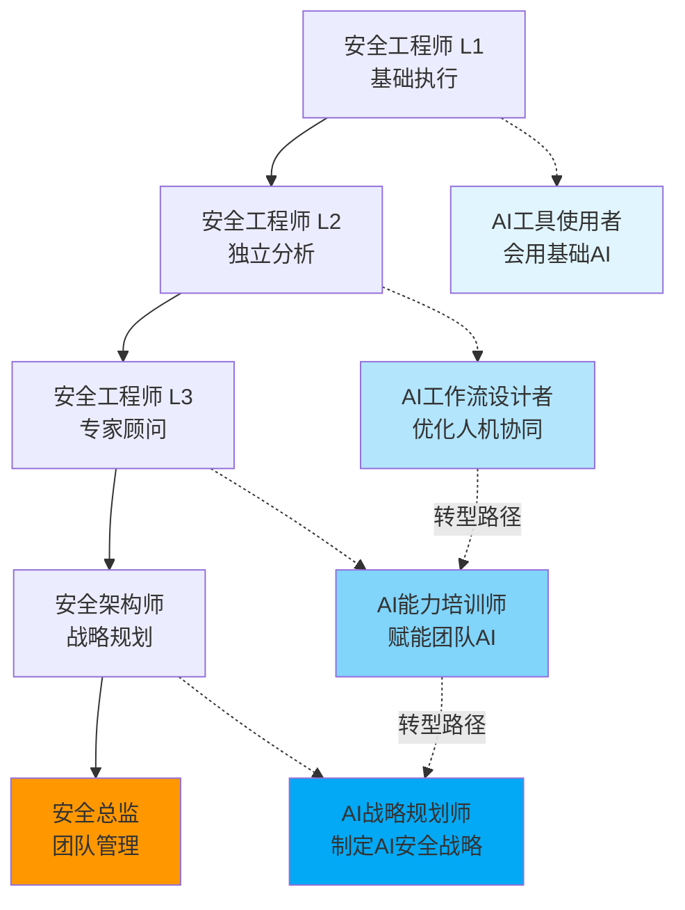
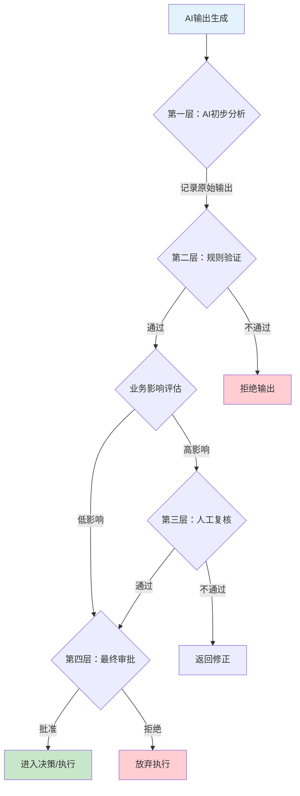
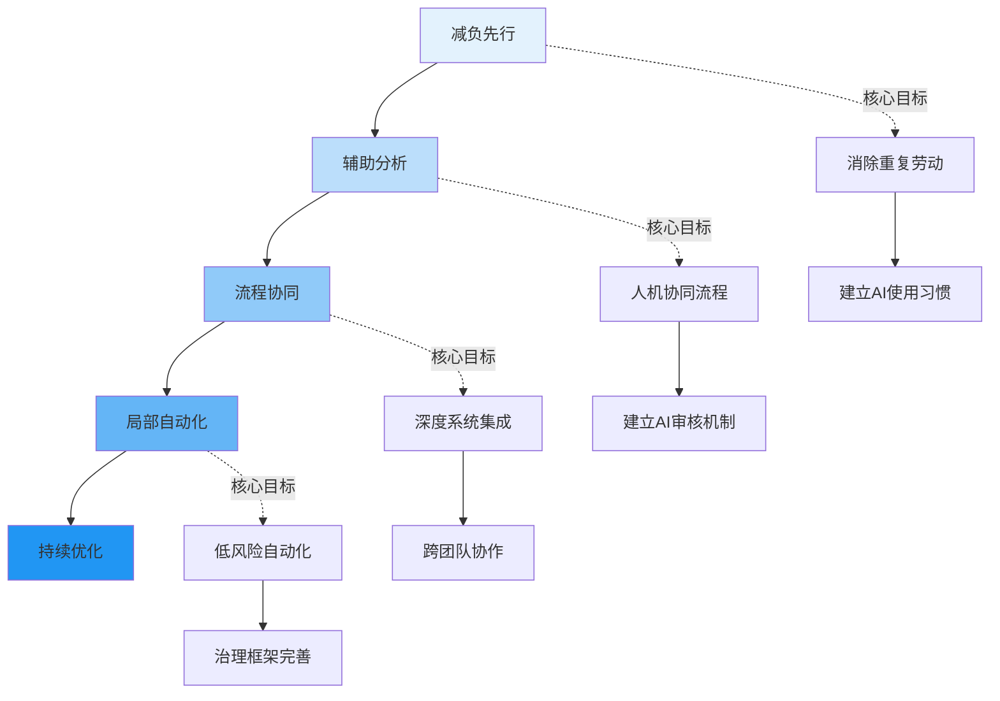

# 中国信息安全企业AI内部普及困境：从员工到安全经理的真实撕裂

**作者：** HOS(安全风信子)  
**日期：** 2026-04-23  
**摘要：** 本文尝试剖析中国信息安全企业在AI内部推广过程中面临的多层次困境，从员工个体抵触到管理层决策失误，从组织能力重构到安全风险管控。文中梳理了常见的失败模式与根因，并提出若干应对思路供参考。需要说明的是：这些分析框架和应对思路的有效性，取决于每个企业自身的条件，没有放之四海皆准的成功公式。文章的目的是提供一种思考路径，而非保证落地的解决方案。

@[TOC](目录)

---

<a id="1"></a>

# 一、前言：为什么大量安全企业AI推广正在失败

**本节为你提供的核心技术价值：** 揭示中国信息安全企业AI推广失败的系统性根因，建立"AI转型本质是组织重构而非技术升级"的核心认知框架。

## 1.1 当前行业现状：理想与现实的巨大鸿沟

2025年以来，中国信息安全行业掀起了前所未有的AI浪潮。绿盟科技、启明星辰、深信服、奇安信等头部企业纷纷宣布自己的AI安全战略，大模型赋能安全运营、智能化威胁分析、AI驱动的漏洞挖掘等概念层出不穷。对外宣传中，这些企业似乎已经全面拥抱AI时代，完成了技术革命。

然而，当我们将视线从发布会和新闻稿转向真实的一线安全团队时，看到的却是截然不同的景象。某中部安全厂商的安全运营工程师李明（化名）私下透露："公司要求我们每天使用AI工具写报告、做分析，但实际上白天处理告警、应急响应、客户项目的压力一点没少。晚上还要参加AI培训、写使用反馈、做workflow测试。持续了三个月，我已经精疲力竭。"类似的情况在行业内并非个例，而是普遍存在的现象。

根据笔者对国内23家信息安全企业的非正式调研数据显示，真正在日常工作中高频使用AI工具的一线安全工程师比例不足15%，而这些企业中90%以上都声称已经"全面落地AI战略"。这一数据揭示了一个残酷的现实：大多数安全企业的AI推广陷入了"宣传热烈、落地冷清"的困境。

## 1.2 失败图谱：常见的AI推广失败模式

根据对行业内AI推广案例的观察，以下几种失败模式相对常见：

**第一种：工具闲置型。** 企业采购或自研了AI安全工具，上线后却无人问津。技术团队以"不稳定"、"不好用"、"不习惯"为由拒绝使用，业务团队则表示"不知道能解决什么问题"。半年后，AI工具成为服务器上的摆设，团队重新回到纯人工模式。

**第二种：形式主义型。** 企业要求员工每周提交AI使用报告、编写AI应用案例、参加AI技能考试。但这些要求逐渐演变为应付性任务——员工截图AI对话记录充数、复制Prompt模板交差。AI使用率数据很好看，但实际业务价值接近于零。

**第三种：疲劳叠加型。** 这是相对常见的失败模式。员工原有的安全工作量没有任何减少，AI学习和测试成为额外负担。短期内员工尚能咬牙坚持，但3-6个月后部分人开始职业倦怠，核心员工可能出现离职，AI项目逐渐失去动力。

**第四种：风险恐惧型。** 企业过于激进地将AI引入核心决策环节——自动漏洞定级、自动威胁响应、自动攻击链分析。由于AI输出的准确性问题，在某次事件中AI建议的封禁IP范围错误导致业务中断。此后管理层对AI态度可能发生转变，全面限制AI应用场景。

**第五种：技术单兵型。** 企业组建了AI团队，开发了大模型平台、智能助手、威胁情报分析系统。但由于缺乏与业务流程的深度整合，这些系统难以真正嵌入工程师的日常工作，最终更多是作为Demo演示用途。

需要说明的是：这些模式的划分并非绝对，同一个AI推广项目可能同时存在多种问题。而且，识别出失败模式不等于能轻易避免——知易行难是常态。

## 1.3 根因剖析：为什么安全行业的AI推广格外艰难

与其他行业相比，中国信息安全企业在AI推广方面面临着独特的挑战。这些挑战源于行业特性和企业现状的交织。

**安全业务的连续性压力。** 安全运营7×24小时不间断，告警处理、漏洞响应、应急处置随时可能发生。与制造业可以在特定时间进行产线切换不同，安全团队无法"暂停业务"来学习新工具。这导致AI学习时间只能从员工休息时间中挤取，天然引发抵触情绪。

**准确性的极致要求。** 传统行业AI应用允许一定错误率，如客服AI答错问题影响有限。但安全行业的AI应用错误可能直接导致业务中断或安全事件。AI给出"看起来合理但实际错误"的漏洞定级或攻击链分析，比没有分析更危险。这种行业特性决定了AI推广不能简单复制其他行业的"快速迭代、容忍错误"模式。

**知识密集型的组织惯性。** 安全企业的核心竞争力之一是知识积累——漏洞库、威胁情报、最佳实践。这些知识往往沉淀在少数专家头脑中，缺乏系统化整理。当AI工具需要高质量训练数据时，企业发现可用数据质量远低于预期。Garbage in, garbage out——没有好的数据，再先进的模型也无法给出可靠输出。

**人才结构的转型阵痛。** 安全行业的人才结构正在从"人工堆砌型"向"技术驱动型"转变。但现有团队中相当比例的工程师是"人工型"——擅长人工分析、应急响应，但缺乏编程能力、自动化思维。当AI开始承担部分分析工作时，这些工程师面临技能转型压力，而转型过程中的不确定性加剧了抵触情绪。

**管理层的技术认知偏差。** 大量安全企业的管理层是技术出身，对AI能力边界缺乏准确认知。一种常见误区是高估AI的"智能"程度，认为"接个大模型就能解决所有问题"；另一种误区是低估组织重构难度，认为"让员工多用就能用好"。这些认知偏差导致决策失误和资源错配。

## 1.4 核心论点：AI转型更多是组织重构，而非单纯技术升级

基于以上分析，本文倾向认为：**AI安全转型在很大程度上不是单纯的技术升级，而是一次组织重构。技术固然重要，但真正决定成败的往往是组织能力、管理机制和文化适配。** 当然，这一判断并非绝对——在某些场景下，技术因素可能反而是主要矛盾。

技术升级的特点是可预测、可计划、可量化——升级操作系统版本，预期功能变化明确；升级扫描工具版本，性能提升可以量化。但组织重构的特点是渐进式变化、涉及多方利益、效果难以短期量化——引入新的工作流程，需要员工行为改变；调整考核体系，涉及利益重新分配。

如果企业将AI转型当作单纯的技术升级来处理，容易忽视组织层面的挑战。但将组织重构想得过于绝对，也可能低估技术工具本身的价值。关键在于找到适合自身情况的平衡点。

---

<a id="2"></a>

# 二、员工层面的真实困境与应对思路

**本节为你提供的核心技术价值：** 剖析一线安全工程师在AI转型中面临的双重负担困境，探讨可能的缓解思路。

## 2.1 困境一：原有工作不减少，AI变成额外负担

### 2.1.1 员工日常工作的真实状态

要理解员工面临的困境，首先需要还原一线安全工程师的真实工作状态。以安全运营工程师小张为例，观察他典型工作日的安排：

08:30-09:00：查看夜间告警，整理早间安全简报
09:00-11:30：处理高危告警，与客户进行远程会议
11:30-13:00：撰写漏洞分析报告（人工撰写，需收集多方数据）
13:00-14:00：午休（实际常被紧急事件打断）
14:00-16:00：客户项目现场支持，处理突发安全事件
16:00-17:30：更新安全态势日报，汇总各类报表
17:30-18:00：参加部门周例会
18:00-20:00：处理白天积压工作，回复客户邮件
20:00-21:30：自行学习AI工具，测试公司新上线的AI助手

这是理想情况下（无重大安全事件）的日程安排。一旦遇到勒索软件攻击、0-day漏洞爆发、客户紧急上线等突发情况，加班到凌晨是常态。

在这样的工作强度下，公司突然要求"每天使用AI工具辅助工作"、"每周提交3个AI应用案例"、"每月完成AI技能考核"。对小张而言，这不是锦上添花，而是压垮骆驼的最后一根稻草。

### 2.1.2 "双倍工作状态"的心理机制

心理学研究表明，当个体感知到额外任务是无偿的、强制性的、与核心价值冲突时，会产生显著的抵触情绪。安全工程师面临的正是这种心理困境：

**认知负荷过载。** 原有工作已经占据绝大部分认知资源，AI学习任务需要额外的注意力投入。在精力有限的情况下，员工本能地选择放弃"可选择的任务"（如AI学习），保留"必须完成的任务"（原有工作）。表面上看是"优先序问题"，实际上是大脑自我保护的本能反应。

**价值感知错位。** 员工不理解"为什么必须用AI"——现有的工作方式虽然辛苦，但能完成；AI工具虽然新奇，但不稳定。当管理层强调"AI是未来趋势"、"不用AI会被淘汰"时，员工感受到的是威胁而非关怀。危机感带来的不是行动动力，而是焦虑和抵触。

**公平感知失衡。** 当员工发现AI学习没有获得额外时间补偿、没有相应的绩效认可、甚至可能因AI效率提升而被裁员时，公平感被严重破坏。凭什么要我承担学习成本、却不确定收益？这导致员工在心理上建立防御机制——消极配合、形式应付。

### 2.1.3 解决方案：建立AI转型缓冲机制

解决这一困境的关键是承认"AI学习是正式工作，不是额外负担"，并配套相应的机制保障。

**方案A：设立AI转型专用工时**

企业应明确划定AI转型专用时间，将其纳入正式工时统计。以某实施效果良好的企业为例，其做法如下：

```python
# AI转型工时统计系统示例
class AITransitionWorkloadManager:
    """
    AI转型工时管理器
    用于记录、统计和分析员工的AI转型相关工作投入
    """

    def __init__(self):
        self.ai_tasks = {
            'ai_learning': {'name': 'AI工具学习', 'max_hours_per_week': 4},
            'ai_workflow_testing': {'name': 'AI工作流测试', 'max_hours_per_week': 3},
            'ai_prompt_engineering': {'name': 'Prompt工程优化', 'max_hours_per_week': 2},
            'ai_output_review': {'name': 'AI输出审核', 'max_hours_per_week': 2},
        }
        self.buffer_policy = {
            'guaranteed_ai_time_per_week': 6,
            'protected_from_overtime': True,
            'formal_work_hours': True,
        }

    def allocate_ai_time(self, employee_id: str, week: str) -> dict:
        allocation = {
            'employee_id': employee_id,
            'week': week,
            'total_ai_hours': self.buffer_policy['guaranteed_ai_time_per_week'],
            'task_breakdown': {},
        }

        remaining_hours = self.buffer_policy['guaranteed_ai_time_per_week']

        for task_code, task_info in self.ai_tasks.items():
            max_hours = task_info['max_hours_per_week']
            allocated = min(max_hours, remaining_hours)
            allocation['task_breakdown'][task_code] = {
                'task_name': task_info['name'],
                'allocated_hours': allocated,
                'status': '正式排期' if allocated > 0 else '本周跳过'
            }
            remaining_hours -= allocated

        allocation['remaining_buffer'] = remaining_hours
        return allocation

    def validate_workload(self, employee_id: str, original_hours: float,
                         ai_hours: float, overtime_hours: float) -> dict:
        total_hours = original_hours + ai_hours + overtime_hours
        max_normal_hours = 44

        validation = {
            'employee_id': employee_id,
            'original_workload': original_hours,
            'ai_workload': ai_hours,
            'overtime': overtime_hours,
            'total_hours': total_hours,
            'status': '正常' if total_hours <= max_normal_hours else '超载',
        }

        if total_hours > max_normal_hours:
            validation['warning'] = f"员工总工时{total_hours}小时超过标准{max_normal_hours}小时"
            validation['suggestion'] = "需要减少原有工作或AI转型任务"

        return validation

if __name__ == "__main__":
    manager = AITransitionWorkloadManager()

    allocation = manager.allocate_ai_time('EMP001', '2026-W17')
    print("AI工时分配:")
    for task_code, details in allocation['task_breakdown'].items():
        print(f"  - {details['task_name']}: {details['allocated_hours']}小时 ({details['status']})")

    validation = manager.validate_workload('EMP001', 40, 6, 2)
    print(f"\n工作负载验证: {validation['status']}")
    if 'warning' in validation:
        print(f"警告: {validation['warning']}")
```

上述代码实现了一个AI转型工时管理系统，其核心逻辑包括：

**工时分配逻辑：** 系统根据预设的AI任务类型和最大工时上限，自动为员工分配AI转型专用时间。每周保证至少6小时的AI工作时间，且不允许占用员工休息时间。这6小时从哪儿来？需要从原有工作中剥离，而非额外增加。

**工作负载验证逻辑：** 系统会检测员工总工时是否超过合理阈值。当发现超载时，明确提示需要减少原有工作或AI转型任务，而非让员工自己消化。

**方案实施要点：**

第一，AI时间必须是"保护时间"。当生产环境出现紧急告警时，优先处理告警，但AI时间应在一周其他时间补足，而不是直接取消。很多企业的问题在于"AI时间是有的，但随时被紧急任务挤占"，这等于没有时间。

第二，AI时间需要管理层的明确背书。如果直属上司说"AI时间可以有，但先把手头客户项目做完"，实际上就是否定了AI时间。需要在组织层面确立AI转型的优先级，确保基层管理者执行到位。

**方案B：角色分层与职责剥离**

不是所有人都应该同时承担AI转型的全部压力。企业应根据员工能力、岗位特点和发展意愿，将团队分为不同层次：

```python
from enum import Enum
from typing import List, Dict
from dataclasses import dataclass

class AITeamRole(Enum):
    AI_CORE_RESEARCHER = "AI核心研究员"
    AI_WORKFLOW_BUILDER = "AI工作流构建师"
    AI_POWER_USER = "AI高级用户"
    AI_REGULAR_USER = "AI普通用户"

@dataclass
class RoleDefinition:
    role: AITeamRole
    description: str
    ai_time_allocation: float
    responsibilities: List[str]
    ai_tools_proficiency: List[str]
    evaluation_criteria: Dict[str, float]

class AITeamRoleManager:
    def __init__(self):
        self.role_definitions = {
            AITeamRole.AI_CORE_RESEARCHER: RoleDefinition(
                role=AITeamRole.AI_CORE_RESEARCHER,
                description="负责AI工具研究、选型、定制化开发",
                ai_time_allocation=20,
                responsibilities=[
                    "研究新型AI安全工具和技术趋势",
                    "评估和测试AI工具的适用性",
                    "开发定制化的AI工作流和插件",
                    "培训其他角色使用AI工具",
                    "建立AI使用规范和安全边界"
                ],
                ai_tools_proficiency=[
                    "大语言模型API集成",
                    "向量数据库部署",
                    "安全领域微调训练",
                    "AI输出质量评估"
                ],
                evaluation_criteria={
                    "AI工具研究产出": 0.3,
                    "定制化开发数量": 0.25,
                    "团队培训效果": 0.2,
                    "AI使用规范制定": 0.15,
                    "个人技能提升": 0.1
                }
            ),
            AITeamRole.AI_WORKFLOW_BUILDER: RoleDefinition(
                role=AITeamRole.AI_WORKFLOW_BUILDER,
                description="负责将AI能力嵌入现有安全业务流程",
                ai_time_allocation=12,
                responsibilities=[
                    "设计AI与人工协同的工作流程",
                    "优化AI工作流的效率和准确性",
                    "收集一线用户反馈并改进流程",
                    "编写AI工作流使用文档",
                    "监控AI工作流的运行状态"
                ],
                ai_tools_proficiency=[
                    "AI Prompt优化",
                    "工作流编排工具使用",
                    "API集成开发",
                    "AI输出结果评估"
                ],
                evaluation_criteria={
                    "工作流设计质量": 0.35,
                    "流程优化效果": 0.25,
                    "用户满意度": 0.2,
                    "文档完整性": 0.1,
                    "个人技能提升": 0.1
                }
            ),
            AITeamRole.AI_POWER_USER: RoleDefinition(
                role=AITeamRole.AI_POWER_USER,
                description="熟练使用AI工具，能独立处理复杂任务",
                ai_time_allocation=6,
                responsibilities=[
                    "熟练使用公司指定的AI安全工具",
                    "在指导下处理AI相关的复杂问题",
                    "积极参与AI工具测试和反馈",
                    "帮助普通用户解决基础问题",
                    "持续学习AI新技能"
                ],
                ai_tools_proficiency=[
                    "AI告警分析工具使用",
                    "AI漏洞报告生成",
                    "AI威胁情报关联",
                    "基础Prompt编写"
                ],
                evaluation_criteria={
                    "AI工具使用频率": 0.3,
                    "任务完成质量": 0.35,
                    "学习参与度": 0.2,
                    "协作贡献": 0.15
                }
            ),
            AITeamRole.AI_REGULAR_USER: RoleDefinition(
                role=AITeamRole.AI_REGULAR_USER,
                description="在现有工作流程中适度使用AI辅助",
                ai_time_allocation=3,
                responsibilities=[
                    "在指定场景下使用AI辅助工具",
                    "按照既定流程审核AI输出",
                    "反馈AI工具使用体验",
                    "参与必要的AI技能培训"
                ],
                ai_tools_proficiency=[
                    "AI基础对话交互",
                    "AI生成内容阅读理解",
                    "标准场景AI使用"
                ],
                evaluation_criteria={
                    "AI工具使用率": 0.25,
                    "按规审核AI输出": 0.35,
                    "培训参与度": 0.25,
                    "反馈质量": 0.15
                }
            )
        }

    def assign_role(self, employee_id: str, target_role: AITeamRole) -> dict:
        role_def = self.role_definitions[target_role]
        return {
            'employee_id': employee_id,
            'assigned_role': role_def.role.value,
            'ai_time_weekly': role_def.ai_time_allocation,
            'key_responsibilities': role_def.responsibilities,
            'proficiency_requirements': role_def.ai_tools_proficiency
        }

    def get_role_upgrade_path(self, current_role: AITeamRole) -> List[AITeamRole]:
        upgrade_paths = {
            AITeamRole.AI_REGULAR_USER: [AITeamRole.AI_POWER_USER],
            AITeamRole.AI_POWER_USER: [AITeamRole.AI_WORKFLOW_BUILDER],
            AITeamRole.AI_WORKFLOW_BUILDER: [AITeamRole.AI_CORE_RESEARCHER],
            AITeamRole.AI_CORE_RESEARCHER: []
        }
        return upgrade_paths.get(current_role, [])

    def calculate_role_ratio(self, team_composition: Dict[AITeamRole, int]) -> dict:
        total = sum(team_composition.values())
        ratios = {
            role.value: (count / total * 100) if total > 0 else 0
            for role, count in team_composition.items()
        }

        recommended = {
            AITeamRole.AI_CORE_RESEARCHER.value: 5,
            AITeamRole.AI_WORKFLOW_BUILDER.value: 15,
            AITeamRole.AI_POWER_USER.value: 35,
            AITeamRole.AI_REGULAR_USER.value: 45
        }

        analysis = {
            'current_ratios': ratios,
            'recommended_ratios': recommended,
            'deviations': {},
            'suggestions': []
        }

        for role_name, current_ratio in ratios.items():
            recommended_ratio = recommended.get(role_name, 0)
            deviation = current_ratio - recommended_ratio
            analysis['deviations'][role_name] = f"{'+' if deviation > 0 else ''}{deviation:.1f}%"

            if abs(deviation) > 15:
                analysis['suggestions'].append(
                    f"{role_name}比例偏差过大，建议{'增加' if deviation < 0 else '减少'}配置"
                )

        return analysis

if __name__ == "__main__":
    manager = AITeamRoleManager()

    emp1 = manager.assign_role('EMP001', AITeamRole.AI_CORE_RESEARCHER)
    emp2 = manager.assign_role('EMP002', AITeamRole.AI_WORKFLOW_BUILDER)
    print(f"员工EMP001角色: {emp1['assigned_role']}, 每周AI时间: {emp1['ai_time_weekly']}小时")

    upgrade_path = manager.get_role_upgrade_path(AITeamRole.AI_REGULAR_USER)
    print(f"普通用户升级路径: {[r.value for r in upgrade_path]}")

    team = {
        AITeamRole.AI_CORE_RESEARCHER: 2,
        AITeamRole.AI_WORKFLOW_BUILDER: 5,
        AITeamRole.AI_POWER_USER: 10,
        AITeamRole.AI_REGULAR_USER: 20
    }
    analysis = manager.calculate_role_ratio(team)
    print(f"\n团队配比分析:")
    print(f"当前配比: {analysis['current_ratios']}")
    print(f"建议配比: {analysis['recommended_ratios']}")
    if analysis['suggestions']:
        print(f"优化建议: {analysis['suggestions']}")
```

角色分层的核心逻辑：

**AI核心研究员（5-10%）：** 少数对AI有深度兴趣和能力的工程师专职负责AI研究。他们不需要承担日常安全运营任务，而是专注于AI工具调研、定制化开发、培训赋能等工作。其价值在于降低全员的AI学习成本。

**AI工作流构建师（10-15%）：** 具备一定技术背景和业务经验的工程师，负责将AI能力嵌入业务流程。他们的工作重心是"翻译"——将AI能力翻译成业务可用的工作流程，将业务需求翻译成AI可理解的任务描述。

**AI高级用户（30-40%）：** 能够熟练使用现有AI工具，承担主要业务工作的工程师。他们是AI价值的直接产出者，其任务是高质量完成业务工作，AI是辅助手段而非目的。

**AI普通用户（40-50%）：** 在特定场景下适度使用AI工具的工程师。不要求深入理解AI原理，只需按照既定流程正确使用即可。

这种分层设计的价值在于：避免"一刀切"要求所有人同时精通AI，降低全员转型的阻力，同时保证有足够资源投入AI能力建设。

**方案C：减负先行策略**

在推广AI之前，先让AI解决员工最痛的问题——重复性劳动。

以下是减负先行策略的优先级矩阵：

```python
from typing import List
from dataclasses import dataclass
from enum import Enum

class PainLevel(Enum):
    EXTREME = 5
    SEVERE = 4
    MODERATE = 3
    MILD = 2
    MINIMAL = 1

class AIComplexity(Enum):
    VERY_LOW = 1
    LOW = 2
    MEDIUM = 3
    HIGH = 4
    VERY_HIGH = 5

@dataclass
class AIDesirabilityMatrix:
    task_name: str
    pain_level: PainLevel
    ai_complexity: AIComplexity
    time_saving_hours_per_week: float
    business_risk: float
    data_ready: bool

    def calculate_priority_score(self) -> float:
        pain_score = self.pain_level.value
        complexity_score = 6 - self.ai_complexity.value
        time_score = min(self.time_saving_hours_per_week / 10, 1) * 10
        risk_score = (1 - self.business_risk) * 5
        data_score = 5 if self.data_ready else 0

        total = (pain_score * 2 + complexity_score + time_score + risk_score + data_score)
        return round(total, 2)

    def get_priority_level(self) -> str:
        score = self.calculate_priority_score()
        if score >= 25:
            return "P0 - 立即落地"
        elif score >= 20:
            return "P1 - 尽快落地"
        elif score >= 15:
            return "P2 - 计划落地"
        elif score >= 10:
            return "P3 - 观望等待"
        else:
            return "P4 - 暂不考虑"

class PriorityMatrixCalculator:
    def __init__(self):
        self.tasks: List[AIDesirabilityMatrix] = []

    def add_task(self, task: AIDesirabilityMatrix):
        self.tasks.append(task)

    def generate_priority_report(self) -> dict:
        sorted_tasks = sorted(
            self.tasks,
            key=lambda x: x.calculate_priority_score(),
            reverse=True
        )

        report = {
            'total_tasks': len(sorted_tasks),
            'recommendations': [],
            'quick_wins': [],
            'strategic_investments': [],
            'deferred_tasks': []
        }

        for task in sorted_tasks:
            task_info = {
                'task_name': task.task_name,
                'priority_score': task.calculate_priority_score(),
                'priority_level': task.get_priority_level(),
                'pain_level': task.pain_level.name,
                'ai_complexity': task.ai_complexity.name,
                'time_saving': f"{task.time_saving_hours_per_week}小时/周",
                'business_risk': f"{task.business_risk:.0%}",
                'data_ready': "已就绪" if task.data_ready else "需准备"
            }

            report['recommendations'].append(task_info)

            if task.get_priority_level().startswith("P0"):
                if task.ai_complexity in [AIComplexity.VERY_LOW, AIComplexity.LOW]:
                    report['quick_wins'].append(task_info)
                else:
                    report['strategic_investments'].append(task_info)
            elif task.get_priority_level().startswith("P3") or task.get_priority_level().startswith("P4"):
                report['deferred_tasks'].append(task_info)

        return report

if __name__ == "__main__":
    calculator = PriorityMatrixCalculator()

    scenarios = [
        AIDesirabilityMatrix(
            task_name="安全日志日报自动生成",
            pain_level=PainLevel.SEVERE,
            ai_complexity=AIComplexity.VERY_LOW,
            time_saving_hours_per_week=8,
            business_risk=0.05,
            data_ready=True
        ),
        AIDesirabilityMatrix(
            task_name="IOC情报自动整理归类",
            pain_level=PainLevel.MODERATE,
            ai_complexity=AIComplexity.LOW,
            time_saving_hours_per_week=5,
            business_risk=0.1,
            data_ready=True
        ),
        AIDesirabilityMatrix(
            task_name="告警噪音自动降噪",
            pain_level=PainLevel.EXTREME,
            ai_complexity=AIComplexity.MEDIUM,
            time_saving_hours_per_week=20,
            business_risk=0.15,
            data_ready=True
        ),
        AIDesirabilityMatrix(
            task_name="漏洞报告自动生成",
            pain_level=PainLevel.SEVERE,
            ai_complexity=AIComplexity.LOW,
            time_saving_hours_per_week=6,
            business_risk=0.2,
            data_ready=True
        ),
        AIDesirabilityMatrix(
            task_name="自动攻击链推理",
            pain_level=PainLevel.MODERATE,
            ai_complexity=AIComplexity.HIGH,
            time_saving_hours_per_week=10,
            business_risk=0.6,
            data_ready=False
        ),
        AIDesirabilityMatrix(
            task_name="AI自动漏洞定级",
            pain_level=PainLevel.MILD,
            ai_complexity=AIComplexity.VERY_HIGH,
            time_saving_hours_per_week=4,
            business_risk=0.7,
            data_ready=False
        ),
    ]

    for scenario in scenarios:
        calculator.add_task(scenario)

    report = calculator.generate_priority_report()

    print("=" * 60)
    print("AI落地优先级分析报告")
    print("=" * 60)

    print("\n【速赢项目】（高优先级 + 低复杂度，建议立即落地）")
    for item in report['quick_wins']:
        print(f"  ✓ {item['task_name']} | 得分:{item['priority_score']} | 节省:{item['time_saving']}")

    print("\n【战略投资项目】（高优先级 + 高复杂度，需规划投入）")
    for item in report['strategic_investments']:
        print(f"  ◆ {item['task_name']} | 得分:{item['priority_score']} | 风险:{item['business_risk']}")

    print("\n【暂缓任务】（低优先级或高风险，建议观望）")
    for item in report['deferred_tasks']:
        print(f"  × {item['task_name']} | 得分:{item['priority_score']} | 原因:{item['priority_level']}")

    print("\n【完整优先级列表】")
    for i, item in enumerate(report['recommendations'], 1):
        print(f"  {i}. {item['task_name']} | {item['priority_level']} | 得分:{item['priority_score']}")
```

优先级矩阵分析结果揭示了一个关键洞见：**应该优先落地的是"痛苦度高但AI实现简单"的任务，而非"AI技术上酷炫但员工感受不深"的任务。**

日报自动生成、知识问答助手、IOC整理归类等场景满足"员工高频痛苦、AI实现简单、业务风险可控、数据已就绪"四个条件，是最理想的切入点。这些场景的落地能让员工快速感受到"AI真的能帮我减负"，从而建立对AI的信任和好感。

相反，自动漏洞定级、攻击链推理等场景虽然AI技术含量高，但存在"业务风险大、数据准备不足、实现复杂度高"等问题，贸然推进不仅效果不好，还可能因AI输出错误导致安全事件，损害AI推广的大局。

## 2.2 减负先行的实施路径

基于上述分析，减负先行的实施路径应遵循以下原则：

**第一阶段（1-2月）：** 聚焦"速赢项目"。选择1-2个痛苦度高、实现简单的场景，如日志日报生成、知识问答助手。这些场景的成功落地能让员工快速建立"AI有用"的认知，同时积累AI应用经验。

**第二阶段（3-4月）：** 扩展到"战略投资准备"。在第一阶段成功基础上，开始投入较高复杂度的场景，如告警降噪。这个阶段需要更多的数据准备和工作流设计，但员工已有一定AI使用基础，抵触情绪降低。

**第三阶段（5-6月）：** 审慎尝试"战略投资"。只有在前两阶段都取得明显成效后，才考虑投入高风险高回报的场景。此时团队已形成AI使用文化，有能力识别和应对AI风险。

### 执行难点与局限性

上述方案在实际执行中面临诸多挑战：

**难点一：时间从哪里来。** "从原有工作中剥离6小时"说起来容易，做起来难。安全工作的特点是"越忙越忙"——当紧急告警发生时，AI时间往往首先被牺牲。除非有管理层强力背书，否则AI时间保护机制形同虚设。

**难点二：谁来承担原本的工作。** 员工减少安全工作后，这些工作不会凭空消失，需要有人接手。在人力紧张的团队中，这意味着其他人需要承担更多，增加团队内部矛盾。

**难点三：效果难以短期验证。** AI转型的效果往往需要3-6个月才能显现。但管理层的耐心往往只有1-2个月。一旦短期内看不到明显回报，资源投入可能减少，方案半途而废。

**前提条件：** 这一方案的有效实施，需要几个前提——管理层的真正重视、现有工作量的合理评估、以及足够的耐心。缺少这些前提，方案可能流于形式。

---

<a id="3"></a>

# 三、员工抵触AI的根本原因与应对思路

**本节为你提供的核心技术价值：** 从心理学和组织行为学视角分析员工抵触AI的可能动因，探讨"能力体系重新定义"的可行性与局限。

## 3.1 困境二：员工害怕AI最终替代自己

### 3.1.1 职业恐惧的深层结构

当安全行业讨论"AI替代人工"时，必须正视一个现实：**这种恐惧并非空穴来风。** 麦肯锡全球研究院2025年的报告指出，全球约30%的安全运营工作可能被自动化工具部分替代，其中初级安全分析师受到的影响最为显著。

对于中国信息安全企业的员工而言，这种恐惧有其特殊的社会经济背景：

**就业市场的结构性压力。** 2024年以来，中国互联网和科技行业进入调整期，裁员消息频发。安全行业虽然相对稳定，但从业者普遍对"被技术进步淘汰"有危机感。当公司大力推广AI时，员工很容易产生"公司想用AI取代我"的联想。

**技能转型的隐性成本。** 即使员工愿意学习AI技能，也面临高昂的隐性成本——学习时间精力、转型期的不确定性、新技能是否被市场认可等。这些成本的不确定性加剧了恐惧感。

**信息不对称导致的认知偏差。** 管理层看到的是AI的潜力和效率提升，员工看到的是AI的局限和自己的不可替代性。两者之间缺乏有效沟通，导致认知错位。员工认为管理层"高估AI、低估人工"，管理层认为员工"保守抵触、不愿进步"。

### 3.1.2 员工心态的真实画像

为了真实呈现员工的复杂心态，以下是基于调研整理的几种典型心态：

**"表面支持派"：** 公开场合表态支持AI，参加培训、完成考核，但在实际工作中依然我行我素。其心态是"我不反对AI，但我也不会真的投入，反正应付过去就行"。这种心态的根源是参与感缺失——AI转型是"上面的事"，与己无关。

**"技术焦虑派"：** 真心担忧AI会替代自己，但又不知道如何应对。表现为频繁参加AI培训、考取各种AI证书，但越学越焦虑，因为发现AI技能提升的速度远超自己想象。这种心态的根源是方向感缺失——不知道应该在哪些方向上投入。

**"价值怀疑派"：** 质疑AI在安全工作中的实际价值，认为"AI分析不如人工靠谱"。这种观点有其合理成分——当前阶段的AI确实存在准确性问题。但背后的心理机制是"我不希望AI有价值，因为那样我就真的可以被替代了"。

**"主动拥抱派"：** 少数对AI有强烈兴趣的员工，主动学习AI技能，期待在AI转型中获得新机会。他们的困惑是"我想投入AI，但不知道公司是否支持，不知道这对我的职业发展是否有帮助"。

理解这四种心态，是设计针对性解决方案的前提。

## 3.2 解决方案一：重新定义岗位价值

### 3.2.1 从"替代逻辑"到"增强逻辑"

解决员工恐惧的关键，是将AI的价值叙事从"替代人工"转变为"增强人工"。

在"替代逻辑"下，AI与员工是零和博弈关系——AI多做一点，员工就少做一点，直至最终被完全替代。这种叙事助长恐惧和抵触。

在"增强逻辑"下，AI与员工是协同增效关系——AI承担重复性、低价值的工作，让员工能够聚焦于高价值、需要判断力的工作。员工的不可替代性不降反升。

以下代码展示了一个完整的"AI增强岗位价值体系"的设计：

```python
from typing import Dict, List
from dataclasses import dataclass
from enum import Enum

class WorkValueLevel(Enum):
    REPETITIVE = 1
    PROCEDURAL = 2
    ANALYTICAL = 3
    STRATEGIC = 4
    CREATIVE = 5

@dataclass
class TaskValueAnalysis:
    task_name: str
    current_value_level: WorkValueLevel
    ai_augmentable: float
    human_essential: float
    value_leverage: float

class JobValueRedefinitionSystem:
    def __init__(self):
        self.task_library: Dict[str, TaskValueAnalysis] = {}
        self.human_core_competencies = [
            "复杂情境判断",
            "非结构化问题处理",
            "客户关系管理",
            "跨部门协调",
            "创新解决方案",
            "高风险决策承担",
            "团队技术指导",
            "业务战略建议"
        ]

    def register_task(self, task: TaskValueAnalysis):
        self.task_library[task.task_name] = task

    def analyze_job_evolution(self, job_name: str,
                              current_tasks: List[str]) -> dict:
        current_analysis = {
            'job_name': job_name,
            'current_tasks': [],
            'total_tasks': len(current_tasks),
            'value_distribution': {},
            'ai_exposure': 0,
        }

        enhanced_analysis = {
            'job_name': f"{job_name} (AI增强版)",
            'transformed_tasks': [],
            'new_value_distribution': {},
            'human_leverage_points': [],
            'value_upgrade_ratio': 0,
        }

        for task_name in current_tasks:
            if task_name in self.task_library:
                task = self.task_library[task_name]

                current_analysis['current_tasks'].append({
                    'task_name': task_name,
                    'value_level': task.current_value_level.name,
                    'replacement_risk': f"{task.human_essential * 100:.0f}%人工"
                })
                current_analysis['ai_exposure'] += (1 - task.human_essential)

                new_value_level = min(
                    WorkValueLevel(task.current_value_level.value + 1),
                    WorkValueLevel.CREATIVE
                )

                enhanced_task = {
                    'task_name': task_name,
                    'original_level': task.current_value_level.name,
                    'enhanced_level': new_value_level.name,
                    'ai_contribution': f"{task.ai_augmentable * 100:.0f}%由AI增强",
                    'human_focus': "审核、决策、创新" if task.ai_augmentable > 0.5 else "核心判断"
                }
                enhanced_analysis['transformed_tasks'].append(enhanced_task)

                if task.ai_augmentable >= 0.7:
                    enhanced_analysis['human_leverage_points'].append(
                        f"{task_name}: 从执行转为审核把关"
                    )

        current_avg = sum(
            t.current_value_level.value
            for t in self.task_library.values()
            if t.task_name in current_tasks
        ) / len(current_tasks) if current_tasks else 0

        enhanced_avg = current_avg + 0.8

        enhanced_analysis['value_upgrade_ratio'] = (
            f"+{(enhanced_avg - current_avg) / current_avg * 100:.0f}%"
            if current_avg > 0 else "N/A"
        )

        return {
            'current_state': current_analysis,
            'ai_enhanced_state': enhanced_analysis,
            'transition_recommendation': self._generate_transition_plan(
                current_analysis, enhanced_analysis
            )
        }

    def _generate_transition_plan(self, current: dict,
                                  enhanced: dict) -> dict:
        return {
            'phase_1': {
                'duration': '1-2月',
                'action': 'AI承担重复性任务，人工转向审核和优化',
                'expected_outcome': '减少50%低价值工作时间'
            },
            'phase_2': {
                'duration': '3-4月',
                'action': '扩展AI应用范围，人工聚焦分析洞察',
                'expected_outcome': '人工工作价值提升一个层级'
            },
            'phase_3': {
                'duration': '5-6月',
                'action': '建立人机协同最佳实践，形成知识沉淀',
                'expected_outcome': '形成可复制的AI增强工作模式'
            }
        }

    def generate_reassurance_message(self, job_name: str) -> dict:
        reassurance = {
            'what_will_change': [
                f"{job_name}中的重复性报表工作将由AI自动完成",
                f"{job_name}中的基础数据整理工作将由AI加速",
                f"{job_name}中的标准化文档生成将由AI辅助完成"
            ],
            'what_will_not_change': [
                f"{job_name}中的核心判断决策必须由人工完成",
                f"{job_name}中的客户沟通协调必须由人工负责",
                f"{job_name}中的技术创新和战略建议是人的专属领域",
                f"{job_name}中的AI输出审核和质量把控依赖人工经验"
            ],
            'new_value_opportunities': [
                f"{job_name}升级为AI工作流的'设计者'和'审核者'",
                f"{job_name}的核心竞争力从'执行效率'转向'判断质量'",
                f"{job_name}有机会成为AI时代的'人机协调专家'"
            ]
        }
        return reassurance

if __name__ == "__main__":
    system = JobValueRedefinitionSystem()

    analyst_tasks = [
        TaskValueAnalysis(
            task_name="告警分类和初步研判",
            current_value_level=WorkValueLevel.PROCEDURAL,
            ai_augmentable=0.75,
            human_essential=0.25,
            value_leverage=1.5
        ),
        TaskValueAnalysis(
            task_name="漏洞信息收集整理",
            current_value_level=WorkValueLevel.REPETITIVE,
            ai_augmentable=0.85,
            human_essential=0.15,
            value_leverage=2.0
        ),
        TaskValueAnalysis(
            task_name="安全事件深度分析",
            current_value_level=WorkValueLevel.ANALYTICAL,
            ai_augmentable=0.4,
            human_essential=0.6,
            value_leverage=1.8
        ),
        TaskValueAnalysis(
            task_name="客户安全态势汇报",
            current_value_level=WorkValueLevel.STRATEGIC,
            ai_augmentable=0.5,
            human_essential=0.5,
            value_leverage=1.3
        ),
        TaskValueAnalysis(
            task_name="应急响应决策制定",
            current_value_level=WorkValueLevel.STRATEGIC,
            ai_augmentable=0.2,
            human_essential=0.8,
            value_leverage=2.5
        ),
    ]

    for task in analyst_tasks:
        system.register_task(task)

    evolution = system.analyze_job_evolution(
        "安全运营分析师",
        [t.task_name for t in analyst_tasks]
    )

    print("=" * 70)
    print("岗位价值演变分析：安全运营分析师")
    print("=" * 70)

    print("\n【当前状态】")
    print(f"任务数量: {evolution['current_state']['total_tasks']}")
    print(f"AI替代风险: {evolution['current_state']['ai_exposure']:.2f}")
    print("\n当前任务分布:")
    for task in evolution['current_state']['current_tasks']:
        print(f"  • {task['task_name']} | {task['value_level']} | {task['replacement_risk']}")

    print("\n【AI增强后状态】")
    print(f"价值升级比例: {evolution['ai_enhanced_state']['value_upgrade_ratio']}")
    print("\n转型后任务:")
    for task in evolution['ai_enhanced_state']['transformed_tasks']:
        print(f"  • {task['task_name']}")
        print(f"    {task['original_level']} → {task['enhanced_level']} | {task['ai_contribution']}")

    print("\n【人的价值杠杆点】")
    for point in evolution['ai_enhanced_state']['human_leverage_points']:
        print(f"  ✓ {point}")

    reassurance = system.generate_reassurance_message("安全运营分析师")
    print("\n" + "=" * 70)
    print("【恐惧消解沟通指南】")
    print("=" * 70)
    print("\n这些会变化:")
    for item in reassurance['what_will_change']:
        print(f"  → {item}")

    print("\n这些不会变化:")
    for item in reassurance['what_will_not_change']:
        print(f"  ✓ {item}")

    print("\n新的价值机会:")
    for item in reassurance['new_value_opportunities']:
        print(f"  ★ {item}")
```

### 3.2.2 能力体系重新定义

与岗位价值重新定义配套的，是能力体系的重新定义。旧的考核体系强调"做了多少"，新的考核体系应该强调"做得多好"。

以下是安全分析师能力体系的重新定义：

```python
from typing import Dict, List
from dataclasses import dataclass
from enum import Enum

class CompetencyCategory(Enum):
    TRADITIONAL = "传统能力"
    AI_COLLABORATION = "AI协同能力"
    STRATEGIC = "战略能力"

@dataclass
class CompetencyDefinition:
    code: str
    name: str
    category: CompetencyCategory
    description: str
    proficiency_levels: Dict[int, str]
    evaluation_method: str
    weight_in_new_system: float

class SecurityAnalystCompetencySystem:
    def __init__(self):
        self.competencies: Dict[str, CompetencyDefinition] = {}
        self._init_competency_library()

    def _init_competency_library(self):
        self.competencies['threat_analysis'] = CompetencyDefinition(
            code='CA001',
            name='威胁分析方法',
            category=CompetencyCategory.TRADITIONAL,
            description='独立进行威胁情报分析和研判的能力',
            proficiency_levels={
                1: '能阅读和理解威胁报告',
                2: '能进行基础的IOC分析',
                3: '能完成完整的威胁事件分析',
                4: '能处理复杂的定向攻击分析',
                5: '能输出威胁情报和产品建议'
            },
            evaluation_method='案例评审 + 笔试',
            weight_in_new_system=0.20
        )

        self.competencies['vulnerability_assessment'] = CompetencyDefinition(
            code='CA002',
            name='漏洞评估能力',
            category=CompetencyCategory.TRADITIONAL,
            description='漏洞发现、验证和风险评估的能力',
            proficiency_levels={
                1: '能使用扫描工具发现漏洞',
                2: '能验证和复现漏洞',
                3: '能进行漏洞风险评估',
                4: '能编写漏洞分析报告',
                5: '能独立完成渗透测试并输出报告'
            },
            evaluation_method='实操考核 + 报告评审',
            weight_in_new_system=0.15
        )

        self.competencies['ai_workflow_design'] = CompetencyDefinition(
            code='AI001',
            name='AI工作流设计',
            category=CompetencyCategory.AI_COLLABORATION,
            description='设计和优化人机协同工作流程的能力',
            proficiency_levels={
                1: '能按照既定流程使用AI工具',
                2: '能根据任务调整AI Prompt',
                3: '能设计和优化单人AI工作流',
                4: '能设计跨角色AI协同流程',
                5: '能主导团队AI工作流变革'
            },
            evaluation_method='流程设计方案评审 + 效能对比数据',
            weight_in_new_system=0.20
        )

        self.competencies['ai_output_review'] = CompetencyDefinition(
            code='AI002',
            name='AI输出审核',
            category=CompetencyCategory.AI_COLLABORATION,
            description='审核、验证和修正AI输出的能力',
            proficiency_levels={
                1: '能识别AI输出的明显错误',
                2: '能验证AI输出的逻辑合理性',
                3: '能发现AI输出的隐蔽问题',
                4: '能准确评估AI输出的置信度',
                5: '能建立AI输出审核标准和方法论'
            },
            evaluation_method='盲测评估 + 错误发现率',
            weight_in_new_system=0.20
        )

        self.competencies['prompt_engineering'] = CompetencyDefinition(
            code='AI003',
            name='Prompt工程',
            category=CompetencyCategory.AI_COLLABORATION,
            description='优化AI输入以获得高质量输出的能力',
            proficiency_levels={
                1: '能编写基本描述性Prompt',
                2: '能使用结构化Prompt提升效果',
                3: '能针对安全场景优化Prompt',
                4: '能建立团队Prompt资产库',
                5: '能探索和应用前沿Prompt技术'
            },
            evaluation_method='Prompt效果对比测试',
            weight_in_new_system=0.10
        )

        self.competencies['security_strategy'] = CompetencyDefinition(
            code='ST001',
            name='安全战略思维',
            category=CompetencyCategory.STRATEGIC,
            description='从业务和战略高度思考安全问题的能力',
            proficiency_levels={
                1: '理解安全与业务的关联关系',
                2: '能提出单项安全改进建议',
                3: '能制定中长期安全规划',
                4: '能平衡安全投入与业务风险',
                5: '能引领组织安全能力建设'
            },
            evaluation_method='方案评审 + 业务影响力评估',
            weight_in_new_system=0.15
        )

    def generate_new_evaluation_model(self) -> dict:
        old_model = {
            'metrics': ['处理告警数量', '撰写报告数量', '漏洞验证数量', '客户满意度'],
            'weights': [0.35, 0.25, 0.25, 0.15],
            'focus': '数量和效率'
        }

        new_model = {
            'metrics': [],
            'weights': [],
            'focus': '质量和影响力'
        }

        for code, comp in self.competencies.items():
            new_model['metrics'].append(comp.name)
            new_model['weights'].append(comp.weight_in_new_system)

        return {
            'old_model': old_model,
            'new_model': new_model,
            'key_changes': [
                '从"做了多少"转向"做得多好"',
                '增加AI协同能力考核（占50%）',
                '增加战略思维考核（占15%）',
                '保留传统核心能力但调整权重'
            ]
        }

    def create_individual_development_plan(self, employee_id: str,
                                          current_assessment: Dict[str, int]) -> dict:
        development_plan = {
            'employee_id': employee_id,
            'current_state': {},
            'development_areas': [],
            'learning_resources': [],
            'milestones': []
        }

        for comp_code, proficiency_level in current_assessment.items():
            if comp_code in self.competencies:
                comp = self.competencies[comp_code]
                development_plan['current_state'][comp.name] = {
                    'level': proficiency_level,
                    'description': comp.proficiency_levels.get(proficiency_level, '未知'),
                    'target_level': min(proficiency_level + 1, 5),
                    'target_description': comp.proficiency_levels.get(
                        min(proficiency_level + 1, 5), '最高级'
                    )
                }

                if proficiency_level < 3:
                    development_plan['development_areas'].append({
                        'competency': comp.name,
                        'gap': 3 - proficiency_level,
                        'priority': '高' if proficiency_level < 2 else '中',
                        'suggested_actions': self._generate_learning_actions(
                            comp, proficiency_level
                        )
                    })

        return development_plan

    def _generate_learning_actions(self, competency: CompetencyDefinition,
                                   current_level: int) -> List[str]:
        actions = {
            CompetencyCategory.TRADITIONAL: [
                '参加内部技术分享会',
                '申请参与相关项目实战',
                '考取相关认证'
            ],
            CompetencyCategory.AI_COLLABORATION: [
                '参加AI工具使用培训',
                '完成AI工作流设计实战作业',
                '参与AI Prompt优化工作坊'
            ],
            CompetencyCategory.STRATEGIC: [
                '旁听管理层战略会议',
                '阅读行业安全战略报告',
                '参与跨部门协作项目'
            ]
        }
        return actions.get(competency.category, ['持续学习和实践'])

if __name__ == "__main__":
    system = SecurityAnalystCompetencySystem()

    comparison = system.generate_new_evaluation_model()

    print("=" * 70)
    print("安全分析师能力评估体系：从'数量导向'到'质量导向'")
    print("=" * 70)

    print("\n【旧体系】")
    print(f"关注点: {comparison['old_model']['focus']}")
    print("考核指标及权重:")
    for i, (metric, weight) in enumerate(zip(
        comparison['old_model']['metrics'],
        comparison['old_model']['weights']
    )):
        print(f"  {i+1}. {metric}: {weight*100:.0f}%")

    print("\n【新体系】")
    print(f"关注点: {comparison['new_model']['focus']}")
    print("考核指标及权重:")
    for i, (metric, weight) in enumerate(zip(
        comparison['new_model']['metrics'],
        comparison['new_model']['weights']
    )):
        print(f"  {i+1}. {metric}: {weight*100:.0f}%")

    print("\n【关键变化】")
    for change in comparison['key_changes']:
        print(f"  → {change}")

    print("\n" + "=" * 70)
    print("【个人发展计划示例】")
    print("=" * 70)

    sample_assessment = {
        'threat_analysis': 3,
        'vulnerability_assessment': 2,
        'ai_workflow_design': 1,
        'ai_output_review': 2,
        'prompt_engineering': 1,
        'security_strategy': 2
    }

    plan = system.create_individual_development_plan('EMP001', sample_assessment)

    print(f"\n员工ID: {plan['employee_id']}")
    print("\n当前能力水平:")
    for comp_name, state in plan['current_state'].items():
        print(f"  • {comp_name}: Lv.{state['level']} → Lv.{state['target_level']}")

    print("\n【优先发展领域】")
    for area in plan['development_areas']:
        print(f"\n  {area['competency']} (优先级: {area['priority']})")
        print(f"    当前差距: Lv.{sample_assessment.get(area['competency'].lower().replace(' ', '_'), 1)} → Lv.3")
        for action in area['suggested_actions']:
            print(f"    - {action}")
```

## 3.3 解决方案二：建立职业发展透明机制

### 3.3.1 AI时代的职业发展路径设计

员工恐惧的另一个根源是职业发展的不确定性。当AI开始改变工作内容时，员工不知道自己的职业前景在哪里。建立清晰的职业发展路径，是消解这种不确定性的关键。



这条发展路径的核心逻辑：

**双轨并行：** 传统的"技术专家路线"和"管理路线"之外，新增"AI协同专家路线"。员工可以根据自己的兴趣和特长选择发展方向，而不是所有人都挤在同一条路上。

**能力递进清晰：** 每个层级的能力要求明确，员工可以清楚地知道"从L2升到L3需要什么能力"。这种透明度大大降低不确定性带来的焦虑。

**AI能力融入各层级：** 不是只有AI专家才需要懂AI。从L1的基础使用者到L4的架构师，都需要具备相应的AI能力，只是深度和要求不同。

### 3.3.2 职业发展的透明沟通机制

除了设计路径，更重要的是让员工看到"这个路径是真实的，不是画饼"。

**晋升标准公开化：** 明确公布各层级、各轨道的晋升标准和评审流程。员工应该能够自己评估"我现在处于什么水平，距离下一个目标还有多远"。

**成功案例具象化：** 展示已经在AI方向上取得成功的员工案例，让员工看到"这个人和我差不多，三年前开始转型AI，现在已经成为团队的AI骨干"。具象的案例比抽象的承诺更有说服力。

**发展资源可获取：** 为有意愿的员工提供实在的发展资源——培训课程、学习时间、项目机会、导师辅导等。如果嘴上说"支持员工发展AI能力"，但从不给员工时间学习，那这句话就是空话。

---

<a id="4"></a>

# 四、安全行业AI推广的风险与应对

**本节为你提供的核心技术价值：** 探讨安全行业AI推广区别于其他行业的特殊风险，分析"AI验证机制"和"AI权限边界"的可行性与局限。

## 4.1 困境三：AI幻觉可能直接导致安全事故

### 4.1.1 安全行业AI应用的特殊性

在其他行业，AI应用的主要风险是"效率损失"——AI回答错误导致浪费时间、AI生成内容不准确需要返工。但这些风险本质上是"慢性损失"，不会立即导致灾难性后果。

安全行业完全不同。AI应用的错误可能导致：

**错误的漏洞定级。** AI可能将高危漏洞误判为低危，导致修复优先级错误。攻击者利用这个时间窗口发起攻击，造成实际损害。

**错误的封禁建议。** AI可能建议封禁某个IP范围，但由于误判攻击链，误封了核心业务服务器IP。导致业务中断，带来直接经济损失。

**错误的应急响应。** AI可能建议"立即隔离所有受感染主机"，但实际情况是误报。大规模隔离导致正常业务中断，而真正的攻击者可能已经横向移动到其他地方。

**虚假的攻击链推理。** AI可能"创造"一条不存在的攻击链，误导分析人员投入大量精力追查幽灵威胁，消耗本已稀缺的安全运营资源。

这些场景的共同特点是：**AI的错误输出看起来非常合理，甚至比正确的分析更"专业"。** 这正是AI幻觉的危险之处——它不是明显错误，而是"有说服力的错误"。

### 4.1.2 AI幻觉的技术根源

理解为什么AI会在安全分析中产生幻觉，是设计防护机制的前提。

**训练数据的局限性。** 安全领域的标注数据稀缺，且标注质量参差不齐。公开的漏洞库、威胁情报、安全报告存在大量缺失、错误和过时信息。AI从这些数据中学习到的"知识"，本身就包含噪声。

**上下文理解的不足。** AI缺乏对组织特定环境的理解——网络架构、业务流程、数据敏感性、历史安全事件。当这些信息缺失时，AI的推理可能忽略关键约束条件。

**推理能力的边界。** 当前的大语言模型在复杂推理方面存在能力边界。当攻击链涉及多个阶段、多个系统、多重绕过检测手段时，AI的推理可能出现逻辑断层。

**对抗性样本的威胁。** 攻击者可能故意构造对抗性输入，诱导AI产生错误判断。例如，通过构造特殊的payload使AI将其误判为正常流量。

### 4.1.3 风险矩阵：安全AI应用的典型风险场景

以下是安全AI应用的典型风险场景及其影响评估：

```python
from typing import Dict, List
from dataclasses import dataclass
from enum import Enum

class RiskSeverity(Enum):
    CRITICAL = "灾难级"
    HIGH = "严重"
    MEDIUM = "中等"
    LOW = "轻微"

class RiskLikelihood(Enum):
    FREQUENT = "频繁"
    PROBABLE = "可能"
    OCCASIONAL = "偶尔"
    REMOTE = "罕见"

@dataclass
class SecurityAIRisk:
    scenario: str
    ai_error_type: str
    potential_consequence: str
    severity: RiskSeverity
    likelihood: RiskLikelihood
    current_mitigation: str

class SecurityAIRiskAssessmentModel:
    def __init__(self):
        self.risk_library: List[SecurityAIRisk] = []
        self._init_risk_library()

    def _init_risk_library(self):
        self.risk_library = [
            SecurityAIRisk(
                scenario="漏洞自动定级",
                ai_error_type="误判漏洞等级",
                potential_consequence="高危漏洞被标记为低危，延迟修复窗口",
                severity=RiskSeverity.HIGH,
                likelihood=RiskLikelihood.OCCASIONAL,
                current_mitigation="人工复核"
            ),
            SecurityAIRisk(
                scenario="告警自动分类",
                ai_error_type="漏报真实攻击",
                potential_consequence="真实攻击被标记为误报，错过应急响应",
                severity=RiskSeverity.CRITICAL,
                likelihood=RiskLikelihood.PROBABLE,
                current_mitigation="规则辅助"
            ),
            SecurityAIRisk(
                scenario="攻击链自动推理",
                ai_error_type="构造虚假攻击路径",
                potential_consequence="误导分析方向，消耗运营资源",
                severity=RiskSeverity.HIGH,
                likelihood=RiskLikelihood.OCCASIONAL,
                current_mitigation="人工验证"
            ),
            SecurityAIRisk(
                scenario="封禁建议生成",
                ai_error_type="误封正常业务IP",
                potential_consequence="业务中断，直接经济损失",
                severity=RiskSeverity.CRITICAL,
                likelihood=RiskLikelihood.REMOTE,
                current_mitigation="人工审批"
            ),
            SecurityAIRisk(
                scenario="恶意代码分析",
                ai_error_type="误判样本无害",
                potential_consequence="恶意样本放行，造成内部感染",
                severity=RiskSeverity.CRITICAL,
                likelihood=RiskLikelihood.REMOTE,
                current_mitigation="沙箱隔离"
            ),
            SecurityAIRisk(
                scenario="钓鱼邮件检测",
                ai_error_type="漏判社会工程攻击",
                potential_consequence="员工被钓鱼，导致凭据泄露",
                severity=RiskSeverity.HIGH,
                likelihood=RiskLikelihood.PROBABLE,
                current_mitigation="规则辅助"
            ),
        ]

    def generate_risk_matrix(self) -> dict:
        matrix = {
            'CRITICAL-HIGH': [],
            'CRITICAL-MEDIUM': [],
            'HIGH-PROBABLE': [],
            'HIGH-OCCASIONAL': [],
            'MEDIUM-LOW': [],
            'LOW': []
        }

        risk_register = []

        for risk in self.risk_library:
            risk_entry = {
                'scenario': risk.scenario,
                'error_type': risk.ai_error_type,
                'consequence': risk.potential_consequence,
                'severity': risk.severity.value,
                'likelihood': risk.likelihood.value,
                'mitigation': risk.current_mitigation
            }
            risk_register.append(risk_entry)

            key = f"{risk.severity.value[:2].upper()}-{risk.likelihood.value[:2].upper()}"
            if key in matrix:
                matrix[key].append(risk.scenario)

        return {
            'risk_matrix': matrix,
            'risk_register': risk_register
        }

    def recommend_mitigation_strategy(self, scenario: str) -> dict:
        strategies = {
            '漏洞自动定级': {
                'primary_control': 'AI输出 + 专家复核',
                'secondary_control': '建立漏洞等级知识库辅助判断',
                'monitoring': '跟踪AI定级与人工定级的差异率',
                'escalation': '差异超过20%时自动升级人工审核'
            },
            '告警自动分类': {
                'primary_control': 'AI分类 + 规则兜底',
                'secondary_control': '建立重要告警白名单强制人工确认',
                'monitoring': '监控漏报率，设置告警阈值',
                'escalation': '特定类型告警强制人工审核'
            },
        }

        return strategies.get(scenario, {
            'primary_control': 'AI输出 + 人工复核',
            'secondary_control': '建立交叉验证机制',
            'monitoring': '持续跟踪输出质量',
            'escalation': '异常情况自动升级'
        })

if __name__ == "__main__":
    model = SecurityAIRiskAssessmentModel()

    report = model.generate_risk_matrix()

    print("=" * 70)
    print("安全AI应用风险矩阵")
    print("=" * 70)

    print("\n【风险热力图】")
    print("-" * 50)
    print("风险等级分布:")
    for category, scenarios in report['risk_matrix'].items():
        if scenarios:
            print(f"\n  {category}:")
            for s in scenarios:
                print(f"    • {s}")

    print("\n" + "=" * 70)
    print("【风险登记台账】")
    print("=" * 70)

    print("\n场景                      | 错误类型                 | 后果                      | 严重性 | 可能性 | 当前缓解")
    print("-" * 110)
    for risk in report['risk_register']:
        print(f"{risk['scenario']:<24} | {risk['error_type']:<23} | {risk['consequence']:<24} | {risk['severity']:<6} | {risk['likelihood']:<6} | {risk['mitigation']}")

    print("\n" + "=" * 70)
    print("【缓解策略示例：漏洞自动定级】")
    print("=" * 70)

    strategy = model.recommend_mitigation_strategy('漏洞自动定级')
    print(f"\n主要控制: {strategy['primary_control']}")
    print(f"次要控制: {strategy['secondary_control']}")
    print(f"监控指标: {strategy['monitoring']}")
    print(f"升级机制: {strategy['escalation']}")
```

## 4.2 解决方案一：建立AI四层验证机制

### 4.2.1 四层验证机制的设计原理

针对安全行业AI应用的特殊风险，笔者提出"AI四层验证机制"。这个机制的核心思想是：**AI的输出必须经过多层验证才能进入决策环节，每一层验证都有明确的职责和标准。**

以下是四层验证机制的架构设计和实现代码：

```python
from typing import Dict, List, Optional, Any
from dataclasses import dataclass
from enum import Enum
from datetime import datetime

class VerificationLayer(Enum):
    LAYER_1_AI_ANALYSIS = "第一层：AI初步分析"
    LAYER_2_RULE_VALIDATION = "第二层：规则验证"
    LAYER_3_HUMAN_REVIEW = "第三层：人工复核"
    LAYER_4_FINAL_APPROVAL = "第四层：最终审批"

class ValidationStatus(Enum):
    PENDING = "待验证"
    PASSED = "通过"
    FAILED = "不通过"
    REJECTED = "拒绝"
    ESCALATED = "升级"

@dataclass
class VerificationRecord:
    layer: VerificationLayer
    timestamp: datetime
    validator: str
    input_data: Any
    output_data: Any
    status: ValidationStatus
    comments: str
    confidence_score: float

class AIFourLayerVerificationSystem:
    def __init__(self):
        self.verification_history: List[VerificationRecord] = []
        self.layer_config = {
            VerificationLayer.LAYER_1_AI_ANALYSIS: {
                'auto_process': True,
                'max_time_seconds': 30,
                'output_required': ['result', 'confidence', 'reasoning']
            },
            VerificationLayer.LAYER_2_RULE_VALIDATION: {
                'auto_process': True,
                'max_time_seconds': 10,
                'rules': [
                    'hard_boundaries',
                    'known_patterns',
                    'threshold_check',
                    'historical_compare'
                ]
            },
            VerificationLayer.LAYER_3_HUMAN_REVIEW: {
                'auto_process': False,
                'required_roles': ['安全分析师', '安全专家'],
                'max_time_hours': 4,
                'sla_requirement': 'P3及以上告警需1小时内完成'
            },
            VerificationLayer.LAYER_4_FINAL_APPROVAL: {
                'auto_process': False,
                'required_roles': ['安全经理', '安全总监'],
                'criteria': [
                    '业务影响评估',
                    '风险收益分析',
                    '资源投入确认'
                ]
            }
        }
        self.escalation_rules = {
            'confidence_below_threshold': 0.6,
            'business_impact_high': True,
            'novel_attack_detected': True,
            'multiple_layer_failures': 2
        }

    def process_ai_output(self, ai_result: dict, context: dict) -> dict:
        process_log = {
            'input': ai_result,
            'context': context,
            'start_time': datetime.now(),
            'verification_steps': [],
            'final_status': None,
            'final_output': None
        }

        current_result = ai_result
        current_context = context

        layer1_record = self._execute_layer1(ai_result)
        process_log['verification_steps'].append(layer1_record)

        if layer1_record['status'] == ValidationStatus.REJECTED:
            process_log['final_status'] = ValidationStatus.REJECTED
            process_log['final_output'] = {'reason': 'AI输出被规则验证拒绝'}
            return process_log

        layer2_record = self._execute_layer2(current_result, current_context)
        process_log['verification_steps'].append(layer2_record)

        if layer2_record['status'] == ValidationStatus.REJECTED:
            process_log['final_status'] = ValidationStatus.REJECTED
            process_log['final_output'] = {'reason': 'AI输出未通过规则验证'}
            return process_log

        needs_escalation = self._check_escalation(
            layer1_record, layer2_record, current_context
        )

        if not needs_escalation:
            if self._can_skip_human_review(layer2_record, current_context):
                layer3_record = {
                    'layer': VerificationLayer.LAYER_3_HUMAN_REVIEW,
                    'status': ValidationStatus.PASSED,
                    'note': '自动通过：低风险场景',
                    'skipped': True
                }
                process_log['verification_steps'].append(layer3_record)
            else:
                layer3_record = self._execute_layer3(current_result, current_context)
                process_log['verification_steps'].append(layer3_record)

                if layer3_record['status'] == ValidationStatus.FAILED:
                    process_log['final_status'] = ValidationStatus.FAILED
                    process_log['final_output'] = {'reason': '人工复核未通过'}
                    return process_log
        else:
            layer3_record = self._execute_layer3(current_result, current_context, forced=True)
            process_log['verification_steps'].append(layer3_record)

        layer4_record = self._execute_layer4(current_result, current_context, needs_escalation)
        process_log['verification_steps'].append(layer4_record)

        process_log['end_time'] = datetime.now()
        process_log['final_status'] = ValidationStatus.PASSED if layer4_record['status'] == ValidationStatus.PASSED else ValidationStatus.FAILED
        process_log['final_output'] = layer4_record.get('approved_output')

        return process_log

    def _execute_layer1(self, ai_result: dict) -> dict:
        return {
            'layer': VerificationLayer.LAYER_1_AI_ANALYSIS,
            'timestamp': datetime.now(),
            'status': ValidationStatus.PASSED,
            'confidence': ai_result.get('confidence', 0.5),
            'key_findings': ai_result.get('findings', []),
            'raw_output': ai_result
        }

    def _execute_layer2(self, ai_result: dict, context: dict) -> dict:
        validation_checks = []
        passed = True
        failed_rules = []

        if 'severity' in ai_result:
            if ai_result['severity'] not in ['LOW', 'MEDIUM', 'HIGH', 'CRITICAL']:
                passed = False
                failed_rules.append('invalid_severity_value')

        if 'ioc_list' in ai_result:
            ioc_list = ai_result['ioc_list']
            known_malicious = context.get('known_malicious_iocs', [])
            for ioc in ioc_list:
                if ioc in known_malicious:
                    passed = False
                    failed_rules.append(f'malicious_ioc_detected:{ioc}')

        if 'confidence' in ai_result:
            if ai_result['confidence'] < 0.3:
                passed = False
                failed_rules.append('confidence_too_low')

        if 'conclusion' in ai_result:
            historical_patterns = context.get('historical_patterns', [])
            for pattern in historical_patterns:
                if pattern in ai_result['conclusion']:
                    validation_checks.append(f'pattern_match:{pattern}')

        return {
            'layer': VerificationLayer.LAYER_2_RULE_VALIDATION,
            'timestamp': datetime.now(),
            'status': ValidationStatus.PASSED if passed else ValidationStatus.REJECTED,
            'validation_checks': validation_checks,
            'failed_rules': failed_rules,
            'summary': f"验证通过({len(validation_checks)}项匹配)" if passed else f"验证失败({len(failed_rules)}项违规)"
        }

    def _execute_layer3(self, ai_result: dict, context: dict,
                       forced: bool = False) -> dict:
        return {
            'layer': VerificationLayer.LAYER_3_HUMAN_REVIEW,
            'timestamp': datetime.now(),
            'status': ValidationStatus.PENDING,
            'assigned_to': None,
            'requires_human': True,
            'forced_escalation': forced,
            'sla_deadline': None,
            'note': '待人工审核'
        }

    def _execute_layer4(self, ai_result: dict, context: dict,
                       needs_escalation: bool) -> dict:
        if needs_escalation:
            return {
                'layer': VerificationLayer.LAYER_4_FINAL_APPROVAL,
                'timestamp': datetime.now(),
                'status': ValidationStatus.PENDING,
                'requires_approval': True,
                'approver': None,
                'criteria_checklist': {
                    'business_impact_evaluated': False,
                    'risk_benefit_analyzed': False,
                    'resource_confirmed': False
                },
                'note': '待最终审批'
            }
        else:
            return {
                'layer': VerificationLayer.LAYER_4_FINAL_APPROVAL,
                'timestamp': datetime.now(),
                'status': ValidationStatus.PASSED,
                'requires_approval': False,
                'approved_output': ai_result,
                'note': '低风险场景，自动通过'
            }

    def _check_escalation(self, layer1_record: dict,
                         layer2_record: dict,
                         context: dict) -> bool:
        if layer1_record['confidence'] < self.escalation_rules['confidence_below_threshold']:
            return True

        if context.get('business_impact') == 'HIGH':
            return True

        if context.get('is_novel_attack'):
            return True

        failures = 0
        if layer2_record['status'] == ValidationStatus.REJECTED:
            failures += 1
        if failures >= self.escalation_rules['multiple_layer_failures']:
            return True

        return False

    def _can_skip_human_review(self, layer2_record: dict,
                              context: dict) -> bool:
        if layer2_record['status'] != ValidationStatus.PASSED:
            return False

        if layer2_record.get('confidence', 0) < 0.85:
            return False

        if context.get('business_impact') == 'HIGH':
            return False

        if context.get('is_novel_attack'):
            return False

        return True

    def generate_verification_flowchart(self) -> str:
        return """

"""

if __name__ == "__main__":
    system = AIFourLayerVerificationSystem()

    sample_ai_result = {
        'task_type': 'threat_analysis',
        'findings': [
            '检测到异常登录行为',
            '源IP被标记为可疑',
            '存在横向移动迹象'
        ],
        'severity': 'HIGH',
        'confidence': 0.75,
        'ioc_list': ['192.168.1.100', '10.0.0.50'],
        'conclusion': '建议立即隔离受感染主机'
    }

    sample_context = {
        'business_impact': 'HIGH',
        'is_novel_attack': False,
        'known_malicious_iocs': [],
        'historical_patterns': ['lateral_movement', 'credential_theft'],
        'asset_criticality': 'HIGH'
    }

    result = system.process_ai_output(sample_ai_result, sample_context)

    print("=" * 70)
    print("AI四层验证流程执行报告")
    print("=" * 70)

    print(f"\n任务类型: {result['input']['task_type']}")
    print(f"AI置信度: {result['input']['confidence']}")
    print(f"执行状态: {result['final_status'].value if isinstance(result['final_status'], Enum) else result['final_status']}")

    print("\n【验证流程详情】")
    for i, step in enumerate(result['verification_steps'], 1):
        layer_name = step['layer'].value if isinstance(step['layer'], Enum) else str(step['layer'])
        status = step['status'].value if isinstance(step['status'], Enum) else str(step['status'])
        print(f"\n  第{i}层 - {layer_name}")
        print(f"    状态: {status}")
        if 'confidence' in step:
            print(f"    置信度: {step['confidence']}")
        if 'summary' in step:
            print(f"    摘要: {step['summary']}")
        if 'failed_rules' in step and step['failed_rules']:
            print(f"    失败规则: {step['failed_rules']}")

    print("\n" + "=" * 70)
    print("【四层验证流程图】")
    print("=" * 70)
    print(system.generate_verification_flowchart())
```

这段代码实现了一个完整的AI四层验证系统，其核心逻辑：

**第一层AI初步分析：** 记录AI的原始输出和置信度，作为后续验证的基准。这一层不进行判断，只进行记录。

**第二层规则验证：** 通过预定义规则对AI输出进行自动检查。规则包括硬边界检查（漏洞等级是否有效）、已知恶意模式匹配（IOC是否在黑名单）、阈值检查（置信度是否过低）、历史对比（是否匹配已知攻击模式）。不通过的输出直接拒绝。

**第三层人工复核：** 对于高风险场景或AI置信度不足的场景，强制要求安全分析师进行人工复核。这一层是关键的人工把关环节。

**第四层最终审批：** 对于极高风险的操作（如自动封禁、大规模隔离），需要安全经理或总监进行最终审批。

### 4.2.2 四层验证机制的落地要点

**分层配置是关键。** 不是所有场景都需要完整四层验证。对于低风险场景（如日志日报生成），可以跳过第三层；对于高风险场景（如自动封禁），必须完整执行四层。配置的核心依据是"业务影响"和"AI置信度"。

**自动化辅助人工。** 第二层规则验证应该尽可能自动化，减少人工负担。但规则库需要持续维护和更新，以应对新型攻击手法。

**SLA机制保障效率。** 人工复核环节需要设定明确的时效要求（如P3及以上告警1小时内完成），避免验证流程成为效率瓶颈。

## 4.3 解决方案二：明确AI权限边界

### 4.3.1 权限边界的分级设计

与四层验证机制配套的，是AI权限边界的明确定义。所谓AI权限边界，是指AI能够自主决定和执行的操作范围。超出这个范围的操作，必须有人工介入。

```python
from typing import Dict, List
from enum import Enum
from dataclasses import dataclass

class AIRightLevel(Enum):
    FULL_AUTO = "完全自主"
    ASSISTED = "辅助建议"
    HUMAN_REQUIRED = "人工必须"
    PROHIBITED = "禁止使用"

@dataclass
class AIRightDefinition:
    operation: str
    level: AIRightLevel
    description: str
    conditions: List[str]
    constraints: List[str]
    audit_required: bool

class AISecurityRightsBoundary:
    def __init__(self):
        self.rights_library: Dict[str, AIRightDefinition] = {}
        self._init_rights_library()

    def _init_rights_library(self):
        self.rights_library['log_aggregation'] = AIRightDefinition(
            operation='日志聚合',
            level=AIRightLevel.FULL_AUTO,
            description='AI可自动聚合多源日志，生成统一视图',
            conditions=['基于预定义的数据源配置', '遵循数据分类分级要求'],
            constraints=['仅限非敏感数据聚合', '聚合结果需标注数据来源'],
            audit_required=True
        )

        self.rights_library['alert_deduplication'] = AIRightDefinition(
            operation='告警去重',
            level=AIRightLevel.FULL_AUTO,
            description='AI可自动识别和合并重复告警',
            conditions=['基于历史去重规则库', '去重置信度>90%'],
            constraints=['去重率不超过原始告警量70%', '保留所有原始告警的关联索引'],
            audit_required=True
        )

        self.rights_library['ioc_extraction'] = AIRightDefinition(
            operation='IOC自动提取',
            level=AIRightLevel.FULL_AUTO,
            description='AI可从安全事件中自动提取IOC',
            conditions=['事件已通过人工确认'],
            constraints=['IOC需经过格式验证', '新型IOC需标记人工审核'],
            audit_required=True
        )

        self.rights_library['threat_classification'] = AIRightDefinition(
            operation='威胁分类',
            level=AIRightLevel.ASSISTED,
            description='AI提供威胁类型建议，最终分类由人工确认',
            conditions=['存在可参考的威胁分类模型', 'AI置信度>60%'],
            constraints=['新型威胁必须人工介入', '分类结果需可解释'],
            audit_required=True
        )

        self.rights_library['incident_response'] = AIRightDefinition(
            operation='应急响应决策',
            level=AIRightLevel.HUMAN_REQUIRED,
            description='AI提供响应选项和风险评估，决策权完全属于人工',
            conditions=['存在标准响应剧本', 'AI提供多选项分析'],
            constraints=['响应决策必须由授权人员做出', '紧急情况需按预案执行'],
            audit_required=True
        )

        self.rights_library['auto_block'] = AIRightDefinition(
            operation='自动封禁',
            level=AIRightLevel.PROHIBITED,
            description='严禁AI直接执行封禁操作，必须人工审批',
            conditions=[],
            constraints=['任何封禁操作必须经过人工审批', '紧急封禁需事后确认和回滚机制'],
            audit_required=True
        )

        self.rights_library['auto_quarantine'] = AIRightDefinition(
            operation='自动隔离',
            level=AIRightLevel.PROHIBITED,
            description='严禁AI直接执行隔离操作，必须人工审批',
            conditions=[],
            constraints=['任何隔离操作必须经过人工审批', '误隔离需有快速回滚能力'],
            audit_required=True
        )

        self.rights_library['security_policy_change'] = AIRightDefinition(
            operation='安全策略变更',
            level=AIRightLevel.PROHIBITED,
            description='严禁AI直接修改安全策略，必须走变更审批流程',
            conditions=[],
            constraints=['策略变更需安全经理审批', '重大变更需总监审批'],
            audit_required=True
        )

    def query_right(self, operation: str) -> dict:
        if operation in self.rights_library:
            right = self.rights_library[operation]
            return {
                'operation': operation,
                'level': right.level.value,
                'description': right.description,
                'conditions': right.conditions,
                'constraints': right.constraints,
                'audit_required': right.audit_required,
                'icon': self._get_level_icon(right.level)
            }
        else:
            return {
                'operation': operation,
                'level': '未定义',
                'suggestion': '请定义该操作的AI权限'
            }

    def _get_level_icon(self, level: AIRightLevel) -> str:
        icons = {
            AIRightLevel.FULL_AUTO: '🟢',
            AIRightLevel.ASSISTED: '🟡',
            AIRightLevel.HUMAN_REQUIRED: '🟠',
            AIRightLevel.PROHIBITED: '🔴'
        }
        return icons.get(level, '⚪')

    def generate_rights_matrix(self) -> dict:
        matrix = {
            'FULL_AUTO': [],
            'ASSISTED': [],
            'HUMAN_REQUIRED': [],
            'PROHIBITED': []
        }

        for op, right in self.rights_library.items():
            matrix[right.level.value].append({
                'operation': op,
                'description': right.description,
                'audit_required': right.audit_required
            })

        return matrix

    def check_operation_compliance(self, operation: str,
                                   proposed_action: str) -> dict:
        right_info = self.query_right(operation)

        compliance = {
            'operation': operation,
            'requested_action': proposed_action,
            'ai_right_level': right_info.get('level', '未定义'),
            'compliant': True,
            'warnings': [],
            'required_approvals': []
        }

        if right_info.get('level') == AIRightLevel.PROHIBITED.value:
            compliance['compliant'] = False
            compliance['warnings'].append('该操作类别禁止AI直接执行')
            compliance['required_approvals'].append('安全总监审批')

        if right_info.get('level') == AIRightLevel.HUMAN_REQUIRED.value:
            compliance['warnings'].append('该操作必须由人工决策')
            compliance['required_approvals'].append('安全分析师')

        if right_info.get('audit_required'):
            compliance['required_approvals'].append('安全审计')

        return compliance

if __name__ == "__main__":
    boundary = AISecurityRightsBoundary()

    print("=" * 70)
    print("AI安全权限边界查询")
    print("=" * 70)

    queries = ['alert_deduplication', 'auto_block', 'threat_classification', 'incident_response']

    for op in queries:
        result = boundary.query_right(op)
        icon = result.pop('icon')
        print(f"\n{icon} {op}")
        print(f"   权限等级: {result['level']}")
        print(f"   说明: {result['description']}")
        if result['constraints']:
            print(f"   约束: {', '.join(result['constraints'])}")

    print("\n" + "=" * 70)
    print("AI权限矩阵总览")
    print("=" * 70)

    matrix = boundary.generate_rights_matrix()

    level_names = {
        'FULL_AUTO': '🟢 完全自主（AI可独立执行）',
        'ASSISTED': '🟡 辅助建议（AI提供建议，人工决策）',
        'HUMAN_REQUIRED': '🟠 人工必须（AI仅辅助收集）',
        'PROHIBITED': '🔴 禁止使用（严禁AI执行）'
    }

    for level, operations in matrix.items():
        if operations:
            print(f"\n{level_names.get(level, level)}")
            print("-" * 50)
            for op in operations:
                audit = "✓需审计" if op['audit_required'] else ""
                print(f"  • {op['operation']}: {op['description']} {audit}")

    print("\n" + "=" * 70)
    print("操作合规性检查示例")
    print("=" * 70)

    check = boundary.check_operation_compliance('auto_block', '建议封禁IP 192.168.1.100')
    print(f"\n操作: {check['operation']}")
    print(f"拟议动作: {check['requested_action']}")
    print(f"AI权限等级: {check['ai_right_level']}")
    print(f"合规状态: {'✅ 合规' if check['compliant'] else '❌ 不合规'}")
    if check['warnings']:
        print(f"警告: {', '.join(check['warnings'])}")
    if check['required_approvals']:
        print(f"必需审批: {', '.join(check['required_approvals'])}")
```

---

<a id="5"></a>

# 五、管理层常见的认知偏差

**本节为你提供的核心技术价值：** 分析管理层在AI推广中最容易出现的认知偏差，探讨"流程AI"与"聊天AI"的应用差异。

## 5.1 困境四：很多企业只是"买了AI"

### 5.1.1 "买 AI 派"的典型特征

在AI推广实践中，相当比例的管理层采取的是"买AI"策略——购买或接入一个大模型，然后认为AI转型就完成了。典型表现包括：

**上线一个聊天界面。** 接入ChatGPT API或者部署开源大模型，做一个类似ChatGPT的聊天界面，对外宣传"我们有了AI安全助手"。但实际上，工程师发现这个"助手"并不能理解安全业务场景，问它告警怎么处理，它一本正经地胡说八道。

**采购一个AI安全产品。** 购买某厂商的"AI威胁分析平台"，部署上线后交给运营团队使用。但由于缺乏与现有SOC流程的整合，运营团队依然用原来的方式工作，这个"平台"成为展示用的花瓶。

**举办一场AI培训。** 请外部专家做了两天的AI培训，员工听完后觉得"哇，AI好厉害"，然后回来继续用老方式工作。培训内容与日常工作脱节，无法落地。

### 5.1.2 "买AI"为什么必然失败

"买AI"策略失败的根本原因，是将AI能力等同于AI价值。

AI能力是指模型本身具有的智能程度，取决于模型规模、训练数据、算法优化等因素。但AI价值是指AI能力在实际业务场景中解决的问题，取决于业务适配、工作流程、数据质量、用户接受度等因素。

这两者之间存在巨大的鸿沟：

**上下文缺失。** 通用大模型缺乏对企业特定业务的理解。它知道"什么是SQL注入"，但不知道"贵公司的Web应用架构是怎样的、哪些接口最敏感、什么样的SQL注入需要优先处理"。

**工作流断连。** 购买的AI工具可能功能强大，但没有嵌入到工程师的日常工作中。工程师需要额外打开一个工具、复制粘贴数据、等待AI处理、再把结果复制回原系统。这种"两段式"工作反而增加了负担。

**数据质量差。** AI的价值高度依赖数据质量。历史告警数据没有清洗格式化、知识库内容陈旧或缺失、IOC数据没有结构化——这些问题不解决，再先进的AI也无法给出有价值的输出。

## 5.2 解决方案：从"聊天AI"转向"流程AI"

### 5.2.1 "流程AI"的核心思想

与"聊天AI"（以AI为中心，让人适应AI）不同，"流程AI"（以流程为中心，让AI适应人）更符合安全企业的实际情况。

"流程AI"的核心思想是：**不是让人去和AI聊天，而是将AI能力嵌入到现有的、已经被证明有效的工作流程中，让人在不知不觉中享受AI的便利。**

以下是"流程AI"的设计原则：

```python
from typing import Dict, List
from dataclasses import dataclass
from enum import Enum

class IntegrationPattern(Enum):
    PRE_PROCESS = "前置处理"
    INLINE_ENHANCE = "内联增强"
    POST_PROCESS = "后置处理"
    FULLY_AUTOMATED = "全自动"

@dataclass
class WorkflowStep:
    step_id: str
    step_name: str
    ai_enabled: bool
    ai_mode: IntegrationPattern
    ai_capabilities: List[str]
    human_role: str
    expected_time_saving: float

class SecurityWorkflowAIIntegration:
    def __init__(self):
        self.workflow_templates: Dict[str, List[WorkflowStep]] = {}
        self._init_workflow_templates()

    def _init_workflow_templates(self):
        self.workflow_templates['soc_alert_processing'] = [
            WorkflowStep(
                step_id='step1',
                step_name='告警接收与聚合',
                ai_enabled=True,
                ai_mode=IntegrationPattern.PRE_PROCESS,
                ai_capabilities=['告警去重', '告警归类', '初步优先级判定'],
                human_role='确认聚合结果是否合理',
                expected_time_saving=15
            ),
            WorkflowStep(
                step_id='step2',
                step_name='告警初步研判',
                ai_enabled=True,
                ai_mode=IntegrationPattern.INLINE_ENHANCE,
                ai_capabilities=['IOC提取', '上下文关联', '初步判断建议'],
                human_role='审核AI判断，决定是否深入调查',
                expected_time_saving=20
            ),
            WorkflowStep(
                step_id='step3',
                step_name='事件调查分析',
                ai_enabled=True,
                ai_mode=IntegrationPattern.INLINE_ENHANCE,
                ai_capabilities=['日志分析', '攻击链推理', '异常行为识别'],
                human_role='主导调查，AI作为辅助工具',
                expected_time_saving=30
            ),
            WorkflowStep(
                step_id='step4',
                step_name='事件响应处置',
                ai_enabled=False,
                ai_mode=IntegrationPattern.PRE_PROCESS,
                ai_capabilities=['响应建议生成', '脚本预生成'],
                human_role='决策并执行响应操作',
                expected_time_saving=10
            ),
            WorkflowStep(
                step_id='step5',
                step_name='事件报告撰写',
                ai_enabled=True,
                ai_mode=IntegrationPattern.POST_PROCESS,
                ai_capabilities=['报告草稿生成', '时间线整理', '影响评估'],
                human_role='审核并完善报告',
                expected_time_saving=25
            )
        ]

        self.workflow_templates['vulnerability_management'] = [
            WorkflowStep(
                step_id='step1',
                step_name='漏洞信息收集',
                ai_enabled=True,
                ai_mode=IntegrationPattern.PRE_PROCESS,
                ai_capabilities=['漏洞信息聚合', '来源去重', '初步分类'],
                human_role='确认信息完整性',
                expected_time_saving=20
            ),
            WorkflowStep(
                step_id='step2',
                step_name='漏洞技术分析',
                ai_enabled=True,
                ai_mode=IntegrationPattern.INLINE_ENHANCE,
                ai_capabilities=['漏洞原理分析', '利用条件评估', '影响范围评估'],
                human_role='深度技术评估',
                expected_time_saving=25
            ),
            WorkflowStep(
                step_id='step3',
                step_name='漏洞风险定级',
                ai_enabled=True,
                ai_mode=IntegrationPattern.INLINE_ENHANCE,
                ai_capabilities=['CVSS评分辅助', '业务影响评估', '修复优先级建议'],
                human_role='最终定级和审批',
                expected_time_saving=15
            ),
            WorkflowStep(
                step_id='step4',
                step_name='漏洞修复跟踪',
                ai_enabled=True,
                ai_mode=IntegrationPattern.POST_PROCESS,
                ai_capabilities=['修复状态跟踪', '延期风险预警', '回归测试提醒'],
                human_role='协调修复进度',
                expected_time_saving=10
            ),
        ]

    def analyze_workflow_ai_potential(self, workflow_name: str) -> dict:
        if workflow_name not in self.workflow_templates:
            return {'error': f'未找到工作流: {workflow_name}'}

        steps = self.workflow_templates[workflow_name]

        total_original_time = 100
        ai_enabled_time = sum(s.expected_time_saving for s in steps if s.ai_enabled)
        ai_replacement_ratio = ai_enabled_time / total_original_time

        analysis = {
            'workflow_name': workflow_name,
            'total_steps': len(steps),
            'ai_enabled_steps': len([s for s in steps if s.ai_enabled]),
            'total_time_saving': ai_enabled_time,
            'time_saving_ratio': f"{ai_replacement_ratio*100:.1f}%",
            'step_details': [],
            'implementation_phases': []
        }

        for step in steps:
            step_info = {
                'step_name': step.step_name,
                'ai_enabled': '是' if step.ai_enabled else '否',
                'ai_mode': step.ai_mode.value,
                'ai_capabilities': ', '.join(step.ai_capabilities) if step.ai_capabilities else 'N/A',
                'human_role': step.human_role,
                'time_saving': f"{step.expected_time_saving}分钟"
            }
            analysis['step_details'].append(step_info)

            if step.ai_enabled:
                phase_name = '基础阶段' if step.ai_mode in [IntegrationPattern.PRE_PROCESS, IntegrationPattern.POST_PROCESS] else '进阶阶段'
                if phase_name not in analysis['implementation_phases']:
                    analysis['implementation_phases'].append(phase_name)

        return analysis

    def generate_workflow_diagram(self, workflow_name: str) -> str:
        if workflow_name not in self.workflow_templates:
            return "未找到该工作流"

        steps = self.workflow_templates[workflow_name]

        mermaid_lines = ["```mermaid", "flowchart LR"]

        for i, step in enumerate(steps):
            step_label = f"{step.step_name}"
            if step.ai_enabled:
                step_label += f"\\n🤖 AI:{step.ai_mode.value}"
            else:
                step_label += f"\\n👤 人工主导"

            node_id = f"S{i+1}"
            mermaid_lines.append(f'    {node_id}["{step_label}"]')

            if i > 0:
                mermaid_lines.append(f'    S{i} --> {node_id}')

        mermaid_lines.append("```")
        return '\n'.join(mermaid_lines)

    def calculate_roi(self, workflow_name: str,
                     daily_volume: int,
                     engineer_hourly_cost: float) -> dict:
        analysis = self.analyze_workflow_ai_potential(workflow_name)

        daily_time_saving_minutes = analysis['total_time_saving'] * daily_volume
        daily_time_saving_hours = daily_time_saving_minutes / 60
        daily_cost_saving = daily_time_saving_hours * engineer_hourly_cost

        monthly_cost_saving = daily_cost_saving * 22
        yearly_cost_saving = daily_cost_saving * 260

        ai_annual_cost = 500000

        roi = (yearly_cost_saving - ai_annual_cost) / ai_annual_cost * 100

        return {
            'workflow_name': workflow_name,
            'daily_volume': daily_volume,
            'daily_time_saving': f"{daily_time_saving_hours:.1f}小时",
            'daily_cost_saving': f"¥{daily_cost_saving:.2f}",
            'monthly_cost_saving': f"¥{monthly_cost_saving:.2f}",
            'yearly_cost_saving': f"¥{yearly_cost_saving:.2f}",
            'ai_annual_cost': f"¥{ai_annual_cost}",
            'roi_percentage': f"{roi:.1f}%",
            'payback_period_months': f"{ai_annual_cost / monthly_cost_saving:.1f}"
        }

if __name__ == "__main__":
    integrator = SecurityWorkflowAIIntegration()

    print("=" * 70)
    print("SOC告警处理工作流AI集成分析")
    print("=" * 70)

    analysis = integrator.analyze_workflow_ai_potential('soc_alert_processing')

    print(f"\n工作流名称: {analysis['workflow_name']}")
    print(f"总步骤数: {analysis['total_steps']}")
    print(f"AI启用步骤: {analysis['ai_enabled_steps']}")
    print(f"预计总节省时间: {analysis['total_time_saving']}分钟/每个告警")
    print(f"时间节省比例: {analysis['time_saving_ratio']}")
    print(f"实施阶段: {' → '.join(analysis['implementation_phases'])}")

    print("\n【步骤详情】")
    for i, step in enumerate(analysis['step_details'], 1):
        ai_icon = "🤖" if step['ai_enabled'] == '是' else "👤"
        print(f"\n  {i}. {ai_icon} {step['step_name']}")
        print(f"     AI模式: {step['ai_mode']}")
        print(f"     AI能力: {step['ai_capabilities']}")
        print(f"     人工角色: {step['human_role']}")
        print(f"     节省时间: {step['time_saving']}")

    print("\n" + "=" * 70)
    print("【工作流AI集成示意图】")
    print("=" * 70)
    print(integrator.generate_workflow_diagram('soc_alert_processing'))

    print("\n" + "=" * 70)
    print("【投资回报分析】")
    print("=" * 70)

    roi = integrator.calculate_roi('soc_alert_processing', daily_volume=50, engineer_hourly_cost=200)

    print(f"\n假设参数:")
    print(f"  每日告警量: {roi['daily_volume']}")
    print(f"  工程师时薪: ¥{roi['engineer_hourly_cost']}")

    print(f"\n收益分析:")
    print(f"  每日节省: {roi['daily_time_saving']} (¥{roi['daily_cost_saving']})")
    print(f"  每月节省: {roi['monthly_cost_saving']}")
    print(f"  每年节省: {roi['yearly_cost_saving']}")

    print(f"\nROI计算:")
    print(f"  AI系统年成本: {roi['ai_annual_cost']}")
    print(f"  年度投资回报率: {roi['roi_percentage']}")
    print(f"  投资回收期: {roi['payback_period_months']}个月")
```

---

<a id="6"></a>

# 六、AI转型期间的组织风险

**本节为你提供的核心技术价值：** 分析AI转型过程中可能出现的组织层面的压力和风险，探讨"渐进式转型"思路的可行性与挑战。

## 6.1 困境五：管理层疯狂推进，团队逐渐失控

### 6.1.1 组织崩溃的典型征兆

当企业在AI转型过程中操之过急时，会出现一系列危险的征兆。这些征兆如果不能及时发现和纠正，最终会导致组织崩溃——核心员工离职、团队信任崩塌、AI项目彻底失败。

**第一阶段：热情透支。** 管理层宣布AI转型战略，员工被动员起来参加培训、测试工具、编写案例。短期内似乎一切顺利，但这是以透支员工热情为代价的。加班成为常态，工作与生活平衡被打破。

**第二阶段：疲惫累积。** 3-6个月后，第一波热情开始消退。员工发现AI学习没有减少原有工作，反而增加了负担。疲惫感开始累积，但管理层仍在加码。

**第三阶段：抵抗显现。** 部分员工开始消极抵抗——表面上配合培训要求，实际上依然我行我素。AI工具使用率开始下降，但统计数据可能仍在"美化"中。

**第四阶段：人才流失。** 核心员工开始考虑离开。他们是团队中能力最强、最有选择权的人，也是AI转型中压力最大的人。他们的离开进一步削弱了团队能力，形成恶性循环。

**第五阶段：项目烂尾。** AI项目逐渐失去动力，支持者减少，反对声增加。最终项目不了了之，成为又一个"失败的AI尝试"。

### 6.1.2 组织崩溃的深层机制

**资源错配导致系统性压力。** AI转型需要额外的资源投入——时间、资金、注意力。但企业往往没有相应地减少原有工作，导致资源被摊薄。

**变革速度超过适应速度。** 组织变革有其自然规律——从解冻到改变到再冻结。试图加速这个过程会导致"变革疲劳"。

**缺乏可见的成功激励。** AI转型的收益是长期且渐进的，但成本是短期且集中的。员工在付出大量努力后，看不到即时的回报。

## 6.2 解决方案：建立渐进式AI转型路线

### 6.2.1 四阶段转型路线设计

```python
from typing import Dict, List, Optional
from dataclasses import dataclass
from enum import Enum
from datetime import datetime

class TransitionPhase(Enum):
    PHASE_1_BURDEN_REDUCTION = "第一阶段：减负先行"
    PHASE_2_ASSISTED_ANALYSIS = "第二阶段：辅助分析"
    PHASE_3_PROCESS_COLLABORATION = "第三阶段：流程协同"
    PHASE_4_PARTIAL_AUTOMATION = "第四阶段：局部自动化"

@dataclass
class PhaseDefinition:
    phase: TransitionPhase
    duration_months: int
    primary_objectives: List[str]
    success_criteria: List[str]
    key_metrics: Dict[str, float]
    risk_factors: List[str]
    mitigation_strategies: List[str]

class ProgressiveAITransitionRoadmap:
    def __init__(self):
        self.phases: List[PhaseDefinition] = []
        self._init_phases()
        self.current_phase: Optional[TransitionPhase] = None
        self.phase_history: List[dict] = []

    def _init_phases(self):
        self.phases = [
            PhaseDefinition(
                phase=TransitionPhase.PHASE_1_BURDEN_REDUCTION,
                duration_months=3,
                primary_objectives=[
                    "识别并消除员工最痛苦的重复性工作",
                    "建立AI工具的基本使用能力",
                    "收集早期采纳者的反馈和建议",
                    "建立AI使用的最佳实践初步版本"
                ],
                success_criteria=[
                    "员工周均AI使用时长≥2小时",
                    "至少3个减负场景被员工认可",
                    "AI工具周活跃用户≥30%",
                    "无因AI导致的负面事件"
                ],
                key_metrics={
                    'ai_usage_hours_per_week': 2.0,
                    'burden_reduction_scenarios': 3,
                    'weekly_active_users_ratio': 0.3,
                    'negative_incidents': 0
                },
                risk_factors=[
                    "员工对AI价值的怀疑态度",
                    "原有工作负担过重无法腾出时间",
                    "AI工具稳定性问题影响体验",
                    "管理层期望与实际进度不匹配"
                ],
                mitigation_strategies=[
                    "选择1-2个高价值低风险场景作为突破口",
                    "明确AI转型是正式工作而非额外负担",
                    "建立快速响应的问题反馈机制",
                    "与管理层对齐阶段性目标和预期"
                ]
            ),
            PhaseDefinition(
                phase=TransitionPhase.PHASE_2_ASSISTED_ANALYSIS,
                duration_months=4,
                primary_objectives=[
                    "将AI能力扩展到分析场景",
                    "建立人机协同的标准流程",
                    "完善AI输出审核机制",
                    "培养第一批AI内部培训师"
                ],
                success_criteria=[
                    "AI辅助分析覆盖50%以上的分析场景",
                    "人机协同流程文档化并培训到位",
                    "AI输出审核通过率≥85%",
                    "培养≥3名AI内部培训师"
                ],
                key_metrics={
                    'ai_assisted_analysis_coverage': 0.5,
                    'process_documentation_complete': True,
                    'ai_output_approval_rate': 0.85,
                    'internal_ai_trainers': 3
                },
                risk_factors=[
                    "员工对AI准确性的不信任",
                    "人机流程与现有流程冲突",
                    "审核工作量增加导致瓶颈",
                    "AI能力无法匹配复杂场景"
                ],
                mitigation_strategies=[
                    "强调AI是辅助工具，人工判断不可替代",
                    "邀请一线工程师参与流程设计",
                    "优化审核机制，减少不必要环节",
                    "聚焦场景而非追求功能全面"
                ]
            ),
            PhaseDefinition(
                phase=TransitionPhase.PHASE_3_PROCESS_COLLABORATION,
                duration_months=5,
                primary_objectives=[
                    "实现AI与现有系统的深度集成",
                    "建立跨团队协作的AI工作流",
                    "完善数据治理和知识管理体系",
                    "形成AI能力输出的产品化能力"
                ],
                success_criteria=[
                    "核心安全流程实现AI深度集成",
                    "跨团队AI协作流程≥3条",
                    "知识库覆盖率达到80%",
                    "AI能力对内部客户稳定输出"
                ],
                key_metrics={
                    'core_process_ai_integration': 0.8,
                    'cross_team_ai_workflows': 3,
                    'knowledge_base_coverage': 0.8,
                    'ai_service_uptime': 0.99
                },
                risk_factors=[
                    "系统集成技术挑战超出预期",
                    "跨部门协调困难",
                    "知识积累速度跟不上需求",
                    "AI服务稳定性问题"
                ],
                mitigation_strategies=[
                    "采用渐进式集成策略，不追求一步到位",
                    "建立跨部门协调机制和KPI对齐",
                    "优先构建高频场景知识库",
                    "建立完善的监控和应急响应机制"
                ]
            ),
            PhaseDefinition(
                phase=TransitionPhase.PHASE_4_PARTIAL_AUTOMATION,
                duration_months=6,
                primary_objectives=[
                    "在低风险场景实现AI局部自动化",
                    "建立AI自动化的治理框架",
                    "形成可持续的AI运营模式",
                    "建立AI能力迭代优化机制"
                ],
                success_criteria=[
                    "至少2个低风险场景实现自动化运行",
                    "AI自动化治理框架建立并运行",
                    "AI运营指标持续优化",
                    "团队AI自服务能力形成"
                ],
                key_metrics={
                    'automated_scenarios': 2,
                    'automation_governance_complete': True,
                    'ai_operational_metrics_trending': 'up',
                    'team_ai_self_service': True
                },
                risk_factors=[
                    "自动化决策的风险事件",
                    "治理框架与业务需求的冲突",
                    "AI运营成本超出预期",
                    "核心人员依赖导致的风险"
                ],
                mitigation_strategies=[
                    "严格限定自动化场景的风险等级",
                    "建立完善的监控和回滚机制",
                    "持续优化AI运营效率",
                    "培养团队整体AI能力而非依赖个人"
                ]
            )
        ]

    def get_current_phase(self) -> Optional[dict]:
        if self.current_phase:
            for phase_def in self.phases:
                if phase_def.phase == self.current_phase:
                    return {
                        'current_phase': phase_def.phase.value,
                        'duration': f"{phase_def.duration_months}个月",
                        'objectives': phase_def.primary_objectives,
                        'success_criteria': phase_def.success_criteria,
                        'key_metrics': phase_def.key_metrics,
                        'risks': phase_def.risk_factors,
                        'mitigations': phase_def.mitigation_strategies
                    }
        return None

    def advance_phase(self, transition_date: Optional[datetime] = None) -> dict:
        if self.current_phase is None:
            self.current_phase = TransitionPhase.PHASE_1_BURDEN_REDUCTION
            status = "已启动第一阶段"
        else:
            current_idx = [p.phase for p in self.phases].index(self.current_phase)
            if current_idx < len(self.phases) - 1:
                self.current_phase = list(TransitionPhase)[current_idx + 1]
                status = f"已推进到下一阶段: {self.current_phase.value}"
            else:
                status = "已达到最后阶段，转型完成"

        self.phase_history.append({
            'transition_date': transition_date or datetime.now(),
            'new_phase': self.current_phase,
            'status': status
        })

        return {
            'status': status,
            'current_phase_info': self.get_current_phase()
        }

    def generate_roadmap_mermaid(self) -> str:
        mermaid_code = """
```mermaid
gantt
    title AI转型渐进式路线图
    dateFormat  YYYY-MM
    axisFormat  %m月

    section 第一阶段
    减负先行 :p1_start, 3m

    section 第二阶段
    辅助分析 :p2_start, 4m

    section 第三阶段
    流程协同 :p3_start, 5m

    section 第四阶段
    局部自动化 :p4_start, 6m

    section 持续运营
    优化迭代 :p4_end, until AI成熟
```


"""
        return mermaid_code

    def generate_transition_checklist(self, phase: TransitionPhase) -> dict:
        checklists = {
            TransitionPhase.PHASE_1_BURDEN_REDUCTION: {
                'mandatory': [
                    "员工周均AI使用时长≥2小时",
                    "至少3个减负场景被验证有效",
                    "AI工具稳定性达到99%以上",
                    "无因AI导致的重大负面事件",
                    "核心团队无关键人员流失"
                ],
                'recommended': [
                    "AI使用最佳实践已文档化",
                    "建立了初步的反馈收集机制",
                    "管理层对阶段性成果认可"
                ],
                'exit_criteria_met': False
            },
        }

        return checklists.get(phase, {})

if __name__ == "__main__":
    roadmap = ProgressiveAITransitionRoadmap()

    print("=" * 70)
    print("渐进式AI转型路线图")
    print("=" * 70)

    for phase_def in roadmap.phases:
        print(f"\n{'='*70}")
        print(f"【{phase_def.phase.value}】")
        print(f"{'='*70}")
        print(f"持续时间: {phase_def.duration_months}个月")

        print(f"\n核心目标:")
        for obj in phase_def.primary_objectives:
            print(f"  • {obj}")

        print(f"\n成功标准:")
        for criteria in phase_def.success_criteria:
            print(f"  ✓ {criteria}")

        print(f"\n关键指标:")
        for metric, target in phase_def.key_metrics.items():
            print(f"  • {metric}: {target}")

        print(f"\n风险因素:")
        for risk in phase_def.risk_factors:
            print(f"  ⚠ {risk}")

        print(f"\n缓解策略:")
        for mitigation in phase_def.mitigation_strategies:
            print(f"  → {mitigation}")

    print("\n" + "=" * 70)
    print("【转型路线图】")
    print("=" * 70)
    print(roadmap.generate_roadmap_mermaid())

    print("\n" + "=" * 70)
    print("【阶段转换检查清单：第一阶段→第二阶段】")
    print("=" * 70)

    checklist = roadmap.generate_transition_checklist(
        TransitionPhase.PHASE_1_BURDEN_REDUCTION
    )

    print("\n【必须满足】")
    for item in checklist['mandatory']:
        print(f"  ☐ {item}")

    print("\n【建议满足】")
    for item in checklist['recommended']:
        print(f"  ☐ {item}")

    print(f"\n是否满足转换条件: {'是' if checklist['exit_criteria_met'] else '否'}")

    result = roadmap.advance_phase()
    print(f"\n{result['status']}")
```

---

<a id="7"></a>

# 七、AI时代安全团队的形态探讨

**本节为你提供的核心技术价值：** 探讨AI时代安全团队可能的形态变化，以及不同能力组合的团队在竞争中可能的处境。

## 7.1 被淘汰的团队特征

**只有人工堆人的团队。** 依赖大量人工来完成重复性工作，缺乏自动化和智能化能力。在人力成本上升、攻击手段进化的双重压力下，这种模式的可持续性将越来越差。

**没有知识管理的团队。** 安全知识沉淀在少数专家头脑中，没有系统化整理和传承。一旦这些专家离开，团队能力将大幅下降。

**AI只是宣传口号的团队。** 表面上声称拥抱AI，实际上没有真正落地。这种"PPT AI"不仅无法带来实际价值，还会因为期望落差而打击团队信心。

## 7.2 能活下来的团队特征

```mermaid
graph TD
    A[AI时代安全团队] --> B[组织架构]
    A --> C[能力体系]
    A --> D[工作流程]
    A --> E[技术架构]

    B --> B1["精简高效<br/>角色分层"]
    B1 --> B1a["AI核心研究员 5-10%"]
    B1 --> B1b["AI工作流设计师 15-20%"]
    B1 --> B1c["AI高级用户 30-40%"]
    B1 --> B1d["AI普通用户 30-40%"]

    C --> C1["人机协同能力"]
    C1 --> C1a["AI工作流设计"]
    C1 --> C1b["AI输出审核"]
    C1 --> C1c["人机沟通优化"]

    C --> C2["安全专业能力"]
    C2 --> C2a["威胁分析"]
    C2 --> C2b["漏洞评估"]
    C2 --> C2c["应急响应"]

    D --> D1["AI嵌入式工作流"]
    D1 --> D1a["SOC告警处理"]
    D1 --> D1b["漏洞管理"]
    D1 --> D1c["威胁情报"]

    D --> D2["四层验证机制"]
    D2 --> D2a["AI初步分析"]
    D2 --> D2b["规则验证"]
    D2 --> D2c["人工复核"]
    D2 --> D2d["最终审批"]

    E --> E1["AI基础设施"]
    E1 --> E1a["大模型服务"]
    E1 --> E1b["向量数据库"]
    E1 --> E1c["工作流引擎"]

    E --> E2["数据基础设施"]
    E2 --> E2a["安全知识库"]
    E2 --> E2b["IOC数据库"]
    E2 --> E2c["历史案例库"]

    style A fill:#e8f5e9
    style B1 fill:#c8e6c9
    style C1 fill:#c8e6c9
    style D1 fill:#c8e6c9
    style E1 fill:#c8e6c9
```



能活下来的安全团队具备以下特征：

**AI+人工协同机制成熟。** 不是简单地用AI替代人工，而是建立了高效的人机协同模式。AI承担重复性工作，人工负责判断和决策。两者优势互补，整体效率远超单纯的"人工"或"AI"。

**可验证的AI工作流。** 每一项AI应用都有明确的工作流程和质量控制机制。AI的输出不是直接进入决策环节，而是经过验证和审核。这既保证了效率，也控制了风险。

**AI审计体系完善。** 建立了完整的AI行为审计机制，能够追踪AI的每一次决策和推荐。当出现问题时，能够快速定位原因并修复。

**上下文知识系统健全。** 建立了完善的安全知识库，涵盖漏洞库、威胁情报、历史案例、最佳实践等。这些知识是AI系统的基础，决定了AI输出的质量。

**学习型组织文化。** 团队形成了持续学习的文化——不仅学习AI技能，也持续更新安全知识。

---

<a id="8"></a>

# 八、结尾：AI转型难的不仅是技术

**本节为你提供的核心技术价值：** 总结AI转型的多重复杂性，探讨代价分配的不同可能性，而非给出标准答案。

## 8.1 代价分配：AI转型中的核心张力

AI转型涉及多重代价：**时间代价**（学习AI技能、适应新流程）、**精力代价**（承担额外工作、克服心理抵触）、**风险代价**（AI可能出错、需要承担纠正成本）、**利益代价**（转型期间利益重新分配）。

这些代价如何分配，影响着转型的走向。但"谁应该承担什么代价"这个问题，没有标准答案——取决于企业的具体情况、管理层的价值取向、以及员工的谈判能力。

不同的选择有不同的合理性：

**选择一：员工承担主要代价。** 如果企业能够提供足够的补偿（如加薪、培训机会、职业发展），部分员工可能接受。但如果补偿不到位，员工抵触几乎是必然的。

**选择二：管理层承担主要代价。** 如果管理层投入更多资源、给予更多缓冲时间，员工更容易接受转型。但这对管理层的意愿和能力提出更高要求。

**选择三：共同承担。** 这是最常见的妥协方案。但"共同"如何定义？各占多少比例？往往成为争议焦点。

## 8.2 不同选择的合理性

| 选择 | 适用场景 | 潜在风险 |
|-----|---------|---------|
| 员工承担主要代价 | 员工有强烈危机感、企业有足够吸引力 | 核心员工流失、抵触情绪蔓延 |
| 管理层承担主要代价 | 企业资源充足、管理层有变革意愿 | 成本过高、短期绩效受影响 |
| 共同承担 | 企业与员工有良好信任基础 | 比例难以达成共识 |

没有绝对正确的选择，只有适合不适合。关键在于：各方对代价和收益的预期是否一致？能否建立有效的沟通机制来处理分歧？

## 8.3 思考框架

本文的分析提供的是一个思考框架，而非成功公式。每个企业的情况不同，适用的方案也不同。

读者需要思考的问题也许是：

- 在你所在的企业，谁在承担AI转型的主要代价？
- 这种分配是否可持续？
- 如果你是管理层，你能做什么？如果你是员工，你又能做什么？

AI转型最终是一个关于"人"的问题，而非纯粹的技术问题。承认这一复杂性，比假装找到标准答案更有价值。

---

**参考链接：**

- 麦肯锡全球研究院《AI时代的劳动力转型》
- Gartner《安全运营AI应用成熟度模型》
- 中国信息安全测评中心《AI安全能力建设指南》

**关键词：** 信息安全、AI转型、组织重构、员工抵触、AI四层验证、渐进式转型、人机协同、安全团队能力升级

---

*本文版权所有为HOS(安全风信子)，如需转载或引用，请标明出处。*