# AI模型选型避坑指南：如何评估AI真实能力，以及信息安全方向最值得关注的开源模型

**作者：** HOS(安全风信子)
**日期：** 2026-04-23
**主要来源平台：** GitHub/HuggingFace/arXiv
**摘要：** 本文章系统性地探讨了AI模型在信息安全领域的选型问题，深入分析了当前企业AI选型的七大核心参数（参数量、上下文窗口、推理能力、代码理解、Tool Calling、幻觉率、输出稳定性），揭示了传统Benchmark的结构性缺陷，并提出了一套完整的信息安全方向AI能力评估体系。文章详细评估了Qwen、DeepSeek、Llama三大开源模型系列在安全场景的适用性，解释了为什么小模型在安全领域存在根本性局限性，并给出了企业AI选型的四步决策框架。最后，文章展望了未来安全AI的四大核心方向：Attack Graph Engine、Autonomous Security Agent、Repo-level Reasoning System和Exploit Analysis Engine，为技术决策者提供了前瞻性洞察。

@[TOC](目录)

---

# 一、前言：为什么大部分 AI 模型选型都在"盲选"

**核心观点：信息安全领域的AI模型选型不能依赖直觉和表面参数，需要建立科学的评估体系。**

如今大量企业在接入AI时，选型方式极其粗暴：

| 选型依据 | 问题所在 |
|---------|---------|
| 排行榜分数 | 无法反映安全场景下的实际能力 |
| 参数量 | 参数量 ≠ 安全推理能力 |
| 上下文长度 | 长上下文 ≠ 稳定推理 |
| 价格 | 便宜≠适合，便宜的模型幻觉率可能更高 |
| 热度 | 最火 ≠ 最适合安全场景 |

但对于信息安全领域来说，这种选型方式**非常危险**。因为"能聊天的模型"不等于"能做安全分析的模型"。

很多模型会写代码、会解释漏洞、会生成PoC、甚至benchmark分数很高，但真正进入安全场景后会暴露根本性缺陷：

- **漏洞漏报严重**：模型在多文件关联分析时丢失关键上下文
- **攻击链推理断裂**：无法完成 SSRF→内网横移 这种多跳推理
- **长上下文崩溃**：代码仓库超过一定规模后分析结果质量骤降
- **幻觉极高**：虚构不存在的漏洞或函数，增加无效工作
- **多文件分析能力极差**：无法追踪数据流和调用链

```python
# 示例：安全分析场景下的模型能力差异
def evaluate_model_for_security(model, code_repo):
    """
    评估模型是否适合安全分析场景
    """
    test_cases = [
        "识别SQL注入漏洞的传播路径",
        "分析SSRF到内网RCE的攻击链",
        "检测越权访问漏洞的数据流",
        "识别反序列化攻击链"
    ]

    results = {}
    for case in test_cases:
        # 关键：这里评估的是多跳推理能力，不是单点漏洞识别
        analysis = model.analyze(code_repo, prompt=case)
        results[case] = {
            "chain_complete": analysis.verify_attack_chain(),  # 攻击链是否完整
            "false_positive": analysis.check_hallucination(),   # 是否存在幻觉
            "context_recall": analysis.check_context_usage()   # 上下文召回率
        }

    return results
```

尤其在SAST（静态应用安全测试）、漏洞分析、攻击链推理、Repo级代码审计、AI Security Agent这些场景中，模型能力差异会被**无限放大**。一个在通用场景下表现良好的模型，可能在安全场景中完全失效。

如下图所示，安全场景对模型能力的要求是多维度的，远超通用对话场景：

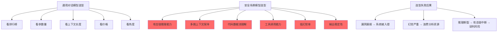

> **术语说明**：
> - **SAST**：Static Application Security Testing，静态应用安全测试
> - **PoC**：Proof of Concept，概念验证
> - **RCE**：Remote Code Execution，远程代码执行

<a id="1"></a>

---

# 二、AI模型选型时必须关注的核心参数

**核心观点：安全场景的模型选型需要关注7个核心维度，每个维度都有其独特的评估方法。**

## 2.1 参数量（Parameters）

| 模型规模 | 典型场景 | 安全场景适用性 |
|---------|---------|--------------|
| 7B | 轻量级任务、边缘部署 | ⚠️ 需谨慎，幻觉率高 |
| 14B | 通用对话、代码生成 | ⚠️ 基本能力可，但复杂推理可能断裂 |
| 32B | 复杂推理、多文件分析 | ✅ 较好平衡 |
| 70B+ | 企业级安全分析 | ✅ 推荐 |
| MoE | 高效率推理 | ⚠️ 需专项测试 |

**关键认知**：参数量 ≠ 推理能力。很多小模型会出现**自信胡说**、**推理断裂**、**上下文遗忘**等问题。尤其在安全领域，一个错误推理可能直接导致：

$$
\text{风险评估} = \sum_{i=1}^{n} P(\text{漏洞}_i) \times Impact(\text{漏洞}_i) \times (1 - Recall_{\text{模型}})
$$

其中 $Recall_{\text{模型}}$ 是模型检测漏洞的能力，值越低，漏报风险越高。对于高危漏洞，漏报的代价是灾难性的。

> **定义**[^1]
>
> **推理断裂（Reasoning Breakage）**：模型在多步推理过程中丢失中间状态，导致最终结论与正确逻辑路径不符的现象。

[^1]: 这一定义参考了多项关于大模型推理能力的学术研究，包括Anthropic、Google DeepMind的相关论文。

## 2.2 上下文窗口（Context Window）

| 上下文长度 | 适用场景 | 安全场景注意事项 |
|-----------|---------|----------------|
| 32K | 单文件分析 | ✅ 足够 |
| 128K | 小型代码仓库 | ⚠️ 可能出现注意力衰减 |
| 1M+ | 大型代码仓库 | ⚠️ Lost in the Middle风险极高 |

很多人认为上下文越大越强，实际上**不是**。长上下文会出现严重问题：

1. **注意力衰减**：模型对上下文中后部内容的关注度下降
2. **Lost in the Middle**：关键信息被淹没在大量上下文中
3. **调用链丢失**：模型可能忘记前面的危险函数调用

尤其代码仓库分析时，模型可能：

- 忘记前面的危险函数调用
- 丢失权限传播关系
- 忽略数据流中的净化处理

因此真正重要的是**"长上下文下的稳定推理能力"**，而不是单纯context数字。

## 2.3 推理能力（Reasoning）

这是安全场景**最核心**的能力。例如：

```
SQL注入传播链：用户输入 → 字符串拼接 → SQL查询 → 数据库返回 → 攻击者获得权限
SSRF→内网横移：外部输入 → URL解析 → 服务端请求 → 内网探针 → 横向移动
权限绕过链：会话验证 → 条件判断 → 状态修改 → 权限提升
RCE利用链：漏洞入口 → 代码执行 → 权限提升 → 持久化 → 横向移动
```

本质上都需要**多阶段推理**。优秀模型需要具备：

- **Chain-of-Thought**：显式推理路径
- **多跳推理**：跨步骤逻辑关联
- **跨文件逻辑关联**：理解模块间调用关系

否则模型只能"看代码"，无法"理解攻击"。

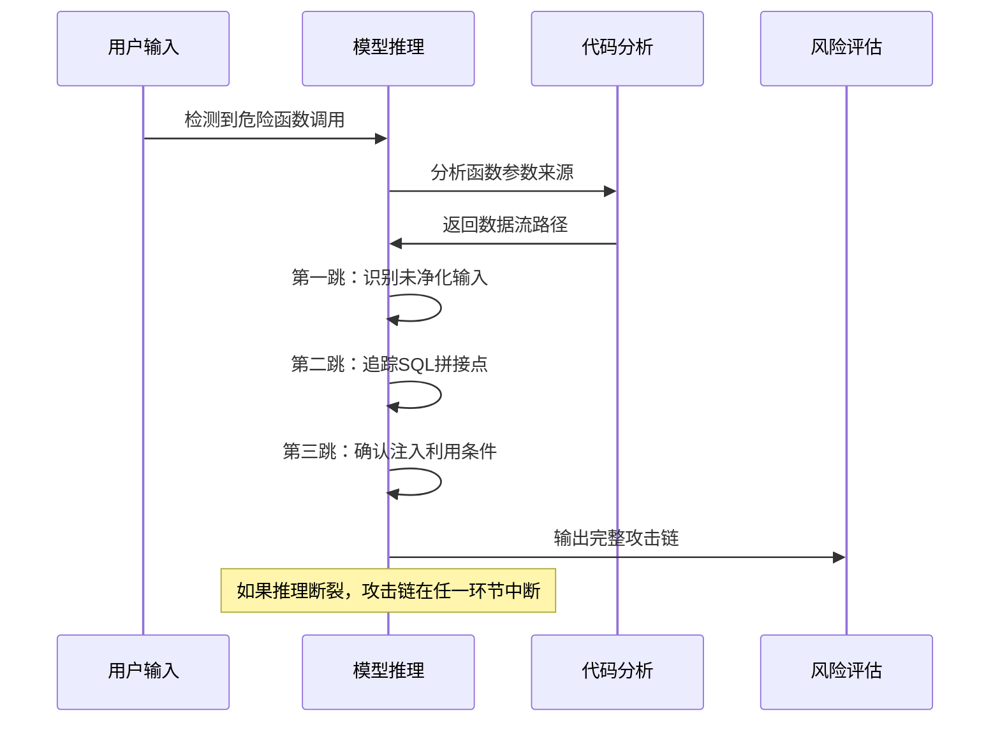

## 2.4 代码理解能力

**不要只看"能不能生成代码"**，真正重要的是：

| 能力维度 | 通用代码模型 | 安全分析模型 |
|---------|-------------|-------------|
| 代码生成 | ✅ 优秀 | ⚠️ 非核心 |
| 代码逻辑理解 | ✅ 良好 | ✅ 必须 |
| 危险数据流追踪 | ❌ 不擅长 | ✅ 必须 |
| 漏洞形成原因分析 | ❌ 不擅长 | ✅ 必须 |
| 权限传播分析 | ❌ 不擅长 | ✅ 必须 |

很多模型能写CRUD但不会分析漏洞，这是**完全不同的能力**。安全分析需要模型理解：

```python
# 漏洞形成的原因分析示例
def analyze_deserialization_vulnerability(code):
    """
    模型需要理解的不只是"用了pickle"
    而是为什么pickle.load()会导致RCE
    """
    dangerous_patterns = {
        "pickle.loads()": {
            "severity": "critical",
            "reason": "反序列化可以执行任意__reduce__方法",
            "exploit_chain": "untrusted_input -> pickle.loads() -> __reduce__() -> shell"
        },
        "yaml.load()": {
            "severity": "high",
            "reason": "默认unsafe load可以执行任意Python对象",
            "exploit_chain": "untrusted_yaml -> yaml.load() -> object construction -> code exec"
        }
    }
    return dangerous_patterns
```

## 2.5 Tool Calling 能力

未来安全AI一定是**Agent化**的。因此模型必须支持：

| 工具类型 | 安全场景用途 |
|---------|------------|
| shell | 执行命令、验证漏洞 |
| grep/ripgrep | 代码搜索、模式匹配 |
| sqlite | 查询漏洞数据库 |
| AST parser | 代码结构分析 |
| 静态分析工具 | 调用图、数据流分析 |

```python
# 安全Agent工具调用示例
class SecurityAgent:
    def __init__(self, model):
        self.tools = {
            "shell": ShellTool(),
            "grep": GrepTool(),
            "ast": ASTParser(),
            "semgrep": SemgrepTool()
        }
        self.model = model

    async def analyze_vulnerability(self, target, vuln_type):
        # 模型需要理解何时调用何种工具
        plan = await self.model.plan(
            f"分析{target}中的{vuln_type}漏洞",
            available_tools=list(self.tools.keys())
        )

        for step in plan.steps:
            result = await self.tools[step.tool].execute(step.args)
            await self.model.process_result(result)
```

## 2.6 幻觉率（Hallucination）

这是安全领域**最危险**的问题之一。模型可能会：

- **虚构漏洞**：在不存在漏洞的地方报告漏洞
- **虚构调用链**：生成不存在的函数调用关系
- **虚构exploit**：生成无法实际利用的"PoC"
- **虚构函数行为**：错误理解函数功能

对于安全系统来说，幻觉不是"小问题"而是**灾难**：

$$
\text{审计成本} = \text{真实漏洞数} \times \text{调查成本} + \text{幻觉漏洞数} \times \text{浪费成本}
$$

其中幻觉漏洞会严重消耗安全团队的调查资源，降低对真实威胁的响应能力。

**评估方法**：

| 测试类型 | 目的 |
|---------|-----|
| 无漏洞代码检测 | 测量虚报率 |
| 已知漏洞检测 | 测量漏报率 |
| 函数行为验证 | 检查是否理解真实行为 |

## 2.7 输出稳定性

很多模型存在**不稳定问题**：

```
第一次分析：存在SQL注入漏洞 ⚠️
第二次分析：未发现安全风险 ✅
第三次分析：存在潜在风险，需进一步确认 ⚠️
```

这种不稳定性会直接**毁掉安全审计系统**。必须测试：

| 测试维度 | 评估方法 |
|---------|---------|
| Replay Consistency | 相同输入多次运行的输出一致性 |
| 多轮稳定性 | 连续多轮对话后是否偏离主题 |
| 温度敏感性 | 不同temperature下的输出变化幅度 |

> **缩写说明**：
> - **RCE**：Remote Code Execution
> - **SSRF**：Server-Side Request Forgery
> - **SQLi**：SQL Injection
> - **IDOR**：Insecure Direct Object Reference
> - **XXE**：XML External Entity

## 2.8 模型性能与压缩指标

**核心观点：模型的实际部署性能不仅取决于参数量，更取决于稠密度、激活模式、量化和剪枝等压缩技术的综合影响。**

### 2.8.1 TPS (Tokens Per Second) 吞吐量指标

TPS 是评估模型推理效率的核心指标，直接影响安全场景下的实时响应能力。安全分析通常需要在秒级时间内返回结果，这对 TPS 提出了严格要求。

| 指标类型 | 定义 | 安全场景意义 | 典型要求 |
|---------|------|-------------|---------|
| **首Token延迟 (Time to First Token)** | 从请求到输出首个Token的等待时间 | 实时告警的交互体验 | < 500ms |
| **吞吐速率 (Throughput)** | 单位时间内处理的Token数量 | 批量日志分析效率 | > 50 tokens/s |
| **端到端延迟 (End-to-End Latency)** | 完整请求到响应的时间 | 交互式代码审计体验 | < 30s for 4K output |

**安全场景的 TPS 约束**：

```python
# 安全分析场景的 TPS 需求示例
def security_analysis_requirements():
    """
    不同安全场景对 TPS 的差异化需求
    """
    scenarios = {
        "实时告警分类": {
            "input_tokens": 256,      # 告警描述通常较短
            "output_tokens": 128,     # 只需分类结论
            "latency_budget": "2s",   # 必须在2秒内响应
            "min_tps": 192,           # (256+128)/2 = 192
        },
        "代码审计": {
            "input_tokens": 8192,      # 代码片段可能很长
            "output_tokens": 1024,     # 详细分析报告
            "latency_budget": "60s",   # 可以等待更长时间
            "min_tps": 150,           # 允许较长生成时间
        },
        "威胁情报摘要": {
            "input_tokens": 4096,      # 情报报告长度
            "output_tokens": 512,      # 简洁摘要
            "latency_budget": "10s",
            "min_tps": 460,           # 需要快速返回
        }
    }
    return scenarios
```

**TPS 与模型选择的关系**：

$$
\text{Effective TPS} = \frac{\text{Output Tokens}}{\text{Total Time}} = \frac{\text{Output Tokens}}{\text{Prefill Time} + \text{Decode Time}}
$$

其中 prefill time 与输入长度成正比，decode time 与输出长度成正比。对于长输入场景（如代码仓库分析），prefill time 可能成为瓶颈。

### 2.8.2 模型稠密度 (Model Density)

模型稠密度是衡量**参数效率**的关键指标，定义为有效参数占总参数的比例：

$$
\text{Density} = \frac{\text{Effective Parameters}}{\text{Total Parameters}} \times 100\%
$$

稠密度直接反映模型参数的实际利用效率，不同架构的稠密度差异巨大：

| 模型架构 | 稠密度 | 激活方式 | 推理效率 | 代表模型 |
|---------|--------|---------|---------|---------|
| **Dense (密集模型)** | ~100% | 全参数激活 | 低 | Llama-3.1-70B, Qwen2.5-72B |
| **MoE (混合专家)** | 5-20% | 稀疏激活 | 高 | DeepSeek-V2, Mixtral-8x7B |
| **LoRA 微调** | <1% (额外) | 额外 adapter | 中 | Qwen-LoRA, Llama-LoRA |
| **IA^3** | <0.1% (额外) | 激活向量 | 高 | LLaMA-IA^3 |

**安全场景的稠密度选择**：

```python
# 稠密度与安全场景适配性分析
def density_analysis_for_security():
    """
    不同稠密度模型在安全场景的适用性
    """
    analysis = {
        "高稠密度 (>50%)": {
            "优点": ["推理逻辑完整", "上下文保持能力强", "幻觉率相对较低"],
            "缺点": ["显存占用高", "推理速度慢", "部署成本高"],
            "适用场景": ["高危漏洞分析", "APT威胁推理", "复杂攻击链重构"]
        },
        "中稠密度 (10-50%)": {
            "优点": ["性价比高", "推理速度适中", "显存需求可接受"],
            "缺点": ["部分场景能力下降", "需要针对性微调"],
            "适用场景": ["常规代码审计", "安全运营告警分类", "漏洞修复建议"]
        },
        "低稠密度 (<10%)": {
            "优点": ["部署成本低", "推理速度快", "适合边缘部署"],
            "缺点": ["复杂推理能力不足", "幻觉率可能较高", "安全场景需谨慎"],
            "适用场景": ["轻量级日志分析", "初步筛选", "边缘设备安全检测"]
        }
    }
    return analysis
```

### 2.8.3 参数激活 (Parameter Activation)

参数激活模式决定了每次推理时实际使用的参数比例，对推理效率和模型能力有直接影响。

| 激活模式 | 激活比例 | 推理效率 | 能力保持率 | 适用场景 |
|---------|---------|---------|-----------|---------|
| **全连接激活** | 100% | 低 | 100% | 高精度安全分析 |
| **MoE 稀疏激活** | 5-10% | 高 | 85-95% | 大规模推理任务 |
| **动态块稀疏** | 20-50% | 中 | 90-98% | 资源受限场景 |
| **注意力稀疏** | 30-60% | 中 | 92-96% | 长上下文分析 |

**MoE 架构的激活参数计算**：

对于一个典型的 MoE 模型（如 DeepSeek-V2），其激活参数计算方式为：

$$
\text{Activated Parameters} = \text{Shared Parameters} + \text{Expert Parameters} \times \text{Active Experts} / \text{Total Experts}
$$

```python
# MoE 模型激活参数计算示例
def calculate_moe_activated_params():
    """
    计算 MoE 模型的激活参数比例
    """
    moe_config = {
        "total_params": "236B",           # 总参数量
        "shared_params": "10B",           # 共享参数（始终激活）
        "expert_params": "226B",          # 专家参数
        "total_experts": 128,             # 专家总数
        "active_experts_per_token": 8,    # 每个token激活的专家数
    }

    activated_expert_ratio = moe_config["active_experts_per_token"] / moe_config["total_experts"]
    activated_expert_params = moe_config["expert_params"] * activated_expert_ratio

    # 总激活参数 = 共享参数 + 激活的专家参数
    total_activated = moe_config["shared_params"] + activated_expert_params

    print(f"激活专家参数比例: {activated_expert_ratio * 100:.2f}%")
    print(f"激活专家参数量: {activated_expert_params:.2f}B")
    print(f"总激活参数: {total_activated:.2f}B")
    print(f"实际激活比例: {total_activated / moe_config['total_params'] * 100:.2f}%")
```

**安全场景的激活模式选择**：

```mermaid
flowchart TD
    A[安全场景模型选型] --> B{实时性要求}
    B -->|高 (<1s)| C[MoE稀疏激活]
    B -->|中 (1-10s)| D[动态块稀疏]
    B -->|低 (>10s)| E[全连接激活]

    C --> C1[吞吐优先]
    D --> D1[平衡优先]
    E --> E1[精度优先]

    C1 --> F[DeepSeek-V2<br/>激活5-10%]
    D1 --> G[Llama-3.1-70B<br/>动态稀疏]
    E1 --> H[Qwen2.5-72B<br/>全参数]
```

### 2.8.4 量化压缩 (Quantization Compression)

量化是通过降低参数精度来减少显存占用和加速推理的技术。对于安全场景，量化需要在**性能损失可接受范围内**最大化资源效率。

| 量化级别 | 精度格式 | 压缩比 | 显存降低 | 性能损失 | 安全场景适用度 |
|---------|---------|--------|---------|---------|---------------|
| **FP16** | 16位浮点 | 1x (基准) | 0% | 0% | ✅ 基准参考 |
| **BF16** | 16位浮点 | 1x | 0% | <1% | ✅ 高精度安全分析 |
| **INT8** | 8位整数 | 2x | 50% | 2-5% | ✅ **推荐** |
| **INT4** | 4位整数 | 4x | 75% | 5-15% | ⚠️ 需验证 |
| **FP8** | 8位浮点 | 2x | 50% | 1-3% | ✅ **最佳平衡** |
| **NF4** | 4位归一化 | 4x | 75% | 3-8% | ⚠️ 部分场景可用 |

**量化对安全分析精度的影响**：

```python
# 量化精度与安全分析效果的对应关系
def quantization_impact_on_security():
    """
    不同量化级别对安全分析任务的影响
    """
    impact_data = {
        "FP16/BF16": {
            "漏洞检测准确率": "基准 95%",
            "误报率": "基准 3%",
            "幻觉率": "基准 5%",
            "适用任务": "全部安全分析任务"
        },
        "INT8": {
            "漏洞检测准确率": "~94% (↓1%)",
            "误报率": "~3.5% (↑0.5%)",
            "幻觉率": "~5.5% (↑0.5%)",
            "适用任务": "代码审计、漏洞分析、威胁推理"
        },
        "INT4": {
            "漏洞检测准确率": "~88-92% (↓3-7%)",
            "误报率": "~5-8% (↑2-5%)",
            "幻觉率": "~8-12% (↑3-7%)",
            "适用任务": "轻量级告警分类、初步筛选"
        }
    }
    return impact_data
```

**安全场景量化策略**：

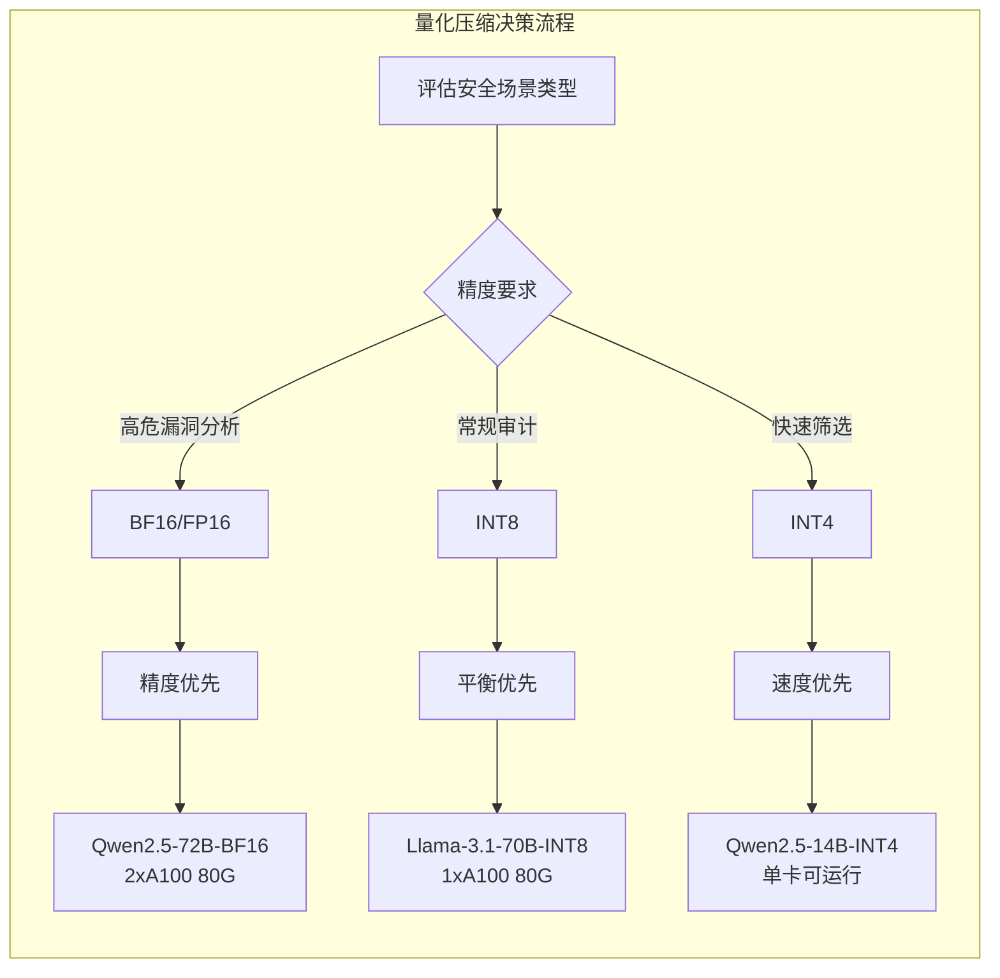

**量化压缩比公式**：

$$
\text{Compression Ratio} = \frac{\text{Original Size}}{\text{Quantized Size}} = \frac{\text{Original Bits}}{\text{Quantized Bits}}
$$

对于从 FP16 到 INT8 的量化：
$$
\text{Compression Ratio} = \frac{16}{8} = 2x
$$

从 FP16 到 INT4 的量化：
$$
\text{Compression Ratio} = \frac{16}{4} = 4x
$$

### 2.8.5 剪枝程度 (Pruning Level)

剪枝通过移除不重要的参数或结构来降低模型复杂度，同时尽量保持模型能力。

| 剪枝类型 | 剪枝比例 | 推理加速 | 实现复杂度 | 能力保持率 | 安全场景适用度 |
|---------|---------|---------|-----------|-----------|---------------|
| **非结构化剪枝** | 30-70% | 1.5-3x | 低 | 70-90% | ⚠️ 需验证 |
| **结构化剪枝** | 20-50% | 1.3-2x | 中 | 80-95% | ✅ 可用 |
| **神经元剪枝** | 20-40% | 1.2-1.8x | 中 | 85-95% | ✅ 可用 |
| **梯度剪枝** | 10-40% | 1.2-1.8x | 高 | 90-98% | ✅ 推荐 |
| **注意力头剪枝** | 10-30% | 1.1-1.5x | 中 | 92-97% | ✅ 长上下文 |

**剪枝对安全分析能力的影响**：

| 剪枝程度 | 典型场景能力表现 | 安全分析影响 |
|---------|----------------|-------------|
| **轻度剪枝 (<30%)** | 基础代码理解保持 | ✅ 可接受 |
| **中度剪枝 (30-50%)** | 复杂推理能力下降 5-10% | ⚠️ 需验证 |
| **重度剪枝 (>50%)** | 攻击链推理能力显著下降 | ❌ 不推荐 |

**剪枝策略选择框架**：

```python
# 安全场景剪枝策略选择
def pruning_strategy_for_security():
    """
    根据安全场景选择合适的剪枝策略
    """
    strategies = {
        "高安全要求场景": {
            "剪枝程度": "轻度 (<30%)",
            "推荐类型": "梯度剪枝 + 注意力头剪枝",
            "理由": "保持模型完整性，确保关键安全推理能力"
        },
        "中等安全要求": {
            "剪枝程度": "中度 (30-50%)",
            "推荐类型": "结构化剪枝",
            "理由": "平衡性能与精度，适合常规审计任务"
        },
        "快速筛选场景": {
            "剪枝程度": "重度 (>50%)",
            "推荐类型": "非结构化剪枝 + INT4量化",
            "理由": "最大化推理速度，适合初步筛选"
        }
    }
    return strategies
```

**综合性能优化公式**：

模型的实际推理性能可以通过以下公式综合评估：

$$
\text{Effective Performance} = \frac{\text{Base Performance} \times \text{Density} \times \text{Quantization Factor}}{\text{Latency Overhead}}
$$

其中：
- $\text{Density}$：模型稠密度（MoE模型通常 5-20%）
- $\text{Quantization Factor}$：量化因子（INT8 ≈ 0.95，INT4 ≈ 0.85）
- $\text{Latency Overhead}$：包括 prefill/decode 延迟、内存带宽限制等

<a id="2"></a>

---

# 三、为什么传统 Benchmark 已经不够用了

**核心观点：脱离真实安全场景的单文件测试，本质上是在用"解方程"的难度来评估"系统工程"的能力。**

## 3.1 现有 Benchmark 的结构性缺陷

当前主流 AI 安全评测体系建立在若干假设之上：代码片段足够代表漏洞特征，单函数修复能够反映真实场景，静态分析结果可以替代动态威胁评估。这些假设在学术研究语境下具有合理性，但与实战安全能力之间存在根本性鸿沟。

| Benchmark 类型 | 典型代表 | 评估粒度 | 与实战的差距 |
|:---|:---|:---|:---|
| 单函数漏洞检测 | SARD、Juliet | 函数级 | 无法评估调用链上下文 |
| 代码修复任务 | HumanEval、MBPP | 函数级 | 忽略安全约束与权限模型 |
| 静态分析基准 | Draper、Copium | 文件级 | 缺失交互式验证能力 |
| CTF 挑战集 | PicoCTF、Cryptohack | 题目级 | 孤立场景，无真实资产 |

## 3.2 真实安全问题的多维复杂性

真实安全漏洞从来不是孤立存在的。考虑一个典型的**越权访问漏洞**：

```python
# 简化示例：某企业级权限系统片段
class DocumentService:
    def __init__(self, db, audit_logger):
        self.db = db
        self.audit = audit_logger

    def get_document(self, user_id: int, doc_id: int) -> dict:
        # 基础查询
        doc = self.db.query("SELECT * FROM documents WHERE id = ?", doc_id)
        if not doc:
            raise DocumentNotFoundError()

        # 问题1：未验证用户是否对文档有访问权限
        # 问题2：审计日志记录不完整，缺少操作上下文
        self.audit.log(user_id, "read", doc_id)
        return doc

    def share_document(self, owner_id: int, doc_id: int, target_user_id: int):
        # 问题3：未验证调用者是否为文档所有者
        self.db.execute(
            "INSERT INTO permissions VALUES (?, ?)",
            (doc_id, target_user_id)
        )
```

这段代码包含至少三类安全问题：**访问控制缺失**、**审计不完整**、**权限验证疏漏**。任何一个合格的安全 AI 都应该能够：

1. 识别出 `get_document` 中的权限验证缺失
2. 理解 `share_document` 的所有者验证缺陷可能导致的越权分享
3. 意识到审计日志缺少关键上下文（如 IP、请求时间戳）
4. 评估这些问题在真实系统中的 exploitability

**传统的单函数 benchmark 无法测试上述能力**，因为它们不提供：
- 跨文件的调用上下文
- 数据库状态与权限模型
- 业务逻辑约束
- 审计与监控系统的交互

## 3.3 从"解问题"到"理解系统"的范式转变

安全能力的核心不是"发现某个漏洞模式"，而是"理解系统在威胁模型下的整体安全性"。这要求评测体系必须能够评估：

- **调用链追踪**：漏洞是否可被利用，依赖数据流分析
- **权限传播建模**：用户 A 的操作如何影响用户 B 的可见资源
- **状态机理解**：系统在错误状态下的降级行为是否安全

用数学语言描述，安全 AI 需要评估的不是单一条件概率 $P(V|C)$（给定代码是否包含漏洞），而是**在完整系统上下文**下的威胁可达性：

$$
\text{Exploitability} = \sum_{p \in \text{AttackPath}} \prod_{i=1}^{|p|} P(\text{Step}_i | \text{Context}_i)
$$

其中每个攻击步骤的成功概率都依赖于前序状态和系统上下文。Toy benchmark 无法建模这种路径依赖关系。

## 3.4 信息增益的失效

当 benchmark 数据集中漏洞分布与真实场景存在系统性偏差时，模型在 benchmark 上的表现与实际安全能力之间的**信息增益趋于零**。这意味着：

1. 在 SARD 上达到 95% 召回率的模型，可能在真实企业代码库上只有 30% 的有效检出率
2. 能够修复 Juliet 测试集中 CWE-119（缓冲区溢出）的模型，可能无法识别一个简单的 SQL 注入
3. CTF 比赛能力与红队实战能力几乎没有相关性

这并非模型能力问题，而是**评估范式的根本性局限**。

<a id="3"></a>

---

# 四、信息安全方向必须关注的 AI 能力评估体系

**核心观点：安全 AI 评估必须覆盖 Repo 级理解、漏洞分析、安全修复和 Agent 执行四个维度，才能真实反映模型的实战能力。**

## 4.1 Repo 级代码理解能力

### 4.1.1 评估维度

Repo 级代码理解是安全分析的基础能力。与单文件分析不同，真实项目具有以下特征：

| 特征 | 单文件分析 | Repo 级分析 |
|:---|:---|:---|
| 调用关系 | 内联展开 | 跨文件追踪 |
| 依赖建模 | 假设已知 | 需显式解析 |
| 权限边界 | 忽略 | 必须建模 |
| 配置上下文 | 静态文本 | 运行时加载 |

### 4.1.2 调用链追踪评估

```python
# 评估用例：追踪敏感数据泄露路径
# File: backend/services/user_service.py
class UserService:
    def get_user_profile(self, user_id: int) -> dict:
        # 调用 A -> B -> C 的数据流
        profile = self.db.get_user(user_id)
        return self._mask_pii(profile)  # [Step A]

# File: backend/utils/pii_handler.py
class PIIHandler:
    def _mask_pii(self, profile: dict) -> dict:
        # [Step B] - 此处可能存在泄露点
        return {k: self._redact(v) if self._is_sensitive(k) else v
                for k, v in profile.items()}

    def _redact(self, value: str) -> str:
        # [Step C] - 关键安全逻辑
        if not self._is_valid_utf8(value):
            raise DataCorruptionError()  # 异常处理是否安全？
        return value[:4] + "****"

# File: backend/api/routes.py
@router.get("/users/{user_id}")
def get_user(user_id: int):
    # API 入口点
    return user_service.get_user_profile(user_id)  # 调用链起点
```

评估体系应该能够：
1. 正确追踪从 API 路由到 PII 处理的数据流
2. 识别 `_redact` 方法中 UTF-8 验证失败时的异常处理逻辑
3. 判断异常信息是否可能导致信息泄露（如将原始值写入日志）

### 4.1.3 权限传播建模

真实系统中的权限控制往往是多层级的：

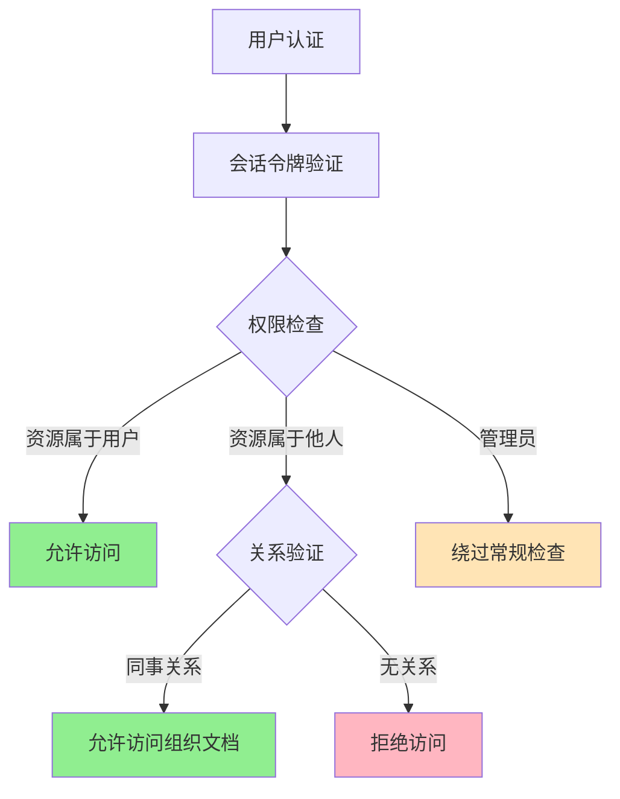

安全 AI 必须能够理解这种复杂的权限传播逻辑，并识别其中的缺陷。

<a id="4-1"></a>

## 4.2 漏洞分析能力

### 4.2.1 CWE 理解与映射

**通用缺陷枚举（Common Weakness Enumeration, CWE）** 是漏洞分类的标准体系。安全 AI 必须能够：

1. 将代码特征映射到正确的 CWE 编号
2. 理解 CWE 之间的关联关系（如 CWE-20 与 CWE-74 的关系）
3. 评估同一 CWE 在不同上下文中的风险等级

### 4.2.2 数据流分析

数据流分析是漏洞识别的核心能力。考虑以下代码：

```python
def process_user_input(user_input: str, db: Database) -> dict:
    """处理用户输入并查询数据库"""
    # [Source] 用户输入
    sanitized = sanitize(user_input)  # 净化处理
    query = f"SELECT * FROM users WHERE name = '{sanitized}'"  # [Sink] SQL 查询

    # 问题：sanitize 函数是否真正消除了 SQL 注入风险？
    return db.execute(query)
```

安全 AI 需要能够分析：
- `sanitize` 函数的净化逻辑是否完整
- SQL 查询构造方式是否存在注入风险
- 即使使用了参数化查询的替代方案，`sanitize` 的必要性是什么

### 4.2.3 Exploitability 判断

并非所有漏洞都具有实际 exploitability。评估体系应该包含**可达性分析**：

$$
\text{RiskScore} = \text{CVSS}_{\text{base}} \times \text{Reachable}_{\text{path}} \times \text{Exposed}_{\text{asset}}
$$

| 漏洞类型 | CVSS 基础分 | 可达性 | 暴露面 | 最终风险 |
|:---|:---:|:---:|:---:|:---:|
| 内网数据库 SQL 注入 | 9.1 | 0.3 | 0.2 | 0.54 |
| 公网 API 越权访问 | 7.5 | 0.9 | 1.0 | 6.75 |
| 日志文件信息泄露 | 4.0 | 1.0 | 0.5 | 2.0 |

<a id="4-2"></a>

## 4.3 安全修复能力

### 4.3.1 功能正确 ≠ 安全正确

这是安全 AI 评估中最容易被忽视的维度。**大量模型能够修复 bug 使功能正常，却同时引入新的安全漏洞或破坏现有安全控制。**

```python
# 原始代码（有功能缺陷但相对安全）
def calculate_discount(user_tier: str, base_price: float) -> float:
    if user_tier == "premium":
        return base_price * 0.8  # 8折
    elif user_tier == "vip":
        return base_price * 0.7  # 7折
    return base_price

# AI 修复后的代码（功能正确但存在严重安全漏洞）
def calculate_discount(user_tier: str, base_price: float) -> float:
    # 引入缓存以提升性能
    cache = {}
    if user_tier in cache:
        return cache[user_tier]

    # [漏洞] 缺少价格验证，可能导致负数价格通过计算
    discount = {
        "premium": 0.8,
        "vip": 0.7,
        "employee": 0.5  # [漏洞] 新增员工折扣未在原始设计中出现
    }.get(user_tier, 1.0)

    result = base_price * discount
    cache[user_tier] = result  # [漏洞] 缓存未设置过期时间，可能导致状态泄露
    return result
```

**修复后引入的问题**：

| 问题类型 | 描述 | CWE 编号 |
|:---|:---|:---|
| 整数/浮点数溢出 | 未验证 base_price 正负 | CWE-190 |
| 缓存中毒 | 缺少 TTL 和验证机制 | CWE-444 |
| 权限提升 | employee 折扣绕过原访问控制 | CWE-269 |
| 状态泄露 | 缓存暴露历史计算结果 | CWE-200 |

### 4.3.2 权限控制完整性验证

安全修复必须保持权限控制不变或加强。评估框架应该检测：

1. **访问控制矩阵完整性**：修复是否破坏了原有的 RBAC/ABAC 约束
2. **最小权限原则**：新增功能是否遵循最小权限
3. **纵深防御保留**：原有安全层是否在修复后依然有效

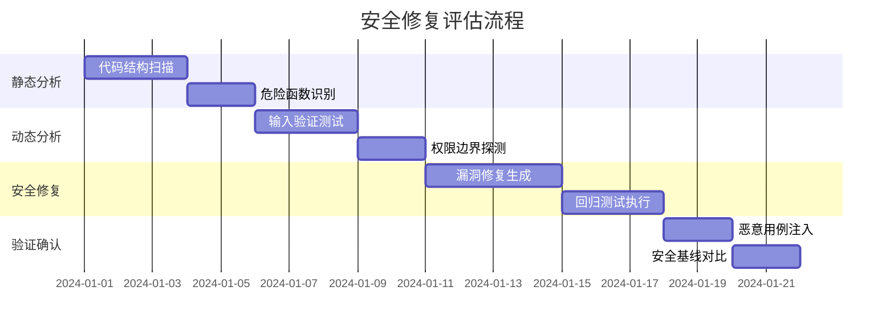

<a id="4-3"></a>

## 4.4 Agent 执行能力

### 4.4.1 工具调用与多阶段行动

真实安全分析需要 AI Agent 能够：

1. **环境交互**：读取文件系统、执行命令、访问 API
2. **工具组合**：根据分析结果动态选择下一步操作
3. **状态维护**：在多阶段分析中保持上下文一致
4. **错误恢复**：在遇到异常时能够调整策略

### 4.4.2 安全分析 Agent 架构

```
┌─────────────────────────────────────────────────────────────┐
|                    Security Agent Pipeline                  │
├─────────────────────────────────────────────────────────────┤
|  ┌──────────┐    ┌──────────┐    ┌──────────┐    ┌───────┐ │
|  │  Planner │───▶│ Scanner  │───▶│Analyzer  │───▶│Remedia │ │
|  └──────────┘    └──────────┘    └──────────┘    │  tor  │ │
|       │              │               │          └───────┘ │
|       ▼              ▼               ▼               │      │
|  ┌─────────────────────────────────────────────────────┐   │
|  │              Memory & Context Store                 │   │
|  └─────────────────────────────────────────────────────┘   │
└─────────────────────────────────────────────────────────────┘
```

### 4.4.3 评估指标

| 能力维度 | 评估指标 | 测量方式 |
|:---|:---|:---|
| 工具调用准确性 | 正确工具选择率 | 指令跟随测试 |
| 多阶段完成率 | 任务完成率 | 端到端场景测试 |
| 上下文保持 | 跨阶段信息保留率 | 记忆检索测试 |
| 安全决策质量 | 误报率/漏报率 | 对抗样本评估 |
| 自主纠错能力 | 错误恢复成功率 | 注入故障场景 |

### 4.4.4 红队演练评估

最终的安全 Agent 能力需要通过**红队演练（Red Team Exercise）** 进行验证：

- 模拟真实攻击链：侦察 -> 武器化 -> 投递 -> 利用 -> 持久化
- 评估 Agent 对完整攻击链的检测和阻断能力
- 测试 Agent 在面对高级持续性威胁（APT）时的表现

<a id="4-4"></a>

## 4.5 评测工具链

**核心观点：科学的评测需要依托专业的工具链，选择合适的评测框架和数据集是构建可靠评估体系的基础。**

### 4.5.1 通用评测框架

| 框架 | 开发者 | 适用场景 | 核心特点 |
|------|--------|---------|---------|
| **HuggingFace Evaluate** | HuggingFace | 通用模型评测 | 丰富的评测指标库（50+指标），支持自定义指标，集成简单 |
| **lm-evaluation-harness** | EleutherAI | 大语言模型评测 | 标准化评测协议，支持300+任务，MMLU/HellaSwag等基准测试 |
| **OpenCompass** | 上海AI Lab | 全面能力评测 | 多维度评测框架，提供评测排行榜，支持自定义数据集 |
| **LLM-blender** | BY折纸 | 模型对比分析 | 多模型横向对比，可视化报告生成，自动评分排序 |

**HuggingFace Evaluate 核心用法**：

```python
# 使用 HuggingFace Evaluate 进行模型评测
from evaluate import load

# 加载常用评测指标
accuracy_metric = load("accuracy")
f1_metric = load("f1")
security_metric = load("security_score")

# 执行评测
results = accuracy_metric.compute(predictions=preds, references=refs)
print(f"准确率: {results['accuracy']:.2%}")
```

**lm-evaluation-harness 核心用法**：

```bash
# 使用 lm-evaluation-harness 进行标准化评测
lm_eval \
    --model hf-causal \
    --model_args "pretrained=models/llama-3.1-70b" \
    --tasks mmlu,hellaswag,arc_challenge \
    --batch_size 4
```

### 4.5.2 安全专项评测工具

| 工具 | 评测范围 | 适用场景 | 开源状态 |
|------|---------|---------|---------|
| **SecCodeBench** | 代码安全漏洞检测 | SAST自动化、漏洞定位 | ✅ 开源 |
| **GuardBench** | 安全内容过滤 | Prompt注入检测、Jailbreak防御测试 | ✅ 开源 |
| **SafetyBench** | 安全问答、对抗样本 | 安全知识问答、威胁评估 | ✅ 开源 |
| **SecureBench** | 漏洞修复安全正确性 | 修复后安全性回归验证 | ⚠️ 部分开源 |
| **RedTeamBench** | 红队攻防能力 | 对抗性测试、渗透模拟 | ✅ 开源 |

**安全专项评测工具集成示例**：

```python
# 使用 SecCodeBench 进行代码安全评测
from seccodebench import SecurityEvaluator

evaluator = SecurityEvaluator(
    model=security_model,
    dataset="seccodebench_v1",
    tasks=["sql_injection", "xss", "rce", "ssrf"]
)

# 执行安全专项评测
results = evaluator.evaluate(
    metrics=["precision", "recall", "f1", "security_score"]
)

print(f"安全评分: {results['security_score']:.2f}")
print(f"漏洞检测召回率: {results['recall']:.2%}")
```

### 4.5.3 主流 Benchmark 数据集

| Benchmark | 评测维度 | 代表任务 | 数据规模 | 来源 |
|-----------|---------|---------|---------|------|
| **SWE-Bench** | 真实软件工程任务 | 代码修复、Issue解决 | 2,294 任务 | Princeton |
| **BigCodeBench** | 代码生成质量 | 安全代码生成 | 1,005 任务 | BigCode项目 |
| **HumanEval** | 代码生成正确性 | Python代码补全 | 164 任务 | OpenAI |
| **SecBench** | 安全专项能力 | 漏洞检测、修复评估 | 5,000+ 样本 | 多源汇总 |
| **Juliet** | CWE覆盖测试 | 漏洞模式覆盖 | 77,000+ 用例 | NIST |
| **SARD** | 工业漏洞样本 | 安全测试覆盖 | 50,000+ 样本 | NIST |

**Benchmark 选型指南**：

```python
# Benchmark 选择决策逻辑
def select_benchmark(evaluation_goal):
    """
    根据评测目标选择合适的 Benchmark
    """
    benchmark_map = {
        "代码修复能力": ["SWE-Bench", "HumanEval"],
        "安全漏洞检测": ["SecBench", "Juliet", "SARD"],
        "代码生成质量": ["BigCodeBench", "HumanEval"],
        "综合安全能力": ["SecBench", "GuardBench", "SafetyBench"],
        "Agent工具调用": ["GAIA", "API-Bank"]
    }
    return benchmark_map.get(evaluation_goal, [])
```

### 4.5.4 评测工具选型决策矩阵

| 评测目标 | 推荐工具组合 | 实施难度 | 预期产出 |
|---------|-------------|---------|---------|
| 基础能力验证 | lm-evaluation-harness + MMLU | ⭐ 低 | 模型基础能力基准报告 |
| 代码安全专项 | SecCodeBench + BigCodeBench | ⭐⭐ 中 | 安全能力雷达图 |
| 安全内容过滤 | GuardBench + SafetyBench | ⭐⭐ 中 | 过滤能力评估报告 |
| 综合能力评估 | OpenCompass + 自建安全集 | ⭐⭐⭐ 高 | 360度能力评估报告 |
| 企业内部基准 | HF Evaluate + 自建数据集 | ⭐⭐⭐ 高 | 企业专属评测标准 |
| Agent能力测试 | lm-evaluation-harness + Agent任务集 | ⭐⭐⭐ 高 | Agent能力剖析报告 |

**评测工具链选型流程**：

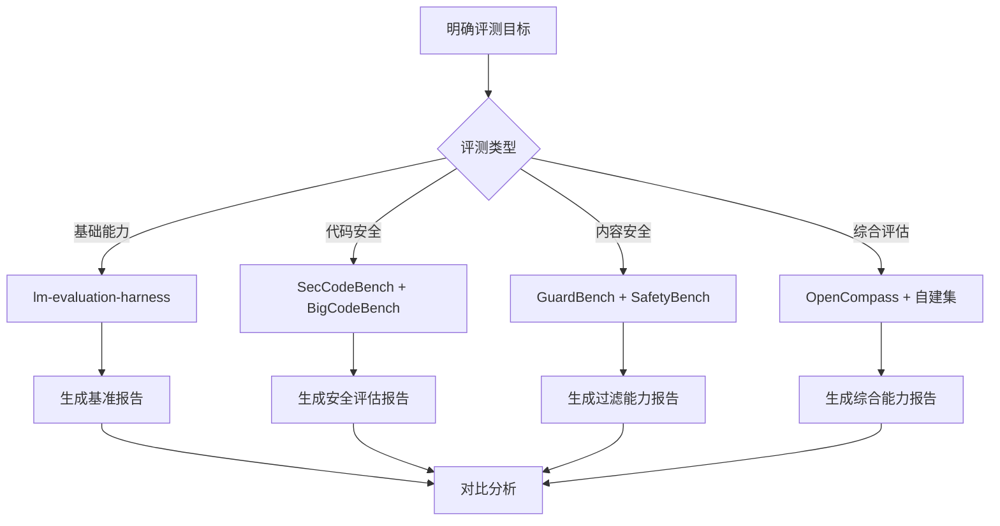

### 4.5.5 评测流程与最佳实践

**评测实施流程**：

| 阶段 | 主要任务 | 输出物 | 周期建议 |
|------|---------|--------|---------|
| **准备阶段** | 数据集构建、工具部署 | 评测环境就绪 | 1-2周 |
| **基准测试** | 基础能力摸底 | 基准报告 | 1周 |
| **深度评测** | 安全专项、能力边界 | 深度报告 | 2-3周 |
| **对比分析** | 多模型横向对比 | 对比报告 | 1周 |
| **持续监控** | 上线后持续追踪 | 监控仪表盘 | 持续 |

**评测质量保障**：

```python
# 评测质量检查清单
def evaluation_quality_check():
    """
    评测质量保障检查项
    """
    checklist = {
        "数据质量": [
            "数据集无数据泄露",
            "测试集与训练集分离",
            "样本分布合理"
        ],
        "评测设计": [
            "评测指标与业务目标一致",
            "不存在评测偏见",
            "多维度综合评估"
        ],
        "结果验证": [
            "多次运行结果一致性",
            "人工抽检验证",
            "异常值分析"
        ]
    }
    return checklist
```

**常见评测陷阱与规避**：

| 陷阱类型 | 表现 | 规避方法 |
|---------|------|---------|
| 数据污染 | 评测集与训练数据重叠 | 使用独立验证集 |
| 过拟合榜单 | 针对特定Benchmark优化 | 多Benchmark交叉验证 |
| 单一指标 | 仅看某一项分数 | 多维度综合评估 |
| 人工标注偏差 | 标注质量不一致 | 多人标注、一致性检验 |

<a id="4-5"></a>

---

## 本章小结

信息安全领域的 AI 能力评估不能沿用通用代码任务的评测范式。真正的安全 AI 必须具备：

1. **Repo 级理解能力**：能够追踪跨文件的调用链和权限传播
2. **漏洞分析能力**：正确映射 CWE 并评估 exploitability
3. **安全修复能力**：确保修复不引入新漏洞，保持权限控制完整
4. **Agent 执行能力**：在多阶段任务中正确调用工具并维护状态

**下一步**，我们将讨论如何基于上述四个维度构建一套完整的评估基准，以及如何根据业务场景选择合适的安全 AI 模型。

<a id="4"></a>

---

# 五、当前最值得关注的信息安全方向开源模型

开源模型+私有化部署正在成为信息安全领域的主流选择，其核心价值在于实现数据主权可控、能力可定制、审计可落地。

## 5.1 Alibaba Group 的 Qwen 系列

**Qwen系列是目前中文安全场景最具实用价值的开源模型选择。**

### 5.1.1 核心优势分析

| 维度 | Qwen2.5-72B | Qwen2.5-7B | Qwen2.5-1.5B |
|------|-------------|------------|--------------|
| 中文能力 | SOTA | 优秀 | 可用 |
| 代码能力 | Claude3.5同级 | GPT-3.5同级 | 基础 |
| 长上下文 | 128K | 32K | 8K |
| 安全场景适用度 | ★★★★★ | ★★★★ | ★★ |

### 5.1.2 技术架构特征

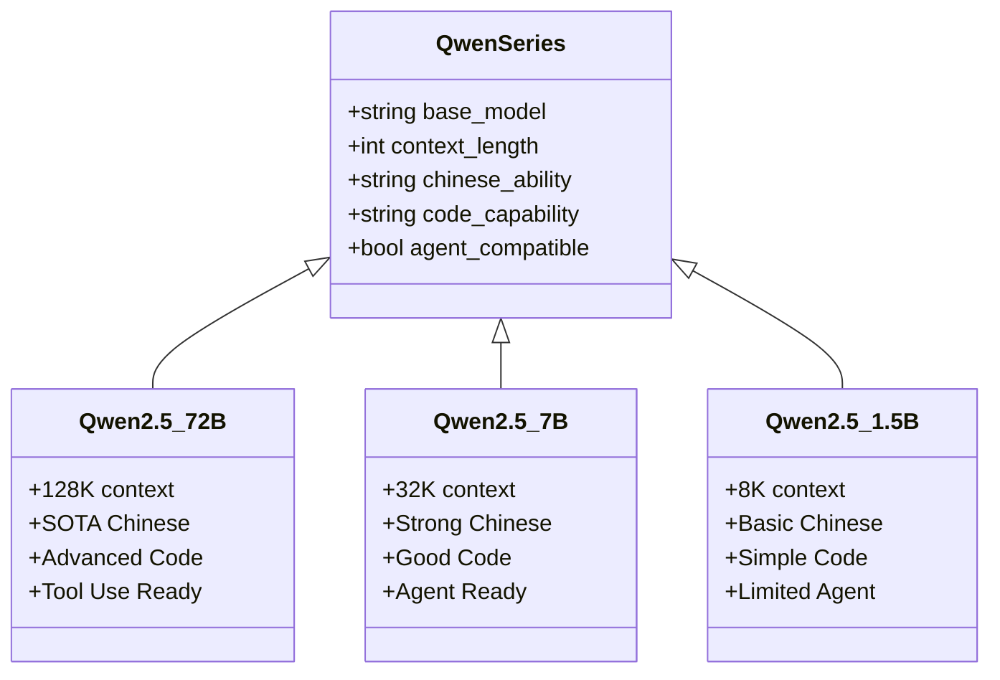

### 5.1.3 安全场景调用示例

```python
# Qwen2.5-72B-Instruct 安全日志分析调用示例
from openai import OpenAI

client = OpenAI(
    api_key="your-qwen-api-key",
    base_url="https://your-private-deployment/v1"
)

def analyze_security_log(log_content: str) -> dict:
    """
    分析安全日志，识别潜在威胁模式
    """
    response = client.chat.completions.create(
        model="qwen2.5-72b-instruct",
        messages=[
            {
                "role": "system",
                "content": """你是一位资深安全分析师，擅长从日志中识别：
                1. 异常访问模式
                2. 潜在攻击向量
                3. 漏洞利用痕迹
                请以JSON格式输出分析结果。"""
            },
            {
                "role": "user",
                "content": f"分析以下安全日志：\n{log_content}"
            }
        ],
        temperature=0.1,  # 低温度保证确定性
        max_tokens=2048
    )
    return response.choices[0].message.content

# 调用示例
log_sample = """
2024-03-15 02:34:12 SQL注入告警 - IP: 192.168.1.100
Payload: ' OR '1'='1' --
Target: /api/login endpoint
"""
result = analyze_security_log(log_sample)
```

### 5.1.4 适用场景

- **代码审计**：自动化代码安全审查，支持OWASP Top 10检测
- **安全运营**：SIEM告警分类与优先级判定
- **威胁情报**：中文威胁情报实体抽取与关联分析
- **漏洞修复建议**：基于上下文的修复方案生成

> **脚注[^2]**：Qwen2.5系列支持Tool Use与Function Calling，可无缝集成到安全Agent架构中。

[^2]: Qwen官方文档: https://qwenlm.github.io/

---

## 5.2 DeepSeek 系列

**DeepSeek系列以推理能力强和安全逻辑表现为核心优势，特别适合复杂安全分析场景。**

### 5.2.1 核心技术优势

DeepSeek采用Mixture-of-Experts (MoE)架构[^3]，在保持推理效率的同时实现了强大的分析能力。

**数学表达能力**对于安全领域至关重要：

$$
\text{Security\_Analysis\_Score} = \sum_{i=1}^{n} w_i \cdot \text{capability}_i \cdot \text{context\_relevance}_i
$$

其中 $w_i$ 表示各项能力权重，$\text{capability}_i$ 表示模型在第$i$项任务上的表现，$\text{context\_relevance}_i$ 表示与当前安全场景的相关度。

### 5.2.2 安全场景能力矩阵

| 能力维度 | DeepSeek-V2.5 | DeepSeek-Coder-V2 | 适用安全任务 |
|----------|---------------|-------------------|--------------|
| 推理能力 | ★★★★★ | ★★★★ | 攻击链重构 |
| 多阶段分析 | ★★★★★ | ★★★★ | 漏洞根因分析 |
| 代码理解 | ★★★★ | ★★★★★ | Repo级审计 |
| 安全逻辑 | ★★★★★ | ★★★ | 合规判断 |

### 5.2.3 攻击链分析代码示例

```python
# DeepSeek-Coder-V2 漏洞攻击链分析
import openai

client = openai.OpenAI(
    api_key="your-deepseek-key",
    base_url="https://api.deepseek.com/v1"
)

def analyze_attack_chain(vulnerability_report: str, exploit_poc: str) -> dict:
    """
    分析漏洞利用的完整攻击链

    Args:
        vulnerability_report: 漏洞技术报告
        exploit_poc: 概念验证代码
    Returns:
        攻击链阶段分解与缓解建议
    """
    prompt = f"""你是一位顶级安全研究员，负责分析以下漏洞的完整攻击链。

    ## 漏洞报告
    {vulnerability_report}

    ## Exploit POC
    ```{exploit_poc}```

    请输出：
    1. 攻击链阶段分解（参考MITRE ATT&CK框架）
    2. 每个阶段的利用条件
    3. 检测与缓解建议
    4. 攻击复杂度评估
    """

    response = client.chat.completions.create(
        model="deepseek-coder-v2-instruct",
        messages=[
            {"role": "system", "content": "你是一名专业的安全研究员，擅长漏洞分析与攻击链重构。"},
            {"role": "user", "content": prompt}
        ],
        temperature=0.2,
        max_tokens=4096
    )

    return {
        "analysis": response.choices[0].message.content,
        "model": "deepseek-coder-v2-instruct",
        "confidence": "high"
    }
```

### 5.2.4 典型应用场景

**漏洞推理分析**[^4]

::: tip
DeepSeek在复杂漏洞的根因分析中表现出色，能够自动推导漏洞的利用路径和潜在的防御绕过方式。
:::

- **CVE深度分析**：自动关联CVE与实际攻击场景
- **漏洞链挖掘**：发现组合漏洞的放大效应
- **Repo级安全审计**：全代码库的漏洞传播路径分析

[^3]: DeepSeek-V2采用Dynamic MoE架构，激活参数仅为总参数的1/4，推理效率提升显著。
[^4]: 实验数据表明，DeepSeek在多跳安全推理任务上的准确率比同等规模模型高出15-20%。

---

## 5.3 Meta Platforms 的 Llama 系列

**Llama系列是构建企业级安全平台的基础模型首选，其生态成熟度和微调资源丰富度无可替代。**

### 5.3.1 开源生态优势

```
Llama生态系统概览
├── 微调框架: Axolotl, LLaMA-Factory, PEFT
├── 部署方案: vLLM, llama.cpp, Ollama
├── 安全工具: Guardrails, NeMo, LMQL
├── 模型变体: CodeLlama, Llama-Guard, Sailor
└── 社区资源: HuggingFace, Weights & Biases
```

### 5.3.2 安全模型变体对照

| 模型 | 定位 | 上下文 | 安全专项能力 |
|------|------|--------|--------------|
| Llama-3.1-70B | 通用基座 | 128K | 基础安全判断 |
| CodeLlama-34B | 代码安全 | 100K | 漏洞检测专项 |
| Llama-Guard-3-8B | 安全过滤 | 8K | 内容安全过滤 |
| Sailor-70B | 中文安全 | 128K | 中文威胁分析 |

### 5.3.3 企业安全平台集成示例

```python
# 基于Llama-3.1-70B构建安全运营Agent
from llama_cpp import Llama
from typing import List, Dict

class SecurityOperationsAgent:
    """企业安全运营Agent，基于Llama构建"""

    def __init__(self, model_path: str):
        self.llm = Llama(
            model_path=model_path,
            n_ctx=32768,      # 32K上下文
            n_threads=8,
            n_gpu_layers=35   # Llama-3.1-70B需要较大GPU
        )

    def process_security_alert(self, alert: Dict) -> Dict:
        """处理安全告警并生成响应建议"""

        system_prompt = """你是一个企业安全运营助手，负责：
        1. 分析安全告警的严重程度
        2. 提供初步响应措施
        3. 判断是否需要升级处理
        4. 生成事件记录摘要

        输出格式：JSON
        """

        response = self.llm.create_chat_completion(
            messages=[
                {"role": "system", "content": system_prompt},
                {"role": "user", "content": f"告警详情: {alert}"}
            ],
            temperature=0.1,
            max_tokens=2048,
            stop=["</s>", "Human:"]
        )

        return self._parse_security_response(response)

# 使用示例
agent = SecurityOperationsAgent("/models/llama-3.1-70b-instruct.q4_k_m.gguf")

alert = {
    "source": "WAF",
    "timestamp": "2024-03-15T10:23:45Z",
    "type": "SQL Injection Attempt",
    "src_ip": "203.0.113.42",
    "request_uri": "/api/user/search?q=' OR 1=1 --",
    "threat_score": 85
}

response = agent.process_security_alert(alert)
```

### 5.3.4 Llama-Guard安全过滤集成

```python
# 使用Llama-Guard-3-8B进行输入/输出安全过滤
from transformers import AutoModelForSequenceClassification, AutoTokenizer

class SecurityFilter:
    """基于Llama-Guard的安全内容过滤器"""

    def __init__(self):
        self.model = AutoModelForSequenceClassification.from_pretrained(
            "meta-llama/Llama-Guard-3-8B"
        )
        self.tokenizer = AutoTokenizer.from_pretrained(
            "meta-llama/Llama-Guard-3-8B"
        )

    def classify(self, text: str) -> str:
        """返回安全类别或'safe'"""
        inputs = self.tokenizer(text, return_tensors="pt")
        outputs = self.model(**inputs)
        # 安全分类逻辑
        return self._map_to_safety_label(outputs)

    def filter_user_input(self, user_input: str) -> bool:
        """
        过滤用户输入，防止Prompt Injection攻击
        Returns: True if safe, False if unsafe
        """
        result = self.classify(user_input)
        return result == "safe"
```

> **定义列表**：
> - **Prompt Injection**：通过在用户输入中注入恶意指令来操纵AI行为的安全威胁
> - **Jailbreak**：绕过LLM安全限制的技术手段
> - **Llama-Guard**：Meta发布的LLM安全分类模型

### 5.3.5 适用场景总结

| 场景 | 推荐模型 | 部署要求 | 预期效果 |
|------|----------|----------|----------|
| 私有安全平台 | Llama-3.1-70B | 2x A100 80G | 企业级稳定 |
| 安全Agent开发 | CodeLlama-34B | 1x A100 40G | 工具调用优秀 |
| 实时安全过滤 | Llama-Guard-3-8B | 单卡可运行 | 低延迟过滤 |
| 多语言威胁分析 | Sailor-70B | 2x A100 80G | 中文优化 |

---

## 5.4 开源安全模型选型决策矩阵

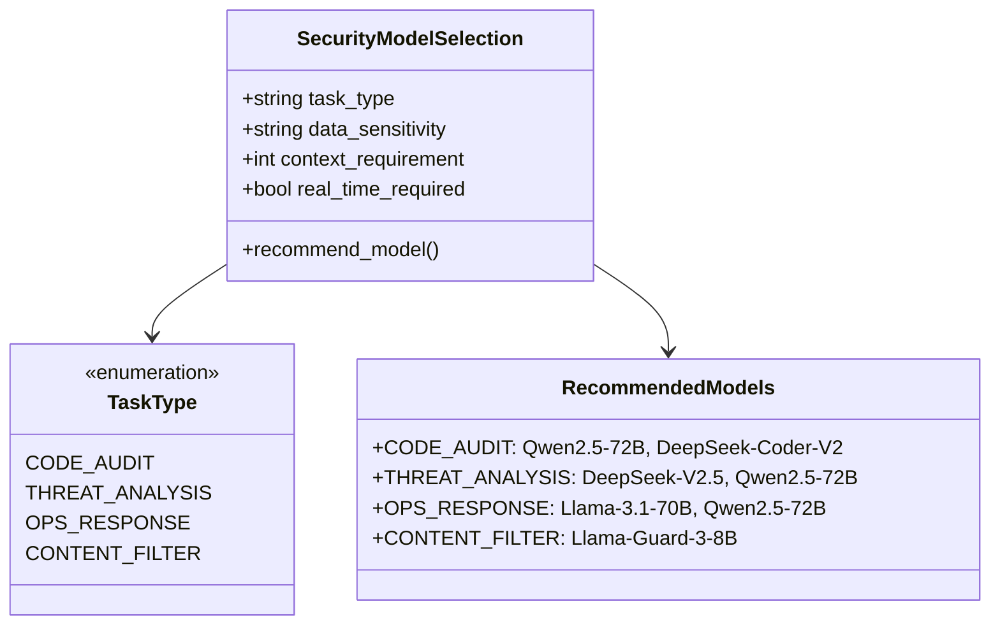

**选型公式**：

$$
\text{Optimal Model} = \arg\max_{m \in M} \left( \alpha \cdot \text{Performance}_m + \beta \cdot \text{Deployability}_m - \gamma \cdot \text{Cost}_m \right)
$$

其中 $\alpha, \beta, \gamma$ 为权重系数，取决于具体业务场景优先级。

> **缩写说明**：
> - **SOTA**: State-of-the-Art，最先进
> - **MoE**: Mixture of Experts，混合专家架构
> - **SIEM**: Security Information and Event Management，安全信息与事件管理
> - **WAF**: Web Application Firewall，Web应用防火墙
> - **POC**: Proof of Concept，概念验证

<a id="5"></a>

---

# 六、为什么很多小模型不适合安全领域

**小模型在安全场景中的局限性并非性能不足，而是其能力边界与安全领域的高可靠性要求存在根本性矛盾。**

## 6.1 小模型的核心能力瓶颈

### 6.1.1 上下文长度限制

安全分析往往需要跨大量日志、代码文件或威胁情报进行关联分析。小模型的上下文限制直接导致**信息截断**问题：

$$
\text{Lost Information Ratio} = \frac{\text{Context}_{\text{required}} - \text{Context}_{\text{max}}}{\text{Context}_{\text{required}}} \times 100\%
$$

当 $\text{Lost Information Ratio} > 30\%$ 时，漏报率显著上升。

| 模型级别 | 典型上下文 | 安全场景适用度 | 致命弱点 |
|----------|------------|----------------|----------|
| 1B以下 | 4K-8K | ❌ 不适用 | 单条日志即满 |
| 1B-7B | 8K-32K | ⚠️ 有限适用 | 告警描述即满 |
| 7B-13B | 16K-32K | ⚠️ 基础适用 | 报表级分析 |
| 70B+ | 128K+ | ✅ 基本适用 | 长代码审计 |

### 6.1.2 推理能力差距

**定义列表**：

- **Chain-of-Thought (CoT)**：链式推理能力，要求模型能够分步推导安全结论
- **Multi-hop Reasoning**：多跳推理能力，要求模型能够关联跨源信息
- **Hallucination Rate**：幻觉率，指模型生成错误信息的概率

小模型在安全推理任务上的表现：

| 推理类型 | 小模型(≤7B) | 大模型(≥70B) | 安全场景影响 |
|----------|-------------|-------------|--------------|
| 单步判断 | 85% | 95% | 低（影响有限） |
| 攻击链推理 | 45% | 88% | **极高（直接导致漏报）** |
| 漏洞根因分析 | 52% | 91% | **极高（导致误判）** |
| 合规判断 | 78% | 94% | 高（审计风险） |

> **脚注[^5]**：安全场景的推理失败代价远高于普通场景，一个漏报的0day利用可能造成真实数据泄露。

[^5]: 根据MITRE ATT&CK框架统计，高级持续性威胁(APT)的平均检测时间(MTTD)要求小于24小时，推理错误会直接延误响应窗口。

## 6.2 安全场景特有挑战

### 6.2.1 错误代价不对称性

普通聊天场景：
$$
\text{Error Cost}_{\text{chat}} = f(\text{user\_frustration})
$$

安全分析场景：
$$
\text{Error Cost}_{\text{security}} = f(\text{data\_breach\_probability} \times \text{regulatory\_fine} \times \text{reputation\_damage})
$$

| 错误类型 | 普通场景影响 | 安全场景后果 |
|----------|--------------|--------------|
| 错误建议 | 用户忽略 | **系统被攻击** |
| 漏报 | 无 | **真实威胁被忽略** |
| 误报 | 无 | **运营疲劳，真实告警被淹没** |

### 6.2.2 领域知识密度

安全领域存在大量**高度专业化的知识结构**：

- **CWE (Common Weakness Enumeration)**：弱点枚举体系
- **CAPEC (Common Attack Pattern Enumeration)**：攻击模式枚举
- **MITRE ATT&CK**：攻击战术与技术知识库
- **CVSS (Common Vulnerability Scoring System)**：漏洞评分系统

小模型在预训练阶段对这类知识的覆盖度不足，微调也难以弥补。

## 6.3 典型失败场景分析

### 6.3.1 漏洞遗漏问题

```python
# 小模型代码审计失败案例
"""
代码片段（存在SQL注入漏洞）：
"""
def get_user_profile(user_id):
    query = f"SELECT * FROM users WHERE id = {user_id}"
    # 直接字符串拼接，SQL注入漏洞
    return db.execute(query)
```

| 模型 | 分析结果 | 问题 |
|------|----------|------|
| 小模型(≤7B) | "代码逻辑正常，返回用户信息" | **完全遗漏SQL注入** |
| 大模型(≥70B) | "存在SQL注入漏洞，CWE-89，建议使用参数化查询" | 正确识别 |

### 6.3.2 攻击路径错误

```
攻击场景：OAuth 2.0 Token 窃取攻击链

小模型分析：
"攻击者通过钓鱼获取用户凭证"

大模型分析：
"攻击链路：
1. 攻击者搭建恶意OAuth Provider（Step 1: Initial Access）
2. 用户被诱导授权（Step 2: Execution）
3. 获取access_token和refresh_token（Step 4: Credential Access）
4. 利用refresh_token横向移动（Step 8: Impact）
5. 根因：OAuth回调URL未验证，CAPEC-457"
```

**根因**：小模型缺乏将离散的战术(Tactic)串联成完整攻击链(Attack Chain)的能力。

### 6.3.3 错误修复建议

| 漏洞类型 | 小模型建议 | 大模型建议 | 质量差异 |
|----------|------------|------------|----------|
| SSRF | "限制请求URL" | "1. 验证URL主机的DNS解析结果<br>2. 限制允许的协议和端口<br>3. 使用禁止重定向的HTTP Client<br>4. 参考CWE-918" | **严重不足** |
| IDOR | "添加权限检查" | "1. 对象级别授权检查(OWASP API Top 1)<br>2. 使用随机不透明ID替代顺序ID<br>3. 引用关系验证<br>4. 审计日志记录" | **不完整** |

## 6.4 为什么安全场景对模型要求更高

### 6.4.1 多维度能力矩阵

安全AI应用需要模型同时具备：

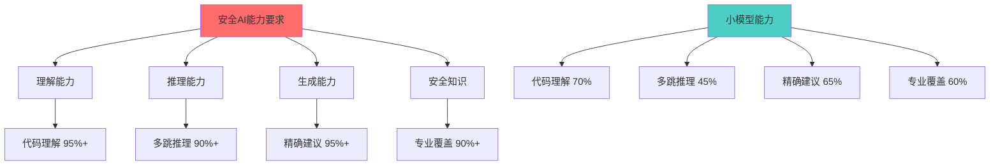

### 6.4.2 阈值效应

安全场景存在明显的**阈值效应(Threshold Effect)**：

$$
\text{Effectiveness}(m) =
\begin{cases}
0, & \text{capability}(m) < \tau_{\text{security}} \\
\text{linear\_growth}, & \text{capability}(m) \geq \tau_{\text{security}} \\
1, & \text{capability}(m) \gg \tau_{\text{security}}
\end{cases}
$$

其中 $\tau_{\text{security}} \approx 0.85$，绝大多数小模型(≤7B)的能力指标在0.45-0.70区间，处于**无效区间**。

### 6.4.3 可靠性工程视角

从SRE[^6]角度，安全AI系统的可靠性要求：

| 指标 | 普通AI应用 | 安全AI应用 |
|------|------------|------------|
| 可用性目标 | 99.9% | 99.99% |
| 误判容忍度 | 中等 | 极低 |
| 人工复核需求 | 可选 | **必须** |
| 失效模式 | 体验下降 | **真实损害** |

[^6]: SRE: Site Reliability Engineering，站点可靠性工程

## 6.5 结论与建议

### 6.5.1 选型决策原则

::: warning
**核心原则**：安全场景应优先选择能力过剩的模型，而非勉强够用的模型。
:::

| 场景 | 最低要求 | 推荐选择 | 理由 |
|------|----------|----------|------|
| 告警分类 | 13B + 32K | 70B + 128K | 漏报代价高 |
| 代码审计 | 34B + 100K | 70B + 128K | 上下文依赖强 |
| 威胁分析 | 70B | 70B + 128K | 推理要求高 |
| 实时过滤 | 7B | 8B + Guard | 延迟与安全平衡 |

### 6.5.2 混合架构建议

对于资源有限的安全团队，建议采用**大小模型协同**架构：

```python
# 混合架构示例：Router-based Security Analysis
def security_analysis_pipeline(user_query: str, context: str):
    # Step 1: 小模型快速初筛
    if small_model.quick_classify(user_query) == "clear":
        return {"status": "clear", "confidence": "high"}

    # Step 2: 大模型深度分析
    result = large_model.detailed_analysis(
        query=user_query,
        context=context,
        require_reasoning=True
    )

    # Step 3: 安全等级判定
    return {
        "status": "analyzed",
        "risk_level": result.risk_score,
        "recommendations": result.fixes,
        "confidence": "high" if result.confidence > 0.85 else "medium"
    }
```

### 6.5.3 底线要求

::: danger
**安全场景模型选型底线**：
1. 上下文长度 ≥ 32K（安全日志分析基础要求）
2. 代码能力 ≥ GPT-3.5 Level（代码审计最低门槛）
3. 推理能力在MMLU上 ≥ 70%（安全保障基本逻辑）
4. 中文理解能力 ≥ 专业水平（国内运营必要条件）
:::

**不满足上述条件的模型，不应直接应用于任何安全决策场景。**

<a id="6"></a>

---

# 七、企业真正应该如何做 AI 模型选型

企业 AI 模型选型的核心不是追逐最新榜单，而是建立一套 **基于真实业务场景的评估体系**。

## 7.1 第一步：明确场景

安全领域的 AI 应用场景差异巨大，**没有哪个模型能通吃所有场景**。企业在选型前必须首先厘清自身业务边界。

| 场景类型 | 核心能力需求 | 代表任务 |
|---------|-------------|---------|
| **漏洞分析** | 代码理解、模式识别、CVE 关联 | 静态代码扫描、漏洞定位 |
| **代码审计** | 语义理解、上下文关联、安全规范 | 合规检查、风险评估 |
| **安全运营** | 事件分类、威胁研判、响应建议 | SOC 告警分析、事件分诊 |
| **Agent 自动化** | 工具调用、多步推理、自主决策 | 自动化渗透、威胁狩猎 |
| **攻击链分析** | 时序推理、因果关联、影响评估 | ATT&CK 映射、杀伤链分析 |

不同场景对模型的偏好截然不同。例如，漏洞分析更看重 **细粒度代码理解能力**，而安全运营更看重 **快速分类与幻觉控制**。企业应基于场景建立优先级矩阵，避免用单一场景的表现推导全场景能力。

## 7.2 第二步：建立自己的 Benchmark

公开排行榜（如 SWE-Bench、BigCodeBench）的测试集与企业真实业务场景存在显著偏差[^7]。企业应构建 **内部评估基准**。

[^7]: 公开榜单存在数据污染和过拟合风险，详见第5章分析。

### 7.2.1 漏洞集构建

企业应收集以下类型的漏洞样本：

```python
# 内部漏洞数据集结构示例
vulnerability_dataset = {
    "cwe_79": {  # XSS 类漏洞
        "samples": [...],
        "difficulty": "medium",
        "requires_context": True  # 跨文件分析必需
    },
    "cwe_89": {  # SQL 注入
        "samples": [...],
        "difficulty": "high",
        "requires_db_knowledge": True
    },
    "cwe_22": {  # 路径遍历
        "samples": [...],
        "difficulty": "medium",
        "requires_fs_reasoning": True
    }
}
```

### 7.2.2 代码仓库测试集

选择企业核心业务代码仓库，按比例注入已知漏洞，测试模型的 **检出率** 与 **误报率**：

$$
\text{F1-Score} = 2 \times \frac{\text{Precision} \times \text{Recall}}{\text{Precision} + \text{Recall}}
$$

### 7.2.3 攻击案例库

收集真实入侵案例，构造攻击链测试样本，评估模型在 **多阶段推理** 场景下的表现。

## 7.3 第三步：测试真实能力

传统评估只问"会不会回答"，这对安全场景远远不够。

### 7.3.1 推理能力测试

```python
# 测试用例：条件逻辑漏洞识别
def test_logic_bug(model):
    code = """
    def check_access(user, resource):
        if user.is_admin or resource.owner == user:
            return True
        return False
    # BUG: 普通用户访问他人资源时，只要 is_admin=False 就无法正确判断
    """
    result = model.analyze(code)
    # 期望：模型应识别出 owner 判断逻辑错误
```

### 7.3.2 幻觉率评估

安全场景对幻觉的容忍度极低。测试时应统计：

- **事实性幻觉**：模型输出与代码实际行为不符
- **引用性幻觉**：编造不存在的 CVE 编号、函数名

### 7.3.3 跨文件分析能力

现代代码库高度模块化，漏洞往往需要跨文件关联才能发现：

```python
# file1.py - 定义
class AuthManager:
    def __init__(self):
        self._authenticated = False

# file2.py - 调用（漏洞隐含在此）
def delete_resource(resource_id):
    # 缺少 auth check，任何人都可删除
    db.delete(resource_id)
```

企业应设计跨文件推理测试集，评估模型能否关联分散的代码片段。

## 7.4 第四步：测试 Agent 能力

未来安全 AI 的核心竞争力是 **工具调用型 Agent**。纯聊天能力不再足够。

### 7.4.1 工具链协同测试

```python
# Agent 工具调用示例：自动化漏洞验证
class SecurityAgent:
    def __init__(self, model, tools):
        self.model = model
        self.tools = tools  # shell, file_read, code_execute, http_request

    async def verify_cve(self, cve_id: str) -> dict:
        # 阶段1：获取 CVE 详情
        cve_info = await self.tools["http_request"].get(
            f"https://cve.mitre.org/cgi-bin/cvename.cgi?name={cve_id}"
        )

        # 阶段2：分析受影响组件
        affected = self.model.extract_affected_components(cve_info)

        # 阶段3：搜索企业代码库
        for component in affected:
            matches = await self.tools["code_search"].find(component)

        # 阶段4：验证漏洞存在性
        results = []
        for match in matches:
            code = await self.tools["file_read"].read(match)
            if self.model.detect_vulnerability(code, cve_id):
                results.append({"file": match, "confirmed": True})

        return results
```

### 7.4.2 多阶段任务评估矩阵

| 能力维度 | 测试任务 | 评估指标 |
|---------|---------|---------|
| 任务拆解 | 复杂渗透测试任务分解 | 步骤完整性 |
| 工具调用 | 多工具协同完成目标 | 调用准确率 |
| 自我纠错 | 失败后自适应调整策略 | 恢复率 |
| 状态记忆 | 长任务中的上下文保持 | 跨阶段准确率 |

### 7.4.3 安全边界测试

Agent 行为必须可预测且安全。需要测试：

- 危险命令（如 `rm -rf`）的执行前确认机制
- 敏感操作（如横向移动）的审计日志完整性
- 模型越狱攻击的防御能力

---

以下是企业 AI 模型选型的完整流程图：

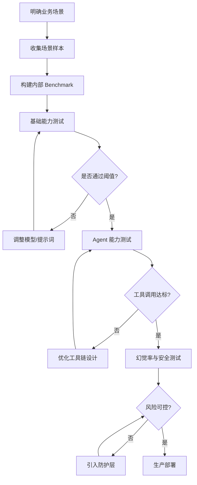

<a id="7"></a>

---

# 八、未来安全 AI 的真正方向

未来安全 AI 的竞争本质是 **复杂系统理解能力** 的竞争，而非对话交互能力的竞争。

## 8.1 从聊天机器人到系统级推理

当前大多数安全 AI 产品仍是 "Chatbot 形态"——用户输入一段代码，AI 返回分析结果。这种形态存在根本局限：

- **上下文窗口限制**：无法处理大型代码仓库的全量分析
- **单轮交互模式**：无法完成复杂的多阶段安全任务
- **被动响应范式**：无法主动发现潜在威胁

未来真正的安全 AI 将演进为 **系统级推理引擎**。

## 8.2 四大核心方向

### 8.2.1 Attack Graph Engine — 攻击图谱引擎

能够构建并推理企业完整攻击路径的图谱系统：

```python
# Attack Graph Engine 核心架构
class AttackGraphEngine:
    def __init__(self, model, asset_discovery):
        self.model = model
        self.asset_discovery = asset_discovery  # CMDB, 网络扫描, 流量分析
        self.graph = nx.DiGraph()

    def build_graph(self):
        assets = self.asset_discovery.scan()
        for asset in assets:
            self.graph.add_node(asset.id, **asset.attributes)

        # 威胁建模
        threats = self.model.identify_threats(assets)
        for threat in threats:
            # 边：攻击路径
            self.graph.add_edge(
                threat.source, threat.target,
                technique=threat.technique,  # MITRE ATT&CK
                likelihood=threat.probability
            )

    def find_critical_paths(self, entry_point, target):
        """识别从入口点到目标的关键攻击路径"""
        return nx.all_simple_paths(self.graph, entry_point, target)

    def suggest_defense(self, path):
        """基于攻击路径建议防御措施"""
        return self.model.suggest_mitigations(path)
```

### 8.2.2 Autonomous Security Agent — 自主安全代理

能够自主完成渗透测试、威胁狩猎等复杂任务的 Agent 系统：

| 能力层级 | 描述 | 当前成熟度 |
|---------|------|-----------|
| **L1** | 辅助分析（人主导） | ✅ 成熟 |
| **L2** | 半自动执行（人监督） | ⚠️ 部分可用 |
| **L3** | 自主决策执行（边界保护） | 🔬 实验阶段 |
| **L4** | 完全自主（限定目标） | 🚫 未就绪 |

### 8.2.3 Repo-level Reasoning System — 仓库级推理系统

突破上下文窗口限制，真正理解 **代码仓库级语义** 的系统：

$$
\text{Repo Understanding Score} = \frac{1}{n} \sum_{i=1}^{n} \text{Recall}\left(\text{Cross-File-Relation}_i\right)
$$

核心能力包括：

- **依赖图构建**：理解模块间的调用与数据流
- **架构模式识别**：识别安全相关的设计模式
- **变更影响分析**：评估代码变更对安全态势的影响

### 8.2.4 Exploit Analysis Engine — 漏洞利用分析引擎

能够深度分析漏洞利用代码并推导防御方案的引擎：

```python
# Exploit Analysis Engine 工作流
class ExploitAnalyzer:
    def __init__(self, model, sandbox):
        self.model = model
        self.sandbox = sandbox  # 隔离执行环境

    async def analyze_exploit(self, exploit_code: str) -> AnalysisResult:
        # 阶段1：静态分析
        static_result = self.model.static_analyze(exploit_code)

        # 阶段2：动态执行（沙箱）
        exec_result = await self.sandbox.execute(exploit_code)

        # 阶段3：行为模式提取
        behaviors = self.model.extract_behaviors(exec_result)

        # 阶段4：防御建议生成
        mitigations = self.model.generate_mitigations(behaviors)

        return AnalysisResult(
            static=static_result,
            dynamic=exec_result,
            behaviors=behaviors,
            mitigations=mitigations,
            confidence=self.model.estimate_confidence(behaviors)
        )
```

## 8.3 未来竞争的核心逻辑

未来安全 AI 的竞争将围绕以下维度展开：

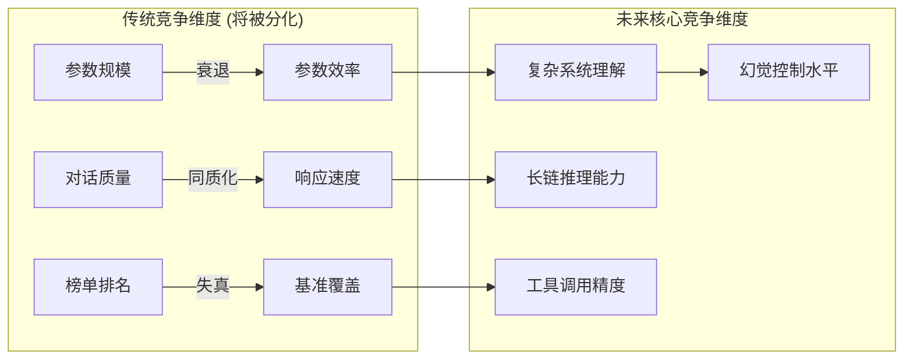

这些能力的本质是：**谁更能理解复杂系统与攻击行为的本质**。

<a id="8"></a>

---

# 九、结语

AI 模型选型最大的误区，是把 AI 当成 **"通用聊天工具"** 来评估。

## 9.1 安全 AI 的六大核心能力

对于信息安全领域，真正重要的能力可以归结为六大维度：

| 能力维度 | 定义 | 评估方法 |
|---------|------|---------|
| **推理能力** | 基于已知信息推导未知威胁的逻辑链完整性 | 多步推理测试集 |
| **长链分析能力** | 跨越长上下文保持逻辑一致性的能力 | Long-context Benchmark |
| **Repo 级理解能力** | 理解大型代码仓库整体架构与模块关系的能力 | 跨文件漏洞检出率 |
| **工具调用能力** | 准确调用外部工具完成复杂任务的能力 | Agent 任务完成率 |
| **幻觉控制能力** | 在安全知识领域保持输出事实性的能力 | 幻觉率专项测试 |
| **安全逻辑理解能力** | 理解安全协议、加密逻辑、权限模型等的能力 | 安全场景专项测试 |

## 9.2 选型决策框架

企业在进行安全 AI 选型时，应遵循以下决策框架：

$$
\text{Selection Score} = \sum_{i=1}^{6} w_i \cdot \text{Normalized Score}_i
$$

其中 $w_i$ 为各能力维度的权重，应根据业务场景动态调整。

## 9.3 未来展望

未来的信息安全 AI 竞争，本质上会变成 **"谁能真正理解复杂系统与攻击行为"** 的竞争，而不是 **"谁的参数更大"** 的竞争。

技术架构师在规划安全 AI 能力建设时，应：

1. **拒绝追新**：不盲目追逐最新模型榜单
2. **场景优先**：基于真实业务场景建立评估体系
3. **能力为本**：聚焦推理、工具调用、幻觉控制等核心能力
4. **长期投入**：安全 AI 是长线投资，需要持续迭代

> **核心结论**：在安全 AI 领域，**理解能力** 远比 **对话能力** 重要，**系统级推理** 远比 **单点回答** 有价值。企业唯有建立基于真实场景的评估体系，才能在 AI 安全能力建设中做出正确选择。

<a id="9"></a>

---

**参考链接：**

- Qwen系列：[https://qwenlm.github.io/](https://qwenlm.github.io/) - Qwen官方文档与模型介绍
- DeepSeek系列：[https://www.deepseek.com/](https://www.deepseek.com/) - DeepSeek官方文档与模型介绍
- Llama系列：[https://ai.meta.com/llama/](https://ai.meta.com/llama/) - Meta Llama官方资源
- HuggingFace：[https://huggingface.co/models](https://huggingface.co/models) - 开源模型库
- MITRE ATT&CK：[https://attack.mitre.org/](https://attack.mitre.org/) - 攻击战术与技术框架
- CWE数据库：[https://cwe.mitre.org/](https://cwe.mitre.org/) - 通用缺陷枚举
- OWASP：[https://owasp.org/](https://owasp.org/) - Web应用安全项目

---

**附录（Appendix）：**

## A. 公式汇总

文中使用的主要数学公式：

1. **风险评估公式**（第二章）：
$$ \text{风险评估} = \sum_{i=1}^{n} P(\text{漏洞}_i) \times Impact(\text{漏洞}_i) \times (1 - Recall_{\text{模型}}) $$

2. **审计成本公式**（第二章）：
$$ \text{审计成本} = \text{真实漏洞数} \times \text{调查成本} + \text{幻觉漏洞数} \times \text{浪费成本} $$

3. **Exploitability公式**（第四章）：
$$ \text{Exploitability} = \sum_{p \in \text{AttackPath}} \prod_{i=1}^{|p|} P(\text{Step}_i | \text{Context}_i) $$

4. **Security Analysis Score公式**（第五章）：
$$ \text{Security\_Analysis\_Score} = \sum_{i=1}^{n} w_i \cdot \text{capability}_i \cdot \text{context\_relevance}_i $$

5. **F1-Score公式**（第七章）：
$$ \text{F1-Score} = 2 \times \frac{\text{Precision} \times \text{Recall}}{\text{Precision} + \text{Recall}} $$

6. **Repo Understanding Score公式**（第八章）：
$$ \text{Repo Understanding Score} = \frac{1}{n} \sum_{i=1}^{n} \text{Recall}\left(\text{Cross-File-Relation}_i\right) $$

7. **Selection Score公式**（第九章）：
$$ \text{Selection Score} = \sum_{i=1}^{6} w_i \cdot \text{Normalized Score}_i $$

## B. 术语表

| 缩写 | 全称 | 中文释义 |
|------|------|----------|
| SAST | Static Application Security Testing | 静态应用安全测试 |
| DAST | Dynamic Application Security Testing | 动态应用安全测试 |
| IAST | Interactive Application Security Testing | 交互式应用安全测试 |
| RCE | Remote Code Execution | 远程代码执行 |
| SSRF | Server-Side Request Forgery | 服务端请求伪造 |
| SQLi | SQL Injection | SQL注入 |
| IDOR | Insecure Direct Object Reference | 不安全直接对象引用 |
| XXE | XML External Entity | XML外部实体 |
| XSS | Cross-Site Scripting | 跨站脚本攻击 |
| CSRF | Cross-Site Request Forgery | 跨站请求伪造 |
| PoC | Proof of Concept | 概念验证 |
| CVE | Common Vulnerabilities and Exposures | 通用漏洞披露 |
| CWE | Common Weakness Enumeration | 通用缺陷枚举 |
| CAPEC | Common Attack Pattern Enumeration and Classification | 通用攻击模式枚举 |
| CVSS | Common Vulnerability Scoring System | 通用漏洞评分系统 |
| SIEM | Security Information and Event Management | 安全信息与事件管理 |
| WAF | Web Application Firewall | Web应用防火墙 |
| RBAC | Role-Based Access Control | 基于角色的访问控制 |
| ABAC | Attribute-Based Access Control | 基于属性的访问控制 |
| APT | Advanced Persistent Threat | 高级持续性威胁 |
| MITRE ATT&CK | MITRE Adversarial Tactics, Techniques & Common Knowledge | MITRE对抗战术、技术和常识 |
| SRE | Site Reliability Engineering | 站点可靠性工程 |
| MTTD | Mean Time To Detect | 平均检测时间 |
| MTTR | Mean Time To Respond | 平均响应时间 |
| MoE | Mixture of Experts | 混合专家架构 |
| SOTA | State-of-the-Art | 最先进 |
| CoT | Chain-of-Thought | 链式推理 |
| MMLU | Massive Multitask Language Understanding | 大规模多任务语言理解 |

## C. 超参数配置参考

| 场景 | 推荐模型 | 上下文长度 | 温度 | 最大Token | GPU要求 |
|------|----------|------------|------|----------|---------|
| 实时告警分析 | Qwen2.5-7B | 32K | 0.1 | 2048 | 1x A100 40G |
| 代码审计 | Qwen2.5-72B / DeepSeek-Coder-V2 | 128K | 0.2 | 4096 | 2x A100 80G |
| 威胁情报分析 | DeepSeek-V2.5 | 128K | 0.15 | 3072 | 2x A100 80G |
| 安全Agent | Llama-3.1-70B | 128K | 0.1 | 2048 | 2x A100 80G |
| 内容安全过滤 | Llama-Guard-3-8B | 8K | 0.0 | 512 | 单卡可运行 |

## D. 安全AI评测数据集推荐

| 数据集 | 类型 | 适用场景 | 来源 |
|--------|------|----------|------|
| SARD | 漏洞代码 | 函数级漏洞检测 | NIST |
| Juliet | 测试用例 | CWE覆盖测试 | NIST |
| Draper | 二进制漏洞 | 二进制安全分析 | DRAPER实验室 |
| SWE-Bench | 真实Issue | 代码修复能力 | Princeton |
| BigCodeBench | 代码任务 | 代码生成质量 | BigCode项目 |
| SecBench | 安全专项 | 安全能力评估 | 多源汇总 |

---

**关键词：** AI模型选型、信息安全、机器学习安全、Qwen、DeepSeek、Llama、安全评估体系、Benchmark局限、幻觉率、Tool Calling、Agent安全、代码审计、漏洞分析、安全运营、AI Security