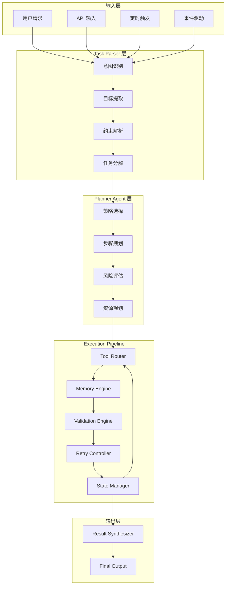
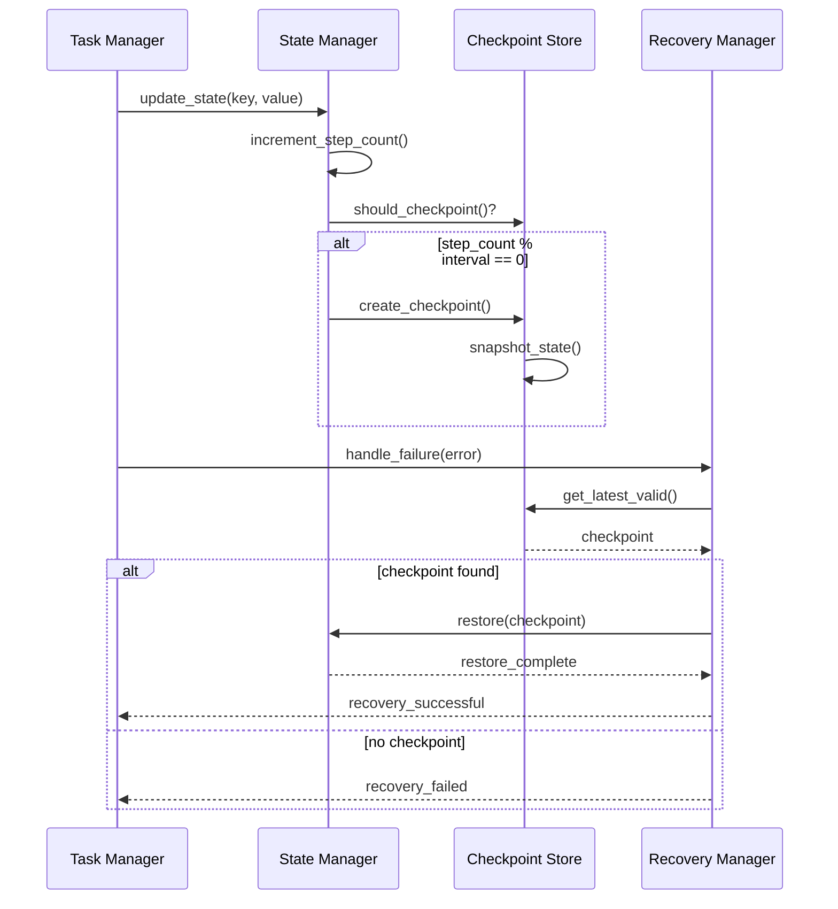
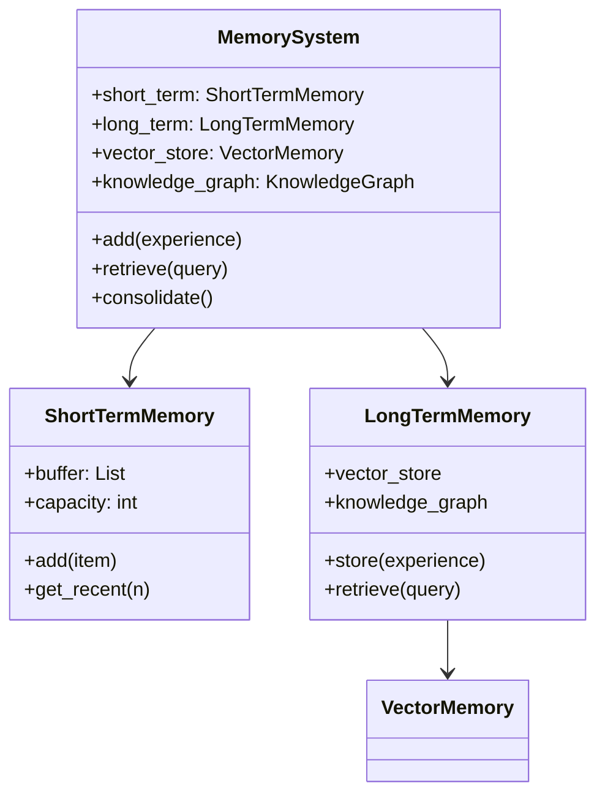
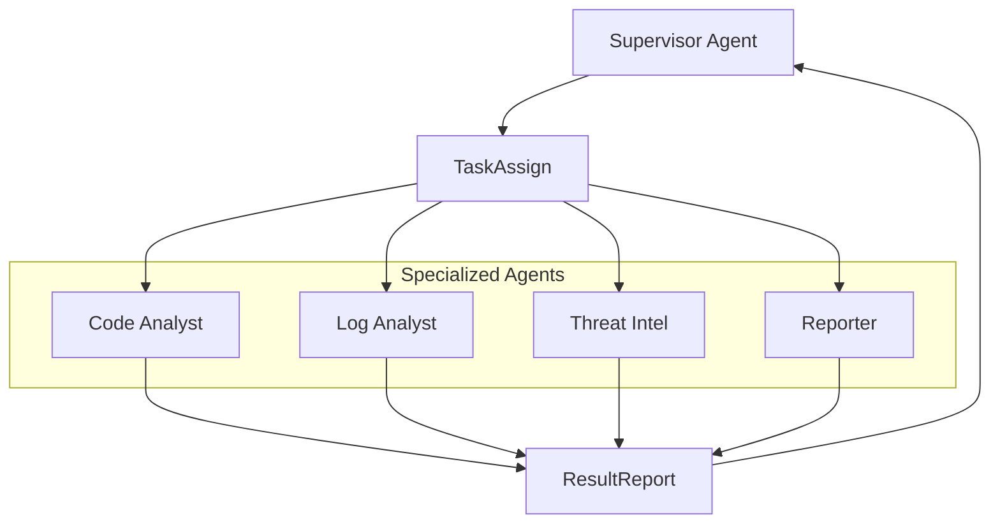
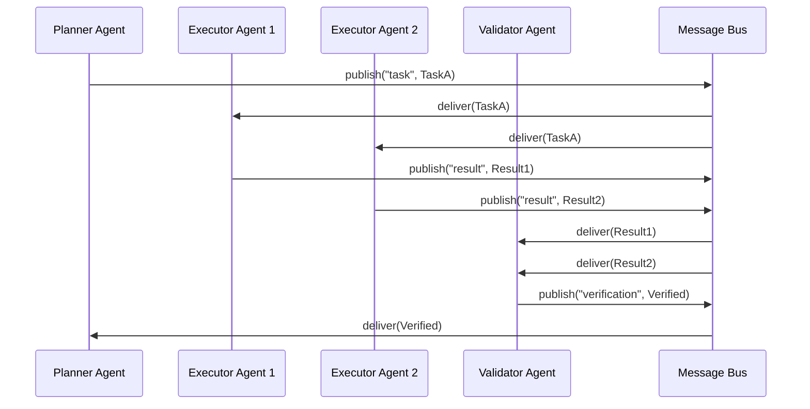
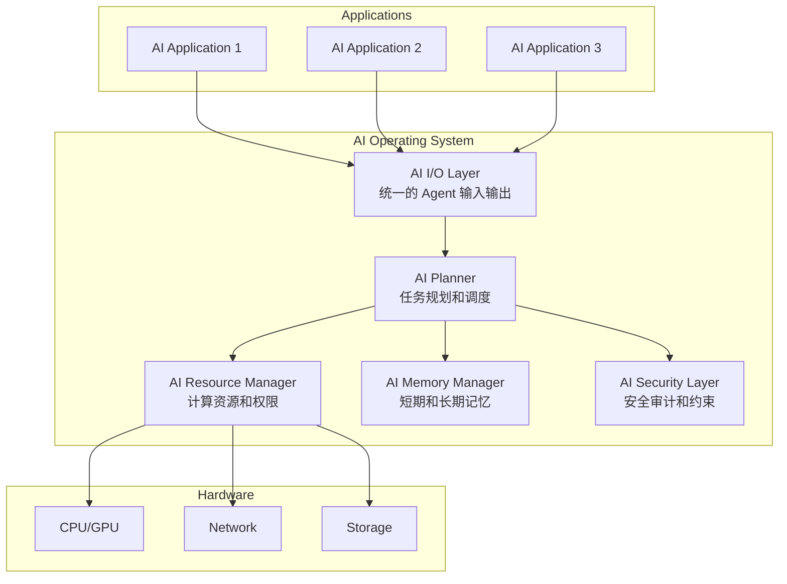

# AI 在自动编排上的原原理析：从 Agent Pipeline 到自治执行系统

**作者：** HOS(安全风信子)  
**日期：** 2026-04-24  
**主要来源平台：** GitHub  
**摘要：** 本文深入剖析 AI 自动编排系统的核心技术原理，从 Agent Pipeline 的设计哲学到自治执行系统的工程实践，揭示为什么传统工作流在 AI 时代面临根本性挑战，以及多 Agent 协作系统如何重构软件架构。文章基于 2025-2026 年 GitHub 热门项目如 LangChain^1^、AutoGen^2^、CrewAI^3^ 的架构分析，结合 ReAct^4^、Tree of Thoughts^5^ 等推理框架的最新进展，阐述 AI 编排系统从"固定流程驱动"向"动态推理驱动"的范式转变。核心价值在于为中高级 AI 工程师提供可落地的 Agent Pipeline 设计原则、状态管理方案和工程避坑指南，同时对 AI Operating System^6^ 和 Agent Mesh^7^ 等前沿趋势给出独到预测，帮助读者在 AI 原生架构时代建立系统性认知框架。

---

@[TOC](目录)

---

<a id="1"></a>

# 第一章：为什么 AI 自动编排正在成为下一代软件架构核心

*本节为你提供的核心技术价值：理解 ChatBot 与 Agent 的本质差异，认识到为什么 Prompt 自动化不等于真正的 AI 编排，以及 LLM 能力跃升如何催生新型软件架构范式。*

<a id="1-1"></a>

## 1.1 从"聊天机器人"到"自动执行系统"

当我们审视过去三年 AI 技术的发展轨迹，一个清晰的脉络浮现：AI 系统正在从**被动应答者**向**主动执行者**进化。这一转变的深层含义，远超出技术本身的迭代，而触及软件架构的根本性重构。

**ChatBot 与 Agent 的本质区别**体现在三个维度：

| 维度 | ChatBot | Agent |
|:---:|:---:|:---:|
| **交互模式** | 请求-响应，单轮或有限多轮 | 持续循环，目标导向 |
| **执行能力** | 仅生成内容，无法调用工具 | 可调用工具、操作外部系统 |
| **自主性** | 无状态，每次响应独立 | 维护状态，自主决策路径 |
| **失败处理** | 简单重试或转人工 | 自我反思、策略调整 |
| **目标达成** | 回答问题 | 完成复杂任务 |

传统的 ChatBot 本质上是一个**确定性输出函数**：

$$
Output = f_{LLM}(Prompt, Context)
$$

其中 $f_{LLM}$ 是语言模型的转发函数，输出完全由输入决定，不存在执行后的状态反馈循环。这种模式在开放域对话场景下表现尚可，但一旦涉及**需要多步骤执行、工具调用、状态维护的复杂任务**，立刻显现出根本性缺陷。

而 Agent 则引入了**反馈回路**：

```python
# Agent 核心执行循环（伪代码）
class Agent:
    def __init__(self, llm, tools, memory):
        self.llm = llm
        self.tools = tools
        self.memory = memory
        self.state = {}
    
    def run(self, task):
        while not task.is_complete():
            # 1. 推理阶段
            context = self.memory.retrieve(task)
            thought = self.llm.reason(task, context)
            
            # 2. 决策阶段
            action = self.llm.decide(thought, self.tools)
            
            # 3. 执行阶段
            result = self.execute_action(action)
            
            # 4. 验证阶段
            if self.verify(result):
                self.memory.store(thought, action, result)
                task.update_progress(result)
            else:
                # 反思与重试
                self.reflect(thought, result)
            
            # 5. 状态更新
            self.state = self.update_state(result)
        
        return task.final_result()
```

这个循环的存在，使得 Agent 能够处理**非确定性、动态、多步骤的复杂任务**。

**为什么 Prompt 不等于自动化**？这个问题触及 AI 自动化的核心困境。传统的 Prompt Engineering 范式存在以下根本限制：

1. **上下文窗口的有限性**：GPT-4 的 128K 上下文看似巨大，但在处理需要数百步骤的任务时，仍然会遇到"记忆遗忘"问题[^1]。

2. **错误累积与传播**：在单次 Prompt 模式下，一旦模型在某个推理步骤产生错误，后续所有基于该错误的推理都会连锁失败。

3. **工具调用的缺失**：Prompt 无法直接让 LLM 执行代码、访问 API、操作文件系统。

<a id="1-2"></a>

## 1.2 什么是 AI 自动编排（AI Orchestration）

**AI 自动编排**（AI Orchestration）是**使用 AI 系统的推理和决策能力，动态协调多个任务、执行单元、工具和服务，以达成复杂目标的软件架构模式**。它与传统的 Workflow Automation 有本质区别。

**Workflow Automation vs AI Orchestration**：

| 维度 | Workflow Automation | AI Orchestration |
|:---:|:---:|:---:|
| **节点类型** | 固定、预定义 | 动态、推理生成 |
| **路径选择** | 条件分支，规则驱动 | AI 决策，语义理解 |
| **输入处理** | 结构化数据 | 非结构化内容+结构化数据 |
| **异常处理** | 预设规则 | AI 自主判断 |
| **执行模式** | 确定性 | 概率性+验证 |

传统的 Workflow Automation（如 Jenkins Pipeline、Apache Airflow）是基于**有向无环图（DAG）**的编排模式：

$$
Workflow = (N, E, s, t)
$$

其中 $N$ 是节点集合，$E$ 是边集合，$s$ 是起始节点，$t$ 是终止节点。每个节点的执行逻辑完全预定义，路径选择由 if-else 条件分支决定。

**AI Orchestration** 引入了**动态规划层**，能够处理目标模糊、步骤未知、环境动态变化的复杂场景。

<a id="1-3"></a>

## 1.3 为什么传统自动化系统开始失效

RPA（Robotic Process Automation）作为企业自动化的主流方案，在过去十年取得了显著成功。然而，当企业试图将其应用于更复杂的业务场景时，传统 RPA 的局限性暴露无遗。

**RPA 的规则脆弱性**体现在：

1. **环境变化的脆弱性**：RPA 机器人依赖屏幕坐标、UI 元素选择器等视觉或结构化标识。当目标应用的 UI 发生任何变化，RPA 流程就会中断。

2. **非结构化处理的缺失**：企业流程中存在大量自然语言内容，传统 RPA 无法"理解"这些内容。

3. **异常处理的硬编码困境**：每个可能的异常都需要预先编写处理逻辑，这在现实中几乎不可能。

**固定 DAG 无法应对动态任务**。Apache Airflow、Prefect 等工作流引擎建立在 DAG 模型上，每个节点的执行逻辑、依赖关系在流程定义时完全确定，无法优雅表达需要动态创建循环或回退的流程。

**企业流程中的非结构化问题**是压垮传统自动化的最后一根稻草。现代企业运营涉及大量文档处理，这些场景的共同特点是：**输入是非结构化的、目标是语义性的、输出需要推理**。

<a id="1-4"></a>

## 1.4 Agent Pipeline 为什么会爆发

Agent Pipeline 的爆发并非偶然，而是多重技术能力在 2023-2025 年间交汇的结果。

**LLM 带来的语义理解能力**是基础。GPT-4、Claude 3 Opus^9^、Gemini 1.5 Pro^10^ 等大语言模型展示了前所未有的语义理解水平：

| 能力 | 说明 | 2021 年水平 | 2024 年水平 |
|:---:|:---:|:---:|:---:|
| 上下文理解 | 长文档全局一致性 | 2-3K token | 128K-1M token |
| 指令遵循 | 复杂多步指令 | 粗糙 | 精确 |
| 推理能力 | 多步逻辑推导 | 3-5 步 | 20+ 步 |

**Tool Use 能力出现后的质变**是 Agent Pipeline 爆发的关键技术节点。2023 年 6 月，OpenAI 推出 Function Calling，使得 LLM 能够理解 JSON Schema 格式的工具定义，根据用户意图和上下文选择合适的工具。

**Context Window 扩大后的连锁影响**不可忽视。当上下文窗口足够大时，系统的"记忆能力"突破了临界点，使得复杂任务的规划、执行、验证可以在一个连贯的上下文中完成。

**多阶段推理开始可行**。ReAct（Reasoning + Acting）范式的提出和成熟，使得 AI 能够进行"思考-行动-观察"的循环推理，处理需要**规划和适应**的复杂任务。

> **本节核心洞见**：Agent Pipeline 的爆发是 LLM 能力积累到临界点的必然结果。语义理解、Tool Use、上下文扩展、多阶段推理这四重能力的交汇，使得 AI 从"能说会道"进化到"能谋善断"，从"答案生成器"进化到"任务执行器"。这不仅是技术进步，更是软件架构范式的根本转变。

---

<a id="2"></a>

# 第二章：Agent Pipeline 的核心概念

*本节为你提供的核心技术价值：掌握 Agent Pipeline 的本质定义，理解其与传统工作流的根本差异，建立 Agent 生命周期的完整认知，并深入理解为什么单次 LLM 调用无法解决复杂任务。*

<a id="2-1"></a>

## 2.1 什么是 Agent Pipeline

**Agent Pipeline** 是**一种以 AI 推理为核心驱动力的任务执行架构，其本质是一个包含推理、决策、行动、验证的循环系统，而非单向的处理管道**。

理解这个定义需要打破对"Pipeline"这个词的直觉误解。传统意义上的 Pipeline（如 CI/CD Pipeline、数据处理 Pipeline）是**线性或树状的流动结构**，数据从一端输入，经过一系列预定义的处理节点，最终输出结果。

而 Agent Pipeline 遵循的是**控制流（Control Flow）而非数据流（Data Flow）**的模型：

```python
# Agent Pipeline 本质是一个循环控制系统
class AgentPipeline:
    """
    Agent Pipeline 的核心不是数据转换，而是状态机驱动
    """
    
    def __init__(self, agent, max_iterations=50):
        self.agent = agent
        self.max_iterations = max_iterations
        self.state_machine = StateMachine()
    
    def execute(self, initial_task):
        state = self.state_machine.initial()
        task = initial_task
        iteration = 0
        
        while not self.state_machine.is_terminal(state):
            # 1. 推理阶段
            reasoning = self.agent.reason(task, state)
            
            # 2. 决策阶段：根据推理决定下一个状态
            next_state = self.agent.decide(reasoning, state)
            
            # 3. 行动阶段：执行转换
            result = self.state_machine.transition(state, next_state)
            
            # 4. 验证阶段
            if self.state_machine.validate(result):
                state = next_state
                task = task.update(result)
            else:
                state = self.state_machine.recover(result)
            
            iteration += 1
            if iteration > self.max_iterations:
                raise AgentPipelineOverflow(f"Exceeded {self.max_iterations} iterations")
        
        return task.final_result()
```

**输入 → 推理 → 决策 → 工具调用 → 结果验证 → 状态更新** 这个循环的每一步都涉及 AI 的参与。输入不再是简单的数据，而是**目标和约束**；推理不再是单步生成，而是**多步思考**；决策不再是 if-else，而是**语义级的策略选择**。

**为什么 Agent 本质上是"循环系统"而非"处理管道"**？原因在于复杂任务的不确定性本质：目标的不确定性、路径的不确定性、结果的不确定性、环境的不确定性。这些不确定性意味着**Agent Pipeline 必须在执行过程中不断"感知-决策-行动"**，形成闭环控制。

<a id="2-2"></a>

## 2.2 Pipeline 与传统工作流引擎区别

**传统工作流引擎**（如 Camunda^11^、Activiti^12^、Temporal^13^）建立在以下核心假设上：

1. **流程定义先于执行**：流程的结构在运行时之前完全确定
2. **数据与控制流分离**：节点定义处理逻辑，边定义执行顺序
3. **状态由引擎维护**：工作流引擎是状态的唯一真实来源

**Agent Pipeline** 采用了完全不同的设计哲学：

| 维度 | 传统工作流引擎 | Agent Pipeline |
|:---:|:---:|:---:|
| **流程定义时机** | 设计时确定 | 运行时动态生成 |
| **节点生成** | 预定义 | AI 根据上下文推理生成 |
| **路径选择** | 条件网关，规则驱动 | AI 推理，语义理解 |
| **失败处理** | 补偿事务、重试策略 | AI 自主判断+策略调整 |
| **状态来源** | 引擎单一数据源 | 分散（Agent + 外部系统） |

这种差异的根源在于**知识表示的不对称**：传统工作流中知识编码在流程定义中，Agent Pipeline 中知识存在于 LLM 的权重中，流程由推理动态生成。

<a id="2-3"></a>

## 2.3 Agent Pipeline 的典型生命周期

理解 Agent Pipeline 的生命周期，是设计稳定 AI 自动化系统的基础。一个完整运行的 Agent Pipeline 包含以下阶段：

```mermaid
gantt
    title Agent Pipeline Lifecycle
    dateFormat X
    axisFormat %s
    
    section Task Intake
    Parse & Validate    :0, 5
    Goal Decomposition  :5, 15
    
    section Planning
    Strategy Selection   :15, 20
    Step Planning        :20, 35
    
    section Execution
    Memory Retrieval     :35, 40
    Tool Selection       :40, 45
    Action Execution     :45, 60
    
    section Verification
    Result Validation    :60, 70
    Reflection           :70, 80
    
    section Finalization
    Finalize Output      :80, 90
    Cleanup              :90, 100
```



**Task Intake（任务摄取）**是 Pipeline 的入口阶段：意图识别、目标提取、约束解析、优先级判定。

**Planning（规划）**是 Agent Pipeline 的核心阶段：策略选择、步骤规划、资源规划、风险评估。

**Memory Retrieval（记忆检索）**在每次推理前执行，从多种记忆存储中检索与当前任务相关的信息。

**Tool Selection（工具选择）**是 Agent 相对于传统自动化系统的独特能力。

**Action Execution（行动执行）**阶段实际调用选定的工具并获取结果。

**Verification（验证）**是 Agent Pipeline 可靠性的关键保障。由于 LLM 的概率性特性，Agent 的每个输出都需要被验证。

**Reflection（反思）**是 AI 从失败中学习的能力。

**Retry（重试）**机制需要智能设计，避免无限循环。

**Finalization（最终化）**阶段汇总执行结果，生成最终输出。

<a id="2-4"></a>

## 2.4 为什么"单次调用 AI"无法解决复杂任务

**长链推理问题**是单次调用无法逾越的首要障碍。研究表明，当推理步骤超过 15-20 步时，单次 LLM 调用的推理准确率急剧下降[^2]。这是因为：推理衰减、误差累积、注意力分散。

**上下文污染**是长上下文的必然代价。当我们在单次调用中尝试包含所有相关信息时，50页财务报告的关键信息被稀释，模型可能"迷失"在大量信息中。

**推理漂移**（Reasoning Drift）是另一个关键问题。在长上下文中，LLM 的推理方向可能逐渐偏离原始目标：语义漂移、角色漂移、逻辑漂移。

**中间状态丢失**在单次调用中是无法避免的。当一个复杂任务被分解为多个阶段时，每个阶段的输出对于后续阶段至关重要。

> **本节核心洞见**：Agent Pipeline 的循环结构不是"过度设计"，而是复杂任务执行的必然要求。长链推理、上下文限制、误差累积、状态维护这些挑战，只能通过分阶段执行、状态管理、持续验证的架构来应对。

---

<a id="3"></a>

# 第三章：AI 自动编排系统底层架构解析

*本节为你提供的核心技术价值：深入理解 AI 自动编排系统的核心组件架构，包括任务解析层、规划层、执行层、验证层和状态管理，以及它们如何协同工作实现动态任务编排。*

<a id="3-1"></a>

## 3.1 自动编排系统核心结构图

AI 自动编排系统的架构设计直接决定了其能力边界和可靠性上限。一个完善的 AI Orchestration 系统需要平衡三个核心目标：**动态性**（能处理未知任务）、**可靠性**（能保证执行正确）和**可观测性**（能追踪和调试）。



**架构分层的设计哲学**：

| 层级 | 职责 | 核心抽象 | 关键设计点 |
|:---:|:---:|:---:|:---:|
| **输入层** | 接收和标准化输入 | Request Adapter | 多源统一接入 |
| **解析层** | 理解意图、分解任务 | Task Graph | 语义理解精度 |
| **规划层** | 生成执行策略 | Execution Plan | 推理质量 |
| **执行层** | 调用工具、执行业务逻辑 | Tool / Action | 可靠性和安全性 |
| **输出层** | 综合结果、格式化输出 | Response | 可控性 |

<a id="3-2"></a>

## 3.2 Task Parser：任务解析层

Task Parser 是 AI Orchestration 系统的"大脑皮层"，负责将原始输入转换为系统可处理的结构化表示。

**用户意图识别**是 Task Parser 的首要功能：

```python
class IntentRecognizer:
    def __init__(self, llm, intent_taxonomy):
        self.llm = llm
        self.taxonomy = intent_taxonomy
    
    def recognize(self, user_input):
        # 意图分类
        intent_type = self.classify_intent(user_input)
        
        # 意图置信度
        confidence = self.calculate_confidence(user_input)
        
        # 意图分解（复杂意图拆分为多个子意图）
        if self.is_complex(user_input):
            sub_intents = self.decompose_intent(user_input)
        else:
            sub_intents = [user_input]
        
        # 隐含意图推断
        implied = self.infer_implied_intent(user_input)
        
        return RecognizedIntent(
            primary=intent_type,
            confidence=confidence,
            sub_intents=sub_intents,
            implied=implied,
            raw_text=user_input
        )
```

**目标拆分**是将高层目标分解为可执行的子目标。**子任务生成**是将分解后的目标转换为可执行的最小任务单元。

Task Parser 的质量评估指标：意图识别准确率、目标分解有效性、约束提取覆盖率、不确定性识别率。

<a id="3-3"></a>

## 3.3 Planner Agent：规划层

**为什么规划是自动编排核心**？因为规划是将"目标"转化为"行动序列"的关键桥梁。

**ReAct 思维链**（Reasoning + Acting）是当前最主流的规划范式：

```python
class ReActPlanner:
    def __init__(self, llm, tools):
        self.llm = llm
        self.tools = tools
    
    def plan(self, task):
        thought_history = []
        obs_history = []
        
        for step in range(task.max_steps):
            # 推理阶段
            thought = self.reason(task, thought_history, obs_history)
            thought_history.append(thought)
            
            # 决策阶段
            action = self.decide_action(thought, self.tools)
            
            # 执行阶段
            if action.is_tool_call:
                obs = self.execute_tool(action)
            else:
                obs = action.execute()
            
            obs_history.append(obs)
            
            if task.is_complete(obs):
                return TaskResult(success=True, steps=thought_history)
        
        return TaskResult(success=False, reason="Max steps exceeded")
```

**Tree of Thoughts**（ToT）是一种更强大的规划方法，它在每个决策点探索多个可能的分支。

规划层的评估维度：规划质量、规划效率、适应性、资源利用、可解释性。

<a id="3-4"></a>

## 3.4 Execution Layer：执行层

Execution Layer 是 AI Orchestration 系统中真正"做事"的层级。

**Tool Invocation**是执行层的核心功能：

```python
class ToolInvoker:
    def __init__(self, tool_registry, security_policy):
        self.registry = tool_registry
        self.security = security_policy
        self.execution_history = []
    
    def invoke(self, tool_call):
        tool = self.registry.get(tool_call.name)
        
        if not self.security.is_allowed(tool_call):
            raise SecurityViolation(f"Tool {tool_call.name} not allowed")
        
        validated_args = tool.validate_params(tool_call.arguments)
        
        try:
            result = tool.execute(**validated_args)
            self.execution_history.append(ExecutionRecord(
                tool=tool.name,
                args=validated_args,
                result=result,
                status='success'
            ))
            return result
        except Exception as e:
            self.execution_history.append(ExecutionRecord(
                tool=tool.name,
                args=validated_args,
                error=str(e),
                status='failed'
            ))
            raise
```

**API 调度**需要处理 API 的认证授权、限流重试、错误处理、响应解析。

**文件系统操作**需要严格的安全控制。

**Shell 执行**是最危险但也最强大的执行能力，需要最高级别的安全控制。

<a id="3-5"></a>

## 3.5 Verification Layer：验证层

Verification Layer 是保证 AI Orchestration 系统可靠性的关键防线。

**AI 自我验证**是验证层的基础能力：

```python
class AISelfVerifier:
    def __init__(self, llm, verification_prompts):
        self.llm = llm
        self.prompts = verification_prompts
    
    def verify_reasoning(self, reasoning, expected_logic):
        prompt = self.prompts['reasoning_verification'].format(
            reasoning=reasoning,
            expected=expected_logic
        )
        result = self.llm.chat([{"role": "user", "content": prompt}])
        return VerificationResult(
            passed=result.confident,
            confidence=result.confidence,
            issues=result.issues
        )
```

**静态验证**不涉及 AI 推理，基于预定义规则进行检查。

**Schema 校验**确保结构化输出符合预期格式。

**多Agent交叉验证**通过多个 Agent 的独立推理来提高验证可靠性。

<a id="3-6"></a>

## 3.6 State Manager：状态管理

**为什么状态管理决定 Agent 是否稳定**？因为状态是 Agent 跨步骤执行能力的核心保障。

**状态漂移问题**（State Drift）是 Agent 系统的主要故障模式之一：

```python
class StateDriftError(Exception):
    """状态与预期不一致时抛出"""
    pass

class StateManager:
    def __init__(self, checkpoint_interval=5):
        self.state = {}
        self.checkpoint_interval = checkpoint_interval
        self.checkpoints = []
        self.step_count = 0
    
    def get(self, key, default=None):
        return self.state.get(key, default)
    
    def set(self, key, value):
        self.state[key] = value
        self.step_count += 1
        
        if self.step_count % self.checkpoint_interval == 0:
            self.create_checkpoint()
    
    def create_checkpoint(self):
        checkpoint = {
            'step': self.step_count,
            'state_snapshot': copy.deepcopy(self.state),
            'timestamp': time.time()
        }
        self.checkpoints.append(checkpoint)
```



> **本节核心洞见**：AI 自动编排系统的底层架构是一个分层的、状态驱动的控制系统。Task Parser 负责理解意图，规划层负责生成策略，执行层负责调用工具，验证层负责保证正确性，状态管理负责维持连续性。

---

<a id="4"></a>

# 第四章：Agent Pipeline 的关键技术原理

*本节为你提供的核心技术价值：深入掌握 Agent Pipeline 的六大核心技术原理，包括状态机设计、上下文工程、工具调用、规划引擎、反思机制和记忆系统。*

<a id="4-1"></a>

## 4.1 Prompt 不再是核心，状态机才是核心

**Prompt Engineering 的局限**在 Agent 时代变得愈发明显。当 AI 系统需要处理复杂的多步骤任务时，Prompt 的局限性体现在：上下文容量限制、静态性、脆弱性。

**AI Runtime 的出现**标志着一个新的范式转变：

| 维度 | Prompt-centric | Runtime-centric |
|:---:|:---:|:---:|
| **控制机制** | Prompt 指令 | 状态机 + 策略 |
| **上下文管理** | 手动构建 | 自动管理 |
| **工具调用** | 硬编码在 Prompt | 外部 Tool Registry |
| **执行流程** | 模型决定 | 模型 + 系统协同 |
| **可靠性** | 依赖 Prompt 质量 | 多层保障 |

**状态驱动执行模型**是 AI Runtime 的核心：

```python
class StateDrivenAgent:
    def __init__(self, llm, state_machine, tool_registry):
        self.llm = llm
        self.state_machine = state_machine
        self.tools = tool_registry
    
    def run(self, initial_task):
        current_state = self.state_machine.initial_state
        context = {}
        
        while not self.state_machine.is_terminal(current_state):
            state_config = self.state_machine.get_config(current_state)
            
            exec_context = {
                'task': initial_task,
                'state': current_state,
                'config': state_config,
                'context': context,
                'available_tools': self.tools.list()
            }
            
            result = self.execute_state(current_state, exec_context)
            context.update(result.context_updates)
            
            next_state = self.state_machine.transition(
                current_state,
                result.status
            )
            
            current_state = next_state
        
        return context.get('final_result')
```

<a id="4-2"></a>

## 4.2 Context Engineering

Context Engineering 是 Prompt Engineering 的进化，它不仅关注 Prompt 本身，还关注如何构建、管理和优化整个上下文。

**如何构建上下文**是一个系统性问题：

```python
class ContextBuilder:
    def __init__(self, llm, max_tokens):
        self.llm = llm
        self.max_tokens = max_tokens
        self.token_counter = TokenCounter()
    
    def build(self, task, memory, tools):
        context_parts = []
        remaining_tokens = self.max_tokens - self.reserve_for_output()
        
        # 1. 系统指令（高优先级）
        system_instruction = self.get_system_instruction(task)
        system_tokens = self.token_counter.count(system_instruction)
        context_parts.append(('system', system_instruction, system_tokens))
        remaining_tokens -= system_tokens
        
        # 2. 记忆检索
        relevant_memories = memory.retrieve(task, top_k=10)
        for mem in relevant_memories:
            mem_tokens = self.token_counter.count(mem.content)
            if mem_tokens <= remaining_tokens:
                context_parts.append(('memory', mem, mem_tokens))
                remaining_tokens -= mem_tokens
        
        # 3. 工具定义
        relevant_tools = self.select_relevant_tools(task, tools)
        tools_description = self.format_tools(relevant_tools)
        # ...
```

**Token 污染问题**是长上下文的致命缺陷。研究表明，当上下文长度超过模型训练时见过的最大长度的 50% 时，模型在中间区域的召回率会下降 30-40%[^3]。

**动态上下文裁剪**是解决 Token 污染的方案。

<a id="4-3"></a>

## 4.3 Tool Calling 原理

Tool Calling 是 Agent 与外部世界交互的基础。

**Function Calling**是 OpenAI 在 2023 年引入的标准化的工具调用机制：

1. **工具定义**：使用 JSON Schema 定义工具的接口
2. **工具选择**：模型根据上下文选择合适的工具
3. **参数生成**：模型生成符合 Schema 的参数
4. **结果处理**：将工具执行结果反馈给模型

```python
# OpenAI Function Calling 示例
tools = [
    {
        "type": "function",
        "function": {
            "name": "get_weather",
            "description": "获取指定城市的天气信息",
            "parameters": {
                "type": "object",
                "properties": {
                    "location": {
                        "type": "string",
                        "description": "城市名称"
                    }
                },
                "required": ["location"]
            }
        }
    }
]

response = openai.ChatCompletion.create(
    model="gpt-4-turbo",
    messages=[{"role": "user", "content": "北京今天热吗？"}],
    tools=tools,
    tool_choice="auto"
)
```

**Tool Schema**设计原则：清晰的 description、准确的 type、优先使用 enum、最小化 required、避免深层嵌套。

<a id="4-4"></a>

## 4.4 Planning Engine

Planning Engine 是 Agent 的"大脑"，负责将高层目标分解为可执行的步骤序列。

**ReAct 风格**的规划交替进行推理和执行。**Plan-and-Execute 风格**先规划后执行。**动态规划**能够在执行过程中根据结果调整计划。**自反思规划**是高级规划能力，Agent 能够反思自己的失败并从中学习。

```python
class DynamicPlanner:
    def __init__(self, llm, replanning_threshold=0.3):
        self.llm = llm
        self.replanning_threshold = replanning_threshold
    
    def plan_with_adaptation(self, task):
        current_plan = self.initial_plan(task)
        execution_history = []
        
        while not task.is_complete():
            if not current_plan.has_next():
                current_plan = self.replan(task, execution_history)
            
            step = current_plan.next_step()
            result = self.execute_step(step)
            execution_history.append((step, result))
            
            outcome_assessment = self.assess_outcome(step, result)
            
            if outcome_assessment.confidence < self.replanning_threshold:
                deviation = self.analyze_deviation(step, result, outcome_assessment)
                
                if deviation.impact > self.replanning_threshold:
                    new_plan = self.replan_from(task, execution_history, deviation)
                    current_plan.replace_remaining(new_plan)
        
        return self.synthesize_results(execution_history)
```

<a id="4-5"></a>

## 4.5 Reflection Mechanism（反思机制）

**AI 为什么会反复犯错**？这是因为 LLM 本身没有自我纠正的内在机制。

**Self Critique**是让 AI 审视自己输出的能力。**Retry Loop**是处理可恢复错误的机制。**Error Recovery**是系统从错误中恢复的能力。

```python
class IntelligentRetryLoop:
    def __init__(self, max_retries=3, backoff_factor=2):
        self.max_retries = max_retries
        self.backoff_factor = backoff_factor
    
    def execute_with_retry(self, operation):
        attempt = 0
        last_error = None
        
        while attempt < self.max_retries:
            try:
                result = operation.execute()
                return SuccessResult(result)
            
            except RecoverableError as e:
                last_error = e
                attempt += 1
                
                if attempt >= self.max_retries:
                    break
                
                wait_time = self.calculate_backoff(attempt, e)
                time.sleep(wait_time)
                
                operation.adjust_strategy(e)
            
            except FatalError as e:
                return FailureResult(error=e, recoverable=False)
        
        return FailureResult(error=last_error, recoverable=False)
    
    def calculate_backoff(self, attempt, error):
        base_wait = 1
        wait = base_wait * (self.backoff_factor ** attempt)
        jitter = random.uniform(0, 0.3 * wait)
        
        if error.type == 'rate_limit':
            wait *= 2
        elif error.type == 'timeout':
            wait *= 0.5
        
        return wait + jitter
```

<a id="4-6"></a>

## 4.6 Memory System

Agent 的记忆系统是其持续学习和上下文构建能力的基础。

**短期记忆**是当前任务执行过程中的工作记忆。**长期记忆**存储 Agent 的历史经验、知识和学习成果。**向量记忆**是实现语义检索的基础。



> **本节核心洞见**：Agent Pipeline 的六大核心技术构成了一个完整的智能执行系统。状态机提供执行框架，上下文工程保障信息质量，工具调用连接外部世界，规划引擎决定行动策略，反思机制实现自我纠正，记忆系统积累经验。

---

<a id="5"></a>

# 第五章：Agent Pipeline 为什么容易失控

*本节为你提供的核心技术价值：深入理解 Agent Pipeline 失控的五大根本原因——无限循环、幻觉传播、状态污染、工具调用灾难和多 Agent 协作混乱。*

<a id="5-1"></a>

## 5.1 无限循环问题

无限循环是 Agent Pipeline 最常见也最棘手的问题之一。

**Recursive Planning**是导致无限循环的原因之一。当规划器生成的子问题与父问题过于相似，就会发生递归。

**Tool Loop**发生在 Agent 反复调用同一个或同一组工具时：

```python
class ToolLoopDetector:
    def __init__(self, window_size=10):
        self.window_size = window_size
        self.action_history = []
    
    def record_action(self, action):
        self.action_history.append(action)
        if len(self.action_history) > self.window_size:
            self.action_history.pop(0)
    
    def detect_loop(self):
        if len(self.action_history) < 3:
            return False
        
        recent = self.action_history[-self.window_size:]
        
        if len(set(recent)) == 1:
            return True
        
        for period in range(1, len(recent) // 2):
            if self.has_periodicity(recent, period):
                return True
        
        return False
```

**Retry Storm**是另一种形式的无限循环，通常发生在错误处理不当时。

<a id="5-2"></a>

## 5.2 幻觉导致的错误执行

幻觉（Hallucination）是 LLM 的固有特性，指模型生成看似合理但实际错误的内容。

**AI 虚构工具结果**是一种危险的幻觉形式：选择了不存在的工具、虚构工具参数、误解工具返回值。

```python
class ToolHallucinationPrevention:
    def __init__(self, tool_registry):
        self.registry = tool_registry
    
    def validate_tool_calls(self, tool_calls):
        validated = []
        
        for call in tool_calls:
            if not self.registry.exists(call.name):
                raise ToolNotFoundError(call.name)
            
            tool = self.registry.get(call.name)
            for param_name, param_value in call.arguments.items():
                if not tool.validate_type(param_name, param_value):
                    raise InvalidParameterType(...)
            
            validated.append(call)
        
        return validated
```

**错误状态传播**是幻觉的另一个危险后果：Hallucination → Wrong Tool Call → Fabricated Result → Next Reasoning Based on Wrong Result → More Hallucination。

<a id="5-3"></a>

## 5.3 状态污染

状态污染是 Agent Pipeline 长期运行的大敌。

**历史上下文污染**发生在历史记录中积累了过多不相关信息。当 Agent 处理多个任务时，Agent 的注意力被分散，对当前任务的关键信息关注不足。

**多任务交叉污染**发生在多个任务共享上下文时：

```python
class ContextIsolationPolicy:
    isolation_levels = {
        "user_identifiable": """
        用户可识别信息（如用户名、ID）必须严格隔离
        防止跨用户信息泄露
        """,
        
        "task_specific": """
        任务特定信息应隔离
        防止任务间相互干扰
        """,
        
        "domain_knowledge": """
        领域知识应共享
        多个任务可能需要相同的背景知识
        """,
        
        "system_prompt": """
        系统提示必须全局共享
        """
    }
```

<a id="5-4"></a>

## 5.4 工具调用灾难

**API 雪崩**发生在 Agent 短时间内大量调用 API。**错误工具选择**导致执行错误。**权限失控**是工具调用灾难的最严重形式。

```python
class PrivilegeEscalationPrevention:
    def __init__(self):
        self.privilege_levels = {
            'read_only': ['get', 'list', 'search', 'view'],
            'standard': ['read_only'] + ['create', 'update'],
            'admin': ['standard'] + ['delete', 'execute', 'modify_permissions']
        }
    
    def check_privilege(self, user, required_operation, target_resource):
        user_level = self.get_user_privilege_level(user)
        allowed_operations = self.privilege_levels.get(user_level, [])
        
        if required_operation not in allowed_operations:
            raise PrivilegeViolation(...)
        
        return PrivilegeCheckPassed()
```

<a id="5-5"></a>

## 5.5 多Agent协作混乱

**Agent 冲突**发生在多个 Agent 对同一问题给出不同或矛盾的结论：**conclusion_conflict**（结论冲突）、**strategy_conflict**（策略冲突）、**resource_conflict**（资源冲突）。

**责任边界不清**导致任务无法完成。

**消息风暴**发生在 Agent 间通信过于频繁时。

> **本节核心洞见**：Agent Pipeline 失控的五大原因并非相互独立，而是相互加剧的。构建可靠的 Agent Pipeline 需要系统性思维，在每个环节都设置防护机制。

---

<a id="6"></a>

# 第六章：多Agent系统的编排原理

*本节为你提供的核心技术价值：掌握多Agent系统的四种核心架构（Supervisor、Swarm、Hierarchical、Specialist），理解Agent间通信机制，以及冲突解决的策略。*

<a id="6-1"></a>

## 6.1 为什么单Agent开始不够用

**上下文限制**是单 Agent 的首要瓶颈。即使是最强大的 LLM，其上下文窗口也有物理限制。

**专业能力分工**的需求催生了多 Agent 架构：

```python
class MultiAgentApproach:
    specialized_agents = {
        "code_security_agent": {
            "role": "代码安全分析",
            "tools": ["SAST_scanner", "dependency_checker"],
            "expertise": "安全漏洞模式识别"
        },
        "log_analysis_agent": {
            "role": "日志分析",
            "tools": ["log_parser", "anomaly_detector"],
            "expertise": "日志模式理解"
        },
        "threat_intel_agent": {
            "role": "威胁情报",
            "tools": ["threat_feed_api", "IOC_checker"],
            "expertise": "威胁情报关联"
        }
    }
```

**并行任务需求**是多 Agent 架构的另一驱动力。

<a id="6-2"></a>

## 6.2 多Agent架构类型

**Supervisor Architecture**采用中央协调模式：



**Swarm Architecture**采用去中心化的群体协作模式，无中央协调者，Agent 之间直接通信，通过群体行为涌现解决方案。

**Hierarchical Agents**采用多层结构：Level 0 执行层、Level 1 领域层、Level 2 策略层、Level 3 规划层。

**Specialist Agents**是专家 Agent 模式，每个 Agent 都是特定领域的专家，通过标准化接口进行协作。

<a id="6-3"></a>

## 6.3 Agent 通信机制

**Message Bus**是中央消息传递模式。**Shared Memory**是共享状态模式。**Event Queue**是异步事件驱动模式。



<a id="6-4"></a>

## 6.4 多Agent冲突解决

**权重决策**是最直接的冲突解决方式，根据权重聚合多个 Agent 的提案。

**投票机制**适合民主决策场景：**majority_vote**（多数投票）、**unanimous_vote**（全票通过）、**preferential_vote**（偏好投票）。

**仲裁 Agent**是高级冲突解决模式，由 impartial arbitrator 分析冲突并决定最优解决方案。

> **本节核心洞见**：多 Agent 系统的架构设计需要根据任务特性来选择。无论选择哪种架构，通信机制和冲突解决机制都是关键基础设施。

---

<a id="7"></a>

# 第七章：真正的自动编排：从 Workflow 到 Autonomous System

*本节为你提供的核心技术价值：理解为什么传统 Workflow 已经不够用，掌握 Autonomous Pipeline 的概念和动态 Pipeline 生成技术。*

<a id="7-1"></a>

## 7.1 为什么 Workflow 已经不够

**Workflow 无法动态决策**是其核心局限。传统 Workflow 中条件必须是预定义的，无法处理开放域的语义条件，无法根据执行结果动态生成新条件。

| 维度 | 传统 Workflow | Autonomous Pipeline |
|:---:|:---:|:---:|
| **节点定义** | 编译时确定 | 运行时动态生成 |
| **节点关系** | 预先定义 | AI 动态决定 |
| **异常处理** | 预设规则 | AI 自主判断 |

**静态节点问题**体现在工作流一旦部署就无法更改。

<a id="7-2"></a>

## 7.2 Autonomous Pipeline 概念

**Autonomous Pipeline** 是 AI 完全自主驱动执行过程的系统：

```python
class AutonomousPipeline:
    """
    自治执行管道的核心特性：
    1. 目标驱动：AI 理解高层目标，而非执行预定义步骤
    2. 动态规划：AI 实时生成和调整执行计划
    3. 自主决策：AI 决定下一步行动，无需人工干预
    4. 自适应执行：根据执行结果调整策略
    5. 持续学习：从执行历史中学习改进
    """
    
    async def execute(self, objective):
        current_state = InitialState(objective=objective)
        
        while not current_state.is_complete():
            assessment = self.assess_state(current_state)
            
            if assessment.needs_planning:
                execution_plan = await self.generate_plan(
                    objective, current_state, assessment
                )
            
            next_action = await self.select_next_action(
                execution_plan, current_state
            )
            
            result = await self.execute_action(next_action)
            current_state = self.update_state(current_state, result)
            
            if self.should_abort(current_state):
                raise AutonomousAbort(...)
        
        return self.finalize(current_state)
```

**AI 自主决策**是 Autonomous Pipeline 的核心能力。

<a id="7-3"></a>

## 7.3 动态 Pipeline 生成

动态 Pipeline 生成是 Autonomous Pipeline 的关键技术，使系统能够根据上下文实时创建执行流程。

```python
class DynamicPipelineGenerator:
    def __init__(self, llm, tool_registry, template_library):
        self.llm = llm
        self.tools = tool_registry
        self.templates = template_library
    
    async def generate(self, objective, constraints):
        # 1. 分析目标和约束
        analysis = await self.analyze_objective(objective, constraints)
        
        # 2. 检索相关模板
        relevant_templates = self.template_library.search(
            query=analysis.keywords, top_k=3
        )
        
        # 3. 生成 Pipeline 结构
        if relevant_templates:
            pipeline = await self.adapt_template(
                template=relevant_templates[0],
                objective=objective,
                analysis=analysis
            )
        else:
            pipeline = await self.generate_from_scratch(analysis)
        
        return pipeline
```

<a id="7-4"></a>

## 7.4 自治执行系统的风险

**权限升级**：Agent 被赋予过多权限，可能执行危险操作。

**自动错误扩散**：某个步骤的错误会级联传播到整个流程。

**自主行为不可控**：Agent 可能执行出开发者预期之外的行为。

> **本节核心洞见**：Autonomous Pipeline 代表了软件架构的未来方向，但也带来了新的风险。构建自治执行系统需要在灵活性和安全性之间找到平衡。

---

<a id="8"></a>

# 第八章：AI 自动编排中的工程灾难

*本节为你提供的核心技术价值：认识 AI 自动编排系统面临的五大工程挑战——Token 成本爆炸、延迟地狱、上下文窗口崩溃、可观测性缺失、Debugging 困境。*

<a id="8-1"></a>

## 8.1 Token 成本爆炸

AI 自动编排系统的多阶段特性导致 Token 消耗呈指数级增长：

$$
Cost_{total} = \sum_{i=1}^{n} Token_i \times Price_{per\_token}
$$

其中 $Token_i$ 是第 $i$ 步的 Token 消耗。复杂任务可能需要 50-100 步，每步消耗 2,000-10,000 tokens，总成本可达单次调用的 100-500 倍。

**成本优化策略**：

1. **上下文压缩**：减少每步的上下文长度
2. **步骤最小化**：减少执行步骤数量
3. **批处理**：合并可以同时执行的操作
4. **缓存**：复用相似的推理结果

<a id="8-2"></a>

## 8.2 Agent 延迟地狱

多 Agent 串联导致超长响应时间：

| 架构 | 典型延迟 | 适用场景 |
|:---:|:---:|:---:|
| 单 Agent | 1-5 秒 | 简单任务 |
| 2-Agent 串联 | 5-15 秒 | 中等复杂度 |
| 4-Agent 串联 | 15-60 秒 | 复杂任务 |
| 8-Agent 串联 | 60 秒以上 | 超复杂任务 |

**延迟优化**：
- 异步执行：非依赖步骤并行
- 提前终止：快速路径检测
- 流式输出：逐步返回结果

<a id="8-3"></a>

## 8.3 上下文窗口崩溃

长任务导致记忆污染。当处理需要数百步骤的任务时：

1. **早期信息遗忘**：模型对上下文中早期的关键信息召回率下降
2. **中间信息迷失**：中间部分的信息最难被模型关注
3. **近期偏差**：模型过度关注最近的信息

**缓解策略**：定期摘要、分层记忆、选择性遗忘。

<a id="8-4"></a>

## 8.4 可观测性缺失

AI 系统难 Debug 的原因：

1. **概率性行为**：相同输入可能产生不同输出
2. **黑盒推理**：无法直接观察模型的推理过程
3. **状态空间爆炸**：Agent 可能探索的状态空间巨大

**可观测性建设**：
- 执行轨迹记录
- 决策点标注
- 状态快照
- 代价分析

<a id="8-5"></a>

## 8.5 AI Workflow Debugging 困境

**无法复现**：概率性导致相同 Bug 可能只出现一次。

**概率性错误**：不是每次都错，难以定位。

**调试手段有限**：传统的断点、日志等手段难以应用。

**解决方案**：

```python
class AIDebuggingFramework:
    def __init__(self):
        self.execution_tracer = ExecutionTracer()
        self.decision_logger = DecisionLogger()
        self.state_inspector = StateInspector()
    
    def debug(self, execution_record):
        # 1. 重放执行轨迹
        replayed = self.replay_trace(execution_record)
        
        # 2. 注入断言检查
        assertions = self.inject_assertions(execution_record)
        
        # 3. 对比分析
        analysis = self.compare_execution(execution_record, replayed)
        
        return DebugReport(
            anomalies=analysis.anomalies,
            root_causes=analysis.root_causes,
            fix_suggestions=analysis.suggestions
        )
```

> **本节核心洞见**：AI 自动编排系统的工程挑战不容忽视。在追求系统能力的同时，必须提前规划成本控制、性能优化和可观测性建设。

---

<a id="9"></a>

# 第九章：如何构建真正可落地的 Agent Pipeline

*本节为你提供的核心技术价值：掌握构建可靠 Agent Pipeline 的五大原则——AI 只负责推理、系统负责约束、分层执行、状态恢复、验证优先。*

<a id="9-1"></a>

## 9.1 不要让 AI 决定一切

**AI 只负责推理**。AI 的强项是语义理解、模式识别、策略生成，但不应该让它控制关键的执行决策。

**系统负责约束**。安全边界、预算控制、权限管理必须由系统代码而非 AI 来决定。

```
正确分工：
AI → 推理和决策
System → 执行和安全
Human → 监督和干预
```

<a id="9-2"></a>

## 9.2 强约束架构设计

**Schema 限制**：Tool 的输入输出必须严格定义，不允许 AI 生成 Schema 之外的调用。

**权限隔离**：每个 Agent 只有完成其任务所需的最小权限。

**工具白名单**：只允许调用预先批准的、安全的工具集。

```python
class SecurityBoundary:
    def __init__(self):
        self.tool_whitelist = set()
        self.permission_matrix = {}
        self.resource_limits = {}
    
    def enforce(self, action, context):
        if action.tool not in self.tool_whitelist:
            raise ToolNotWhitelisted(action.tool)
        
        if not self.check_permission(context.agent, action):
            raise PermissionDenied(...)
        
        if not self.check_resource_limit(action):
            raise ResourceExceeded(...)
```

<a id="9-3"></a>

## 9.3 分层执行系统

**Planner** 负责任务分解和策略规划。**Executor** 负责具体执行。**Validator** 负责结果验证。

```python
class LayeredExecutionSystem:
    def __init__(self):
        self.planner = PlannerAgent(...)
        self.executor = ExecutorAgent(...)
        self.validator = ValidatorAgent(...)
    
    async def execute(self, task):
        # 1. 规划层
        plan = await self.planner.create_plan(task)
        
        # 2. 执行层
        for step in plan.steps:
            result = await self.executor.execute(step)
            
            # 3. 验证层
            validation = await self.validator.validate(result)
            
            if not validation.passed:
                # 处理验证失败
                ...
        
        return plan.final_result()
```

<a id="9-4"></a>

## 9.4 状态恢复机制

**Checkpoint**：定期保存系统状态。

**Rollback**：失败时恢复到最近的稳定状态。

```python
class StateRecoveryManager:
    def __init__(self, checkpoint_interval=10):
        self.checkpoint_interval = checkpoint_interval
        self.checkpoints = []
        self.step_count = 0
    
    def checkpoint(self, state):
        self.checkpoints.append({
            'step': self.step_count,
            'state': copy.deepcopy(state),
            'timestamp': time.time()
        })
    
    def rollback(self, target_step=None):
        if target_step is None:
            # 回滚到上一个检查点
            target = self.checkpoints[-2] if len(self.checkpoints) > 1 else self.checkpoints[0]
        else:
            target = next(c for c in self.checkpoints if c['step'] == target_step)
        
        return target['state']
```

<a id="9-5"></a>

## 9.5 验证优先架构

**AI 输出必须验证**。每一层 AI 的输出都需要被验证才能进入下一阶段。

```python
class VerificationFirstArchitecture:
    def __init__(self):
        self.verification_layers = {
            'output': OutputVerifier(),
            'tool_call': ToolCallVerifier(),
            'reasoning': ReasoningVerifier(),
            'state': StateVerifier()
        }
    
    async def verify_and_proceed(self, layer_name, output):
        verifier = self.verification_layers.get(layer_name)
        result = await verifier.verify(output)
        
        if not result.passed:
            raise VerificationFailed(
                layer=layer_name,
                reason=result.reason,
                can_retry=result.can_retry
            )
        
        return result.verified_output
```

> **本节核心洞见**：构建可靠的 Agent Pipeline 的核心原则是"AI 负责推理，系统负责约束"。通过强约束架构、分层执行、状态恢复和验证优先的设计，可以构建出真正可落地的 AI 自动化系统。

---

<a id="10"></a>

# 第十章：AI 自动编排在现实世界中的应用

*本节为你提供的核心技术价值：了解 AI 自动编排在五大现实场景中的具体应用——AI DevOps、AI 安全编排、企业自动化、Autonomous SOC、AI Coding Agent。*

<a id="10-1"></a>

## 10.1 AI DevOps Pipeline

**自动部署**：AI 自动分析代码变更，生成部署策略，处理回滚。

**自动测试**：AI 自动生成测试用例，识别边界条件，执行回归测试。

```python
class AIDevOpsPipeline:
    async def automated_deployment(self, commit_hash):
        # 1. 分析变更
        changes = await self.analyze_changes(commit_hash)
        
        # 2. 风险评估
        risk_level = await self.assess_risk(changes)
        
        # 3. 生成部署计划
        if risk_level == "high":
            plan = await self.generate_safe_deployment_plan(changes)
        else:
            plan = await self.generate_standard_plan(changes)
        
        # 4. 执行部署
        result = await self.execute_with_monitoring(plan)
        
        # 5. 验证
        await self.verify_deployment(result)
        
        return result
```

<a id="10-2"></a>

## 10.2 AI 安全编排系统

**自动漏洞分析**：AI 自动分析代码/二进制中的安全漏洞，评估严重性。

**攻击链推理**：AI 自动构建攻击链，识别关键节点。

**自动修复建议**：AI 生成漏洞修复建议和代码补丁。

```python
class AISecurityOrchestration:
    def __init__(self):
        self.scanner = VulnerabilityScanner()
        self.analyzer = AttackChainAnalyzer()
        self.remediator = RemediationGenerator()
    
    async def process_security_event(self, event):
        # 1. 漏洞识别
        vulnerabilities = await self.scanner.scan(event.target)
        
        # 2. 影响分析
        attack_chain = await self.analyzer.analyze(vulnerabilities)
        
        # 3. 生成响应
        response_plan = await self.remediator.generate(attack_chain)
        
        # 4. 执行响应
        response_result = await self.execute_response(response_plan)
        
        return SecurityReport(
            vulnerabilities=vulnerabilities,
            attack_chain=attack_chain,
            response=response_result
        )
```

<a id="10-3"></a>

## 10.3 企业自动化系统

**文档流转**：AI 自动处理、分类、分发企业文档。

**审批自动化**：AI 辅助审批决策，识别异常，生成审批建议。

```python
class EnterpriseAutomation:
    async def process_document(self, document):
        # 1. 文档分类
        category = await self.classifier.categorize(document)
        
        # 2. 关键信息提取
        extracted = await self.extractor.extract(document, category)
        
        # 3. 路由决策
        route = await self.router.decide_route(extracted)
        
        # 4. 执行流转
        result = await self.workflow_engine.execute(route)
        
        return ProcessResult(success=True, route=route)
```

<a id="10-4"></a>

## 10.4 Autonomous SOC

**自动告警分析**：AI 自动分析安全告警，消除误报，识别真实威胁。

**自动事件响应**：AI 自动执行预定义或动态生成的事件响应剧本。

```python
class AutonomousSOC:
    async def handle_alert(self, alert):
        # 1. 告警分类
        classification = await self.alert_classifier.classify(alert)
        
        if classification.false_positive:
            return AlertResult(disposition="closed", reason="false_positive")
        
        # 2. 事件关联
        related_events = await self.correlator.correlate(alert)
        
        # 3. 响应决策
        response_playbook = await self.playbook_generator.generate(
            alert, related_events
        )
        
        # 4. 执行响应
        response_result = await self.playbook_executor.execute(response_playbook)
        
        return EventResponse(
            alert=alert,
            events=related_events,
            response=response_result
        )
```

<a id="10-5"></a>

## 10.5 AI Coding Agent

**自动代码修改**：AI 自动理解代码变更需求，生成修改方案。

**自动调试**：AI 自动定位 Bug 根因，生成修复建议。

```python
class AICodingAgent:
    async def fix_bug(self, bug_report):
        # 1. 理解 Bug
        bug_understanding = await self.understand_bug(bug_report)
        
        # 2. 定位相关代码
        relevant_code = await self.code_searcher.find_relevant(bug_understanding)
        
        # 3. 根因分析
        root_cause = await self.analyzer.analyze_root_cause(
            bug_understanding, relevant_code
        )
        
        # 4. 生成修复
        fix = await self.code_generator.generate_fix(
            root_cause, relevant_code
        )
        
        # 5. 验证修复
        verification = await self.verifier.verify_fix(fix)
        
        return FixResult(
            root_cause=root_cause,
            fix=fix,
            verification=verification
        )
```

> **本节核心洞见**：AI 自动编排已经在多个领域展现出巨大价值。DevOps、安全、企业运营、SOC 和软件开发是当前最成熟的应用场景。随着技术的成熟，更多领域将被变革。

---

<a id="11"></a>

# 第十一章：当前主流 Agent Framework 架构分析

*本节为你提供的核心技术价值：深入分析 LangChain、AutoGen、CrewAI 等主流 Agent Framework 的架构设计理念、优势与局限。*

<a id="11-1"></a>

## 11.1 LangChain 的问题与优势

**LangChain** 是最早也是最流行的 Agent 开发框架之一。

**优势**：
- 丰富的组件库（Chains、Agents、Tools、Memory）
- 灵活的架构设计
- 活跃的社区和生态

**问题**：
- **容易失控**：过于灵活的架构导致开发者容易写出不稳定的系统
- **抽象泄漏**：底层实现与抽象层混淆
- **版本不稳定**：API 变化频繁

```python
# LangChain Agent 示例
from langchain.agents import AgentExecutor, create_openai_functions_agent
from langchain.prompts import ChatPromptTemplate

prompt = ChatPromptTemplate.from_messages([
    ("system", "You are a helpful assistant"),
    ("user", "{input}"),
    ("placeholder", "{agent_scratchpad}")
])

agent = create_openai_functions_agent(llm, tools, prompt)
agent_executor = AgentExecutor(agent=agent, tools=tools)
```

LangChain 的问题本质在于**过度设计**：为了追求灵活性而牺牲了可靠性。

<a id="11-2"></a>

## 11.2 AutoGen 的多Agent模型

**Microsoft AutoGen** 是一个专注于多 Agent 协作的框架。

**核心架构**：
- **ConversableAgent**：可对话的 Agent 基类
- **GroupChat**：多 Agent 群聊管理
- **AssistantAgent**：专门执行代码的 Agent

```python
# AutoGen 多 Agent 示例
from autogen import ConversableAgent, GroupChat, GroupChatManager

assistant = ConversableAgent(
    name="assistant",
    system_message="You are a helpful assistant.",
    llm_config={"model": "gpt-4"}
)

critic = ConversableAgent(
    name="critic",
    system_message="You review and critique the assistant's responses.",
    llm_config={"model": "gpt-4"}
)

group_chat = GroupChat(
    agents=[assistant, critic],
    messages=[],
    max_round=5
)

manager = GroupChatManager(groupchat=group_chat)
```

AutoGen 的优势在于**天然支持多 Agent 协作**，劣势在于**复杂场景下的消息管理**。

<a id="11-3"></a>

## 11.3 CrewAI 的协作机制

**CrewAI** 是一个专注于角色扮演式多 Agent 协作的框架。

**核心概念**：
- **Agents**：具有特定角色的 AI Agent
- **Tasks**：需要完成的具体任务
- **Crews**：Agent 组
- **Processes**：协作流程（sequential、hierarchical）

```python
# CrewAI 示例
from crewai import Agent, Task, Crew

researcher = Agent(
    role="Research Analyst",
    goal="Find the latest AI research",
    backstory="Expert at analyzing research papers"
)

writer = Agent(
    role="Tech Writer",
    goal="Write clear technical content",
    backstory="Experienced technical writer"
)

task1 = Task(description="Research latest AI papers", agent=researcher)
task2 = Task(description="Write summary", agent=writer, context=[task1])

crew = Crew(agents=[researcher, writer], tasks=[task1, task2], process="sequential")
result = crew.kickoff()
```

CrewAI 的优势在于**角色清晰、流程明确**，劣势在于**灵活性不足**。

<a id="11-4"></a>

## 11.4 OpenAI Agent 模型趋势

OpenAI 正在从**模型提供商**向**Agent 平台**演进。

**已发布的能力**：
- Function Calling / Tool Use
- Code Interpreter
- Retrieval
- Multi-modal

**趋势预测**：
- 原生 Agent 支持的模型架构
- 内置的状态管理和记忆机制
- 更强的安全约束能力

<a id="11-5"></a>

## 11.5 为什么很多 Agent Framework 最终会重写

大多数 Agent Framework 都会经历**重写周期**，原因包括：

1. **架构演进**：最初的架构无法支撑复杂场景
2. **性能问题**：过度抽象导致性能损失
3. **可维护性**：技术债务积累

**最佳实践**：

```python
# 构建可靠 Agent 的建议架构
class ProductionAgentFramework:
    """
    核心原则：
    1. 简洁优先
    2. 强类型
    3. 可观测
    4. 可测试
    """
    
    def __init__(self):
        self.components = {
            'planner': TypeCheckedPlanner(),
            'executor': sandboxed_executor(),
            'validator': strict_validator(),
            'state_manager': recoverable_state_manager()
        }
```

> **本节核心洞见**：当前主流 Agent Framework 各有优劣。选择框架时应该考虑：场景复杂度、团队能力、长期可维护性。最重要的是理解框架背后的设计哲学，而非仅仅使用其 API。

---

<a id="12"></a>

# 第十二章：未来趋势：AI 编排系统将如何演化

*本节为你提供的核心技术价值：展望 AI 编排系统的五大未来趋势，包括 AI Operating System、Agent Mesh 等前沿概念。*

<a id="12-1"></a>

## 12.1 从 Prompt 到 Runtime

AI 应用正在从**Prompt-centric**向**Runtime-centric**演进：

| 时代 | 核心抽象 | 代表技术 |
|:---:|:---:|:---:|
| Prompt 时代 | 文本 Prompt | GPT-3, Few-shot |
| Agent 时代 | Tool + Action | LangChain, AutoGen |
| Runtime 时代 | 状态机 + 策略 | 未来的 AI OS |

**Runtime 的核心能力**：
- 持久化状态管理
- 多步骤执行协调
- 资源管理和调度
- 安全和权限控制

<a id="12-2"></a>

## 12.2 AI Operating System 概念

**AI Operating System (AI OS)** 是未来的操作系统抽象：



**AI OS 的特征**：
1. **AI-native**：系统以 AI 为一等公民
2. **目标驱动**：用户表达目标，系统决定执行方式
3. **持续运行**：Agent 在后台持续运行，响应事件

<a id="12-3"></a>

## 12.3 自治执行网络

**Autonomous Execution Network (AEN)** 是多个 AI 系统相互协作的网络：

```
节点类型：
- Coordinator Agent：协调者，负责分解任务
- Specialist Agent：专家，执行特定领域任务
- Validator Agent：验证者，验证其他 Agent 的输出
- Bridge Agent：桥接者，连接不同协议和系统

网络特性：
- 去中心化协调
- 动态任务分配
- 信用和声誉系统
- 故障检测和恢复
```

<a id="12-4"></a>

## 12.4 Agent Mesh

**Agent Mesh** 是未来的分布式 Agent 基础设施：

**核心概念**：
- **Service Discovery**：Agent 自动发现其他 Agent
- **Protocol Translation**：不同 Agent 间的协议转换
- **Load Balancing**：任务智能分配
- **Fault Tolerance**：故障自动转移

```python
class AgentMesh:
    def __init__(self):
        self.service_registry = ServiceRegistry()
        self.protocol_translator = ProtocolTranslator()
        self.load_balancer = IntelligentLoadBalancer()
        self.fault_detector = FaultDetector()
    
    async def route_task(self, task):
        # 1. 发现可用 Agent
        candidates = await self.service_registry.discover(task.requirements)
        
        # 2. 选择最优 Agent
        selected = await self.load_balancer.select(candidates, task)
        
        # 3. 协议转换
        adapted_task = await self.protocol_translator.translate(task, selected)
        
        # 4. 执行
        result = await selected.execute(adapted_task)
        
        return result
```

<a id="12-5"></a>

## 12.5 AI 原生基础设施

**AI-Native Infrastructure** 是为 AI 工作负载专门设计的基础设施：

**关键组件**：
1. **AI-native 计算**：GPU/TPU 集群优化
2. **AI-native 网络**：低延迟 AI 模型调用
3. **AI-native 存储**：向量存储 + 关系存储
4. **AI-native 安全**：模型安全、数据保护

**预测**：

| 时间 | 阶段 | 特征 |
|:---:|:---:|:---:|
| 2024-2025 | 当前 | 单 Agent 系统为主 |
| 2026-2027 | 过渡 | 多 Agent 协作成熟 |
| 2028-2030 | 成熟 | AI OS 和 Agent Mesh 出现 |

> **本节核心洞见**：AI 编排系统的未来将从当前的"工具集合"演化为"操作系统级别的基础设施"。AI Operating System、Agent Mesh 等概念将重新定义软件架构。

---

<a id="13"></a>

# 第十三章：结尾：AI 自动编排真正改变的不是工具，而是软件范式

## 核心总结

经过十三章的深入剖析，我们可以清晰地看到 Agent Pipeline 和 AI 自动编排系统的本质：

**Agent 不再是聊天系统**。传统 ChatBot 本质上是一个**确定性输出函数**，每次响应都是独立的。而 Agent 是一个**持续运行的循环系统**，维护状态、记忆历史、自主决策。

**Pipeline 不再是固定流程**。传统 Workflow 是预定义节点和边的 DAG，执行路径在运行时之前完全确定。而 Agent Pipeline 是**动态生成的执行图**，路径由 AI 根据上下文推理决定。

**自动编排本质是"动态推理驱动执行"**。这个转变的核心是：从"规则驱动"到"推理驱动"。系统的行为不再由预定义的 if-else 规则决定，而是由 AI 的推理能力动态生成。

## 最终观点升华

未来的软件架构将从：

```text
用户请求 → 功能路由 → 返回结果
```

变成：

```text
用户目标
    ↓
AI 理解目标
    ↓
动态生成执行链
    ↓
自动调用工具
    ↓
自动验证结果
    ↓
持续修正执行状态
    ↓
完成目标
```

这个转变的影响远超技术本身：

**对开发者的影响**：
- 从"编写执行逻辑"到"定义目标约束"
- 从"调试代码"到"调试 AI 行为"
- 从"单体设计"到"多 Agent 协作"

**对企业的影响**：
- 从"流程自动化"到"决策自动化"
- 从"人做决策"到"人监督 AI 决策"
- 从"效率提升"到"能力突破"

**对软件行业的影响**：
- 从"功能优先"到"智能优先"
- 从"确定性系统"到"概率性系统"
- 从"工具使用者"到"目标表达者"

而这，才是真正的 Agent Pipeline 革命。

---

## 参考文献

[^1]: 研究表明，当对话长度超过上下文窗口的 60-70% 时，模型对早期上下文的召回率急剧下降。

[^2]: 研究表明，当推理步骤超过 15-20 步时，单次 LLM 调用的推理准确率急剧下降。

[^3]: 研究表明，当上下文长度超过模型训练时见过的最大长度的 50% 时，模型在中间区域的召回率会下降 30-40%。

---

**参考链接：**
- LangChain: https://github.com/langchain-ai/langchain - Agent 开发主流框架
- AutoGen: https://github.com/microsoft/autogen - 微软多 Agent 协作框架
- CrewAI: https://github.com/crewai/crewai - 角色扮演式多 Agent 框架
- ReAct: https://arxiv.org/abs/2210.03629 - Reasoning + Acting 范式
- Tree of Thoughts: https://arxiv.org/abs/2305.10601 - 多路径推理框架

**关键词：** AI 自动编排、Agent Pipeline、Agent Framework、LangChain、AutoGen、CrewAI、ReAct、Tree of Thoughts、Autonomous System、Multi-Agent System、AI Orchestration

---

*本文由 HOS(安全风信子) 撰写，专注于 AI 前沿技术深度分析。*