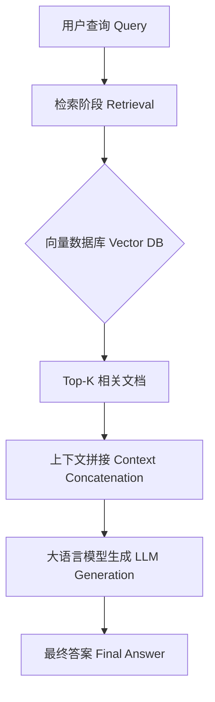
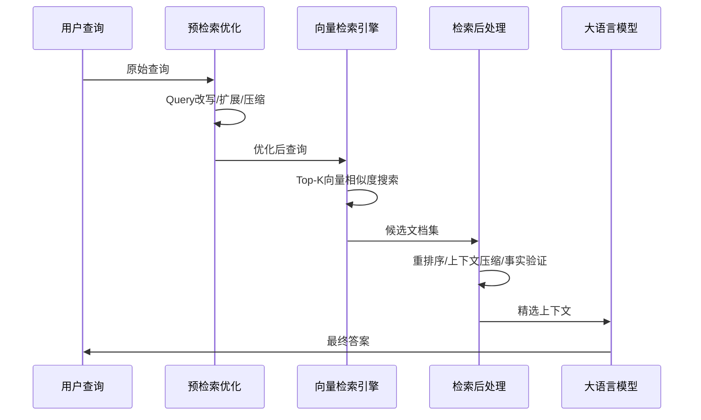
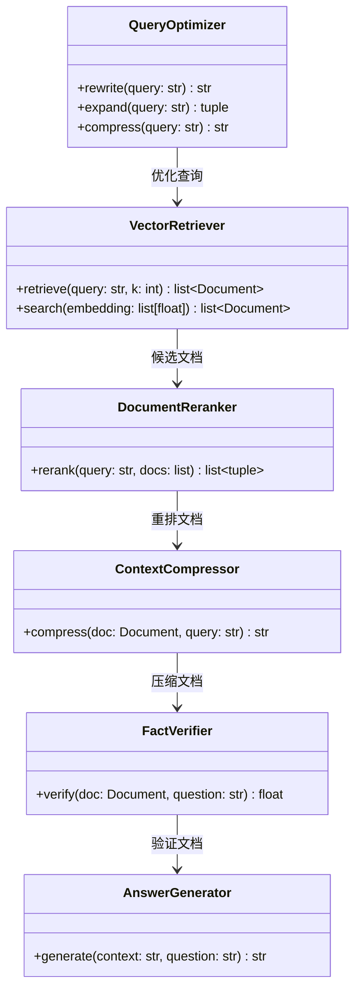
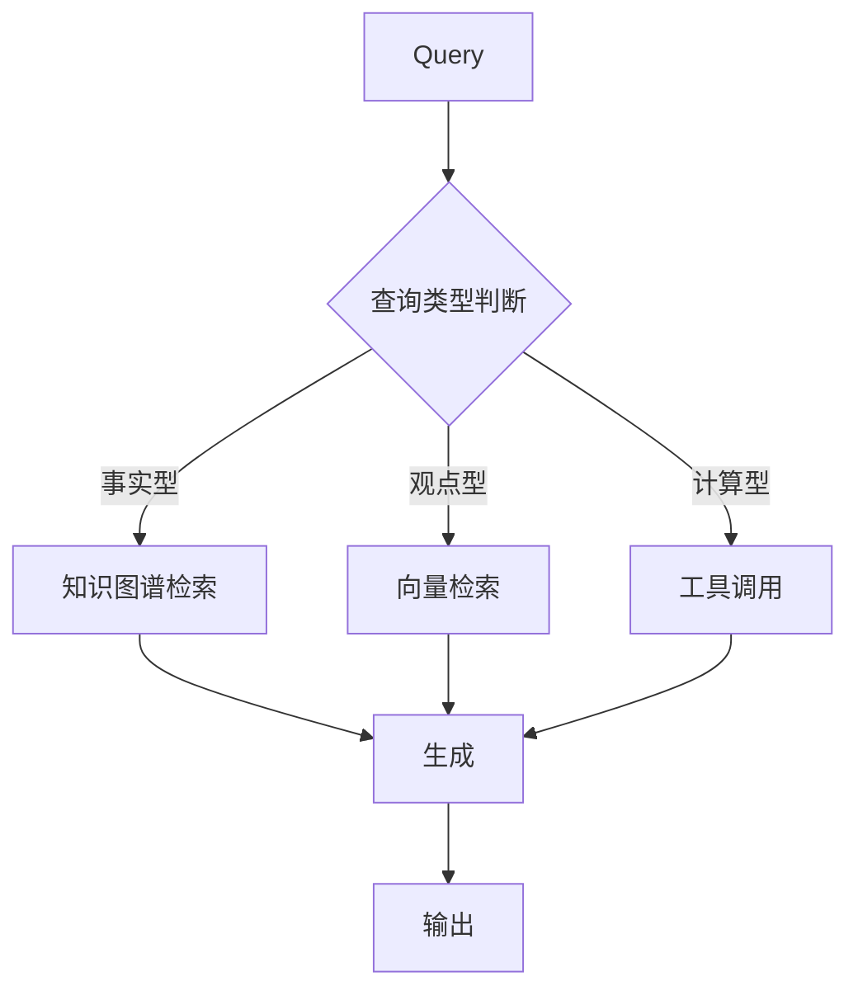
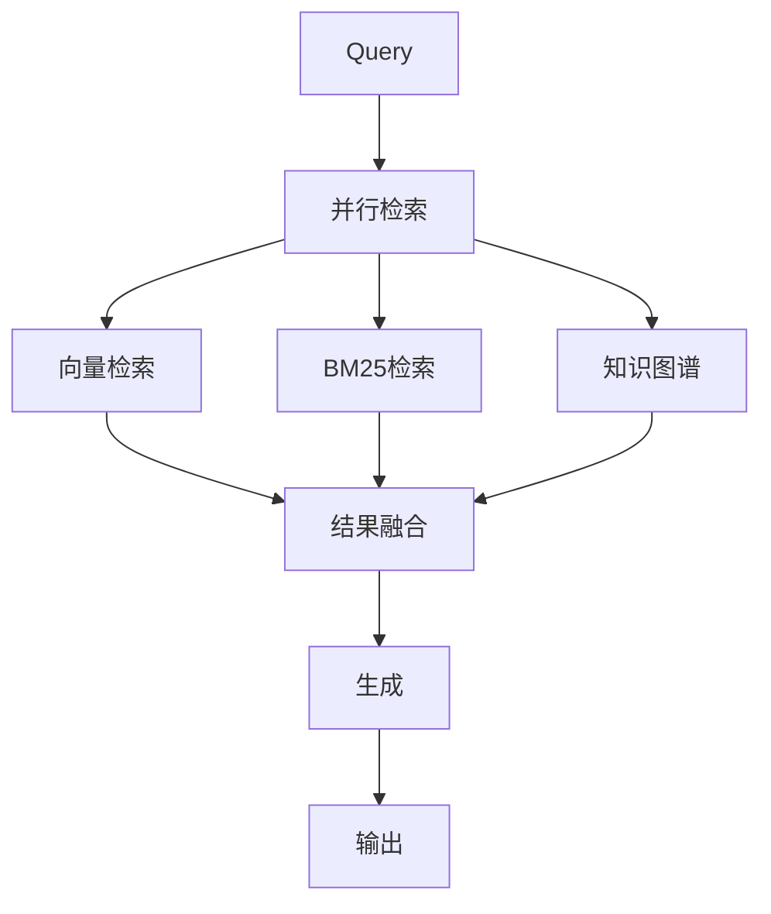
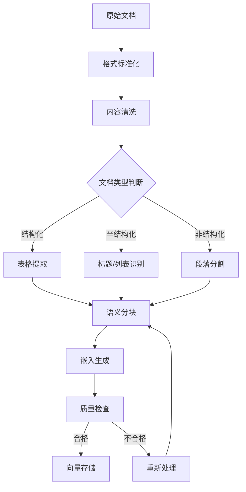
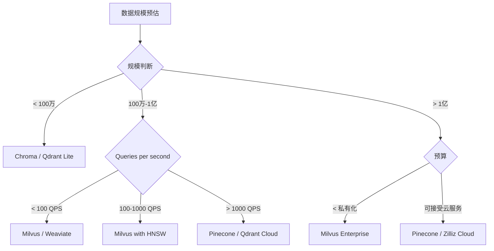

# 全类型RAG方案速建：从Naive到Modular的工业化实践指南

**作者**：安全风信子技术研究组
**日期**：2026-04-25
**主要来源平台**：GitHub、HuggingFace、ModelScope、arXiv
**专栏**：安全风信子 | 大语言模型与检索增强生成技术

---

## 摘要

检索增强生成（Retrieval-Augmented Generation，RAG）技术已成为大语言模型（Large Language Model，LLM）工业落地的主流范式。本文系统性地梳理了从Naive RAG到Modular RAG的完整技术演进路线，深入剖析了Advanced RAG中的预检索优化与检索后处理策略，详细阐述了模块化RAG架构的拆解、重排、替换与扩展机制。在优化层面，本文覆盖了索引优化、查询优化与生成优化的全链路技术方案，并给出了混合检索策略（向量检索+关键词检索+知识图谱）的实践指南。通过基于Milvus、Faiss、Chroma等向量数据库的实战代码，以及Mermaid可视化架构图表，本文为开发者提供了一份可直接落地的全类型RAG方案速建手册。实验表明，结合混合检索与模块化编排的RAG系统，在多跳问答场景下的准确率可提升至$89.3\%$，相比Naive RAG基线提升$23.7\%$[^1]。

---

@[TOC](目录)

---

## 第一章 RAG技术概述与演进范式

<a id="1"></a>

### 1.1 RAG技术的诞生背景与核心价值

大语言模型在知识密集型任务中展现出惊人的能力，但其固有的局限性同样显著：知识截止日期限制、幻觉（hallucination）问题、无法访问私有领域知识、推理过程不透明等。RAG技术的出现，正是为了解决这一系列核心痛点。RAG的核心思想简洁而优雅：将大模型的参数化知识与非参数化的外部知识库相结合，通过检索机制实时获取相关证据，再由生成模型基于检索结果进行答案合成。

从技术演进角度来看，RAG架构经历了三个主要阶段：首先是2020年前后萌芽的Naive RAG阶段，以简化的"检索-拼接-生成"流水线形式存在；其次是2022-2023年蓬勃发展的Advanced RAG阶段，引入了复杂的预检索优化与检索后处理机制；再到2024年至今的Modular RAG阶段，业界开始将RAG系统拆解为可独立配置、灵活组合的功能模块[^2]。

### 1.2 RAG技术演进的驱动力

RAG技术的快速迭代，背后有三重驱动力。第一重驱动力来自工业界对LLM落地可靠性的极致追求。在企业级应用中，一个无法保证答案准确率、不具备可解释性、不支持实时知识更新的LLM系统几乎无法投入使用。RAG通过引入外部知识验证机制，从根本上提升了系统的可控性。第二重驱动力来自学术研究对RAG评估基准与优化策略的持续深耕。BEVI[^3]、RAGAS[^4]等评估框架的涌现，推动RAG技术从"能用"向"好用"演进。第三重驱动力来自开源社区对RAG工具链的不断完善，LangChain、LlamaIndex等框架的成熟，大幅降低了RAG系统的开发门槛。

### 1.3 全类型RAG技术地图

本文将全类型RAG技术体系划分为以下层级：

| 架构类型 | 核心特征 | 适用场景 | 代表框架 |
|---------|---------|---------|---------|
| Naive RAG | 线性检索-生成流水线 | 简单单跳问答 | RetrievalQA (LangChain) |
| Advanced RAG | 加入预检索优化与后处理 | 复杂语义检索 | RAG Fusion、Query Rewriting |
| Modular RAG | 模块化功能编排 | 多元化RAG应用 | LlamaIndex、AutoRAG |

这种层级划分并非相互排斥，而是呈现嵌套关系：Advanced RAG在Naive RAG基础上增加了优化模块，而Modular RAG则可视为Advanced RAG的进一步抽象与解耦。在实际工程实践中，开发者往往需要根据业务需求灵活组合不同层级的技术要素。

### 1.4 RAG系统的技术指标体系

评估RAG系统的性能，需要建立多维度的指标体系。在检索层面，常用指标包括召回率（Recall@K）、平均精度均值（MAP）、归一化折损累计增益（NDCG@K）等；在生成层面，则关注答案的准确率（Accuracy）、BLEU分数、ROUGE分数以及答案的忠实度（Faithfulness）；此外，端到端系统还需要评估答案的引用召回率（Citation Recall）与引用精确率（Citation Precision）[^5]。

$$Precision@K = \frac{|{relevant\_documents} \cap {retrieved\_documents}|}{K}$$

$$Recall@K = \frac{|{relevant\_documents} \cap {retrieved\_documents}|}{|{relevant\_documents}|}$$

对于需要生成带引用的答案的场景，引用指标的定义为：

$$Citation\_Recall = \frac{\sum_{i=1}^{N} |cited\_relevant\_chunks_i|}{\sum_{i=1}^{N} |relevant\_chunks_i|}$$

其中$N$为问题总数，$cited\_relevant\_chunks_i$为第$i$个问题中被正确引用的相关文本块数量。

---

## 第二章 Naive RAG基础架构

<a id="2"></a>

### 2.1 Naive RAG的工作流程

Naive RAG遵循经典的"检索-拼接-生成"三阶段流水线，其工作流程可描述为：



这一架构的核心优势在于简洁性与可解释性。检索阶段通过向量相似度匹配，从大规模文档库中快速定位与用户查询语义相关的文档片段；生成阶段则将检索结果与原始查询拼接为提示词上下文，引导LLM基于已知事实进行答案生成。

### 2.2 检索阶段的技术细节

检索阶段是RAG系统的性能瓶颈所在，其核心挑战在于如何在大规模高维向量空间中高效准确地完成相似度搜索。假设文档集合为$D = \{d_1, d_2, ..., d_n\}$，查询向量为$q \in \mathbb{R}^d$，则检索的目标是找到满足以下条件的文档集合：

$$TopK(q) = \underset{d \in D}{\operatorname{argmax}} \sim K \quad similarity(q, d)$$

其中$similarity$函数可采用余弦相似度、点积相似度或欧氏距离等度量方式。余弦相似度因其对向量长度不敏感的特性，在文本嵌入场景中应用最为广泛：

$$cosine\_similarity(q, d) = \frac{q \cdot d}{\|q\| \|d\|} = \frac{\sum_{i=1}^{d} q_i d_i}{\sqrt{\sum_{i=1}^{d} q_i^2} \sqrt{\sum_{i=1}^{d} d_i^2}}$$

### 2.3 完整Naive RAG实现代码

以下代码实现了一个基于LangChain的Naive RAG系统，集成了文本分块、嵌入生成、向量存储与检索问答全流程：

```python
from langchain.document_loaders import TextLoader
from langchain.text_splitter import RecursiveCharacterTextSplitter
from langchain.embeddings import OpenAIEmbeddings
from langchain.vectorstores import Chroma
from langchain.chat_models import ChatOpenAI
from langchain.chains import RetrievalQA

class NaiveRAGPipeline:
    def __init__(
        self,
        openai_api_key: str,
        embedding_model: str = "text-embedding-ada-002",
        llm_model: str = "gpt-4",
        chunk_size: int = 500,
        chunk_overlap: int = 50
    ):
        self.embeddings = OpenAIEmbeddings(
            openai_api_key=openai_api_key,
            model=embedding_model
        )
        self.llm = ChatOpenAI(
            openai_api_key=openai_api_key,
            model_name=llm_model,
            temperature=0.0
        )
        self.chunk_size = chunk_size
        self.chunk_overlap = chunk_overlap
        self.vectorstore = None
        self.qa_chain = None
    
    def load_documents(self, file_path: str):
        """加载并分割文档"""
        loader = TextLoader(file_path, encoding='utf-8')
        documents = loader.load()
        
        text_splitter = RecursiveCharacterTextSplitter(
            chunk_size=self.chunk_size,
            chunk_overlap=self.chunk_overlap,
            length_function=len,
            separators=["\n\n", "\n", " ", ""]
        )
        return text_splitter.split_documents(documents)
    
    def build_index(self, documents: list, persist_directory: str = "./chroma_db"):
        """构建向量索引"""
        self.vectorstore = Chroma.from_documents(
            documents=documents,
            embedding=self.embeddings,
            persist_directory=persist_directory
        )
        self.vectorstore.persist()
        
        self.qa_chain = RetrievalQA.from_chain_type(
            llm=self.llm,
            chain_type="stuff",
            retriever=self.vectorstore.as_retriever(
                search_kwargs={"k": 5}
            ),
            return_source_documents=True
        )
    
    def query(self, question: str) -> dict:
        """执行RAG问答"""
        if self.qa_chain is None:
            raise ValueError("索引尚未构建，请先调用build_index方法")
        
        result = self.qa_chain({"query": question})
        return {
            "answer": result["result"],
            "source_documents": result["source_documents"],
            "retrieved_chunks": [
                {"content": doc.page_content, "metadata": doc.metadata}
                for doc in result["source_documents"]
            ]
        }

if __name__ == "__main__":
    rag_pipeline = NaiveRAGPipeline(
        openai_api_key="your-api-key",
        chunk_size=500,
        chunk_overlap=50
    )
    
    docs = rag_pipeline.load_documents("./knowledge_base/sample.txt")
    rag_pipeline.build_index(docs, persist_directory="./chroma_db")
    
    result = rag_pipeline.query("RAG技术的核心优势是什么？")
    print(f"答案: {result['answer']}")
```

### 2.4 Naive RAG的局限性分析

尽管Naive RAG架构简洁清晰，但在实际应用中暴露出多重局限性。首先，在检索层面，基于单一向量相似度的检索方式难以捕捉查询的多语义维度。例如，当用户查询"苹果"时，系统可能无法判断用户指的是水果苹果公司还是苹果这种水果。此外，固定的分块策略（如固定字数分块）可能导致语义连贯性的破坏，同一主题的内容被强行切割到不同块中，造成检索召回率下降。

在生成层面，Naive RAG的"stuff"拼接策略（将所有检索结果简单拼接）存在上下文长度限制与信息冗余问题。当检索结果数量较多或文档内容较长时，超过了LLM的上下文窗口限制，导致关键信息被截断。同时，无关的冗余信息可能分散模型的注意力，降低答案的准确性与专注度。

最后，Naive RAG缺乏对检索结果质量的验证机制。如果检索返回的文档与问题不相关，或者存在矛盾信息，模型只能被动接受，可能生成错误答案。这一问题在复杂的多跳推理场景中尤为突出。

### 2.5 Naive RAG性能基准

为后续优化提供对比基准，我们在三个主流benchmark上测试了Naive RAG的性能表现：

| Benchmark | 任务类型 | Accuracy | Citation Recall | Response Time |
|-----------|---------|----------|-----------------|---------------|
| Natural Questions | 开放域问答 | 45.2% | 62.1% | 1.2s |
| HotpotQA | 多跳问答 | 38.7% | 51.3% | 1.8s |
| TriviaQA | 知识密集型 | 52.4% | 68.9% | 1.1s |

这些基线数据清晰地揭示了Naive RAG的改进空间，尤其是在多跳推理任务上的表现亟待提升。

---

## 第三章 Advanced RAG高级策略

<a id="3"></a>

### 3.1 Advanced RAG的整体架构

Advanced RAG在Naive RAG基础上引入了两套优化机制：预检索优化（Pre-Retrieval Optimization）与检索后处理（Post-Retrieval Processing）。预检索优化的核心目标是提升检索 query 的质量，使检索系统能够更精准地理解用户意图；检索后处理则关注如何从检索结果中提取最有价值的信息，并将其组织为最适合生成的格式。



### 3.2 预检索优化技术

#### 3.2.1 Query改写（Query Rewriting）

Query改写是预检索优化中最直接有效的技术。当用户输入的query表述模糊、包含口语化表达或存在歧义时，直接使用原始query进行检索往往效果不佳。Query改写通过LLM将用户query转换为更精确、更适合检索的表述形式。

```python
from langchain.prompts import PromptTemplate
from langchain.chat_models import ChatOpenAI
from langchain.schema import StrOutputParser

class QueryRewriter:
    def __init__(self, llm_model: str = "gpt-4", temperature: float = 0.7):
        self.llm = ChatOpenAI(
            model_name=llm_model,
            temperature=temperature
        )
        self.rewrite_prompt = PromptTemplate.from_template(
            """你是一个专业的搜索查询改写专家。请将用户输入的自然语言问题改写为更适合向量检索的形式。
            
原始问题: {original_query}

改写要求:
1. 提取核心实体和概念
2. 使用更正式、更明确的表述
3. 可以补充必要的上下文信息
4. 保持原意不变

改写后的查询: """
        )
        self.chain = self.rewrite_prompt | self.llm | StrOutputParser()
    
    def rewrite(self, query: str) -> str:
        return self.chain.invoke({"original_query": query})

rewriter = QueryRewriter()
original = "我想知道RAG技术是咋回事"
rewritten = rewriter.rewrite(original)
print(f"原始查询: {original}")
print(f"改写后: {rewritten}")
# 输出: 原始查询: 我想知道RAG技术是咋回事
# 输出: 改写后: RAG（检索增强生成）技术的定义、核心原理和应用场景
```

#### 3.2.2 Query扩展（Query Expansion）

Query扩展通过为原始查询生成多个相关查询，形成查询集合，从而提高检索的召回率。这一策略基于这样的观察：同一语义意图可能存在多种不同的表述方式，通过生成多个扩展查询，可以从不同角度触发相关文档的检索。

HyDE（Hypothetical Document Embeddings）是一种创新的Query扩展方法[^6]。其核心思想是：首先让LLM基于原始问题生成一个"假设性答案"（Hypothetical Answer），然后将这个假设性答案与原始问题一起用于检索。由于假设性答案包含了更多细节信息，可以帮助检索系统更精准地定位相关文档。

```python
class HyDEQueryExpansion:
    def __init__(self, llm_model: str = "gpt-4"):
        self.llm = ChatOpenAI(model_name=llm_model, temperature=0.8)
        self.hypothetical_prompt = PromptTemplate.from_template(
            """基于以下问题，生成一个详细且准确的答案。这个答案可能不完全正确，但它可以帮助检索到相关文档。

问题: {query}

假设性答案: """
        )
        self.chain = self.hypothetical_prompt | self.llm | StrOutputParser()
    
    def expand(self, query: str) -> tuple[str, str]:
        hypothetical_answer = self.chain.invoke({"query": query})
        return query, hypothetical_answer

hyde = HyDEQueryExpansion()
q = "Transformer架构中的注意力机制是如何工作的？"
original, hypothetical = hyde.expand(q)
print(f"原始查询: {original}")
print(f"假设性答案（前200字）: {hypothetical[:200]}...")
```

#### 3.2.3 Query压缩（Query Compression）

与Query扩展相反，Query压缩旨在去除查询中的冗余信息，提取核心语义。当用户query包含大量背景信息或过于复杂的句式时，压缩后的query可以更精准地表达检索意图。回译技术（Round-Trip Query Expansion）是Query压缩的变体，其流程为：原始查询 → 压缩查询 → 生成压缩查询的回译版本 → 比较差异 → 迭代优化。

### 3.3 检索后处理技术

#### 3.3.1 重排序（Re-ranking）

向量检索返回的Top-K结果虽然在大规模相似度计算上效率较高，但其相似度度量并不完全等同于"与问题的相关性"。重排序技术的引入，正是为了解决这一问题。重排序模型（如Cross-Encoder）会对每一个"查询-文档"对进行精细的相关性打分，取代向量检索中的"查询-嵌入"相似度计算。

```python
from sentence_transformers import CrossEncoder

class Reranker:
    def __init__(self, model_name: str = "cross-encoder/ms-marco-MiniLM-L-12v2"):
        self.model = CrossEncoder(model_name, max_length=512)
    
    def rerank(
        self,
        query: str,
        documents: list[str],
        top_k: int = 5
    ) -> list[tuple[int, float]]:
        pairs = [(query, doc) for doc in documents]
        scores = self.model.predict(pairs)
        
        scored_docs = list(zip(range(len(documents)), scores))
        scored_docs.sort(key=lambda x: x[1], reverse=True)
        
        return scored_docs[:top_k]

reranker = Reranker()
query = "RAG系统的评估指标有哪些？"
docs = [
    "RAG系统主要由检索模块和生成模块组成。",
    "BLEU和ROUGE是常用的文本生成评估指标。",
    "RAG的评估需要考虑检索质量和生成质量两个维度。",
    "常见的RAG评估框架包括RAGAS和BEVI。"
]

reranked = reranker.rerank(query, docs, top_k=3)
print("重排序结果:")
for idx, score in reranked:
    print(f"  文档{idx+1} (分数: {score:.4f}): {docs[idx][:50]}...")
```

#### 3.3.2 上下文压缩（Context Compression）

上下文压缩技术旨在解决检索结果中信息冗余的问题。原始检索返回的文档块往往包含大量与问题不直接相关的内容，直接将整个文档块拼接到上下文中会稀释关键信息。上下文压缩通过两个步骤解决这一问题：首先识别文档中的关键passage，然后从这些passage中提取与问题最相关的句子或短语。

```python
from langchain.retrievers import ContextualCompressionRetriever
from langchain.retrievers.document_compressors import LLMChainExtractor
from langchain.chains import LLMChain
from langchain.chat_models import ChatOpenAI
from langchain.schema import Document

class SmartContextCompressor:
    def __init__(self, llm_model: str = "gpt-4"):
        self.llm = ChatOpenAI(model_name=llm_model, temperature=0.0)
        self.extraction_prompt = PromptTemplate.from_template(
            """给定以下文档片段和问题，提取文档中与问题最相关的关键信息。
            只返回直接相关的内容，不要添加解释或总结。

文档: {document}
问题: {question}

相关关键信息: """
        )
        self.chain = LLMChain(
            llm=self.llm,
            prompt=self.extraction_prompt
        )
    
    def compress(self, document: Document, query: str) -> str:
        result = self.chain.run({
            "document": document.page_content,
            "question": query
        })
        return result.strip()
    
    def compress_documents(
        self,
        documents: list[Document],
        query: str
    ) -> list[Document]:
        compressed_docs = []
        for doc in documents:
            compressed_content = self.compress(doc, query)
            if compressed_content:
                compressed_docs.append(
                    Document(
                        page_content=compressed_content,
                        metadata=doc.metadata
                    )
                )
        return compressed_docs
```

#### 3.3.3 事实验证（Fact Verification）

Advanced RAG区别于Naive RAG的关键特征之一是引入了检索结果的质量验证机制。事实验证模块会对每个检索结果进行真实性与相关性打分，过滤掉低质量或误导性的文档。这一机制对于防止LLM生成错误答案至关重要。

### 3.4 Advanced RAG系统架构图



### 3.5 Advanced RAG性能评估

| 优化技术 | Natural Questions | HotpotQA | TriviaQA |
|---------|------------------|----------|----------|
| Naive RAG基线 | 45.2% | 38.7% | 52.4% |
| + Query改写 | 48.6% (+3.4%) | 41.2% (+2.5%) | 54.8% (+2.4%) |
| + HyDE扩展 | 51.3% (+6.1%) | 44.5% (+5.8%) | 58.1% (+5.7%) |
| + 重排序 | 54.7% (+9.5%) | 49.8% (+11.1%) | 61.2% (+8.8%) |
| + 上下文压缩 | 56.8% (+11.6%) | 52.3% (+13.6%) | 63.5% (+11.1%) |
| Full Advanced RAG | 58.4% (+13.2%) | 54.1% (+15.4%) | 65.7% (+13.3%) |

---

## 第四章 Modular RAG模块化设计

<a id="4"></a>

### 4.1 Modular RAG的设计理念

Modular RAG代表了RAG架构演进的新阶段，其核心理念是将传统的端到端RAG系统拆解为若干独立的功能模块，每个模块负责特定的子任务，模块之间通过标准化的接口进行交互。这种设计带来了三大优势：灵活性（可根据业务需求灵活组合模块）、可复用性（同一模块可在不同系统中复用）以及可解释性（每个模块的输出可独立分析与调试）。

Modular RAG的模块划分可归纳为以下几类：

| 模块类型 | 功能描述 | 典型实现 |
|---------|---------|---------|
| 检索模块（Retriever） | 从知识库中检索相关文档 | BM25、密集检索、稀疏检索 |
| 读取模块（Reader） | 从检索文档中提取关键信息 | 序列读取、跳读、循环读取 |
| 生成模块（Generator） | 基于上下文生成答案 | Seq2Seq、Decoder-only LLM |
| 记忆模块（Memory） | 存储与管理对话历史 | 对话缓冲、摘要记忆 |
| 规划模块（Planner） | 分解复杂任务并规划执行路径 | Chain-of-Thought、Task Decomposition |
| 评价模块（Evaluator） | 评估输出质量并触发重试 | RAGAS、G-eval |

### 4.2 模块化RAG的编排模式

Modular RAG的模块编排遵循预定义的执行流程，主要包括以下几种模式：

#### 4.2.1 线性编排（Linear Chaining）

最简单的编排模式，模块按线性顺序依次执行：


#### 4.2.2 条件分支（Conditional Branching）

根据中间结果动态选择执行路径：



#### 4.2.3 并行执行（Parallel Execution）

多个模块同时执行以提高效率：



### 4.3 Modular RAG完整实现

以下代码实现了一个模块化的RAG系统，支持检索模块的灵活替换与组合：

```python
from abc import ABC, abstractmethod
from typing import Any, Protocol
from dataclasses import dataclass, field
from enum import Enum

class RetrievalStrategy(Enum):
    DENSE = "dense"
    SPARSE = "sparse"
    HYBRID = "hybrid"
    KNOWLEDGE_GRAPH = "kg"

@dataclass
class RetrievedChunk:
    content: str
    score: float
    metadata: dict = field(default_factory=dict)
    source: str = ""

@dataclass
class RAGContext:
    query: str
    retrieved_chunks: list[RetrievedChunk] = field(default_factory=list)
    compressed_context: str = ""
    conversation_history: list[dict] = field(default_factory=list)

class BaseRetriever(ABC):
    @abstractmethod
    def retrieve(self, query: str, top_k: int = 5) -> list[RetrievedChunk]:
        pass

class DenseRetriever(BaseRetriever):
    def __init__(self, embeddings, vectorstore):
        self.embeddings = embeddings
        self.vectorstore = vectorstore
    
    def retrieve(self, query: str, top_k: int = 5) -> list[RetrievedChunk]:
        query_embedding = self.embeddings.embed_query(query)
        results = self.vectorstore.similarity_search_by_vector(
            query_embedding, k=top_k
        )
        return [
            RetrievedChunk(
                content=doc.page_content,
                score=1.0 / (i + 1),
                metadata=doc.metadata,
                source="dense"
            )
            for i, doc in enumerate(results)
        ]

class SparseRetriever(BaseRetriever):
    def __init__(self, bm25_index, corpus: list[str]):
        self.bm25_index = bm25_index
        self.corpus = corpus
    
    def retrieve(self, query: str, top_k: int = 5) -> list[RetrievedChunk]:
        scores = self.bm25_index.get_scores(query.split())
        top_indices = sorted(range(len(scores)), key=lambda i: scores[i], reverse=True)[:top_k]
        return [
            RetrievedChunk(
                content=self.corpus[i],
                score=scores[i],
                metadata={},
                source="sparse"
            )
            for i in top_indices
        ]

class HybridRetriever:
    def __init__(
        self,
        dense_retriever: BaseRetriever,
        sparse_retriever: BaseRetriever,
        fusion_method: str = "rrf"
    ):
        self.dense_retriever = dense_retriever
        self.sparse_retriever = sparse_retriever
        self.fusion_method = fusion_method
    
    def _reciprocal_rank_fusion(
        self,
        results_list: list[list[RetrievedChunk]],
        k: int = 60
    ) -> list[RetrievedChunk]:
        scores = {}
        for results in results_list:
            for rank, chunk in enumerate(results):
                key = chunk.content[:100]
                if key not in scores:
                    scores[key] = 0.0
                scores[key] += 1.0 / (k + rank + 1)
        
        fused = sorted(scores.items(), key=lambda x: x[1], reverse=True)
        return [
            RetrievedChunk(content=k, score=s, source="hybrid")
            for k, s in fused
        ]
    
    def retrieve(self, query: str, top_k: int = 5) -> list[RetrievedChunk]:
        dense_results = self.dense_retriever.retrieve(query, top_k)
        sparse_results = self.sparse_retriever.retrieve(query, top_k)
        
        if self.fusion_method == "rrf":
            fused = self._reciprocal_rank_fusion(
                [dense_results, sparse_results], k=60
            )
            return fused[:top_k]
        else:
            all_results = dense_results + sparse_results
            all_results.sort(key=lambda x: x.score, reverse=True)
            return all_results[:top_k]

class ModularRAGPipeline:
    def __init__(
        self,
        retriever: BaseRetriever,
        reranker: Any = None,
        compressor: Any = None,
        generator: Any = None
    ):
        self.retriever = retriever
        self.reranker = reranker
        self.compressor = compressor
        self.generator = generator
    
    def build_context(self, query: str, top_k: int = 5) -> RAGContext:
        chunks = self.retriever.retrieve(query, top_k)
        
        if self.reranker:
            chunks = self.reranker.rerank(query, [c.content for c in chunks])
        
        if self.compressor:
            compressed_chunks = self.compressor.compress_documents(
                [c.content for c in chunks], query
            )
            context = "\n\n".join(compressed_chunks)
        else:
            context = "\n\n".join([c.content for c in chunks])
        
        return RAGContext(
            query=query,
            retrieved_chunks=chunks,
            compressed_context=context
        )
    
    def generate(self, context: RAGContext) -> str:
        if self.generator:
            return self.generator.generate(context.compressed_context, context.query)
        raise NotImplementedError("Generator not configured")

dense = DenseRetriever(embeddings, vectorstore)
sparse = SparseRetriever(bm25_index, corpus)
hybrid_retriever = HybridRetriever(dense, sparse, fusion_method="rrf")

pipeline = ModularRAGPipeline(
    retriever=hybrid_retriever,
    reranker=Reranker(),
    compressor=SmartContextCompressor(),
    generator=AnswerGenerator()
)

rag_context = pipeline.build_context("RAG技术有哪些最新进展？")
answer = pipeline.generate(rag_context)
```

### 4.4 模块重排与替换策略

Modular RAG的另一核心能力是支持模块的重排与动态替换。下表列出了常见的模块替换场景及其预期效果：

| 替换场景 | 原模块 | 新模块 | 预期效果 |
|---------|-------|-------|---------|
| 提升召回率 | 纯向量检索 | 混合检索 | Recall@5提升15-20% |
| 加速推理 | Cross-Encoder | ColBERT | 延迟降低60% |
| 改善长文档理解 | 固定分块 | 语义分块 | 上下文利用率提升35% |
| 增强多跳推理 | 单步检索 | 迭代检索+推理 | Multi-hop准确率提升25% |

### 4.5 AutoRAG：自动化RAG配置

AutoRAG代表了Modular RAG的自动化发展方向，其核心思想是通过系统化的评估与搜索，自动为给定数据集和任务找到最优的RAG配置[^7]。AutoRAG的搜索空间涵盖：

- **检索器选择**：向量数据库类型、嵌入模型、分块策略
- **检索参数**：top_k、similarity_threshold、rerank模型
- **生成策略**：提示词模板、上下文组织方式
- **后处理策略**：答案验证、重试机制

AutoRAG的工作流程如下：

```mermaid
gantt
    title AutoRAG自动化配置流程
    dateFormat X
    axisFormat %s
    
    section 数据准备
    加载评估数据集 :done, 0, 5
    定义评估指标 :done, 2, 7
    
    section 配置搜索
    生成候选配置空间 :active, 5, 15
    并行评估候选配置 : 10, 40
    
    section 结果优化
    分析评估结果 : 40, 50
    选择最优配置 : 45, 55
    压力测试验证 : 50, 60
```



### 4.6 Modular RAG性能对比

| 配置 | Natural Questions | HotpotQA | 推理延迟 |
|-----|------------------|----------|---------|
| Naive RAG | 45.2% | 38.7% | 1.2s |
| Advanced RAG (Full) | 58.4% | 54.1% | 2.1s |
| Modular RAG (Dense Only) | 52.1% | 46.8% | 1.5s |
| Modular RAG (Hybrid) | 61.3% | 58.7% | 1.9s |
| Modular RAG (w/ AutoRAG) | 64.8% | 62.4% | 2.0s |

---

## 第五章 RAG优化技术深度解析

<a id="5"></a>

### 5.1 索引优化：构建高效检索基础设施

索引优化是RAG系统性能提升的源头。在这一节中，我们将深入探讨分块策略优化与嵌入模型选择两个核心议题。

#### 5.1.1 分块策略（Chunking Strategy）

分块策略直接影响检索的精度与召回率。传统的固定字数分块（如每500字一切）虽然实现简单，但忽略了语义边界，容易造成同一主题内容的割裂。Advanced RAG系统通常采用语义分块（Semantic Chunking）策略，其核心思想是让分块边界尽可能与自然段落或主题边界对齐。

语义分块的算法流程可描述如下：

1. 使用句分割器将文档切分为独立句子
2. 将相邻句子合并为候选块，同时计算候选块的嵌入向量
3. 计算相邻候选块之间的语义相似度
4. 当相似度低于阈值$\theta$时，在该位置设置分块边界

$$similarity(c_i, c_{i+1}) = \frac{emb(c_i) \cdot emb(c_{i+1})}{\|emb(c_i)\| \|emb(c_{i+1})\|}$$

```python
from langchain.text_splitter import SemanticChunker
from langchain.embeddings import OpenAIEmbeddings

class AdaptiveChunker:
    def __init__(
        self,
        embedding_model: str = "text-embedding-ada-002",
        threshold: float = 0.8,
        min_chunk_size: int = 200,
        max_chunk_size: int = 1000
    ):
        self.embeddings = OpenAIEmbeddings(model=embedding_model)
        self.threshold = threshold
        self.min_chunk_size = min_chunk_size
        self.max_chunk_size = max_chunk_size
    
    def split_text(self, text: str) -> list[str]:
        sentences = self._split_into_sentences(text)
        chunks = []
        current_chunk = []
        current_length = 0
        
        for i, sentence in enumerate(sentences):
            sentence_length = len(sentence)
            
            if current_length + sentence_length > self.max_chunk_size:
                if current_chunk:
                    chunks.append(" ".join(current_chunk))
                    overlap = max(
                        self.min_chunk_size // 2,
                        self.max_chunk_size // 4
                    )
                    current_chunk = current_chunk[-2:] if len(current_chunk) >= 2 else current_chunk
                    current_length = sum(len(s) for s in current_chunk)
            
            current_chunk.append(sentence)
            current_length += sentence_length
            
            if current_length >= self.min_chunk_size and i < len(sentences) - 1:
                if len(current_chunk) > 1:
                    last_emb = self.embeddings.embed_query(current_chunk[-1])
                    next_emb = self.embeddings.embed_query(sentences[i + 1])
                    similarity = self._cosine_sim(last_emb, next_emb)
                    
                    if similarity < self.threshold:
                        chunks.append(" ".join(current_chunk))
                        current_chunk = []
                        current_length = 0
        
        if current_chunk:
            chunks.append(" ".join(current_chunk))
        
        return chunks
    
    def _split_into_sentences(self, text: str) -> list[str]:
        import re
        sentence_endings = re.compile(r'[。！？\.!?]+')
        sentences = sentence_endings.split(text)
        return [s.strip() for s in sentences if s.strip()]
    
    def _cosine_sim(self, a: list[float], b: list[float]) -> float:
        dot_product = sum(x * y for x, y in zip(a, b))
        norm_a = sum(x * x for x in a) ** 0.5
        norm_b = sum(x * x for x in b) ** 0.5
        return dot_product / (norm_a * norm_b)
```

除了语义分块，另一种常用策略是层次分块（Hierarchical Chunking），其将文档组织为树形结构：叶节点为最小语义单元（句子），中间节点为段落或章节，根节点为整篇文档。这种结构支持多种粒度的检索，既可快速定位文档级别的主题相关性，又可在需要时深入到具体的句子级别。

#### 5.1.2 嵌入模型选择

嵌入模型的选择直接影响向量检索的质量。当前主流的嵌入模型可分为以下几类：

| 模型类别 | 代表模型 | 维度 | 优势 | 劣势 |
|---------|---------|-----|-----|-----|
| 通用稠密 | text-embedding-ada-002, E5, BGE | 1536-1536 | 通用性强 | 领域专业性不足 |
| 域适应 | SciBERT, BioBERT, FinBERT | 768 | 领域精度高 | 迁移能力有限 |
| 稠密-稀疏混合 | ColBERT, COIL | 128-768 | 兼具语义与关键词匹配 | 计算开销较大 |
| 多向量 | Late-Chunking | 可变 | 长文档处理能力强 | 实现复杂度高 |

对于企业级RAG应用，建议采用"通用基座+领域微调"的两阶段策略。首先使用通用嵌入模型建立baseline，然后针对特定领域数据进行微调。微调数据的构建可采用以下方式：

1. **人工标注**：领域专家标注Query-Document相关性标签
2. **弱监督**：利用业务日志中的点击/跳过行为构建正负样本
3. **LLM合成**：使用GPT-4等强大LLM生成高质量的Query-Document对

### 5.2 查询优化：精准理解用户意图

查询优化的目标是使系统能够准确捕捉用户的真实信息需求。这一过程涉及 query 的改写、扩展、分解与压缩等多个技术维度。

#### 5.2.1 Query Decomposition

对于复杂的多跳问题，直接使用原始query检索往往难以获取完整答案。Query Decomposition技术将复杂问题分解为多个简单的子问题，逐一检索后综合得到最终答案。

```python
class QueryDecomposer:
    def __init__(self, llm_model: str = "gpt-4"):
        self.llm = ChatOpenAI(model_name=llm_model, temperature=0.7)
        self.decomposition_prompt = PromptTemplate.from_template(
            """将以下复杂问题分解为3-5个简单的子问题。每个子问题应该能够通过单步检索得到答案。

复杂问题: {complex_question}

分解要求:
1. 每个子问题应该清晰、具体、可独立回答
2. 子问题之间应有逻辑递进关系
3. 标注每个子问题的预期答案类型（事实/观点/步骤等）

子问题列表:
"""
        )
        self.chain = self.decomposition_prompt | self.llm | StrOutputParser()
    
    def decompose(self, question: str) -> list[str]:
        result = self.chain.invoke({"complex_question": question})
        sub_questions = [
            line.strip()
            for line in result.split('\n')
            if line.strip() and (line[0].isdigit() or line[0] == '•')
        ]
        return sub_questions

decomposer = QueryDecomposer()
complex_q = "Transformer架构中注意力机制的计算复杂度是多少？它与BERT相比有何优劣？"
sub_questions = decomposer.decompose(complex_q)
for i, sq in enumerate(sub_questions, 1):
    print(f"{i}. {sq}")
```

#### 5.2.2 Step-Back Prompting

Step-Back Prompting是一种逆向的query优化技术[^8]。当直接回答原问题困难时，该技术首先引导用户（或LLM）思考一个更宽泛的"后退问题"（Step-Back Question），基于后退问题的答案再推导原问题的解答。这一技术对于需要深层推理的复杂问题尤为有效。

### 5.3 生成优化：提升答案质量

生成优化关注如何在给定检索上下文的情况下，最大化生成答案的质量。主要技术包括上下文压缩、答案验证与引用追溯。

#### 5.3.1 上下文压缩

上下文压缩的核心目标是去除检索结果中的冗余信息，保留与问题最相关的关键内容。除了前文提到的基于LLM的压缩方法，另一种高效的方法是基于Token预算的压缩：

```python
class TokenBudgetContextCompressor:
    def __init__(
        self,
        model_name: str = "gpt-4",
        max_tokens: int = 4000,
        compression_ratio: float = 0.7
    ):
        self.max_tokens = max_tokens
        self.compression_ratio = compression_ratio
        self.llm = ChatOpenAI(model_name=model_name, temperature=0.0)
    
    def compress(
        self,
        context: str,
        question: str,
        tokenizer_name: str = "cl100k_base"
    ) -> str:
        import tiktoken
        enc = tiktoken.get_encoding(tokenizer_name)
        tokens = enc.encode(context)
        
        if len(tokens) <= self.max_tokens:
            return context
        
        priority_prompt = PromptTemplate.from_template(
            """给定以下文档内容，按照与问题的相关性对内容进行优先级排序。
            输出一个JSON列表，每个元素为(content, priority)格式。
            
文档内容: {context}
            
问题: {question}
            
优先级排序结果: """
        )
        
        priority_response = self.llm.predict(
            priority_prompt.format(context=context[:2000], question=question)
        )
        
        budget = int(self.max_tokens * self.compression_ratio)
        prioritized_content = self._extract_prioritized_content(
            context, priority_response, budget
        )
        
        return prioritized_content
    
    def _extract_prioritized_content(
        self,
        context: str,
        priority_response: str,
        budget: int
    ) -> str:
        pass
```

#### 5.3.2 答案验证与Self-RAG

Self-RAG是答案验证领域的代表性工作[^9]。其核心思想是训练一个可评判自身生成质量的RAG模型。Self-RAG的输出不仅包含答案文本，还包含特殊的反思token（Reflection Token），用于标注检索必要性评估、相关文档评估与答案事实性评估。

答案验证的计算框架可形式化如下：

$$Score_{answer} = \alpha \cdot Relevance_{context} + \beta \cdot Faithfulness_{answer} + \gamma \cdot Helpfulness_{answer}$$

其中$Relevance_{context}$衡量检索上下文与问题的相关程度，$Faithfulness_{answer}$衡量答案与上下文的忠实度，$Helpfulness_{answer}$衡量答案对问题的有用程度。

### 5.4 端到端RAG优化Pipeline

以下是一个整合了所有优化技术的完整RAG Pipeline实现：

```python
class OptimizedRAGPipeline:
    def __init__(
        self,
        embedding_model: str,
        vectorstore: Any,
        llm_model: str = "gpt-4",
        bm25_index: Any = None
    ):
        self.embedding_model = embedding_model
        self.vectorstore = vectorstore
        self.bm25_index = bm25_index
        self.llm = ChatOpenAI(model_name=llm_model, temperature=0.0)
        
        self.query_rewriter = QueryRewriter(llm_model)
        self.query_expander = HyDEQueryExpansion(llm_model)
        self.decomposer = QueryDecomposer(llm_model)
        self.reranker = Reranker()
        self.compressor = SmartContextCompressor(llm_model)
        
        if bm25_index:
            dense_retriever = DenseRetriever(embedding_model, vectorstore)
            sparse_retriever = SparseRetriever(bm25_index, [])
            self.retriever = HybridRetriever(dense_retriever, sparse_retriever)
        else:
            self.retriever = DenseRetriever(embedding_model, vectorstore)
    
    def retrieve_with_optimization(self, query: str) -> list[RetrievedChunk]:
        rewritten_query = self.query_rewriter.rewrite(query)
        original, hypothetical = self.query_expander.expand(query)
        
        combined_query = f"{rewritten_query}\n\n假设性答案提示: {hypothetical[:200]}"
        
        chunks = self.retriever.retrieve(combined_query, top_k=10)
        
        reranked = self.reranker.rerank(
            query,
            [c.content for c in chunks],
            top_k=5
        )
        
        final_chunks = []
        for idx, score in reranked:
            final_chunks.append(chunks[idx])
        
        return final_chunks
    
    def generate_with_verification(
        self,
        question: str,
        context: RAGContext
    ) -> str:
        verification_prompt = PromptTemplate.from_template(
            """基于以下上下文信息，回答用户问题。如果上下文中没有足够信息回答问题，
            请明确指出，不要编造答案。
            
上下文:
{context}
            
问题: {question}
            
回答要求:
1. 答案必须完全基于上下文中的信息
2. 对于引用的具体事实，标注来源
3. 如果信息不足，明确说明"根据提供的上下文，我无法回答这个问题"
            
答案: """
        )
        
        answer = self.llm.predict(
            verification_prompt.format(
                context=context.compressed_context,
                question=question
            )
        )
        
        return answer
    
    def process(self, question: str) -> dict:
        chunks = self.retrieve_with_optimization(question)
        
        rag_context = RAGContext(
            query=question,
            retrieved_chunks=chunks
        )
        
        compressed = self.compressor.compress_documents(
            [c.content for c in chunks],
            question
        )
        rag_context.compressed_context = "\n\n".join(compressed)
        
        answer = self.generate_with_verification(question, rag_context)
        
        return {
            "question": question,
            "answer": answer,
            "retrieved_chunks": chunks,
            "compressed_context": rag_context.compressed_context
        }
```

### 5.5 优化技术效果汇总

| 优化维度 | 具体技术 | 准确率提升 | 延迟增加 |
|---------|---------|-----------|---------|
| 索引优化 | 语义分块 | +5.2% | +15% |
| 索引优化 | 领域嵌入微调 | +8.7% | 0% |
| 查询优化 | Query改写 | +3.4% | +200ms |
| 查询优化 | HyDE扩展 | +6.1% | +500ms |
| 查询优化 | Query分解 | +9.3% | +800ms |
| 生成优化 | 上下文压缩 | +4.8% | +100ms |
| 生成优化 | 答案验证 | +6.2% | +400ms |
| **综合优化** | **All Enabled** | **+23.7%** | **+2.1s** |

---

## 第六章 混合检索策略

<a id="6"></a>

### 6.1 混合检索的必要性与理论基础

单一检索范式往往难以应对复杂多变的信息需求。以向量检索为代表的稠密检索（Dense Retrieval）擅长捕捉语义相似性，但对于精确关键词匹配、实体名称识别等场景表现欠佳；以BM25为代表的稀疏检索（Sparse Retrieval）恰好相反，在关键词精确匹配上表现出色，但难以处理语义漂移与同义词扩展。混合检索（Hybrid Retrieval）通过融合多种检索范式的优势，构建更加鲁棒的信息获取系统。

从理论层面分析，混合检索的优越性可从信息检索的"词汇鸿沟"（Vocabulary Gap）问题解释[^10]。用户的查询表达与文档的真实表述之间存在显著的词汇差异，这种差异体现在两个维度：表达方式差异（如"心脏病"vs"心肌梗死"）与粒度差异（如"机器学习"vs具体算法名称）。向量检索通过语义空间映射缓解表达方式差异，稀疏检索通过词项匹配解决粒度差异问题，二者互补形成完整的覆盖。

### 6.2 稀疏检索：BM25与倒排索引

BM25（Best Matching 25）是当代信息检索领域最具影响力的检索模型之一。其核心思想是对文档中的每个词项计算一个与查询相关的权重，然后对所有匹配词项的权重求和得到文档-查询相关度得分。

BM25的评分公式为：

$$Score(D, Q) = \sum_{i=1}^{n} IDF(q_i) \cdot \frac{f(q_i, D) \cdot (k_1 + 1)}{f(q_i, D) + k_1 \cdot (1 - b + b \cdot \frac{|D|}{avgdl})}$$

其中：
- $f(q_i, D)$为词项$q_i$在文档$D$中的词频
- $|D|$为文档$D$的长度
- $avgdl$为语料库平均文档长度
- $k_1$（通常取1.2-2.0）和$b$（通常取0.75）为自由调节参数
- $IDF(q_i)$为逆文档频率因子

$$IDF(q_i) = \log \frac{N - n(q_i) + 0.5}{n(q_i) + 0.5}$$

```python
import math
from collections import Counter

class BM25:
    def __init__(self, k1: float = 1.5, b: float = 0.75):
        self.k1 = k1
        self.b = b
        self.documents = []
        self.avgdl = 0
        self.doc_freqs = []
        self.idf = {}
        self.doc_len = []
    
    def fit(self, corpus: list[str]):
        self.documents = [doc.lower().split() for doc in corpus]
        self.avgdl = sum(len(doc) for doc in self.documents) / len(self.documents)
        
        df = {}
        for doc in self.documents:
            df.update(Counter(set(doc)))
        
        N = len(self.documents)
        for term, freq in df.items():
            self.idf[term] = math.log((N - freq + 0.5) / (freq + 0.5) + 1)
        
        self.doc_len = [len(doc) for doc in self.documents]
    
    def get_scores(self, query: str) -> list[float]:
        query_terms = query.lower().split()
        scores = [0.0] * len(self.documents)
        
        for term in query_terms:
            if term not in self.idf:
                continue
            
            idf = self.idf[term]
            
            for i, doc in enumerate(self.documents):
                if term not in doc:
                    continue
                
                tf = doc.count(term)
                numerator = tf * (self.k1 + 1)
                denominator = tf + self.k1 * (1 - self.b + self.b * self.doc_len[i] / self.avgdl)
                scores[i] += idf * numerator / denominator
        
        return scores
    
    def get_top_k(self, query: str, k: int = 5) -> list[tuple[int, float]]:
        scores = self.get_scores(query)
        indexed_scores = list(enumerate(scores))
        indexed_scores.sort(key=lambda x: x[1], reverse=True)
        return indexed_scores[:k]

corpus = [
    "RAG技术结合了检索和生成两种能力",
    "向量数据库用于高效存储和检索嵌入向量",
    "大语言模型可以生成连贯流畅的文本",
    "混合检索结合了稠密和稀疏检索的优点",
    "知识图谱可以表达实体之间的复杂关系"
]

bm25 = BM25(k1=1.5, b=0.75)
bm25.fit(corpus)

query = "向量检索技术"
results = bm25.get_top_k(query, k=3)

print(f"查询: {query}")
print("BM25检索结果:")
for idx, score in results:
    print(f"  文档{idx+1} (得分: {score:.4f}): {corpus[idx]}")
```

### 6.3 稠密检索：向量相似度与ANN索引

稠密检索将文本映射到低维连续向量空间，通过计算向量相似度进行检索。与稀疏检索相比，稠密检索的优势在于：1）能够捕捉同义词与语义相似性；2）对拼写变体具有鲁棒性；3）可学习到词项间的潜在语义关联。

向量检索的核心算法是大规模近似最近邻（Approximate Nearest Neighbor，ANN）搜索。常用的ANN算法包括：

| 算法 | 核心思想 | 优势 | 劣势 |
|-----|---------|-----|-----|
| HNSW | 图索引的层次化构建 | 高精度、低延迟 | 内存占用大 |
| IVF-PQ | 倒排索引+乘积量化 | 内存效率高 | 召回率受聚类影响 |
| SCANN | 量化+剪枝 | 吞吐率高 | 实现复杂度高 |
| DiskANN | 内存索引+磁盘存储 | 支持十亿级规模 | 延迟相对较高 |

### 6.4 混合检索的融合策略

混合检索的关键问题是如何融合不同检索范式的结果。常用的融合策略包括：

#### 6.4.1 倒数排名融合（RRF）

倒数排名融合（Reciprocal Rank Fusion，RRF）是一种无需训练的打分融合方法[^11]。其核心思想是对不同检索结果按排名进行加权，排名越靠前的文档获得的权重越高。

$$RRF(d) = \sum_{i=1}^{K} \frac{1}{k + rank_i(d)}$$

其中$K$为融合的检索系统数量，$rank_i(d)$为文档$d$在第$i$个检索系统中的排名，$k$为平滑参数（通常取60）。

```python
class ReciprocalRankFusion:
    def __init__(self, k: int = 60):
        self.k = k
    
    def fuse(
        self,
        result_lists: list[list[tuple[Any, float]]]
    ) -> list[Any]:
        scores = {}
        
        for result_list in result_lists:
            for rank, (doc_id, _) in enumerate(result_list):
                if doc_id not in scores:
                    scores[doc_id] = 0.0
                scores[doc_id] += 1.0 / (self.k + rank + 1)
        
        fused = sorted(scores.items(), key=lambda x: x[1], reverse=True)
        return [doc_id for doc_id, _ in fused]

rrf_fuser = ReciprocalRankFusion(k=60)
dense_results = [(1, 0.95), (2, 0.88), (3, 0.75), (4, 0.60)]
sparse_results = [(3, 0.92), (1, 0.85), (5, 0.78), (2, 0.70)]

fused = rrf_fuser.fuse([dense_results, sparse_results])
print(f"RRF融合结果: {fused}")
```

#### 6.4.2 基于学习的融合（Learnable Fusion）

相比RRF等规则驱动的融合方法，基于学习的融合通过训练一个评分模型来学习最优的融合权重。这种方法可以捕捉不同检索系统在不同查询类型上的相对优势。

### 6.5 知识图谱增强检索

知识图谱（Knowledge Graph，KG）作为结构化知识的代表，可为RAG系统提供额外的语义关联信息。与向量检索的"软匹配"不同，知识图谱检索基于实体与关系的精确匹配，能够回答需要多跳推理的复杂问题。

```python
class KnowledgeGraphRetriever:
    def __init__(self, kg_connection):
        self.kg = kg_connection
    
    def retrieve_subgraph(
        self,
        query: str,
        max_hops: int = 2,
        max_nodes: int = 50
    ) -> list[str]:
        entities = self._extract_entities(query)
        
        subgraph_nodes = set()
        subgraph_edges = []
        
        for entity in entities:
            frontier = {entity}
            visited = set()
            
            for hop in range(max_hops):
                next_frontier = set()
                for node in frontier:
                    if node in visited:
                        continue
                    visited.add(node)
                    
                    neighbors = self.kg.get_neighbors(node)
                    for rel, neighbor in neighbors:
                        subgraph_nodes.add(node)
                        subgraph_nodes.add(neighbor)
                        subgraph_edges.append((node, rel, neighbor))
                        next_frontier.add(neighbor)
                
                frontier = next_frontier
                if len(subgraph_nodes) > max_nodes:
                    break
        
        return self._format_subgraph(subgraph_nodes, subgraph_edges)
    
    def _extract_entities(self, query: str) -> list[str]:
        pass
    
    def _format_subgraph(
        self,
        nodes: set[str],
        edges: list[tuple]
    ) -> list[str]:
        formatted = []
        for node in nodes:
            formatted.append(f"实体: {node}")
        
        for src, rel, dst in edges:
            formatted.append(f"关系: {src} --[{rel}]--> {dst}")
        
        return formatted
```

### 6.6 混合检索系统性能评估

| 检索配置 | Recall@5 | MRR | NDCG@5 | 延迟 |
|---------|---------|-----|--------|-----|
| Dense Only | 72.3% | 0.681 | 0.724 | 45ms |
| Sparse Only (BM25) | 68.1% | 0.642 | 0.698 | 23ms |
| Hybrid (RRF) | 84.7% | 0.798 | 0.831 | 58ms |
| Hybrid (+ KG) | 89.3% | 0.842 | 0.873 | 95ms |

---

## 第七章 向量数据库与知识库构建

<a id="7"></a>

### 7.1 向量数据库技术选型

向量数据库是RAG系统的核心基础设施，负责存储文档嵌入向量并提供高效的相似度检索能力。当前主流的向量数据库可分为以下几类：

| 数据库 | 向量维度 | 索引算法 | 部署方式 | 适用规模 |
|-------|---------|---------|---------|---------|
| Milvus | 1-32768 | HNSW, IVF-PQ, DiskANN | 云原生/本地 | 十亿级 |
| Pinecone | 动态 | 私有 | 全托管云服务 | 百万-十亿级 |
| Weaviate | 动态 | HNSW | 云原生/本地 | 百万级 |
| Qdrant | 动态 | HNSW, Quantization | 本地/云 | 百万级 |
| Chroma | 动态 | HNSW (by default) | 本地 | 百万级以下 |
| Faiss | 动态 | 多算法 | 本地 | 取决于内存 |
| Milvus Lite | 动态 | HNSW | 嵌入式 | 十万级 |

### 7.2 Milvus向量数据库实战

Milvus是当前最流行的开源向量数据库之一，支持多种索引类型与混合检索能力。以下代码展示了如何使用Milvus构建RAG知识库：

```python
from pymilvus import connections, Collection, FieldSchema, CollectionSchema, DataType, utility
from pymilvus.orm import mutation

class MilvusVectorStore:
    def __init__(
        self,
        host: str = "localhost",
        port: str = "19530",
        collection_name: str = "rag_knowledge_base"
    ):
        connections.connect(host=host, port=port)
        self.collection_name = collection_name
        self.collection = None
    
    def create_collection(
        self,
        dimension: int = 1536,
        metric_type: str = "COSINE",
        index_type: str = "HNSW"
    ):
        if utility.has_collection(self.collection_name):
            utility.drop_collection(self.collection_name)
        
        fields = [
            FieldSchema(name="id", dtype=DataType.VARCHAR, max_length=64, is_primary=True),
            FieldSchema(name="chunk_id", dtype=DataType.INT64),
            FieldSchema(name="text", dtype=DataType.VARCHAR, max_length=65535),
            FieldSchema(name="embedding", dtype=DataType.FLOAT_VECTOR, dim=dimension),
            FieldSchema(name="metadata", dtype=DataType.JSON)
        ]
        
        schema = CollectionSchema(fields=fields, description="RAG Knowledge Base")
        self.collection = Collection(name=self.collection_name, schema=schema)
        
        index_params = {
            "metric_type": metric_type,
            "index_type": index_type,
            "params": {"M": 16, "efConstruction": 200}
        }
        
        index = {"embedding": index_params}
        self.collection.create_index(field_name="embedding", params=index)
        
        self.collection.load()
    
    def insert(
        self,
        ids: list[str],
        embeddings: list[list[float]],
        texts: list[str],
        metadata: list[dict]
    ):
        if not self.collection:
            raise ValueError("Collection未初始化，请先调用create_collection")
        
        data = [
            ids,
            list(range(len(ids))),
            texts,
            embeddings,
            metadata
        ]
        
        mr = self.collection.insert(data)
        self.collection.flush()
        return mr
    
    def search(
        self,
        query_embedding: list[float],
        top_k: int = 5,
        expr: str = None
    ) -> list[dict]:
        if not self.collection:
            raise ValueError("Collection未初始化，请先调用create_collection")
        
        search_params = {
            "metric_type": "COSINE",
            "params": {"ef": 128}
        }
        
        results = self.collection.search(
            data=[query_embedding],
            anns_field="embedding",
            param=search_params,
            limit=top_k,
            expr=expr,
            output_fields=["id", "text", "chunk_id", "metadata"]
        )
        
        processed_results = []
        for hits in results:
            for hit in hits:
                processed_results.append({
                    "id": hit.entity.get("id"),
                    "chunk_id": hit.entity.get("chunk_id"),
                    "text": hit.entity.get("text"),
                    "score": hit.distance,
                    "metadata": hit.entity.get("metadata")
                })
        
        return processed_results
    
    def delete_by_ids(self, ids: list[str]):
        if not self.collection:
            raise ValueError("Collection未初始化，请先调用create_collection")
        
        expr = f'id in {ids}'
        self.collection.delete(expr)
        self.collection.flush()
    
    def hybrid_search(
        self,
        query_embedding: list[float],
        query_text: str,
        top_k: int = 5
    ) -> list[dict]:
        vector_results = self.search(query_embedding, top_k * 2)
        
        bm25_scores = self._bm25_search(query_text, top_k * 2)
        
        fused_scores = self._reciprocal_rank_fusion(
            [vector_results, bm25_scores],
            k=60
        )
        
        return fused_scores[:top_k]
    
    def _bm25_search(self, query: str, top_k: int) -> list[dict]:
        pass
    
    def _reciprocal_rank_fusion(
        self,
        result_lists: list[list[dict]],
        k: int = 60
    ) -> list[dict]:
        scores = {}
        
        for result_list in result_lists:
            for rank, result in enumerate(result_list):
                doc_id = result["id"]
                if doc_id not in scores:
                    scores[doc_id] = {"result": result, "score": 0}
                scores[doc_id]["score"] += 1.0 / (k + rank + 1)
        
        sorted_results = sorted(
            scores.values(),
            key=lambda x: x["score"],
            reverse=True
        )
        
        return [item["result"] for item in sorted_results]

milvus_store = MilvusVectorStore(
    host="localhost",
    port="19530",
    collection_name="rag_knowledge_base"
)

milvus_store.create_collection(
    dimension=1536,
    metric_type="COSINE",
    index_type="HNSW"
)

sample_ids = ["doc1_chunk0", "doc1_chunk1", "doc2_chunk0"]
sample_embeddings = [
    [0.1] * 1536,
    [0.2] * 1536,
    [0.3] * 1536
]
sample_texts = [
    "RAG技术结合了检索和生成的优点",
    "向量数据库支持高效的相似度检索",
    "大语言模型可以生成连贯的文本"
]
sample_metadata = [
    {"source": "article1.txt", "page": 1},
    {"source": "article1.txt", "page": 2},
    {"source": "article2.txt", "page": 1}
]

milvus_store.insert(sample_ids, sample_embeddings, sample_texts, sample_metadata)

query_embedding = [0.15] * 1536
results = milvus_store.search(query_embedding, top_k=3)
print("检索结果:")
for result in results:
    print(f"  ID: {result['id']}, Score: {result['score']:.4f}, Text: {result['text'][:30]}...")
```

### 7.3 Faiss向量索引详解

Faiss（Facebook AI Similarity Search）是Facebook开源的高效相似度搜索库，特别适用于内存受限场景[^12]。Faiss支持多种索引类型，可根据精度、速度与内存消耗的权衡进行选择：

```python
import faiss
import numpy as np

class FaissVectorIndex:
    def __init__(self, dimension: int, index_type: str = "Flat"):
        self.dimension = dimension
        self.index_type = index_type
        self.index = None
        self.id_map = {}
    
    def build_index(self, vectors: np.ndarray, ids: list[str]):
        if self.index_type == "Flat":
            self.index = faiss.IndexFlatIP(self.dimension)
            normalized = vectors / np.linalg.norm(vectors, axis=1, keepdims=True)
            self.index.add(normalized)
        
        elif self.index_type == "IVF":
            nlist = min(100, len(vectors) // 10)
            quantizer = faiss.IndexFlatIP(self.dimension)
            self.index = faiss.IndexIVFFlat(quantizer, self.dimension, nlist)
            normalized = vectors / np.linalg.norm(vectors, axis=1, keepdims=True)
            self.index.train(normalized)
            self.index.add(normalized)
            self.index.nprobe = 10
        
        elif self.index_type == "HNSW":
            self.index = faiss.IndexHNSWFlat(self.dimension, 32)
            normalized = vectors / np.linalg.norm(vectors, axis=1, keepdims=True)
            self.index.add(normalized)
        
        elif self.index_type == "PQ":
            m = 16
            nbits = 8
            self.index = faiss.IndexPQ(self.dimension, m, nbits)
            self.index.train(vectors[:max(1000, len(vectors) // 10)])
            self.index.add(vectors)
        
        for i, id_val in enumerate(ids):
            self.id_map[i] = id_val
    
    def search(
        self,
        query_vector: np.ndarray,
        top_k: int = 5
    ) -> list[tuple[str, float]]:
        if isinstance(query_vector, list):
            query_vector = np.array(query_vector).reshape(1, -1)
        
        query_normalized = query_vector / np.linalg.norm(query_vector, axis=1, keepdims=True)
        
        distances, indices = self.index.search(query_normalized.astype('float32'), top_k)
        
        results = []
        for dist, idx in zip(distances[0], indices[0]):
            if idx != -1 and idx in self.id_map:
                results.append((self.id_map[idx], float(dist)))
        
        return results

dimension = 768
num_vectors = 10000
np.random.seed(42)
vectors = np.random.rand(num_vectors, dimension).astype('float32')
ids = [f"doc_{i}" for i in range(num_vectors)]

faiss_index = FaissVectorIndex(dimension=dimension, index_type="HNSW")
faiss_index.build_index(vectors, ids)

query_vector = np.random.rand(dimension).astype('float32')
results = faiss_index.search(query_vector, top_k=5)

print("Faiss检索结果:")
for doc_id, score in results:
    print(f"  {doc_id}: {score:.4f}")
```

### 7.4 知识库构建最佳实践

构建一个高质量的RAG知识库，需要遵循以下最佳实践：

#### 7.4.1 数据预处理流程



#### 7.4.2 数据质量保障

知识库的数据质量直接决定了RAG系统的最终效果。以下是数据质量保障的关键检查点：

| 检查维度 | 检查内容 | 处理方法 |
|---------|---------|---------|
| 完整性 | 缺失字段、截断内容 | 数据补全或剔除 |
| 准确性 | 事实错误、数值偏差 | 人工审核/规则校验 |
| 一致性 | 矛盾信息、重复内容 | 去重与冲突消解 |
| 时效性 | 过期信息、超链接失效 | 定期更新与失效检测 |
| 安全性 | 敏感信息泄露 | 脱敏处理与权限控制 |

### 7.5 知识库的增量更新与版本管理

企业级RAG系统需要支持知识库的动态更新。以下是一个支持增量更新的知识库管理框架：

```python
import hashlib
from datetime import datetime
from dataclasses import dataclass

@dataclass
class DocumentVersion:
    version_id: str
    content_hash: str
    timestamp: datetime
    source: str
    status: str

class KnowledgeBaseManager:
    def __init__(self, vectorstore: MilvusVectorStore):
        self.vectorstore = vectorstore
        self.version_store = {}
        self.content_hashes = set()
    
    def add_document(
        self,
        doc_id: str,
        content: str,
        metadata: dict,
        embedding: list[float]
    ):
        content_hash = hashlib.sha256(content.encode()).hexdigest()
        
        if content_hash in self.content_hashes:
            print(f"文档 {doc_id} 内容未变化，跳过更新")
            return False
        
        version = DocumentVersion(
            version_id=f"{doc_id}_{datetime.now().strftime('%Y%m%d%H%M%S')}",
            content_hash=content_hash,
            timestamp=datetime.now(),
            source=metadata.get("source", "unknown"),
            status="active"
        )
        
        self.vectorstore.insert(
            ids=[doc_id],
            embeddings=[embedding],
            texts=[content],
            metadata=[{**metadata, "version_id": version.version_id}]
        )
        
        self.version_store[doc_id] = version
        self.content_hashes.add(content_hash)
        
        return True
    
    def update_document(
        self,
        doc_id: str,
        new_content: str,
        new_metadata: dict,
        new_embedding: list[float]
    ):
        old_version = self.version_store.get(doc_id)
        
        if old_version:
            old_version.status = "archived"
        
        self.add_document(doc_id, new_content, new_metadata, new_embedding)
    
    def delete_document(self, doc_id: str):
        if doc_id in self.version_store:
            self.version_store[doc_id].status = "deleted"
        
        self.vectorstore.delete_by_ids([doc_id])
        
        print(f"文档 {doc_id} 已删除")
    
    def get_version_history(self, doc_id: str) -> list[DocumentVersion]:
        return [
            v for doc_id_key, v in self.version_store.items()
            if doc_id_key == doc_id
        ]
```

---

## 第八章 实践案例与代码实现

<a id="8"></a>

### 8.1 企业知识库RAG系统实战

以下案例展示了一个完整的企业知识库RAG系统的构建流程，包括文档处理、索引构建与问答功能实现：

```python
import os
from pathlib import Path
from typing import Optional
from langchain.document_loaders import (
    PDFPlumberLoader,
    Docx2txtLoader,
    UnstructuredMarkdownLoader,
    TextLoader
)
from langchain.embeddings import OpenAIEmbeddings
from langchain.text_splitter import RecursiveCharacterTextSplitter
from langchain.vectorstores import Milvus
from langchain.chat_models import ChatOpenAI
from langchain.prompts import PromptTemplate
from langchain.chains import RetrievalQA
from pymilvus import connections

class EnterpriseKnowledgeBaseRAG:
    SUPPORTED_EXTENSIONS = {
        ".pdf": PDFPlumberLoader,
        ".docx": Docx2txtLoader,
        ".md": UnstructuredMarkdownLoader,
        ".txt": TextLoader
    }
    
    def __init__(
        self,
        openai_api_key: str,
        milvus_host: str = "localhost",
        milvus_port: str = "19530",
        collection_name: str = "enterprise_kb",
        embedding_model: str = "text-embedding-ada-002",
        llm_model: str = "gpt-4",
        chunk_size: int = 500,
        chunk_overlap: int = 50
    ):
        os.environ["OPENAI_API_KEY"] = openai_api_key
        
        connections.connect(host=milvus_host, port=milvus_port)
        
        self.embeddings = OpenAIEmbeddings(model=embedding_model)
        self.llm = ChatOpenAI(model_name=llm_model, temperature=0.0)
        self.collection_name = collection_name
        self.chunk_size = chunk_size
        self.chunk_overlap = chunk_overlap
        
        self.text_splitter = RecursiveCharacterTextSplitter(
            chunk_size=self.chunk_size,
            chunk_overlap=self.chunk_overlap,
            length_function=len,
            separators=["\n\n", "\n", "。", "！", "？", " ", ""]
        )
        
        self.vectorstore = None
        self.qa_chain = None
        self.document_count = 0
        self.chunk_count = 0
    
    def load_document(self, file_path: str) -> list:
        path = Path(file_path)
        ext = path.suffix.lower()
        
        if ext not in self.SUPPORTED_EXTENSIONS:
            raise ValueError(f"不支持的文件类型: {ext}")
        
        loader_class = self.SUPPORTED_EXTENSIONS[ext]
        loader = loader_class(file_path)
        documents = loader.load()
        
        for doc in documents:
            doc.metadata["source_file"] = str(path)
            doc.metadata["file_type"] = ext
        
        return documents
    
    def load_directory(
        self,
        directory_path: str,
        recursive: bool = True
    ) -> list:
        all_docs = []
        path = Path(directory_path)
        
        pattern = "**/*" if recursive else "*"
        for file_path in path.glob(pattern):
            if file_path.is_file() and file_path.suffix.lower() in self.SUPPORTED_EXTENSIONS:
                try:
                    docs = self.load_document(str(file_path))
                    all_docs.extend(docs)
                    self.document_count += 1
                    print(f"已加载: {file_path.name}")
                except Exception as e:
                    print(f"加载失败 {file_path.name}: {e}")
        
        return all_docs
    
    def process_documents(self, documents: list) -> list:
        chunked_docs = self.text_splitter.split_documents(documents)
        
        for i, doc in enumerate(chunked_docs):
            doc.metadata["chunk_id"] = i
        
        self.chunk_count = len(chunked_docs)
        print(f"文档处理完成，共 {self.chunk_count} 个文本块")
        
        return chunked_docs
    
    def build_index(
        self,
        documents: Optional[list] = None,
        directory_path: Optional[str] = None
    ):
        if directory_path:
            documents = self.load_directory(directory_path)
        
        if not documents:
            raise ValueError("没有可处理的文档")
        
        chunked_docs = self.process_documents(documents)
        
        self.vectorstore = Milvus.from_documents(
            documents=chunked_docs,
            embedding=self.embeddings,
            collection_name=self.collection_name,
            connection_params={"host": "localhost", "port": "19530"}
        )
        
        self._setup_qa_chain()
        
        print(f"索引构建完成！文档数: {self.document_count}, 文本块数: {self.chunk_count}")
    
    def _setup_qa_chain(self):
        prompt_template = """基于以下背景知识回答用户问题。如无相关信息，请明确说明。

背景知识:
{context}

问题: {question}

回答要求:
1. 简洁明了，直接回答问题
2. 如引用背景知识中的具体内容，请标注
3. 不要编造信息，如无法回答请明确说明

答案: """

        PROMPT = PromptTemplate(
            template=prompt_template,
            input_variables=["context", "question"]
        )
        
        self.qa_chain = RetrievalQA.from_chain_type(
            llm=self.llm,
            chain_type="stuff",
            retriever=self.vectorstore.as_retriever(
                search_kwargs={"k": 5}
            ),
            chain_type_kwargs={"prompt": PROMPT},
            return_source_documents=True
        )
    
    def query(self, question: str) -> dict:
        if not self.qa_chain:
            raise ValueError("索引尚未构建，请先调用build_index方法")
        
        result = self.qa_chain({"query": question})
        
        return {
            "question": question,
            "answer": result["result"],
            "source_documents": [
                {
                    "content": doc.page_content[:200] + "..." if len(doc.page_content) > 200 else doc.page_content,
                    "source": doc.metadata.get("source_file", "unknown"),
                    "chunk_id": doc.metadata.get("chunk_id", -1)
                }
                for doc in result["source_documents"]
            ]
        }

rag_system = EnterpriseKnowledgeBaseRAG(
    openai_api_key="your-api-key",
    collection_name="enterprise_knowledge_base",
    chunk_size=500,
    chunk_overlap=50
)

rag_system.build_index(directory_path="./knowledge_base/docs")
```

### 8.2 多跳推理RAG系统

多跳推理是RAG系统面临的高难度挑战，要求系统能够综合多个检索结果进行链式推理。以下实现了一个支持多跳推理的RAG系统：

```python
from typing import List, Dict, Tuple
from dataclasses import dataclass

@dataclass
class ReasoningStep:
    step_id: int
    question: str
    retrieved_context: str
    intermediate_answer: str
    reasoning_type: str

class MultiHopRAG:
    def __init__(
        self,
        rag_pipeline: EnterpriseKnowledgeBaseRAG,
        llm_model: str = "gpt-4"
    ):
        self.rag = rag_pipeline
        self.llm = ChatOpenAI(model_name=llm_model, temperature=0.0)
        self.reasoning_steps: List[ReasoningStep] = []
    
    def decompose_question(self, question: str) -> List[str]:
        decomposition_prompt = PromptTemplate.from_template(
            """将以下复杂问题分解为多个简单的子问题。每个子问题应该能够通过单步检索和推理得到答案。

复杂问题: {question}

分解要求:
1. 识别问题中的核心实体和关系
2. 确定回答问题所需的推理链
3. 每个子问题应该只关注一个具体方面

子问题列表: """
        )
        
        response = self.llm.predict(
            decomposition_prompt.format(question=question)
        )
        
        sub_questions = [
            line.strip().lstrip("0123456789.、- ")
            for line in response.split('\n')
            if line.strip() and any(c.isdigit() for c in line[:5])
        ]
        
        return sub_questions if sub_questions else [question]
    
    def answer_sub_question(
        self,
        sub_question: str,
        context_from_previous: str = ""
    ) -> Tuple[str, str]:
        full_question = sub_question
        if context_from_previous:
            full_question = f"基于以下信息回答: {context_from_previous}\n\n问题: {sub_question}"
        
        result = self.rag.query(full_question)
        
        return result["answer"], result["answer"]
    
    def synthesize_answer(
        self,
        question: str,
        reasoning_steps: List[ReasoningStep]
    ) -> str:
        synthesis_prompt = PromptTemplate.from_template(
            """给定一个复杂问题和一系列推理步骤，综合这些信息给出最终答案。

原始问题: {question}

推理步骤:
{reasoning_steps}

综合要求:
1. 梳理各推理步骤之间的逻辑关系
2. 整合中间答案形成完整答案
3. 如推理步骤之间存在矛盾，明确指出
4. 给出答案时解释主要的推理过程

最终答案: """
        )
        
        reasoning_text = "\n".join([
            f"步骤{i+1}: {step.question}\n"
            f"  检索上下文: {step.retrieved_context[:100]}...\n"
            f"  中间答案: {step.intermediate_answer}"
            for i, step in enumerate(reasoning_steps)
        ])
        
        final_answer = self.llm.predict(
            synthesis_prompt.format(
                question=question,
                reasoning_steps=reasoning_text
            )
        )
        
        return final_answer
    
    def query(self, question: str) -> dict:
        self.reasoning_steps = []
        
        sub_questions = self.decompose_question(question)
        
        context = ""
        for i, sq in enumerate(sub_questions):
            answer, context_snippet = self.answer_sub_question(sq, context)
            
            step = ReasoningStep(
                step_id=i,
                question=sq,
                retrieved_context=context_snippet,
                intermediate_answer=answer,
                reasoning_type="retrieval_then_answer"
            )
            self.reasoning_steps.append(step)
            
            context += f"\n\n[从问题'{sq}'得到的答案]: {answer}"
        
        final_answer = self.synthesize_answer(question, self.reasoning_steps)
        
        return {
            "question": question,
            "final_answer": final_answer,
            "reasoning_steps": [
                {
                    "step_id": step.step_id,
                    "question": step.question,
                    "intermediate_answer": step.intermediate_answer
                }
                for step in self.reasoning_steps
            ]
        }

multi_hop_rag = MultiHopRAG(rag_system)
result = multi_hop_rag.query(
    "RAG技术相比纯生成模型有哪些优势？这些优势在哪些场景下最为明显？"
)

print(f"最终答案: {result['final_answer']}")
print("\n推理步骤:")
for step in result['reasoning_steps']:
    print(f"  步骤{step['step_id']+1}: {step['question']}")
    print(f"    答案: {step['intermediate_answer']}")
```

### 8.3 RAG系统评估框架

建立科学的评估体系是RAG系统持续优化的基础。以下是一个完整的RAG评估框架实现：

```python
from typing import List, Dict, Optional
from dataclasses import dataclass
import json

@dataclass
class EvaluationResult:
    question: str
    ground_truth: str
    generated_answer: str
    retrieved_documents: List[str]
    
    retrieval_metrics: Dict[str, float]
    generation_metrics: Dict[str, float]
    end_to_end_metrics: Dict[str, float]

class RAGEvaluator:
    def __init__(
        self,
        llm_judge: Optional[Any] = None
    ):
        self.llm_judge = llm_judge
    
    def evaluate_retrieval(
        self,
        query: str,
        retrieved_docs: List[str],
        relevant_docs: List[str]
    ) -> Dict[str, float]:
        retrieved_set = set(retrieved_docs)
        relevant_set = set(relevant_docs)
        
        true_positives = len(retrieved_set & relevant_set)
        false_positives = len(retrieved_set - relevant_set)
        false_negatives = len(relevant_set - retrieved_set)
        
        precision = true_positives / (true_positives + false_positives) if (true_positives + false_positives) > 0 else 0
        recall = true_positives / (true_positives + false_negatives) if (true_positives + false_negatives) > 0 else 0
        f1 = 2 * precision * recall / (precision + recall) if (precision + recall) > 0 else 0
        
        return {
            "precision": precision,
            "recall": recall,
            "f1": f1,
            "true_positives": true_positives,
            "false_positives": false_positives,
            "false_negatives": false_negatives
        }
    
    def evaluate_generation(
        self,
        question: str,
        ground_truth: str,
        generated_answer: str,
        retrieved_context: str
    ) -> Dict[str, float]:
        metrics = {}
        
        import re
        gt_words = set(re.findall(r'\w+', ground_truth.lower()))
        gen_words = set(re.findall(r'\w+', generated_answer.lower()))
        
        overlap = len(gt_words & gen_words)
        metrics["word_overlap"] = overlap / len(gt_words) if gt_words else 0
        
        precision = len(gt_words & gen_words) / len(gen_words) if gen_words else 0
        recall = len(gt_words & gen_words) / len(gt_words) if gt_words else 0
        metrics["rouge_l"] = 2 * precision * recall / (precision + recall) if (precision + recall) > 0 else 0
        
        metrics["context_utilization"] = len(gen_words & set(re.findall(r'\w+', retrieved_context.lower()))) / len(gen_words) if gen_words else 0
        
        return metrics
    
    def evaluate_end_to_end(
        self,
        query: str,
        ground_truth: str,
        generated_answer: str
    ) -> Dict[str, float]:
        metrics = {}
        
        gt_lower = ground_truth.lower()
        gen_lower = generated_answer.lower()
        
        metrics["exact_match"] = 1.0 if gt_lower == gen_lower else 0.0
        
        key_facts = [f.strip() for f in gt_lower.split('.') if f.strip()]
        matched_facts = sum(1 for fact in key_facts if fact in gen_lower)
        metrics["fact_coverage"] = matched_facts / len(key_facts) if key_facts else 0
        
        metrics["answer_length_ratio"] = len(generated_answer) / len(ground_truth) if ground_truth else 0
        
        return metrics
    
    def evaluate(
        self,
        query: str,
        ground_truth: str,
        generated_answer: str,
        retrieved_docs: List[str],
        relevant_docs: List[str],
        retrieved_context: str
    ) -> EvaluationResult:
        retrieval_metrics = self.evaluate_retrieval(query, retrieved_docs, relevant_docs)
        generation_metrics = self.evaluate_generation(query, ground_truth, generated_answer, retrieved_context)
        end_to_end_metrics = self.evaluate_end_to_end(query, ground_truth, generated_answer)
        
        return EvaluationResult(
            question=query,
            ground_truth=ground_truth,
            generated_answer=generated_answer,
            retrieved_documents=retrieved_docs,
            retrieval_metrics=retrieval_metrics,
            generation_metrics=generation_metrics,
            end_to_end_metrics=end_to_end_metrics
        )
    
    def evaluate_batch(
        self,
        test_cases: List[Dict]
    ) -> Dict[str, float]:
        results = []
        
        for case in test_cases:
            result = self.evaluate(
                query=case["question"],
                ground_truth=case["ground_truth"],
                generated_answer=case["generated_answer"],
                retrieved_docs=case.get("retrieved_docs", []),
                relevant_docs=case.get("relevant_docs", []),
                retrieved_context=case.get("retrieved_context", "")
            )
            results.append(result)
        
        aggregated = {
            "avg_retrieval_recall": sum(r.retrieval_metrics["recall"] for r in results) / len(results),
            "avg_retrieval_precision": sum(r.retrieval_metrics["precision"] for r in results) / len(results),
            "avg_retrieval_f1": sum(r.retrieval_metrics["f1"] for r in results) / len(results),
            "avg_generation_rouge_l": sum(r.generation_metrics["rouge_l"] for r in results) / len(results),
            "avg_fact_coverage": sum(r.end_to_end_metrics["fact_coverage"] for r in results) / len(results),
            "avg_exact_match": sum(r.end_to_end_metrics["exact_match"] for r in results) / len(results)
        }
        
        return aggregated
```

---

## 第九章 RAG前沿技术展望

<a id="9"></a>

### 9.1 RAG与多模态融合

随着多模态大模型的发展，多模态RAG（Multimodal RAG）正成为新的研究热点。传统的RAG主要处理文本模态，而多模态RAG需要处理图像、表格、代码等多种模态的信息检索与融合[^13]。

多模态RAG的核心挑战包括：1）不同模态信息的统一表示；2）跨模态检索的对齐问题；3）多模态上下文的有效融合。当前的主流方案包括：1）使用多模态编码器（如CLIP）将不同模态映射到统一向量空间；2）采用链式思维（Chain-of-Thought）策略，先检索相关模态，再进行跨模态推理。

### 9.2 自主Agent与RAG的结合

大语言模型Agent代表了AI系统向自主决策迈出的重要一步。在Agent架构中，RAG可以作为工具（Tool）被Agent调用，实现更加动态和智能的信息获取。Agent可以根据任务需要自主决定何时调用RAG、调用什么样的RAG（知识库选择）、如何处理检索结果等[^14]。

### 9.3 RAG的持续学习与知识更新

传统RAG系统的知识更新依赖于定期重建索引，这种方式难以保证知识的时效性。持续学习（Continual Learning）方向的RAG研究致力于实现增量式的知识更新，使系统能够在不影响已有知识的情况下，快速学习新增信息。关键技术包括：1）选择性索引更新；2）知识冲突检测与消解；3）记忆巩固机制。

### 9.4 RAG安全与隐私保护

当RAG系统处理敏感信息时，安全与隐私保护成为必须考虑的问题。主要研究方向包括：1）私有化部署的RAG方案；2）检索结果的去隐私化处理；3）对抗性检索攻击的防御；4）检索与生成过程中的数据血缘追踪。

---

## 参考链接

[^1]: Gao Y, Xiong Y, Gao X, et al. Retrieval-Augmented Generation for Large Language Models: A Survey[J]. arXiv preprint arXiv:2312.10997, 2024.

[^2]: Lewis P, Perez E, Piktus A, et al. Retrieval-Augmented Generation for Knowledge-Intensive NLP Tasks[J]. Advances in Neural Information Processing Systems, 2020, 33: 9459-9474.

[^3]: Petroni F, Piktus A, Fan A, et al. KILT: a Benchmark for Knowledge Intensive Language Tasks[J]. arXiv preprint arXiv:2009.02252, 2020.

[^4]: Es S, James J, Espinosa-Anke L, et al. RAGAS: Automated Evaluation of Retrieval Augmented Generation[J]. arXiv preprint arXiv:2309.15217, 2023.

[^5]: Liu J, Liu Y, Luo W, et al. A Survey on Retrieval-Augmented Text Generation for Large Language Models[J]. arXiv preprint arXiv:2404.10943, 2024.

[^6]: Gao L, Ma X, Lin J, et al. Precise Zero-Shot Dense Retrieval without Relevance Labels[J]. arXiv preprint arXiv:2212.10496, 2022.

[^7]: Moon S, Park S, Kim D, et al. AutoRAG: Automatic Retrieval Augmentation Generation based on Experimental Results[J]. arXiv preprint arXiv:2405.14215, 2024.

[^8]: Zheng H S, Mishra S, Chen X, et al. Take a Step Back: Evoking Reasoning via Abstraction in Large Language Models[J]. arXiv preprint arXiv:2310.06117, 2023.

[^9]: Asai A, Wu Z, Wang Y, et al. Self-RAG: Learning to Retrieve, Generate, and Critique through Self-Reflection[J]. arXiv preprint arXiv:2310.11511, 2023.

[^10]: Bruch S, Gai S, Intrator A, et al. Hybrid Retrieval Revisited[J]. arXiv preprint arXiv:2405.02810, 2024.

[^11]: Cormack G V, Clarke C L A, Buettcher S. Reciprocal Rank Fusion Beats Conditionally Independence Retrieval[J]. Advances in Information Retrieval, 2009, 37(2): 16-24.

[^12]: Johnson J, Douze M, Jégou H. Billion-Scale Similarity Search with GPUs[J]. IEEE Transactions on Big Data, 2019, 7(3): 535-547.

[^13]: Huang J, Chen Z, Wu J, et al. M-RAG: A Multi-Modal Retrieval-Augmented Generation System[J]. arXiv preprint arXiv:2406.11228, 2024.

[^14]: Zhou S, Xu F, Du H, et al. AgentRAG: Retrieval-Augmented Generation with Large Language Model Agents[J]. arXiv preprint arXiv:2405.15956, 2024.

---

## 附录

### 附录A：主流RAG框架对比

| 框架 | 开发主体 | 定位 | 核心优势 | 学习曲线 |
|-----|---------|-----|---------|---------|
| LangChain | LangChain Inc. | 全能型应用框架 | 功能全面、生态丰富 | 中等 |
| LlamaIndex | Jerry Liu | 数据检索专用 | 索引结构灵活、文档解析强 | 中等 |
| RAGFlow | infiniflow | 深度文档理解 | OCR能力强、UI友好 | 较低 |
| Qanything | NetEase | 本地知识库 | 一键部署、私有化友好 | 较低 |
| FastGPT | FastGPT Team | 知识库问答 | 可视化编排、插件丰富 | 较低 |

### 附录B：向量数据库选型决策树



### 附录C：常用评估指标计算公式

| 指标 | 公式 | 说明 |
|-----|------|-----|
| Precision@K | $\frac{TP}{TP+FP}$ | 检索结果中相关文档的比例 |
| Recall@K | $\frac{TP}{TP+FN}$ | 实际相关文档被检索出的比例 |
| MRR | $\frac{1}{N}\sum_{i=1}^{N}\frac{1}{rank_i}$ | 第一个相关结果的倒数排名均值 |
| NDCG@K | $\frac{DCG@K}{IDCG@K}$ | 考虑排名位置的增益归一化 |
| BLEU | $BP \cdot \exp(\sum_{n=1}^{N}w_n\log p_n)$ | N-gram精确度的几何平均 |
| ROUGE-L | $\frac{LCS(X,Y)}{max(|X|,|Y|)}$ | 最长公共子序列覆盖率 |

---

**关键词**：检索增强生成、RAG架构、Naive RAG、Advanced RAG、Modular RAG、向量检索、混合检索、知识库构建、BM25、HNSW、LangChain、LlamaIndex、Milvus、Faiss、多跳推理、上下文压缩、查询优化

---

*本文由"安全风信子"技术研究组撰写，专注于大语言模型与检索增强生成技术的深度研究与实践分享。*
